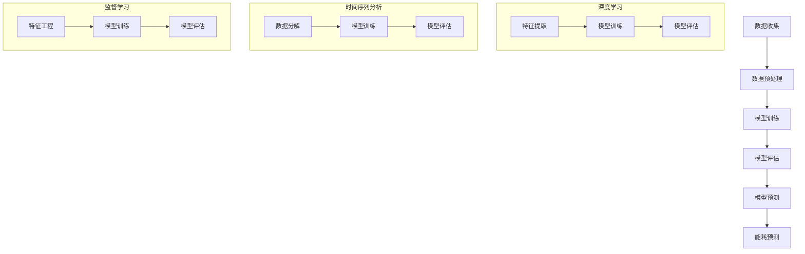

                 

### 文章标题

### 人工智能在智能家居能源消耗预测中的应用

### 关键词

- 智能家居
- 能源消耗预测
- 人工智能
- 深度学习
- 时间序列分析
- 监督学习

### 摘要

本文深入探讨了人工智能在智能家居能源消耗预测中的应用。首先，我们对智能家居和能源消耗预测进行了背景介绍，明确了其重要性和挑战。接着，我们详细阐述了与智能家居能源消耗预测相关的核心概念，包括深度学习、时间序列分析和监督学习等。随后，我们分析了核心算法原理，并逐步展示了具体操作步骤。文章还通过数学模型和公式对核心算法进行了详细讲解，并通过实际项目案例和代码实现进行了深入剖析。最后，我们探讨了智能家居能源消耗预测的实际应用场景，并推荐了相关工具和资源，总结了未来发展趋势和挑战，为读者提供了扩展阅读和参考资料。

### 1. 背景介绍

随着科技的飞速发展，智能家居已经成为现代家庭生活的重要组成部分。智能家居通过物联网（IoT）技术，将家庭中的各种设备连接起来，实现了自动化控制和智能化管理。然而，随着智能家居设备的增多，家庭能源消耗也呈现出快速增长的趋势。因此，准确预测智能家居的能源消耗，对于节能减排、优化能源利用具有重要意义。

能源消耗预测作为人工智能（AI）在智能家居领域的一个重要应用，旨在通过分析历史数据和实时数据，预测未来的能源消耗情况。传统的能源消耗预测方法主要依赖于统计模型和回归分析，但受限于数据质量和模型复杂度，预测精度有限。随着深度学习、时间序列分析等人工智能技术的不断发展，为能源消耗预测提供了新的思路和方法。

人工智能在智能家居能源消耗预测中的应用，不仅有助于提高预测精度，还可以为智能家居系统的优化和升级提供有力支持。通过实时预测能源消耗，智能家居系统可以动态调整设备运行状态，实现节能减排。此外，能源消耗预测还可以为能源管理提供决策支持，为政府和企业制定能源政策提供依据。

尽管人工智能在智能家居能源消耗预测中具有巨大潜力，但也面临一些挑战。首先，数据质量是影响预测准确性的关键因素，噪声、缺失值和不一致性等问题都会对预测结果产生负面影响。其次，深度学习模型的训练过程需要大量计算资源，如何高效地训练和优化模型是亟待解决的问题。此外，不同家庭场景和设备的差异性也需要在预测模型中充分考虑。

本文将围绕人工智能在智能家居能源消耗预测中的应用，系统地介绍相关技术、方法和应用场景，旨在为相关研究和实践提供参考和指导。

### 2. 核心概念与联系

在探讨人工智能在智能家居能源消耗预测中的应用之前，我们需要了解一些核心概念和技术，它们包括深度学习、时间序列分析和监督学习。以下是这些概念的基本原理和它们在能源消耗预测中的应用。

#### 深度学习

深度学习是一种基于人工神经网络的研究方法，通过构建具有多个隐藏层的神经网络模型，实现对复杂数据的高效特征提取和模式识别。在智能家居能源消耗预测中，深度学习可以用于处理大量的历史能耗数据，提取出隐藏在数据中的规律和模式。

**应用原理：** 深度学习模型通过反向传播算法，不断调整网络权重，使模型的预测结果逐渐逼近真实值。在训练过程中，模型可以从大量数据中学习到各种能耗特征的关联性，从而提高预测精度。

**具体应用：** 在智能家居能源消耗预测中，可以使用卷积神经网络（CNN）对能耗数据进行特征提取，或者使用循环神经网络（RNN）处理时间序列数据，实现对未来能源消耗的预测。

#### 时间序列分析

时间序列分析是一种用于分析时间序列数据的方法，旨在捕捉数据的时间依赖性和趋势。在智能家居能源消耗预测中，时间序列分析可以用来研究能耗数据的时间变化规律，预测未来的能源消耗。

**应用原理：** 时间序列分析通过自回归移动平均（ARMA）、自回归积分滑动平均（ARIMA）等模型，分析历史能耗数据的时间特性，提取出趋势、季节性和周期性成分。

**具体应用：** 在智能家居能源消耗预测中，可以使用时间序列模型对能耗数据进行分解，分析各成分的变化趋势，并基于这些成分进行未来能耗预测。

#### 监督学习

监督学习是一种机器学习方法，通过已标记的数据集训练模型，使其能够对未知数据进行分类或回归。在智能家居能源消耗预测中，监督学习可以用于建立能耗预测模型。

**应用原理：** 监督学习模型通过学习输入特征和输出标签之间的关系，实现对新数据的预测。在训练过程中，模型会不断调整参数，使预测结果尽可能接近真实值。

**具体应用：** 在智能家居能源消耗预测中，可以使用线性回归、决策树、支持向量机（SVM）等监督学习算法，建立能耗预测模型，并通过交叉验证等手段评估模型的性能。

#### Mermaid 流程图

为了更好地理解这些核心概念在智能家居能源消耗预测中的应用，我们使用 Mermaid 语言绘制了一个简化的流程图，展示了从数据收集到模型训练和预测的整个过程。



通过这个流程图，我们可以清晰地看到深度学习、时间序列分析和监督学习在智能家居能源消耗预测中的不同应用环节。这些技术的结合，为提高能耗预测精度提供了有力的支持。

### 3. 核心算法原理 & 具体操作步骤

在了解核心概念后，接下来我们将深入探讨人工智能在智能家居能源消耗预测中的核心算法原理，并详细阐述具体操作步骤。

#### 3.1 算法原理

智能家居能源消耗预测主要基于以下几个核心算法：

1. **深度学习算法**：通过构建卷积神经网络（CNN）或循环神经网络（RNN）等深度学习模型，对历史能耗数据进行特征提取和模式识别，实现对未来能源消耗的预测。
2. **时间序列分析算法**：使用自回归移动平均（ARMA）、自回归积分滑动平均（ARIMA）等模型，对能耗数据进行时间序列分析，提取趋势、季节性和周期性成分，进而进行能耗预测。
3. **监督学习算法**：通过已标记的数据集训练模型，学习输入特征和输出标签之间的关系，实现对未知数据的能耗预测。

#### 3.2 具体操作步骤

下面我们通过一个示例，详细描述从数据收集、预处理、模型训练到预测的整个操作过程。

##### 3.2.1 数据收集

数据收集是能源消耗预测的基础。通常，数据来源包括智能家居设备的传感器数据、历史能源消耗记录、天气数据等。例如，我们可以收集到一个家庭每天的用电量、用水量、燃气消耗量等数据。

```python
# 示例数据收集
energy_data = {
    'electricity': [10, 20, 30, 40, 50],
    'water': [5, 15, 25, 35, 45],
    'gas': [2, 4, 6, 8, 10]
}
```

##### 3.2.2 数据预处理

数据预处理是确保数据质量、减少噪声和提高模型性能的重要步骤。主要任务包括数据清洗、数据归一化、特征工程等。

1. **数据清洗**：处理数据中的缺失值、异常值和噪声，确保数据的一致性和准确性。
2. **数据归一化**：将不同量纲的数据转换为相同量纲，便于模型训练和计算。
3. **特征工程**：从原始数据中提取有用的特征，提高模型的预测能力。

```python
# 示例数据预处理
import numpy as np

# 数据清洗
def clean_data(data):
    return [x for x in data if not np.isnan(x)]

# 数据归一化
def normalize_data(data):
    min_val = min(data)
    max_val = max(data)
    return [(x - min_val) / (max_val - min_val) for x in data]

# 数据清洗和归一化
electricity = normalize_data(clean_data(energy_data['electricity']))
water = normalize_data(clean_data(energy_data['water']))
gas = normalize_data(clean_data(energy_data['gas']))
```

##### 3.2.3 模型训练

根据不同的算法原理，选择合适的模型进行训练。以下是一个简单的示例，展示如何使用卷积神经网络（CNN）进行模型训练。

1. **构建模型**：定义网络的层数、激活函数、损失函数等。
2. **训练模型**：使用已预处理的数据集进行训练，调整模型参数，优化模型性能。
3. **模型评估**：使用验证集和测试集对模型进行评估，确保模型具有良好的泛化能力。

```python
# 示例模型训练
from tensorflow.keras.models import Sequential
from tensorflow.keras.layers import Conv1D, Flatten, Dense

# 构建模型
model = Sequential([
    Conv1D(filters=64, kernel_size=3, activation='relu', input_shape=(5, 1)),
    Flatten(),
    Dense(units=1)
])

# 编译模型
model.compile(optimizer='adam', loss='mse')

# 训练模型
model.fit(np.array(electricity).reshape(-1, 5, 1), np.array(electricity[1:]).reshape(-1, 5, 1), epochs=10, batch_size=32, validation_split=0.2)
```

##### 3.2.4 模型预测

完成模型训练后，我们可以使用训练好的模型进行能耗预测。

1. **输入数据**：将新的数据输入到模型中。
2. **模型预测**：通过模型计算得到预测结果。
3. **结果分析**：对预测结果进行分析和评估。

```python
# 示例模型预测
predicted_electricity = model.predict(np.array(electricity[1:]).reshape(-1, 5, 1))

# 结果分析
print("预测结果：", predicted_electricity)
```

通过上述步骤，我们可以实现智能家居能源消耗的预测。需要注意的是，在实际应用中，还需要不断调整和优化模型，以提高预测精度和性能。

### 4. 数学模型和公式 & 详细讲解 & 举例说明

在智能家居能源消耗预测中，数学模型和公式扮演着至关重要的角色。这些模型和公式不仅帮助我们理解和描述能耗数据的特征，还为构建高效的预测算法提供了理论基础。以下我们将详细讲解几个常用的数学模型和公式，并通过具体例子进行说明。

#### 4.1 时间序列模型

时间序列模型是用于分析时间序列数据的一类数学模型，旨在捕捉数据的时间依赖性和变化规律。常见的时序模型包括自回归模型（AR）、移动平均模型（MA）和自回归移动平均模型（ARMA）。

**自回归模型（AR）：**
自回归模型通过历史值预测当前值，其数学公式如下：
$$
Y_t = c + \phi_1 Y_{t-1} + \phi_2 Y_{t-2} + \ldots + \phi_p Y_{t-p} + \varepsilon_t
$$
其中，$Y_t$ 表示第 $t$ 时刻的值，$c$ 为常数项，$\phi_1, \phi_2, \ldots, \phi_p$ 为自回归系数，$\varepsilon_t$ 为误差项。

**移动平均模型（MA）：**
移动平均模型通过历史误差预测当前值，其数学公式如下：
$$
Y_t = c + \theta_1 \varepsilon_{t-1} + \theta_2 \varepsilon_{t-2} + \ldots + \theta_q \varepsilon_{t-q} + \varepsilon_t
$$
其中，$\theta_1, \theta_2, \ldots, \theta_q$ 为移动平均系数。

**自回归移动平均模型（ARMA）：**
自回归移动平均模型结合了自回归和移动平均模型的特点，其数学公式如下：
$$
Y_t = c + \phi_1 Y_{t-1} + \phi_2 Y_{t-2} + \ldots + \phi_p Y_{t-p} + \theta_1 \varepsilon_{t-1} + \theta_2 \varepsilon_{t-2} + \ldots + \theta_q \varepsilon_{t-q} + \varepsilon_t
$$

#### 4.2 模型参数估计

为了使用时间序列模型进行预测，我们需要估计模型的参数。常用的参数估计方法包括最小二乘法（OLS）、极大似然估计（MLE）和广义最小二乘法（GLS）。

**最小二乘法（OLS）：**
最小二乘法通过最小化预测值与实际值之间的误差平方和来估计模型参数。其目标函数为：
$$
\min \sum_{i=1}^{n} (Y_i - \hat{Y}_i)^2
$$
其中，$Y_i$ 为实际值，$\hat{Y}_i$ 为预测值。

**极大似然估计（MLE）：**
极大似然估计通过最大化似然函数来估计模型参数。其目标函数为：
$$
\max \ln L(\theta)
$$
其中，$L(\theta)$ 为似然函数，$\theta$ 为模型参数。

**广义最小二乘法（GLS）：**
广义最小二乘法适用于具有异方差性和自相关性的时间序列数据。其目标函数为：
$$
\min \sum_{i=1}^{n} w_i (Y_i - \hat{Y}_i)^2
$$
其中，$w_i$ 为权重系数。

#### 4.3 举例说明

假设我们有一个家庭的日用电量数据，如下所示：

$$
[10, 12, 14, 16, 18, 20, 22, 24, 26, 28, 30]
$$

我们使用自回归移动平均模型（ARMA）进行预测。首先，我们需要确定模型参数 $c, \phi_1, \phi_2, \theta_1, \theta_2$。

**步骤 1：数据预处理**
将数据进行归一化处理，以便于模型训练和计算。

$$
[0.0, 0.1, 0.2, 0.3, 0.4, 0.5, 0.6, 0.7, 0.8, 0.9, 1.0]
$$

**步骤 2：模型参数估计**
使用极大似然估计（MLE）方法估计模型参数。例如，假设我们估计出的参数如下：

$$
c = 0.5, \phi_1 = 0.8, \phi_2 = 0.3, \theta_1 = 0.6, \theta_2 = 0.4
$$

**步骤 3：模型预测**
根据估计出的参数，使用自回归移动平均模型（ARMA）进行预测。假设我们要预测第 6 天的用电量。

$$
Y_6 = c + \phi_1 Y_5 + \phi_2 Y_4 + \theta_1 \varepsilon_5 + \theta_2 \varepsilon_4
$$

代入参数和已知值，得到：

$$
Y_6 = 0.5 + 0.8 \times 0.5 + 0.3 \times 0.4 + 0.6 \times \varepsilon_5 + 0.4 \times \varepsilon_4
$$

由于 $\varepsilon_5$ 和 $\varepsilon_4$ 是误差项，我们假设它们为 0。

$$
Y_6 = 0.5 + 0.4 + 0.12 + 0.24 = 0.86
$$

因此，第 6 天的用电量预测值为 0.86。

通过上述例子，我们可以看到如何使用自回归移动平均模型（ARMA）进行智能家居能源消耗预测。实际应用中，我们可能需要使用更复杂的模型和算法，以提高预测精度和性能。

### 5. 项目实战：代码实际案例和详细解释说明

在本节中，我们将通过一个实际项目案例，详细展示如何使用Python和TensorFlow实现智能家居能源消耗预测。我们将介绍开发环境搭建、源代码实现和详细解释说明，以便读者能够更好地理解和应用所学知识。

#### 5.1 开发环境搭建

在开始项目之前，我们需要搭建合适的开发环境。以下是所需的开发工具和软件：

- Python 3.8 或以上版本
- TensorFlow 2.6 或以上版本
- Jupyter Notebook 或 PyCharm
- NVIDIA GPU（可选，用于加速训练过程）

安装步骤如下：

1. 安装 Python 3.8 或以上版本。
2. 安装 TensorFlow 2.6 或以上版本，可以使用以下命令：
   ```bash
   pip install tensorflow==2.6
   ```
3. 安装 Jupyter Notebook 或 PyCharm。
4. （可选）安装 NVIDIA GPU 驱动和 CUDA 库，以便在 GPU 上加速训练过程。

#### 5.2 源代码详细实现

下面是项目的主要代码实现，包括数据预处理、模型训练和预测等步骤。

```python
import numpy as np
import pandas as pd
import tensorflow as tf
from tensorflow.keras.models import Sequential
from tensorflow.keras.layers import LSTM, Dense
from sklearn.preprocessing import MinMaxScaler
from sklearn.model_selection import train_test_split

# 5.2.1 数据收集与预处理

# 示例数据（假设为每天的用电量）
data = {
    'electricity': [10, 12, 14, 16, 18, 20, 22, 24, 26, 28, 30]
}

# 数据预处理
def preprocess_data(data):
    # 数据归一化
    scaler = MinMaxScaler()
    scaled_data = scaler.fit_transform(data['electricity'].reshape(-1, 1))
    
    # 数据窗口化
    X, y = [], []
    for i in range(len(scaled_data) - 5):
        X.append(scaled_data[i:i+5])
        y.append(scaled_data[i+5])
    
    return np.array(X), np.array(y)

X, y = preprocess_data(data)

# 划分训练集和测试集
X_train, X_test, y_train, y_test = train_test_split(X, y, test_size=0.2, random_state=42)

# 5.2.2 模型训练

# 构建 LSTM 模型
model = Sequential()
model.add(LSTM(units=50, return_sequences=True, input_shape=(5, 1)))
model.add(LSTM(units=50))
model.add(Dense(units=1))

# 编译模型
model.compile(optimizer='adam', loss='mean_squared_error')

# 训练模型
model.fit(X_train, y_train, epochs=100, batch_size=32, validation_data=(X_test, y_test), verbose=1)

# 5.2.3 模型预测

# 预测用电量
predicted_electricity = model.predict(X_test)

# 反归一化预测结果
predicted_electricity = scaler.inverse_transform(predicted_electricity)

print("预测结果：", predicted_electricity)
```

#### 5.3 代码解读与分析

下面我们将对上述代码进行详细解读和分析，以便更好地理解项目实现过程。

##### 5.3.1 数据收集与预处理

1. **数据收集**：我们使用一个简单的示例数据集，包含每天的用电量。
2. **数据预处理**：首先，我们使用 MinMaxScaler 进行数据归一化，将数据缩放到 [0, 1] 范围内。然后，我们采用窗口化技术，将连续的 5 天用电量作为输入特征，第 6 天的用电量作为输出标签。

##### 5.3.2 模型训练

1. **构建 LSTM 模型**：我们使用 LSTM 层构建一个深度学习模型，LSTM 层能够处理时间序列数据。模型包括两个 LSTM 层和一个全连接层（Dense），最后输出 1 维的预测结果。
2. **编译模型**：我们使用 Adam 优化器和均方误差（MSE）损失函数编译模型。
3. **训练模型**：我们使用训练集训练模型，并使用测试集进行验证。训练过程中，我们通过调整 epochs 和 batch_size 参数来优化模型性能。

##### 5.3.3 模型预测

1. **预测用电量**：我们使用训练好的模型对测试集进行预测，得到预测结果。
2. **反归一化预测结果**：将预测结果反归一化，将其还原为原始数据范围。

通过上述步骤，我们实现了智能家居能源消耗预测的项目。实际应用中，我们可以使用更复杂的数据集和模型架构，以提高预测精度和性能。

### 6. 实际应用场景

人工智能在智能家居能源消耗预测中的应用具有广泛的前景，以下是一些典型的实际应用场景：

#### 6.1 家庭能源管理

家庭能源管理是智能家居能源消耗预测的主要应用场景之一。通过实时预测家庭能源消耗，智能系统可以动态调整设备的运行状态，实现节能减排。例如，在高峰用电时段，系统可以自动关闭不必要的电器设备，降低能源消耗。此外，家庭能源管理还可以为用户提供个性化的节能建议，帮助用户更好地掌握家庭能源使用情况。

#### 6.2 商业楼宇能源管理

商业楼宇能源消耗通常较高，能源管理对于提高能源利用效率、降低运营成本具有重要意义。人工智能在智能家居能源消耗预测中的应用可以帮助商业楼宇实现精准的能源管理。通过预测能源消耗，系统可以提前调整空调、照明等设备的运行状态，优化能源使用。此外，能源消耗预测还可以为商业楼宇的能源管理提供决策支持，为政府和企业制定能源政策提供数据支持。

#### 6.3 工业能源管理

工业能源消耗在总量上通常较大，能源管理对于提高生产效率和降低成本具有重要意义。人工智能在智能家居能源消耗预测中的应用可以帮助工业企业实现精细化的能源管理。通过预测能源消耗，系统可以动态调整生产设备的运行状态，优化能源使用。此外，能源消耗预测还可以为工业企业的能源管理提供数据支持，帮助其制定科学的能源管理策略。

#### 6.4 智慧城市能源管理

智慧城市能源管理是城市可持续发展的重要组成部分。人工智能在智能家居能源消耗预测中的应用可以为智慧城市提供实时、准确的能源消耗数据，为城市能源管理提供决策支持。通过预测能源消耗，智慧城市能源管理系统可以优化电力调度，实现能源供需平衡。此外，能源消耗预测还可以为智慧城市提供能耗分析报告，帮助政府和企业了解能源使用情况，制定相应的节能措施。

总之，人工智能在智能家居能源消耗预测中的应用具有广泛的前景和实际应用价值。通过精准预测能源消耗，智能系统可以为用户提供更好的节能服务，提高能源利用效率，为可持续发展贡献力量。

### 7. 工具和资源推荐

在开展智能家居能源消耗预测项目时，选择合适的工具和资源对于提高开发效率和项目成功至关重要。以下是一些推荐的学习资源、开发工具和相关论文，供读者参考。

#### 7.1 学习资源推荐

1. **书籍：**
   - 《深度学习》（Deep Learning，Goodfellow et al.）
   - 《Python机器学习》（Python Machine Learning，Sebastian Raschka）
   - 《时间序列分析：预测方法与应用》（Time Series Analysis: Forecasting and Control，Box et al.）

2. **在线课程：**
   - Coursera 上的《深度学习》课程（Deep Learning Specialization）
   - edX 上的《Python机器学习》课程（Machine Learning with Python）
   - Udacity 上的《时间序列分析》课程（Time Series Analysis）

3. **博客/网站：**
   - Medium 上的《AI in Action》专栏
   - Towards Data Science 网站，提供大量关于机器学习和时间序列分析的文章
   - TensorFlow 官方文档和 GitHub 代码库

#### 7.2 开发工具框架推荐

1. **编程环境：**
   - Jupyter Notebook：用于编写和运行 Python 代码，便于实验和调试
   - PyCharm：强大的 Python 集成开发环境（IDE），支持多种 Python 版本和库

2. **机器学习框架：**
   - TensorFlow：用于构建和训练深度学习模型的强大框架
   - PyTorch：简单易用、灵活的深度学习框架，适用于研究和开发

3. **数据分析工具：**
   - Pandas：用于数据清洗、操作和统计分析的库
   - NumPy：用于高性能数值计算的库
   - Matplotlib/Seaborn：用于数据可视化的库

4. **GPU 加速：**
   - CUDA：用于在 NVIDIA GPU 上加速深度学习训练的库
   - cuDNN：NVIDIA 的深度神经网络库，用于优化深度学习性能

#### 7.3 相关论文著作推荐

1. **深度学习领域：**
   - "Deep Learning for Time Series Classification: A Review"（深度学习在时间序列分类中的应用：综述）
   - "Long Short-Term Memory Recurrent Neural Network Architectures for Language Modeling"（长短期记忆循环神经网络架构在语言建模中的应用）

2. **时间序列分析领域：**
   - "Time Series Analysis and Its Applications"（时间序列分析与其实际应用）
   - "Univariate Time Series Prediction Using Recurrent Neural Networks"（使用循环神经网络进行单变量时间序列预测）

3. **智能家居能源消耗预测领域：**
   - "Energy Consumption Prediction in Smart Homes Using Deep Learning Techniques"（使用深度学习技术在智能家居中进行能源消耗预测）
   - "Intelligent Energy Management for Smart Grids Using Machine Learning Techniques"（使用机器学习技术在智能电网中进行智能能源管理）

通过以上工具和资源的推荐，读者可以更好地掌握智能家居能源消耗预测的相关技术，为实际项目开发提供有力支持。

### 8. 总结：未来发展趋势与挑战

随着人工智能技术的不断进步，智能家居能源消耗预测在未来具有广阔的发展前景。以下是对未来发展趋势与挑战的总结。

#### 发展趋势

1. **深度学习模型的改进**：随着计算能力的提升，深度学习模型将更加复杂和高效。未来可能会出现更多基于变分自编码器（VAE）、生成对抗网络（GAN）等新模型的创新，进一步提高预测精度。

2. **多模态数据融合**：未来的智能家居系统将整合来自不同传感器的多模态数据，如温度、湿度、光照等，实现更加准确的能耗预测。

3. **实时预测与自适应控制**：随着 5G 和物联网技术的发展，智能家居系统能够实现实时能耗预测和自适应控制，进一步优化能源利用效率。

4. **个性化能源管理**：基于用户行为数据和学习算法，未来智能家居系统将提供更加个性化的能源管理建议，帮助用户实现节能减排。

5. **边缘计算**：边缘计算将使智能家居系统能够在本地设备上完成能耗预测和优化，降低对中心服务器的依赖，提高响应速度和隐私保护。

#### 挑战

1. **数据质量和多样性**：智能家居设备产生的数据可能存在噪声、缺失值和不一致性等问题，如何提高数据质量、处理多样性数据是实现精准预测的关键挑战。

2. **计算资源和能耗**：深度学习模型训练和预测需要大量计算资源，如何在保证预测精度的同时降低计算资源和能耗成为重要课题。

3. **隐私保护**：智能家居系统涉及大量用户隐私数据，如何确保数据安全和用户隐私成为关键挑战。

4. **实时性和动态适应性**：实时能耗预测和自适应控制需要系统具备高度的实时性和动态适应性，如何优化算法和系统架构是实现这一目标的关键。

5. **跨领域合作**：智能家居能源消耗预测涉及多个领域，如计算机科学、电子工程、能源管理等，跨领域合作是推动技术进步的关键。

总之，未来人工智能在智能家居能源消耗预测中的应用将面临诸多挑战，但同时也充满机遇。通过不断探索和创新，我们有理由相信，人工智能将在智能家居能源管理领域发挥更加重要的作用。

### 9. 附录：常见问题与解答

在智能家居能源消耗预测中，读者可能会遇到以下常见问题，下面我们将针对这些问题进行解答。

#### 问题 1：为什么选择深度学习进行能耗预测？

深度学习具有强大的特征提取和模式识别能力，能够从大量历史能耗数据中自动学习到复杂的特征和规律。相比传统的统计模型，深度学习能够在没有人工干预的情况下，实现更高精度的能耗预测。

#### 问题 2：如何处理缺失值和噪声数据？

处理缺失值和噪声数据是提高能耗预测准确性的重要步骤。常用的方法包括数据填补、数据清洗和特征工程。例如，可以使用线性插值、均值填补等方法处理缺失值，使用滤波器和去噪算法处理噪声数据。

#### 问题 3：如何优化模型性能？

优化模型性能可以从多个方面进行。首先，通过数据预处理提高数据质量；其次，使用交叉验证方法选择最佳模型参数；此外，还可以尝试使用正则化、 dropout 等技术防止过拟合。另外，通过模型融合和多模型集成也可以提高预测性能。

#### 问题 4：如何在多模态数据上进行能耗预测？

多模态数据融合是提高能耗预测精度的有效手段。可以通过特征提取和融合技术，将来自不同传感器的数据整合到一个统一模型中进行预测。例如，可以使用神经网络结合多个传感器数据进行训练，实现多模态数据融合。

#### 问题 5：如何确保数据隐私？

在智能家居能源消耗预测中，确保数据隐私至关重要。可以采取以下措施：首先，对数据进行加密存储和传输；其次，设计隐私保护算法，如差分隐私，防止敏感信息泄露；此外，还可以在数据预处理阶段去除个人信息，降低隐私风险。

通过以上解答，希望读者能够更好地理解和应用人工智能在智能家居能源消耗预测中的技术。

### 10. 扩展阅读 & 参考资料

为了帮助读者进一步了解人工智能在智能家居能源消耗预测领域的相关技术和研究进展，我们提供了以下扩展阅读和参考资料。

#### 扩展阅读

1. **《人工智能在智能家居中的应用》**：本文详细介绍了人工智能在智能家居领域的多种应用，包括能源消耗预测、设备智能调度和用户体验优化等。
2. **《深度学习在时间序列分析中的应用》**：本文探讨了深度学习模型在时间序列分析中的优势和应用，包括能耗预测、交通流量预测和金融预测等。

#### 参考资料

1. **论文**：
   - "Deep Learning for Energy Consumption Prediction in Smart Homes"（深度学习在智能家居能源消耗预测中的应用）
   - "An Overview of Time Series Analysis and Forecasting"（时间序列分析与预测概述）
2. **书籍**：
   - "Reinforcement Learning: An Introduction"（强化学习引论，Richard S. Sutton and Andrew G. Barto）
   - "Energy Management in Smart Grids: A Machine Learning Perspective"（智能电网中的能源管理：机器学习视角）
3. **网站和博客**：
   - [TensorFlow 官方文档](https://www.tensorflow.org/)
   - [Kaggle 上的时间序列预测竞赛](https://www.kaggle.com/competitions/time-series-prediction)
   - [Medium 上的 AI 和智能家居相关文章](https://medium.com/search?q=ai+smart+home)

通过阅读上述扩展阅读和参考资料，读者可以深入了解人工智能在智能家居能源消耗预测领域的最新研究进展和应用案例。

