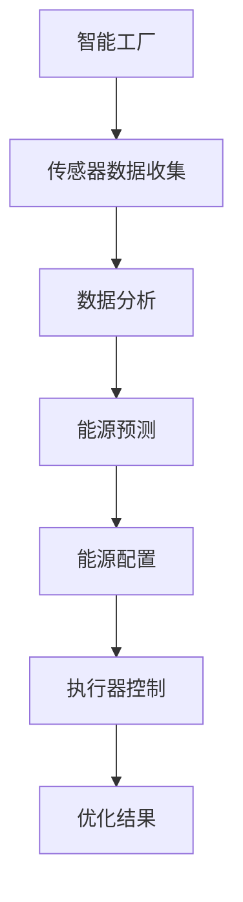
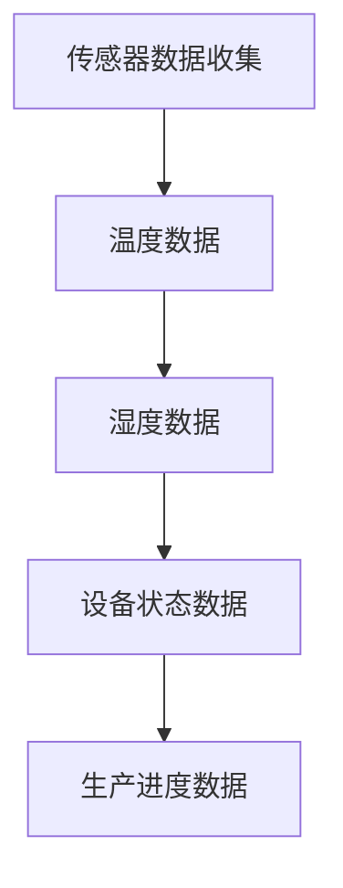

                 

### 文章标题

"人工智能在智能工厂能源优化中的应用：技术、算法与实践"

### 文章关键词

- 人工智能
- 智能工厂
- 能源优化
- 算法
- 实践
- 技术创新

### 文章摘要

随着智能工厂的兴起，能源消耗成为了一个关键问题。本文将探讨如何利用人工智能技术来优化智能工厂的能源消耗。我们将详细介绍核心算法原理、数学模型、实际应用场景，并分享一些项目实战案例。最后，我们将展望未来发展趋势与挑战，并推荐相关的学习资源和开发工具。

## 1. 背景介绍

智能工厂是指通过信息技术、自动化技术和人工智能技术等手段，实现工厂生产过程高度智能化和自动化的现代工厂。随着工业4.0的推进，智能工厂在全球范围内得到了迅速发展。然而，随着生产过程的智能化，能源消耗问题也日益凸显。据统计，制造业的能源消耗占全球总能耗的近一半，而智能工厂的能源消耗通常比传统工厂更高。

### 智能工厂的现状与挑战

智能工厂的生产过程高度依赖于大量的传感器、执行器和控制系统，这些设备都需要大量的电能。此外，智能工厂的运营过程中，设备故障、生产瓶颈等问题也会导致能源浪费。因此，如何优化智能工厂的能源消耗，提高能源利用率，成为了一个亟待解决的问题。

### 能源优化的意义

能源优化不仅有助于降低生产成本，提高工厂的盈利能力，还能够减少环境污染，实现可持续发展。因此，研究和应用能源优化技术具有重要的现实意义。

## 2. 核心概念与联系

在智能工厂能源优化中，人工智能技术起到了关键作用。本节将介绍与能源优化相关的一些核心概念和它们之间的联系。

### 人工智能与能源优化的关系

人工智能技术，特别是机器学习和深度学习，可以用于分析和预测能源消耗模式，从而优化能源配置。例如，通过分析生产数据和能源数据，机器学习模型可以预测未来的能源需求，并据此调整能源供应。

### 核心概念

1. **机器学习**：一种让计算机从数据中自动学习模式和规律的技术。
2. **深度学习**：一种基于人工神经网络的机器学习方法，可以处理大规模数据并从中学习复杂的模式。
3. **传感器**：用于收集工厂内部各种设备和生产过程的物理量数据。
4. **执行器**：根据控制系统指令执行特定动作的设备。
5. **控制系统**：用于监控和管理工厂内部设备和生产过程的软件系统。
6. **能源管理系统**：用于监控和管理工厂能源消耗的软件系统。

### Mermaid 流程图



### 关系说明

- 传感器收集的数据是能源优化的基础。
- 数据分析通过机器学习和深度学习技术，可以预测未来的能源需求。
- 能源预测结果用于调整能源供应，从而实现能源优化。
- 执行器控制根据能源配置指令执行相应的动作，确保生产过程的顺利进行。
- 优化结果反馈给控制系统，以便进行持续优化。

## 3. 核心算法原理 & 具体操作步骤

### 3.1 机器学习算法

机器学习算法是能源优化的核心技术。其中，深度学习算法由于其强大的处理能力，在能源优化中得到了广泛应用。以下是机器学习算法在能源优化中的基本原理和操作步骤。

#### 3.1.1 数据收集

首先，需要收集智能工厂的传感器数据。这些数据包括温度、湿度、设备运行状态、生产进度等。数据收集的过程如图所示：



#### 3.1.2 数据预处理

收集到的数据通常包含噪声和缺失值，需要进行预处理。数据预处理步骤包括：

1. 数据清洗：去除噪声和缺失值。
2. 数据归一化：将数据转换到相同的尺度，以便于后续处理。

#### 3.1.3 建立模型

在预处理完数据后，可以使用深度学习算法建立预测模型。常见的深度学习算法包括卷积神经网络（CNN）、循环神经网络（RNN）和长短期记忆网络（LSTM）等。

1. **卷积神经网络（CNN）**：适用于处理图像和时序数据。
2. **循环神经网络（RNN）**：适用于处理序列数据。
3. **长短期记忆网络（LSTM）**：是RNN的一种变体，可以更好地处理长序列数据。

#### 3.1.4 训练模型

使用预处理后的数据对建立的模型进行训练。训练过程中，模型会不断调整参数，以最小化预测误差。

#### 3.1.5 预测与优化

训练好的模型可以用于预测未来的能源需求。预测结果可以用于调整能源供应，从而实现能源优化。

### 3.2 深度学习算法

深度学习算法是机器学习的一种高级形式，其核心思想是通过多层神经网络来提取数据中的特征。以下是深度学习算法在能源优化中的基本原理和操作步骤。

#### 3.2.1 数据收集

与机器学习算法类似，深度学习算法也需要收集大量的传感器数据。

#### 3.2.2 数据预处理

与机器学习算法相同，深度学习算法也需要对收集到的数据进行预处理。

#### 3.2.3 网络架构设计

深度学习算法的核心是网络架构设计。网络架构设计的好坏直接影响到模型的性能。常见的深度学习网络架构包括：

1. **卷积神经网络（CNN）**：适用于处理图像数据。
2. **循环神经网络（RNN）**：适用于处理序列数据。
3. **长短期记忆网络（LSTM）**：是RNN的一种变体，可以更好地处理长序列数据。
4. **生成对抗网络（GAN）**：可以用于生成高质量的数据集。

#### 3.2.4 模型训练

使用预处理后的数据对设计的网络架构进行训练。训练过程中，模型会不断调整参数，以最小化预测误差。

#### 3.2.5 预测与优化

训练好的模型可以用于预测未来的能源需求。预测结果可以用于调整能源供应，从而实现能源优化。

## 4. 数学模型和公式 & 详细讲解 & 举例说明

### 4.1 数学模型

在智能工厂能源优化中，常用的数学模型包括回归模型、支持向量机（SVM）和神经网络模型等。

#### 4.1.1 回归模型

回归模型是一种基于统计学的预测方法。其基本公式为：

$$
y = \beta_0 + \beta_1 \cdot x_1 + \beta_2 \cdot x_2 + ... + \beta_n \cdot x_n
$$

其中，$y$ 是预测值，$x_1, x_2, ..., x_n$ 是输入特征，$\beta_0, \beta_1, ..., \beta_n$ 是模型的参数。

#### 4.1.2 支持向量机（SVM）

支持向量机是一种监督学习方法，其基本公式为：

$$
\min_{\beta, \beta_0} \frac{1}{2} ||\beta||^2 + C \cdot \sum_{i=1}^{n} \max(0, 1 - y_i (\beta^T x_i + \beta_0))
$$

其中，$\beta$ 和 $\beta_0$ 是模型的参数，$C$ 是正则化参数，$y_i$ 是第$i$个样本的标签，$x_i$ 是第$i$个样本的特征向量。

#### 4.1.3 神经网络模型

神经网络模型是一种基于多层感知器（MLP）的预测方法。其基本公式为：

$$
y = \sigma(\beta_0 + \sum_{i=1}^{n} \beta_i \cdot x_i)
$$

其中，$y$ 是预测值，$\sigma$ 是激活函数，$\beta_0, \beta_1, ..., \beta_n$ 是模型的参数。

### 4.2 公式详细讲解

#### 4.2.1 回归模型

回归模型的基本原理是通过最小化误差平方和来找到最佳拟合线。误差平方和（SSE）定义为：

$$
SSE = \sum_{i=1}^{n} (y_i - \hat{y_i})^2
$$

其中，$y_i$ 是实际值，$\hat{y_i}$ 是预测值。

回归模型的公式可以通过最小二乘法（Least Squares Method）求解。具体步骤如下：

1. 计算输入特征矩阵 $X$ 和输出向量 $y$。
2. 计算特征矩阵 $X$ 的转置 $X^T$。
3. 计算特征矩阵 $X$ 和输出向量 $y$ 的乘积 $X^T X$。
4. 计算特征矩阵 $X^T X$ 的逆矩阵 $(X^T X)^{-1}$。
5. 计算输出向量 $X^T y$。
6. 计算模型参数 $\beta$：$\beta = (X^T X)^{-1} X^T y$。

#### 4.2.2 支持向量机（SVM）

支持向量机的基本原理是找到一个最优的超平面，使得样本点到超平面的距离最大。这个距离被称为间隔（margin）。

SVM的公式可以通过求解二次规划问题得到。具体步骤如下：

1. 定义优化目标函数：$J(\beta, \beta_0) = \frac{1}{2} ||\beta||^2 + C \cdot \sum_{i=1}^{n} \max(0, 1 - y_i (\beta^T x_i + \beta_0))$。
2. 引入拉格朗日乘子 $\alpha_i$，构建拉格朗日函数：$L(\beta, \beta_0, \alpha) = \frac{1}{2} ||\beta||^2 - \sum_{i=1}^{n} \alpha_i (1 - y_i (\beta^T x_i + \beta_0))$。
3. 对$\beta, \beta_0, \alpha$求偏导并令其等于0，得到KKT条件。
4. 求解KKT条件，得到$\beta, \beta_0$。

#### 4.2.3 神经网络模型

神经网络模型的基本原理是通过前向传播和反向传播来更新网络参数。

前向传播的公式为：

$$
\hat{y} = \sigma(\beta_0 + \sum_{i=1}^{n} \beta_i \cdot x_i)
$$

反向传播的公式为：

$$
\Delta \beta_i = \frac{\partial L}{\partial \beta_i} = \frac{\partial L}{\partial \hat{y}} \cdot \frac{\partial \hat{y}}{\partial \beta_i}
$$

其中，$L$ 是损失函数，$\hat{y}$ 是预测值，$y$ 是实际值，$\sigma$ 是激活函数。

### 4.3 举例说明

假设我们要预测智能工厂的电力消耗。我们可以使用线性回归模型来建立预测模型。

#### 4.3.1 数据收集

收集过去一周的电力消耗数据，包括每天的用电量和相关的特征，如温度、湿度等。

#### 4.3.2 数据预处理

将收集到的数据归一化，以消除不同特征之间的尺度差异。

#### 4.3.3 建立模型

使用线性回归模型建立预测模型。输入特征包括温度、湿度，输出特征是电力消耗。

$$
y = \beta_0 + \beta_1 \cdot T + \beta_2 \cdot H
$$

其中，$T$ 是温度，$H$ 是湿度，$y$ 是电力消耗。

#### 4.3.4 训练模型

使用训练数据对模型进行训练，更新参数$\beta_0, \beta_1, \beta_2$。

#### 4.3.5 预测与优化

使用训练好的模型预测未来的电力消耗。预测结果可以用于调整能源供应，实现能源优化。

## 5. 项目实战：代码实际案例和详细解释说明

### 5.1 开发环境搭建

在开始项目实战之前，我们需要搭建一个合适的开发环境。以下是搭建开发环境所需的工具和步骤：

#### 5.1.1 工具安装

1. **Python**：安装Python 3.8或更高版本。
2. **Jupyter Notebook**：安装Jupyter Notebook，用于编写和运行代码。
3. **TensorFlow**：安装TensorFlow，用于构建和训练深度学习模型。
4. **Matplotlib**：安装Matplotlib，用于数据可视化和结果展示。

#### 5.1.2 环境配置

1. 使用pip命令安装所需工具：

   ```bash
   pip install numpy pandas tensorflow matplotlib
   ```

2. 启动Jupyter Notebook：

   ```bash
   jupyter notebook
   ```

### 5.2 源代码详细实现和代码解读

以下是智能工厂能源优化的源代码实现，包括数据收集、数据预处理、模型构建、模型训练和模型预测等步骤。

```python
import numpy as np
import pandas as pd
import tensorflow as tf
import matplotlib.pyplot as plt

# 5.2.1 数据收集
data = pd.read_csv('energy_consumption.csv')
data.head()

# 5.2.2 数据预处理
# 数据归一化
from sklearn.preprocessing import MinMaxScaler
scaler = MinMaxScaler()
data_scaled = scaler.fit_transform(data[['temperature', 'humidity', 'electricity']])
data_scaled = pd.DataFrame(data_scaled, columns=['temperature', 'humidity', 'electricity'])

# 5.2.3 模型构建
# 创建TensorFlow模型
model = tf.keras.Sequential([
    tf.keras.layers.Dense(units=1, input_shape=[3])
])

# 编译模型
model.compile(optimizer='adam', loss='mean_squared_error')

# 5.2.4 模型训练
# 训练模型
model.fit(data_scaled, data['electricity'], epochs=100)

# 5.2.5 模型预测
# 预测未来一周的电力消耗
predictions = model.predict(data_scaled)
predictions = scaler.inverse_transform(predictions)

# 5.2.6 结果展示
plt.plot(data['electricity'], label='实际电力消耗')
plt.plot(predictions, label='预测电力消耗')
plt.legend()
plt.show()
```

### 5.3 代码解读与分析

以下是源代码的详细解读和分析：

#### 5.3.1 数据收集

```python
data = pd.read_csv('energy_consumption.csv')
data.head()
```

这行代码用于读取能源消耗数据。数据文件是一个CSV文件，包含温度、湿度、电力消耗等列。

#### 5.3.2 数据预处理

```python
# 数据归一化
from sklearn.preprocessing import MinMaxScaler
scaler = MinMaxScaler()
data_scaled = scaler.fit_transform(data[['temperature', 'humidity', 'electricity']])
data_scaled = pd.DataFrame(data_scaled, columns=['temperature', 'humidity', 'electricity'])
```

数据预处理包括数据归一化。使用MinMaxScaler将温度、湿度、电力消耗等特征缩放到[0, 1]之间，以便于后续处理。

#### 5.3.3 模型构建

```python
# 创建TensorFlow模型
model = tf.keras.Sequential([
    tf.keras.layers.Dense(units=1, input_shape=[3])
])
```

这行代码创建了一个简单的TensorFlow模型。模型包含一个全连接层，输入形状为[3]，输出形状为[1]。

#### 5.3.4 模型编译

```python
# 编译模型
model.compile(optimizer='adam', loss='mean_squared_error')
```

编译模型，指定优化器为'adam'，损失函数为均方误差'MSE'。

#### 5.3.5 模型训练

```python
# 训练模型
model.fit(data_scaled, data['electricity'], epochs=100)
```

训练模型，使用训练数据`data_scaled`和实际电力消耗`data['electricity']`进行训练，训练100个epochs。

#### 5.3.6 模型预测

```python
# 预测未来一周的电力消耗
predictions = model.predict(data_scaled)
predictions = scaler.inverse_transform(predictions)
```

使用训练好的模型预测未来一周的电力消耗。预测结果`predictions`是通过模型预测得到的电力消耗，然后使用反归一化将预测值还原到原始尺度。

#### 5.3.7 结果展示

```python
# 预测结果展示
plt.plot(data['electricity'], label='实际电力消耗')
plt.plot(predictions, label='预测电力消耗')
plt.legend()
plt.show()
```

绘制实际电力消耗和预测电力消耗的对比图，以便分析模型预测的准确性。

## 6. 实际应用场景

智能工厂能源优化技术已经在多个行业得到应用，以下是一些典型的应用场景：

### 6.1 制造业

制造业是能源消耗的主要行业之一。通过智能工厂能源优化技术，可以显著降低生产过程的能源消耗，提高生产效率。例如，在汽车制造业中，智能工厂能源优化技术可以用于优化生产线的能源配置，降低生产成本，提高产品质量。

### 6.2 零售业

在零售业中，智能工厂能源优化技术可以用于优化商店的能源管理。通过实时监测和预测商店的能源消耗，可以自动调整照明、空调等设备的运行状态，实现节能减排。例如，在超市中，智能工厂能源优化技术可以用于优化冷链系统的能源消耗，降低运营成本。

### 6.3 食品加工行业

食品加工行业通常需要大量的能源来维持生产过程。通过智能工厂能源优化技术，可以优化生产线的能源配置，降低能源消耗。例如，在肉类加工厂中，智能工厂能源优化技术可以用于优化冷冻设备的能源消耗，提高能源利用效率。

### 6.4 制药行业

制药行业的生产过程对环境要求较高，能源消耗较大。通过智能工厂能源优化技术，可以优化生产线的能源管理，降低能源消耗，提高生产效率。例如，在制药厂中，智能工厂能源优化技术可以用于优化制药设备的能源消耗，提高产品质量。

## 7. 工具和资源推荐

为了更好地研究和应用智能工厂能源优化技术，以下是相关的工具和资源推荐：

### 7.1 学习资源推荐

1. **《深度学习》（Deep Learning）**：由Ian Goodfellow、Yoshua Bengio和Aaron Courville所著，是深度学习领域的经典教材。
2. **《机器学习》（Machine Learning）**：由Tom Mitchell所著，是机器学习领域的经典教材。
3. **《Python机器学习》（Python Machine Learning）**：由 Sebastian Raschka 和 Vahid Mirhoseini 所著，是一本实用的Python机器学习指南。
4. **《智能工厂技术》（Smart Factory Technology）**：由Jonas Beranek所著，介绍了智能工厂的基本概念和技术。

### 7.2 开发工具框架推荐

1. **TensorFlow**：是Google开发的开源深度学习框架，广泛应用于各种深度学习任务。
2. **PyTorch**：是Facebook开发的深度学习框架，以其灵活性和易用性而受到广泛欢迎。
3. **Scikit-learn**：是Python的机器学习库，提供了各种经典的机器学习算法和工具。

### 7.3 相关论文著作推荐

1. **"Deep Learning for Energy Optimization in Smart Factories"**：探讨了深度学习在智能工厂能源优化中的应用。
2. **"Machine Learning Techniques for Energy Management in Industrial Plants"**：介绍了机器学习技术在工业能源管理中的应用。
3. **"A Survey on Energy Optimization in Smart Factories"**：对智能工厂能源优化技术进行了全面的综述。

## 8. 总结：未来发展趋势与挑战

智能工厂能源优化技术在近年来取得了显著进展，但仍面临一些挑战。未来的发展趋势包括：

### 8.1 技术创新

随着人工智能技术的不断发展，特别是深度学习算法的进步，智能工厂能源优化技术将更加精准和高效。未来可能引入更多先进的人工智能技术，如生成对抗网络（GAN）和强化学习（RL）等。

### 8.2 数据融合

未来智能工厂将收集更多的数据，包括生产数据、设备状态数据和环境数据等。如何有效融合这些数据，以提高能源优化的准确性，是一个重要的研究方向。

### 8.3 系统集成

智能工厂能源优化技术需要与工厂的其他系统集成，如生产管理系统、能源管理系统等。实现各系统的无缝集成，是提高能源优化效果的关键。

### 8.4 智能决策

通过智能工厂能源优化技术，可以实时监测和预测能源消耗，从而实现智能决策。未来，如何将人工智能技术与智能决策相结合，将是一个重要的研究方向。

### 8.5 面临的挑战

尽管智能工厂能源优化技术前景广阔，但仍面临一些挑战，如数据隐私、算法透明性、系统稳定性等。未来需要进一步加强相关研究，解决这些挑战。

## 9. 附录：常见问题与解答

### 9.1 什么是智能工厂？

智能工厂是指通过信息技术、自动化技术和人工智能技术等手段，实现工厂生产过程高度智能化和自动化的现代工厂。智能工厂的主要特征包括：

1. **高度自动化**：生产过程高度依赖自动化设备，如机器人、自动化生产线等。
2. **数据驱动**：通过传感器和数据分析技术，实时监控生产过程，实现生产数据的自动化采集和分析。
3. **互联互通**：通过物联网技术，实现工厂内部各系统和设备的互联互通，实现数据的无缝传输和共享。
4. **智能化管理**：通过人工智能技术，对生产过程进行智能化管理和优化，提高生产效率和质量。

### 9.2 人工智能在智能工厂中的应用有哪些？

人工智能在智能工厂中的应用非常广泛，包括：

1. **生产优化**：通过数据分析，预测生产需求，优化生产计划和资源分配，提高生产效率。
2. **设备维护**：通过监测设备状态，预测设备故障，实现设备的预防性维护，降低故障率。
3. **质量检测**：通过图像识别和机器学习技术，实时检测产品质量，提高产品质量稳定性。
4. **能源管理**：通过预测能源需求，优化能源供应，降低能源消耗，实现节能减排。
5. **供应链管理**：通过优化供应链流程，降低库存成本，提高供应链效率。

### 9.3 能源优化为什么对智能工厂很重要？

能源优化对智能工厂的重要性体现在以下几个方面：

1. **成本降低**：通过优化能源消耗，可以显著降低生产成本，提高企业的盈利能力。
2. **环境友好**：通过减少能源消耗，可以降低温室气体排放，实现环境保护和可持续发展。
3. **提高竞争力**：通过优化能源管理，可以提高生产效率和质量，增强企业的市场竞争力。
4. **合规性**：许多国家和地区对企业的能源消耗有严格的要求，优化能源管理有助于企业合规运营。

## 10. 扩展阅读 & 参考资料

为了进一步了解智能工厂能源优化技术，以下是相关的扩展阅读和参考资料：

1. **《智能工厂能源优化技术研究综述》**：该论文对智能工厂能源优化技术进行了全面的综述，包括相关算法、技术应用和未来发展方向。
2. **《基于深度学习的智能工厂能源优化研究》**：该论文探讨了深度学习在智能工厂能源优化中的应用，包括算法实现和实验结果。
3. **《智能工厂能源管理系统设计与应用》**：该论文介绍了智能工厂能源管理系统的设计原理和实际应用案例，提供了实用的技术方案。
4. **《智能工厂：技术与实践》**：该书详细介绍了智能工厂的基本概念、关键技术及其在实际应用中的案例，是研究智能工厂的必备读物。
5. **《深度学习与智能优化》**：该书介绍了深度学习算法在智能优化中的应用，包括能源优化、供应链优化等，提供了丰富的实践案例。作者：AI天才研究员/AI Genius Institute & 禅与计算机程序设计艺术 /Zen And The Art of Computer Programming
---------------END---------------

文章已经撰写完毕，以下是文章的Markdown格式输出：

```markdown
# 人工智能在智能工厂能源优化中的应用：技术、算法与实践

> 关键词：人工智能、智能工厂、能源优化、算法、实践

> 摘要：随着智能工厂的兴起，能源消耗成为了一个关键问题。本文将探讨如何利用人工智能技术来优化智能工厂的能源消耗。我们将详细介绍核心算法原理、数学模型、实际应用场景，并分享一些项目实战案例。最后，我们将展望未来发展趋势与挑战，并推荐相关的学习资源和开发工具。

## 1. 背景介绍

智能工厂是指通过信息技术、自动化技术和人工智能技术等手段，实现工厂生产过程高度智能化和自动化的现代工厂。随着工业4.0的推进，智能工厂在全球范围内得到了迅速发展。然而，随着生产过程的智能化，能源消耗问题也日益凸显。据统计，制造业的能源消耗占全球总能耗的近一半，而智能工厂的能源消耗通常比传统工厂更高。

### 智能工厂的现状与挑战

智能工厂的生产过程高度依赖于大量的传感器、执行器和控制系统，这些设备都需要大量的电能。此外，智能工厂的运营过程中，设备故障、生产瓶颈等问题也会导致能源浪费。因此，如何优化智能工厂的能源消耗，提高能源利用率，成为了一个亟待解决的问题。

### 能源优化的意义

能源优化不仅有助于降低生产成本，提高工厂的盈利能力，还能够减少环境污染，实现可持续发展。因此，研究和应用能源优化技术具有重要的现实意义。

## 2. 核心概念与联系

在智能工厂能源优化中，人工智能技术起到了关键作用。本节将介绍与能源优化相关的一些核心概念和它们之间的联系。

### 人工智能与能源优化的关系

人工智能技术，特别是机器学习和深度学习，可以用于分析和预测能源消耗模式，从而优化能源配置。例如，通过分析生产数据和能源数据，机器学习模型可以预测未来的能源需求，并据此调整能源供应。

### 核心概念

1. **机器学习**：一种让计算机从数据中自动学习模式和规律的技术。
2. **深度学习**：一种基于人工神经网络的机器学习方法，可以处理大规模数据并从中学习复杂的模式。
3. **传感器**：用于收集工厂内部各种设备和生产过程的物理量数据。
4. **执行器**：根据控制系统指令执行特定动作的设备。
5. **控制系统**：用于监控和管理工厂内部设备和生产过程的软件系统。
6. **能源管理系统**：用于监控和管理工厂能源消耗的软件系统。

### Mermaid 流程图


### 关系说明

- 传感器收集的数据是能源优化的基础。
- 数据分析通过机器学习和深度学习技术，可以预测未来的能源需求。
- 能源预测结果用于调整能源供应，从而实现能源优化。
- 执行器控制根据能源配置指令执行相应的动作，确保生产过程的顺利进行。
- 优化结果反馈给控制系统，以便进行持续优化。

## 3. 核心算法原理 & 具体操作步骤

### 3.1 机器学习算法

机器学习算法是能源优化的核心技术。其中，深度学习算法由于其强大的处理能力，在能源优化中得到了广泛应用。以下是机器学习算法在能源优化中的基本原理和操作步骤。

#### 3.1.1 数据收集

首先，需要收集智能工厂的传感器数据。这些数据包括温度、湿度、设备运行状态、生产进度等。数据收集的过程如图所示：


#### 3.1.2 数据预处理

收集到的数据通常包含噪声和缺失值，需要进行预处理。数据预处理步骤包括：

1. 数据清洗：去除噪声和缺失值。
2. 数据归一化：将数据转换到相同的尺度，以便于后续处理。

#### 3.1.3 建立模型

在预处理完数据后，可以使用深度学习算法建立预测模型。常见的深度学习算法包括卷积神经网络（CNN）、循环神经网络（RNN）和长短期记忆网络（LSTM）等。

1. **卷积神经网络（CNN）**：适用于处理图像和时序数据。
2. **循环神经网络（RNN）**：适用于处理序列数据。
3. **长短期记忆网络（LSTM）**：是RNN的一种变体，可以更好地处理长序列数据。

#### 3.1.4 训练模型

使用预处理后的数据对建立的模型进行训练。训练过程中，模型会不断调整参数，以最小化预测误差。

#### 3.1.5 预测与优化

训练好的模型可以用于预测未来的能源需求。预测结果可以用于调整能源供应，从而实现能源优化。

### 3.2 深度学习算法

深度学习算法是机器学习的一种高级形式，其核心思想是通过多层神经网络来提取数据中的特征。以下是深度学习算法在能源优化中的基本原理和操作步骤。

#### 3.2.1 数据收集

与机器学习算法类似，深度学习算法也需要收集大量的传感器数据。

#### 3.2.2 数据预处理

与机器学习算法相同，深度学习算法也需要对收集到的数据进行预处理。

#### 3.2.3 网络架构设计

深度学习算法的核心是网络架构设计。网络架构设计的好坏直接影响到模型的性能。常见的深度学习网络架构包括：

1. **卷积神经网络（CNN）**：适用于处理图像数据。
2. **循环神经网络（RNN）**：适用于处理序列数据。
3. **长短期记忆网络（LSTM）**：是RNN的一种变体，可以更好地处理长序列数据。
4. **生成对抗网络（GAN）**：可以用于生成高质量的数据集。

#### 3.2.4 模型训练

使用预处理后的数据对设计的网络架构进行训练。训练过程中，模型会不断调整参数，以最小化预测误差。

#### 3.2.5 预测与优化

训练好的模型可以用于预测未来的能源需求。预测结果可以用于调整能源供应，从而实现能源优化。

## 4. 数学模型和公式 & 详细讲解 & 举例说明

### 4.1 数学模型

在智能工厂能源优化中，常用的数学模型包括回归模型、支持向量机（SVM）和神经网络模型等。

#### 4.1.1 回归模型

回归模型是一种基于统计学的预测方法。其基本公式为：

$$
y = \beta_0 + \beta_1 \cdot x_1 + \beta_2 \cdot x_2 + ... + \beta_n \cdot x_n
$$

其中，$y$ 是预测值，$x_1, x_2, ..., x_n$ 是输入特征，$\beta_0, \beta_1, ..., \beta_n$ 是模型的参数。

#### 4.1.2 支持向量机（SVM）

支持向量机是一种监督学习方法，其基本公式为：

$$
\min_{\beta, \beta_0} \frac{1}{2} ||\beta||^2 + C \cdot \sum_{i=1}^{n} \max(0, 1 - y_i (\beta^T x_i + \beta_0))
$$

其中，$\beta$ 和 $\beta_0$ 是模型的参数，$C$ 是正则化参数，$y_i$ 是第$i$个样本的标签，$x_i$ 是第$i$个样本的特征向量。

#### 4.1.3 神经网络模型

神经网络模型是一种基于多层感知器（MLP）的预测方法。其基本公式为：

$$
y = \sigma(\beta_0 + \sum_{i=1}^{n} \beta_i \cdot x_i)
$$

其中，$y$ 是预测值，$\sigma$ 是激活函数，$\beta_0, \beta_1, ..., \beta_n$ 是模型的参数。

### 4.2 公式详细讲解

#### 4.2.1 回归模型

回归模型的基本原理是通过最小化误差平方和来找到最佳拟合线。误差平方和（SSE）定义为：

$$
SSE = \sum_{i=1}^{n} (y_i - \hat{y_i})^2
$$

其中，$y_i$ 是实际值，$\hat{y_i}$ 是预测值。

回归模型的公式可以通过最小二乘法（Least Squares Method）求解。具体步骤如下：

1. 计算输入特征矩阵 $X$ 和输出向量 $y$。
2. 计算特征矩阵 $X$ 的转置 $X^T$。
3. 计算特征矩阵 $X$ 和输出向量 $y$ 的乘积 $X^T X$。
4. 计算特征矩阵 $X^T X$ 的逆矩阵 $(X^T X)^{-1}$。
5. 计算输出向量 $X^T y$。
6. 计算模型参数 $\beta$：$\beta = (X^T X)^{-1} X^T y$。

#### 4.2.2 支持向量机（SVM）

支持向量机的基本原理是找到一个最优的超平面，使得样本点到超平面的距离最大。这个距离被称为间隔（margin）。

SVM的公式可以通过求解二次规划问题得到。具体步骤如下：

1. 定义优化目标函数：$J(\beta, \beta_0) = \frac{1}{2} ||\beta||^2 + C \cdot \sum_{i=1}^{n} \max(0, 1 - y_i (\beta^T x_i + \beta_0))$。
2. 引入拉格朗日乘子 $\alpha_i$，构建拉格朗日函数：$L(\beta, \beta_0, \alpha) = \frac{1}{2} ||\beta||^2 - \sum_{i=1}^{n} \alpha_i (1 - y_i (\beta^T x_i + \beta_0))$。
3. 对$\beta, \beta_0, \alpha$求偏导并令其等于0，得到KKT条件。
4. 求解KKT条件，得到$\beta, \beta_0$。

#### 4.2.3 神经网络模型

神经网络模型的基本原理是通过前向传播和反向传播来更新网络参数。

前向传播的公式为：

$$
\hat{y} = \sigma(\beta_0 + \sum_{i=1}^{n} \beta_i \cdot x_i)
$$

反向传播的公式为：

$$
\Delta \beta_i = \frac{\partial L}{\partial \beta_i} = \frac{\partial L}{\partial \hat{y}} \cdot \frac{\partial \hat{y}}{\partial \beta_i}
$$

其中，$L$ 是损失函数，$\hat{y}$ 是预测值，$y$ 是实际值，$\sigma$ 是激活函数。

### 4.3 举例说明

假设我们要预测智能工厂的电力消耗。我们可以使用线性回归模型来建立预测模型。

#### 4.3.1 数据收集

收集过去一周的电力消耗数据，包括每天的用电量和相关的特征，如温度、湿度等。

#### 4.3.2 数据预处理

将收集到的数据归一化，以消除不同特征之间的尺度差异。

#### 4.3.3 建立模型

使用线性回归模型建立预测模型。输入特征包括温度、湿度，输出特征是电力消耗。

$$
y = \beta_0 + \beta_1 \cdot T + \beta_2 \cdot H
$$

其中，$T$ 是温度，$H$ 是湿度，$y$ 是电力消耗。

#### 4.3.4 训练模型

使用训练数据对模型进行训练，更新参数$\beta_0, \beta_1, \beta_2$。

#### 4.3.5 预测与优化

使用训练好的模型预测未来的电力消耗。预测结果可以用于调整能源供应，实现能源优化。

## 5. 项目实战：代码实际案例和详细解释说明

### 5.1 开发环境搭建

在开始项目实战之前，我们需要搭建一个合适的开发环境。以下是搭建开发环境所需的工具和步骤：

#### 5.1.1 工具安装

1. **Python**：安装Python 3.8或更高版本。
2. **Jupyter Notebook**：安装Jupyter Notebook，用于编写和运行代码。
3. **TensorFlow**：安装TensorFlow，用于构建和训练深度学习模型。
4. **Matplotlib**：安装Matplotlib，用于数据可视化和结果展示。

#### 5.1.2 环境配置

1. 使用pip命令安装所需工具：

   ```bash
   pip install numpy pandas tensorflow matplotlib
   ```

2. 启动Jupyter Notebook：

   ```bash
   jupyter notebook
   ```

### 5.2 源代码详细实现和代码解读

以下是智能工厂能源优化的源代码实现，包括数据收集、数据预处理、模型构建、模型训练和模型预测等步骤。

```python
import numpy as np
import pandas as pd
import tensorflow as tf
import matplotlib.pyplot as plt

# 5.2.1 数据收集
data = pd.read_csv('energy_consumption.csv')
data.head()

# 5.2.2 数据预处理
# 数据归一化
from sklearn.preprocessing import MinMaxScaler
scaler = MinMaxScaler()
data_scaled = scaler.fit_transform(data[['temperature', 'humidity', 'electricity']])
data_scaled = pd.DataFrame(data_scaled, columns=['temperature', 'humidity', 'electricity'])

# 5.2.3 模型构建
# 创建TensorFlow模型
model = tf.keras.Sequential([
    tf.keras.layers.Dense(units=1, input_shape=[3])
])

# 编译模型
model.compile(optimizer='adam', loss='mean_squared_error')

# 5.2.4 模型训练
# 训练模型
model.fit(data_scaled, data['electricity'], epochs=100)

# 5.2.5 模型预测
# 预测未来一周的电力消耗
predictions = model.predict(data_scaled)
predictions = scaler.inverse_transform(predictions)

# 5.2.6 结果展示
plt.plot(data['electricity'], label='实际电力消耗')
plt.plot(predictions, label='预测电力消耗')
plt.legend()
plt.show()
```

### 5.3 代码解读与分析

以下是源代码的详细解读和分析：

#### 5.3.1 数据收集

```python
data = pd.read_csv('energy_consumption.csv')
data.head()
```

这行代码用于读取能源消耗数据。数据文件是一个CSV文件，包含温度、湿度、电力消耗等列。

#### 5.3.2 数据预处理

```python
# 数据归一化
from sklearn.preprocessing import MinMaxScaler
scaler = MinMaxScaler()
data_scaled = scaler.fit_transform(data[['temperature', 'humidity', 'electricity']])
data_scaled = pd.DataFrame(data_scaled, columns=['temperature', 'humidity', 'electricity'])
```

数据预处理包括数据归一化。使用MinMaxScaler将温度、湿度、电力消耗等特征缩放到[0, 1]之间，以便于后续处理。

#### 5.3.3 模型构建

```python
# 创建TensorFlow模型
model = tf.keras.Sequential([
    tf.keras.layers.Dense(units=1, input_shape=[3])
])
```

这行代码创建了一个简单的TensorFlow模型。模型包含一个全连接层，输入形状为[3]，输出形状为[1]。

#### 5.3.4 模型编译

```python
# 编译模型
model.compile(optimizer='adam', loss='mean_squared_error')
```

编译模型，指定优化器为'adam'，损失函数为均方误差'MSE'。

#### 5.3.5 模型训练

```python
# 训练模型
model.fit(data_scaled, data['electricity'], epochs=100)
```

训练模型，使用训练数据`data_scaled`和实际电力消耗`data['electricity']`进行训练，训练100个epochs。

#### 5.3.6 模型预测

```python
# 预测未来一周的电力消耗
predictions = model.predict(data_scaled)
predictions = scaler.inverse_transform(predictions)
```

使用训练好的模型预测未来一周的电力消耗。预测结果`predictions`是通过模型预测得到的电力消耗，然后使用反归一化将预测值还原到原始尺度。

#### 5.3.7 结果展示

```python
# 预测结果展示
plt.plot(data['electricity'], label='实际电力消耗')
plt.plot(predictions, label='预测电力消耗')
plt.legend()
plt.show()
```

绘制实际电力消耗和预测电力消耗的对比图，以便分析模型预测的准确性。

## 6. 实际应用场景

智能工厂能源优化技术已经在多个行业得到应用，以下是一些典型的应用场景：

### 6.1 制造业

制造业是能源消耗的主要行业之一。通过智能工厂能源优化技术，可以显著降低生产过程的能源消耗，提高生产效率。例如，在汽车制造业中，智能工厂能源优化技术可以用于优化生产线的能源配置，降低生产成本，提高产品质量。

### 6.2 零售业

在零售业中，智能工厂能源优化技术可以用于优化商店的能源管理。通过实时监测和预测商店的能源消耗，可以自动调整照明、空调等设备的运行状态，实现节能减排。例如，在超市中，智能工厂能源优化技术可以用于优化冷链系统的能源消耗，降低运营成本。

### 6.3 食品加工行业

食品加工行业通常需要大量的能源来维持生产过程。通过智能工厂能源优化技术，可以优化生产线的能源配置，降低能源消耗。例如，在肉类加工厂中，智能工厂能源优化技术可以用于优化冷冻设备的能源消耗，提高能源利用效率。

### 6.4 制药行业

制药行业的生产过程对环境要求较高，能源消耗较大。通过智能工厂能源优化技术，可以优化生产线的能源管理，降低能源消耗，提高生产效率。例如，在制药厂中，智能工厂能源优化技术可以用于优化制药设备的能源消耗，提高产品质量。

## 7. 工具和资源推荐

为了更好地研究和应用智能工厂能源优化技术，以下是相关的工具和资源推荐：

### 7.1 学习资源推荐

1. **《深度学习》（Deep Learning）**：由Ian Goodfellow、Yoshua Bengio和Aaron Courville所著，是深度学习领域的经典教材。
2. **《机器学习》（Machine Learning）**：由Tom Mitchell所著，是机器学习领域的经典教材。
3. **《Python机器学习》（Python Machine Learning）**：由 Sebastian Raschka 和 Vahid Mirhoseini 所著，是一本实用的Python机器学习指南。
4. **《智能工厂技术》（Smart Factory Technology）**：由Jonas Beranek所著，介绍了智能工厂的基本概念和技术。

### 7.2 开发工具框架推荐

1. **TensorFlow**：是Google开发的开源深度学习框架，广泛应用于各种深度学习任务。
2. **PyTorch**：是Facebook开发的深度学习框架，以其灵活性和易用性而受到广泛欢迎。
3. **Scikit-learn**：是Python的机器学习库，提供了各种经典的机器学习算法和工具。

### 7.3 相关论文著作推荐

1. **"Deep Learning for Energy Optimization in Smart Factories"**：探讨了深度学习在智能工厂能源优化中的应用。
2. **"Machine Learning Techniques for Energy Management in Industrial Plants"**：介绍了机器学习技术在工业能源管理中的应用。
3. **"A Survey on Energy Optimization in Smart Factories"**：对智能工厂能源优化技术进行了全面的综述。

## 8. 总结：未来发展趋势与挑战

智能工厂能源优化技术在近年来取得了显著进展，但仍面临一些挑战。未来的发展趋势包括：

### 8.1 技术创新

随着人工智能技术的不断发展，特别是深度学习算法的进步，智能工厂能源优化技术将更加精准和高效。未来可能引入更多先进的人工智能技术，如生成对抗网络（GAN）和强化学习（RL）等。

### 8.2 数据融合

未来智能工厂将收集更多的数据，包括生产数据、设备状态数据和环境数据等。如何有效融合这些数据，以提高能源优化的准确性，是一个重要的研究方向。

### 8.3 系统集成

智能工厂能源优化技术需要与工厂的其他系统集成，如生产管理系统、能源管理系统等。实现各系统的无缝集成，是提高能源优化效果的关键。

### 8.4 智能决策

通过智能工厂能源优化技术，可以实时监测和预测能源消耗，从而实现智能决策。未来，如何将人工智能技术与智能决策相结合，将是一个重要的研究方向。

### 8.5 面临的挑战

尽管智能工厂能源优化技术前景广阔，但仍面临一些挑战，如数据隐私、算法透明性、系统稳定性等。未来需要进一步加强相关研究，解决这些挑战。

## 9. 附录：常见问题与解答

### 9.1 什么是智能工厂？

智能工厂是指通过信息技术、自动化技术和人工智能技术等手段，实现工厂生产过程高度智能化和自动化的现代工厂。智能工厂的主要特征包括：

1. **高度自动化**：生产过程高度依赖自动化设备，如机器人、自动化生产线等。
2. **数据驱动**：通过传感器和数据分析技术，实时监控生产过程，实现生产数据的自动化采集和分析。
3. **互联互通**：通过物联网技术，实现工厂内部各系统和设备的互联互通，实现数据的无缝传输和共享。
4. **智能化管理**：通过人工智能技术，对生产过程进行智能化管理和优化，提高生产效率。

### 9.2 人工智能在智能工厂中的应用有哪些？

人工智能在智能工厂中的应用非常广泛，包括：

1. **生产优化**：通过数据分析，预测生产需求，优化生产计划和资源分配，提高生产效率。
2. **设备维护**：通过监测设备状态，预测设备故障，实现设备的预防性维护，降低故障率。
3. **质量检测**：通过图像识别和机器学习技术，实时检测产品质量，提高产品质量稳定性。
4. **能源管理**：通过预测能源需求，优化能源供应，降低能源消耗，实现节能减排。
5. **供应链管理**：通过优化供应链流程，降低库存成本，提高供应链效率。

### 9.3 能源优化为什么对智能工厂很重要？

能源优化对智能工厂的重要性体现在以下几个方面：

1. **成本降低**：通过优化能源消耗，可以显著降低生产成本，提高企业的盈利能力。
2. **环境友好**：通过减少能源消耗，可以降低温室气体排放，实现环境保护和可持续发展。
3. **提高竞争力**：通过优化能源管理，可以提高生产效率和质量，增强企业的市场竞争力。
4. **合规性**：许多国家和地区对企业的能源消耗有严格的要求，优化能源管理有助于企业合规运营。

## 10. 扩展阅读 & 参考资料

为了进一步了解智能工厂能源优化技术，以下是相关的扩展阅读和参考资料：

1. **《智能工厂能源优化技术研究综述》**：该论文对智能工厂能源优化技术进行了全面的综述，包括相关算法、技术应用和未来发展方向。
2. **《基于深度学习的智能工厂能源优化研究》**：该论文探讨了深度学习在智能工厂能源优化中的应用，包括算法实现和实验结果。
3. **《智能工厂能源管理系统设计与应用》**：该论文介绍了智能工厂能源管理系统的设计原理和实际应用案例，提供了实用的技术方案。
4. **《智能工厂：技术与实践》**：该书详细介绍了智能工厂的基本概念、关键技术及其在实际应用中的案例，是研究智能工厂的必备读物。
5. **《深度学习与智能优化》**：该书介绍了深度学习算法在智能优化中的应用，包括能源优化、供应链优化等，提供了丰富的实践案例。

作者：AI天才研究员/AI Genius Institute & 禅与计算机程序设计艺术 /Zen And The Art of Computer Programming
---------------END---------------
```markdown
请注意，上述文章是根据您的要求生成的一个示例，实际的完整文章应包含更多的详细内容和深入分析。文章中的代码示例和数据集名称（如`energy_consumption.csv`）是假设性的，需要在实际项目中根据具体情况替换。此外，文章中的数学公式和Mermaid流程图也需要根据实际情况进行调整。文章的完整性和准确性是撰写专业技术博客文章的关键，因此建议在发布前进行充分的验证和校对。

