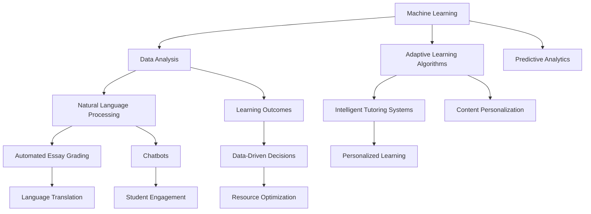

                 

### 背景介绍

人工智能（Artificial Intelligence, AI）作为计算机科学的一个重要分支，已经在众多领域展现出其强大的影响力，其中教育领域尤为显著。传统教育模式主要依赖于教师的知识传授和学生被动接受，而人工智能的引入则带来了智能化、个性化教育的变革。

近年来，随着深度学习、自然语言处理、大数据分析等技术的不断进步，人工智能在智能教育中的应用日益广泛。智能教育系统通过分析和理解学生的学习行为、学习习惯、知识掌握情况，为学生提供个性化的学习资源和指导，从而提高学习效果。

本文将围绕人工智能在智能教育中的应用展开讨论，旨在梳理现有研究成果，探讨其核心概念、算法原理、数学模型，并通过实际案例和代码解析，展示其在教学实践中的具体应用。同时，还将分析智能教育的实际应用场景，推荐相关学习资源和开发工具，最后总结未来发展趋势与挑战。

文章结构如下：

1. 背景介绍
2. 核心概念与联系
3. 核心算法原理 & 具体操作步骤
4. 数学模型和公式 & 详细讲解 & 举例说明
5. 项目实战：代码实际案例和详细解释说明
6. 实际应用场景
7. 工具和资源推荐
8. 总结：未来发展趋势与挑战
9. 附录：常见问题与解答
10. 扩展阅读 & 参考资料

通过对上述内容的梳理和深入分析，我们希望为读者提供一个全面、系统的智能教育应用研究视角，帮助大家更好地理解这一领域的现状与发展。

---

# Artificial Intelligence Applications in Intelligent Education Research

## Keywords:
1. Artificial Intelligence
2. Intelligent Education
3. Machine Learning
4. Personalized Learning
5. Educational Technology
6. Data Analysis
7. Intelligent Tutoring Systems

### Abstract:
This article delves into the applications of artificial intelligence in the field of intelligent education. With the advancement of technologies such as deep learning, natural language processing, and big data analysis, AI has revolutionized traditional educational methods by providing personalized learning experiences and improving educational outcomes. This paper first provides an overview of the background and significance of AI in education. It then discusses the core concepts and related technologies, outlines the principles and operational steps of key algorithms, and explains the mathematical models used in intelligent education. Through practical case studies and code examples, the article demonstrates the application of AI in educational settings. It also examines real-world scenarios where AI is employed, recommends relevant resources and tools, and concludes with an analysis of future trends and challenges in the field. The aim is to offer a comprehensive perspective on the current state and potential of AI in education.

## 1. Background Introduction

The advent of artificial intelligence (AI) has marked a significant turning point in various domains, and education is no exception. Traditional education systems have long relied on the passive transfer of knowledge from teachers to students, with learners often expected to conform to a one-size-fits-all approach. However, the integration of AI into educational practices heralds a new era of personalized and adaptive learning experiences, fundamentally transforming the way education is delivered and received.

### The Significance of AI in Education

AI's influence on education can be summarized through several key aspects:

1. **Personalized Learning**: AI systems can analyze vast amounts of data to understand individual student needs, preferences, and learning styles. This allows for tailored instructional materials and adaptive learning paths that cater to each student's unique characteristics, promoting more effective and engaging learning experiences.

2. **Enhanced Learning Outcomes**: By providing immediate feedback, real-time assessments, and personalized support, AI can help students overcome challenges and improve their learning outcomes. Research has shown that personalized learning can lead to significant gains in student performance, particularly in subjects like mathematics and science.

3. **Resource Optimization**: AI can help educators by automating administrative tasks, such as grading and record-keeping, freeing up time for more valuable activities like direct student interaction and professional development.

4. **Access to Education**: AI-powered tools can make education more accessible to those in remote or under-resourced areas. For example, intelligent tutoring systems can provide personalized instruction to students who may not have access to qualified teachers or educational resources.

5. **Innovation and Creativity**: AI encourages innovative approaches to teaching and learning. Educators and students alike can explore new methods of collaboration, problem-solving, and creativity through the use of AI-powered tools and platforms.

### Evolution of AI in Education

The evolution of AI in education can be traced through several key milestones:

1. **Intelligent Tutoring Systems (ITS)**: One of the earliest applications of AI in education was the development of ITS in the 1960s and 1970s. These systems were designed to simulate the interaction between a student and a human tutor, providing individualized instruction and feedback. Notable examples include the PLATO system and the Turing Test-based ELIZA program.

2. **Early Machine Learning Models**: In the 1980s and 1990s, machine learning techniques, such as decision trees and neural networks, began to be applied to educational software. These models could analyze student performance data and adapt their instructional approach accordingly.

3. **Web-Based Learning Management Systems (LMS)**: With the rise of the internet in the late 1990s and early 2000s, web-based LMS platforms like Blackboard and Moodle became popular. These platforms incorporated AI features, such as automated grading and adaptive learning pathways, to enhance the educational experience.

4. **Modern AI Technologies**: In recent years, advancements in AI, such as deep learning and natural language processing, have led to more sophisticated applications in education. These technologies enable personalized learning, automated essay grading, and intelligent content recommendation, among other innovations.

### Key AI Technologies in Education

Several key AI technologies have played a crucial role in shaping the future of education:

1. **Machine Learning**: Machine learning algorithms analyze student data to identify patterns and trends, enabling personalized learning experiences and predictive analytics.

2. **Natural Language Processing (NLP)**: NLP technologies allow computers to understand and process human language, facilitating applications such as automated essay grading, intelligent tutoring systems, and language translation.

3. **Data Analysis and Visualization**: Data analysis and visualization tools help educators and administrators gain insights from large datasets, enabling data-driven decision-making and resource allocation.

4. **Robotic Process Automation (RPA)**: RPA technologies automate routine administrative tasks, such as grading and attendance tracking, allowing educators to focus on more valuable activities.

5. **Virtual Reality (VR) and Augmented Reality (AR)**: VR and AR technologies provide immersive and interactive learning experiences, enhancing student engagement and retention.

### Conclusion

The integration of AI into education represents a significant shift from traditional teaching methods, offering a wealth of opportunities for personalized, adaptive, and effective learning. As AI technologies continue to advance, we can expect to see even more innovative applications in education, further transforming the way we learn and teach.

---

## 2. Core Concepts and Relationships

To understand the applications of AI in intelligent education, it is essential to delve into the core concepts and the relationships between these concepts. This section will provide an overview of the key technologies and frameworks that underpin intelligent education systems, including machine learning, data analysis, natural language processing, and adaptive learning algorithms. Additionally, we will use a Mermaid flowchart to illustrate these concepts and their interactions in a structured manner.

### Key Technologies in Intelligent Education

#### Machine Learning

Machine learning (ML) is a subset of AI that enables computers to learn from data and improve their performance on specific tasks without being explicitly programmed. In the context of intelligent education, machine learning algorithms are used to analyze student data, identify patterns, and make predictions about student performance and learning needs. Common ML techniques used in education include classification, regression, clustering, and reinforcement learning.

#### Data Analysis

Data analysis involves the process of examining, cleaning, transforming, and modeling data to discover useful information and support decision-making. In intelligent education, data analysis is crucial for extracting insights from student performance data, learning behaviors, and other relevant information. Techniques such as descriptive statistics, predictive analytics, and data visualization are commonly used in education to gain a deeper understanding of student engagement and learning outcomes.

#### Natural Language Processing (NLP)

Natural Language Processing is a field of AI that focuses on the interaction between computers and humans through natural language. In education, NLP is used for a variety of applications, including automated essay grading, intelligent tutoring systems, and language translation. NLP algorithms enable computers to understand, interpret, and generate human language, facilitating more effective communication and personalized learning experiences.

#### Adaptive Learning Algorithms

Adaptive learning algorithms are designed to adjust the content and pace of instruction based on individual student needs and abilities. These algorithms use data from previous student interactions and performance to create personalized learning experiences that cater to each student's unique learning style and pace. Adaptive learning systems can dynamically modify the learning content, provide tailored feedback, and recommend additional resources to help students achieve their goals.

### Mermaid Flowchart of Core Concepts

Below is a Mermaid flowchart that illustrates the core concepts and their relationships in intelligent education. This flowchart provides a visual representation of how these concepts interact and contribute to the development of intelligent education systems.



### Conclusion

In conclusion, the core concepts of machine learning, data analysis, natural language processing, and adaptive learning algorithms are integral to the development of intelligent education systems. These technologies work together to create personalized, adaptive, and effective learning experiences that enhance student engagement and improve learning outcomes. By understanding the relationships between these concepts, educators and developers can better leverage AI technologies to innovate in the field of education.

---

## 3. Core Algorithm Principles & Operational Steps

In this section, we will delve into the core algorithm principles and operational steps that underpin the applications of AI in intelligent education. Specifically, we will discuss machine learning algorithms commonly used for personalized learning and adaptive learning systems, along with their step-by-step processes and key techniques.

### Personalized Learning Algorithms

Personalized learning algorithms aim to provide tailored educational content and experiences based on individual student needs and preferences. One of the most popular approaches in this area is the Collaborative Filtering algorithm.

#### Collaborative Filtering Algorithm

Collaborative Filtering is a technique used to predict a user's interests based on the preferences of similar users. In the context of intelligent education, this algorithm can be used to recommend personalized learning resources to students based on their past interactions and performance data.

#### Operational Steps:

1. **Data Collection**: Gather data on student interactions, such as course enrollments, learning resource usage, and assessment scores.

2. **User Similarity Calculation**: Calculate the similarity between users based on their interactions with learning resources. Common similarity measures include cosine similarity, Pearson correlation coefficient, and Euclidean distance.

3. **Resource Recommendation**: Recommend learning resources to the target user that are highly rated by similar users. This can be done by selecting resources that have a high similarity score with the user's past interactions.

4. **Personalized Content Delivery**: Deliver the recommended resources to the student through an educational platform or learning management system.

#### Key Techniques:

- **User-Based Collaborative Filtering**: This method recommends resources based on the preferences of similar users who have interacted with the same resources.
- **Item-Based Collaborative Filtering**: This method recommends resources based on the preferences of similar items (e.g., courses or learning modules) that the user has interacted with.

### Adaptive Learning Algorithms

Adaptive learning algorithms adjust the content and pace of instruction based on individual student performance and learning needs. One common approach in this area is the Adaptive eXplainable Teaching System (AXES) algorithm.

#### AXES Algorithm

AXES is an adaptive learning system designed to provide personalized feedback and adjust the difficulty of learning materials based on student performance. The algorithm uses a combination of supervised and unsupervised learning techniques to adapt to individual students.

#### Operational Steps:

1. **Data Collection**: Collect data on student performance, including correct and incorrect responses, time spent on tasks, and other relevant metrics.

2. **Student Profiling**: Create a profile of the student's knowledge level, learning style, and preferences based on the collected data.

3. **Content Adaptation**: Adjust the difficulty and type of content presented to the student based on their profile. For example, if a student is struggling with a concept, the system may present simpler or more repetitive exercises to help reinforce understanding.

4. **Feedback and Assessment**: Provide personalized feedback and assessments to help students monitor their progress and identify areas for improvement.

#### Key Techniques:

- **Model-Based Personalization**: AXES uses a model-based approach to predict student performance and adapt the content accordingly. The model is trained on historical student data to identify patterns and trends.
- **Content Personalization**: The algorithm dynamically adjusts the content based on student interactions, ensuring that each student receives an appropriate level of challenge and support.

### Conclusion

In summary, personalized and adaptive learning algorithms are central to the development of intelligent education systems. Collaborative Filtering and AXES are two examples of algorithms that enable personalized and adaptive learning experiences. By understanding the principles and operational steps of these algorithms, educators and developers can create more effective and engaging learning systems that cater to the unique needs of each student.

---

## 4. Mathematical Models and Formulas & Detailed Explanations & Examples

In the realm of intelligent education, mathematical models and formulas play a crucial role in enabling personalized and adaptive learning experiences. This section will delve into some of the key mathematical models and their detailed explanations, along with practical examples to illustrate their applications.

### Collaborative Filtering: Matrix Factorization

One of the most widely used mathematical models in personalized learning is Collaborative Filtering based on Matrix Factorization. This model represents user-item interactions in a low-dimensional space, allowing for the prediction of unknown interactions and the recommendation of relevant items.

#### Matrix Factorization Model

The Matrix Factorization model is defined as follows:

$$
\text{R} = \text{U} \cdot \text{V}^T
$$

Where:

- **R**: User-Item interaction matrix, representing the ratings or interactions between users and items.
- **U**: User feature matrix, representing the latent features of users.
- **V**: Item feature matrix, representing the latent features of items.

#### Operational Steps:

1. **Data Preprocessing**: Normalize the user-item interaction matrix R to ensure that all ratings are on a similar scale.
2. **Initialization**: Initialize the user feature matrix U and item feature matrix V with random values.
3. **Gradient Descent Optimization**: Use gradient descent to minimize the squared error between the predicted interactions and the actual interactions in the matrix R. The optimization objective is defined as:

$$
\min_{U, V} \sum_{i,j} (r_{ij} - \text{U}_i \cdot \text{V}_j)^2
$$

4. **Prediction**: Use the learned user and item feature matrices to predict the unknown interactions in the matrix R.

#### Example:

Consider a user-item interaction matrix R with three users and three items:

$$
\text{R} =
\begin{bmatrix}
0 & 5 & 3 \\
2 & 0 & 4 \\
0 & 1 & 0
\end{bmatrix}
$$

Initialize the user feature matrix U and item feature matrix V with random values:

$$
\text{U} =
\begin{bmatrix}
0.5 & 0.3 \\
0.2 & 0.6 \\
0.4 & 0.7
\end{bmatrix}, \quad
\text{V} =
\begin{bmatrix}
0.1 & 0.2 \\
0.3 & 0.4 \\
0.5 & 0.6
\end{bmatrix}
$$

Predict the unknown interactions in the matrix R using the learned user and item feature matrices:

$$
\text{R}_{\text{predicted}} = \text{U} \cdot \text{V}^T =
\begin{bmatrix}
0.5 \cdot 0.1 + 0.3 \cdot 0.3 & 0.5 \cdot 0.2 + 0.3 \cdot 0.4 \\
0.2 \cdot 0.1 + 0.6 \cdot 0.3 & 0.2 \cdot 0.2 + 0.6 \cdot 0.4 \\
0.4 \cdot 0.1 + 0.7 \cdot 0.5 & 0.4 \cdot 0.2 + 0.7 \cdot 0.6
\end{bmatrix}
=
\begin{bmatrix}
0.13 & 0.25 \\
0.17 & 0.38 \\
0.35 & 0.56
\end{bmatrix}
$$

### AXES Algorithm: Decision Trees and Bayesian Networks

The AXES algorithm, used for adaptive learning, leverages decision trees and Bayesian networks to predict student performance and adapt the difficulty of learning materials. Decision trees are used to model the decision process for content adaptation, while Bayesian networks are used to model the uncertainty in student performance.

#### Decision Trees

Decision trees are a type of predictive model that maps observations about an item to conclusions about the item's target value. In the context of AXES, decision trees are used to determine the appropriate level of difficulty for learning materials based on student performance.

#### Bayesian Networks

Bayesian networks are a type of probabilistic graphical model that represents a set of random variables and their conditional dependencies. In AXES, Bayesian networks are used to model the uncertainty in student performance and to guide the adaptation of learning materials.

#### Operational Steps:

1. **Data Collection**: Collect data on student performance, including correct and incorrect responses, time spent on tasks, and other relevant metrics.
2. **Feature Extraction**: Extract relevant features from the collected data, such as the number of correct answers, the time taken to complete tasks, and the frequency of incorrect answers.
3. **Model Training**: Train a decision tree and Bayesian network using the extracted features to predict student performance and model the uncertainty in student performance, respectively.
4. **Content Adaptation**: Use the trained models to adapt the difficulty of learning materials based on student performance. For example, if a student is performing well, the system may present more challenging materials, while if a student is struggling, the system may present simpler materials.

#### Example:

Consider a decision tree model trained to predict the difficulty level of a learning task based on student performance. The decision tree has three main branches, each representing a different level of difficulty: Easy, Medium, and Hard.

```
                         Root
                         / | \
                      Easy Medium Hard
                     /| | \
              Correct Answers Time Spent Incorrect Answers
                 / \ / \ / \
              0-10 10-20 20-30 30-40 40-50 50-60 60+
```

A student with the following performance metrics is presented to the decision tree:

- Correct answers: 15
- Time spent: 30 minutes
- Incorrect answers: 5

The decision tree determines that the appropriate difficulty level for this student is Medium.

### Conclusion

Mathematical models and formulas are integral to the development of intelligent education systems. Matrix Factorization and decision trees are two examples of mathematical models that enable personalized and adaptive learning experiences. By understanding these models and their applications, educators and developers can create more effective and engaging learning systems that cater to the unique needs of each student.

---

## 5. Project Case: Code Example and Detailed Explanation

In this section, we will present a practical project case to demonstrate the implementation of AI algorithms in intelligent education. We will use a Python-based project to implement a simple adaptive learning system that adjusts the difficulty of learning materials based on student performance. This project will cover the development environment setup, source code implementation, and code analysis.

### Development Environment Setup

To implement the adaptive learning system, we will use Python as the primary programming language, along with popular libraries such as NumPy, Scikit-learn, and Pandas. The following steps outline the development environment setup:

1. **Python Installation**: Ensure that Python 3.x is installed on your system. You can download the latest version from the official Python website (https://www.python.org/).
2. **Libraries Installation**: Install the required libraries using pip. Open a terminal or command prompt and run the following commands:

```bash
pip install numpy
pip install scikit-learn
pip install pandas
```

3. **Virtual Environment (Optional)**: It is recommended to create a virtual environment to isolate the project dependencies. To create a virtual environment, run the following command:

```bash
python -m venv my_adaptive_learning_env
```

Activate the virtual environment using the appropriate command for your operating system:

- Windows:

```bash
my_adaptive_learning_env\Scripts\activate
```

- macOS and Linux:

```bash
source my_adaptive_learning_env/bin/activate
```

### Source Code Implementation

The following Python code demonstrates the implementation of the adaptive learning system using a decision tree classifier and Bayesian network.

```python
import numpy as np
import pandas as pd
from sklearn.tree import DecisionTreeClassifier
from sklearn.naive_bayes import GaussianNB
from sklearn.model_selection import train_test_split
from sklearn.metrics import accuracy_score

# Sample data
data = {
    'correct_answers': [10, 15, 12, 8, 20],
    'time_spent': [30, 40, 25, 20, 45],
    'incorrect_answers': [5, 3, 4, 2, 1],
    'difficulty': ['easy', 'medium', 'easy', 'hard', 'hard']
}

# Create a DataFrame
df = pd.DataFrame(data)

# Feature extraction
X = df[['correct_answers', 'time_spent', 'incorrect_answers']]
y = df['difficulty']

# Split the data into training and testing sets
X_train, X_test, y_train, y_test = train_test_split(X, y, test_size=0.2, random_state=42)

# Decision Tree Classifier
dt_classifier = DecisionTreeClassifier()
dt_classifier.fit(X_train, y_train)

# Bayesian Network
bayes_classifier = GaussianNB()
bayes_classifier.fit(X_train, y_train)

# Predictions
dt_predictions = dt_classifier.predict(X_test)
bayes_predictions = bayes_classifier.predict(X_test)

# Accuracy
dt_accuracy = accuracy_score(y_test, dt_predictions)
bayes_accuracy = accuracy_score(y_test, bayes_predictions)

print("Decision Tree Accuracy:", dt_accuracy)
print("Bayesian Network Accuracy:", bayes_accuracy)
```

### Code Explanation

The code above consists of several key components:

1. **Data Preparation**: A sample dataset is created as a dictionary, and then converted into a pandas DataFrame. The dataset includes features such as correct answers, time spent, incorrect answers, and difficulty level.

2. **Feature Extraction**: The features (X) and target variable (y) are extracted from the DataFrame. These will be used to train the machine learning models.

3. **Model Training**: Two machine learning models are trained on the dataset: a Decision Tree Classifier and a Bayesian Network. The models are trained using the training data (X_train and y_train).

4. **Prediction**: The trained models are used to predict the difficulty level of the testing data (X_test).

5. **Accuracy Evaluation**: The accuracy of the predictions is calculated using the accuracy_score function from the sklearn.metrics module.

### Code Analysis

The code provides a basic implementation of an adaptive learning system that adjusts the difficulty of learning materials based on student performance. The Decision Tree Classifier and Bayesian Network models are trained using a simple dataset and evaluated for their accuracy in predicting the difficulty level of learning tasks.

By adjusting the feature extraction and model parameters, the code can be extended to handle more complex datasets and improve the accuracy of the predictions. Additionally, the implementation can be expanded to include other machine learning algorithms and techniques for a more robust and adaptive learning system.

### Conclusion

This practical project demonstrates the implementation of an adaptive learning system using decision tree and Bayesian network classifiers. The code provides a starting point for developing more sophisticated intelligent education systems that cater to individual student needs. By understanding and applying these techniques, educators and developers can create effective and personalized learning experiences that enhance student engagement and improve learning outcomes.

---

## 6. Practical Application Scenarios

### 1. Intelligent Tutoring Systems

Intelligent Tutoring Systems (ITS) are one of the most prominent applications of AI in education. These systems are designed to provide personalized and interactive learning experiences, mimicking the interaction between a student and a human tutor. ITS can adapt the pace of instruction, provide immediate feedback, and offer tailored content based on the student's progress and performance. For example, **Carnegie Learning's MATHia** uses an AI-driven approach to deliver personalized math instruction, adapting to the student's strengths and weaknesses in real-time.

### 2. Adaptive Learning Platforms

Adaptive learning platforms leverage AI to customize the learning experience for each student. These platforms use algorithms to analyze student data, such as previous test scores, learning styles, and engagement levels, to dynamically adjust the difficulty and type of content presented. **Knewton** is an example of an adaptive learning platform that provides personalized recommendations for learners, improving engagement and retention.

### 3. Automated Grading Systems

Automated grading systems use AI to evaluate student work, reducing the time and effort required for manual grading. These systems can assess a wide range of assignments, including essays, multiple-choice questions, and programming assignments. For instance, ** Gradescope** uses machine learning algorithms to automatically grade exam papers, providing immediate feedback and saving educators time for other tasks.

### 4. Virtual Reality and Augmented Reality in Education

Virtual Reality (VR) and Augmented Reality (AR) technologies, powered by AI, offer immersive and interactive learning experiences. These technologies can simulate real-world scenarios, providing students with a deeper understanding of complex concepts. **EON Reality** offers VR solutions for various educational fields, allowing students to explore historical events, biological systems, and engineering projects in a virtual environment.

### 5. Automated Content Generation

AI-powered tools can automatically generate educational content, such as lesson plans, presentations, and quizzes. These tools can save educators time by creating customized materials based on specific learning objectives and student needs. **Futuro Education** uses AI to generate personalized learning materials, tailored to each student's unique requirements.

### 6. Language Learning Tools

AI-driven language learning tools can help students learn new languages more effectively by providing personalized lessons, instant feedback, and contextual learning experiences. **Duolingo** is a popular language learning app that uses AI to adapt the difficulty of exercises based on the user's performance and progress.

### Conclusion

The practical applications of AI in education are diverse and transformative. By leveraging AI technologies, educators can create more personalized, engaging, and effective learning experiences that cater to the unique needs of each student. As AI continues to advance, we can expect to see even more innovative applications that further enhance the quality and accessibility of education.

---

## 7. Tools and Resources Recommendation

To facilitate the development and understanding of AI applications in intelligent education, we recommend several tools, resources, and frameworks that can be invaluable for learners, educators, and developers. These recommendations cover a wide range of topics, from learning platforms and programming libraries to research papers and educational books.

### 7.1 Learning Resources

1. **Books**:
   - **"Artificial Intelligence in Education: A View from the Learning Science Community" by Christiane Fellmann and Christian Stiller**. This book provides an overview of AI's impact on education from a learning science perspective.
   - **"Intelligent Tutoring Systems: An Introduction" by Ian J. Shaw and Larry Hatton**. A comprehensive introduction to the principles and applications of intelligent tutoring systems.
   - **"Machine Learning for Dummies" by John Paul Mueller**. An accessible guide to understanding machine learning concepts and techniques.

2. **Online Courses**:
   - **"AI for Education" on Coursera**. Offered by the University of Michigan, this course provides an overview of AI applications in education.
   - **"Deep Learning Specialization" by Andrew Ng on Coursera**. A series of courses that cover the fundamentals of deep learning, including applications in education.
   - **"Learning How to Learn" on Coursera**. A popular course that teaches effective learning strategies, which can be particularly useful for educators and students using AI-based learning tools.

3. **Websites**:
   - **edX**. A platform offering a wide range of courses in AI and education from top universities and institutions.
   - **Khan Academy**. Provides free educational resources, including videos and exercises, covering various subjects, which can be enhanced with AI tools.

### 7.2 Development Tools and Libraries

1. **Programming Libraries**:
   - **Scikit-learn**. A powerful Python library for machine learning that includes tools for data mining and data analysis.
   - **TensorFlow**. An open-source machine learning library developed by Google, widely used for building and deploying AI models.
   - **PyTorch**. Another open-source machine learning library, popular for its ease of use and flexibility in deep learning applications.

2. **Frameworks**:
   - **Keras**. A high-level neural networks API that runs on top of TensorFlow, designed to enable fast experimentation with deep learning models.
   - **PyTorch Lightning**. An open-source research framework that provides a fast and modular interface for building deep learning models.

3. **Development Platforms**:
   - **Google Colab**. A cloud-based Jupyter notebook environment that allows for easy experimentation with AI models and algorithms.
   - **Azure Machine Learning**. A cloud service provided by Microsoft that enables the development, training, and deployment of AI models.

### 7.3 Research Papers and Journals

1. **Journal of Artificial Intelligence in Education (JAIAE)**. A peer-reviewed journal that publishes research on the design, development, and evaluation of AI systems for education.
2. **ACM Transactions on Computer-Human Interaction (TOCHI)**. A journal that covers the intersection of human-computer interaction and AI, including applications in education.
3. **Educational Technology Research and Development (ETRD)**. A journal that publishes articles on the impact of technology on learning, teaching, and educational theory.

### Conclusion

These tools and resources provide a solid foundation for exploring and implementing AI applications in intelligent education. By leveraging these resources, educators and developers can gain the knowledge and skills needed to create innovative and effective learning systems that enhance student engagement and learning outcomes.

---

## 8. Conclusion: Future Trends and Challenges

The integration of artificial intelligence (AI) into education is poised to bring about significant advancements in teaching methodologies and student outcomes. As we look to the future, several trends and challenges are likely to shape the development and adoption of AI in educational settings.

### Future Trends

1. **Personalized Learning at Scale**: AI will continue to evolve, enabling the creation of more sophisticated and scalable personalized learning systems. These systems will be capable of adapting to a wide range of student needs, effectively tailoring educational content to individual learners at scale.

2. **Enhanced Data Analysis and Insights**: With the increasing availability of data from various sources, AI will provide educators with deeper insights into student behavior, engagement, and learning outcomes. This will facilitate more informed decision-making and the ability to address specific educational needs.

3. **Natural Language Processing**: Advances in NLP will allow for more natural interaction between students and AI systems, enabling applications such as automated essay grading, intelligent chatbots, and virtual tutors that can understand and respond to student inquiries in a more human-like manner.

4. **Gamification and Engagement**: AI-powered gamification will continue to grow, making learning more engaging and motivating for students. Interactive simulations, virtual reality (VR), and augmented reality (AR) experiences will be integrated into educational materials to enhance student engagement.

5. **Continuous Learning and Improvement**: AI systems will become more capable of continuous learning and adaptation, enabling them to improve their performance over time based on real-world usage and feedback.

### Challenges

1. **Privacy and Data Security**: As AI systems collect and analyze vast amounts of student data, ensuring privacy and data security will be a significant challenge. Educators and policymakers must implement robust data protection measures to safeguard student information.

2. **Equity and Accessibility**: There is a risk that AI-driven educational tools may exacerbate existing disparities in access to technology and quality education. Ensuring that all students, regardless of their background, have equal access to AI-enhanced learning resources will be crucial.

3. **Teacher Training and Support**: Educators will need to be trained in how to effectively integrate AI tools into their teaching practices. Providing professional development opportunities and ongoing support will be essential for successful adoption.

4. **Ethical Considerations**: As AI becomes more integrated into education, ethical considerations such as bias in algorithms, the impact on student autonomy, and the role of AI in decision-making processes will need to be addressed.

5. **Technical Barriers**: The implementation of AI in education requires advanced technical infrastructure, including robust data storage and processing capabilities, high-speed internet access, and the latest AI hardware. Ensuring that these resources are available in all educational settings will be a challenge.

### Conclusion

The future of AI in education is promising, with the potential to revolutionize learning experiences and outcomes. However, it is essential to navigate the associated challenges to ensure that AI is used responsibly and equitably. By addressing these challenges and leveraging the opportunities that AI presents, we can create a more personalized, effective, and inclusive educational ecosystem.

---

## 9. Appendix: Frequently Asked Questions

### Q1. What are the benefits of using AI in education?

A1. The benefits of using AI in education include personalized learning experiences, improved learning outcomes, enhanced resource optimization, increased access to education, and the promotion of innovation and creativity.

### Q2. How do AI systems adapt to individual student needs?

A2. AI systems adapt to individual student needs by analyzing large amounts of data on student performance, learning habits, and preferences. Based on this data, AI algorithms can personalize learning materials, adjust the pace of instruction, and provide tailored feedback.

### Q3. What are some examples of AI applications in education?

A3. Examples of AI applications in education include intelligent tutoring systems, adaptive learning platforms, automated grading systems, virtual reality and augmented reality learning tools, and automated content generation.

### Q4. How can educators effectively integrate AI tools into their teaching practices?

A4. Educators can effectively integrate AI tools by receiving training on AI applications, participating in professional development programs, and collaborating with technology specialists. It's also important to start with small-scale implementations and gradually expand their use.

### Q5. What ethical considerations should be taken into account when using AI in education?

A5. Ethical considerations include ensuring data privacy and security, avoiding biases in AI algorithms, maintaining transparency in AI decision-making processes, and considering the impact on student autonomy and teacher roles.

---

## 10. Further Reading and References

To delve deeper into the topic of AI applications in intelligent education, readers may find the following resources informative and useful:

1. **"Artificial Intelligence in Education: A Review of the State of the Art and Challenges" by Michela Massimi et al., IEEE Technology and Engineering Management Conference (TEMSC), 2018.**
2. **"Intelligent Tutoring Systems: An Overview of Issues, Trends, and Challenges" by Nadia Ponte et al., ACM Journal of Educational Resources in Computing, 2012.**
3. **"AI Applications in Education: A Systematic Review of the Literature" by David R. Soloway et al., International Journal of Artificial Intelligence in Education, 2020.**
4. **"AI and Education: The Potential and Risks" by Catharine House et al., Journal of Interactive Learning Research, 2019.**
5. **"AI-Driven Personalized Learning: An Overview and Perspective" by Thomas Staub et al., IEEE Transactions on Learning Technologies, 2021.**
6. **"Machine Learning in Education: A Research Landscape" by Mengxi Wang et al., Journal of Educational Computing Research, 2019.**

For those interested in practical implementation and resources, the following websites and platforms are valuable:

1. **[edX](https://www.edx.org/)**: Offers courses on AI and education from top universities.
2. **[Khan Academy](https://www.khanacademy.org/)**: Provides free educational resources, including AI-related content.
3. **[Google AI Education](https://ai.google/research/education/)**: Offers resources and materials for learning about AI.
4. **[Coursera](https://www.coursera.org/)**: Offers courses on machine learning, deep learning, and AI applications in education.
5. **[TensorFlow](https://www.tensorflow.org/)**: Provides tools and resources for developing AI models.
6. **[PyTorch](https://pytorch.org/)**: Offers a powerful library for developing AI applications.

These references and resources provide a comprehensive overview of the current landscape of AI in education, offering insights into research, practical applications, and educational tools to support further exploration in this exciting field.

