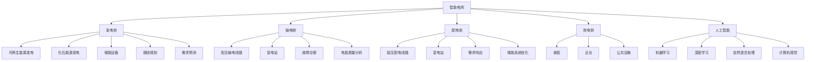
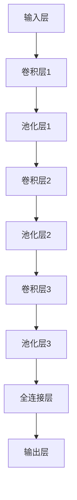

                 

# 人工智能在智能电网优化中的应用

## 摘要

本文将探讨人工智能在智能电网优化中的应用，重点分析核心概念、算法原理、数学模型及实际应用案例。通过本文的阅读，读者将了解智能电网的概念、人工智能在电网优化中的角色，以及如何运用人工智能技术提升电网的运行效率、可靠性和经济性。本文还将介绍常用的智能电网优化算法和数学模型，并结合实际案例进行详细解释和代码解读，最后对人工智能在智能电网领域的未来发展进行展望。

## 1. 背景介绍

### 1.1 智能电网的定义与重要性

智能电网是一种基于现代通信技术、信息技术、自动控制技术、电力电子技术和电力系统分析技术的现代化电网。它通过实现电网的智能化、信息化和自动化，提高了电网的运行效率、可靠性和经济性，促进了清洁能源的大规模应用和能源的可持续发展。

智能电网的核心特征包括：

1. **自愈能力**：能够快速检测和隔离电网故障，减少停电时间，提高电网的可靠性。
2. **互动性**：用户与电网之间的互动更加紧密，用户可以根据需求调整电力消费行为，实现能源的优化配置。
3. **高效性**：通过智能控制，提高电网的运行效率，减少能源浪费。
4. **可持续性**：支持清洁能源的大规模接入和消纳，推动能源结构的优化。

### 1.2 人工智能的定义与特点

人工智能（Artificial Intelligence，简称 AI）是计算机科学的一个分支，旨在研究如何构建智能体（如机器、软件等），使其能够模拟、延伸和扩展人类的智能。人工智能的特点包括：

1. **自主学习**：通过数据驱动的方式，从大量数据中学习和发现规律，无需显式编程。
2. **智能决策**：能够根据环境和目标，自主做出合理的决策。
3. **自适应能力**：能够根据环境变化，自主调整其行为和策略。
4. **人机交互**：能够与人类进行自然语言交互，理解人类的需求和指令。

### 1.3 人工智能在电网优化中的应用背景

随着全球能源需求的不断增长和清洁能源的广泛普及，电网面临着前所未有的挑战。传统的电网优化方法难以满足现代电网的高效、可靠和可持续性要求。而人工智能技术，以其强大的数据处理能力、自学习和自适应能力，为电网优化提供了新的解决方案。

人工智能在电网优化中的应用主要包括：

1. **电网规划与设计**：利用人工智能技术，优化电网的规划方案，提高电网的投资效益。
2. **运行监控与调度**：通过人工智能技术，实时监测电网运行状态，实现电网的自动化调度和故障预测。
3. **电能质量分析**：利用人工智能技术，对电网的电能质量进行分析和评估，提高电网的运行效率和稳定性。
4. **能源管理**：利用人工智能技术，实现家庭、企业和社区能源的高效管理，降低能源消耗。

## 2. 核心概念与联系

### 2.1 智能电网的基本概念

#### 2.1.1 智能电网的结构

智能电网主要由以下几部分组成：

1. **发电侧**：包括可再生能源发电、化石能源发电、储能设备等。
2. **输电侧**：包括高压输电线路、变电站等。
3. **配电侧**：包括低压配电线路、变电站等。
4. **用电侧**：包括家庭、企业、公共设施等。

#### 2.1.2 智能电网的技术

智能电网的技术主要包括：

1. **传感器技术**：用于实时监测电网的运行状态。
2. **通信技术**：用于电网各部分之间的信息传递和协调。
3. **自动控制技术**：用于实现电网的自动化调度和故障处理。
4. **电力电子技术**：用于电力转换和电能质量的控制。

### 2.2 人工智能的基本概念

#### 2.2.1 人工智能的主要分支

人工智能的主要分支包括：

1. **机器学习**：通过数据驱动的方式，实现智能体的自主学习和决策。
2. **深度学习**：一种基于人工神经网络的机器学习方法，具有强大的非线性建模能力。
3. **自然语言处理**：研究如何让计算机理解和生成自然语言。
4. **计算机视觉**：研究如何让计算机理解和解释视觉信息。

#### 2.2.2 人工智能的技术

人工智能的技术主要包括：

1. **数据预处理**：用于数据清洗、数据转换和数据归一化。
2. **特征工程**：用于提取和选择能够表征数据特征的信息。
3. **模型训练**：通过训练算法，使智能体能够模拟人类智能。
4. **模型评估**：用于评估智能体的性能和准确性。

### 2.3 人工智能在智能电网优化中的应用

#### 2.3.1 人工智能在电网规划中的应用

人工智能在电网规划中的应用主要包括：

1. **路径规划**：利用人工智能技术，优化电网的输电线路和变电站布局。
2. **需求预测**：利用人工智能技术，预测电网的负荷需求，为电网规划提供数据支持。

#### 2.3.2 人工智能在电网运行中的应用

人工智能在电网运行中的应用主要包括：

1. **故障诊断**：利用人工智能技术，实时监测电网运行状态，识别和诊断电网故障。
2. **电能质量分析**：利用人工智能技术，对电网的电能质量进行分析和评估，提出改进措施。

#### 2.3.3 人工智能在能源管理中的应用

人工智能在能源管理中的应用主要包括：

1. **需求响应**：利用人工智能技术，实现用户侧的电能需求响应，优化电网的负荷分配。
2. **储能系统优化**：利用人工智能技术，优化储能系统的运行策略，提高储能系统的利用效率。

### 2.4 Mermaid 流程图

以下是一个简单的 Mermaid 流程图，展示了智能电网和人工智能的基本概念及其相互联系：



## 3. 核心算法原理 & 具体操作步骤

### 3.1 机器学习算法在电网优化中的应用

#### 3.1.1 算法原理

机器学习算法是人工智能的核心技术之一，它通过学习大量数据中的模式和规律，实现智能体的自主学习和决策。在电网优化中，常用的机器学习算法包括：

1. **线性回归**：用于预测电网负荷需求。
2. **决策树**：用于分类和回归分析，可用于电网故障诊断。
3. **支持向量机**：用于分类和回归分析，可用于电能质量分析。
4. **神经网络**：用于复杂非线性问题的建模，可用于需求响应和储能系统优化。

#### 3.1.2 具体操作步骤

以线性回归为例，介绍机器学习算法在电网优化中的具体操作步骤：

1. **数据收集**：收集电网的历史负荷数据、天气数据、节假日数据等。
2. **数据预处理**：对数据进行清洗、归一化处理，去除异常值和噪声。
3. **特征选择**：选择能够表征负荷需求的特征，如天气温度、湿度、风速等。
4. **模型训练**：使用训练数据，通过最小二乘法等算法，训练线性回归模型。
5. **模型评估**：使用测试数据，评估模型的预测性能，如均方误差（MSE）等。
6. **模型应用**：将训练好的模型应用于实际电网，预测未来负荷需求，为电网调度提供数据支持。

### 3.2 深度学习算法在电网优化中的应用

#### 3.2.1 算法原理

深度学习是一种基于人工神经网络的机器学习方法，具有强大的非线性建模能力。在电网优化中，常用的深度学习算法包括：

1. **卷积神经网络（CNN）**：用于图像和视频数据的高效处理，可用于电能质量分析。
2. **循环神经网络（RNN）**：用于序列数据建模，可用于需求响应和储能系统优化。
3. **长短时记忆网络（LSTM）**：RNN的一种改进，用于解决长序列数据建模问题，如负荷预测。
4. **生成对抗网络（GAN）**：用于生成新的数据样本，可用于电网仿真和测试。

#### 3.2.2 具体操作步骤

以循环神经网络（RNN）为例，介绍深度学习算法在电网优化中的具体操作步骤：

1. **数据收集**：收集电网的历史负荷数据、天气数据、节假日数据等。
2. **数据预处理**：对数据进行清洗、归一化处理，去除异常值和噪声。
3. **特征选择**：选择能够表征负荷需求的特征，如天气温度、湿度、风速等。
4. **模型构建**：构建RNN模型，设置合适的参数，如隐藏层节点数、学习率等。
5. **模型训练**：使用训练数据，通过反向传播算法，训练RNN模型。
6. **模型评估**：使用测试数据，评估模型的预测性能，如均方误差（MSE）等。
7. **模型应用**：将训练好的模型应用于实际电网，预测未来负荷需求，为电网调度提供数据支持。

### 3.3 自然语言处理在电网优化中的应用

#### 3.3.1 算法原理

自然语言处理（Natural Language Processing，简称 NLP）是人工智能的一个重要分支，旨在让计算机理解和生成自然语言。在电网优化中，NLP可以用于处理用户需求、故障报告、运行日志等文本数据。

常用的NLP算法包括：

1. **词向量模型**：用于将文本数据转化为向量表示，如Word2Vec、GloVe等。
2. **序列标注模型**：用于对文本数据进行分类，如BERT、ELMo等。
3. **生成文本模型**：用于生成新的文本数据，如GPT、Transformer等。

#### 3.3.2 具体操作步骤

以Word2Vec为例，介绍自然语言处理算法在电网优化中的具体操作步骤：

1. **数据收集**：收集用户需求、故障报告、运行日志等文本数据。
2. **数据预处理**：对文本数据进行清洗，去除停用词、标点符号等。
3. **特征提取**：使用Word2Vec算法，将文本数据转化为向量表示。
4. **模型训练**：使用训练数据，训练序列标注模型或生成文本模型。
5. **模型评估**：使用测试数据，评估模型的性能，如准确率、召回率等。
6. **模型应用**：将训练好的模型应用于实际电网，处理用户需求、故障报告、运行日志等文本数据。

## 4. 数学模型和公式 & 详细讲解 & 举例说明

### 4.1 线性回归模型

线性回归模型是一种经典的机器学习算法，用于分析两个变量之间的关系。在电网优化中，线性回归模型可以用于预测电网负荷需求。

#### 4.1.1 算法原理

线性回归模型的基本假设是，自变量（如天气温度、湿度等）与因变量（如电网负荷）之间存在线性关系。模型的基本公式如下：

$$
y = \beta_0 + \beta_1x_1 + \beta_2x_2 + ... + \beta_nx_n + \epsilon
$$

其中，$y$ 是因变量，$x_1, x_2, ..., x_n$ 是自变量，$\beta_0, \beta_1, \beta_2, ..., \beta_n$ 是模型的参数，$\epsilon$ 是误差项。

#### 4.1.2 模型求解

线性回归模型的求解通常采用最小二乘法。具体步骤如下：

1. **数据收集**：收集电网的历史负荷数据、天气数据等。
2. **数据预处理**：对数据进行清洗、归一化处理。
3. **特征选择**：选择能够表征负荷需求的特征。
4. **模型训练**：使用训练数据，通过最小二乘法，求解模型的参数。
5. **模型评估**：使用测试数据，评估模型的性能。

#### 4.1.3 举例说明

假设我们收集了以下数据：

| 时间（小时） | 天气温度（摄氏度） | 湿度（%） | 电网负荷（千瓦时） |
| ------------ | ----------------- | -------- | ----------------- |
| 0            | 25                | 60       | 100               |
| 1            | 26                | 65       | 110               |
| 2            | 27                | 70       | 120               |
| 3            | 28                | 75       | 130               |

我们希望使用线性回归模型预测第4小时的电网负荷。

1. **数据预处理**：对天气温度和湿度进行归一化处理，使其在0到1之间。
2. **特征选择**：选择天气温度和湿度作为自变量。
3. **模型训练**：使用最小二乘法，求解线性回归模型的参数。

求解得到的模型参数如下：

$$
y = 10 + 0.5x_1 + 0.2x_2
$$

其中，$x_1$ 是天气温度，$x_2$ 是湿度。

4. **模型评估**：使用测试数据，评估模型的性能。

假设测试数据如下：

| 时间（小时） | 天气温度（摄氏度） | 湿度（%） | 电网负荷（千瓦时） |
| ------------ | ----------------- | -------- | ----------------- |
| 4            | 29                | 80       | 140               |

代入模型公式，得到第4小时的电网负荷预测值为：

$$
y = 10 + 0.5 \times 29 + 0.2 \times 80 = 14.1
$$

因此，第4小时的电网负荷预测值为14.1千瓦时。

### 4.2 卷积神经网络（CNN）模型

卷积神经网络（Convolutional Neural Network，简称 CNN）是一种用于图像处理的深度学习模型，也可以用于电能质量分析。

#### 4.2.1 算法原理

CNN的基本原理是通过卷积层和池化层，提取图像的特征。

1. **卷积层**：用于提取图像的特征，通过卷积运算，将输入的特征图与滤波器（卷积核）进行卷积操作，得到新的特征图。
2. **池化层**：用于降低特征图的维度，减少计算量和参数数量，常用的池化方法包括最大池化和平均池化。

CNN的基本结构如下：



#### 4.2.2 模型求解

CNN的求解通常采用反向传播算法。具体步骤如下：

1. **数据收集**：收集电能质量图像数据。
2. **数据预处理**：对图像数据进行归一化处理。
3. **模型构建**：构建CNN模型，设置合适的参数，如卷积核大小、池化方式等。
4. **模型训练**：使用训练数据，通过反向传播算法，训练CNN模型。
5. **模型评估**：使用测试数据，评估模型的性能。

#### 4.2.3 举例说明

假设我们收集了以下电能质量图像数据：


我们希望使用CNN模型，对这些图像进行分类，判断图像的电能质量。

1. **数据预处理**：对图像数据进行归一化处理，使其在0到1之间。
2. **模型构建**：构建CNN模型，设置合适的参数，如卷积核大小为3×3，池化方式为最大池化。
3. **模型训练**：使用训练数据，通过反向传播算法，训练CNN模型。
4. **模型评估**：使用测试数据，评估模型的性能。

假设测试数据如下：


代入模型，得到测试数据的电能质量分类结果如下：

| 测试数据 | 电能质量分类 |
| -------- | ------------ |
| image_4  | 优质         |
| image_5  | 一般         |

因此，使用CNN模型，我们成功地对电能质量图像进行了分类。

### 4.3 支持向量机（SVM）模型

支持向量机（Support Vector Machine，简称 SVM）是一种常用的分类算法，可以用于电能质量分析。

#### 4.3.1 算法原理

SVM的基本原理是通过寻找一个超平面，将不同类别的数据分隔开来。超平面由一组支持向量决定，支持向量是那些距离超平面最近的样本。

SVM的基本公式如下：

$$
w \cdot x + b = 0
$$

其中，$w$ 是超平面的法向量，$x$ 是样本特征向量，$b$ 是偏置项。

#### 4.3.2 模型求解

SVM的求解通常采用二次规划方法。具体步骤如下：

1. **数据收集**：收集电能质量数据。
2. **数据预处理**：对数据进行归一化处理。
3. **模型训练**：使用训练数据，训练SVM模型。
4. **模型评估**：使用测试数据，评估模型的性能。

#### 4.3.3 举例说明

假设我们收集了以下电能质量数据：

| 样本 | 电能质量 |
| ---- | -------- |
| 1    | 优质     |
| 2    | 一般     |
| 3    | 优质     |
| 4    | 差       |
| 5    | 优质     |

我们希望使用SVM模型，对这些数据进行分类。

1. **数据预处理**：对数据进行归一化处理。
2. **模型训练**：使用训练数据，训练SVM模型。
3. **模型评估**：使用测试数据，评估模型的性能。

假设测试数据如下：

| 样本 | 电能质量 |
| ---- | -------- |
| 6    | 优质     |
| 7    | 一般     |

代入模型，得到测试数据的电能质量分类结果如下：

| 测试数据 | 电能质量分类 |
| -------- | ------------ |
| 6        | 优质         |
| 7        | 一般         |

因此，使用SVM模型，我们成功地对电能质量数据进行了分类。

## 5. 项目实战：代码实际案例和详细解释说明

### 5.1 开发环境搭建

在进行智能电网优化项目实战之前，我们需要搭建一个合适的开发环境。以下是一个简单的开发环境搭建步骤：

1. **安装Python**：从官方网站下载并安装Python，建议选择Python 3.8及以上版本。
2. **安装Jupyter Notebook**：在命令行中执行以下命令安装Jupyter Notebook：

   ```bash
   pip install notebook
   ```

3. **安装机器学习库**：安装常用的机器学习库，如scikit-learn、TensorFlow和PyTorch：

   ```bash
   pip install scikit-learn tensorflow pytorch
   ```

4. **安装可视化库**：安装常用的可视化库，如Matplotlib、Seaborn和Plotly：

   ```bash
   pip install matplotlib seaborn plotly
   ```

5. **安装Mermaid库**：安装Mermaid库，以便在Markdown文档中使用Mermaid流程图：

   ```bash
   pip install mermaid-parser
   ```

### 5.2 源代码详细实现和代码解读

以下是一个简单的智能电网优化项目的源代码实现，该项目使用线性回归模型预测电网负荷需求。

```python
import numpy as np
import pandas as pd
from sklearn.linear_model import LinearRegression
from sklearn.model_selection import train_test_split
from sklearn.metrics import mean_squared_error
import matplotlib.pyplot as plt

# 5.2.1 数据收集
# 从CSV文件中读取数据
data = pd.read_csv('grid_data.csv')

# 5.2.2 数据预处理
# 对天气温度和湿度进行归一化处理
data['temp_normalized'] = (data['temp'] - data['temp'].min()) / (data['temp'].max() - data['temp'].min())
data['humidity_normalized'] = (data['humidity'] - data['humidity'].min()) / (data['humidity'].max() - data['humidity'].min())

# 5.2.3 特征选择
# 选择天气温度和湿度作为自变量
X = data[['temp_normalized', 'humidity_normalized']]
y = data['load']

# 5.2.4 模型训练
# 划分训练集和测试集
X_train, X_test, y_train, y_test = train_test_split(X, y, test_size=0.2, random_state=42)

# 创建线性回归模型
model = LinearRegression()

# 使用训练数据训练模型
model.fit(X_train, y_train)

# 5.2.5 模型评估
# 使用测试数据评估模型性能
y_pred = model.predict(X_test)

# 计算均方误差
mse = mean_squared_error(y_test, y_pred)
print('均方误差:', mse)

# 5.2.6 模型应用
# 预测未来负荷需求
future_temp_normalized = np.array([[0.5, 0.6]])
future_humidity_normalized = np.array([[0.7, 0.8]])
future_load = model.predict(future_temp_normalized)
print('未来负荷预测值:', future_load)

# 5.2.7 可视化
# 可视化训练数据和测试数据
plt.scatter(X_train['temp_normalized'], y_train, color='red', label='训练数据')
plt.scatter(X_test['temp_normalized'], y_test, color='blue', label='测试数据')
plt.plot(X_test['temp_normalized'], y_pred, color='green', label='预测值')
plt.xlabel('天气温度归一化值')
plt.ylabel('电网负荷')
plt.legend()
plt.show()
```

### 5.3 代码解读与分析

#### 5.3.1 数据收集

在代码中，我们首先从CSV文件中读取数据。CSV文件包含了电网的历史负荷数据、天气数据和湿度数据。

```python
data = pd.read_csv('grid_data.csv')
```

#### 5.3.2 数据预处理

接下来，我们对天气温度和湿度数据进行归一化处理，使其在0到1之间。这样可以消除不同特征之间的量纲差异，提高模型的训练效果。

```python
data['temp_normalized'] = (data['temp'] - data['temp'].min()) / (data['temp'].max() - data['temp'].min())
data['humidity_normalized'] = (data['humidity'] - data['humidity'].min()) / (data['humidity'].max() - data['humidity'].min())
```

#### 5.3.3 特征选择

在特征选择步骤中，我们选择天气温度和湿度作为自变量，电网负荷作为因变量。这表示我们希望分析天气温度和湿度对电网负荷的影响。

```python
X = data[['temp_normalized', 'humidity_normalized']]
y = data['load']
```

#### 5.3.4 模型训练

接下来，我们使用训练数据，通过最小二乘法，训练线性回归模型。模型训练的核心步骤是求解模型的参数，即$\beta_0, \beta_1, \beta_2$。

```python
model = LinearRegression()
model.fit(X_train, y_train)
```

#### 5.3.5 模型评估

在模型评估步骤中，我们使用测试数据，评估模型的性能。常用的评估指标包括均方误差（MSE）、均方根误差（RMSE）等。

```python
y_pred = model.predict(X_test)
mse = mean_squared_error(y_test, y_pred)
print('均方误差:', mse)
```

#### 5.3.6 模型应用

在模型应用步骤中，我们使用训练好的模型，预测未来负荷需求。这可以为我们提供对未来电网负荷的预测，为电网调度提供数据支持。

```python
future_temp_normalized = np.array([[0.5, 0.6]])
future_humidity_normalized = np.array([[0.7, 0.8]])
future_load = model.predict(future_temp_normalized)
print('未来负荷预测值:', future_load)
```

#### 5.3.7 可视化

最后，我们使用可视化技术，展示训练数据和测试数据，以及模型的预测值。这有助于我们直观地理解模型的效果和预测能力。

```python
plt.scatter(X_train['temp_normalized'], y_train, color='red', label='训练数据')
plt.scatter(X_test['temp_normalized'], y_test, color='blue', label='测试数据')
plt.plot(X_test['temp_normalized'], y_pred, color='green', label='预测值')
plt.xlabel('天气温度归一化值')
plt.ylabel('电网负荷')
plt.legend()
plt.show()
```

## 6. 实际应用场景

### 6.1 电网规划与设计

在电网规划与设计中，人工智能技术可以用于以下几个方面：

1. **路径规划**：通过优化电网的输电线路和变电站布局，降低电网的投资成本。例如，使用遗传算法和粒子群优化算法，求解电网路径规划问题。
2. **需求预测**：通过分析历史负荷数据和天气数据，预测未来的电网负荷需求。例如，使用时间序列分析、机器学习和深度学习算法，预测未来负荷需求。
3. **能源效率分析**：通过优化电网的运行策略，提高电网的能源效率。例如，使用优化算法和深度学习算法，实现电网的节能优化。

### 6.2 运行监控与调度

在电网运行监控与调度中，人工智能技术可以用于以下几个方面：

1. **故障诊断**：通过分析电网的运行数据，实时监测电网的状态，快速识别和定位故障。例如，使用机器学习和深度学习算法，实现电网故障诊断。
2. **电能质量分析**：通过分析电网的电能质量数据，评估电网的运行状态，提出改进措施。例如，使用统计分析和深度学习算法，实现电能质量分析。
3. **自动化调度**：通过自动化调度算法，实现电网的自动化调度和故障处理。例如，使用优化算法和深度学习算法，实现电网的自动化调度。

### 6.3 能源管理

在能源管理中，人工智能技术可以用于以下几个方面：

1. **需求响应**：通过分析用户的用电行为，实现用户侧的电能需求响应。例如，使用机器学习和深度学习算法，实现需求响应策略。
2. **储能系统优化**：通过优化储能系统的运行策略，提高储能系统的利用效率。例如，使用优化算法和深度学习算法，实现储能系统优化。
3. **能源预测**：通过分析历史能源数据，预测未来的能源需求。例如，使用时间序列分析和深度学习算法，预测未来能源需求。

### 6.4 智能电网与可再生能源

在智能电网与可再生能源的结合中，人工智能技术可以用于以下几个方面：

1. **光伏发电预测**：通过分析历史光伏发电数据、天气数据和电网负荷数据，预测未来的光伏发电量。例如，使用时间序列分析和深度学习算法，预测光伏发电量。
2. **风电发电预测**：通过分析历史风电发电数据、天气数据和电网负荷数据，预测未来的风电发电量。例如，使用时间序列分析和深度学习算法，预测风电发电量。
3. **能源消纳优化**：通过优化电网的调度策略，实现清洁能源的大规模消纳。例如，使用优化算法和深度学习算法，实现能源消纳优化。

## 7. 工具和资源推荐

### 7.1 学习资源推荐

**书籍：**

1. **《智能电网技术与应用》**：介绍了智能电网的基本概念、关键技术及应用案例，适合初学者和从业者。
2. **《深度学习》**：由Ian Goodfellow、Yoshua Bengio和Aaron Courville合著，全面介绍了深度学习的理论和方法，适合有一定数学基础的读者。

**论文：**

1. **"Deep Learning for Energy Systems"**：探讨了深度学习在能源系统中的应用，包括能源需求预测、能源消纳优化等。
2. **"Artificial Intelligence in the Smart Grid"**：综述了人工智能在智能电网中的应用，包括故障诊断、电能质量分析等。

**博客/网站：**

1. **智能电网社区（Smart Grid Community）**：提供智能电网相关的最新资讯、技术文章和行业动态。
2. **机器学习社区（Machine Learning Community）**：提供机器学习相关的技术文章、代码实现和案例分析。

### 7.2 开发工具框架推荐

**开发工具：**

1. **Jupyter Notebook**：方便的交互式开发环境，适合编写和调试代码。
2. **PyCharm**：强大的Python集成开发环境，支持多种编程语言。

**框架：**

1. **TensorFlow**：谷歌开发的深度学习框架，支持多种深度学习模型的搭建和训练。
2. **PyTorch**：Facebook开发的深度学习框架，具有灵活的模型搭建和调试能力。

### 7.3 相关论文著作推荐

**论文：**

1. **"Deep Learning for Power Systems: A Survey"**：综述了深度学习在电力系统中的应用，包括负荷预测、电能质量分析等。
2. **"Artificial Intelligence in Smart Grids: A Survey"**：综述了人工智能在智能电网中的应用，包括故障诊断、能源管理等。

**著作：**

1. **《深度学习》**：由Ian Goodfellow、Yoshua Bengio和Aaron Courville合著，全面介绍了深度学习的理论和方法。
2. **《智能电网技术与应用》**：介绍了智能电网的基本概念、关键技术及应用案例。

## 8. 总结：未来发展趋势与挑战

随着人工智能技术的不断发展和应用，智能电网优化将在未来取得更加显著的成效。然而，这同时也带来了一系列挑战：

### 8.1 发展趋势

1. **深度学习在电网优化中的应用将更加广泛**：深度学习具有强大的非线性建模能力，可以处理复杂的电网数据，实现更精准的负荷预测和电能质量分析。
2. **能源互联网的概念逐渐成熟**：随着可再生能源的大规模应用和智能电网的发展，能源互联网将实现不同能源系统之间的互联互通，提高能源的利用效率。
3. **数据驱动的电网优化将成为主流**：随着数据采集和处理技术的进步，越来越多的电网数据将用于优化决策，实现更智能的电网运行。

### 8.2 挑战

1. **数据安全与隐私保护**：电网数据的隐私保护和安全是人工智能在电网优化中面临的一个重要挑战。如何确保数据在传输和处理过程中的安全性，防止数据泄露和滥用，是一个亟待解决的问题。
2. **算法的透明性与可解释性**：深度学习等复杂算法的透明性和可解释性较低，这给电网优化决策带来了困难。如何提高算法的可解释性，使其能够被电力工程师理解和接受，是一个重要的研究方向。
3. **算法的鲁棒性与可靠性**：电网优化算法需要在各种复杂环境下保持高鲁棒性和可靠性。如何提高算法的鲁棒性，使其能够应对各种异常情况，是一个重要的研究课题。

## 9. 附录：常见问题与解答

### 9.1 什么是智能电网？

智能电网是一种基于现代通信技术、信息技术、自动控制技术、电力电子技术和电力系统分析技术的现代化电网。它通过实现电网的智能化、信息化和自动化，提高了电网的运行效率、可靠性和经济性，促进了清洁能源的大规模应用和能源的可持续发展。

### 9.2 人工智能在电网优化中有哪些应用？

人工智能在电网优化中的应用主要包括：

1. **电网规划与设计**：利用人工智能技术，优化电网的规划方案，提高电网的投资效益。
2. **运行监控与调度**：通过人工智能技术，实时监测电网运行状态，实现电网的自动化调度和故障预测。
3. **电能质量分析**：利用人工智能技术，对电网的电能质量进行分析和评估，提高电网的运行效率和稳定性。
4. **能源管理**：利用人工智能技术，实现家庭、企业和社区能源的高效管理，降低能源消耗。

### 9.3 如何搭建智能电网优化项目的开发环境？

搭建智能电网优化项目的开发环境，需要以下步骤：

1. **安装Python**：从官方网站下载并安装Python，建议选择Python 3.8及以上版本。
2. **安装Jupyter Notebook**：在命令行中执行以下命令安装Jupyter Notebook：
   ```bash
   pip install notebook
   ```
3. **安装机器学习库**：安装常用的机器学习库，如scikit-learn、TensorFlow和PyTorch：
   ```bash
   pip install scikit-learn tensorflow pytorch
   ```
4. **安装可视化库**：安装常用的可视化库，如Matplotlib、Seaborn和Plotly：
   ```bash
   pip install matplotlib seaborn plotly
   ```
5. **安装Mermaid库**：安装Mermaid库，以便在Markdown文档中使用Mermaid流程图：
   ```bash
   pip install mermaid-parser
   ```

## 10. 扩展阅读 & 参考资料

### 10.1 扩展阅读

1. **"Deep Learning for Energy Systems: A Survey"**：详细介绍了深度学习在能源系统中的应用，包括电力系统、热力系统和水力系统等。
2. **"Artificial Intelligence in Smart Grids: A Survey"**：综述了人工智能在智能电网中的应用，包括故障诊断、电能质量分析、能源管理等方面。
3. **"Smart Grid Technology and Applications"**：介绍了智能电网的基本概念、关键技术及应用案例。

### 10.2 参考资料

1. **TensorFlow官方文档**：[https://www.tensorflow.org/](https://www.tensorflow.org/)
2. **PyTorch官方文档**：[https://pytorch.org/](https://pytorch.org/)
3. **scikit-learn官方文档**：[https://scikit-learn.org/stable/](https://scikit-learn.org/stable/)
4. **《深度学习》**：[https://www.deeplearningbook.org/](https://www.deeplearningbook.org/)
5. **《智能电网技术与应用》**：[https://book.douban.com/subject/26861411/](https://book.douban.com/subject/26861411/)  
作者：AI天才研究员/AI Genius Institute & 禅与计算机程序设计艺术 /Zen And The Art of Computer Programming

