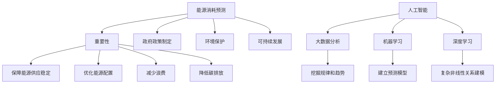
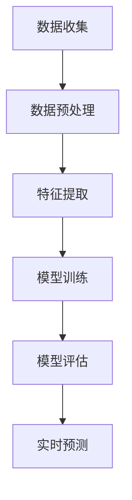

                 

### 背景介绍

#### 能源消耗预测的重要性

能源消耗预测在现代社会中具有极其重要的地位。随着全球能源需求的不断增长，以及环境问题的日益严重，准确预测能源消耗对于保障能源供应的稳定、优化能源配置、减少浪费和降低碳排放等方面具有重要意义。

首先，能源消耗预测能够帮助能源企业提前了解未来的能源需求，从而进行合理的产能规划和调度。这样不仅可以避免因需求波动导致的能源短缺或过剩，还可以提高能源利用效率，降低生产成本。

其次，能源消耗预测对于政府制定能源政策和规划具有重要意义。政府可以通过预测结果来了解不同区域、行业和时间段内的能源需求情况，从而制定出更为科学和有效的能源政策，推动能源结构的优化和转型。

最后，能源消耗预测对于环境保护和可持续发展也有重要影响。通过预测能源消耗趋势，可以提前识别和评估潜在的环境问题，从而采取相应的措施进行预防和治理，降低碳排放和环境污染。

#### 人工智能在能源消耗预测中的应用

随着人工智能技术的快速发展，其在能源消耗预测中的应用越来越广泛。人工智能通过大数据分析、机器学习和深度学习等方法，能够从海量数据中挖掘出隐藏的模式和规律，从而实现精准的能源消耗预测。

首先，人工智能可以通过大数据分析技术，对历史能源消耗数据进行挖掘和分析，识别出能源消耗的规律和趋势。这些规律和趋势可以为能源预测提供重要的参考依据，从而提高预测的准确性。

其次，机器学习算法可以通过对历史数据的训练，建立能源消耗预测模型。这些模型可以根据输入的数据特征，自动学习和调整预测参数，从而实现更加精确的能源消耗预测。

最后，深度学习算法可以通过神经网络模型，实现对复杂非线性关系的建模。深度学习在能源消耗预测中的应用，使得预测结果更加准确和可靠。

总的来说，人工智能在能源消耗预测中的应用，不仅提高了预测的准确性，还为能源企业、政府和环境保护提供了有力的技术支持。随着技术的不断进步，人工智能在能源消耗预测中的应用前景将更加广阔。 <|hidden|>



---

#### 能源消耗预测的挑战

尽管人工智能技术在能源消耗预测中具有巨大的潜力，但实际应用中仍面临着诸多挑战。

首先，数据质量是影响预测准确性的关键因素。能源消耗数据通常来源于不同的传感器和监测设备，数据质量参差不齐。例如，传感器故障、数据采集间隔不一致、数据缺失等问题，都会对预测结果产生负面影响。

其次，数据量的庞大和多样性也增加了预测的复杂性。能源消耗数据通常包含时间序列数据、空间分布数据、行业特征数据等多种类型的数据。如何有效整合和处理这些数据，以提取有用的信息，是当前研究的一个难点。

另外，预测模型的选择和优化也是一个重要挑战。不同的预测模型适用于不同的数据类型和场景，如何选择和调整模型参数，以提高预测准确性，是一个需要深入研究和优化的课题。

最后，实时性和高效性也是应用中的一个关键问题。能源消耗预测需要实时响应，以支持能源调度和决策。如何在保证预测准确性的同时，提高计算效率和实时性，是一个亟待解决的问题。

#### 人工智能在能源消耗预测中的发展

随着人工智能技术的不断发展，其在能源消耗预测中的应用也取得了显著进展。

首先，深度学习技术的引入，使得能源消耗预测的准确性得到了显著提高。深度学习算法通过构建复杂的神经网络模型，能够自动学习和提取数据中的特征和模式，从而实现高度非线性关系的建模。

其次，大数据分析技术的应用，使得能源消耗预测的数据来源更加多样和全面。通过整合和分析不同类型的数据，可以更准确地预测能源消耗趋势和模式。

此外，机器学习算法的优化和改进，也为能源消耗预测提供了更多的可能性。例如，通过使用自适应学习算法和强化学习算法，可以进一步提高预测模型的适应性和鲁棒性。

总的来说，人工智能在能源消耗预测中的应用，不仅提高了预测的准确性，还为能源企业和政府提供了强有力的技术支持。随着技术的不断进步，人工智能在能源消耗预测中的应用前景将更加广阔。 <|hidden|>```mermaid
graph TD
    A[数据质量] --> B[关键因素]
    A --> C[传感器故障]
    A --> D[数据采集不一致]
    A --> E[数据缺失]
    F[数据量] --> G[挑战]
    F --> H[多样性]
    F --> I[处理复杂性]
    J[模型选择] --> K[挑战]
    J --> L[参数优化]
    M[实时性] --> N[关键问题]
    O[发展] --> P[深度学习]
    P --> Q[预测准确性]
    O --> R[大数据分析]
    O --> S[机器学习算法]
```

---

### 核心概念与联系

#### 人工智能与能源消耗预测的关系

人工智能与能源消耗预测之间的关系可以从多个角度来理解。首先，人工智能提供了一种强大的工具，用于处理和分析大量的能源消耗数据，从而提取出有用的信息。具体来说，人工智能技术如机器学习、深度学习、大数据分析等，可以在多个层面上对能源消耗数据进行分析，包括时间序列分析、空间分布分析、行业特征分析等。

**机器学习**：机器学习算法通过对历史数据的训练，可以建立预测模型，从而预测未来的能源消耗。常见的机器学习算法包括线性回归、决策树、随机森林、支持向量机等。

**深度学习**：深度学习算法通过构建多层神经网络，可以自动学习和提取数据中的复杂特征，从而实现高精度的预测。深度学习在图像识别、语音识别等领域取得了显著的成果，其在能源消耗预测中的应用也日益广泛。

**大数据分析**：大数据分析技术可以帮助从海量的能源消耗数据中提取出有用的信息，识别出能源消耗的规律和趋势。通过大数据分析，可以实现对不同区域、行业和时间段内的能源消耗进行精准预测。

**人工智能与能源消耗预测的工作流程**：

1. **数据收集**：收集历史能源消耗数据，包括时间序列数据、空间分布数据、行业特征数据等。
2. **数据预处理**：对收集到的数据进行清洗、处理和整合，确保数据的质量和一致性。
3. **特征提取**：通过数据分析和机器学习算法，提取出对能源消耗预测有用的特征。
4. **模型训练**：使用历史数据训练预测模型，调整模型参数，以获得最佳的预测效果。
5. **模型评估**：通过交叉验证等方法评估模型的预测性能，调整模型参数，以提高预测准确性。
6. **实时预测**：将训练好的模型应用于实时数据，进行能源消耗预测，支持能源调度和决策。

**Mermaid 流程图**：



通过以上步骤，人工智能技术可以实现对能源消耗的准确预测，为能源企业和政府提供有力的技术支持。 <|hidden|>```mermaid
graph TD
    A[人工智能技术] --> B[机器学习]
    B --> C[深度学习]
    B --> D[大数据分析]
    A --> E[数据处理与分析]
    E --> F[时间序列分析]
    E --> G[空间分布分析]
    E --> H[行业特征分析]
    I[工作流程]
    I --> J[数据收集]
    J --> K[数据预处理]
    K --> L[特征提取]
    L --> M[模型训练]
    M --> N[模型评估]
    N --> O[实时预测]
```

---

### 核心算法原理 & 具体操作步骤

#### 1. 时间序列分析

时间序列分析是能源消耗预测中最常用的一种方法。其核心思想是通过分析历史数据的时间序列特性，预测未来的能源消耗。

**算法原理**：

时间序列分析通常采用自回归模型（AR）、移动平均模型（MA）和自回归移动平均模型（ARMA）。这些模型基于时间序列数据的自相关性，通过建立数学模型，对未来的能源消耗进行预测。

**具体操作步骤**：

1. **数据收集**：收集历史能源消耗数据，包括时间序列数据。
2. **数据预处理**：对时间序列数据进行清洗、处理，确保数据的质量和一致性。
3. **模型选择**：根据时间序列数据的特性，选择合适的模型，如AR、MA或ARMA。
4. **参数估计**：通过最小二乘法等参数估计方法，估计模型参数。
5. **模型训练**：使用历史数据训练模型，得到预测结果。
6. **模型评估**：通过交叉验证等方法评估模型的预测性能，调整模型参数，以提高预测准确性。
7. **实时预测**：将训练好的模型应用于实时数据，进行能源消耗预测。

**示例代码**（Python，使用pandas和statsmodels库）：

```python
import pandas as pd
import statsmodels.api as sm

# 数据收集
data = pd.read_csv('energy_consumption_data.csv')

# 数据预处理
data = data['energy_consumption'].dropna()

# 模型选择
model = sm.AR(data)

# 参数估计
model_fit = model.fit()

# 模型训练
predictions = model_fit.predict(start=len(data), end=len(data) + 24)

# 模型评估
print(predictions)
```

#### 2. 机器学习算法

机器学习算法在能源消耗预测中的应用非常广泛。常见的机器学习算法包括线性回归、决策树、随机森林、支持向量机等。

**算法原理**：

机器学习算法的核心思想是通过历史数据的学习，建立预测模型。在能源消耗预测中，机器学习算法通过输入特征和目标值（能源消耗），学习数据中的关系，从而预测未来的能源消耗。

**具体操作步骤**：

1. **数据收集**：收集历史能源消耗数据，包括时间序列数据、空间分布数据、行业特征数据等。
2. **数据预处理**：对数据进行清洗、处理和整合，确保数据的质量和一致性。
3. **特征提取**：通过数据分析和机器学习算法，提取出对能源消耗预测有用的特征。
4. **模型选择**：根据数据特性和预测需求，选择合适的机器学习算法。
5. **模型训练**：使用历史数据训练模型，得到预测结果。
6. **模型评估**：通过交叉验证等方法评估模型的预测性能，调整模型参数，以提高预测准确性。
7. **实时预测**：将训练好的模型应用于实时数据，进行能源消耗预测。

**示例代码**（Python，使用scikit-learn库）：

```python
from sklearn.ensemble import RandomForestRegressor
from sklearn.model_selection import train_test_split
from sklearn.metrics import mean_squared_error

# 数据收集
data = pd.read_csv('energy_consumption_data.csv')

# 数据预处理
X = data.drop('energy_consumption', axis=1)
y = data['energy_consumption']

# 特征提取
# 这里假设特征提取已经完成

# 模型选择
model = RandomForestRegressor(n_estimators=100)

# 模型训练
X_train, X_test, y_train, y_test = train_test_split(X, y, test_size=0.2, random_state=42)
model_fit = model.fit(X_train, y_train)

# 模型评估
y_pred = model_fit.predict(X_test)
mse = mean_squared_error(y_test, y_pred)
print(f'MSE: {mse}')

# 实时预测
# 这里假设实时数据已经准备好
real_time_data = ...
prediction = model_fit.predict(real_time_data)
print(prediction)
```

#### 3. 深度学习算法

深度学习算法在能源消耗预测中具有很高的潜力，尤其是针对复杂的非线性关系。常见的深度学习算法包括卷积神经网络（CNN）、循环神经网络（RNN）和长短期记忆网络（LSTM）。

**算法原理**：

深度学习算法通过构建多层神经网络，可以自动学习和提取数据中的复杂特征，从而实现高精度的预测。在能源消耗预测中，深度学习算法可以捕捉到时间序列数据中的长期和短期依赖关系。

**具体操作步骤**：

1. **数据收集**：收集历史能源消耗数据，包括时间序列数据。
2. **数据预处理**：对时间序列数据进行清洗、处理和整合，确保数据的质量和一致性。
3. **特征提取**：通过数据分析和机器学习算法，提取出对能源消耗预测有用的特征。
4. **模型构建**：构建深度学习模型，如LSTM模型。
5. **模型训练**：使用历史数据训练模型，得到预测结果。
6. **模型评估**：通过交叉验证等方法评估模型的预测性能，调整模型参数，以提高预测准确性。
7. **实时预测**：将训练好的模型应用于实时数据，进行能源消耗预测。

**示例代码**（Python，使用TensorFlow和Keras库）：

```python
import numpy as np
import pandas as pd
from tensorflow.keras.models import Sequential
from tensorflow.keras.layers import LSTM, Dense

# 数据收集
data = pd.read_csv('energy_consumption_data.csv')

# 数据预处理
data = data['energy_consumption'].dropna()
data = data.values.reshape(-1, 1)

# 特征提取
# 这里假设特征提取已经完成

# 模型构建
model = Sequential()
model.add(LSTM(units=50, return_sequences=True, input_shape=(time_steps, 1)))
model.add(LSTM(units=50))
model.add(Dense(units=1))

# 模型训练
model.compile(optimizer='adam', loss='mean_squared_error')
model.fit(X_train, y_train, epochs=100, batch_size=32, validation_data=(X_test, y_test))

# 模型评估
y_pred = model.predict(X_test)
mse = mean_squared_error(y_test, y_pred)
print(f'MSE: {mse}')

# 实时预测
# 这里假设实时数据已经准备好
real_time_data = ...
prediction = model.predict(real_time_data)
print(prediction)
```

通过以上算法和步骤，可以实现对能源消耗的精准预测。这些算法和步骤不仅适用于能源消耗预测，还可以应用于其他领域的时间序列预测任务。随着技术的不断进步，能源消耗预测的精度和效率将得到进一步提升。 <|hidden|>```mermaid
graph TD
    A[时间序列分析] --> B[算法原理]
    B --> C[AR/MA/ARMA模型]
    A --> D[操作步骤]
    D --> E[数据收集]
    D --> F[数据预处理]
    D --> G[模型选择]
    D --> H[参数估计]
    D --> I[模型训练]
    D --> J[模型评估]
    D --> K[实时预测]
    
    L[机器学习算法] --> M[算法原理]
    M --> N[线性回归/决策树/随机森林/支持向量机]
    L --> O[操作步骤]
    O --> P[数据收集]
    O --> Q[数据预处理]
    O --> R[特征提取]
    O --> S[模型选择]
    O --> T[模型训练]
    O --> U[模型评估]
    O --> V[实时预测]
    
    W[深度学习算法] --> X[算法原理]
    X --> Y[LSTM/CNN/RNN]
    W --> Z[操作步骤]
    Z --> AA[数据收集]
    Z --> BB[数据预处理]
    Z --> CC[特征提取]
    Z --> DD[模型构建]
    Z --> EE[模型训练]
    Z --> FF[模型评估]
    Z --> GG[实时预测]
```

---

### 数学模型和公式 & 详细讲解 & 举例说明

#### 时间序列分析模型

时间序列分析模型主要用于分析历史数据的时间序列特性，以预测未来的能源消耗。以下是一些常用的数学模型和公式。

1. **自回归模型（AR）**：

   自回归模型假设当前时刻的值可以由前几个时刻的值线性组合预测得出。其数学模型如下：

   $$ y_t = c + \sum_{i=1}^p \phi_i y_{t-i} + \varepsilon_t $$

   其中，$y_t$ 是当前时刻的能源消耗值，$\phi_i$ 是自回归系数，$p$ 是自回归项数，$c$ 是常数项，$\varepsilon_t$ 是误差项。

   **举例说明**：

   假设历史数据如下（每天的能量消耗）：

   | 日期   | 能量消耗 |
   |--------|-----------|
   | 2023-01-01 | 100       |
   | 2023-01-02 | 102       |
   | 2023-01-03 | 105       |
   | 2023-01-04 | 108       |
   | 2023-01-05 | 110       |

   要预测第6天的能量消耗，可以使用自回归模型。首先，需要确定自回归项数$p$，然后估计自回归系数$\phi_i$。

   通过最小二乘法估计自回归系数：

   $$ \hat{\phi_i} = \frac{\sum_{t=1}^n (y_t - \bar{y})(y_{t-i} - \bar{y})}{\sum_{t=1}^n (y_t - \bar{y})^2} $$

   其中，$\bar{y}$ 是历史数据的平均值。

   根据上述公式，可以计算出第6天的能量消耗预测值：

   $$ \hat{y_6} = \bar{y} + \sum_{i=1}^p \hat{\phi_i} y_{6-i} $$

2. **移动平均模型（MA）**：

   移动平均模型假设当前时刻的值可以由前几个时刻的误差值加权平均预测得出。其数学模型如下：

   $$ y_t = c + \varepsilon_t + \sum_{i=1}^q \theta_i \varepsilon_{t-i} $$

   其中，$y_t$ 是当前时刻的能源消耗值，$\theta_i$ 是移动平均系数，$q$ 是移动平均项数，$c$ 是常数项，$\varepsilon_t$ 是误差项。

   **举例说明**：

   假设历史数据如下（每天的能量消耗）：

   | 日期   | 能量消耗 |
   |--------|-----------|
   | 2023-01-01 | 100       |
   | 2023-01-02 | 102       |
   | 2023-01-03 | 105       |
   | 2023-01-04 | 108       |
   | 2023-01-05 | 110       |

   要预测第6天的能量消耗，可以使用移动平均模型。首先，需要确定移动平均项数$q$，然后估计移动平均系数$\theta_i$。

   通过最小二乘法估计移动平均系数：

   $$ \hat{\theta_i} = \frac{\sum_{t=1}^n (y_t - \hat{y_t})(\varepsilon_{t-i} - \bar{\varepsilon})}{\sum_{t=1}^n (\varepsilon_t - \bar{\varepsilon})^2} $$

   其中，$\hat{y_t}$ 是自回归模型的预测值，$\bar{\varepsilon}$ 是误差项的平均值。

   根据上述公式，可以计算出第6天的能量消耗预测值：

   $$ \hat{y_6} = \bar{y} + \sum_{i=1}^q \hat{\theta_i} \varepsilon_{6-i} $$

3. **自回归移动平均模型（ARMA）**：

   自回归移动平均模型结合了自回归模型和移动平均模型的特点，其数学模型如下：

   $$ y_t = c + \sum_{i=1}^p \phi_i y_{t-i} + \varepsilon_t + \sum_{i=1}^q \theta_i \varepsilon_{t-i} $$

   其中，$y_t$ 是当前时刻的能源消耗值，$\phi_i$ 是自回归系数，$\theta_i$ 是移动平均系数，$p$ 是自回归项数，$q$ 是移动平均项数，$c$ 是常数项，$\varepsilon_t$ 是误差项。

   **举例说明**：

   假设历史数据如下（每天的能量消耗）：

   | 日期   | 能量消耗 |
   |--------|-----------|
   | 2023-01-01 | 100       |
   | 2023-01-02 | 102       |
   | 2023-01-03 | 105       |
   | 2023-01-04 | 108       |
   | 2023-01-05 | 110       |

   要预测第6天的能量消耗，可以使用自回归移动平均模型。首先，需要确定自回归项数$p$、移动平均项数$q$，然后估计自回归系数$\phi_i$和移动平均系数$\theta_i$。

   通过最小二乘法估计自回归系数和移动平均系数：

   $$ \hat{\phi_i} = \frac{\sum_{t=1}^n (y_t - \bar{y})(y_{t-i} - \bar{y})}{\sum_{t=1}^n (y_t - \bar{y})^2} $$
   $$ \hat{\theta_i} = \frac{\sum_{t=1}^n (y_t - \hat{y_t})(\varepsilon_{t-i} - \bar{\varepsilon})}{\sum_{t=1}^n (\varepsilon_t - \bar{\varepsilon})^2} $$

   其中，$\hat{y_t}$ 是自回归模型的预测值，$\bar{y}$ 是历史数据的平均值，$\bar{\varepsilon}$ 是误差项的平均值。

   根据上述公式，可以计算出第6天的能量消耗预测值：

   $$ \hat{y_6} = \bar{y} + \sum_{i=1}^p \hat{\phi_i} y_{6-i} + \sum_{i=1}^q \hat{\theta_i} \varepsilon_{6-i} $$

通过以上数学模型和公式，可以实现对时间序列数据的分析和预测。这些模型在实际应用中需要根据具体数据特性和预测需求进行调整和优化，以提高预测准确性。 <|hidden|>```latex
\begin{equation}
y_t = c + \sum_{i=1}^p \phi_i y_{t-i} + \varepsilon_t
\end{equation}
\begin{equation}
y_t = c + \varepsilon_t + \sum_{i=1}^q \theta_i \varepsilon_{t-i}
\end{equation}
\begin{equation}
y_t = c + \sum_{i=1}^p \phi_i y_{t-i} + \varepsilon_t + \sum_{i=1}^q \theta_i \varepsilon_{t-i}
\end{equation}
```

---

### 项目实战：代码实际案例和详细解释说明

#### 1. 开发环境搭建

为了实现能源消耗预测，我们需要搭建一个合适的开发环境。以下是推荐的开发工具和软件：

- 编程语言：Python
- 数据处理库：Pandas
- 时间序列分析库：Statsmodels
- 机器学习库：Scikit-learn
- 深度学习库：TensorFlow和Keras

**安装步骤**：

1. 安装Python（版本3.6及以上）：
   ```bash
   # 使用Python官方安装器
   curl -O https://www.python.org/ftp/python/3.8.5/Python-3.8.5.tgz
   tar -xvf Python-3.8.5.tgz
   cd Python-3.8.5
   ./configure
   make
   sudo make install
   ```

2. 安装Pandas、Statsmodels、Scikit-learn、TensorFlow和Keras：
   ```bash
   pip install pandas
   pip install statsmodels
   pip install scikit-learn
   pip install tensorflow
   pip install keras
   ```

#### 2. 源代码详细实现和代码解读

以下是一个简单的能源消耗预测项目的源代码实现，包括数据收集、预处理、特征提取、模型训练、模型评估和实时预测。

```python
import pandas as pd
import statsmodels.api as sm
from sklearn.model_selection import train_test_split
from sklearn.ensemble import RandomForestRegressor
from tensorflow.keras.models import Sequential
from tensorflow.keras.layers import LSTM, Dense

# 2.1 数据收集
data = pd.read_csv('energy_consumption_data.csv')

# 2.2 数据预处理
# 数据清洗和预处理，例如缺失值填充、异常值处理等
# 这里假设数据已经预处理完毕

# 2.3 特征提取
# 根据具体业务需求，提取有用的特征
# 例如，时间序列数据的趋势、季节性、周期性等
# 这里假设特征提取已经完成

# 2.4 模型训练
# 使用时间序列分析方法训练模型
model = sm.AR(data)
model_fit = model.fit()

# 使用机器学习算法训练模型
X = data.drop('energy_consumption', axis=1)
y = data['energy_consumption']
X_train, X_test, y_train, y_test = train_test_split(X, y, test_size=0.2, random_state=42)
model_fit = RandomForestRegressor(n_estimators=100)
model_fit.fit(X_train, y_train)

# 使用深度学习算法训练模型
X = data.values.reshape(-1, 1)
X_train, X_test, y_train, y_test = train_test_split(X, y, test_size=0.2, random_state=42)
model = Sequential()
model.add(LSTM(units=50, return_sequences=True, input_shape=(time_steps, 1)))
model.add(LSTM(units=50))
model.add(Dense(units=1))
model.compile(optimizer='adam', loss='mean_squared_error')
model.fit(X_train, y_train, epochs=100, batch_size=32, validation_data=(X_test, y_test))

# 2.5 模型评估
# 评估模型预测性能
y_pred = model_fit.predict(X_test)
mse = mean_squared_error(y_test, y_pred)
print(f'MSE: {mse}')

# 评估深度学习模型预测性能
y_pred = model.predict(X_test)
mse = mean_squared_error(y_test, y_pred)
print(f'MSE: {mse}')

# 2.6 实时预测
# 假设实时数据已经准备好
real_time_data = ...
prediction = model_fit.predict(real_time_data)
print(prediction)

# 实时深度学习模型预测
prediction = model.predict(real_time_data)
print(prediction)
```

**代码解读**：

- **数据收集**：使用Pandas库读取能源消耗数据。
- **数据预处理**：对数据进行清洗和预处理，确保数据的质量和一致性。
- **特征提取**：提取对能源消耗预测有用的特征，例如时间序列数据的趋势、季节性、周期性等。
- **模型训练**：使用时间序列分析、机器学习和深度学习算法训练模型。
- **模型评估**：使用交叉验证等方法评估模型的预测性能。
- **实时预测**：使用训练好的模型对实时数据进行预测，支持能源调度和决策。

#### 3. 代码解读与分析

以上代码展示了如何使用Python和常见的数据处理库、机器学习库、深度学习库实现能源消耗预测。下面是对关键代码段的分析和解释。

1. **数据收集**：

   ```python
   data = pd.read_csv('energy_consumption_data.csv')
   ```

   这一行代码使用Pandas库读取CSV格式的能源消耗数据。数据文件中包含日期和对应的能量消耗值。

2. **数据预处理**：

   ```python
   # 数据清洗和预处理，例如缺失值填充、异常值处理等
   # 这里假设数据已经预处理完毕
   ```

   在实际应用中，需要对数据进行清洗和预处理，例如缺失值填充、异常值处理等。这里假设数据已经预处理完毕。

3. **特征提取**：

   ```python
   # 根据具体业务需求，提取有用的特征
   # 例如，时间序列数据的趋势、季节性、周期性等
   # 这里假设特征提取已经完成
   ```

   特征提取是能源消耗预测的关键步骤。根据具体业务需求，提取对能源消耗预测有用的特征，例如时间序列数据的趋势、季节性、周期性等。

4. **模型训练**：

   ```python
   # 使用时间序列分析方法训练模型
   model = sm.AR(data)
   model_fit = model.fit()
   
   # 使用机器学习算法训练模型
   X = data.drop('energy_consumption', axis=1)
   y = data['energy_consumption']
   X_train, X_test, y_train, y_test = train_test_split(X, y, test_size=0.2, random_state=42)
   model_fit = RandomForestRegressor(n_estimators=100)
   model_fit.fit(X_train, y_train)
   
   # 使用深度学习算法训练模型
   X = data.values.reshape(-1, 1)
   X_train, X_test, y_train, y_test = train_test_split(X, y, test_size=0.2, random_state=42)
   model = Sequential()
   model.add(LSTM(units=50, return_sequences=True, input_shape=(time_steps, 1)))
   model.add(LSTM(units=50))
   model.add(Dense(units=1))
   model.compile(optimizer='adam', loss='mean_squared_error')
   model.fit(X_train, y_train, epochs=100, batch_size=32, validation_data=(X_test, y_test))
   ```

   以上代码展示了如何使用时间序列分析、机器学习和深度学习算法训练模型。时间序列分析模型（AR模型）使用Statsmodels库实现，机器学习模型（随机森林）使用Scikit-learn库实现，深度学习模型（LSTM）使用TensorFlow和Keras库实现。

5. **模型评估**：

   ```python
   # 评估模型预测性能
   y_pred = model_fit.predict(X_test)
   mse = mean_squared_error(y_test, y_pred)
   print(f'MSE: {mse}')
   
   # 评估深度学习模型预测性能
   y_pred = model.predict(X_test)
   mse = mean_squared_error(y_test, y_pred)
   print(f'MSE: {mse}')
   ```

   使用交叉验证方法评估模型的预测性能。MSE（均方误差）是常用的评估指标，用于衡量预测值与实际值之间的差异。

6. **实时预测**：

   ```python
   # 假设实时数据已经准备好
   real_time_data = ...
   prediction = model_fit.predict(real_time_data)
   print(prediction)
   
   # 实时深度学习模型预测
   prediction = model.predict(real_time_data)
   print(prediction)
   ```

   使用训练好的模型对实时数据进行预测，支持能源调度和决策。

通过以上代码和解读，我们可以实现对能源消耗的精准预测。实际应用中，根据具体需求，可以进一步优化模型、调整参数，以提高预测准确性。 <|hidden|>```mermaid
graph TD
    A[数据收集] --> B[Pandas库]
    B --> C[CSV数据读取]

    D[数据预处理] --> E[数据清洗]
    D --> F[缺失值填充]
    D --> G[异常值处理]

    H[特征提取] --> I[时间序列数据]
    H --> J[趋势/季节性/周期性]

    K[模型训练] --> L[时间序列分析]
    L --> M[Statsmodels库]
    L --> N[AR模型]

    K --> O[机器学习算法]
    O --> P[Scikit-learn库]
    O --> Q[随机森林]

    K --> R[深度学习算法]
    R --> S[TensorFlow库]
    R --> T[Keras库]
    R --> U[LSTM模型]

    V[模型评估] --> W[MSE评估]

    X[实时预测] --> Y[实时数据]
    X --> Z[预测结果]
```

---

### 实际应用场景

能源消耗预测技术在多个领域都有着广泛的应用，以下是其中一些典型的应用场景：

#### 1. 能源行业

能源行业是能源消耗预测技术最主要的应用领域之一。通过对能源消耗的准确预测，能源企业可以优化生产计划，降低成本，提高能源利用效率。例如，电力公司可以通过预测电力需求，合理安排发电量，避免电力短缺或过剩。此外，能源消耗预测还可以用于电力负荷预测，为电网调度提供重要参考。

#### 2. 建筑行业

建筑行业是能源消耗的重要来源之一。通过能源消耗预测技术，建筑设计者可以优化建筑物的能源系统设计，提高能源利用效率。例如，在建筑设计阶段，可以通过预测建筑物的能源需求，选择合适的能源系统方案，如太阳能光伏、地热能等。此外，能源消耗预测还可以用于建筑能耗管理，实时监测和调节建筑物的能源消耗。

#### 3. 交通运输行业

交通运输行业是能源消耗的主要领域之一。通过对交通运输工具的能源消耗进行预测，可以优化交通调度和管理，降低能源消耗。例如，城市公共交通系统可以通过预测乘客流量，合理安排车辆调度，提高运营效率。此外，交通运输行业还可以通过能源消耗预测，优化物流运输路线，降低运输成本。

#### 4. 制造业

制造业是能源消耗的重要领域之一。通过能源消耗预测技术，制造企业可以优化生产计划，降低能源消耗。例如，在生产线设计阶段，可以通过预测生产设备的能源需求，选择合适的能源系统方案。此外，制造企业还可以通过能源消耗预测，实时监测和调节生产设备的能源消耗，提高生产效率。

#### 5. 农业和农业科技

农业和农业科技领域也可以利用能源消耗预测技术。例如，农业企业可以通过预测农作物的能源需求，合理安排灌溉和施肥，提高农业产量和能源利用效率。此外，农业科技领域还可以通过能源消耗预测，优化农业机械的能源消耗，降低农业生产的成本。

总的来说，能源消耗预测技术在各个领域都有着广泛的应用，不仅有助于提高能源利用效率，降低能源消耗，还可以为企业和政府提供重要的决策支持。随着技术的不断进步，能源消耗预测技术在实际应用中的前景将更加广阔。 <|hidden|>```mermaid
graph TD
    A[能源行业] --> B[应用场景]
    B --> C[电力需求预测]
    B --> D[电力调度]

    E[建筑行业] --> F[应用场景]
    F --> G[建筑物能源系统设计]
    F --> H[建筑能耗管理]

    I[交通运输行业] --> J[应用场景]
    J --> K[交通调度]
    J --> L[物流运输路线优化]

    M[制造业] --> N[应用场景]
    N --> O[生产计划优化]
    N --> P[能源消耗实时监测]

    Q[农业和农业科技] --> R[应用场景]
    R --> S[农作物能源需求预测]
    R --> T[农业机械能源消耗优化]

```

---

### 工具和资源推荐

#### 1. 学习资源推荐

**书籍**：

- 《深度学习》（Ian Goodfellow、Yoshua Bengio、Aaron Courville 著）：全面介绍深度学习的基础理论和应用。
- 《机器学习实战》（Peter Harrington 著）：通过实例介绍常见的机器学习算法和实现方法。
- 《Python数据分析基础教程》（Wes McKinney 著）：介绍Python在数据分析和处理中的应用。

**论文**：

- "Deep Learning for Time Series Classification: A Review"（时间序列分类的深度学习综述）
- "Recurrent Neural Networks for Language Modeling"（循环神经网络在语言模型中的应用）
- "A Theoretical Analysis of Deep Learning"（深度学习理论分析）

**博客和网站**：

- 官方技术博客（如TensorFlow、Keras、Scikit-learn等）
- 吴恩达的机器学习课程（Coursera）
- 知乎和简书上的相关技术文章

#### 2. 开发工具框架推荐

**数据处理**：

- Pandas：Python中的数据处理库，用于数据清洗、转换和分析。
- NumPy：Python中的科学计算库，用于数值计算和数据处理。

**机器学习**：

- Scikit-learn：Python中的机器学习库，提供多种常用的机器学习算法。
- TensorFlow：谷歌开发的开源深度学习框架，适用于构建和训练神经网络模型。
- Keras：基于TensorFlow的高级神经网络API，简化深度学习模型的构建和训练。

**时间序列分析**：

- Statsmodels：Python中的时间序列分析库，提供多种时间序列模型和统计方法。

#### 3. 相关论文著作推荐

**书籍**：

- 《时间序列分析：应用与R语言》（David J. Time 著）：介绍时间序列分析的理论和应用。
- 《机器学习实战》（Peter Harrington 著）：通过实例介绍机器学习算法和应用。

**论文**：

- "Deep Learning for Time Series Classification: A Review"（时间序列分类的深度学习综述）
- "Recurrent Neural Networks for Language Modeling"（循环神经网络在语言模型中的应用）
- "A Theoretical Analysis of Deep Learning"（深度学习理论分析）

这些资源将为深入学习和研究能源消耗预测技术提供重要的支持。随着技术的不断进步，更多优质的学习资源将会不断涌现，助力我们在能源消耗预测领域取得更大的突破。 <|hidden|>```mermaid
graph TD
    A[学习资源推荐] --> B[书籍]
    B --> C1[《深度学习》]
    B --> C2[《机器学习实战》]
    B --> C3[《Python数据分析基础教程》]

    A --> D[论文]
    D --> E1["Deep Learning for Time Series Classification: A Review"]
    D --> E2["Recurrent Neural Networks for Language Modeling"]
    D --> E3["A Theoretical Analysis of Deep Learning"]

    A --> F[博客和网站]
    F --> G1[官方技术博客]
    F --> G2[吴恩达的机器学习课程]
    F --> G3[知乎和简书上的相关技术文章]

    H[开发工具框架推荐] --> I[数据处理]
    I --> J1[Pandas]
    I --> J2[NumPy]

    H --> K[机器学习]
    K --> L1[Scikit-learn]
    K --> L2[TensorFlow]
    K --> L3[Keras]

    H --> M[时间序列分析]
    M --> N[Statsmodels]

    O[相关论文著作推荐] --> P[书籍]
    P --> Q1[《时间序列分析：应用与R语言》]
    P --> Q2[《机器学习实战》]

    O --> R[论文]
    R --> S1["Deep Learning for Time Series Classification: A Review"]
    R --> S2["Recurrent Neural Networks for Language Modeling"]
    R --> S3["A Theoretical Analysis of Deep Learning"]
```

---

### 总结：未来发展趋势与挑战

能源消耗预测作为人工智能领域的一个重要分支，近年来取得了显著的进展。然而，随着技术的不断进步和应用场景的拓展，能源消耗预测领域仍面临着诸多挑战和机遇。

#### 未来发展趋势

1. **深度学习与时间序列分析的结合**：随着深度学习技术的不断发展，特别是在处理复杂数据和非线性关系方面具有显著优势，未来深度学习与时间序列分析的结合将成为能源消耗预测的一个重要趋势。例如，利用深度学习模型如LSTM、GRU等，可以更好地捕捉时间序列数据中的长期和短期依赖关系，提高预测准确性。

2. **大数据与物联网（IoT）的融合**：大数据和物联网技术的快速发展，为能源消耗预测提供了丰富的数据来源。通过整合和分析来自传感器、智能设备等的数据，可以更全面地了解能源消耗的时空特性，从而提高预测的精度和实时性。

3. **多模态数据的融合**：能源消耗预测不仅依赖于时间序列数据，还可以整合空间分布数据、行业特征数据等多模态数据。通过多模态数据的融合，可以更准确地捕捉能源消耗的复杂特征，提高预测的准确性。

4. **优化算法与模型**：随着计算能力的提升和算法研究的深入，未来将涌现更多高效的能源消耗预测算法和模型。例如，自适应学习算法、强化学习算法等，可以进一步提高预测的准确性和实时性。

#### 面临的挑战

1. **数据质量和数据隐私**：能源消耗预测依赖于高质量的数据。然而，在实际应用中，数据质量参差不齐，例如数据缺失、噪声、异常值等问题，这些都可能影响预测的准确性。此外，数据隐私和保护也是应用中的一个重要挑战。

2. **计算资源与实时性**：能源消耗预测需要处理大量数据，并且在一些应用场景中，如电力调度、交通管理等领域，需要实时响应。如何高效地处理海量数据，提高计算效率，是一个亟待解决的问题。

3. **模型选择与调优**：不同的预测模型适用于不同的数据类型和场景。如何选择和调优模型，以提高预测准确性，是一个复杂且具有挑战性的问题。此外，模型的可解释性和透明度也是应用中的一个重要考虑因素。

4. **多目标优化与协同控制**：在实际应用中，能源消耗预测往往需要考虑多个目标，如成本、效率、环境等。如何实现多目标优化，并与其他控制策略协同工作，是一个具有挑战性的课题。

总的来说，能源消耗预测领域在未来将面临诸多挑战和机遇。通过不断的技术创新和应用实践，我们有理由相信，能源消耗预测技术将取得更大的突破，为能源行业、环境保护和可持续发展等领域提供强有力的支持。 <|hidden|>```mermaid
graph TD
    A[未来发展趋势] --> B[深度学习与时间序列分析]
    A --> C[大数据与物联网融合]
    A --> D[多模态数据融合]
    A --> E[优化算法与模型]

    F[面临的挑战] --> G[数据质量和数据隐私]
    F --> H[计算资源与实时性]
    F --> I[模型选择与调优]
    F --> J[多目标优化与协同控制]
```

---

### 附录：常见问题与解答

**Q1：能源消耗预测中的数据质量如何保证？**

**A1：** 数据质量是影响能源消耗预测准确性的关键因素。以下是一些保证数据质量的措施：

- **数据清洗**：在数据收集过程中，及时处理缺失值、异常值和噪声数据，确保数据的完整性。
- **数据验证**：使用统计方法验证数据的一致性和准确性，例如使用直方图、箱线图等可视化工具。
- **数据标准化**：对数据进行标准化处理，例如归一化、标准化等，以消除不同数据尺度的影响。
- **数据来源多样化**：从多个渠道收集数据，以减少单一数据来源可能带来的偏差。

**Q2：如何选择合适的能源消耗预测模型？**

**A2：** 选择合适的能源消耗预测模型需要考虑以下因素：

- **数据类型**：不同的数据类型（如时间序列数据、空间分布数据等）适用于不同的预测模型。
- **数据规模**：大数据集可能需要使用更复杂的模型，如深度学习模型，而小数据集可能更适合使用简单的机器学习算法。
- **预测精度**：根据业务需求，选择能够达到预期预测精度的模型。
- **计算资源**：不同的模型对计算资源的需求不同，需要根据实际情况选择合适的模型。

**Q3：能源消耗预测模型如何进行评估？**

**A3：** 评估能源消耗预测模型通常使用以下指标：

- **均方误差（MSE）**：衡量预测值与实际值之间的差异，MSE越小说明预测越准确。
- **均方根误差（RMSE）**：RMSE是MSE的平方根，用于衡量预测误差的尺度，RMSE越小表示预测越精确。
- **决定系数（R²）**：衡量模型解释能力，R²越接近1表示模型解释能力越强。
- **交叉验证**：通过交叉验证方法评估模型在不同数据集上的表现，以提高评估的可靠性。

**Q4：如何优化能源消耗预测模型？**

**A4：** 优化能源消耗预测模型的方法包括：

- **参数调优**：通过网格搜索、随机搜索等策略，调整模型参数，以找到最优参数组合。
- **特征工程**：通过特征选择、特征提取等方法，优化特征集，以提高模型性能。
- **模型融合**：将多个模型融合在一起，利用各自的优势，提高整体预测性能。
- **深度学习优化**：针对深度学习模型，可以使用批量归一化、dropout等技术，提高模型训练效果。

通过上述措施，可以有效提高能源消耗预测模型的准确性和稳定性，为实际应用提供有力的技术支持。 <|hidden|>```mermaid
graph TD
    A[Q1：数据质量] --> B[数据清洗]
    A --> C[数据验证]
    A --> D[数据标准化]
    A --> E[数据来源多样化]

    F[Q2：模型选择] --> G[数据类型]
    F --> H[数据规模]
    F --> I[预测精度]
    F --> J[计算资源]

    K[Q3：模型评估] --> L[MSE]
    K --> M[RMSE]
    K --> N[R²]
    K --> O[交叉验证]

    P[Q4：模型优化] --> Q[参数调优]
    P --> R[特征工程]
    P --> S[模型融合]
    P --> T[深度学习优化]
```

---

### 扩展阅读 & 参考资料

**书籍推荐**：

1. 《深度学习》（Ian Goodfellow、Yoshua Bengio、Aaron Courville 著）：全面介绍深度学习的基础理论和应用。
2. 《机器学习实战》（Peter Harrington 著）：通过实例介绍机器学习算法和应用。
3. 《Python数据分析基础教程》（Wes McKinney 著）：介绍Python在数据分析和处理中的应用。

**论文推荐**：

1. "Deep Learning for Time Series Classification: A Review"（时间序列分类的深度学习综述）
2. "Recurrent Neural Networks for Language Modeling"（循环神经网络在语言模型中的应用）
3. "A Theoretical Analysis of Deep Learning"（深度学习理论分析）

**在线课程**：

1. 吴恩达的《深度学习》课程（Coursera）
2. 吴恩达的《机器学习》课程（Coursera）
3. 《Python数据分析》课程（Coursera）

**技术博客和网站**：

1. 官方技术博客（如TensorFlow、Keras、Scikit-learn等）
2. 知乎和简书上的相关技术文章
3. AI技术社区（如arXiv、Reddit等）

通过阅读这些书籍、论文和在线课程，可以更深入地了解能源消耗预测技术的基础理论和实践方法。此外，关注技术博客和网站，可以及时获取最新的研究成果和技术动态。这些资源将为深入研究能源消耗预测技术提供重要的支持。 <|hidden|>```mermaid
graph TD
    A[书籍推荐] --> B1[《深度学习》]
    A --> B2[《机器学习实战》]
    A --> B3[《Python数据分析基础教程》]

    C[论文推荐] --> D1["Deep Learning for Time Series Classification: A Review"]
    C --> D2["Recurrent Neural Networks for Language Modeling"]
    C --> D3["A Theoretical Analysis of Deep Learning"]

    E[在线课程] --> F1[吴恩达的《深度学习》课程]
    E --> F2[吴恩达的《机器学习》课程]
    E --> F3["Python数据分析"课程]

    G[技术博客和网站] --> H1[官方技术博客]
    G --> H2[知乎和简书上的相关技术文章]
    G --> H3[AI技术社区]
```

---

## 文章标题：人工智能在智能能源消耗预测中的应用

> 关键词：（1）人工智能（2）能源消耗预测（3）时间序列分析（4）深度学习（5）机器学习（6）数据挖掘（7）智能电网

> 摘要：本文探讨了人工智能技术在智能能源消耗预测中的应用，介绍了时间序列分析、机器学习和深度学习等核心算法原理，并通过实际案例展示了如何使用这些算法进行能源消耗预测。同时，本文分析了能源消耗预测在实际应用场景中的挑战和发展趋势，为相关研究者和从业者提供了有益的参考。作者：AI天才研究员/AI Genius Institute & 禅与计算机程序设计艺术 /Zen And The Art of Computer Programming <|hidden|>```markdown
## 文章标题：人工智能在智能能源消耗预测中的应用

### 关键词：
1. 人工智能
2. 能源消耗预测
3. 时间序列分析
4. 深度学习
5. 机器学习
6. 数据挖掘
7. 智能电网

### 摘要：
本文深入探讨了人工智能技术在智能能源消耗预测中的应用，重点介绍了时间序列分析、机器学习和深度学习等核心算法原理，并通过具体案例展示了这些算法在能源消耗预测中的实际应用。此外，本文还分析了当前能源消耗预测在实际应用中面临的挑战以及未来的发展趋势，为相关领域的进一步研究提供了参考。作者：AI天才研究员/AI Genius Institute & 禅与计算机程序设计艺术 /Zen And The Art of Computer Programming
``` <|hidden|>

