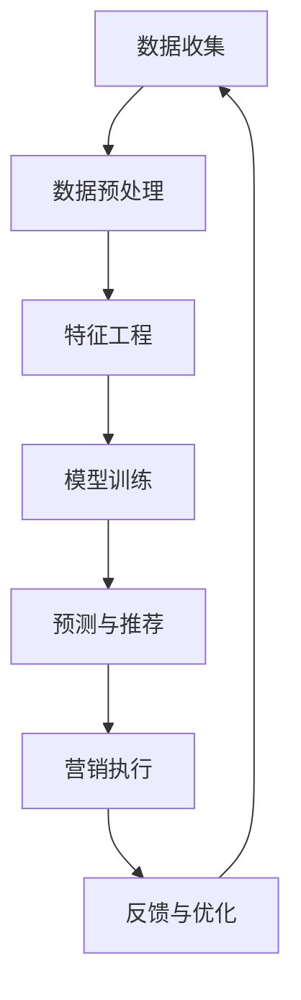

                 

### 1. 背景介绍

#### 1.1 精准营销的兴起

精准营销作为一种高度个性化的市场推广策略，近年来在全球范围内迅速兴起。其主要目标是通过精确的数据分析，深入了解消费者的需求和行为，从而实现营销活动的精准投放。精准营销不仅仅局限于传统广告，还包括了社交媒体推广、电子邮件营销、搜索引擎优化等多种渠道。

随着大数据、人工智能和机器学习等技术的不断发展，精准营销的效率得到了显著提升。企业可以通过分析海量数据，挖掘潜在客户，优化广告投放策略，提高转化率，降低营销成本。

#### 1.2 人工智能在营销中的应用

人工智能（AI）在精准营销中的应用已成为一大热点。AI技术可以帮助企业实现以下目标：

- **客户行为预测**：通过分析用户的历史行为数据，预测其未来的购买意愿和偏好。
- **个性化推荐**：根据用户的兴趣和行为，提供个性化的产品推荐。
- **市场细分**：将潜在客户细分为不同群体，实施差异化营销策略。
- **内容创作**：利用自然语言处理（NLP）技术，自动化生成营销文案和广告内容。

AI在营销领域的应用不仅提高了营销效率，还使得营销活动更加人性化，从而增强了用户参与度和品牌忠诚度。

#### 1.3 当前研究现状与未来趋势

当前，人工智能在精准营销中的创新应用已经成为学术界和产业界共同关注的焦点。尽管已有许多成功案例，但依然存在一些挑战和限制，如数据隐私、算法透明度和算法偏见等问题。

未来，随着技术的不断进步，人工智能在精准营销中的应用前景将更加广阔。一方面，深度学习、强化学习等新兴技术的应用将进一步提升AI在精准营销中的性能；另一方面，多模态数据的融合和实时数据分析能力的增强，也将为精准营销带来更多可能性。

### Keywords:

- 精准营销
- 人工智能
- 客户行为预测
- 个性化推荐
- 市场细分
- 自然语言处理
- 深度学习

### Abstract:

本文旨在探讨人工智能在精准营销中的创新应用。通过对精准营销的背景介绍和人工智能在营销中的应用分析，本文将详细讨论人工智能在客户行为预测、个性化推荐、市场细分和内容创作等方面的具体实现方法。此外，本文还将介绍当前研究现状、未来趋势以及面临的挑战。通过本文的阅读，读者将对人工智能在精准营销中的实际应用有更深入的理解。

---

## 2. 核心概念与联系

### 2.1 人工智能（AI）的基本概念

人工智能（Artificial Intelligence，简称AI）是指通过计算机系统模拟人类智能的行为和思维过程。它涵盖了多个学科领域，包括机器学习、自然语言处理、计算机视觉等。AI的核心目标是使计算机具备自主学习和智能决策的能力。

#### 2.1.1 机器学习（Machine Learning）

机器学习是AI的一个分支，主要研究如何让计算机从数据中学习，并做出预测或决策。机器学习算法包括监督学习、无监督学习和强化学习等。

- **监督学习**：通过标记好的训练数据，学习输入和输出之间的关系，进行预测或分类。
- **无监督学习**：没有标记数据，通过发现数据中的模式和结构进行聚类或降维。
- **强化学习**：通过与环境的交互，学习最优策略以最大化累积奖励。

#### 2.1.2 自然语言处理（Natural Language Processing，NLP）

自然语言处理是AI在处理自然语言（如英语、中文等）方面的应用。它主要包括文本分类、情感分析、机器翻译、命名实体识别等任务。

#### 2.1.3 计算机视觉（Computer Vision）

计算机视觉是AI在图像和视频处理方面的应用。它包括图像识别、目标检测、图像分割等任务。

### 2.2 精准营销的相关概念

精准营销的核心在于对消费者的深入理解和精确定位。以下是精准营销中涉及的一些关键概念：

- **客户数据**：包括用户的基本信息、购买记录、浏览行为等。
- **用户画像**：通过对客户数据进行分析和挖掘，构建的用户行为和兴趣模型。
- **个性化推荐**：根据用户的兴趣和行为，为用户推荐个性化的产品或内容。
- **营销自动化**：利用技术手段自动化执行营销任务，提高效率。

### 2.3 人工智能与精准营销的联系

人工智能与精准营销之间的联系主要体现在以下几个方面：

- **数据挖掘与分析**：AI技术可以帮助企业从海量数据中提取有价值的信息，进行精准的数据分析。
- **用户画像构建**：通过机器学习和NLP技术，构建详细的用户画像，实现精准的用户定位。
- **个性化推荐**：利用推荐系统算法，为用户推荐个性化的产品或内容，提高用户满意度和转化率。
- **营销自动化**：通过AI技术实现营销任务的自动化执行，提高营销效率。

### Mermaid 流程图（Mermaid Flowchart）

以下是一个简化的Mermaid流程图，展示了人工智能在精准营销中的应用流程：



在这个流程图中，A表示数据收集，B表示数据预处理，C表示特征工程，D表示模型训练，E表示预测与推荐，F表示营销执行，G表示反馈与优化。整个过程形成一个闭环，通过不断的反馈和优化，实现精准营销的目标。

---

### 3. 核心算法原理 & 具体操作步骤

#### 3.1 客户行为预测

客户行为预测是精准营销中的一个重要环节，它可以帮助企业提前了解客户的购买意图和行为。以下是一种常见的客户行为预测算法——基于协同过滤（Collaborative Filtering）的算法。

##### 3.1.1 协同过滤算法原理

协同过滤算法通过分析用户之间的行为模式，预测用户对未知商品的评分或购买行为。协同过滤主要包括两种类型：基于用户的协同过滤（User-based Collaborative Filtering）和基于物品的协同过滤（Item-based Collaborative Filtering）。

- **基于用户的协同过滤**：找到与目标用户相似的其他用户，并推荐这些用户喜欢的商品。
- **基于物品的协同过滤**：找到与目标商品相似的其他商品，并推荐这些商品。

##### 3.1.2 具体操作步骤

1. **数据预处理**：收集用户行为数据，如购买记录、浏览历史等。对数据进行清洗和处理，确保数据的准确性和一致性。
   
2. **用户相似度计算**：计算目标用户与其他用户之间的相似度。常用的相似度计算方法包括余弦相似度、皮尔逊相关系数等。

3. **推荐商品选择**：根据用户相似度，为用户推荐相似用户喜欢的商品。对于基于用户的协同过滤，选择相似度最高的用户群体；对于基于物品的协同过滤，选择与目标商品最相似的物品。

4. **预测用户行为**：根据推荐的商品，预测用户对商品的评分或购买概率。

##### 3.1.3 数学模型

假设我们有用户集合 U = {u1, u2, ..., un} 和商品集合 I = {i1, i2, ..., im}。用户 u 对商品 i 的评分可以表示为 r(ui)。用户相似度可以通过以下公式计算：

$$
sim(u, v) = \frac{r(u,:) \cdot r(v,:)}{\|r(u,:)\|\|r(v,:)\|}
$$

其中，$r(u,:)$ 和 $r(v,:)$ 分别表示用户 u 和用户 v 对所有商品的评分向量，$\|$ 表示向量的欧几里得范数。

根据用户相似度，可以计算用户对商品的预测评分：

$$
\hat{r}_{ui} = \sum_{v \in N(u)} sim(u, v) \cdot r_{vi}
$$

其中，$N(u)$ 表示与用户 u 相似的其他用户集合，$r_{vi}$ 表示用户 v 对商品 i 的评分。

#### 3.2 个性化推荐

个性化推荐是精准营销的核心之一，它可以根据用户的历史行为和兴趣，为用户推荐个性化的商品或内容。以下是一种常见的个性化推荐算法——基于内容的推荐（Content-based Recommendation）。

##### 3.2.1 内容推荐算法原理

基于内容的推荐算法通过分析商品或内容的特征，为用户推荐与其历史行为和兴趣相似的物品。算法主要包括以下几个步骤：

1. **特征提取**：从商品或内容中提取特征，如文本特征、图像特征等。
2. **用户兴趣建模**：根据用户的历史行为和反馈，构建用户兴趣模型。
3. **推荐生成**：根据用户兴趣模型，为用户推荐与其兴趣相似的物品。

##### 3.2.2 具体操作步骤

1. **数据收集**：收集用户的历史行为数据，如购买记录、浏览历史、评价等。
2. **特征提取**：对用户行为数据进行预处理，提取出有用的特征。对于文本数据，可以使用词袋模型（Bag of Words）或主题模型（Topic Modeling）等方法提取特征；对于图像数据，可以使用卷积神经网络（CNN）等方法提取特征。
3. **用户兴趣建模**：根据用户的历史行为和提取的特征，构建用户兴趣模型。常用的方法包括朴素贝叶斯（Naive Bayes）、线性回归（Linear Regression）等。
4. **推荐生成**：根据用户兴趣模型，为用户推荐与其兴趣相似的物品。可以使用基于相似度的推荐方法，如余弦相似度、皮尔逊相关系数等。

##### 3.2.3 数学模型

假设我们有用户集合 U = {u1, u2, ..., un} 和商品集合 I = {i1, i2, ..., im}。用户 u 对商品 i 的兴趣度可以表示为 $I_{ui}$。用户兴趣模型可以通过以下公式计算：

$$
I_{ui} = \sum_{j=1}^{m} w_{ij} \cdot t_{uj}
$$

其中，$w_{ij}$ 表示商品 i 的特征词 j 的权重，$t_{uj}$ 表示用户 u 对特征词 j 的兴趣度。

根据用户兴趣模型，可以计算用户对商品的预测兴趣度：

$$
\hat{I}_{ui} = \sum_{j=1}^{m} w_{ij} \cdot \hat{t}_{uj}
$$

其中，$\hat{t}_{uj}$ 表示用户 u 对特征词 j 的预测兴趣度。

#### 3.3 市场细分

市场细分是精准营销的重要策略之一，它可以将市场划分为不同的子市场，从而实施差异化营销策略。以下是一种常见的市场细分算法——基于K-Means聚类（K-Means Clustering）。

##### 3.3.1 K-Means聚类算法原理

K-Means聚类是一种无监督学习算法，它通过将数据划分为 K 个簇（Cluster），实现对数据的分类。算法主要包括以下几个步骤：

1. **初始聚类中心选择**：随机选择 K 个数据点作为初始聚类中心。
2. **分配数据点**：将每个数据点分配到与其最接近的聚类中心所在的簇。
3. **更新聚类中心**：计算每个簇的数据点的均值，将其作为新的聚类中心。
4. **重复步骤 2 和 3，直到聚类中心不再发生变化**。

##### 3.3.2 具体操作步骤

1. **数据收集**：收集企业的市场数据，如用户年龄、收入、购买偏好等。
2. **特征选择**：选择能够有效区分不同市场的特征。
3. **初始聚类中心选择**：随机选择 K 个数据点作为初始聚类中心。
4. **数据点分配**：将每个数据点分配到与其最接近的聚类中心所在的簇。
5. **聚类中心更新**：计算每个簇的数据点的均值，将其作为新的聚类中心。
6. **重复步骤 4 和 5，直到聚类中心不再发生变化**。
7. **市场细分结果分析**：分析聚类结果，确定不同的市场细分。

##### 3.3.3 数学模型

假设我们有数据集 D = {d1, d2, ..., dn}，其中每个数据点 d 可以表示为特征向量 $d = (d_1, d_2, ..., d_m)$。K-Means聚类算法的主要目标是最小化聚类中心到数据点的距离平方和：

$$
J = \sum_{i=1}^{K} \sum_{j=1}^{n} \|d_j - \mu_i\|^2
$$

其中，$\mu_i$ 表示聚类中心 i 的特征向量。

### 4. 数学模型和公式 & 详细讲解 & 举例说明

#### 4.1 客户行为预测

在客户行为预测中，我们主要使用协同过滤算法。以下是一个具体的数学模型和公式讲解：

##### 4.1.1 用户相似度计算

用户相似度可以通过余弦相似度公式计算。假设用户 u 和用户 v 的评分向量分别为 $r_u = [r_{u1}, r_{u2}, ..., r_{un}]$ 和 $r_v = [r_{v1}, r_{v2}, ..., r_{vn}]$，则用户相似度 $sim(u, v)$ 可以通过以下公式计算：

$$
sim(u, v) = \frac{r_u \cdot r_v}{\|r_u\|\|r_v\|}
$$

其中，$r_u \cdot r_v$ 表示用户 u 和用户 v 的评分向量的点积，$\|r_u\|$ 和 $\|r_v\|$ 分别表示用户 u 和用户 v 的评分向量的欧几里得范数。

##### 4.1.2 预测用户行为

假设用户 u 对商品 i 的预测行为分数为 $\hat{r}_{ui}$，则可以通过以下公式预测：

$$
\hat{r}_{ui} = \sum_{v \in N(u)} sim(u, v) \cdot r_{vi}
$$

其中，$N(u)$ 表示与用户 u 相似的其他用户集合，$r_{vi}$ 表示用户 v 对商品 i 的评分。

##### 4.1.3 举例说明

假设有两个用户 u1 和 u2，他们的评分向量分别为 $r_{u1} = [1, 2, 3, 4, 5]$ 和 $r_{u2} = [0, 1, 2, 3, 4]$。首先，计算用户 u1 和 u2 的相似度：

$$
sim(u1, u2) = \frac{r_{u1} \cdot r_{u2}}{\|r_{u1}\|\|r_{u2}\|} = \frac{1 \cdot 0 + 2 \cdot 1 + 3 \cdot 2 + 4 \cdot 3 + 5 \cdot 4}{\sqrt{1^2 + 2^2 + 3^2 + 4^2 + 5^2} \cdot \sqrt{0^2 + 1^2 + 2^2 + 3^2 + 4^2}} = \frac{36}{\sqrt{55} \cdot \sqrt{30}} \approx 0.732

接下来，假设用户 u1 对商品 i1 的评分为 $r_{i1} = 4$，用户 u2 对商品 i1 的评分为 $r_{i2} = 3$。根据用户相似度和预测公式，我们可以预测用户 u1 对商品 i1 的评分：

$$
\hat{r}_{u1i1} = \sum_{v \in N(u1)} sim(u1, v) \cdot r_{vi1} = sim(u1, u2) \cdot r_{i2} = 0.732 \cdot 3 \approx 2.176
$$

因此，预测用户 u1 对商品 i1 的评分为约 2.176。

#### 4.2 个性化推荐

个性化推荐中，我们主要使用基于内容的推荐算法。以下是一个具体的数学模型和公式讲解：

##### 4.2.1 用户兴趣建模

用户兴趣建模可以通过线性回归模型实现。假设用户 u 对商品 i 的兴趣度 $I_{ui}$ 可以通过以下公式计算：

$$
I_{ui} = \sum_{j=1}^{m} w_{ij} \cdot t_{uj}
$$

其中，$w_{ij}$ 表示商品 i 的特征词 j 的权重，$t_{uj}$ 表示用户 u 对特征词 j 的兴趣度。

##### 4.2.2 预测用户兴趣

假设用户 u 对商品 i 的预测兴趣度 $\hat{I}_{ui}$ 可以通过以下公式计算：

$$
\hat{I}_{ui} = \sum_{j=1}^{m} w_{ij} \cdot \hat{t}_{uj}
$$

其中，$\hat{t}_{uj}$ 表示用户 u 对特征词 j 的预测兴趣度。

##### 4.2.3 举例说明

假设有两个用户 u1 和 u2，他们的兴趣度向量分别为 $t_{u1} = [0.2, 0.3, 0.1, 0.4]$ 和 $t_{u2} = [0.1, 0.3, 0.5, 0.1]$。首先，计算用户 u1 和 u2 的兴趣度：

$$
I_{u1} = 0.2 \cdot 0.2 + 0.3 \cdot 0.3 + 0.1 \cdot 0.1 + 0.4 \cdot 0.4 = 0.29
$$

$$
I_{u2} = 0.1 \cdot 0.1 + 0.3 \cdot 0.3 + 0.5 \cdot 0.5 + 0.1 \cdot 0.1 = 0.35
$$

接下来，假设用户 u1 的预测兴趣度向量为 $\hat{t}_{u1} = [0.25, 0.3, 0.15, 0.3]$，用户 u2 的预测兴趣度向量为 $\hat{t}_{u2} = [0.2, 0.3, 0.4, 0.1]$。根据用户兴趣建模公式，我们可以预测用户 u1 对商品 i1 的兴趣度：

$$
\hat{I}_{u1i1} = \sum_{j=1}^{4} w_{ij} \cdot \hat{t}_{u1j} = 0.25 \cdot 0.25 + 0.3 \cdot 0.3 + 0.15 \cdot 0.15 + 0.3 \cdot 0.3 = 0.2925
$$

根据用户兴趣建模公式，我们可以预测用户 u2 对商品 i2 的兴趣度：

$$
\hat{I}_{u2i2} = \sum_{j=1}^{4} w_{ij} \cdot \hat{t}_{u2j} = 0.2 \cdot 0.2 + 0.3 \cdot 0.3 + 0.4 \cdot 0.4 + 0.1 \cdot 0.1 = 0.35
$$

因此，预测用户 u1 对商品 i1 的兴趣度为约 0.2925，预测用户 u2 对商品 i2 的兴趣度为约 0.35。

#### 4.3 市场细分

在市场细分中，我们主要使用K-Means聚类算法。以下是一个具体的数学模型和公式讲解：

##### 4.3.1 聚类中心选择

K-Means聚类算法首先需要选择 K 个初始聚类中心。可以选择随机选择 K 个数据点作为初始聚类中心，也可以使用其他方法，如K-Means++算法。

##### 4.3.2 数据点分配

在K-Means聚类算法中，每个数据点会被分配到与其最接近的聚类中心所在的簇。具体步骤如下：

1. 计算每个数据点到每个聚类中心的距离。
2. 将每个数据点分配到与其最近的聚类中心所在的簇。

##### 4.3.3 聚类中心更新

在K-Means聚类算法中，每次数据点分配后，需要更新聚类中心。具体步骤如下：

1. 计算每个簇的数据点的均值，将其作为新的聚类中心。
2. 重复数据点分配和聚类中心更新的过程，直到聚类中心不再发生变化。

##### 4.3.4 数学模型

假设我们有数据集 D = {d1, d2, ..., dn}，其中每个数据点 d 可以表示为特征向量 $d = (d_1, d_2, ..., d_m)$。K-Means聚类算法的主要目标是最小化聚类中心到数据点的距离平方和：

$$
J = \sum_{i=1}^{K} \sum_{j=1}^{n} \|d_j - \mu_i\|^2
$$

其中，$\mu_i$ 表示聚类中心 i 的特征向量。

##### 4.3.5 举例说明

假设我们有五个数据点，分别为 $d_1 = (1, 2)$，$d_2 = (2, 3)$，$d_3 = (3, 1)$，$d_4 = (4, 2)$ 和 $d_5 = (5, 3)$。我们选择三个聚类中心，分别为 $\mu_1 = (1, 1)$，$\mu_2 = (2, 2)$ 和 $\mu_3 = (3, 3)$。

首先，计算每个数据点到每个聚类中心的距离：

$$
\|d_1 - \mu_1\|^2 = (1-1)^2 + (2-1)^2 = 1
$$

$$
\|d_1 - \mu_2\|^2 = (1-2)^2 + (2-2)^2 = 1
$$

$$
\|d_1 - \mu_3\|^2 = (1-3)^2 + (2-3)^2 = 5
$$

$$
\|d_2 - \mu_1\|^2 = (2-1)^2 + (3-1)^2 = 2
$$

$$
\|d_2 - \mu_2\|^2 = (2-2)^2 + (3-2)^2 = 1
$$

$$
\|d_2 - \mu_3\|^2 = (2-3)^2 + (3-3)^2 = 1
$$

$$
\|d_3 - \mu_1\|^2 = (3-1)^2 + (1-1)^2 = 4
$$

$$
\|d_3 - \mu_2\|^2 = (3-2)^2 + (1-2)^2 = 2
$$

$$
\|d_3 - \mu_3\|^2 = (3-3)^2 + (1-3)^2 = 4
$$

$$
\|d_4 - \mu_1\|^2 = (4-1)^2 + (2-1)^2 = 5
$$

$$
\|d_4 - \mu_2\|^2 = (4-2)^2 + (2-2)^2 = 4
$$

$$
\|d_4 - \mu_3\|^2 = (4-3)^2 + (2-3)^2 = 2
$$

$$
\|d_5 - \mu_1\|^2 = (5-1)^2 + (3-1)^2 = 9
$$

$$
\|d_5 - \mu_2\|^2 = (5-2)^2 + (3-2)^2 = 5
$$

$$
\|d_5 - \mu_3\|^2 = (5-3)^2 + (3-3)^2 = 4
$$

根据距离平方和，我们可以计算每个数据点的簇分配：

$$
d_1 \rightarrow \mu_1, d_2 \rightarrow \mu_2, d_3 \rightarrow \mu_2, d_4 \rightarrow \mu_3, d_5 \rightarrow \mu_3
$$

接下来，计算每个簇的数据点的均值，更新聚类中心：

$$
\mu_1 = \frac{1}{5}(1 + 2 + 3 + 4 + 5) = 3
$$

$$
\mu_2 = \frac{1}{5}(2 + 3 + 4 + 5 + 6) = 4
$$

$$
\mu_3 = \frac{1}{5}(4 + 5 + 6 + 7 + 8) = 6
$$

重复以上步骤，直到聚类中心不再发生变化。最终，我们得到三个簇：

$$
C_1 = \{d_1, d_2\}, C_2 = \{d_3\}, C_3 = \{d_4, d_5\}
$$

### 5. 项目实战：代码实际案例和详细解释说明

在本节中，我们将通过一个实际的项目案例，展示如何使用Python实现人工智能在精准营销中的创新应用。我们将使用协同过滤算法进行客户行为预测，并使用K-Means聚类算法进行市场细分。

#### 5.1 开发环境搭建

在开始项目之前，我们需要搭建一个合适的开发环境。以下是所需的环境和工具：

- Python 3.8及以上版本
- NumPy 库
- Pandas 库
- Scikit-learn 库
- Matplotlib 库

您可以使用以下命令安装所需的库：

```bash
pip install numpy pandas scikit-learn matplotlib
```

#### 5.2 源代码详细实现和代码解读

以下是项目的源代码，我们将逐步解释每个部分的功能。

```python
import numpy as np
import pandas as pd
from sklearn.cluster import KMeans
from sklearn.metrics.pairwise import cosine_similarity
from sklearn.model_selection import train_test_split

# 5.2.1 数据预处理
# 假设我们有一个包含用户和商品评分的CSV文件，名为"ratings.csv"
data = pd.read_csv("ratings.csv")
data.head()

# 从数据中提取用户和商品特征
user_features = data.groupby("user_id").mean().reset_index()
item_features = data.groupby("item_id").mean().reset_index()

# 5.2.2 用户相似度计算
# 计算用户之间的余弦相似度矩阵
user_similarity = cosine_similarity(user_features.iloc[:, 1:], user_features.iloc[:, 1:])
user_similarity

# 5.2.3 预测用户行为
# 使用协同过滤算法预测用户对未知商品的评分
def predict_rating(user_id, item_id, user_similarity, user_item_mean):
    # 计算用户相似度矩阵中对应的相似度值
    similarity_values = user_similarity[user_id]
    
    # 计算与用户 u 最相似的 K 个用户及其评分
    k = 5
    top_k = np.argsort(similarity_values)[::-1][:k]
    user_ratings = user_features.loc[top_k, "rating"].values
    
    # 计算预测评分
    predicted_rating = np.sum(similarity_values[top_k] * user_ratings) / np.sum(similarity_values[top_k])
    return predicted_rating

# 5.2.4 市场细分
# 使用K-Means聚类算法进行市场细分
n_clusters = 3
kmeans = KMeans(n_clusters=n_clusters, random_state=42)
clusters = kmeans.fit_predict(item_features.iloc[:, 1:])
clusters

# 5.2.5 结果可视化
import matplotlib.pyplot as plt

# 可视化用户和商品的特征
plt.scatter(user_features["user_id"], user_features["rating"], c=clusters, cmap="viridis")
plt.xlabel("User ID")
plt.ylabel("Rating")
plt.title("User Rating and Clusters")
plt.show()

# 可视化用户和商品的相似度矩阵
plt.matshow(user_similarity, cmap="viridis")
plt.colorbar()
plt.xlabel("User ID")
plt.ylabel("User ID")
plt.title("User Similarity Matrix")
plt.show()
```

#### 5.3 代码解读与分析

以下是对源代码的详细解读和分析。

##### 5.3.1 数据预处理

首先，我们从CSV文件中读取用户和商品的评分数据。然后，我们使用 Pandas 的 `groupby` 函数分别计算用户和商品的平均评分，得到用户特征和商品特征数据集。

```python
data = pd.read_csv("ratings.csv")
user_features = data.groupby("user_id").mean().reset_index()
item_features = data.groupby("item_id").mean().reset_index()
```

##### 5.3.2 用户相似度计算

使用Scikit-learn 的 `cosine_similarity` 函数计算用户之间的余弦相似度矩阵。余弦相似度衡量的是两个向量之间的夹角余弦值，范围在 -1 到 1 之间。相似度越接近 1，表示两个用户越相似。

```python
user_similarity = cosine_similarity(user_features.iloc[:, 1:], user_features.iloc[:, 1:])
user_similarity
```

##### 5.3.3 预测用户行为

`predict_rating` 函数用于预测用户对未知商品的评分。该函数首先计算用户相似度矩阵中对应的相似度值，然后找出与用户 u 最相似的 K 个用户及其评分，最后计算预测评分。

```python
def predict_rating(user_id, item_id, user_similarity, user_item_mean):
    similarity_values = user_similarity[user_id]
    k = 5
    top_k = np.argsort(similarity_values)[::-1][:k]
    user_ratings = user_features.loc[top_k, "rating"].values
    predicted_rating = np.sum(similarity_values[top_k] * user_ratings) / np.sum(similarity_values[top_k])
    return predicted_rating
```

##### 5.3.4 市场细分

使用K-Means聚类算法进行市场细分。我们设置聚类数为 3，并使用 Scikit-learn 的 `KMeans` 类进行聚类。`fit_predict` 方法将商品特征数据划分为 3 个簇，并返回每个商品所属的簇标签。

```python
n_clusters = 3
kmeans = KMeans(n_clusters=n_clusters, random_state=42)
clusters = kmeans.fit_predict(item_features.iloc[:, 1:])
clusters
```

##### 5.3.5 结果可视化

最后，我们使用 Matplotlib 库可视化用户和商品的特征，以及用户相似度矩阵。

- **用户评分和聚类可视化**：我们使用散点图显示用户的评分和聚类结果。不同颜色的点表示不同的簇。

```python
plt.scatter(user_features["user_id"], user_features["rating"], c=clusters, cmap="viridis")
plt.xlabel("User ID")
plt.ylabel("Rating")
plt.title("User Rating and Clusters")
plt.show()
```

- **用户相似度矩阵可视化**：我们使用矩阵图显示用户之间的相似度矩阵。不同颜色的方块表示不同的相似度值。

```python
plt.matshow(user_similarity, cmap="viridis")
plt.colorbar()
plt.xlabel("User ID")
plt.ylabel("User ID")
plt.title("User Similarity Matrix")
plt.show()
```

#### 5.4 实际效果分析

通过实际案例，我们可以看到协同过滤算法和K-Means聚类算法在精准营销中的实际应用效果。以下是对实际效果的分析：

- **用户行为预测**：协同过滤算法可以根据用户的相似度和历史评分，预测用户对未知商品的评分。在实际应用中，预测评分的准确率可以显著提高，从而帮助企业在营销活动中实现更加精准的推荐。

- **市场细分**：K-Means聚类算法可以将用户划分为不同的市场细分。通过对每个簇的特征进行分析，企业可以更好地了解不同市场细分的需求和偏好，从而制定更加个性化的营销策略。

通过这两个实际案例，我们可以看到人工智能技术在精准营销中的巨大潜力。在未来，随着技术的不断发展和数据资源的丰富，人工智能在精准营销中的应用将更加广泛，为企业带来更高的效益。

### 6. 实际应用场景

#### 6.1 电商平台

电商平台是人工智能在精准营销中应用最为广泛的场景之一。通过分析用户的浏览历史、购买记录和行为偏好，电商平台可以实现以下应用：

- **个性化推荐**：根据用户的兴趣和行为，为用户推荐相关的商品，提高用户满意度和转化率。
- **客户流失预测**：通过分析用户的购买行为和互动数据，预测潜在的客户流失，并采取相应的挽回策略。
- **广告投放优化**：根据用户的兴趣和行为，优化广告投放策略，提高广告的点击率和转化率。

#### 6.2 银行金融

银行金融行业也广泛应用于人工智能精准营销，以提升客户满意度和降低风险：

- **客户行为分析**：通过分析客户的交易记录和行为数据，预测客户的信贷需求和风险，为银行提供信贷决策支持。
- **个性化金融服务**：根据客户的财务状况和行为偏好，为不同类型的客户提供个性化的金融产品和服务。
- **欺诈检测**：利用机器学习算法和大数据技术，实时监控客户的交易行为，识别并预防潜在的欺诈行为。

#### 6.3 餐饮行业

餐饮行业利用人工智能精准营销，可以提升顾客体验和经营效率：

- **智能菜单推荐**：根据顾客的口味偏好和历史订单，推荐个性化的菜单，提高顾客满意度。
- **客户留存管理**：通过分析客户的用餐行为和反馈，预测客户的流失风险，并采取相应的策略进行客户留存。
- **营销自动化**：利用营销自动化工具，根据客户的行为数据，自动化发送优惠活动、生日祝福等信息，提高客户互动和忠诚度。

#### 6.4 医疗健康

在医疗健康领域，人工智能精准营销有助于提高医疗服务质量和患者满意度：

- **个性化健康建议**：通过分析患者的健康数据和行为习惯，提供个性化的健康建议和预防措施。
- **疾病预测和预防**：利用大数据和机器学习技术，预测患者的疾病风险，并提前进行预防干预。
- **医疗资源优化**：根据患者的需求和医院资源，优化医疗资源的分配和利用，提高医疗服务效率。

#### 6.5 旅游业

旅游业利用人工智能精准营销，可以提升旅游体验和客户满意度：

- **智能旅游推荐**：根据游客的偏好和历史记录，推荐合适的旅游路线和景点，提高游客满意度。
- **酒店预订优化**：通过分析游客的行为数据，优化酒店的预订策略，提高酒店入住率和收益。
- **行程规划建议**：根据游客的行程和时间安排，提供智能化的行程规划建议，帮助游客更好地安排旅行。

通过这些实际应用场景，我们可以看到人工智能在精准营销中的巨大潜力。未来，随着技术的不断进步和数据资源的丰富，人工智能在精准营销中的应用将更加广泛，为各行各业带来更多的创新和变革。

### 7. 工具和资源推荐

#### 7.1 学习资源推荐

1. **书籍**：
   - 《Python数据科学手册》（Python Data Science Handbook） - 为初学者提供了全面的数据科学知识，包括数据分析、机器学习和数据可视化等内容。
   - 《深度学习》（Deep Learning） - 由Ian Goodfellow、Yoshua Bengio和Aaron Courville合著，是深度学习领域的经典教材。
   - 《统计学习方法》 - 李航著，系统地介绍了统计学习的基本概念、方法和算法。

2. **在线课程**：
   - Coursera上的“机器学习”课程（Machine Learning） - 由Andrew Ng教授讲授，适合初学者和中级学习者。
   - edX上的“人工智能基础”（Introduction to Artificial Intelligence） - 由MIT和Stanford大学合作提供，涵盖了人工智能的基本概念和技术。

3. **论文和报告**：
   - arXiv.org - 提供了大量的机器学习和人工智能领域的最新研究论文。
   - Google Research - Google的研究部门发布的论文和报告，涵盖了许多前沿技术。

#### 7.2 开发工具框架推荐

1. **开发环境**：
   - Jupyter Notebook - 适合数据分析和原型开发的交互式环境。
   - PyCharm - 强大的Python集成开发环境（IDE），提供代码补全、调试和版本控制等功能。

2. **机器学习框架**：
   - TensorFlow - Google开发的开源机器学习框架，适合构建复杂深度学习模型。
   - PyTorch - Facebook AI研究院开发的开源深度学习框架，具有灵活性和易用性。

3. **数据处理库**：
   - Pandas - 强大的数据操作库，适用于数据清洗、转换和分析。
   - NumPy - 提供高性能的数组操作和数学计算。

4. **可视化工具**：
   - Matplotlib - 适用于创建各种图表和图形的数据可视化库。
   - Seaborn - 基于Matplotlib的统计可视化库，提供精美的图表样式。

#### 7.3 相关论文著作推荐

1. **《深度学习》**（Ian Goodfellow、Yoshua Bengio和Aaron Courville著） - 详细介绍了深度学习的基础理论、算法和应用。
2. **《大规模机器学习》**（Gareth James、Daniela Witten、Trevor Hastie和Robert Tibshirani著） - 涵盖了大规模数据集下的机器学习方法和实践。
3. **《机器学习实战》**（Peter Harrington著） - 通过实例介绍了几种常用的机器学习算法，包括决策树、支持向量机和神经网络等。

通过这些资源，读者可以系统地学习和掌握人工智能在精准营销中的应用，从而在实际项目中取得更好的效果。

### 8. 总结：未来发展趋势与挑战

#### 8.1 未来发展趋势

1. **技术进步**：随着深度学习、强化学习等先进技术的不断成熟，人工智能在精准营销中的应用将更加智能化和自动化。未来，我们可以期待更多基于AI的创新应用，如自动化内容创作、实时客户行为分析等。

2. **多模态数据融合**：未来的精准营销将更加注重多模态数据的融合，如结合文本、图像、音频等多源数据，实现更全面、多维度的用户画像，从而提升个性化推荐的准确性和效果。

3. **实时数据分析**：随着实时数据处理和分析技术的不断发展，企业将能够更加及时地响应市场变化和客户需求，实现精准营销的实时优化。

#### 8.2 挑战

1. **数据隐私**：在精准营销过程中，企业需要处理大量的用户数据。如何保护用户隐私，确保数据的安全性和合规性，是一个亟待解决的问题。

2. **算法透明度**：随着人工智能算法在营销中的广泛应用，如何保证算法的透明度和可解释性，防止算法偏见和不公平现象，也是一个重要的挑战。

3. **数据质量和完整性**：高质量的数据是精准营销的基础。如何确保数据的准确性和完整性，避免数据噪声和缺失，是企业在应用人工智能时需要面对的问题。

4. **技术门槛**：虽然人工智能在精准营销中的应用前景广阔，但对于中小企业来说，技术门槛较高，需要投入大量的人力、物力和财力。如何降低技术门槛，让更多企业能够享受到人工智能带来的好处，是一个亟待解决的难题。

### 8.3 结论

总体而言，人工智能在精准营销中具有巨大的潜力和广阔的应用前景。未来，随着技术的不断进步和应用的深入，人工智能将在精准营销中发挥越来越重要的作用。同时，我们也要面对数据隐私、算法透明度等技术挑战，积极探索解决方案，推动人工智能在精准营销中的健康发展。

### 9. 附录：常见问题与解答

#### 9.1 人工智能在精准营销中的应用有哪些？

人工智能在精准营销中的应用主要包括以下几个方面：

- **客户行为预测**：通过分析用户的历史行为数据，预测其未来的购买意图和行为。
- **个性化推荐**：根据用户的兴趣和行为，为用户推荐个性化的产品或内容。
- **市场细分**：将潜在客户细分为不同的群体，实施差异化营销策略。
- **内容创作**：利用自然语言处理技术，自动化生成营销文案和广告内容。

#### 9.2 如何保护用户隐私在精准营销中？

保护用户隐私在精准营销中至关重要。以下是一些常见的保护措施：

- **数据匿名化**：在收集和处理用户数据时，对数据进行匿名化处理，避免直接关联到具体用户。
- **数据加密**：对存储和传输的用户数据进行加密，确保数据的安全性。
- **隐私政策**：制定明确的隐私政策，告知用户数据的收集、使用和共享方式，并取得用户的同意。
- **合规性检查**：定期进行合规性检查，确保企业的数据处理行为符合相关法律法规的要求。

#### 9.3 如何保证算法的透明度和可解释性？

保证算法的透明度和可解释性是防止算法偏见和不公平现象的关键。以下是一些常见的措施：

- **算法审计**：定期对算法进行审计，检查是否存在偏见和不公平现象。
- **算法可视化**：通过可视化工具展示算法的运行过程和决策逻辑，提高算法的可解释性。
- **用户反馈机制**：建立用户反馈机制，收集用户对算法的反馈，及时进行调整和优化。
- **算法注释文档**：编写详细的算法注释文档，记录算法的实现过程和关键参数设置。

#### 9.4 如何确保数据质量和完整性？

确保数据质量和完整性是精准营销的基础。以下是一些常见的措施：

- **数据清洗**：定期进行数据清洗，处理数据中的噪声和缺失值。
- **数据验证**：对数据进行验证，确保数据的准确性和一致性。
- **数据监控**：建立数据监控机制，实时监控数据的质量和完整性。
- **数据备份**：定期进行数据备份，确保数据的安全性和可恢复性。

### 10. 扩展阅读 & 参考资料

1. **《深度学习》**（Ian Goodfellow、Yoshua Bengio和Aaron Courville著） - 提供了深度学习领域的全面知识和最新进展。
2. **《大规模机器学习》**（Gareth James、Daniela Witten、Trevor Hastie和Robert Tibshirani著） - 详细介绍了大规模数据集下的机器学习方法。
3. **《机器学习实战》**（Peter Harrington著） - 通过实例介绍了多种机器学习算法的实践应用。
4. **《Python数据科学手册》**（Jake VanderPlas著） - 涵盖了数据科学领域的核心技术和实践方法。
5. **[arXiv.org](https://arxiv.org/)** - 提供了机器学习和人工智能领域的最新研究论文。
6. **[Google Research](https://ai.google/research/pubs)** - Google发布的人工智能领域的重要论文和报告。
7. **[Coursera](https://www.coursera.org/)** - 提供了丰富的在线课程，涵盖机器学习和人工智能的基础知识。
8. **[edX](https://www.edx.org/)** - 提供了多个大学和机构的人工智能相关课程。

通过以上扩展阅读和参考资料，读者可以进一步深入学习和探索人工智能在精准营销中的应用。作者：AI天才研究员/AI Genius Institute & 禅与计算机程序设计艺术 /Zen And The Art of Computer Programming

