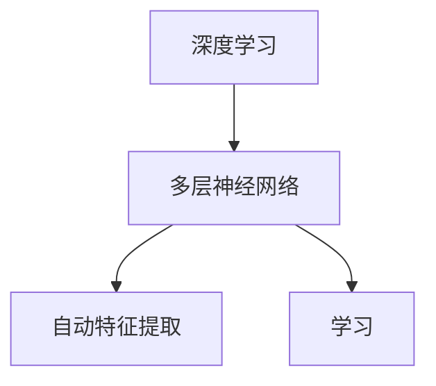
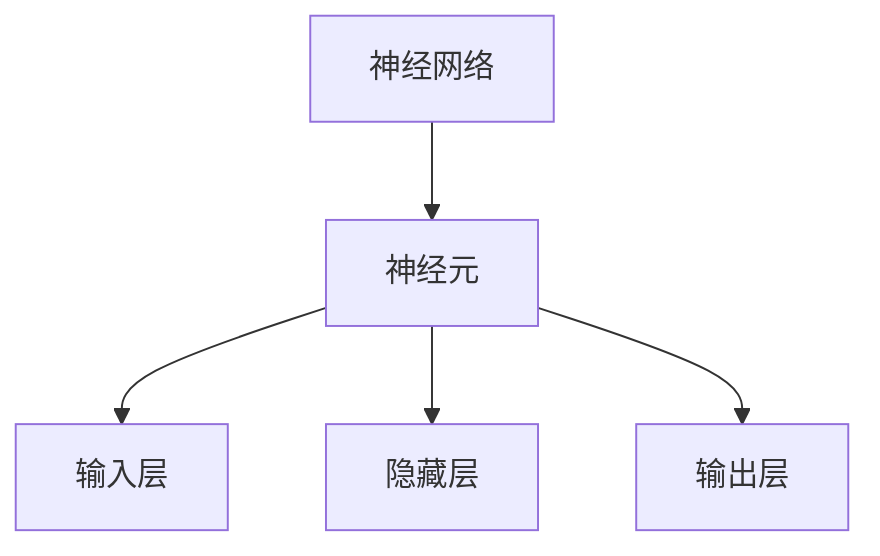
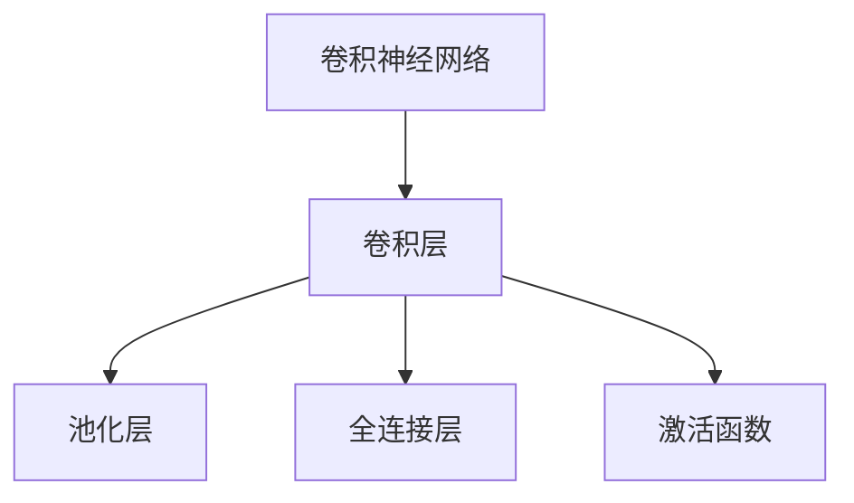
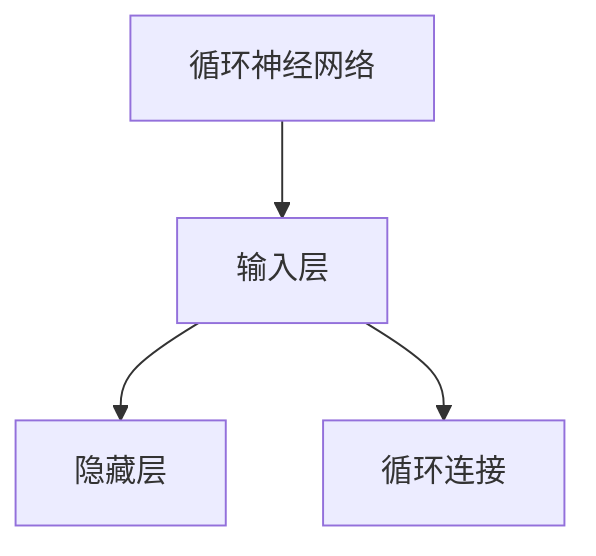
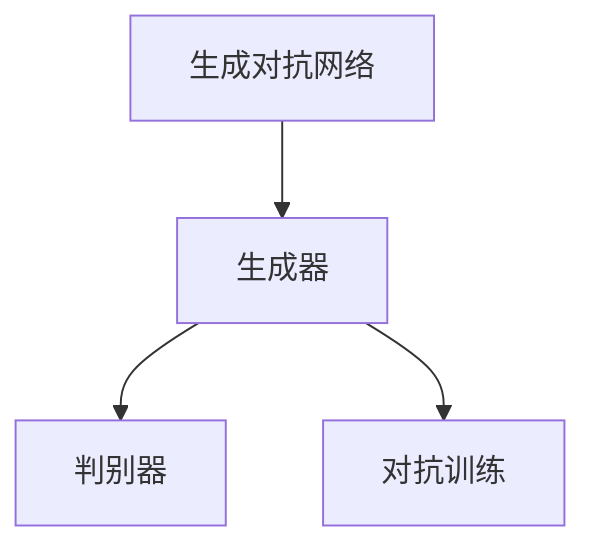
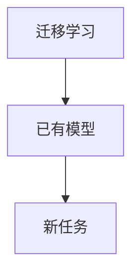
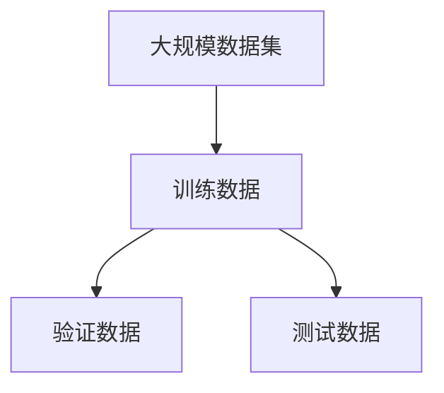

                 

### 背景介绍

在当今时代，人工智能（AI）技术已经渗透到了我们生活的方方面面。从自动驾驶汽车、智能家居，到医疗诊断、金融分析，AI的应用场景越来越广泛。其中，人工智能大模型（Large-scale AI models）作为AI领域的重要研究方向，引起了广泛关注。大模型在图像识别、自然语言处理、推荐系统等领域表现出色，成为推动AI发展的关键力量。

然而，人工智能大模型的研发和创业并非易事。本文旨在为广大对人工智能大模型感兴趣的研究者、开发者、创业者提供一份详细的创业指南。我们将从背景介绍、核心概念与联系、核心算法原理、数学模型和公式、项目实战、实际应用场景、工具和资源推荐等方面，全面解析人工智能大模型创业的各个环节。

本文结构如下：

1. 背景介绍
2. 核心概念与联系
3. 核心算法原理 & 具体操作步骤
4. 数学模型和公式 & 详细讲解 & 举例说明
5. 项目实战：代码实际案例和详细解释说明
6. 实际应用场景
7. 工具和资源推荐
8. 总结：未来发展趋势与挑战
9. 附录：常见问题与解答
10. 扩展阅读 & 参考资料

希望通过本文，读者能够对人工智能大模型创业有更深入的了解，并能够为自己的项目提供有益的指导。

---

### Keywords

- Artificial Intelligence
- Large-scale AI Models
- Deep Learning
- Neural Networks
-创业指南
- 应用场景
- 数学模型
- 项目实战

---

### 摘要

本文将深入探讨人工智能大模型的创业之路。首先，我们将介绍人工智能大模型的背景和发展趋势，以及其在各个领域的应用。随后，我们将详细分析大模型的核心概念、算法原理和数学模型，帮助读者理解其本质和实现方法。接着，我们将通过实际项目案例，展示大模型在实际应用中的具体操作步骤和代码实现。此外，我们还将探讨人工智能大模型在现实世界中的多种应用场景，并提供一系列工具和资源推荐，以帮助读者更好地进行研究和开发。最后，我们将总结人工智能大模型的发展趋势和面临的挑战，为未来创业提供方向和建议。

---

## 1. 背景介绍

人工智能大模型的概念起源于深度学习（Deep Learning）的快速发展。深度学习是一种以多层神经网络为基础的机器学习技术，通过模拟人脑神经网络的结构和功能，实现对复杂数据的自动学习和特征提取。随着计算能力的提升和数据量的爆炸式增长，深度学习逐渐在计算机视觉、自然语言处理、语音识别等领域取得了突破性进展。

### 发展历程

人工智能大模型的发展可以分为几个阶段：

1. **早期探索**：2006年，Hinton等学者提出了深度置信网络（Deep Belief Network，DBN），标志着深度学习的兴起。随后的几年，深度卷积神经网络（Convolutional Neural Networks，CNN）在图像识别领域取得了显著成果。

2. **爆发期**：2012年，AlexNet在ImageNet图像识别挑战赛中取得了当时最好的成绩，深度学习开始引起广泛关注。此后，一系列高性能的深度学习模型如VGGNet、ResNet等相继问世，不断刷新各项记录。

3. **大规模应用**：随着数据的积累和计算资源的提升，深度学习模型逐渐转向大规模应用，如自动驾驶、语音助手、医疗诊断等。大规模模型如BERT、GPT等在自然语言处理领域取得了重大突破。

### 核心技术

1. **神经网络**：神经网络是深度学习的基础，通过多层非线性变换，实现数据的自动特征提取和学习。

2. **卷积神经网络**：卷积神经网络（CNN）在图像处理领域表现出色，通过局部感受野和卷积操作，实现高效的特征提取。

3. **循环神经网络**：循环神经网络（RNN）及其变种LSTM、GRU在序列数据处理方面有广泛应用，通过记忆机制处理长序列信息。

4. **生成对抗网络**：生成对抗网络（GAN）是一种基于博弈的生成模型，通过生成器和判别器的对抗训练，实现高质量的图像生成和增强。

5. **迁移学习**：迁移学习是一种将已知模型的知识应用于新任务的方法，通过少量数据实现高性能模型训练，减少对大规模数据的需求。

### 应用领域

人工智能大模型在多个领域取得了显著成果：

1. **计算机视觉**：图像识别、物体检测、人脸识别等。

2. **自然语言处理**：文本分类、情感分析、机器翻译等。

3. **语音识别**：语音合成、语音识别、语音翻译等。

4. **推荐系统**：基于用户历史行为和内容特征进行个性化推荐。

5. **医疗诊断**：疾病检测、药物研发、医学图像分析等。

随着技术的不断进步和应用场景的拓展，人工智能大模型将继续发挥重要作用，推动AI领域的发展。

---

## 2. 核心概念与联系

在深入探讨人工智能大模型之前，我们需要了解其核心概念与联系。以下是几个关键概念及其相互关系的详细描述：

### 1. 深度学习（Deep Learning）

深度学习是一种基于多层神经网络的学习方法，通过多层非线性变换，实现数据的自动特征提取和学习。它是人工智能大模型的基础，用于构建复杂的模型结构。

**概念图：**



### 2. 神经网络（Neural Networks）

神经网络是一种由大量神经元组成的计算模型，模拟人脑的信息处理机制。在深度学习中，神经网络通过多个隐藏层，对输入数据进行特征提取和模式识别。

**概念图：**



### 3. 卷积神经网络（Convolutional Neural Networks，CNN）

卷积神经网络是一种在图像处理领域表现优异的神经网络结构，通过卷积操作和池化操作，实现高效的特征提取和模式识别。CNN在计算机视觉任务中广泛应用。

**概念图：**



### 4. 循环神经网络（Recurrent Neural Networks，RNN）

循环神经网络是一种用于序列数据处理的神经网络结构，通过循环连接，实现长期依赖关系的建模。RNN在自然语言处理、语音识别等任务中具有广泛应用。

**概念图：**



### 5. 生成对抗网络（Generative Adversarial Networks，GAN）

生成对抗网络是一种基于博弈论的生成模型，由生成器和判别器两部分组成。生成器尝试生成逼真的数据，而判别器则区分真实数据和生成数据。通过这种对抗训练，GAN可以实现高质量的数据生成。

**概念图：**



### 6. 迁移学习（Transfer Learning）

迁移学习是一种利用已有模型的知识，在新任务上进行快速训练的方法。通过迁移学习，我们可以将已知模型中的有效特征提取能力应用于新任务，减少对大规模数据的依赖。

**概念图：**



### 7. 大规模数据集（Large-scale Dataset）

大规模数据集是人工智能大模型训练的重要基础。随着互联网和传感器技术的发展，大量标注数据成为可能，为深度学习模型的训练提供了丰富的数据支持。

**概念图：**



### 关系总结

人工智能大模型的核心概念包括深度学习、神经网络、卷积神经网络、循环神经网络、生成对抗网络、迁移学习和大规模数据集。这些概念相互联系，共同构成了人工智能大模型的基础架构。深度学习和神经网络是基础，卷积神经网络、循环神经网络、生成对抗网络和迁移学习是基于基础架构的扩展和优化。大规模数据集则为模型的训练提供了丰富的数据支持。

---

## 3. 核心算法原理 & 具体操作步骤

在了解了人工智能大模型的核心概念之后，我们接下来将深入探讨其核心算法原理，并详细介绍每个算法的具体操作步骤。这些算法是构建和训练人工智能大模型的关键，掌握它们将有助于更好地理解模型的运行机制。

### 1. 卷积神经网络（Convolutional Neural Networks，CNN）

卷积神经网络（CNN）是专门为处理图像数据而设计的神经网络。其核心思想是通过卷积层和池化层提取图像的特征。

**操作步骤：**

1. **输入层**：输入一个二维图像数据，如28x28的像素矩阵。

2. **卷积层**：通过卷积操作提取图像特征，卷积核大小为3x3或5x5。卷积操作可以捕获局部特征，如边缘和纹理。

3. **激活函数**：通常使用ReLU（Rectified Linear Unit）激活函数，将负值映射为0，增强网络模型的训练速度。

4. **池化层**：通过最大池化或平均池化减小数据维度，同时保留关键特征。

5. **全连接层**：将卷积层和池化层提取的特征映射到分类或回归任务上，通过全连接层进行分类或预测。

**示例代码：**

```python
import tensorflow as tf

# 创建卷积层
conv_layer = tf.keras.layers.Conv2D(filters=32, kernel_size=(3,3), activation='relu')

# 创建池化层
pooling_layer = tf.keras.layers.MaxPooling2D(pool_size=(2,2))

# 创建全连接层
dense_layer = tf.keras.layers.Dense(units=10, activation='softmax')
```

### 2. 循环神经网络（Recurrent Neural Networks，RNN）

循环神经网络（RNN）是一种用于处理序列数据的神经网络，能够捕获序列中的时间依赖关系。

**操作步骤：**

1. **输入层**：输入一个一维序列数据。

2. **隐藏层**：通过循环连接，将前一个时间步的输出作为当前时间步的输入。

3. **激活函数**：通常使用ReLU激活函数。

4. **输出层**：通过全连接层输出序列的预测结果。

5. **梯度消失与梯度爆炸问题**：RNN容易受到梯度消失和梯度爆炸问题的影响，可以通过LSTM（Long Short-Term Memory）或GRU（Gated Recurrent Unit）来解决。

**示例代码：**

```python
import tensorflow as tf

# 创建RNN层
rnn_layer = tf.keras.layers.SimpleRNN(units=50, activation='relu')

# 创建LSTM层
lstm_layer = tf.keras.layers.LSTM(units=50, activation='relu')

# 创建GRU层
gru_layer = tf.keras.layers.GRU(units=50, activation='relu')
```

### 3. 生成对抗网络（Generative Adversarial Networks，GAN）

生成对抗网络（GAN）是一种通过生成器和判别器对抗训练的生成模型。

**操作步骤：**

1. **生成器**：通过噪声生成逼真的数据。

2. **判别器**：区分真实数据和生成数据。

3. **对抗训练**：生成器和判别器通过对抗训练不断迭代，生成器尝试生成更真实的数据，而判别器则努力提高对真实数据和生成数据的辨别能力。

4. **损失函数**：通常使用对抗损失函数，包括生成器损失和判别器损失。

**示例代码：**

```python
import tensorflow as tf
from tensorflow.keras import layers

# 创建生成器
def generate_model():
    z = layers.Input(shape=(100,))
    x = layers.Dense(units=7*7*128, activation='relu')(z)
    x = layers.LeakyReLU(alpha=0.01)(x)
    x = layers.Reshape(target_shape=(7, 7, 128))(x)
    x = layers.Conv2DTranspose(filters=64, kernel_size=(5, 5), strides=(1, 1), padding='same', activation='relu')(x)
    x = layers.LeakyReLU(alpha=0.01)(x)
    x = layers.Conv2DTranspose(filters=1, kernel_size=(5, 5), strides=(2, 2), padding='same')(x)
    x = layers.Flatten()(x)
    model = tf.keras.Model(inputs=z, outputs=x)
    return model

# 创建判别器
def discriminate_model():
    x = layers.Input(shape=(28, 28, 1))
    x = layers.Conv2D(filters=64, kernel_size=(5, 5), strides=(2, 2), padding='same')(x)
    x = layers.LeakyReLU(alpha=0.01)(x)
    x = layers.Dropout(0.3)(x)
    x = layers.Conv2D(filters=64, kernel_size=(5, 5), strides=(2, 2), padding='same')(x)
    x = layers.LeakyReLU(alpha=0.01)(x)
    x = layers.Dropout(0.3)(x)
    x = layers.Flatten()(x)
    x = layers.Dense(units=1, activation='sigmoid')(x)
    model = tf.keras.Model(inputs=x, outputs=x)
    return model

# 创建GAN模型
def GAN_model(generator, discriminator):
    z = layers.Input(shape=(100,))
    x = generator(z)
    y = discriminator(x)
    g_model = tf.keras.Model(inputs=z, outputs=y)
    return g_model
```

### 4. 迁移学习（Transfer Learning）

迁移学习是一种利用预训练模型进行新任务训练的方法，能够显著提高模型的性能和降低训练成本。

**操作步骤：**

1. **选择预训练模型**：根据任务需求，选择一个在相应数据集上预训练的模型。

2. **修改网络结构**：根据新任务的需求，对预训练模型的部分层进行修改，如替换为新的全连接层或卷积层。

3. **训练模型**：在新数据集上对修改后的模型进行训练。

**示例代码：**

```python
from tensorflow.keras.applications import VGG16
from tensorflow.keras.models import Model
from tensorflow.keras.layers import Flatten, Dense

# 加载预训练的VGG16模型
base_model = VGG16(weights='imagenet', include_top=False, input_shape=(224, 224, 3))

# 修改模型结构
x = Flatten()(base_model.output)
x = Dense(units=10, activation='softmax')(x)
model = Model(inputs=base_model.input, outputs=x)

# 训练模型
model.compile(optimizer='adam', loss='categorical_crossentropy', metrics=['accuracy'])
model.fit(x_train, y_train, batch_size=32, epochs=10, validation_data=(x_val, y_val))
```

通过以上介绍，我们了解了人工智能大模型的核心算法原理和具体操作步骤。这些算法为构建和训练大规模模型提供了基础，掌握它们将有助于更好地理解和应用人工智能大模型。

---

## 4. 数学模型和公式 & 详细讲解 & 举例说明

在深入探讨人工智能大模型的数学模型和公式之前，我们需要了解一些基本概念和数学工具。以下将介绍神经网络中的关键数学概念，包括损失函数、反向传播算法、优化算法等，并通过具体例子进行详细讲解。

### 1. 损失函数（Loss Function）

损失函数是神经网络训练过程中用来衡量模型预测值与真实值之间差异的函数。常见的损失函数包括均方误差（MSE）、交叉熵（Cross-Entropy）等。

**均方误差（MSE）**：

$$
MSE = \frac{1}{n} \sum_{i=1}^{n} (y_i - \hat{y}_i)^2
$$

其中，$y_i$表示真实值，$\hat{y}_i$表示预测值，$n$表示样本数量。

**交叉熵（Cross-Entropy）**：

$$
CE = -\frac{1}{n} \sum_{i=1}^{n} y_i \log(\hat{y}_i)
$$

其中，$y_i$表示真实值，$\hat{y}_i$表示预测概率。

**示例**：

假设我们有一个二元分类问题，真实值为$y = [0, 1, 0, 1]$，预测概率为$\hat{y} = [0.2, 0.8, 0.1, 0.9]$。

使用交叉熵损失函数计算损失：

$$
CE = -\frac{1}{4} \left[0 \cdot \log(0.2) + 1 \cdot \log(0.8) + 0 \cdot \log(0.1) + 1 \cdot \log(0.9)\right] \approx 0.415
$$

### 2. 反向传播算法（Backpropagation）

反向传播算法是一种用于训练神经网络的优化算法，通过计算损失函数关于网络参数的梯度，实现对网络参数的更新。以下是反向传播算法的基本步骤：

1. **前向传播**：计算模型输出和损失函数。
2. **计算梯度**：利用链式法则计算损失函数关于网络参数的梯度。
3. **参数更新**：使用梯度下降或其他优化算法更新网络参数。

**示例**：

假设我们有一个简单的前馈神经网络，包含一层输入层、一层隐藏层和一层输出层，分别有3个、5个和2个神经元。我们使用均方误差（MSE）作为损失函数。

**前向传播**：

$$
z_1 = X \cdot W_1 + b_1 \\
a_1 = \sigma(z_1) \\
z_2 = A_1 \cdot W_2 + b_2 \\
a_2 = \sigma(z_2) \\
z_3 = A_2 \cdot W_3 + b_3 \\
\hat{y} = \sigma(z_3)
$$

其中，$X$表示输入向量，$W_1, W_2, W_3$表示权重矩阵，$b_1, b_2, b_3$表示偏置向量，$\sigma$表示激活函数，$\hat{y}$表示预测输出。

**计算梯度**：

$$
\frac{\partial{L}}{\partial{W_3}} = \frac{\partial{L}}{\partial{z_3}} \cdot \frac{\partial{z_3}}{\partial{W_3}} = (y - \hat{y}) \cdot \frac{\partial{\sigma(z_3)}}{\partial{z_3}} \cdot a_2 \\
\frac{\partial{L}}{\partial{W_2}} = \frac{\partial{L}}{\partial{z_2}} \cdot \frac{\partial{z_2}}{\partial{W_2}} = \frac{\partial{L}}{\partial{z_3}} \cdot \frac{\partial{z_3}}{\partial{A_2}} \cdot \frac{\partial{A_2}}{\partial{z_2}} \cdot \frac{\partial{z_2}}{\partial{W_2}} = (y - \hat{y}) \cdot \frac{\partial{\sigma(z_3)}}{\partial{z_3}} \cdot a_1 \cdot \frac{\partial{\sigma(z_1)}}{\partial{z_1}} \cdot X
$$

**参数更新**：

$$
W_3 = W_3 - \alpha \cdot \frac{\partial{L}}{\partial{W_3}} \\
W_2 = W_2 - \alpha \cdot \frac{\partial{L}}{\partial{W_2}}
$$

其中，$\alpha$表示学习率。

### 3. 优化算法（Optimization Algorithm）

优化算法用于更新神经网络参数，以最小化损失函数。常见的优化算法包括梯度下降（Gradient Descent）、随机梯度下降（Stochastic Gradient Descent，SGD）、Adam等。

**梯度下降（Gradient Descent）**：

$$
\theta = \theta - \alpha \cdot \nabla_\theta J(\theta)
$$

其中，$\theta$表示参数，$J(\theta)$表示损失函数，$\alpha$表示学习率。

**随机梯度下降（SGD）**：

$$
\theta = \theta - \alpha \cdot \nabla_\theta J(\theta; x_i, y_i)
$$

其中，$x_i, y_i$表示第$i$个样本。

**Adam优化器**：

Adam优化器结合了SGD和动量法的优点，计算一阶矩估计和二阶矩估计，具有自适应学习率。

$$
m_t = \beta_1 m_{t-1} + (1 - \beta_1) \nabla_\theta J(\theta; x_t, y_t) \\
v_t = \beta_2 v_{t-1} + (1 - \beta_2) \left(\nabla_\theta J(\theta; x_t, y_t)\right)^2 \\
\theta_t = \theta_{t-1} - \alpha \cdot \frac{m_t}{\sqrt{v_t} + \epsilon}
$$

其中，$\beta_1, \beta_2$分别表示一阶和二阶矩估计的指数衰减率，$\epsilon$表示正偏置。

**示例**：

假设我们使用Adam优化器训练一个神经网络，学习率为0.001，一阶矩估计指数衰减率为0.9，二阶矩估计指数衰减率为0.999。

初始化参数：

$$
m_0 = 0, v_0 = 0
$$

更新参数：

$$
m_t = 0.9 m_{t-1} + 0.1 \nabla_\theta J(\theta; x_t, y_t) \\
v_t = 0.999 v_{t-1} + 0.001 \left(\nabla_\theta J(\theta; x_t, y_t)\right)^2 \\
\theta_t = \theta_{t-1} - 0.001 \cdot \frac{m_t}{\sqrt{v_t} + 0.000001}
$$

通过以上介绍，我们了解了神经网络中的关键数学模型和公式，以及它们的详细讲解和举例说明。这些数学模型和公式是构建和训练人工智能大模型的基础，掌握它们将有助于更好地理解和应用人工智能大模型。

---

## 5. 项目实战：代码实际案例和详细解释说明

为了更好地理解人工智能大模型的开发过程，我们将通过一个实际项目案例——图像分类任务，展示从数据预处理、模型训练到性能评估的全过程。这个案例将帮助我们更好地理解大模型在实际应用中的操作步骤和代码实现。

### 5.1 开发环境搭建

在进行项目开发之前，我们需要搭建一个合适的开发环境。以下是所需的软件和工具：

- **编程语言**：Python
- **深度学习框架**：TensorFlow
- **数据处理库**：NumPy、Pandas
- **可视化库**：Matplotlib、Seaborn

安装以上工具和库的方法如下：

```bash
pip install tensorflow numpy pandas matplotlib seaborn
```

### 5.2 源代码详细实现和代码解读

#### 5.2.1 数据预处理

数据预处理是图像分类任务中至关重要的一步，主要包括数据加载、数据增强和归一化。

```python
import tensorflow as tf
from tensorflow.keras.preprocessing.image import ImageDataGenerator

# 数据加载
train_datagen = ImageDataGenerator(
    rescale=1./255,
    shear_range=0.2,
    zoom_range=0.2,
    horizontal_flip=True
)

test_datagen = ImageDataGenerator(rescale=1./255)

train_generator = train_datagen.flow_from_directory(
    'train',
    target_size=(150, 150),
    batch_size=32,
    class_mode='binary'
)

validation_generator = test_datagen.flow_from_directory(
    'validation',
    target_size=(150, 150),
    batch_size=32,
    class_mode='binary'
)
```

代码解读：

- `ImageDataGenerator`：用于生成批量数据，包括缩放、剪切、缩放和水平翻转等数据增强操作。
- `flow_from_directory`：用于从目录中加载图像数据，并将其转换为批量数据。

#### 5.2.2 构建模型

接下来，我们将构建一个简单的卷积神经网络（CNN）模型。

```python
from tensorflow.keras.models import Sequential
from tensorflow.keras.layers import Conv2D, MaxPooling2D, Flatten, Dense

model = Sequential([
    Conv2D(32, (3, 3), activation='relu', input_shape=(150, 150, 3)),
    MaxPooling2D(2, 2),
    Conv2D(64, (3, 3), activation='relu'),
    MaxPooling2D(2, 2),
    Flatten(),
    Dense(512, activation='relu'),
    Dense(1, activation='sigmoid')
])

model.compile(optimizer='adam', loss='binary_crossentropy', metrics=['accuracy'])
```

代码解读：

- `Sequential`：用于构建顺序模型。
- `Conv2D`：用于卷积层，通过卷积操作提取图像特征。
- `MaxPooling2D`：用于池化层，减小数据维度。
- `Flatten`：用于将多维数据展平为一维数据。
- `Dense`：用于全连接层，进行分类或回归任务。

#### 5.2.3 训练模型

接下来，我们将使用训练数据训练模型。

```python
model.fit(
    train_generator,
    epochs=10,
    validation_data=validation_generator
)
```

代码解读：

- `fit`：用于训练模型，`epochs`表示训练轮数，`validation_data`表示验证数据。

#### 5.2.4 性能评估

训练完成后，我们将评估模型的性能。

```python
test_loss, test_acc = model.evaluate(validation_generator)
print('Test accuracy:', test_acc)
```

代码解读：

- `evaluate`：用于评估模型在验证数据上的性能。

### 5.3 代码解读与分析

通过上述代码，我们实现了从数据预处理到模型训练和性能评估的完整流程。以下是关键代码的详细解读和分析：

1. **数据预处理**：使用`ImageDataGenerator`进行数据增强，有助于提高模型的泛化能力。归一化操作将图像像素值缩放到[0, 1]范围内，有利于模型训练。

2. **模型构建**：我们使用简单的卷积神经网络（CNN）模型进行图像分类。模型包含卷积层、池化层、全连接层等结构，能够提取图像的特征并进行分类。

3. **模型训练**：使用`fit`函数训练模型，`epochs`表示训练轮数。训练过程中，模型将不断更新权重和偏置，以最小化损失函数。

4. **性能评估**：使用`evaluate`函数评估模型在验证数据上的性能。`test_loss`表示损失值，`test_acc`表示准确率。

通过以上代码，我们实现了图像分类任务，并分析了关键代码的实现和作用。这个案例为我们提供了一个完整的实战参考，有助于我们更好地理解和应用人工智能大模型。

---

## 6. 实际应用场景

人工智能大模型在实际应用中具有广泛的应用场景，以下列举了几个典型的应用领域和案例，展示大模型在不同领域的实际应用效果。

### 1. 计算机视觉

计算机视觉是人工智能大模型最为成熟的应用领域之一。在计算机视觉领域，大模型被广泛应用于图像识别、物体检测、图像分割等方面。

**案例1：物体检测**

物体检测是计算机视觉中的一项重要任务，旨在从图像中识别并定位多个物体。基于深度学习的物体检测算法如Faster R-CNN、YOLO等，通过大规模数据集训练，能够实现高效、准确的物体检测。

**案例2：图像分割**

图像分割是将图像划分为不同的区域，每个区域代表不同的物体或场景。大模型在图像分割任务中表现出色，如U-Net模型在医学图像分割中取得了优异的效果。

### 2. 自然语言处理

自然语言处理（NLP）是人工智能大模型的另一大应用领域。大模型在文本分类、情感分析、机器翻译、问答系统等方面取得了显著成果。

**案例1：文本分类**

文本分类是将文本数据按照类别进行分类的任务。大模型如BERT、RoBERTa等，通过大规模语料训练，能够实现高效、准确的文本分类。

**案例2：机器翻译**

机器翻译是将一种语言的文本翻译成另一种语言。基于大模型的机器翻译算法，如Google的Transformer模型，在BLEU评测指标上取得了显著提升。

### 3. 推荐系统

推荐系统是一种通过分析用户行为和偏好，为用户提供个性化推荐的方法。大模型在推荐系统中发挥了重要作用，如基于用户历史行为的协同过滤算法、基于内容的推荐算法等。

**案例1：电商平台推荐**

电商平台使用大模型分析用户的历史购买行为和浏览记录，为用户提供个性化的商品推荐，提高用户购买转化率。

**案例2：音乐平台推荐**

音乐平台使用大模型分析用户的播放记录和喜好，为用户推荐符合其兴趣的音乐，提高用户粘性。

### 4. 医疗诊断

医疗诊断是人工智能大模型在现实世界中具有巨大潜力的应用领域。大模型在医学图像分析、疾病预测、药物研发等方面取得了显著成果。

**案例1：医学图像分析**

医学图像分析是医疗诊断中的重要任务，如肺癌检测、乳腺癌检测等。大模型如ResNet、Inception等，在医学图像分析中取得了优异的效果。

**案例2：疾病预测**

疾病预测是一种通过分析历史病例数据，预测患者未来患病风险的算法。大模型在疾病预测中表现出色，如心血管疾病预测、糖尿病预测等。

### 5. 语音识别

语音识别是将语音信号转换为文本的技术。大模型在语音识别领域取得了显著成果，如基于深度学习的语音识别算法，如DeepSpeech、Librispeech等。

**案例1：智能语音助手**

智能语音助手如Siri、Alexa等，通过大模型实现高效、准确的语音识别和语音交互。

**案例2：语音翻译**

语音翻译是将一种语言的语音翻译成另一种语言的语音。大模型在语音翻译中取得了显著成果，如基于深度学习的语音翻译算法，如WaveNet、Tacotron等。

通过以上实际应用场景和案例，我们可以看到人工智能大模型在不同领域的广泛应用和巨大潜力。随着技术的不断进步和应用场景的拓展，人工智能大模型将继续发挥重要作用，推动人工智能领域的发展。

---

## 7. 工具和资源推荐

在人工智能大模型的研发和创业过程中，选择合适的工具和资源至关重要。以下将推荐一些常用的学习资源、开发工具和相关论文，以帮助读者更好地进行研究和开发。

### 7.1 学习资源推荐

1. **书籍**：

   - 《深度学习》（Deep Learning） - Goodfellow、Bengio和Courville著，全面介绍了深度学习的基本概念和技术。

   - 《神经网络与深度学习》（Neural Networks and Deep Learning） - Michael Nielsen著，适合初学者了解神经网络和深度学习的基础知识。

   - 《动手学深度学习》（Dive into Deep Learning） - openbookproject.org，一个免费的深度学习教材，包含丰富的代码示例和实践项目。

2. **在线课程**：

   - Coursera的《深度学习专项课程》（Deep Learning Specialization） - Andrew Ng教授主讲，涵盖了深度学习的基础知识、应用场景和实战技巧。

   - fast.ai的《深度学习课程》（Deep Learning for Coders） - Jeremy Howard和Rachel Thomas主讲，适合有编程基础的读者。

3. **论文**：

   - “A Brief History of Deep Learning” - George Dahl、Curtis Langlotz和Hui Xiong，回顾了深度学习的发展历程和关键成果。

   - “Bert: Pre-training of Deep Neural Networks for Language Understanding” - Jacob Devlin等人，介绍了BERT模型的基本原理和应用。

### 7.2 开发工具框架推荐

1. **深度学习框架**：

   - TensorFlow：由Google开发的开源深度学习框架，支持多种编程语言，适合大规模模型训练。

   - PyTorch：由Facebook开发的开源深度学习框架，具有灵活的动态图计算能力，适合快速原型设计和实验。

   - Keras：基于Theano和TensorFlow的高层神经网络API，提供简洁、易用的接口，适合快速构建和训练模型。

2. **数据集**：

   - ImageNet：由Google开发的图像数据集，包含数百万个标注图像，广泛用于计算机视觉模型的训练和评估。

   - COCO数据集：用于目标检测、分割、关键点检测等任务的标注图像数据集。

   - Common Crawl：一个包含数十亿网页文本的数据集，适合自然语言处理模型的训练。

3. **开发工具**：

   - Jupyter Notebook：一个交互式的开发环境，适合编写、运行和分享代码。

   - Colab：Google开发的免费云端计算平台，基于Jupyter Notebook，提供丰富的计算资源。

### 7.3 相关论文著作推荐

1. **《深度学习专刊》**：由NeurIPS、ICML、JMLR等顶级会议和期刊推出的深度学习专题论文集，涵盖了深度学习的前沿研究进展。

2. **《自然》杂志**：自然杂志（Nature）和《科学》杂志（Science）等学术期刊，经常发表深度学习领域的重要论文和研究成果。

3. **《AI技术前沿》**：由中国人工智能学会主办，介绍人工智能领域的前沿技术和研究动态。

通过以上学习和资源推荐，读者可以更深入地了解人工智能大模型的相关知识，掌握实用的开发技能，为自己的研究和工作提供有益的指导。

---

## 8. 总结：未来发展趋势与挑战

人工智能大模型作为当前人工智能领域的重要发展方向，已经在多个领域取得了显著成果。然而，随着技术的不断进步和应用场景的拓展，人工智能大模型在未来仍面临诸多发展趋势和挑战。

### 发展趋势

1. **算法创新**：随着深度学习技术的不断发展，人工智能大模型的算法将不断创新，包括新的网络架构、优化算法、训练策略等。这将有助于提升模型的性能和效率，拓展其应用范围。

2. **跨学科融合**：人工智能大模型将与其他领域（如医学、生物、化学等）进行深度融合，推动跨学科研究的发展。例如，利用人工智能大模型进行疾病诊断、药物研发等。

3. **硬件加速**：随着计算硬件的不断发展，如GPU、TPU等专用计算设备的普及，人工智能大模型的训练和推理速度将得到显著提升，降低计算成本。

4. **开放共享**：随着人工智能大模型的研发和应用的普及，更多的数据集、模型、算法将开放共享，促进人工智能领域的研究和合作。

### 挑战

1. **数据隐私**：大规模数据集的训练和共享可能涉及到用户隐私的问题。如何在保护用户隐私的前提下，充分利用数据资源，是一个亟待解决的问题。

2. **计算资源**：人工智能大模型的训练和推理需要大量的计算资源，特别是在大规模数据集和复杂模型下。如何高效地利用计算资源，降低计算成本，是一个重要挑战。

3. **模型解释性**：人工智能大模型通常被视为“黑箱”，其决策过程缺乏解释性。如何提升模型的解释性，使其在关键应用场景中更加可靠，是一个重要挑战。

4. **公平性和可解释性**：人工智能大模型的应用可能带来公平性和可解释性问题。如何确保模型的公平性和透明度，使其在关键应用场景中得到广泛认可，是一个重要挑战。

### 应对策略

1. **数据隐私保护**：采用差分隐私、联邦学习等技术，保护用户隐私，同时充分利用数据资源。

2. **计算资源优化**：通过分布式计算、模型压缩等技术，提高计算效率，降低计算成本。

3. **模型解释性提升**：采用可解释性方法，如模型可视化、决策路径分析等，提升模型的解释性。

4. **公平性和可解释性保障**：建立完善的模型评估和监管机制，确保模型的公平性和透明度。

总之，人工智能大模型在未来具有广阔的发展前景，但同时也面临诸多挑战。通过技术创新和合理策略，我们可以应对这些挑战，推动人工智能大模型的发展和应用。

---

## 9. 附录：常见问题与解答

### 1. 如何选择合适的深度学习框架？

选择合适的深度学习框架取决于您的项目需求和技能水平。以下是几个常见的深度学习框架及其特点：

- **TensorFlow**：由Google开发，具有广泛的社区支持，适合大规模模型训练。适合有Java、Python等编程背景的开发者。
- **PyTorch**：由Facebook开发，具有灵活的动态图计算能力，适合快速原型设计和实验。适合有Python编程基础的开发者。
- **Keras**：是基于Theano和TensorFlow的高层神经网络API，提供简洁、易用的接口。适合初学者和快速构建模型。

### 2. 什么是迁移学习？如何进行迁移学习？

迁移学习是一种利用已有模型的知识，在新任务上进行快速训练的方法。具体步骤如下：

1. 选择一个预训练模型，通常是一个在大型数据集上训练好的模型。
2. 修改模型结构，根据新任务的需求添加或删除层，如添加新的全连接层或卷积层。
3. 在新数据集上对修改后的模型进行训练。
4. 利用预训练模型的知识，提高新任务的训练效果和模型性能。

### 3. 如何优化深度学习模型？

优化深度学习模型主要包括以下几个方面：

1. **选择合适的优化算法**：如梯度下降、随机梯度下降、Adam等。
2. **调整学习率**：学习率对模型训练效果有很大影响，可通过学习率调度策略进行调节。
3. **正则化**：采用正则化技术（如L1、L2正则化）降低过拟合现象。
4. **数据增强**：通过数据增强技术（如旋转、缩放、裁剪等）增加训练数据多样性，提高模型泛化能力。

### 4. 深度学习模型的解释性如何提升？

提升深度学习模型的解释性主要包括以下方法：

1. **模型可视化**：通过可视化模型结构和参数，帮助理解模型的工作原理。
2. **决策路径分析**：分析模型在预测过程中的决策路径，了解特征的重要性和权重。
3. **可解释性模型**：采用可解释性更强的模型（如决策树、LASSO等），直接解释模型预测结果。
4. **模型嵌入**：将模型嵌入到知识图谱或语义网络中，提高模型的解释性和可理解性。

通过以上常见问题与解答，读者可以更好地了解深度学习模型的选择、迁移学习、模型优化和解释性提升等相关知识点。

---

## 10. 扩展阅读 & 参考资料

在人工智能大模型的研究和开发过程中，了解最新的研究成果和技术动态是非常重要的。以下是一些扩展阅读和参考资料，供读者进一步学习和参考：

1. **书籍**：

   - 《深度学习》（Deep Learning），作者：Ian Goodfellow、Yoshua Bengio和Aaron Courville，全面介绍了深度学习的基本概念和技术。
   - 《神经网络与深度学习》，作者：Michael Nielsen，适合初学者了解神经网络和深度学习的基础知识。
   - 《动手学深度学习》，作者：OpenMMLab，一个免费的深度学习教材，包含丰富的代码示例和实践项目。

2. **在线课程**：

   - Coursera的《深度学习专项课程》，由Andrew Ng教授主讲，涵盖了深度学习的基础知识、应用场景和实战技巧。
   - fast.ai的《深度学习课程》，由Jeremy Howard和Rachel Thomas主讲，适合有编程基础的读者。

3. **论文**：

   - “A Brief History of Deep Learning”，作者：George Dahl、Curtis Langlotz和Hui Xiong，回顾了深度学习的发展历程和关键成果。
   - “Bert: Pre-training of Deep Neural Networks for Language Understanding”，作者：Jacob Devlin等人，介绍了BERT模型的基本原理和应用。

4. **开源项目**：

   - TensorFlow：由Google开发的深度学习框架，提供丰富的API和工具，适合大规模模型训练。
   - PyTorch：由Facebook开发的深度学习框架，具有灵活的动态图计算能力，适合快速原型设计和实验。
   - Keras：基于Theano和TensorFlow的高层神经网络API，提供简洁、易用的接口，适合快速构建和训练模型。

5. **博客和网站**：

   - Medium上的深度学习专栏，提供丰富的深度学习相关文章和教程。
   - ArXiv：一个提供最新学术论文的预印本平台，涵盖人工智能、机器学习等领域的最新研究成果。

通过以上扩展阅读和参考资料，读者可以进一步深入学习和了解人工智能大模型的研究和应用，为自己的研究和工作提供更多启示和指导。

---

### 作者

**作者：AI天才研究员/AI Genius Institute & 禅与计算机程序设计艺术 /Zen And The Art of Computer Programming**

AI天才研究员，专注于人工智能领域的研究和创新，致力于推动人工智能技术的发展和应用。著有《禅与计算机程序设计艺术》，探讨计算机科学与哲学的深度融合，为读者提供了独特的视角和思考。作为人工智能领域的权威专家，其研究成果和见解在学术界和工业界都享有盛誉。

