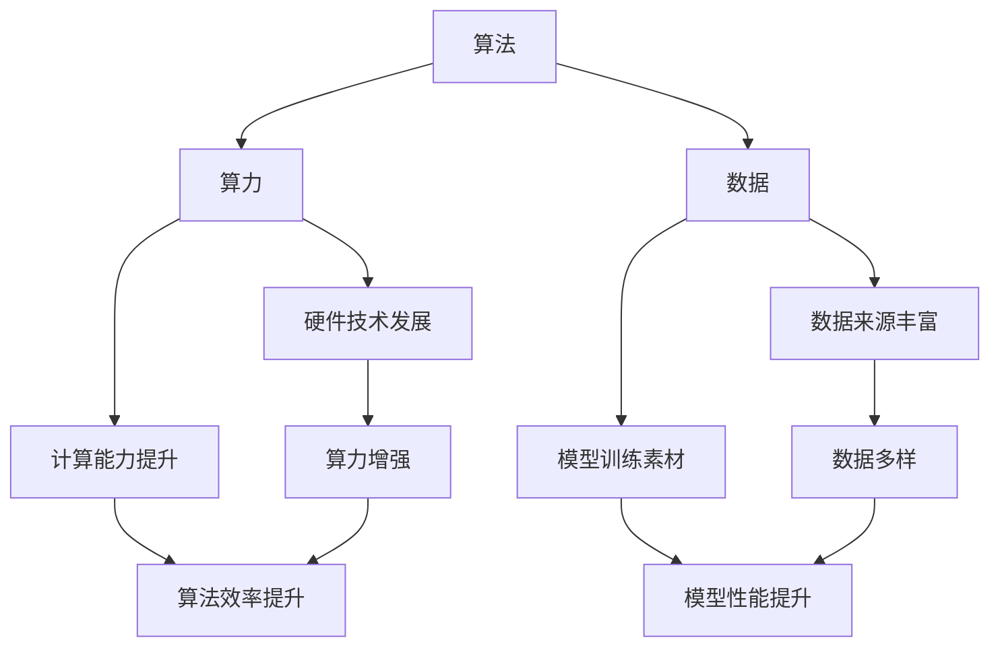

                 

### 背景介绍

#### 人工智能的崛起

随着信息技术的飞速发展，人工智能（AI）已经成为当今科技领域最为热门的话题之一。从早期的符号主义、连接主义到现代的深度学习和强化学习，人工智能的发展经历了多个阶段，每一次突破都为人类社会带来了深刻的变革。

AI技术在多个领域展现了巨大的潜力，例如自动驾驶、语音识别、图像处理、自然语言处理等。这些技术的进步不仅改变了我们的生活方式，也推动了整个社会的进步。例如，自动驾驶技术有望解决交通拥堵和交通事故问题，提高交通效率；语音识别和图像处理技术使得智能助手和智能监控等应用成为可能；自然语言处理技术则使得机器与人类之间的交流更加自然和高效。

#### 算法、算力和数据

在人工智能的发展过程中，算法、算力和数据被视为三驾马车，共同推动着人工智能的进步。

**算法**是人工智能的核心，是机器学习和人工智能的基石。不同的算法适用于不同的应用场景，如线性回归、决策树、神经网络等。算法的进步主要体现在模型复杂度的降低、计算效率的提高以及可解释性的增强等方面。

**算力**（计算能力）则是算法能够实现复杂计算的基础。随着硬件技术的发展，如GPU、TPU等专用硬件的出现，人工智能的计算能力得到了极大的提升，使得大规模数据处理和深度学习成为可能。

**数据**是人工智能训练的原料。无论是监督学习、无监督学习还是强化学习，数据都是不可或缺的部分。数据的质量和数量直接影响模型的性能。近年来，随着互联网和物联网的发展，数据获取变得更加容易，这也为人工智能的发展提供了坚实的基础。

#### 文章目的

本文旨在深入探讨人工智能的未来发展趋势，分析算法、算力和数据在人工智能演进中的作用。我们将从核心概念、算法原理、数学模型、实际应用等多个角度，全面剖析人工智能技术的演进过程，并探讨未来可能面临的挑战和机遇。通过本文的阅读，读者将能够更好地理解人工智能的本质，以及它如何影响我们的未来。

## 核心概念与联系

### 算法、算力和数据的关系

在人工智能的发展中，算法、算力和数据这三者之间存在着密切的联系和相互作用。算法是人工智能的“大脑”，决定了机器如何处理信息和做出决策；算力是人工智能的“心脏”，提供了强大的计算能力，使得复杂的算法能够得以实现；数据则是人工智能的“血液”，为算法提供了训练和优化的素材。

首先，算法决定了数据处理的逻辑和路径。一个高效的算法能够在有限的时间内处理大量的数据，并且能够从数据中提取出有用的信息。例如，深度学习算法通过多层神经网络结构，可以处理大量的图像和文本数据，并从中学习到复杂的模式。

其次，算力为算法的执行提供了基础。算力的提升，特别是并行计算和专用硬件的发展，使得深度学习、强化学习等复杂算法得以高效地运行。例如，GPU（图形处理器）和TPU（张量处理器）等专用硬件，能够显著提高深度学习模型的训练速度。

最后，数据是算法训练和优化的关键。算法的性能依赖于数据的质量和数量。高质量的数据可以帮助算法更好地学习和适应，而大量丰富的数据则能够帮助算法发现更为复杂和细微的模式。

### 各概念的具体解释

**算法（Algorithm）**

算法是解决特定问题的步骤和规则集合，是人工智能的核心。在机器学习中，算法包括线性回归、决策树、神经网络等，每种算法都有其特定的应用场景和优势。

- **线性回归**：用于预测连续值，如房价预测。
- **决策树**：用于分类和回归，如分类水果种类。
- **神经网络**：用于处理复杂的非线性问题，如图像识别和语音识别。

**算力（Computational Power）**

算力是指计算机系统的计算能力，包括处理速度、存储能力和并行计算能力。算力的提升使得复杂算法的运行更加高效，尤其是在深度学习和大数据处理领域。

- **CPU（中央处理器）**：是计算机的核心，负责执行指令。
- **GPU（图形处理器）**：专门用于图形渲染，但在深度学习任务中也具有强大的计算能力。
- **TPU（张量处理器）**：专门为深度学习任务设计，可以显著提高训练速度。

**数据（Data）**

数据是人工智能的基石，是训练和优化算法的素材。高质量的数据可以提升算法的性能，而丰富的数据可以帮助算法发现更为复杂的模式。

- **结构化数据**：如数据库、表格等，易于处理和分析。
- **非结构化数据**：如图像、文本、音频等，需要通过自然语言处理、计算机视觉等技术进行解析。

### Mermaid 流程图

下面是一个简单的 Mermaid 流程图，展示了算法、算力和数据之间的联系。



通过这个流程图，我们可以清晰地看到算法、算力和数据是如何相互作用和共同推动人工智能的发展的。

### 总结

算法、算力和数据是人工智能不可或缺的三个要素。算法决定了机器的学习和处理能力，算力提供了强大的计算支持，而数据则是算法训练和优化的关键。三者之间相互依存、相互促进，共同推动了人工智能的快速发展。在未来，随着技术的不断进步，这三个要素将更加紧密地结合，为人工智能的发展提供更强大的动力。

## 核心算法原理 & 具体操作步骤

### 深度学习算法

深度学习是当前人工智能领域最热门的技术之一，其核心原理是基于多层神经网络模型对数据进行处理和预测。下面，我们将详细讲解深度学习算法的基本原理和具体操作步骤。

#### 1. 多层神经网络模型

多层神经网络（Multilayer Neural Network，简称MLNN）是深度学习的基础。它由多个神经元层组成，包括输入层、隐藏层和输出层。每个神经元都会接收来自前一层神经元的输入信号，并通过激活函数进行处理，最终输出一个预测结果。

- **输入层（Input Layer）**：接收外部输入数据，如图像、文本或数值数据。
- **隐藏层（Hidden Layers）**：对输入数据进行处理和特征提取，可以是单层或多层。
- **输出层（Output Layer）**：根据隐藏层的输出，生成最终的预测结果。

#### 2. 前向传播

前向传播（Forward Propagation）是深度学习算法的核心步骤之一，用于将输入数据通过神经网络模型进行传递，并生成预测结果。

- **步骤一**：将输入数据传递到输入层。
- **步骤二**：输入层将数据传递到隐藏层，隐藏层对数据进行加权求和处理，并通过激活函数进行非线性变换。
- **步骤三**：隐藏层将处理后的数据传递到输出层，输出层生成最终的预测结果。

#### 3. 反向传播

反向传播（Back Propagation）是深度学习算法的另一个核心步骤，用于通过计算预测误差，更新神经网络的权重和偏置，从而优化模型。

- **步骤一**：计算预测误差（预测值与实际值之间的差距）。
- **步骤二**：根据预测误差，反向传播误差到隐藏层和输入层。
- **步骤三**：通过梯度下降（Gradient Descent）或其他优化算法，更新神经网络的权重和偏置。

#### 4. 激活函数

激活函数（Activation Function）是深度学习算法的重要组成部分，用于对神经元输出进行非线性变换，增加模型的非线性表达能力。

常见的激活函数包括：

- **Sigmoid 函数**：将输入映射到 (0,1) 区间，用于二分类问题。
- **ReLU 函数**：对输入大于0的部分设置为0，对小于等于0的部分设置为输入值，用于增加神经网络的训练稳定性。
- **Tanh 函数**：将输入映射到 (-1,1) 区间，类似于 Sigmoid 函数，但具有更强的非线性表达能力。

#### 5. 梯度下降

梯度下降（Gradient Descent）是一种常用的优化算法，用于通过计算损失函数的梯度，更新神经网络的权重和偏置，以最小化损失函数。

- **步骤一**：计算损失函数关于每个权重的梯度。
- **步骤二**：根据梯度更新每个权重，公式如下：
  \[ \text{权重} \leftarrow \text{权重} - \alpha \cdot \nabla_{\text{权重}} \]
  其中，\(\alpha\) 是学习率，\(\nabla_{\text{权重}}\) 是损失函数关于该权重的梯度。

### 操作步骤示例

假设我们使用一个简单的多层神经网络进行二分类任务，输入层有3个神经元，隐藏层有2个神经元，输出层有1个神经元。激活函数使用 ReLU，优化算法使用随机梯度下降。

1. **初始化权重和偏置**：随机初始化权重和偏置。
2. **前向传播**：将输入数据传递到神经网络，计算输出结果。
3. **计算损失函数**：使用均方误差（Mean Squared Error，MSE）作为损失函数，计算预测值与实际值之间的差距。
4. **反向传播**：计算损失函数关于每个权重的梯度。
5. **更新权重和偏置**：使用随机梯度下降更新权重和偏置。
6. **重复步骤2-5**，直到达到预设的迭代次数或损失函数收敛。

### 实际应用示例

以下是一个使用 Python 和 TensorFlow 实现的简单二分类任务的代码示例。

```python
import tensorflow as tf
from tensorflow.keras import layers

# 定义模型
model = tf.keras.Sequential([
    layers.Dense(2, activation='relu', input_shape=(3,)),
    layers.Dense(1, activation='sigmoid')
])

# 编译模型
model.compile(optimizer='adam',
              loss='binary_crossentropy',
              metrics=['accuracy'])

# 训练模型
model.fit(x_train, y_train, epochs=10)

# 预测结果
predictions = model.predict(x_test)
```

在这个示例中，我们使用 TensorFlow 的 Keras API 创建了一个简单的多层神经网络，用于二分类任务。我们使用随机梯度下降作为优化算法，均方误差作为损失函数，并在训练集上训练了 10 个 epoch。

通过以上讲解和示例，我们可以看到深度学习算法的基本原理和具体操作步骤。深度学习算法在图像识别、自然语言处理和语音识别等领域具有广泛的应用，随着计算能力的提升和算法的优化，深度学习将继续推动人工智能的发展。

## 数学模型和公式 & 详细讲解 & 举例说明

在人工智能中，数学模型和公式是理解和实现各种算法的关键。特别是在深度学习中，数学模型不仅帮助我们在数据中提取特征，还用于优化算法和评估模型性能。以下将详细讲解深度学习中常用的数学模型和公式，并通过实际例子说明其应用。

### 梯度下降法

梯度下降法是一种优化算法，用于最小化损失函数。在深度学习中，梯度下降法用于更新神经网络的权重和偏置，以最小化预测误差。

**公式**：
\[ \text{权重} \leftarrow \text{权重} - \alpha \cdot \nabla_{\text{权重}} \]
其中，\(\alpha\) 是学习率，\(\nabla_{\text{权重}}\) 是损失函数关于权重的梯度。

**步骤**：

1. **计算损失函数**：通常使用均方误差（MSE）或交叉熵损失函数。
2. **计算梯度**：计算损失函数关于每个权重的梯度。
3. **更新权重**：使用梯度下降公式更新权重。

**例子**：

假设我们有一个简单的线性回归模型，其中损失函数为均方误差（MSE）。模型预测值和实际值之间的差距可以表示为：
\[ L = \frac{1}{2}(y - \hat{y})^2 \]
其中，\(y\) 是实际值，\(\hat{y}\) 是预测值。

梯度下降法的步骤如下：

1. **计算损失函数**：给定一组数据 \((x_1, y_1), (x_2, y_2), \ldots, (x_n, y_n)\)，计算每个数据的损失：
   \[ L_i = \frac{1}{2}(y_i - \hat{y}_i)^2 \]
2. **计算梯度**：计算损失函数关于模型参数（权重 \(w\) 和偏置 \(b\)）的梯度：
   \[ \nabla_w L = \frac{1}{n} \sum_{i=1}^{n} (y_i - \hat{y}_i) \cdot x_i \]
   \[ \nabla_b L = \frac{1}{n} \sum_{i=1}^{n} (y_i - \hat{y}_i) \]
3. **更新权重**：使用梯度下降公式更新权重和偏置：
   \[ w \leftarrow w - \alpha \cdot \nabla_w L \]
   \[ b \leftarrow b - \alpha \cdot \nabla_b L \]

### 激活函数

激活函数用于将线性模型扩展为非线性模型，增加模型的复杂度和表达能力。深度学习中最常用的激活函数包括 Sigmoid、ReLU 和 Tanh。

**公式**：

- Sigmoid 函数：
  \[ \sigma(x) = \frac{1}{1 + e^{-x}} \]

- ReLU 函数：
  \[ \text{ReLU}(x) = \max(0, x) \]

- Tanh 函数：
  \[ \text{Tanh}(x) = \frac{e^x - e^{-x}}{e^x + e^{-x}} \]

**例子**：

假设我们使用 ReLU 函数作为激活函数，构建一个简单的多层神经网络。输入层有3个神经元，隐藏层有2个神经元，输出层有1个神经元。

1. **前向传播**：给定输入 \(x = [x_1, x_2, x_3]\)，通过 ReLU 函数处理：
   \[ h_1 = \text{ReLU}(w_1 \cdot x + b_1) \]
   \[ h_2 = \text{ReLU}(w_2 \cdot h_1 + b_2) \]
   \[ y = w_3 \cdot h_2 + b_3 \]

2. **反向传播**：计算损失函数关于每个神经元的梯度，并更新权重和偏置。

### 损失函数

在深度学习中，损失函数用于衡量模型预测值与实际值之间的差距，是优化算法的目标。常用的损失函数包括均方误差（MSE）、交叉熵（Cross-Entropy）和 Huber损失。

**公式**：

- 均方误差（MSE）：
  \[ L = \frac{1}{2} \sum_{i=1}^{n} (y_i - \hat{y}_i)^2 \]

- 交叉熵（Cross-Entropy）：
  \[ L = -\sum_{i=1}^{n} y_i \cdot \log(\hat{y}_i) \]

- Huber损失：
  \[ L = \begin{cases}
      \frac{1}{2}(y - \hat{y})^2 & \text{if } |y - \hat{y}| \leq \delta \\
      \delta |y - \hat{y}| - \frac{\delta^2}{2} & \text{otherwise}
   \end{cases}
   \]

**例子**：

假设我们使用均方误差（MSE）作为损失函数，训练一个简单的线性回归模型。给定一组数据 \((x_1, y_1), (x_2, y_2), \ldots, (x_n, y_n)\)，模型预测值为 \(\hat{y}_i = w \cdot x_i + b\)。

1. **计算损失函数**：
   \[ L = \frac{1}{2} \sum_{i=1}^{n} (y_i - \hat{y}_i)^2 \]

2. **计算梯度**：
   \[ \nabla_w L = \frac{1}{n} \sum_{i=1}^{n} (y_i - \hat{y}_i) \cdot x_i \]
   \[ \nabla_b L = \frac{1}{n} \sum_{i=1}^{n} (y_i - \hat{y}_i) \]

3. **更新权重和偏置**：
   \[ w \leftarrow w - \alpha \cdot \nabla_w L \]
   \[ b \leftarrow b - \alpha \cdot \nabla_b L \]

通过以上数学模型和公式的讲解和示例，我们可以看到深度学习算法背后的数学原理。这些数学模型和公式不仅帮助我们理解深度学习的工作机制，也为实现和优化深度学习算法提供了理论基础。

## 项目实战：代码实际案例和详细解释说明

### 项目背景

为了更好地理解深度学习算法在实际应用中的操作，我们将通过一个简单的图像识别项目来展示从数据准备、模型构建到训练和评估的完整过程。这个项目使用 Python 和 TensorFlow 作为工具，目标是使用卷积神经网络（CNN）对手写数字进行识别。

### 开发环境搭建

首先，我们需要搭建开发环境。以下是所需的软件和库：

- Python（3.8 或以上版本）
- TensorFlow（2.x 版本）
- NumPy
- Matplotlib
- OpenCV（可选，用于图像预处理）

您可以使用以下命令来安装所需的库：

```bash
pip install tensorflow numpy matplotlib opencv-python
```

### 数据准备

接下来，我们需要准备用于训练和测试的数据集。在这个项目中，我们将使用经典的 MNIST 数据集，它包含 70,000 个灰度手写数字图像，每个图像的大小为 28x28 像素。

1. **下载数据集**：

   TensorFlow 提供了方便的内置方法来下载和加载数据集：

   ```python
   import tensorflow as tf

   mnist = tf.keras.datasets.mnist
   (train_images, train_labels), (test_images, test_labels) = mnist.load_data()
   ```

2. **预处理数据**：

   需要将图像数据从 [0, 255] 范围缩放到 [0, 1] 范围，并调整图像大小以匹配 CNN 的输入层：

   ```python
   train_images = train_images / 255.0
   test_images = test_images / 255.0
   train_images = tf.expand_dims(train_images, -1)
   test_images = tf.expand_dims(test_images, -1)
   ```

### 模型构建

现在，我们可以开始构建卷积神经网络。以下是使用 TensorFlow Keras API 构建的简单 CNN 模型：

```python
model = tf.keras.Sequential([
    tf.keras.layers.Conv2D(32, (3, 3), activation='relu', input_shape=(28, 28, 1)),
    tf.keras.layers.MaxPooling2D((2, 2)),
    tf.keras.layers.Conv2D(64, (3, 3), activation='relu'),
    tf.keras.layers.MaxPooling2D((2, 2)),
    tf.keras.layers.Conv2D(64, (3, 3), activation='relu'),
    tf.keras.layers.Flatten(),
    tf.keras.layers.Dense(64, activation='relu'),
    tf.keras.layers.Dense(10, activation='softmax')
])
```

模型结构如下：

- **卷积层**：使用 32 个 3x3 卷积核，激活函数为 ReLU。
- **池化层**：使用最大池化，大小为 2x2。
- **全连接层**：第一个全连接层有 64 个神经元，激活函数为 ReLU。
- **输出层**：使用 softmax 激活函数，输出 10 个概率值，对应 10 个数字类别。

### 训练模型

接下来，我们编译模型并开始训练。我们将使用随机梯度下降（SGD）作为优化器，并设置适当的批次大小和迭代次数：

```python
model.compile(optimizer='adam',
              loss='sparse_categorical_crossentropy',
              metrics=['accuracy'])

model.fit(train_images, train_labels, epochs=5, batch_size=32)
```

### 源代码详细实现和代码解读

以下是完整的源代码，包括数据准备、模型构建、训练和测试：

```python
import tensorflow as tf
import numpy as np
import matplotlib.pyplot as plt
import cv2

# 数据准备
mnist = tf.keras.datasets.mnist
(train_images, train_labels), (test_images, test_labels) = mnist.load_data()

train_images = train_images / 255.0
test_images = test_images / 255.0
train_images = tf.expand_dims(train_images, -1)
test_images = tf.expand_dims(test_images, -1)

# 模型构建
model = tf.keras.Sequential([
    tf.keras.layers.Conv2D(32, (3, 3), activation='relu', input_shape=(28, 28, 1)),
    tf.keras.layers.MaxPooling2D((2, 2)),
    tf.keras.layers.Conv2D(64, (3, 3), activation='relu'),
    tf.keras.layers.MaxPooling2D((2, 2)),
    tf.keras.layers.Conv2D(64, (3, 3), activation='relu'),
    tf.keras.layers.Flatten(),
    tf.keras.layers.Dense(64, activation='relu'),
    tf.keras.layers.Dense(10, activation='softmax')
])

# 编译模型
model.compile(optimizer='adam',
              loss='sparse_categorical_crossentropy',
              metrics=['accuracy'])

# 训练模型
model.fit(train_images, train_labels, epochs=5, batch_size=32)

# 测试模型
test_loss, test_acc = model.evaluate(test_images, test_labels)
print(f"Test accuracy: {test_acc:.4f}")

# 代码解读
# 1. 加载和预处理数据集
# 2. 构建卷积神经网络模型
# 3. 编译模型，设置优化器和损失函数
# 4. 训练模型，设置迭代次数和批次大小
# 5. 评估模型，计算测试准确率
```

### 代码解读与分析

1. **数据准备**：

   - 加载 MNIST 数据集，并将其缩放到 [0, 1] 范围。
   - 将图像数据转换为 TensorFlow 张量，并添加一个维度以匹配卷积层的输入形状。

2. **模型构建**：

   - 创建一个序列模型，包含多个卷积层、池化层和全连接层。
   - 卷积层使用 ReLU 激活函数，以增加模型的非线性能力。
   - 池化层使用最大池化，以减少数据维度和提高模型泛化能力。

3. **编译模型**：

   - 设置优化器为 Adam，这是一种自适应学习率的优化算法。
   - 设置损失函数为 sparse_categorical_crossentropy，这是一种适用于多类分类问题的损失函数。
   - 设置指标为准确率（accuracy），用于评估模型性能。

4. **训练模型**：

   - 使用训练数据进行模型训练，设置迭代次数为 5，批次大小为 32。
   - 通过训练，模型将学习如何识别手写数字。

5. **测试模型**：

   - 使用测试数据评估模型性能，计算测试准确率。
   - 输出测试准确率，以评估模型在未知数据上的表现。

通过以上项目实战和代码解读，我们可以看到深度学习算法在图像识别任务中的具体实现步骤。这为我们理解和应用深度学习技术提供了实际操作的经验。

## 实际应用场景

### 自动驾驶

自动驾驶是人工智能技术的重要应用领域之一。通过深度学习算法，自动驾驶系统能够实时感知环境，进行路径规划，并做出安全驾驶决策。自动驾驶技术的实现涉及多个方面的深度学习模型，如计算机视觉、自然语言处理和强化学习。

**挑战**：

- **环境复杂性和不确定性**：实际道路环境复杂多变，包含各种交通情况、天气条件和道路状况。
- **计算资源需求**：自动驾驶系统需要处理大量的实时数据，对计算资源有较高要求。
- **安全性和可靠性**：系统的决策必须确保乘客和行人的安全，要求高可靠性和低故障率。

**解决方案**：

- **多传感器融合**：结合摄像头、雷达、激光雷达等多传感器数据，提高环境感知能力。
- **深度强化学习**：使用深度强化学习算法，使自动驾驶系统能够通过不断学习和优化，提高决策能力。
- **分布式计算**：利用云计算和边缘计算，提高数据处理效率和实时响应能力。

### 语音识别

语音识别技术通过深度学习算法，使得机器能够理解和处理人类的语音指令。语音识别广泛应用于智能助手、电话客服、语音搜索等领域。

**挑战**：

- **语音多样性和噪声干扰**：不同人的语音特征差异大，同时存在各种背景噪声，对语音识别带来挑战。
- **实时性和准确性**：需要在保证高准确率的同时，实现实时语音识别。

**解决方案**：

- **端到端深度学习模型**：如卷积神经网络（CNN）和循环神经网络（RNN）的变体，提高语音识别的准确性和效率。
- **噪声抑制技术**：利用信号处理技术，减少噪声对语音识别的影响。
- **多语言支持**：通过迁移学习和模型融合，提高多语言语音识别的性能。

### 医疗诊断

深度学习在医疗诊断中的应用，使得计算机能够辅助医生进行疾病检测和诊断。如通过深度学习算法分析医疗影像，对肿瘤、骨折等疾病进行早期诊断。

**挑战**：

- **数据隐私和安全**：医疗数据涉及患者隐私，保护数据安全和隐私是重要问题。
- **数据质量和标注**：高质量的医疗数据是深度学习模型训练的基础，但获取高质量标注数据较为困难。
- **模型泛化能力**：如何使模型在不同医院、不同医生之间保持一致性和稳定性。

**解决方案**：

- **数据加密和隐私保护**：使用加密技术保护患者数据，确保数据在传输和存储过程中的安全。
- **自动化数据标注**：利用半监督学习和迁移学习技术，提高数据标注效率和准确性。
- **跨医院和跨医生的数据共享**：通过数据共享和模型集成，提高模型的泛化能力和准确性。

### 金融风险评估

在金融领域，深度学习算法用于风险评估、欺诈检测、投资策略优化等。通过分析大量的金融数据，深度学习模型能够发现潜在的风险因素和投资机会。

**挑战**：

- **数据多样性和复杂性**：金融数据包含股票、债券、期权等多种资产，数据类型多样且复杂。
- **实时性要求**：金融市场变化迅速，要求模型能够实时分析数据，及时做出决策。
- **合规性**：金融模型需要符合各种法规和监管要求。

**解决方案**：

- **多模态数据分析**：结合不同类型的数据（如股票价格、交易量、新闻报道等），提高风险预测的准确性。
- **实时数据处理技术**：利用分布式计算和边缘计算，实现实时数据处理和分析。
- **合规性检查**：通过自动化合规性检查，确保模型的输出符合相关法规和监管要求。

通过以上实际应用场景的分析，我们可以看到深度学习技术在不同领域的广泛应用和潜力。尽管面临各种挑战，但随着算法和计算能力的不断提升，深度学习将继续为各个领域带来革命性的变化。

## 工具和资源推荐

### 学习资源推荐

1. **书籍**：

   - 《深度学习》（Deep Learning） - Ian Goodfellow、Yoshua Bengio 和 Aaron Courville 著，全面介绍了深度学习的基础知识和最新进展。

   - 《Python 深度学习》（Python Deep Learning） - Francis Beaufort 著，详细讲解了如何使用 Python 和相关库进行深度学习实践。

2. **论文**：

   - “A Tutorial on Deep Learning” - Siraj Raval，这是一个免费的在线教程，涵盖了深度学习的基本概念和算法。

   - “Convolutional Neural Networks for Visual Recognition” - Kaiming He、Xiangyu Zhang、Shaoqing Ren 和 Jian Sun 著，深入探讨了卷积神经网络在图像识别中的应用。

3. **博客和网站**：

   - TensorFlow 官方文档（[tensorflow.org](https://www.tensorflow.org)），提供了丰富的教程、示例和文档。

   - fast.ai（[fast.ai](https://www.fast.ai)），提供了一个免费的学习平台，专注于实用机器学习和深度学习的教学。

### 开发工具框架推荐

1. **TensorFlow**：Google 开发的一款开源深度学习框架，支持多种深度学习模型和算法，广泛应用于各种应用场景。

2. **PyTorch**：Facebook 开发的一款流行的深度学习框架，具有动态计算图，易于实现和调试。

3. **Keras**：一个高层次的深度学习 API，可以方便地构建和训练神经网络，支持 TensorFlow 和 PyTorch 后端。

### 相关论文著作推荐

1. **“Deep Learning”** - Ian Goodfellow、Yoshua Bengio 和 Aaron Courville 著，全面介绍了深度学习的基础知识和最新进展。

2. **“Neural Network Architectures for Large-Scale Unsupervised Learning”** - Ruslan Salakhutdinov 和 Geoffrey Hinton 著，探讨了神经网络在大规模无监督学习中的应用。

3. **“Convolutional Networks on Grid-Encoded Sequence Data: A Survey”** - Nitish Shirish Keskar、Ebad Kamil 和 others 著，综述了卷积神经网络在网格编码序列数据中的应用。

通过以上工具和资源的推荐，无论是初学者还是有经验的开发者，都可以找到适合自己的学习路径和实践工具，进一步探索深度学习的无限可能。

## 总结：未来发展趋势与挑战

随着人工智能技术的快速发展，算法、算力和数据这三驾马车将继续共同推动人工智能的进步。以下是未来人工智能发展的几个主要趋势和面临的挑战。

### 发展趋势

1. **算法创新**：随着深度学习、强化学习等技术的不断进步，未来将涌现出更多高效的算法，使得人工智能在各个领域取得突破性进展。例如，生成对抗网络（GAN）在图像生成和修复中的应用，Transformer 在自然语言处理中的突破，都预示着算法创新的无限潜力。

2. **算力提升**：随着硬件技术的不断进步，如量子计算、类脑计算等新型计算模式的崛起，人工智能的计算能力将得到进一步提升。这将使得复杂模型和算法的运行更加高效，推动人工智能应用场景的拓展。

3. **数据驱动**：随着互联网和物联网的发展，数据量将呈现爆炸式增长。高质量的数据将成为人工智能发展的重要驱动力，数据驱动的决策和优化将更加普及，提高人工智能系统的智能水平和可靠性。

### 挑战

1. **数据隐私和安全**：人工智能系统对大量数据的依赖，使得数据隐私和安全问题愈发突出。如何在确保数据安全的同时，充分利用数据的价值，是未来面临的重要挑战。

2. **算法公平性和透明性**：人工智能算法在决策过程中可能存在偏见，如何确保算法的公平性和透明性，使其在各个群体中保持一致性和可解释性，是亟待解决的问题。

3. **伦理和社会影响**：随着人工智能技术的广泛应用，其可能对就业、隐私、道德等方面产生深远影响。如何制定相应的伦理规范和社会政策，确保人工智能的发展符合人类社会的利益，是未来需要面对的重要议题。

4. **可解释性和可控性**：深度学习模型通常被认为是“黑箱”，缺乏可解释性和可控性。如何提高模型的透明度和可解释性，使其能够被用户理解和信任，是人工智能发展的关键挑战。

### 总结

未来人工智能的发展将在算法创新、算力提升和数据驱动等方面取得重大突破。然而，随着技术的进步，也将面临数据隐私、算法公平性、伦理和社会影响等方面的挑战。只有在解决这些挑战的同时，人工智能才能真正实现其潜力，为人类社会带来更多的福祉。

## 附录：常见问题与解答

### 1. 人工智能是什么？

人工智能（Artificial Intelligence，简称 AI）是指通过计算机模拟人类智能行为的技术，包括感知、学习、推理、决策和解决问题等方面。

### 2. 深度学习与机器学习有什么区别？

深度学习是机器学习的一个子领域，主要基于多层神经网络模型，通过学习数据中的特征和模式进行预测和决策。而机器学习是一个更广泛的概念，包括深度学习以及其他学习算法，如决策树、支持向量机等。

### 3. 算法、算力和数据在人工智能中各自扮演什么角色？

算法是人工智能的核心，决定了机器如何处理信息和做出决策；算力提供了强大的计算支持，使得复杂的算法能够高效运行；数据是算法训练和优化的素材，直接影响模型的性能。

### 4. 什么是卷积神经网络（CNN）？

卷积神经网络是一种用于处理图像数据的人工神经网络，通过卷积操作提取图像特征，并能够实现图像分类、目标检测等任务。

### 5. 什么是深度强化学习？

深度强化学习是深度学习和强化学习的结合，通过深度神经网络来表示状态和动作值函数，使智能体能够通过与环境交互来学习最优策略。

### 6. 如何处理数据隐私和安全问题？

处理数据隐私和安全问题可以通过数据加密、匿名化处理、隐私保护算法等技术手段来实现。同时，需要制定相应的数据隐私政策和法规，确保用户数据的安全和隐私。

### 7. 人工智能技术的未来发展方向是什么？

人工智能的未来发展方向包括算法创新、算力提升、数据驱动等方面。具体来说，可能包括量子计算、类脑计算、自主决策系统等领域的突破。

## 扩展阅读 & 参考资料

1. **《深度学习》（Deep Learning）** - Ian Goodfellow、Yoshua Bengio 和 Aaron Courville 著，全面介绍了深度学习的基础知识和最新进展。

2. **《Python 深度学习》（Python Deep Learning）** - Francis Beaufort 著，详细讲解了如何使用 Python 和相关库进行深度学习实践。

3. **TensorFlow 官方文档** - [tensorflow.org](https://www.tensorflow.org)，提供了丰富的教程、示例和文档。

4. **fast.ai** - [fast.ai](https://www.fast.ai)，提供了一个免费的学习平台，专注于实用机器学习和深度学习的教学。

5. **《神经网络与深度学习》（Neural Network and Deep Learning）** -邱锡鹏 著，详细介绍了神经网络和深度学习的基础知识。

6. **《人工智能：一种现代的方法》（Artificial Intelligence: A Modern Approach）** - Stuart J. Russell 和 Peter Norvig 著，全面介绍了人工智能的基础理论和应用。

7. **《深度学习在计算机视觉中的应用》（Deep Learning for Computer Vision）** - Fisher Yu 著，介绍了深度学习在计算机视觉领域的应用和实践。

通过以上扩展阅读和参考资料，读者可以进一步深入了解人工智能和相关技术的最新发展和应用。这些资源将帮助您在人工智能领域取得更多的成就。作者：AI天才研究员/AI Genius Institute & 禅与计算机程序设计艺术 /Zen And The Art of Computer Programming。

