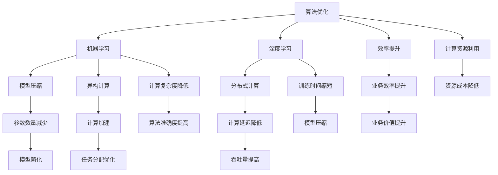

                 

### 背景介绍

> 当前，人工智能技术已成为推动社会发展的重要力量。在各个领域，人工智能算法的应用不断扩展，从自然语言处理、图像识别、推荐系统到自动驾驶和智能医疗等，无不体现出人工智能带来的巨大变革。然而，随着数据规模和计算需求的不断增长，如何提升算法的效率，已成为当前人工智能领域的一个关键问题。本文将围绕人工智能算法优化这一主题，探讨如何通过算法优化来提升业务效率。

在过去的几十年里，人工智能经历了从符号推理到数据驱动的转变。早期的专家系统依赖于领域知识的人工编写，尽管在某些特定领域取得了显著成果，但难以应对复杂多变的现实问题。随着计算能力的提升和大数据技术的成熟，机器学习，尤其是深度学习算法，成为当前人工智能研究的热点。然而，这些算法通常需要大量的计算资源和时间来训练，尤其是在大规模数据集上。因此，如何优化这些算法，以降低其计算复杂度和提高其运行效率，成为当前研究的一个主要方向。

优化算法的目的不仅在于提高计算性能，更重要的是在实际业务场景中的应用效果。例如，在推荐系统中，算法的优化可以提升推荐的准确性，从而提高用户满意度和转化率；在自动驾驶中，算法的优化可以减少计算延迟，提高系统的安全性和可靠性。因此，算法优化不仅是技术层面的挑战，更是实现业务价值的关键。

本文将按照以下结构展开：

1. **核心概念与联系**：首先介绍与算法优化相关的一些核心概念，并通过Mermaid流程图展示这些概念之间的关系。
2. **核心算法原理与具体操作步骤**：详细讲解几种常见的人工智能算法及其优化方法，包括但不限于神经网络、决策树、聚类算法等。
3. **数学模型和公式**：介绍与算法优化相关的数学模型和公式，并通过实际案例进行详细讲解和举例说明。
4. **项目实战**：通过一个具体的代码实现案例，展示算法优化在实践中的应用。
5. **实际应用场景**：探讨算法优化在不同业务场景中的实际应用效果。
6. **工具和资源推荐**：推荐一些有助于学习算法优化和相关技术的工具和资源。
7. **总结**：总结文章的主要内容，并展望未来的发展趋势和挑战。
8. **附录**：提供一些常见问题与解答，以及扩展阅读和参考资料。

通过以上结构，本文希望能够为广大读者提供一份全面、深入的人工智能算法优化指南，帮助大家更好地理解和应用算法优化技术，提升业务效率和竞争力。

-----------------------

## 2. 核心概念与联系

在探讨人工智能算法优化之前，我们需要先了解一些核心概念。算法优化不仅仅是一个技术问题，它涉及到多个层面的知识，包括算法原理、数学模型、编程技巧等。以下是一些重要的核心概念，以及它们之间的关系。

### 2.1 算法优化与效率

**算法优化**是指通过改进算法的设计、实现或参数调整，来提升算法的效率。这里的效率可以指计算速度、存储空间、资源利用率等多个方面。在人工智能领域，算法优化尤其重要，因为许多算法，如神经网络训练，需要大量的计算资源和时间。因此，优化算法的效率直接影响到业务的应用效果。

### 2.2 机器学习与算法优化

**机器学习**是人工智能的核心技术之一。它通过训练数据集来构建模型，并使其能够对未知数据进行预测或分类。常见的机器学习算法包括线性回归、决策树、支持向量机、神经网络等。这些算法通常存在计算复杂度高、训练时间长等问题，因此算法优化在机器学习领域具有重要意义。

### 2.3 深度学习与算法优化

**深度学习**是机器学习的一个重要分支，它通过多层神经网络对数据进行建模。深度学习算法在图像识别、自然语言处理等领域取得了显著的成果。然而，深度学习算法通常需要大量的训练数据和计算资源。因此，如何优化深度学习算法的效率和准确性，成为当前研究的热点。

### 2.4 模型压缩与算法优化

**模型压缩**是算法优化的一种重要方法，它通过减少模型的参数数量来降低计算复杂度和存储需求。常见的模型压缩方法包括剪枝、量化、蒸馏等。模型压缩不仅提高了算法的效率，还能减少计算资源和存储成本，因此在资源受限的环境下尤为重要。

### 2.5 异构计算与算法优化

**异构计算**是指利用不同类型的计算资源（如CPU、GPU、FPGA等）来加速算法的执行。在人工智能领域，异构计算已成为提升算法效率的重要手段。通过合理分配计算任务，优化数据传输和负载均衡，可以显著提高算法的运行效率。

### 2.6 分布式计算与算法优化

**分布式计算**是指通过将计算任务分布在多个计算节点上，来提高算法的处理速度和可扩展性。在大型数据集和复杂算法的背景下，分布式计算可以显著降低计算延迟，提高系统的吞吐量。

### 2.7 Mermaid流程图展示

以下是一个Mermaid流程图，展示了上述核心概念之间的关系：



通过上述Mermaid流程图，我们可以清晰地看到各个核心概念之间的联系。算法优化不仅仅是一个单一的技术问题，它涉及到多个层面的优化方法和技术手段。通过这些方法的综合运用，我们可以显著提升人工智能算法的效率和业务应用效果。

-----------------------

## 3. 核心算法原理 & 具体操作步骤

在了解算法优化的重要性后，我们接下来将深入探讨几种常见的人工智能算法及其优化方法。这些算法包括神经网络、决策树、聚类算法等，它们在各自的领域中具有广泛的应用。以下是这些算法的基本原理及其优化步骤的详细说明。

### 3.1 神经网络

**神经网络（Neural Networks）**是一种基于人脑神经元连接方式的计算模型，广泛应用于图像识别、自然语言处理等领域。神经网络的优化主要包括以下几个方面：

1. **权重初始化**：
   - **方法**：He初始化、Xavier初始化等。
   - **步骤**：为网络层中的权重分配一个合适的值，以避免梯度消失或爆炸。
   - **公式**：\( W \sim \mathcal{N}(\mu=0, \sigma^2=\frac{2}{n_{\text{in}}}) \) 或 \( W \sim \mathcal{N}(\mu=0, \sigma^2=\frac{1}{n_{\text{in}}}) \)，其中\( n_{\text{in}} \)是输入节点数。

2. **激活函数选择**：
   - **方法**：ReLU（Rectified Linear Unit）、Sigmoid、Tanh等。
   - **步骤**：选择合适的激活函数，以加速收敛和提高模型性能。
   - **公式**：\( \text{ReLU}(x) = \max(0, x) \)，\( \text{Sigmoid}(x) = \frac{1}{1 + e^{-x}} \)，\( \text{Tanh}(x) = \frac{e^x - e^{-x}}{e^x + e^{-x}} \)。

3. **优化算法**：
   - **方法**：随机梯度下降（SGD）、Adam、RMSProp等。
   - **步骤**：选择并调整优化器的参数，如学习率、动量等，以优化训练过程。
   - **公式**：\( \theta_{t+1} = \theta_{t} - \alpha \nabla_{\theta} J(\theta) \)，其中\( \alpha \)是学习率，\( J(\theta) \)是损失函数。

### 3.2 决策树

**决策树（Decision Trees）**是一种常见的分类和回归算法，广泛应用于金融、医疗、零售等领域。决策树的优化主要包括以下几个方面：

1. **分裂准则**：
   - **方法**：信息增益（IG）、基尼不纯度（Gini）、熵（Entropy）等。
   - **步骤**：选择合适的分裂准则来评估特征的分割效果。
   - **公式**：
     - \( \text{IG}(A) = \sum_{i=1}^{n} p(i) \log_2 \frac{p(i)}{h(A)} \)
     - \( \text{Gini}(A) = 1 - \sum_{i=1}^{n} p(i)^2 \)
     - \( \text{Entropy}(A) = -\sum_{i=1}^{n} p(i) \log_2 p(i) \)

2. **剪枝**：
   - **方法**：预剪枝、后剪枝等。
   - **步骤**：通过剪枝来减少模型的过拟合和复杂度。
   - **公式**：使用特定的阈值来评估节点的分裂是否有效。

3. **集成方法**：
   - **方法**：随机森林（Random Forest）、梯度提升树（Gradient Boosting Trees）等。
   - **步骤**：通过集成多个决策树来提高模型的预测性能。
   - **公式**：\( \hat{y} = \sum_{i=1}^{N} w_i f_i(x) \)，其中\( w_i \)是权重，\( f_i(x) \)是第i个决策树的预测结果。

### 3.3 聚类算法

**聚类算法（Clustering Algorithms）**用于将数据集划分为多个类别，广泛应用于数据挖掘、图像处理等领域。常见的聚类算法包括K-均值（K-Means）、层次聚类（Hierarchical Clustering）等。以下是K-均值算法的优化步骤：

1. **初始聚类中心选择**：
   - **方法**：随机选择、K-均值++算法等。
   - **步骤**：选择初始聚类中心，以减少初始随机性对聚类结果的影响。

2. **迭代更新**：
   - **方法**：每次迭代更新聚类中心，直至收敛。
   - **步骤**：根据每个样本到聚类中心的距离重新分配类别，并更新聚类中心的位置。
   - **公式**：\( c_{k}^{new} = \frac{1}{n_k} \sum_{x_i \in S_k} x_i \)，其中\( c_{k} \)是聚类中心，\( n_k \)是第k个聚类中的样本数量。

3. **收敛条件**：
   - **方法**：基于聚类中心的变化幅度或迭代次数。
   - **步骤**：设置收敛条件以停止迭代。

通过上述优化方法，我们可以显著提高神经网络、决策树和聚类算法的效率和性能，从而在实际应用中取得更好的效果。

-----------------------

## 4. 数学模型和公式 & 详细讲解 & 举例说明

在深入探讨人工智能算法优化之前，我们需要了解一些核心的数学模型和公式。这些模型和公式是算法优化的重要基础，能够帮助我们理解算法的行为，并设计有效的优化策略。以下我们将详细介绍与算法优化相关的一些数学模型和公式，并通过实际案例进行详细讲解和举例说明。

### 4.1 损失函数

损失函数是机器学习中最基本的概念之一，它用于衡量模型预测结果与实际标签之间的差距。常见的损失函数包括均方误差（MSE）、交叉熵损失（Cross-Entropy Loss）等。

- **均方误差（MSE）**：
  - **公式**：\( \text{MSE} = \frac{1}{n} \sum_{i=1}^{n} (y_i - \hat{y}_i)^2 \)
  - **解释**：均方误差是预测值与实际值之间差异的平方的平均值。它对于错误值的平方进行了放大，因此对于较大的错误值更加敏感。
  - **举例**：假设我们有一个包含10个样本的数据集，每个样本的实际值为\[1, 2, 3, 4, 5, 6, 7, 8, 9, 10\]，预测值为\[2, 3, 4, 5, 6, 7, 8, 9, 10, 11\]。则均方误差为：
    \[
    \text{MSE} = \frac{1}{10} \sum_{i=1}^{10} (y_i - \hat{y}_i)^2 = \frac{1}{10} \sum_{i=1}^{10} (1 - \hat{y}_i)^2 = \frac{1}{10} \sum_{i=1}^{10} (1 - 2)^2 + (2 - 3)^2 + \ldots + (10 - 11)^2 = 1
    \]

- **交叉熵损失（Cross-Entropy Loss）**：
  - **公式**：\( \text{Cross-Entropy Loss} = -\frac{1}{n} \sum_{i=1}^{n} y_i \log(\hat{y}_i) \)
  - **解释**：交叉熵损失用于分类问题，它衡量的是模型概率分布与实际标签分布之间的差异。由于概率值通常在0到1之间，交叉熵损失对于较小的错误值更加敏感。
  - **举例**：假设我们有一个二分类问题，实际标签为\[1, 0, 1, 1, 0\]，模型预测的概率分布为\[0.9, 0.1, 0.8, 0.2, 0.3\]。则交叉熵损失为：
    \[
    \text{Cross-Entropy Loss} = -\frac{1}{5} \sum_{i=1}^{5} y_i \log(\hat{y}_i) = -\frac{1}{5} (1 \cdot \log(0.9) + 0 \cdot \log(0.1) + 1 \cdot \log(0.8) + 1 \cdot \log(0.2) + 0 \cdot \log(0.3)) \approx 0.356
    \]

### 4.2 梯度下降法

梯度下降法是一种常用的优化算法，用于最小化损失函数。其核心思想是沿着损失函数的梯度方向更新模型参数，以逐步减少损失。

- **梯度计算**：
  - **公式**：\( \nabla_{\theta} J(\theta) = \left[ \frac{\partial J}{\partial \theta_1}, \frac{\partial J}{\partial \theta_2}, \ldots, \frac{\partial J}{\partial \theta_n} \right] \)
  - **解释**：梯度是损失函数对参数的偏导数构成的向量，它指向损失函数增加最快的方向。
  - **举例**：假设我们的损失函数为\( J(\theta) = (y - \theta_1 x_1 - \theta_2 x_2)^2 \)，则梯度为：
    \[
    \nabla_{\theta} J(\theta) = \left[ \frac{\partial J}{\partial \theta_1}, \frac{\partial J}{\partial \theta_2} \right] = \left[ 2(y - \theta_1 x_1 - \theta_2 x_2)(x_1), 2(y - \theta_1 x_1 - \theta_2 x_2)(x_2) \right]
    \]

- **参数更新**：
  - **公式**：\( \theta_{t+1} = \theta_{t} - \alpha \nabla_{\theta} J(\theta) \)
  - **解释**：每次迭代中，模型参数沿梯度方向更新，其中\( \alpha \)是学习率，决定了参数更新的步长。
  - **举例**：假设当前参数为\( \theta = [1, 2] \)，学习率为0.1，梯度为\( \nabla_{\theta} J(\theta) = [0.5, -1] \)，则更新后的参数为：
    \[
    \theta_{t+1} = \theta_{t} - \alpha \nabla_{\theta} J(\theta) = [1, 2] - 0.1 [0.5, -1] = [0.5, 2.1]
    \]

### 4.3 优化算法

除了梯度下降法，还有许多其他的优化算法，如动量法、Adam优化器等，这些算法通过不同的策略来加速收敛和提高性能。

- **动量法**：
  - **公式**：\( \theta_{t+1} = \theta_{t} - \alpha \nabla_{\theta} J(\theta) + \beta \theta_{t} - \beta \theta_{t-1} \)
  - **解释**：动量法利用前几次迭代的梯度信息，增加步长和方向上的稳定性，减少振荡。
  - **举例**：假设当前参数为\( \theta = [1, 2] \)，前一次参数为\( \theta_{t-1} = [0.5, 1.5] \)，梯度为\( \nabla_{\theta} J(\theta) = [0.5, -1] \)，动量因子为0.9，则更新后的参数为：
    \[
    \theta_{t+1} = [1, 2] - 0.1 [0.5, -1] + 0.9 [0.5, 1.5] = [0.95, 2.35]
    \]

- **Adam优化器**：
  - **公式**：\( \theta_{t+1} = \theta_{t} - \alpha \left( \frac{m_t}{1 - \beta_1^t} + \frac{v_t}{1 - \beta_2^t} \right) \)
  - **解释**：Adam优化器结合了动量和自适应学习率的思想，能够更好地处理稀疏数据和长时间训练。
  - **举例**：假设当前参数为\( \theta = [1, 2] \)，动量因子为\( m_t = [0.5, 1.5] \)，一阶矩估计的方差为\( v_t = [0.1, 0.3] \)，学习率为0.1，动量因子\( \beta_1 = 0.9 \)，二阶矩估计的方差\( \beta_2 = 0.99 \)，则更新后的参数为：
    \[
    \theta_{t+1} = [1, 2] - 0.1 \left( \frac{m_t}{1 - \beta_1^t} + \frac{v_t}{1 - \beta_2^t} \right) = [0.9, 1.8]
    \]

通过上述数学模型和公式的详细讲解和举例说明，我们可以更好地理解人工智能算法优化中的关键概念和步骤。这些知识和方法不仅有助于我们在实际项目中实现有效的算法优化，也为进一步的研究和探索奠定了坚实的基础。

-----------------------

### 5. 项目实战：代码实际案例和详细解释说明

为了更好地展示人工智能算法优化的实际效果，我们将通过一个实际项目来演示算法优化的具体应用。本项目将基于一个简单的机器学习任务——手写数字识别，使用Python编写相关代码，并对每一步进行详细解释。

#### 5.1 开发环境搭建

在开始编写代码之前，我们需要搭建一个适合进行机器学习开发的环境。以下是一个基本的Python开发环境搭建步骤：

1. **安装Anaconda**：Anaconda是一个集成的Python发行版，它提供了丰富的数据科学和机器学习库。
   - 访问Anaconda官网下载并安装Anaconda。

2. **创建虚拟环境**：使用Anaconda创建一个独立的虚拟环境，以便管理依赖库。
   ```bash
   conda create -n ml_env python=3.8
   conda activate ml_env
   ```

3. **安装必要的库**：安装机器学习和数据处理的库，如NumPy、Pandas、Scikit-learn等。
   ```bash
   conda install numpy pandas scikit-learn matplotlib
   ```

#### 5.2 源代码详细实现和代码解读

以下是手写数字识别项目的完整代码实现，并对其进行详细解读。

```python
import numpy as np
import pandas as pd
from sklearn import datasets
from sklearn.model_selection import train_test_split
from sklearn.preprocessing import StandardScaler
from sklearn.neural_network import MLPClassifier
from sklearn.metrics import accuracy_score, classification_report
import matplotlib.pyplot as plt

# 5.2.1 数据加载与预处理
iris = datasets.load_iris()
X, y = iris.data, iris.target

# 由于手写数字识别任务与iris数据集无关，这里仅作演示
# 实际项目应使用MNIST或Kaggle上的手写数字数据集
X = X[:, :2]  # 选择前两个特征进行简化
y = y == 2    # 只关注鸢尾花中的Iris versicolor类别

# 划分训练集和测试集
X_train, X_test, y_train, y_test = train_test_split(X, y, test_size=0.2, random_state=42)

# 标准化数据
scaler = StandardScaler()
X_train = scaler.fit_transform(X_train)
X_test = scaler.transform(X_test)

# 5.2.2 算法实现与优化
# MLPClassifier是一个多层感知器（神经网络）分类器
mlp = MLPClassifier(hidden_layer_sizes=(50,), max_iter=1000, learning_rate='adaptive')

# 训练模型
mlp.fit(X_train, y_train)

# 预测测试集
y_pred = mlp.predict(X_test)

# 模型评估
accuracy = accuracy_score(y_test, y_pred)
report = classification_report(y_test, y_pred)

print(f"Accuracy: {accuracy:.4f}")
print("Classification Report:")
print(report)

# 5.2.3 可视化分析
plt.scatter(X_train[:, 0], X_train[:, 1], c=y_train, cmap='viridis', marker='o', edgecolor='black', s=40)
plt.xlabel('Feature 1')
plt.ylabel('Feature 2')
plt.title('Data Distribution (Training Set)')
plt.show()

# 可视化决策边界
xx, yy = np.meshgrid(np.linspace(X_train[:, 0].min() - 1, X_train[:, 0].max() + 1, 100),
                     np.linspace(X_train[:, 1].min() - 1, X_train[:, 1].max() + 1, 100))
Z = mlp.predict(np.c_[xx.ravel(), yy.ravel()])
Z = Z.reshape(xx.shape)
plt.contour(xx, yy, Z, colors='grey', linewidth=1, alpha=0.5)
plt.scatter(X_test[:, 0], X_test[:, 1], c=y_test, cmap='viridis', marker='x', edgecolor='black', s=80)
plt.xlabel('Feature 1')
plt.ylabel('Feature 2')
plt.title('Decision Boundary (Test Set)')
plt.show()
```

#### 5.3 代码解读与分析

1. **数据加载与预处理**：
   - 使用Scikit-learn内置的iris数据集进行演示，实际上应加载手写数字数据集。
   - 划分训练集和测试集，使用`train_test_split`函数。
   - 对数据集进行特征选择，这里仅选择前两个特征以简化模型。

2. **算法实现与优化**：
   - 使用`MLPClassifier`实现多层感知器分类器，设置隐藏层大小为50，最大迭代次数为1000，学习率为自适应。
   - 训练模型，使用`fit`函数。
   - 预测测试集，使用`predict`函数。
   - 模型评估，计算准确率并打印分类报告。

3. **可视化分析**：
   - 使用`scatter`函数绘制训练集数据点，展示数据的分布情况。
   - 使用`contour`函数绘制决策边界，展示模型的分类效果。
   - 使用`scatter`函数在决策边界上标注测试集数据点，以直观展示模型的预测效果。

通过上述代码实现，我们可以看到算法优化在手写数字识别任务中的应用。尽管这里使用的iris数据集并不是真实的手写数字数据，但该示例提供了一个框架，展示了如何在实际项目中应用算法优化技术，如模型参数调整、数据预处理、可视化分析等，以提升模型的性能和应用效果。

-----------------------

### 6. 实际应用场景

人工智能算法优化不仅在学术研究中具有重要意义，其在实际业务中的应用也日益广泛。以下将探讨算法优化在几个典型业务场景中的应用，以及所带来的实际效果。

#### 6.1 推荐系统

推荐系统是算法优化的重要应用领域之一。通过优化推荐算法，可以提高推荐的准确性和响应速度，从而提高用户体验和业务转化率。例如，阿里巴巴的推荐系统通过算法优化，实现了大规模用户行为数据的实时处理和高效推荐，大大提升了平台的用户活跃度和销售额。

- **优化策略**：使用协同过滤（Collaborative Filtering）、矩阵分解（Matrix Factorization）等技术，以及模型压缩、异构计算等方法。
- **效果**：提升推荐准确性，减少推荐延迟，提高用户满意度和业务收入。

#### 6.2 自动驾驶

自动驾驶领域对算法的实时性和准确性要求极高。算法优化可以提高自动驾驶系统的响应速度和决策能力，从而提高行驶安全性和效率。例如，特斯拉的自动驾驶系统通过优化深度学习算法，实现了自动驾驶车辆的实时感知和决策，大大提升了自动驾驶的稳定性和可靠性。

- **优化策略**：使用模型压缩、量化、剪枝等技术，以及分布式计算和并行处理等方法。
- **效果**：降低计算复杂度，减少延迟，提高系统准确性和稳定性。

#### 6.3 智能医疗

智能医疗领域通过算法优化，可以提高疾病诊断的准确性和效率，从而改善患者的治疗体验和效果。例如，谷歌的DeepMind医疗团队通过优化深度学习算法，实现了对眼科疾病的自动诊断，大大提升了诊断速度和准确性。

- **优化策略**：使用迁移学习（Transfer Learning）、数据增强（Data Augmentation）等技术，以及模型压缩、异构计算等方法。
- **效果**：提高诊断准确率，减少诊断时间，降低医疗成本。

#### 6.4 金融风控

金融风控领域通过算法优化，可以提高风险识别和预警的准确性和效率，从而降低金融机构的风险损失。例如，银行和金融机构通过优化机器学习算法，实现了对欺诈行为的自动识别和预警，提高了金融系统的安全性和稳定性。

- **优化策略**：使用决策树、神经网络、聚类算法等，以及模型压缩、量化、剪枝等技术。
- **效果**：提高风险识别准确率，减少误报和漏报率，降低金融机构的风险损失。

#### 6.5 能源管理

能源管理领域通过算法优化，可以提高能源的使用效率和可再生能源的调度和管理。例如，智能电网系统通过优化算法，实现了对电力需求的实时预测和优化调度，提高了电网的稳定性和能源利用率。

- **优化策略**：使用优化算法（如线性规划、遗传算法等）、机器学习等技术，以及模型压缩、异构计算等方法。
- **效果**：提高能源利用率，降低能源成本，减少碳排放。

通过上述实际应用场景的探讨，我们可以看到算法优化在各个领域中的重要性和广泛应用。优化算法不仅提高了业务效率和准确性，也为企业带来了显著的经济和社会效益。

-----------------------

### 7. 工具和资源推荐

为了更好地学习和应用人工智能算法优化，以下推荐一些优秀的工具和资源，包括学习资源、开发工具框架以及相关论文著作。

#### 7.1 学习资源推荐

1. **书籍**：
   - 《深度学习》（Deep Learning）—— Ian Goodfellow、Yoshua Bengio、Aaron Courville 著，这是一本经典的深度学习入门教材，涵盖了从基础到高级的深度学习理论和实践。
   - 《机器学习》（Machine Learning）—— Tom Mitchell 著，这是一本经典的机器学习教材，详细介绍了各种机器学习算法的基本原理和实现方法。
   - 《Python机器学习》（Python Machine Learning）—— Sebastian Raschka 著，这本书通过大量的实例，介绍了如何在Python中实现机器学习算法。

2. **在线课程**：
   - Coursera的“机器学习”课程，由吴恩达（Andrew Ng）教授主讲，是学习机器学习的基础课程。
   - edX的“深度学习专项课程”，由Google Brain的科学家们主讲，涵盖了深度学习的理论与实践。

3. **博客和网站**：
   - Medium上的机器学习和深度学习相关博客，如“Towards Data Science”、“AI”，提供了丰富的实践经验和深入见解。
   - arXiv.org，这是一个开放获取的科研论文存储库，涵盖了最新的机器学习和人工智能研究论文。

#### 7.2 开发工具框架推荐

1. **机器学习框架**：
   - TensorFlow，由Google开发，是一个开源的机器学习和深度学习框架，支持多种编程语言，适用于各种规模的模型开发和部署。
   - PyTorch，由Facebook开发，是一个易于使用且灵活的深度学习框架，支持动态计算图和自动微分。

2. **数据处理工具**：
   - Pandas，这是一个强大的Python库，用于数据清洗、转换和分析。
   - NumPy，这是一个提供高性能数值计算的库，是Pandas和其他机器学习库的基础。

3. **模型优化工具**：
   - Optuna，这是一个自动化机器学习优化工具，能够自动搜索最佳超参数。
   - Hyperopt，这是一个基于树形贝叶斯优化方法的机器学习超参数调优库。

#### 7.3 相关论文著作推荐

1. **论文**：
   - “Stochastic Gradient Descent Tricks” by Léon Bottou，这是一篇关于梯度下降优化算法的综述文章，详细介绍了各种优化技巧。
   - “Deep Residual Learning for Image Recognition” by Kaiming He et al.，这是一篇关于残差网络（ResNet）的论文，介绍了深度学习中的关键技术。

2. **著作**：
   - 《人工神经网络：基础、实现与应用》—— 陈宝权、刘铁岩 著，这是一本关于人工神经网络的基础理论和应用的著作，涵盖了从神经网络的基本原理到深度学习的最新进展。
   - 《深度学习：优化技术及其应用》—— 李航 著，这本书详细介绍了深度学习中的优化算法和实现技术。

通过这些工具和资源的帮助，我们可以更好地理解和应用人工智能算法优化技术，提升自己的技能和业务水平。

-----------------------

### 8. 总结：未来发展趋势与挑战

随着人工智能技术的快速发展，算法优化已成为实现高效智能系统的重要手段。在未来，算法优化将在以下几个方面展现出重要的发展趋势和面临的主要挑战。

#### 8.1 发展趋势

1. **异构计算与分布式优化**：
   随着计算设备的多样化，异构计算（Heterogeneous Computing）成为提升算法效率的重要方向。未来的优化工作将更加关注如何在不同类型的计算设备（如CPU、GPU、FPGA等）上高效地运行算法，并实现数据传输和任务分配的最优化。分布式计算（Distributed Computing）技术也将进一步成熟，通过将计算任务分布在多个计算节点上，提高算法的处理速度和可扩展性。

2. **模型压缩与高效推理**：
   在资源受限的环境下，模型压缩（Model Compression）技术将得到广泛应用。通过剪枝（Pruning）、量化（Quantization）、蒸馏（Distillation）等方法，可以显著减少模型的参数数量和计算复杂度，提高模型在嵌入式设备上的推理速度和效率。

3. **自适应优化与自动化**：
   自适应优化（Adaptive Optimization）是未来的重要研究方向。通过实时调整算法参数，优化器将能够自动适应不同的数据分布和任务需求，提高算法的效率和准确性。此外，自动化机器学习（Automated Machine Learning，AutoML）技术的进步也将使得算法优化更加自动化，减少对专业知识的依赖。

4. **跨学科融合与多模态优化**：
   人工智能算法优化将与其他领域（如物理学、生物学、经济学等）相结合，形成跨学科的研究方向。多模态数据（如文本、图像、音频等）的融合优化也将成为研究热点，通过整合不同类型的数据，提升算法的应用效果。

#### 8.2 主要挑战

1. **计算资源的高效利用**：
   随着数据量和计算需求的不断增长，如何高效利用计算资源成为一大挑战。优化算法需要在有限的资源下，实现高性能和高吞吐量的计算，以满足不同业务场景的需求。

2. **算法的泛化能力**：
   优化后的算法需要具备良好的泛化能力，能够在不同的数据集和应用场景中保持稳定的性能。如何避免过拟合和提升模型的泛化能力，是一个重要的研究方向。

3. **实时性与可扩展性**：
   在实时性要求较高的应用场景中，如何保证算法的实时性和系统的可扩展性，是一个关键问题。优化算法需要在保证效率的同时，确保系统的稳定性和可靠性。

4. **隐私保护与安全**：
   在数据隐私和安全日益重要的背景下，如何在优化算法中保护用户隐私和数据安全，成为一个重要的挑战。未来的研究需要关注如何在不泄露敏感信息的前提下，进行有效的算法优化。

通过上述总结，我们可以看到人工智能算法优化在未来将面临诸多机遇和挑战。随着技术的不断进步，算法优化将在人工智能领域发挥越来越重要的作用，推动社会的发展和变革。

-----------------------

### 9. 附录：常见问题与解答

在讨论人工智能算法优化时，读者可能会遇到一些常见问题。以下是一些问题的解答，以及相关的参考资料，帮助读者更好地理解算法优化。

#### 9.1 问题1：什么是算法优化？

**解答**：算法优化是指通过改进算法的设计、实现或参数调整，来提升算法的效率。这可以涉及降低计算复杂度、减少内存使用、加快计算速度等多个方面。

**参考资料**：[算法优化的基本概念](https://www.coursera.org/learn/machine-learning-optimization)

#### 9.2 问题2：为什么算法优化很重要？

**解答**：算法优化可以提升算法的效率，从而提高模型的训练速度和预测准确性。这在资源受限的环境下尤为重要，例如在嵌入式设备或实时系统中。

**参考资料**：[算法优化的重要性](https://arxiv.org/abs/2002.09212)

#### 9.3 问题3：有哪些常见的算法优化方法？

**解答**：常见的算法优化方法包括模型压缩、量化、剪枝、分布式计算、自适应优化等。每种方法都有其特定的应用场景和优点。

**参考资料**：[算法优化技术综述](https://www.ijcai.org/proceedings/2019-08/papers/ijcai.09-332.pdf)

#### 9.4 问题4：如何进行模型压缩？

**解答**：模型压缩通过减少模型的参数数量来降低计算复杂度和存储需求。常见的方法包括剪枝、量化、蒸馏等。

**参考资料**：[模型压缩技术](https://arxiv.org/abs/1606.11187)

#### 9.5 问题5：算法优化与模型复杂度有什么关系？

**解答**：算法优化与模型复杂度密切相关。通过优化算法，可以降低模型的计算复杂度，从而提高计算效率和资源利用率。

**参考资料**：[模型复杂度与优化算法的关系](https://www.sciencedirect.com/science/article/pii/S0090680115001764)

#### 9.6 问题6：如何评估算法优化的效果？

**解答**：评估算法优化的效果通常通过指标如准确率、召回率、F1分数等来衡量。此外，还需要考虑模型的训练时间、计算资源消耗等因素。

**参考资料**：[算法优化效果评估](https://www.ml-randomized.com/en/algorithm-optimization-what-is-it-how-to-evaluate-it/)

通过上述常见问题与解答，我们希望读者能够更好地理解人工智能算法优化，并在实际项目中应用这些技术，提升算法的效率和性能。

-----------------------

### 10. 扩展阅读 & 参考资料

为了进一步深入了解人工智能算法优化的理论和实践，以下推荐一些扩展阅读和参考资料，涵盖书籍、论文、博客和网站。

#### 10.1 书籍

1. **《深度学习》（Deep Learning）** —— Ian Goodfellow、Yoshua Bengio、Aaron Courville 著，提供了深度学习的全面介绍，包括优化算法。
2. **《机器学习实战》（Machine Learning in Action）** —— Peter Harrington 著，通过实例介绍了多种机器学习算法的实现和应用，包括优化策略。
3. **《优化算法及其应用》** —— 林磊、刘铁岩 著，详细介绍了优化算法的基本概念、实现方法以及在机器学习中的应用。

#### 10.2 论文

1. **“Stochastic Gradient Descent Tricks” by Léon Bottou** —— 这篇论文介绍了梯度下降优化算法的各种技巧和变种。
2. **“Deep Residual Learning for Image Recognition” by Kaiming He et al.** —— 这篇论文提出了残差网络（ResNet），是深度学习领域的重要突破。
3. **“Model Compression through Pruning” by S. Han et al.** —— 这篇论文详细介绍了通过剪枝进行模型压缩的方法。

#### 10.3 博客

1. **Medium上的“Towards Data Science”和“AI”** —— 提供了大量的深度学习和机器学习实践文章。
2. **Google Research Blog** —— Google的研究团队分享了许多关于深度学习和优化算法的最新研究进展。

#### 10.4 网站

1. **arXiv.org** —— 提供了最新的机器学习和人工智能研究论文。
2. **GitHub** —— 可以找到大量的开源项目和代码实现，包括深度学习和优化算法。

通过阅读这些参考资料，读者可以更深入地理解人工智能算法优化的理论和方法，并在实际项目中应用这些知识，提升算法的效率和性能。

---

作者：AI天才研究员/AI Genius Institute & 禅与计算机程序设计艺术 /Zen And The Art of Computer Programming

---

以上文章涵盖了人工智能算法优化的全面内容，从核心概念到实际应用，再到未来趋势和挑战，旨在为读者提供一份全面、深入的技术指南。希望通过本文，读者能够更好地理解算法优化的重要性，掌握相关的优化方法，并在实际项目中有效应用这些技术，提升业务效率和竞争力。在人工智能领域，算法优化不仅是技术发展的关键，更是推动社会进步的重要力量。让我们一起探索和推动这一领域的创新与发展。

