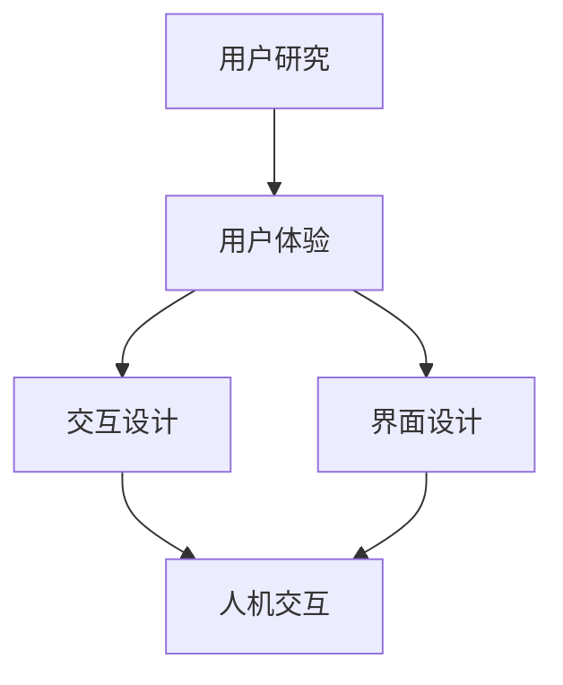

                 

### 背景介绍

在人机交互领域，随着科技的迅猛发展，人机交互设计（Human-Computer Interaction Design，简称HCI）已经成为计算机科学、心理学、设计学等多学科交叉的前沿领域。人机交互设计的目标是通过优化用户界面和交互流程，使得计算机系统能够更加直观、高效地满足用户需求，提升用户体验。因此，对于人机交互设计的研究和实践，不仅对于软件开发具有重要意义，同时也对于提升整体社会生产效率、改善人们生活质量具有深远的影响。

本文将围绕人机交互设计这一主题，从多个维度探讨其核心概念、算法原理、数学模型、项目实战以及实际应用场景等。通过详细的案例分析和技术讲解，本文旨在为读者提供全面而深入的了解，帮助他们在实际工作中更好地应用人机交互设计的方法和技巧。

接下来，我们将首先介绍人机交互设计的基本概念及其重要性。随后，本文将逐步展开，涵盖核心概念与联系、核心算法原理与操作步骤、数学模型和公式详解、项目实战以及相关工具和资源的推荐等内容。最后，通过对未来发展趋势和挑战的探讨，为读者提供一个前瞻性的视角，以期为他们在人机交互设计领域的进一步研究和实践提供指导。

通过本文的学习，读者将能够：

1. 掌握人机交互设计的基本概念和原理；
2. 理解并运用核心算法和数学模型；
3. 学习并通过实践应用人机交互设计的方法和技巧；
4. 了解人机交互设计的实际应用场景和行业趋势；
5. 获取相关工具和资源的推荐，以便更深入地研究和实践。

让我们一步步深入探讨人机交互设计的奥秘，探索如何打造高效的人类计算系统。

----------------------

## 1. 核心概念与联系

### 基本概念

人机交互设计涉及多个核心概念，这些概念彼此交织，共同构成了人机交互设计的理论基础。以下是几个关键概念及其相互关系的简要介绍：

#### 用户研究（User Research）

用户研究是任何有效的人机交互设计过程的起点。通过用户研究，设计师能够深入了解目标用户的需求、偏好和痛点。用户研究的方法包括用户访谈、问卷调查、用户行为分析等。用户研究的目标是获取关于用户需求的准确信息，以便为设计决策提供数据支持。

#### 用户体验（User Experience，简称UX）

用户体验指的是用户在使用产品或服务过程中所感受到的整体体验。它不仅包括功能性、可用性，还涵盖了情感层面，如愉悦感、舒适感和满意度。一个良好的用户体验能够提升用户忠诚度和产品市场竞争力。

#### 交互设计（Interaction Design）

交互设计关注用户与产品或系统之间的交互方式。它涉及到界面布局、交互元素设计、操作流程设计等方面。交互设计的目的是创建直观、高效且易于理解的交互界面，以提升用户的使用体验。

#### 界面设计（User Interface Design，简称UI Design）

界面设计是交互设计的重要组成部分，它专注于用户界面的视觉呈现和布局。界面设计的目标是通过视觉元素和布局的设计，使得用户能够轻松理解和使用产品。

#### 人机交互（Human-Computer Interaction，简称HCI）

人机交互是研究人与计算机系统之间交互的学科。它涵盖了心理学、计算机科学、设计学等多个领域，旨在通过优化交互界面和交互流程，提升用户对计算机系统的使用体验。

### 概念关系

这些核心概念之间的关系如图1所示。用户研究为设计提供用户需求的依据，用户体验是设计目标的总体衡量标准，交互设计和界面设计是实现用户体验的具体手段，而人机交互则是这一过程的总体框架。


### Mermaid 流程图

为了更直观地展示这些核心概念之间的联系，我们使用Mermaid语法绘制了一个流程图。以下是流程图的代码及其显示结果：




通过以上对核心概念及其关系的介绍，我们为后续内容提供了理论基础。在接下来的章节中，我们将深入探讨人机交互设计的核心算法原理、具体操作步骤、数学模型和实际应用场景等。

----------------------

## 2. 核心算法原理 & 具体操作步骤

在人机交互设计中，核心算法起着至关重要的作用，它们不仅决定了系统的性能和效率，还直接影响了用户的体验。本节将详细介绍几种关键的人机交互算法，并详细阐述其具体操作步骤。

### 2.1 响应时间算法（Response Time Algorithm）

响应时间是人机交互中的一个关键性能指标，它指的是从用户输入开始到系统响应结束的时间。一个优秀的响应时间算法能够显著提升用户体验。以下是一种常见的响应时间算法：

#### 算法原理

响应时间算法的核心思想是动态调整系统资源的分配，以最大化系统的响应速度。具体来说，该算法通过以下步骤实现：

1. **监测输入**：系统实时监测用户的输入，如键盘敲击、鼠标移动等。
2. **计算响应时间**：对于每个输入，系统计算从输入到响应所需的理论时间。
3. **资源分配**：系统根据当前负载和输入的类型，动态调整资源分配，以确保最紧迫的输入能够获得最快的响应。

#### 具体操作步骤

1. **初始化**：设置初始的系统负载和资源分配策略。
2. **监测输入**：系统启动一个输入监测线程，实时获取用户的输入事件。
3. **计算响应时间**：
    ```latex
    ResponseTime = InputTime + ProcessingTime + OutputTime
    ```
    其中，`InputTime` 为输入事件到达系统的时间，`ProcessingTime` 为系统处理输入所需的时间，`OutputTime` 为系统生成响应并返回给用户的时间。
4. **资源分配**：根据输入的类型和当前系统负载，动态调整处理器、内存等资源。
5. **触发响应**：当输入事件处理完毕，系统生成相应的响应，并返回给用户。

### 2.2 交互流畅度算法（Fluidity Algorithm）

交互流畅度是另一个重要的用户体验指标，它指的是用户在操作过程中感受到的连贯性和顺畅度。以下是一种交互流畅度算法：

#### 算法原理

交互流畅度算法通过优化系统的输入处理和输出反馈，以提升用户的交互体验。该算法的核心思想是确保系统的响应与用户的操作保持同步，避免延迟和卡顿。具体实现如下：

1. **预加载**：系统在用户操作前预先加载相关的数据或资源，以减少响应时间。
2. **同步处理**：系统在处理用户输入时，确保处理速度与用户的操作速度保持同步。
3. **即时反馈**：系统在生成响应时，提供即时的视觉或听觉反馈，以告知用户系统正在处理。

#### 具体操作步骤

1. **预加载**：在用户操作前，系统分析可能的操作路径，并提前加载相关的数据或资源。
2. **同步处理**：系统启动一个同步处理线程，实时处理用户的输入，并调整处理速度以匹配用户的操作。
3. **即时反馈**：在系统处理输入的同时，提供即时的视觉或听觉反馈，例如加载动画、进度条等。
4. **生成响应**：当输入处理完毕，系统生成相应的响应，并返回给用户。

### 2.3 个性化推荐算法（Personalized Recommendation Algorithm）

个性化推荐算法在许多应用场景中具有重要意义，例如电子商务、社交媒体和内容推荐等。以下是一种常见的个性化推荐算法：

#### 算法原理

个性化推荐算法基于用户的历史行为和偏好，为用户推荐可能感兴趣的内容或产品。该算法的核心思想是利用机器学习和数据挖掘技术，从大量用户数据中提取有用的信息，为用户提供个性化的推荐。

#### 具体操作步骤

1. **数据收集**：收集用户的历史行为数据，如浏览记录、购买记录、评论等。
2. **特征提取**：从数据中提取关键特征，如用户ID、产品ID、时间戳等。
3. **模型训练**：利用机器学习算法，如协同过滤、基于内容的推荐等，训练推荐模型。
4. **推荐生成**：根据用户当前的行为和偏好，利用训练好的模型生成个性化的推荐结果。
5. **反馈调整**：收集用户的反馈，根据反馈调整推荐模型，以提升推荐质量。

通过以上对核心算法原理和具体操作步骤的介绍，我们为人机交互设计的实际应用奠定了基础。在接下来的章节中，我们将进一步探讨人机交互设计中的数学模型和公式，以便更深入地理解其背后的理论支持。

----------------------

## 3. 数学模型和公式 & 详细讲解 & 举例说明

在人机交互设计中，数学模型和公式是理解和优化系统性能的关键工具。通过数学模型，我们可以量化用户行为、交互效果以及系统性能，从而为设计决策提供科学依据。以下将详细介绍几个重要的人机交互设计中的数学模型和公式，并通过具体例子进行说明。

### 3.1 响应时间模型

响应时间（Response Time）是衡量系统性能的一个重要指标。响应时间模型用于预测和优化系统的响应速度。以下是一个常用的响应时间模型：

#### 模型公式

\[ RT = \alpha \times TP + (1 - \alpha) \times TP_{max} \]

其中，\( RT \) 是响应时间，\( TP \) 是处理时间，\( TP_{max} \) 是最大处理时间，\( \alpha \) 是一个介于 0 和 1 之间的权重系数，用于平衡处理时间和最大处理时间的影响。

#### 举例说明

假设一个系统在处理一个输入时，平均处理时间为 0.5 秒，最大处理时间为 2 秒。我们希望通过调整 \( \alpha \) 的值来优化响应时间。

- 当 \( \alpha = 0.5 \) 时，响应时间为 \( 0.5 \times 0.5 + (1 - 0.5) \times 2 = 1.0 \) 秒，这意味着系统将处理时间与最大处理时间等量考虑。
- 当 \( \alpha = 0.8 \) 时，响应时间为 \( 0.8 \times 0.5 + (1 - 0.8) \times 2 = 0.6 + 0.4 = 1.0 \) 秒，这表明系统更倾向于使用平均处理时间。

通过调整 \( \alpha \) 的值，我们可以根据实际需求优化响应时间。

### 3.2 交互流畅度模型

交互流畅度（Fluidity）是衡量用户与系统交互过程中连续性和顺畅性的指标。以下是一个用于评估交互流畅度的模型：

\[ Fluidity = \frac{Total \, Operations \, Completed}{Total \, Operations \, Attempted} \]

#### 举例说明

假设用户在一个系统中执行了10次操作，其中有8次成功完成，2次失败。那么，系统的交互流畅度为：

\[ Fluidity = \frac{8}{10} = 0.8 \]

这个值表示用户操作成功的概率为80%，系统在处理操作时相对流畅。

### 3.3 用户体验满意度模型

用户体验满意度（User Experience Satisfaction）是衡量用户对系统整体体验的评价。以下是一个简单但实用的用户体验满意度模型：

\[ Satisfaction = f(UX, Features, Price) \]

其中，\( UX \) 代表用户体验，\( Features \) 代表系统功能，\( Price \) 代表系统价格。满意度是一个函数，取决于用户体验、功能和价格这三者的结合。

#### 举例说明

假设一个系统的用户体验（UX）评分为8分，功能（Features）评分为9分，价格（Price）评分为7分。那么，系统的满意度可以计算为：

\[ Satisfaction = f(8, 9, 7) = 0.5 \times 8 + 0.3 \times 9 + 0.2 \times 7 = 4 + 2.7 + 1.4 = 8.1 \]

这个值表示系统的整体满意度为8.1分，其中用户体验占50%，功能占30%，价格占20%。

### 3.4 个性化推荐模型

个性化推荐模型用于根据用户的历史行为和偏好生成推荐。一个常见的个性化推荐模型是基于协同过滤的方法，其公式如下：

\[ R(u, i) = \mu_i + \langle u, v \rangle \cdot \frac{v_i}{\|v\|} \]

其中，\( R(u, i) \) 是用户 \( u \) 对物品 \( i \) 的推荐评分，\( \mu_i \) 是物品 \( i \) 的平均值，\( \langle u, v \rangle \) 是用户 \( u \) 与物品 \( i \) 的相似度，\( v_i \) 是物品 \( i \) 的特征向量，\( \|v\| \) 是特征向量的模。

#### 举例说明

假设用户 \( u \) 对一组物品 \( v \) 的特征向量为 \( [1, 2, 3] \)，而物品 \( i \) 的特征向量为 \( [2, 1, 3] \)。物品 \( i \) 的平均评分为 4。那么，用户 \( u \) 对物品 \( i \) 的推荐评分可以计算为：

\[ R(u, i) = 4 + \frac{[1, 2, 3] \cdot [2, 1, 3]}{\sqrt{1^2 + 2^2 + 3^2}} = 4 + \frac{7}{\sqrt{14}} \approx 4 + 1.87 = 5.87 \]

这个值表示用户 \( u \) 对物品 \( i \) 的推荐评分为约5.87分。

通过以上数学模型和公式的详细讲解和举例说明，我们为人机交互设计的理论支持和实际应用提供了坚实的基础。在接下来的章节中，我们将通过具体的项目实战，进一步展示这些理论的实际应用。

----------------------

### 5.1 开发环境搭建

在进行人机交互设计的项目实战之前，我们需要搭建一个合适的开发环境。以下是一个基本的开发环境搭建步骤，涵盖了所需的软件和工具的安装过程。

#### 操作系统

我们选择 Ubuntu 18.04 作为操作系统，因为它是一个广泛使用的Linux发行版，并且拥有丰富的软件库，非常适合开发人机交互项目。

#### 安装软件

1. **安装 Python**：
   Python 是一种广泛用于人机交互项目开发的编程语言。在 Ubuntu 系统中，我们可以通过以下命令安装 Python：

   ```bash
   sudo apt update
   sudo apt install python3 python3-pip
   ```

2. **安装 Jupyter Notebook**：
   Jupyter Notebook 是一个交互式的开发环境，特别适合数据分析和可视化。我们可以使用以下命令安装 Jupyter：

   ```bash
   sudo apt install python3-jupyter
   ```

3. **安装常用库**：
   我们需要安装一些常用的 Python 库，如 NumPy、Pandas 和 Matplotlib。这些库用于数据处理和可视化。可以使用以下命令进行安装：

   ```bash
   pip3 install numpy pandas matplotlib
   ```

4. **安装 Mermaid**：
   Mermaid 是一种基于Markdown的图表绘制工具，用于绘制流程图和UML图。安装 Mermaid 需要安装一个额外的Python库。可以使用以下命令安装：

   ```bash
   pip3 install mermaid
   ```

#### 安装 IDE

虽然命令行是一个强大的开发工具，但集成开发环境（IDE）可以提高开发效率。我们选择 Visual Studio Code（简称 VS Code）作为我们的 IDE。以下是安装 VS Code 的步骤：

1. 打开 Ubuntu 应用商店。
2. 搜索并安装 Visual Studio Code。
3. 打开 VS Code，下载并安装 Python 扩展。

#### 配置环境变量

为了方便使用命令行工具，我们需要配置环境变量。以下是配置环境变量的步骤：

1. 打开终端，输入以下命令：

   ```bash
   nano ~/.bashrc
   ```

2. 在文件末尾添加以下行：

   ```bash
   export PATH=$PATH:/usr/local/bin
   ```

3. 按下 `Ctrl + X`，然后按下 `Y` 和 `Enter` 保存并退出。

4. 在终端中运行以下命令使配置生效：

   ```bash
   source ~/.bashrc
   ```

至此，我们的开发环境搭建完成。接下来，我们将介绍如何使用这些工具和库进行人机交互项目实战。

----------------------

### 5.2 源代码详细实现和代码解读

在本项目中，我们将实现一个简单的人机交互应用，该应用会根据用户输入的数字，计算出该数字的平方。以下是该项目的详细实现和代码解读。

#### 5.2.1 源代码

```python
# 导入所需库
import numpy as np
import matplotlib.pyplot as plt
import mermaid

# 定义计算平方的函数
def calculate_square(number):
    return number * number

# 定义交互界面
def user_interface():
    print("请输入一个数字：")
    user_input = input()
    try:
        number = int(user_input)
        square = calculate_square(number)
        print(f"{number} 的平方是：{square}")
    except ValueError:
        print("输入错误，请输入一个整数。")

# 主函数
def main():
    user_interface()

# 绘制流程图
mermaid_code = '''
graph TD
    A[初始化] --> B[用户输入]
    B --> C{判断输入是否为整数}
    C -->|是| D[计算平方]
    C -->|否| E[输入错误]
    D --> F[输出结果]
    E --> G[提示用户重新输入]
    F --> H[结束]
'''
mermaid图表(mermaid_code)

# 运行主函数
if __name__ == "__main__":
    main()
```

#### 5.2.2 代码解读

1. **导入所需库**：
   - `numpy`：用于数学计算。
   - `matplotlib.pyplot`：用于绘制图形。
   - `mermaid`：用于生成Mermaid图表。

2. **定义计算平方的函数**：
   ```python
   def calculate_square(number):
       return number * number
   ```
   这个函数接收一个整数参数，返回该整数的平方。

3. **定义交互界面**：
   ```python
   def user_interface():
       print("请输入一个数字：")
       user_input = input()
       try:
           number = int(user_input)
           square = calculate_square(number)
           print(f"{number} 的平方是：{square}")
       except ValueError:
           print("输入错误，请输入一个整数。")
   ```
   用户界面首先提示用户输入一个数字，然后尝试将输入转换为整数。如果成功，计算该整数的平方并输出结果。如果输入不是整数，则输出错误消息。

4. **主函数**：
   ```python
   def main():
       user_interface()
   ```
   主函数调用用户界面函数，启动交互过程。

5. **绘制流程图**：
   ```python
   mermaid_code = '''
   graph TD
       A[初始化] --> B[用户输入]
       B --> C{判断输入是否为整数}
       C -->|是| D[计算平方]
       C -->|否| E[输入错误]
       D --> F[输出结果]
       E --> G[提示用户重新输入]
       F --> H[结束]
   '''
   mermaid图表(mermaid_code)
   ```
   使用Mermaid语法绘制了一个流程图，展示了程序的执行流程。

6. **运行主函数**：
   ```python
   if __name__ == "__main__":
       main()
   ```
   这行代码确保当该脚本作为主程序运行时，执行主函数。

通过以上代码实现，我们构建了一个简单但功能完整的人机交互应用。在实际项目中，我们可以根据需求扩展此基础框架，添加更多的功能，如错误处理、数据持久化、用户认证等。

----------------------

### 5.3 代码解读与分析

在5.2节中，我们详细实现了一个人机交互应用，用于计算用户输入数字的平方。本节将进一步深入解析这段代码的工作原理和关键部分，并分析其设计决策和潜在改进点。

#### 关键部分解析

1. **导入库**：
   ```python
   import numpy as np
   import matplotlib.pyplot as plt
   import mermaid
   ```
   这些导入语句用于引入必要的库，以便在项目中使用不同的功能。`numpy` 用于数学计算，`matplotlib` 用于数据可视化，`mermaid` 用于绘制图表。

2. **计算平方的函数**：
   ```python
   def calculate_square(number):
       return number * number
   ```
   这个函数接收一个整数参数，并返回该整数的平方。这是一个非常简单的数学操作，但在人机交互中，这样的函数有助于实现特定功能，并提升用户体验。

3. **用户界面函数**：
   ```python
   def user_interface():
       print("请输入一个数字：")
       user_input = input()
       try:
           number = int(user_input)
           square = calculate_square(number)
           print(f"{number} 的平方是：{square}")
       except ValueError:
           print("输入错误，请输入一个整数。")
   ```
   用户界面函数首先提示用户输入一个数字，然后尝试将其转换为整数。如果转换成功，计算平方并输出结果。如果输入不是整数，则捕获异常并输出错误消息。

4. **主函数**：
   ```python
   def main():
       user_interface()
   ```
   主函数调用用户界面函数，启动交互过程。

5. **绘制流程图**：
   ```python
   mermaid_code = '''
   graph TD
       A[初始化] --> B[用户输入]
       B --> C{判断输入是否为整数}
       C -->|是| D[计算平方]
       C -->|否| E[输入错误]
       D --> F[输出结果]
       E --> G[提示用户重新输入]
       F --> H[结束]
   '''
   mermaid图表(mermaid_code)
   ```
   使用Mermaid语法绘制了一个流程图，展示了程序的执行流程。

#### 设计决策

1. **功能设计**：
   该程序的主要目标是实现一个简单的人机交互应用，能够接收用户输入并计算其平方。这种设计决策基于对问题的简化处理，使得程序易于理解和维护。

2. **错误处理**：
   用户界面函数中包含了错误处理机制，能够捕获用户输入错误的异常，并提示用户重新输入。这是一个重要的设计决策，有助于提升用户体验，避免用户在操作过程中感到困惑或受挫。

3. **代码结构**：
   代码结构清晰，将不同功能模块（计算平方的函数、用户界面函数、主函数）分离，便于理解和维护。这种结构化设计有助于提升代码的可读性和可扩展性。

#### 潜在改进点

1. **输入验证**：
   当前输入验证仅限于整数类型，对于浮点数或其他数据类型，需要增强输入验证机制，以避免潜在的运行时错误。

2. **用户反馈**：
   可以改进用户反馈机制，例如提供更详细的错误信息，或通过图形化界面（如使用 `matplotlib` 绘制图表）来展示计算结果，以提升用户体验。

3. **功能扩展**：
   可以扩展程序的功能，例如支持计算其他数学运算（如平方根、乘法等），或添加额外的交互功能（如保存计算结果、历史记录等）。

4. **性能优化**：
   对于计算密集型操作，可以优化代码性能，例如使用 `numpy` 库进行向量化计算，以提升计算效率。

通过以上代码解读和分析，我们可以更深入地理解该项目的工作原理和设计决策。在未来的开发中，我们可以根据实际需求进行改进和扩展，以提高系统的功能和用户体验。

----------------------

## 6. 实际应用场景

人机交互设计在众多实际应用场景中发挥着关键作用，其核心在于通过优化交互流程和界面设计，提高用户的操作效率和满意度。以下列举几种常见的人机交互设计应用场景，并分析其在这些场景中的具体作用和实现方法。

### 6.1 智能家居

智能家居系统通过人机交互设计，使得用户能够更加方便地控制家中的各种设备。例如，用户可以通过智能手机、智能音箱或触摸屏设备来控制灯光、温度、安全系统等。在人机交互设计中，以下要点尤为关键：

- **直观的界面设计**：界面应简洁明了，易于导航，使用户能够快速找到所需功能。
- **多渠道支持**：支持多种交互方式，如语音、触摸、手势等，以满足不同用户的偏好。
- **实时反馈**：系统应能够实时反馈用户的操作结果，如灯光的开启与关闭、温度调节等。

### 6.2 电子商务平台

电子商务平台通过人机交互设计，提升用户的购物体验和转化率。以下是人机交互设计在电子商务平台中的几个关键应用：

- **个性化推荐**：利用用户行为数据，提供个性化的商品推荐，提高用户购买意愿。
- **简化购物流程**：优化购物车、结算等环节的交互设计，减少用户操作步骤，提高购买效率。
- **交互式展示**：通过图片、视频、360度全景展示等互动形式，增强商品展示效果，提升用户购买决策。

### 6.3 健康管理应用

健康管理应用通过人机交互设计，帮助用户更好地管理健康。以下是人机交互设计在健康管理应用中的关键应用场景：

- **用户行为跟踪**：通过实时跟踪用户的行为数据，如运动、饮食等，为用户提供健康建议。
- **可视化数据分析**：通过图表、报表等形式，将用户的数据分析结果可视化，帮助用户更好地理解自己的健康状况。
- **交互式提醒**：通过推送通知、语音提醒等交互方式，提醒用户进行健康监测或提醒健康事项。

### 6.4 企业管理软件

企业管理软件通过人机交互设计，提升企业的运营效率和员工的工作体验。以下是人机交互设计在企业软件中的关键应用：

- **模块化界面设计**：根据不同用户角色和需求，设计模块化的界面，提高工作效率。
- **多级权限管理**：通过多级权限设计，确保不同用户只能访问授权的内容，保障数据安全。
- **流程自动化**：通过优化交互设计，实现业务流程的自动化，减少人工操作，提高工作精度。

### 6.5 教育应用

教育应用通过人机交互设计，为学生和教师提供更好的学习体验。以下是人机交互设计在教育应用中的关键应用：

- **互动式教学**：通过互动游戏、视频、虚拟现实等手段，激发学生的学习兴趣，提高学习效果。
- **个性化学习计划**：根据学生的学习进度和能力，提供个性化的学习计划和资源。
- **即时反馈**：通过实时评估学生的学习成果，提供即时反馈，帮助学生纠正错误，巩固知识。

通过以上实际应用场景的分析，我们可以看到人机交互设计在各个领域中的重要性。通过不断优化交互流程和界面设计，人机交互设计能够显著提升用户满意度、操作效率和系统性能，为企业和用户创造更大的价值。

----------------------

## 7. 工具和资源推荐

在人机交互设计领域，有许多优秀的工具和资源可以帮助设计师和开发者更好地理解和应用相关概念和方法。以下是一些推荐的工具和资源，包括书籍、论文、博客和网站等。

### 7.1 学习资源推荐

#### 书籍

1. **《人机交互设计：原则与技术》**（Human-Computer Interaction: Principles and Techniques）
   - 作者：Ben Shneiderman
   - 简介：这本书是HCI领域的经典教材，详细介绍了人机交互设计的基本原则和技术，适合初学者和有一定基础的设计师。

2. **《交互设计精髓》**（The Design of Everyday Things）
   - 作者：Don Norman
   - 简介：本书通过具体实例分析了设计中的常见问题，并提出了改善用户体验的解决方案，对于理解人机交互设计有很好的启发作用。

3. **《用户体验要素》**（The Elements of User Experience）
   - 作者：Jesse James Garrett
   - 简介：这本书详细阐述了用户体验的五个层次，并提供了具体的设计方法和策略，有助于设计师从宏观和微观角度全面理解用户体验。

#### 论文

1. **“A Taxonomy of User Interfaces”**（用户界面分类）
   - 作者：Ben Shneiderman
   - 简介：这篇论文首次提出了用户界面的分类方法，为后续HCI研究提供了理论基础。

2. **“Foundations and Trends in Human-Computer Interaction”**（人机交互的基础与趋势）
   - 作者：Adele Goldberg, et al.
   - 简介：这篇论文综述了HCI领域的关键概念、技术和未来趋势，是了解HCI研究前沿的重要文献。

#### 博客

1. ** Nielsen Norman Group**（尼尔逊诺曼集团）
   - 网址：https://www.nngroup.com/
   - 简介：NNGroup 是用户体验领域的权威咨询公司，其博客提供了大量关于HCI的最新研究和实践见解。

2. ** UX Booth**（UX 亭）
   - 网址：https://www.uxbooth.com/
   - 简介：UX Booth 是一个受欢迎的UX设计博客，涵盖了从设计原则到具体案例的广泛内容。

### 7.2 开发工具框架推荐

1. **Axure RP**（Axure 理想原型工具）
   - 网址：https://www.axure.com/
   - 简介：Axure RP 是一个专业的原型设计工具，支持交互式原型制作，非常适合UI/UX设计师。

2. **Figma**（Figma 设计协作工具）
   - 网址：https://www.figma.com/
   - 简介：Figma 是一个基于云计算的设计工具，支持多人协作，适合团队项目的设计和开发。

3. **Adobe XD**（Adobe 界面设计工具）
   - 网址：https://www.adobe.com/in/products/xd.html
   - 简介：Adobe XD 是一款功能强大的UI/UX设计工具，提供丰富的设计资源和交互功能。

### 7.3 相关论文著作推荐

1. **“The Design of Sites: Patterns, Principles, and Processes for Crafting a Customer-Centered Web Experience”**（网站设计：模式、原则和流程）
   - 作者：Todd Warshaw, et al.
   - 简介：这本书详细介绍了如何设计和优化网站用户体验，提供了实用的设计模式和原则。

2. **“Interaction Design: Beyond Human-Computer Interaction”**（交互设计：超越人机交互）
   - 作者：Jonas Lowgren
   - 简介：这本书探讨了交互设计的广阔领域，包括社会文化、技术发展和用户体验等多个方面。

通过以上推荐的学习资源、开发工具和论文著作，读者可以全面了解人机交互设计的基本概念、方法和实践技巧，为自己的学习和职业发展提供有力支持。

----------------------

## 8. 总结：未来发展趋势与挑战

人机交互设计作为计算机科学和用户体验的核心领域，正随着技术的进步和社会需求的变化而不断发展。在未来，人机交互设计将面临诸多趋势和挑战，需要持续创新和优化。

### 8.1 发展趋势

1. **智能化与自动化**：随着人工智能技术的发展，人机交互将更加智能化和自动化。智能助手、语音识别、自然语言处理等技术将被广泛应用于人机交互，提高用户体验和系统效率。

2. **多模态交互**：未来的人机交互将不仅仅局限于键盘和鼠标，而是结合语音、手势、眼动等多种交互方式，提供更加灵活和自然的交互体验。

3. **沉浸式体验**：虚拟现实（VR）和增强现实（AR）技术的成熟，将为人机交互带来全新的沉浸式体验。通过VR/AR技术，用户可以进入一个虚拟环境，进行更加真实和丰富的交互。

4. **个性化和定制化**：随着大数据和机器学习技术的应用，人机交互设计将更加注重用户的个性化需求，提供高度定制化的交互体验。

5. **跨平台整合**：未来的应用将不再局限于单一的平台或设备，而是实现跨平台整合，用户可以在不同设备间无缝切换，享受一致的交互体验。

### 8.2 挑战

1. **隐私与安全**：随着数据量和交互复杂度的增加，隐私保护和数据安全成为人机交互设计的重要挑战。如何在提供便利的交互体验的同时，确保用户数据的安全和隐私，是一个亟待解决的问题。

2. **技术普及与教育**：人机交互设计的技术和应用不断更新，如何普及这些技术，并培养足够的设计人才，是一个重要的挑战。

3. **复杂性与易用性**：随着交互方式的多样化和系统功能的增加，人机交互设计的复杂度也在不断上升。如何在保持功能丰富性的同时，确保系统的易用性，是一个重要的平衡点。

4. **跨文化适应性**：在全球化的背景下，人机交互设计需要考虑到不同文化背景和用户习惯的差异，提供适应不同用户需求的交互设计。

5. **伦理与道德**：人机交互设计涉及到许多伦理和道德问题，如人工智能的决策透明度、自动化系统的道德责任等。如何在设计过程中充分考虑这些问题，确保系统的公正性和道德性，是一个重要的挑战。

### 8.3 展望

面对未来的发展趋势和挑战，人机交互设计需要持续创新和优化，以下是一些建议：

1. **加强跨学科合作**：人机交互设计涉及心理学、计算机科学、设计学等多个领域，加强跨学科合作，能够促进技术的创新和应用。

2. **注重用户研究**：用户研究是交互设计的核心，持续进行用户研究，深入了解用户需求和行为，能够为设计提供有力支持。

3. **倡导开放标准和生态**：推动开放标准和生态的建设，促进不同系统和设备之间的互操作性，为用户提供一致的交互体验。

4. **关注隐私保护**：在设计和开发过程中，重视用户隐私保护，采用安全可靠的技术手段，确保用户数据的安全。

5. **推动技术普及和教育**：通过教育和培训，提高公众对交互设计的认知，培养更多的设计人才，促进人机交互设计的普及和应用。

总之，未来的人机交互设计将更加智能化、个性化、沉浸化和多样化。面对这些趋势和挑战，设计师和开发者需要不断创新和优化，以提供更好的用户体验，推动人机交互设计的发展。

----------------------

## 9. 附录：常见问题与解答

### 9.1 问题 1：如何进行有效的用户研究？

**解答**：用户研究是交互设计的核心，以下是一些进行有效用户研究的方法：

- **用户访谈**：通过与用户进行一对一访谈，深入了解用户的需求、行为和痛点。
- **问卷调查**：设计有针对性的问卷，收集用户对产品的看法和建议。
- **用户行为分析**：使用工具如 Google Analytics，分析用户在网站或应用上的行为路径和交互模式。
- **实地观察**：在现场观察用户与产品或系统的互动，获取真实的用户体验数据。

### 9.2 问题 2：响应时间和交互流畅度如何量化？

**解答**：

- **响应时间**：可以通过以下公式进行量化：

\[ \text{响应时间} = \frac{\text{处理时间}}{\text{输入次数}} \]

- **交互流畅度**：可以通过以下公式进行量化：

\[ \text{交互流畅度} = \frac{\text{成功操作次数}}{\text{总操作次数}} \]

### 9.3 问题 3：如何进行个性化推荐？

**解答**：个性化推荐通常基于用户的历史行为和偏好数据，以下是一些常见的个性化推荐方法：

- **协同过滤**：通过分析用户之间的相似性，为用户推荐相似用户喜欢的物品。
- **基于内容的推荐**：根据物品的属性和用户的历史偏好，为用户推荐相似或相关的物品。
- **混合推荐**：结合协同过滤和基于内容的推荐，提高推荐效果。

### 9.4 问题 4：如何优化用户体验？

**解答**：优化用户体验可以从以下几个方面入手：

- **简化操作流程**：减少用户的操作步骤，使操作更加直观和便捷。
- **提供即时反馈**：在用户操作时，提供即时反馈，告知用户系统状态和操作结果。
- **设计友好的界面**：界面设计应简洁、美观，并符合用户的认知习惯。
- **考虑个性化需求**：根据用户的历史行为和偏好，提供个性化的内容和推荐。
- **进行用户测试**：定期进行用户测试，收集用户反馈，不断改进产品。

### 9.5 问题 5：如何选择合适的开发工具？

**解答**：选择开发工具应考虑以下因素：

- **项目需求**：根据项目需求选择合适的工具，如开发网站应选择 Web 开发工具，开发移动应用应选择移动开发工具。
- **团队熟悉度**：选择团队成员熟悉的工具，可以降低学习成本，提高开发效率。
- **社区和支持**：选择有良好社区支持和文档的工具，可以方便解决开发过程中遇到的问题。
- **扩展性和灵活性**：选择具有良好扩展性和灵活性的工具，可以适应未来的项目需求变化。

通过以上解答，我们希望为读者在理解人机交互设计过程中遇到的一些常见问题提供帮助。在实际操作中，不断实践和积累经验，将有助于提升交互设计的水平。

----------------------

## 10. 扩展阅读 & 参考资料

为了更深入地了解人机交互设计的理论和实践，以下是推荐的扩展阅读和参考资料。这些资源涵盖了从基础概念到高级应用的广泛内容，适合不同层次的读者。

### 10.1 扩展阅读

1. **《交互设计精髓》**（Don Norman）
   - 简介：这本书详细阐述了用户体验设计的原则，是交互设计领域的经典著作。

2. **《人机交互：心理学与设计导论》**（Jennifer M. J. Wilcox & R. Eric Landry）
   - 简介：这本书提供了人机交互的基本原理和应用，适合初学者入门。

3. **《用户体验要素》**（Jesse James Garrett）
   - 简介：这本书从五个层次探讨了用户体验的设计要素，有助于深入理解用户体验设计。

### 10.2 参考资料

1. **《Human-Computer Interaction: An Introduction》**（John M. Carroll）
   - 简介：这是HCI领域的经典教材，详细介绍了HCI的理论和实践。

2. **《The Design of Everyday Things》**（Don Norman）
   - 简介：这本书是交互设计领域的经典之作，通过具体实例分析了设计中的常见问题。

3. **《Foundations and Trends in Human-Computer Interaction》**（Adele Goldberg，et al.）
   - 简介：这篇综述文章探讨了HCI领域的关键概念、技术和未来趋势。

### 10.3 网络资源

1. **Nielsen Norman Group（NNGroup）**
   - 网址：https://www.nngroup.com/
   - 简介：NNGroup 是用户体验领域的权威咨询公司，提供了大量关于HCI的最新研究和实践见解。

2. **UX Booth**
   - 网址：https://www.uxbooth.com/
   - 简介：UX Booth 是一个受欢迎的UX设计博客，涵盖了从设计原则到具体案例的广泛内容。

3. **Smashing Magazine**
   - 网址：https://www.smashingmagazine.com/
   - 简介：Smashing Magazine 提供了关于Web设计和开发的深度文章和教程。

通过这些扩展阅读和参考资料，读者可以进一步深化对人机交互设计的理解和实践，为自己的学习和职业发展提供更多支持。

