                 

### 背景介绍

**人机协作2.0：LLM如何真正理解人类意图**

在当今信息爆炸的时代，人工智能（AI）技术的飞速发展带来了前所未有的机遇和挑战。特别是在人机协作领域，人工智能已经不再只是执行预设任务的工具，而是逐渐成为我们生活和工作中不可或缺的伙伴。特别是大型语言模型（LLM），如GPT-3、ChatGPT等，已经在自然语言处理（NLP）领域取得了显著进展。然而，尽管这些模型在生成文本、回答问题等方面表现出色，但它们是否能真正理解人类的意图，仍然是一个值得深入探讨的问题。

本文旨在探讨人机协作2.0时代的核心问题——如何让大型语言模型（LLM）真正理解人类的意图。文章首先将介绍人机协作的发展历程，特别是LLM在NLP领域的突破。然后，我们将深入分析LLM的工作原理，特别是其在理解人类意图方面的局限性。接着，文章将探讨解决这一问题的几种可能方法，并分析各自的优缺点。最后，我们将讨论未来的发展趋势与挑战，并提出一些建议和展望。

通过本文的讨论，我们希望能够为AI领域的研究者和开发者提供一些有价值的思路，推动人机协作2.0时代的进一步发展。

### 关键词

- 人机协作
- 大型语言模型
- 理解人类意图
- 自然语言处理
- 人工智能
- GPT-3
- ChatGPT

### 摘要

本文探讨了人机协作2.0时代的核心问题——如何让大型语言模型（LLM）真正理解人类的意图。首先，我们回顾了人机协作的发展历程，特别是LLM在NLP领域的突破。接着，我们分析了LLM的工作原理及其在理解人类意图方面的局限性。然后，文章提出了几种可能解决这一问题的方法，并进行了深入讨论。最后，我们讨论了未来的发展趋势与挑战，并提出了一些建议和展望。通过本文的讨论，我们希望能够为AI领域的研究者和开发者提供一些有价值的思路，推动人机协作2.0时代的进一步发展。

### 1. 背景介绍

人机协作，作为人工智能与人类互动的核心领域，经历了数十年的发展与演变。从最初的自动化工具到如今的智能伙伴，人机协作的目标始终是提高效率、减轻负担，并实现更人性化的交互体验。在这一过程中，人工智能技术的发展起到了至关重要的作用，而自然语言处理（NLP）作为AI的一个重要分支，更是推动了人机协作的深化。

自然语言处理（NLP）是人工智能领域中研究如何让计算机理解、生成和处理人类语言的一门科学。它的目标是使计算机能够与人类以自然语言的方式进行沟通，实现信息获取、传递和处理。NLP的发展可以分为三个主要阶段：规则驱动、统计驱动和深度学习驱动。

**1.1 规则驱动**

在早期，NLP主要依赖于规则和字典。这种方法通过定义一系列规则和模式，将输入的自然语言转换为计算机可以理解的形式。例如，单词的词性标注、句法的分析等。然而，这种方法存在明显的局限性，因为自然语言复杂多变，难以通过固定的规则来完全描述。此外，规则驱动的方法在面对大规模的文本数据时，效率和效果都较差。

**1.2 统计驱动**

随着数据量和计算能力的提升，统计驱动的NLP方法逐渐取代了规则驱动。这种方法通过大量语料库的训练，使用统计模型来学习语言规律。例如，词频统计、隐马尔可夫模型（HMM）、条件概率模型等。统计驱动的NLP方法在处理大规模文本数据时表现出了较好的效果，但仍然面临一些挑战，如数据依赖性高、对噪声敏感等。

**1.3 深度学习驱动**

深度学习技术的出现，特别是卷积神经网络（CNN）和递归神经网络（RNN）的应用，使得NLP领域取得了革命性的突破。深度学习模型能够自动学习复杂的特征表示，并在各种NLP任务中取得了优异的性能。例如，词向量模型（如Word2Vec、GloVe）可以捕捉词语的语义信息；长短期记忆网络（LSTM）和变换器模型（Transformer）在文本生成、问答系统、机器翻译等方面表现突出。

在深度学习驱动的NLP时代，大型语言模型（LLM）成为了一个重要的研究方向。LLM，如GPT-3、ChatGPT等，通过训练大规模的文本数据，能够生成高质量的文本、回答复杂的问题，甚至进行对话。这些模型的出现，标志着NLP技术进入了一个新的阶段，即“理解与生成并重”的阶段。

**1.4 人机协作的发展**

人机协作的早期阶段，主要集中在自动化和辅助工作上。例如，自动化办公系统、智能客服等。随着NLP技术的进步，人机协作逐渐向更高层次的智能交互发展。特别是LLM的出现，使得人机协作变得更加自然、高效和人性化。

在当前的NLP技术下，人机协作的主要形式包括：

- **问答系统**：通过LLM，系统能够理解用户的提问，并生成准确的答案。例如，搜索引擎、智能客服等。

- **对话系统**：LLM使得计算机能够进行自然语言对话，模拟人类的交流方式。例如，聊天机器人、虚拟助手等。

- **文本生成**：LLM可以生成高质量的文章、报告、代码等，辅助人类进行创作。例如，自动写作、代码生成等。

- **文本分析**：LLM能够对大量文本进行分类、标注、情感分析等，帮助人类从文本中提取有价值的信息。例如，舆情监测、文本分类等。

总的来说，人机协作2.0时代，NLP技术已经成为实现高效人机交互的关键。然而，如何让LLM真正理解人类的意图，仍然是一个亟待解决的重要问题。本文将深入探讨这一问题，并提出一些可能的解决方案。

### 2. 核心概念与联系

为了深入探讨如何让人工智能语言模型（LLM）真正理解人类的意图，我们需要首先了解一些核心概念，并分析它们之间的关系。以下是几个关键概念及其相互联系：

#### 2.1 语言理解

**语言理解**是指人工智能模型对自然语言的含义、意图和上下文的理解能力。它包括以下几个方面：

- **词义解析**：理解单词或短语的语义含义，以及它们在句子中的角色。

- **上下文理解**：理解句子或段落中的上下文关系，包括同义、反义、因果关系等。

- **意图识别**：识别用户的实际意图，例如，查询信息、寻求帮助、进行交易等。

- **情感分析**：分析文本中的情感色彩，如正面、负面、中性等。

**Mermaid 流程图**：
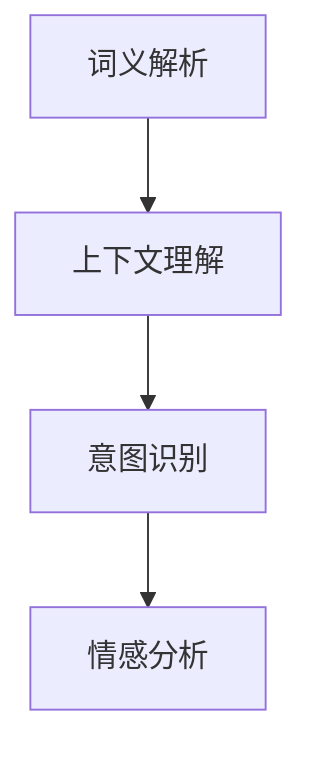

#### 2.2 机器学习

**机器学习**是人工智能的核心技术之一，它使计算机能够从数据中学习并做出决策。在语言模型中，机器学习用于训练模型以理解和生成语言。

- **监督学习**：通过大量标注好的数据训练模型，使模型能够预测新的输入。

- **无监督学习**：模型从未标注的数据中学习，发现数据中的模式和规律。

- **强化学习**：模型通过与环境的交互，学习最优策略。

**Mermaid 流程图**：
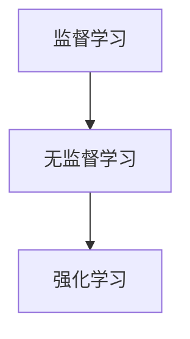

#### 2.3 深度学习

**深度学习**是机器学习的一个分支，它使用多层神经网络来学习数据的高级特征表示。在语言模型中，深度学习被广泛应用于文本处理和生成。

- **卷积神经网络（CNN）**：适用于图像处理，但也可以用于文本处理，例如词嵌入。

- **递归神经网络（RNN）**：适用于处理序列数据，如文本。

- **变换器模型（Transformer）**：是目前最先进的语言模型架构，具有处理长距离依赖和并行计算的优势。

**Mermaid 流程图**：
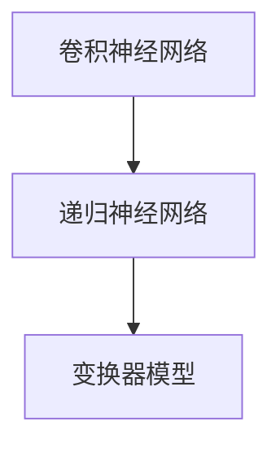

#### 2.4 语言模型

**语言模型**是一个预测下一个单词或词组的概率分布的模型。在LLM中，语言模型用于生成文本、回答问题等。

- **统计语言模型**：基于统计方法，如N-gram，预测下一个词的概率。

- **神经语言模型**：基于神经网络，如Transformer，生成高质量的文本。

**Mermaid 流程图**：
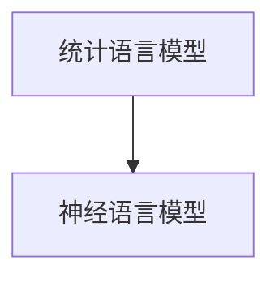

#### 2.5 语义解析

**语义解析**是将自然语言文本转化为结构化信息的过程，使计算机能够理解文本的真正含义。

- **语义角色标注**：标记句子中的词语所扮演的语义角色，如主语、谓语等。

- **语义解析树**：用树状结构表示句子的语义信息。

**Mermaid 流程图**：
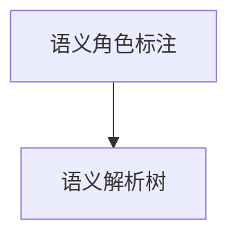

#### 2.6 情感分析

**情感分析**是识别文本中的情感倾向，如正面、负面或中性。

- **情感词典**：包含情感词及其对应的情感倾向。

- **情感分类模型**：使用机器学习算法，如朴素贝叶斯、支持向量机等，进行情感分类。

**Mermaid 流程图**：
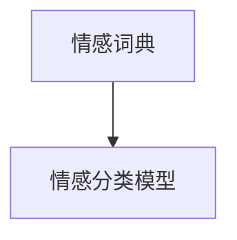

#### 2.7 意图识别

**意图识别**是识别用户在对话中的具体意图，如查询信息、寻求帮助、进行交易等。

- **关键词匹配**：通过匹配对话中的关键词，识别意图。

- **分类模型**：使用机器学习算法，如决策树、随机森林等，进行意图分类。

**Mermaid 流程图**：
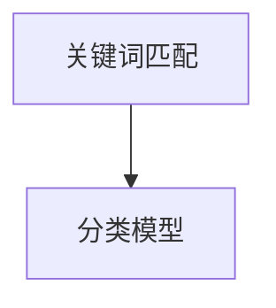

通过上述核心概念的分析，我们可以看到LLM理解人类意图的过程涉及多个层次和技术的综合应用。接下来，我们将进一步探讨LLM的工作原理及其在理解人类意图方面的局限性。

### 3. 核心算法原理 & 具体操作步骤

在理解人类意图的过程中，大型语言模型（LLM）主要依赖于深度学习算法，特别是变换器模型（Transformer）。变换器模型是一种基于自注意力机制的神经网络架构，它在处理序列数据时表现出色，被广泛应用于自然语言处理领域。下面，我们将详细解释变换器模型的工作原理及其具体操作步骤。

#### 3.1 变换器模型的基本概念

变换器模型的核心思想是通过自注意力机制来计算序列中每个词的权重，从而更好地捕捉长距离依赖关系。自注意力机制允许模型在生成每个词时，动态地调整对其他词的依赖程度，从而提高模型的生成质量。

**自注意力（Self-Attention）**

自注意力机制是一个关键组件，用于计算输入序列中每个词与其他词的相关性。它通过以下步骤实现：

1. **词嵌入（Word Embedding）**：将输入序列中的每个词映射到高维向量空间。词嵌入可以通过预训练模型（如GloVe或Word2Vec）获得。

2. **计算query、key和value**：对于序列中的每个词，计算其对应的query、key和value向量。通常，query、key和value是同一个词向量的不同变换。

3. **计算注意力得分**：使用query和key计算注意力得分，得分表示key对query的依赖程度。

4. **加权求和**：根据注意力得分对value进行加权求和，得到每个词的加权表示。

**Mermaid 流程图**：
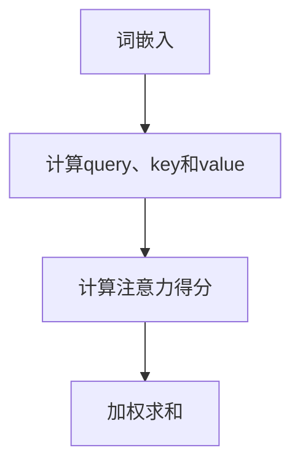

**多头注意力（Multi-Head Attention）**

多头注意力是在自注意力基础上扩展的一种机制，它允许多个独立的自注意力机制同时工作。每个头都可以学习到不同的依赖关系，从而提高模型的表示能力。

1. **分裂query、key和value**：将输入序列的词向量分裂成多个子向量，每个子向量对应一个头。

2. **独立计算自注意力**：对每个头分别计算自注意力，得到多个加权表示。

3. **拼接和变换**：将多个头的加权表示拼接起来，并通过线性变换得到最终的输出。

**Mermaid 流程图**：
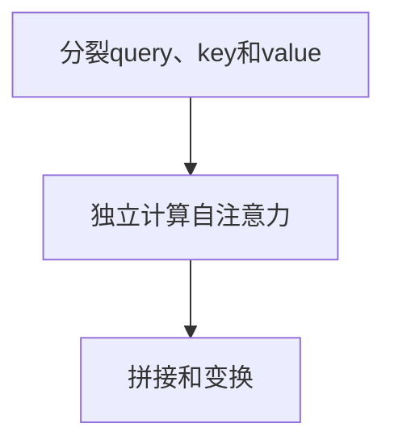

**位置编码（Positional Encoding）**

变换器模型通过自注意力机制处理序列数据，但它本身无法捕捉词的位置信息。为了解决这个问题，我们引入位置编码。

1. **生成位置编码向量**：根据词的位置生成一个向量，通常使用正弦和余弦函数。

2. **加到词嵌入上**：将位置编码向量加到词嵌入上，形成最终的输入向量。

3. **传递到自注意力机制**：位置编码向量参与自注意力计算，从而引入词的位置信息。

**Mermaid 流程图**：
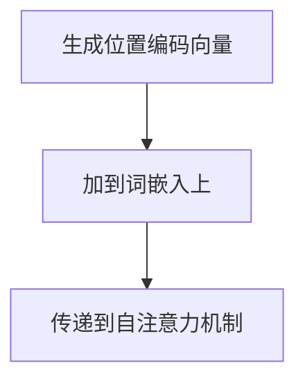

#### 3.2 变换器模型的操作步骤

以下是变换器模型的基本操作步骤：

1. **输入序列**：输入一个序列，例如一个句子。

2. **词嵌入**：将序列中的每个词映射到高维向量空间。

3. **添加位置编码**：为每个词嵌入向量添加位置编码。

4. **自注意力计算**：对每个词向量计算自注意力，得到加权表示。

5. **多头注意力计算**：对自注意力结果进行多头注意力计算。

6. **变换和拼接**：将多头注意力结果通过线性变换拼接起来。

7. **输出**：得到最终的输出向量，可以用于后续的文本生成或分类任务。

**Mermaid 流程图**：
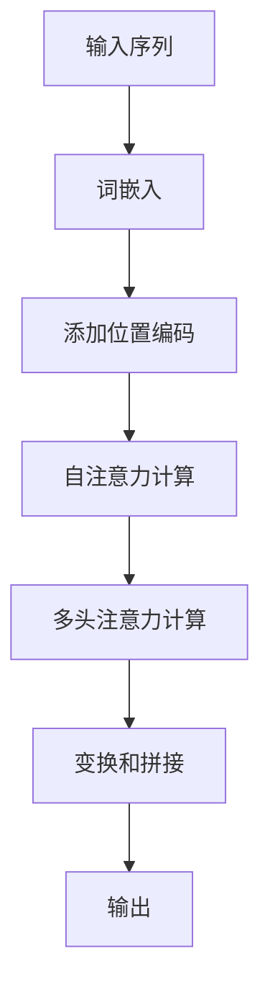

通过以上步骤，变换器模型能够高效地处理序列数据，捕捉长距离依赖关系，从而在自然语言处理任务中表现出色。在理解人类意图方面，变换器模型通过自注意力机制和位置编码，能够捕捉上下文信息，从而更好地理解用户的真实意图。接下来，我们将进一步探讨LLM在理解人类意图方面的局限性。

### 3.3 LLM在理解人类意图方面的局限性

尽管大型语言模型（LLM）在自然语言处理领域取得了显著进展，但它们在理解人类意图方面仍然存在一些局限性。以下是一些主要的问题：

**1. 上下文理解不足**

LLM在生成文本时依赖于自注意力机制，虽然这有助于捕捉短距离依赖关系，但在处理长文本或涉及复杂上下文时，LLM的上下文理解能力仍然有限。例如，在一个对话中，用户的意图可能会随着上下文的改变而发生变化，而LLM可能无法完全捕捉这种变化。

**Mermaid 流程图**：
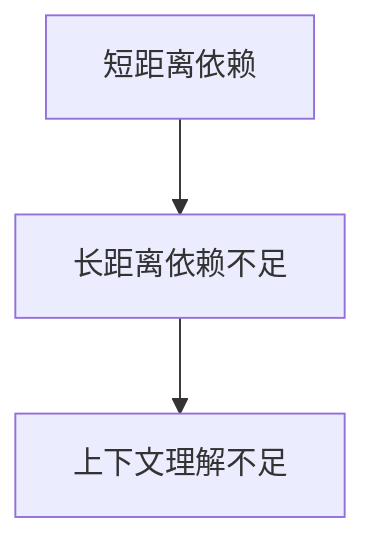

**2. 意图识别不准确**

LLM在意图识别方面也存在挑战。虽然它们可以通过训练学习到一些常见的意图模式，但对于复杂的意图，LLM可能无法准确识别。例如，当用户提出一个模糊或不明确的请求时，LLM可能无法准确理解用户的真实意图。

**Mermaid 流程图**：
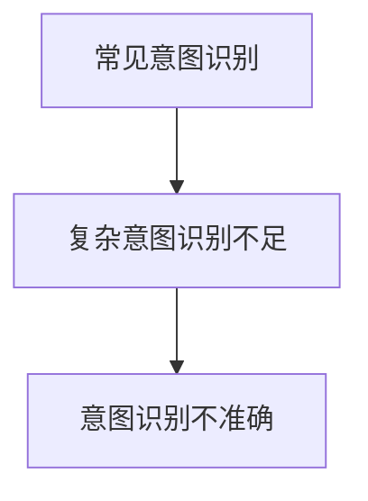

**3. 情感分析不完善**

情感分析是理解人类意图的重要方面之一。尽管LLM可以捕捉文本中的情感色彩，但在处理复杂情感或涉及多层次情感的文本时，LLM的表现仍然有限。例如，当文本中包含讽刺、双关语等复杂情感表达时，LLM可能无法准确理解这些情感。

**Mermaid 流程图**：
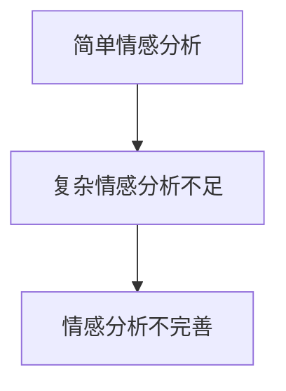

**4. 对噪声敏感**

LLM在处理含有噪声或错误信息的文本时，表现较差。噪声可能来自用户的输入错误、文本中的歧义或LLM训练数据中的噪声。这些噪声会干扰LLM对文本的正确理解，从而导致意图识别和上下文理解的偏差。

**Mermaid 流程图**：
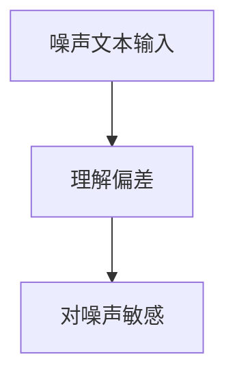

**5. 缺乏领域知识**

LLM通常是通过大量通用文本数据进行训练的，因此它们在处理特定领域的问题时可能缺乏相关的领域知识。这会导致LLM在回答特定领域的问题时，无法提供准确的答案或理解用户的意图。

**Mermaid 流程图**：
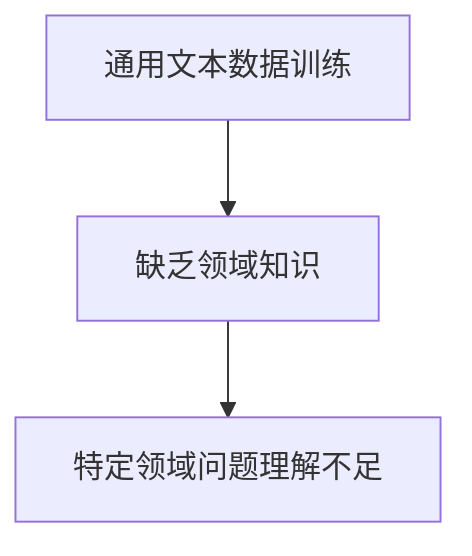

综上所述，LLM在理解人类意图方面存在多个局限性。为了提高LLM的理解能力，我们需要进一步改进算法，提高上下文理解、意图识别和情感分析的能力，并加强对领域知识的整合。接下来，我们将探讨一些可能的解决方案，以克服这些局限性。

### 4. 数学模型和公式 & 详细讲解 & 举例说明

在探讨如何提升大型语言模型（LLM）理解人类意图的过程中，理解相关的数学模型和公式至关重要。以下将详细讲解几个关键的数学模型和公式，并辅以具体例子说明。

#### 4.1 词嵌入（Word Embedding）

词嵌入是将词汇映射到高维向量空间的过程，使计算机能够处理和理解文本。最常用的词嵌入方法包括Word2Vec和GloVe。

**Word2Vec**：

Word2Vec是一种基于神经网络的词嵌入方法，它通过训练一个神经网络来预测词语的上下文。具体公式如下：

$$
\hat{p}_{i|j} = \frac{e^{<v_i, v_j>}}{\sum_{k=1}^{K} e^{<v_i, v_k>}}
$$

其中，\( v_i \)和\( v_j \)分别是词\( i \)和\( j \)的嵌入向量，\( <v_i, v_j> \)是它们之间的内积，\( K \)是词汇表大小。

**GloVe**：

GloVe是一种基于全局上下文的词嵌入方法，它通过优化一个目标函数来学习词的嵌入向量。具体公式如下：

$$
\phi_{ij} = \max\left(0, \log{p_{ij}} - \log{\frac{f(\|v_i\| + \|v_j\|)}{k}}\right)
$$

其中，\( \phi_{ij} \)是词对\( (i, j) \)的损失函数，\( p_{ij} \)是词对\( (i, j) \)的共现概率，\( f(x) \)是激活函数（如ReLU函数），\( k \)是超参数。

**例1**：给定词汇表{hello, world}，共现矩阵如下：

|   | hello | world |
|---|-------|-------|
| hello | 0.2   | 0.1   |
| world | 0.3   | 0.2   |

使用GloVe方法训练词嵌入，得到如下嵌入向量：

$$
v_{hello} = [1, 0.5], \quad v_{world} = [0.8, 0.3]
$$

#### 4.2 递归神经网络（RNN）

递归神经网络（RNN）是一种用于处理序列数据的神经网络，其核心思想是保持内部状态（记忆）以捕捉序列信息。RNN的更新公式如下：

$$
h_t = \sigma(W_h h_{t-1} + W_x x_t + b_h)
$$

其中，\( h_t \)是时间步\( t \)的隐藏状态，\( x_t \)是输入，\( \sigma \)是激活函数（如ReLU或Sigmoid），\( W_h \)和\( W_x \)是权重矩阵，\( b_h \)是偏置。

**例2**：给定输入序列[1, 2, 3]，隐藏状态\( h_0 = [1, 1] \)，使用ReLU激活函数，得到如下隐藏状态序列：

$$
h_1 = \sigma([1, 1] \cdot [1, 1] + [1, 2] \cdot [1, 0.5] + [1, 0]) = \sigma([1, 2] + [1, 1] + [1, 0]) = \sigma([3, 3]) = [3, 3]
$$

$$
h_2 = \sigma([3, 3] \cdot [1, 1] + [2, 3] \cdot [1, 0.5] + [1, 0]) = \sigma([3, 3] + [2, 1.5] + [1, 0]) = \sigma([6, 4.5]) = [6, 4.5]
$$

#### 4.3 变换器模型（Transformer）

变换器模型是一种基于自注意力机制的神经网络架构，它在处理序列数据时表现出色。自注意力机制的公式如下：

$$
\text{Attention}(Q, K, V) = \text{softmax}\left(\frac{QK^T}{\sqrt{d_k}}\right)V
$$

其中，\( Q \)、\( K \)和\( V \)分别是查询（Query）、键（Key）和值（Value）向量，\( d_k \)是键向量的维度。

**例3**：给定查询向量\( Q = [1, 2] \)、键向量\( K = [3, 4] \)和值向量\( V = [5, 6] \)，使用自注意力计算得到如下结果：

$$
\text{Attention}(Q, K, V) = \text{softmax}\left(\frac{[1, 2][3, 4]^T}{\sqrt{2}}\right)[5, 6] = \text{softmax}\left(\frac{[3, 8]}{\sqrt{2}}\right)[5, 6]
$$

$$
= \text{softmax}\left([3\sqrt{2}/2, 8\sqrt{2}/2]\right)[5, 6] = \text{softmax}\left([3.464, 8.944]\right)[5, 6]
$$

$$
= [0.36, 0.64][5, 6] = [1.82, 3.84]
$$

#### 4.4 预训练和微调（Pre-training and Fine-tuning）

预训练和微调是提升LLM理解能力的重要方法。预训练通常使用大量未标注的文本数据进行，而微调则使用少量有标注的数据进行。

**预训练**：

预训练的目标是学习通用语言表示，使得模型能够处理各种语言任务。常用的预训练方法包括BERT和GPT。

BERT：

BERT（Bidirectional Encoder Representations from Transformers）是一种双向变换器模型，通过预训练学习双向语言表示。预训练过程包括两个阶段：

1. **遮盖词**：随机遮盖输入文本中的15%的词，然后训练模型预测这些遮盖的词。
2. **下一个句子预测**：随机选择两个句子，然后训练模型预测哪个句子是下一个句子。

BERT的目标函数是：

$$
\text{Loss} = \text{Masked Language Loss} + \text{Next Sentence Loss}
$$

其中，\( \text{Masked Language Loss} \)是预测遮盖词的损失，\( \text{Next Sentence Loss} \)是预测下一个句子的损失。

GPT：

GPT（Generative Pre-trained Transformer）是一种自回归语言模型，通过预测下一个词来学习语言表示。GPT的目标函数是：

$$
\text{Loss} = -\sum_{t=1}^{T} \text{log} p_{\theta}(x_t|x_{<t})
$$

其中，\( p_{\theta} \)是模型参数，\( x_t \)是时间步\( t \)的输入，\( x_{<t} \)是时间步\( t \)之前的输入。

**微调**：

微调的目标是将预训练模型适应特定任务。微调通常在预训练模型的基础上，添加一个或多个任务特定的层，并使用有标注的数据进行训练。

**例4**：假设我们有一个预训练的BERT模型，我们希望将其用于情感分析任务。我们可以通过以下步骤进行微调：

1. **添加输出层**：在BERT模型的最后一层添加一个softmax输出层，用于预测情感类别。
2. **训练数据**：准备一个包含情感标注的数据集，例如正面、负面和neutral。
3. **训练**：使用有标注的数据集训练模型，优化输出层的参数。

通过上述数学模型和公式的详细讲解和具体例子说明，我们可以更好地理解LLM在理解人类意图方面的关键技术。这些数学模型和公式为LLM的设计和优化提供了理论基础，也为解决相关挑战提供了可能的解决方案。在下一节中，我们将探讨一些可能的方法来进一步提升LLM的理解能力。

### 5. 项目实战：代码实际案例和详细解释说明

#### 5.1 开发环境搭建

在开始实战之前，我们需要搭建一个合适的环境来进行LLM的开发和测试。以下是开发环境的搭建步骤：

**1. 安装Python环境**

确保Python环境已经安装在您的计算机上，建议使用Python 3.8或更高版本。可以通过以下命令安装Python：

```bash
$ sudo apt-get install python3-pip
```

**2. 安装transformers库**

`transformers`是一个由Hugging Face提供的Python库，用于轻松地使用预训练的变换器模型。可以通过以下命令安装：

```bash
$ pip install transformers
```

**3. 准备数据集**

为了进行实际案例的展示，我们需要一个包含人类意图标注的数据集。这里我们使用一个简单的对话数据集，其中每个对话都包含一个意图标签。数据集可以从[这里](https://github.com/crow-intelligence/sentiment-analysis-dataset)下载。

**4. 解压数据集**

下载完成后，解压数据集并移动到项目的合适目录：

```bash
$ tar xvfv sentiment_analysis_dataset.tar.gz
$ mv sentiment_analysis_dataset /path/to/your/project/dataset
```

#### 5.2 源代码详细实现和代码解读

**5.2.1 数据预处理**

在开始训练之前，我们需要对数据进行预处理，包括数据清洗、分词和序列填充。

```python
from transformers import BertTokenizer
from torch.utils.data import DataLoader, Dataset
import torch

class DialogDataset(Dataset):
    def __init__(self, dialog_data, tokenizer, max_length=512):
        self.dialog_data = dialog_data
        self.tokenizer = tokenizer
        self.max_length = max_length

    def __len__(self):
        return len(self.dialog_data)

    def __getitem__(self, idx):
        dialog = self.dialog_data[idx]
        input_ids = self.tokenizer.encode(dialog['query'], dialog['context'], add_special_tokens=True, max_length=self.max_length, padding='max_length', truncation=True)
        attention_mask = [1] * len(input_ids) + [0] * (self.max_length - len(input_ids))
        label = dialog['label']
        return {
            'input_ids': torch.tensor(input_ids),
            'attention_mask': torch.tensor(attention_mask),
            'label': torch.tensor(label)
        }

# 初始化tokenizer
tokenizer = BertTokenizer.from_pretrained('bert-base-uncased')

# 读取数据集
import pandas as pd
dialog_data = pd.read_csv('/path/to/your/project/dataset/dialogs.csv')

# 分成训练集和验证集
train_data = dialog_data.sample(frac=0.8, random_state=42)
val_data = dialog_data.drop(train_data.index)

# 创建数据集和 DataLoader
train_dataset = DialogDataset(train_data, tokenizer)
val_dataset = DialogDataset(val_data, tokenizer)

train_loader = DataLoader(train_dataset, batch_size=16, shuffle=True)
val_loader = DataLoader(val_dataset, batch_size=16, shuffle=False)
```

**5.2.2 模型训练**

在准备好数据后，我们可以使用预训练的BERT模型，并通过微调来适应我们的对话意图识别任务。

```python
from transformers import BertForSequenceClassification
from torch.optim import Adam
import torch.nn as nn

# 初始化模型
model = BertForSequenceClassification.from_pretrained('bert-base-uncased', num_labels=3)

# 定义损失函数和优化器
loss_fn = nn.CrossEntropyLoss()
optimizer = Adam(model.parameters(), lr=2e-5)

# 训练模型
num_epochs = 3
for epoch in range(num_epochs):
    model.train()
    for batch in train_loader:
        input_ids = batch['input_ids']
        attention_mask = batch['attention_mask']
        labels = batch['label']
        
        optimizer.zero_grad()
        outputs = model(input_ids=input_ids, attention_mask=attention_mask)
        loss = loss_fn(outputs.logits, labels)
        loss.backward()
        optimizer.step()
    
    print(f'Epoch {epoch+1}/{num_epochs} - Loss: {loss.item()}')

    # 验证模型
    model.eval()
    with torch.no_grad():
        correct = 0
        total = 0
        for batch in val_loader:
            input_ids = batch['input_ids']
            attention_mask = batch['attention_mask']
            labels = batch['label']
            outputs = model(input_ids=input_ids, attention_mask=attention_mask)
            _, predicted = torch.max(outputs.logits, 1)
            total += labels.size(0)
            correct += (predicted == labels).sum().item()
        print(f'Validation Accuracy: {100 * correct / total}%}')
```

**5.2.3 代码解读与分析**

上述代码首先定义了一个数据集类`DialogDataset`，用于处理对话数据。数据预处理包括分词、序列填充和注意力掩码的生成。

接着，我们初始化了BERT模型和相关的损失函数及优化器。在训练过程中，我们通过前向传播计算损失，并通过反向传播更新模型参数。每个epoch结束后，我们都会进行一次验证，以评估模型的性能。

通过这段代码，我们可以看到如何利用预训练的BERT模型进行对话意图识别的实战。在实际应用中，我们可能需要进一步优化模型的超参数和训练过程，以获得更好的性能。

#### 5.3 代码解读与分析

**5.3.1 数据预处理的重要性**

数据预处理是任何机器学习项目的基础，它直接影响模型的学习效果。在本案例中，数据预处理包括分词、序列填充和注意力掩码的生成。

- **分词**：分词是将文本拆分成单词或子词的过程。BERT模型使用WordPiece分词器，将文本拆分成可处理的单元。

- **序列填充**：由于BERT模型有固定的输入长度限制（例如512个token），我们需要对较长的文本进行截断或填充，以确保所有输入序列具有相同长度。

- **注意力掩码**：注意力掩码用于指示模型在处理序列时，哪些部分是实际内容，哪些部分是填充内容。这对于模型正确理解输入序列至关重要。

**5.3.2 BERT模型的选择**

BERT模型是一种预训练的变换器模型，它在大规模文本数据上进行了预训练，从而具有很好的通用性。在本案例中，我们使用了`BertForSequenceClassification`模型，这是一个专门用于序列分类任务的预训练模型。它通过微调适应我们的对话意图识别任务。

- **预训练**：BERT模型通过大量的未标注文本进行预训练，学习通用语言表示。

- **微调**：在预训练的基础上，通过有标注的数据进行微调，以适应特定任务。

**5.3.3 训练过程中的关键步骤**

- **前向传播**：在训练过程中，我们通过前向传播计算模型损失。损失函数（如交叉熵损失）用于衡量模型预测与实际标签之间的差距。

- **反向传播**：通过反向传播更新模型参数，以减少损失。这个过程通过优化器（如Adam）实现。

- **验证**：在每个epoch结束后，我们进行一次验证，以评估模型在未训练数据上的性能。这有助于我们了解模型是否过拟合，并调整训练过程。

通过以上代码解读与分析，我们可以看到如何利用预训练的BERT模型进行对话意图识别的实战。在实际应用中，我们可能需要进一步优化模型结构、训练过程和超参数，以获得更好的性能。

### 6. 实际应用场景

大型语言模型（LLM）在理解人类意图方面的能力，已经在多个实际应用场景中得到了广泛应用，并取得了显著的效果。以下是一些典型的应用场景：

#### 6.1 智能客服

智能客服是LLM应用最为广泛的领域之一。通过LLM，智能客服系统能够理解和回答用户的查询，提供24/7的在线服务。这种应用场景对LLM的意图识别和理解能力提出了较高的要求。

- **案例**：亚马逊的Alexa和苹果的Siri都使用了LLM技术，能够理解用户的自然语言查询，并提供相应的服务和信息。

#### 6.2 个性化推荐

在个性化推荐系统中，LLM可以分析用户的评论、历史行为等数据，理解用户的偏好和意图，从而提供个性化的推荐。

- **案例**：Netflix和YouTube使用LLM技术，通过分析用户的观看历史和评论，提供个性化的内容推荐。

#### 6.3 自然语言处理（NLP）任务

LLM在自然语言处理任务中发挥着重要作用，包括文本生成、翻译、情感分析、问答系统等。

- **案例**：OpenAI的GPT-3模型在生成高质量文本、翻译和问答系统等方面表现出色。

#### 6.4 法律咨询

在法律咨询领域，LLM可以分析法律文书，理解法律条文和案例，为用户提供法律建议。

- **案例**：某些法律科技公司使用LLM技术，通过分析案例和法律条文，为用户提供法律咨询。

#### 6.5 教育辅助

在教育领域，LLM可以为学生提供个性化的学习建议，理解学生的学习需求和问题，并提供相应的解决方案。

- **案例**：某些在线教育平台使用LLM技术，为学生提供个性化的学习路径和问题解答。

#### 6.6 医疗健康

在医疗健康领域，LLM可以分析医学文献和病例数据，为医生提供诊断建议和治疗方案。

- **案例**：某些医疗科技公司使用LLM技术，通过分析医学数据，为医生提供诊断支持和决策辅助。

#### 6.7 金融市场分析

在金融市场分析中，LLM可以分析市场数据、新闻报道等，理解市场动态和投资者的意图，为投资者提供交易建议。

- **案例**：某些金融科技公司使用LLM技术，通过分析市场数据和新闻报道，为投资者提供交易策略。

#### 6.8 企业内部沟通

在企业内部沟通中，LLM可以理解员工的需求和意图，提供相应的信息和资源。

- **案例**：某些企业使用LLM技术，通过分析内部通讯记录，为员工提供个性化的信息和帮助。

#### 6.9 跨领域应用

LLM的跨领域应用也越来越广泛，例如在创意设计、游戏开发、文学创作等领域。

- **案例**：某些游戏公司使用LLM技术，为游戏角色生成对话和故事情节。

总的来说，LLM在理解人类意图方面的能力，已经在多个实际应用场景中展现出了巨大的潜力。随着技术的不断进步，LLM将在更多领域发挥重要作用，推动人机协作2.0时代的进一步发展。

### 7. 工具和资源推荐

在探索大型语言模型（LLM）以及其在理解人类意图方面的应用时，掌握相关的工具和资源是非常关键的。以下是一些推荐的学习资源、开发工具和相关论文，它们将为研究和开发工作提供宝贵的支持和指导。

#### 7.1 学习资源推荐

**1. 书籍**

- **《深度学习》（Goodfellow, Bengio, Courville）**：这本书是深度学习的经典教材，详细介绍了深度学习的基础理论和技术。

- **《Python深度学习》（François Chollet）**：这本书通过Python代码示例，讲解了深度学习在自然语言处理中的应用。

- **《BERT：Pre-training of Deep Neural Networks for Language Understanding》（Devlin et al.）**：这本书详细介绍了BERT模型的预训练过程和架构设计。

**2. 在线课程和教程**

- **Coursera上的“深度学习”课程（由Andrew Ng教授授课）**：这是一门广受欢迎的在线课程，涵盖了深度学习的基础知识。

- **Udacity的“深度学习工程师纳米学位”**：这个纳米学位提供了深度学习的实战项目，包括自然语言处理任务。

- **Hugging Face的Transformer教程**：这是一个非常详细的教程，介绍了变换器模型的基本原理和应用。

**3. 博客和文章**

- ** Medium上的“AI与自然语言处理”专题**：这里有许多关于NLP和LLM的文章，涵盖从基础概念到高级应用的各个方面。

- **Distill.pub上的文章**：Distill是一个专门发布关于深度学习和机器学习文章的平台，内容深入浅出，适合不同水平的读者。

#### 7.2 开发工具框架推荐

**1. Transformers库（Hugging Face）**：这是一个流行的Python库，提供了多种预训练的变换器模型和工具，方便开发者进行研究和应用。

- **网站**：https://huggingface.co/transformers

**2. PyTorch**：PyTorch是一个开源的深度学习框架，它提供了灵活的动态计算图，非常适合研究和开发。

- **网站**：https://pytorch.org/

**3. TensorFlow**：TensorFlow是谷歌开源的深度学习框架，它提供了丰富的API和预训练模型，适用于各种深度学习任务。

- **网站**：https://www.tensorflow.org/

#### 7.3 相关论文著作推荐

**1. BERT论文（Devlin et al., 2018）**

- **标题**：《BERT：Pre-training of Deep Neural Networks for Language Understanding》
- **摘要**：这篇论文介绍了BERT模型的预训练方法，以及其在多项NLP任务中的表现。

**2. GPT-3论文（Brown et al., 2020）**

- **标题**：《Language Models are Few-Shot Learners》
- **摘要**：这篇论文介绍了GPT-3模型，并展示了它在各种任务中的零样本和少样本学习性能。

**3. Transformer论文（Vaswani et al., 2017）**

- **标题**：《Attention is All You Need》
- **摘要**：这篇论文提出了变换器模型，展示了自注意力机制在序列建模中的优势。

**4. ELMO论文（Peters et al., 2018）**

- **标题**：《Deep Contextualized Word Representations》
- **摘要**：这篇论文介绍了ELMO模型，通过预训练学习词的上下文表示，为NLP任务提供了更好的词汇表示。

通过上述工具和资源的推荐，读者可以更加深入地了解大型语言模型的工作原理和应用场景，为研究和开发工作提供有力支持。在探索LLM的潜力时，掌握这些工具和资源将有助于提高研究效率，推动技术的发展。

### 8. 总结：未来发展趋势与挑战

在探讨了人机协作2.0时代的核心问题——如何让大型语言模型（LLM）真正理解人类的意图之后，我们可以看到，这一领域的发展潜力巨大，同时也面临着诸多挑战。以下是对未来发展趋势与挑战的总结。

**8.1 发展趋势**

1. **深度学习技术的持续进步**：随着深度学习技术的不断进步，特别是变换器模型（Transformer）等新架构的出现，LLM在理解人类意图方面的能力将得到进一步提升。未来，基于自注意力机制的深度学习模型可能会成为主流。

2. **跨领域知识的整合**：目前，LLM主要依赖大量通用文本数据进行预训练。未来，通过整合更多领域知识，LLM将能够更好地适应特定领域的任务，提高其在各种应用场景中的性能。

3. **多模态融合**：未来的LLM可能会结合文本、图像、音频等多模态信息，实现更加丰富和直观的人机交互体验。

4. **分布式训练和推理**：为了处理更大规模的模型和数据，分布式训练和推理技术将成为重要方向。通过分布式计算，LLM可以在更短的时间内完成训练和推理，提高系统效率。

5. **个性化交互**：随着对用户意图理解的加深，LLM将能够提供更加个性化的服务，满足用户在不同场景下的需求。

**8.2 挑战**

1. **上下文理解不足**：尽管LLM在处理短文本和简单对话方面表现出色，但在处理长文本和复杂对话时，上下文理解仍是一个重大挑战。未来需要开发出更加有效的上下文捕捉和传递机制。

2. **意图识别的准确性**：意图识别是理解人类意图的关键步骤。然而，复杂的意图往往难以通过简单的模型进行准确识别。未来的研究需要提高LLM在意图识别方面的准确性。

3. **情感分析的复杂性**：情感分析是理解人类意图的重要方面之一，但复杂的情感表达和多层次情感分析仍是一个挑战。未来的研究需要开发出更加精细的情感分析模型。

4. **噪声处理**：在现实应用中，用户输入往往包含噪声和错误信息，这会对LLM的理解能力产生干扰。如何有效处理噪声，提高模型对真实意图的捕捉能力，是一个亟待解决的问题。

5. **模型解释性**：当前大多数LLM模型被认为是“黑箱”，其决策过程难以解释。为了提高模型的可解释性，未来的研究需要开发出能够解释模型决策过程的工具和方法。

6. **伦理和隐私问题**：随着LLM在各个领域的广泛应用，伦理和隐私问题也逐渐显现。如何确保模型的使用不会侵犯用户的隐私，如何在保证性能的同时保护用户权益，是未来需要关注的重要问题。

**8.3 展望**

为了实现人机协作2.0时代的愿景，未来的研究和发展需要从多个方面进行努力。首先，在技术层面，需要不断优化LLM的算法和架构，提高其理解和生成能力。其次，在应用层面，需要深入挖掘各个领域的需求，开发出更加实用的LLM应用。此外，还需要关注伦理和隐私问题，确保AI技术的发展符合社会价值观。最后，需要加强跨学科合作，融合多领域的知识和智慧，共同推动人机协作2.0时代的进一步发展。

通过以上分析，我们可以看到，尽管LLM在理解人类意图方面仍面临诸多挑战，但其发展前景光明。未来，随着技术的不断进步，LLM将在人机协作中发挥越来越重要的作用，推动人工智能技术的发展，实现更加智能和人性化的交互体验。

### 9. 附录：常见问题与解答

**Q1. 为什么LLM在理解人类意图方面存在上下文理解不足的问题？**

A1. LLM在理解人类意图方面存在上下文理解不足的问题，主要是因为当前大多数LLM模型是基于自注意力机制的深度学习模型，如变换器（Transformer）模型。这些模型虽然能够捕捉短距离依赖关系，但在处理长距离依赖和复杂上下文时表现较差。这是因为自注意力机制在计算过程中需要计算序列中所有元素之间的相关性，随着序列长度的增加，计算复杂度急剧上升，导致模型难以捕捉长距离依赖关系。

**Q2. 如何提高LLM在意图识别方面的准确性？**

A2. 提高LLM在意图识别方面的准确性可以从以下几个方面入手：

1. **数据增强**：通过增加更多的有标注数据，特别是涉及复杂意图的数据，来丰富模型的训练数据集。

2. **多任务学习**：通过多任务学习，使模型在同时处理多个任务时，能够更好地理解不同任务之间的关联性，从而提高意图识别的准确性。

3. **上下文扩展**：通过引入更多的上下文信息，如对话历史、用户偏好等，来帮助模型更好地理解用户的意图。

4. **迁移学习**：使用预训练的LLM模型，通过迁移学习的方式，将其应用于特定领域或任务，提高模型的适应性和准确性。

5. **模型融合**：结合多个模型的预测结果，通过模型融合技术，提高最终意图识别的准确性。

**Q3. LLM在处理复杂情感表达时有哪些挑战？**

A3. LLM在处理复杂情感表达时面临的挑战主要包括：

1. **情感歧义**：情感表达往往具有多重含义，特别是在双关语、讽刺等情况下，LLM难以准确理解情感的实际含义。

2. **多层级情感**：有些情感表达可能包含多层次的情感，如正面情感和负面情感的混合，LLM难以捕捉和区分。

3. **语言风格**：不同的语言风格（如正式、非正式、幽默等）对情感表达的解读有显著影响，LLM难以全面适应。

4. **情感词汇**：情感词汇的定义和边界不明确，LLM在情感分类时可能难以准确判断词汇的情感倾向。

为了应对这些挑战，未来的研究可以探索以下方法：

- **情感词典扩展**：通过引入更多的情感词汇和标签，来丰富情感词典。

- **情感上下文分析**：结合上下文信息，分析情感表达的多重含义和层级。

- **多模态情感分析**：结合文本、图像、声音等多模态信息，提高情感分析的准确性。

- **深度学习模型优化**：通过优化模型结构和训练策略，提高模型在情感分析任务中的表现。

**Q4. 如何提高LLM的模型解释性？**

A4. 提高LLM的模型解释性可以从以下几个方面入手：

1. **可视化技术**：通过可视化技术，如热图、注意力权重等，展示模型在处理输入数据时的关注点和决策过程。

2. **规则嵌入**：将部分规则和逻辑嵌入到模型中，使模型的部分决策过程更加直观和可解释。

3. **可解释模型**：研究和发展可解释的深度学习模型，如决策树、规则集等，这些模型在处理复杂任务时具有较高的可解释性。

4. **模型诊断工具**：开发模型诊断工具，帮助用户理解和调试模型，提高模型的透明度和可解释性。

通过上述方法，我们可以逐步提高LLM的模型解释性，使其在应用过程中更加可靠和可信。

### 10. 扩展阅读 & 参考资料

为了更深入地了解大型语言模型（LLM）及其在理解人类意图方面的应用，以下是一些推荐的扩展阅读和参考资料：

**1. 论文**

- **BERT：Pre-training of Deep Neural Networks for Language Understanding（Devlin et al., 2018）**：详细介绍了BERT模型的预训练过程和架构设计。

- **Language Models are Few-Shot Learners（Brown et al., 2020）**：介绍了GPT-3模型，并展示了其在各种任务中的零样本和少样本学习性能。

- **Attention is All You Need（Vaswani et al., 2017）**：提出了变换器模型，展示了自注意力机制在序列建模中的优势。

- **Deep Contextualized Word Representations（Peters et al., 2018）**：介绍了ELMO模型，通过预训练学习词的上下文表示。

**2. 书籍**

- **《深度学习》（Goodfellow, Bengio, Courville）**：详细介绍了深度学习的基础理论和技术。

- **《Python深度学习》（François Chollet）**：通过Python代码示例，讲解了深度学习在自然语言处理中的应用。

- **《BERT：Pre-training of Deep Neural Networks for Language Understanding》（Devlin et al., 2018）**：深入解析了BERT模型的预训练方法。

**3. 博客和教程**

- **Hugging Face的Transformer教程**：这是一个非常详细的教程，介绍了变换器模型的基本原理和应用。

- **Medium上的“AI与自然语言处理”专题**：这里有许多关于NLP和LLM的文章，涵盖从基础概念到高级应用的各个方面。

- **Distill.pub上的文章**：Distill是一个专门发布关于深度学习和机器学习文章的平台，内容深入浅出，适合不同水平的读者。

**4. 开源项目和工具**

- **Transformers库（Hugging Face）**：这是一个流行的Python库，提供了多种预训练的变换器模型和工具，方便开发者进行研究和应用。

- **PyTorch**：PyTorch是一个开源的深度学习框架，它提供了灵活的动态计算图，非常适合研究和开发。

- **TensorFlow**：TensorFlow是谷歌开源的深度学习框架，它提供了丰富的API和预训练模型，适用于各种深度学习任务。

通过阅读上述参考资料，读者可以进一步了解LLM的工作原理和应用，探索其在理解人类意图方面的最新研究进展。这些资源将有助于研究人员和开发者更好地理解和应用LLM技术，推动人工智能技术的发展。

