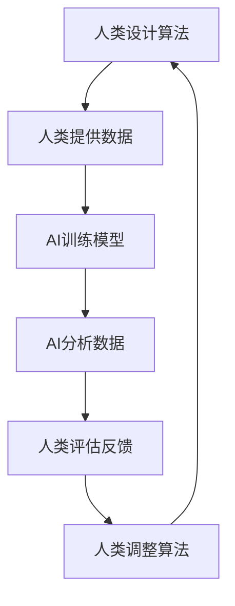

                 

# 人类-AI协作：增强人类智慧与AI能力的融合发展策略

## 关键词：人类-AI协作，智慧增强，人工智能，融合发展策略

### 摘要：

本文旨在探讨人类与人工智能（AI）之间的协作关系，以及如何通过融合发展策略来增强人类智慧与AI能力的结合。首先，我们将回顾AI技术的发展历程及其对人类生活的影响。接着，我们将深入探讨AI的核心概念与架构，包括机器学习、深度学习和自然语言处理等。随后，我们将详细介绍一种新兴的人类-AI协作模式，并分析其原理与实现方法。文章还将讨论实际应用场景，介绍相关的工具和资源，并展望未来发展趋势与挑战。通过这篇文章，读者将了解到如何充分利用AI技术，实现人类智慧的增强。

## 1. 背景介绍

### 人工智能的发展历程

人工智能（AI）作为计算机科学的一个重要分支，自1950年代诞生以来，经历了数个重要阶段。从最初的规则推理和符号计算，到20世纪80年代的专家系统和知识工程，再到21世纪初的深度学习和大数据分析，AI技术不断演进，推动了计算机能力的飞速提升。特别是在2012年，深度学习在ImageNet图像识别竞赛中取得的突破性成果，标志着AI进入了新的发展阶段。

### 人工智能对人类生活的影响

AI技术对人类生活产生了深远的影响。在医疗领域，AI可以辅助医生进行疾病诊断和治疗方案推荐，提高了医疗效率和准确性。在金融领域，AI算法可以分析海量数据，帮助金融机构进行风险评估和欺诈检测，提高了金融系统的安全性。在交通领域，自动驾驶技术有望减少交通事故，提高交通效率。此外，AI还在教育、娱乐、家居等多个领域发挥着重要作用，为人类带来了前所未有的便利和体验。

### 人类与AI协作的意义

随着AI技术的不断发展，人类与AI的协作成为一种必然趋势。人类具有创造力、情感和直觉等独特的思维能力，而AI在数据处理、模式识别和计算速度等方面具有显著优势。通过协作，人类可以充分发挥AI的辅助作用，提高工作效率和决策能力。同时，AI也可以从人类专家那里学习和吸收新的知识，不断优化自身的性能和功能。

## 2. 核心概念与联系

### AI的核心概念

AI的核心概念包括机器学习、深度学习和自然语言处理等。

#### 机器学习（Machine Learning）

机器学习是一种让计算机从数据中学习规律和模式的方法。通过训练模型，机器学习算法可以从给定数据中自动识别出特征和规律，并利用这些规律进行预测和决策。常见的机器学习算法包括线性回归、决策树、支持向量机和神经网络等。

#### 深度学习（Deep Learning）

深度学习是机器学习的一种特殊形式，通过构建多层神经网络，深度学习算法可以自动提取数据的复杂特征，并对其进行分类和预测。深度学习在图像识别、语音识别和自然语言处理等领域取得了显著成果。

#### 自然语言处理（Natural Language Processing）

自然语言处理是一种让计算机理解和处理人类语言的技术。自然语言处理技术包括词法分析、句法分析、语义分析和语言生成等，广泛应用于智能助手、机器翻译和文本分类等领域。

### AI的核心架构

AI的核心架构包括算法、数据和计算能力等。

#### 算法（Algorithm）

算法是AI的灵魂，决定了AI系统的性能和效率。优秀的算法可以自动从海量数据中提取有用信息，并做出准确的预测和决策。

#### 数据（Data）

数据是AI的基石。丰富的数据集可以为AI系统提供足够的训练样本，有助于算法的优化和提升。此外，实时数据流也是AI系统的重要组成部分，可以帮助AI系统快速适应环境变化。

#### 计算能力（Computational Power）

计算能力是AI系统运行的基础。随着硬件技术的不断进步，计算能力的提升为AI系统的发展提供了强有力的支撑。

### 人类与AI协作的原理

人类与AI协作的原理在于充分利用人类的创造力和直觉，以及AI的强大计算能力和数据处理能力。人类可以设计出优秀的算法，并利用AI进行高效的数据分析和计算。同时，人类可以从AI的反馈中学习，不断改进算法和模型。通过这种协作模式，人类可以充分发挥AI的辅助作用，提高工作效率和决策能力。

### Mermaid流程图

以下是一个简单的Mermaid流程图，展示了人类与AI协作的过程：



在上述流程中，人类与AI相互协作，共同完成数据分析和计算任务。

## 3. 核心算法原理 & 具体操作步骤

### 机器学习算法

机器学习算法是AI系统的核心，主要包括以下几种：

#### 线性回归（Linear Regression）

线性回归是一种用于预测数值型数据的算法。其基本原理是通过找到一条最佳拟合直线，来表示输入变量和输出变量之间的关系。具体操作步骤如下：

1. 准备数据集，包括输入变量X和输出变量Y。
2. 计算输入变量X和输出变量Y的均值，分别记为$\mu_X$和$\mu_Y$。
3. 计算输入变量X和输出变量Y的协方差，记为$\Sigma_{XY}$。
4. 计算输入变量X的方差，记为$\Sigma_X$。
5. 计算最佳拟合直线的斜率$k$和截距$b$：
   $$ k = \frac{\Sigma_{XY}}{\Sigma_X} $$
   $$ b = \mu_Y - k\mu_X $$
6. 使用最佳拟合直线预测新的输出变量$Y'$：
   $$ Y' = kX' + b $$

#### 决策树（Decision Tree）

决策树是一种用于分类和回归的算法。其基本原理是通过一系列条件判断，将数据集划分成多个子集，并在每个子集中继续划分，直到达到终止条件。具体操作步骤如下：

1. 准备数据集，包括特征变量X和目标变量Y。
2. 计算每个特征变量的信息增益，选择信息增益最大的特征作为划分条件。
3. 根据划分条件将数据集划分为多个子集。
4. 重复步骤2和3，直到满足终止条件（如最大深度、最小叶节点样本数等）。
5. 构建决策树，每个节点表示一个划分条件，每个叶节点表示一个分类结果。

#### 支持向量机（Support Vector Machine）

支持向量机是一种用于分类和回归的算法。其基本原理是找到最佳的超平面，将数据集划分为不同的类别。具体操作步骤如下：

1. 准备数据集，包括特征变量X和目标变量Y。
2. 计算特征变量X和目标变量Y之间的协方差矩阵$C$。
3. 计算特征变量X和目标变量Y之间的距离，选择距离最大的特征变量作为分类依据。
4. 构建最佳超平面，将数据集划分为不同的类别。

### 深度学习算法

深度学习算法是AI系统的重要分支，主要包括以下几种：

#### 卷积神经网络（Convolutional Neural Network）

卷积神经网络是一种用于图像识别和分类的算法。其基本原理是通过多层卷积和池化操作，提取图像的局部特征，并利用全连接层进行分类。具体操作步骤如下：

1. 准备图像数据集，包括训练集和测试集。
2. 定义卷积层、池化层和全连接层，并设置适当的参数。
3. 训练卷积神经网络，调整参数以最小化损失函数。
4. 在测试集上评估卷积神经网络的性能，并进行优化。

#### 循环神经网络（Recurrent Neural Network）

循环神经网络是一种用于序列数据处理的算法。其基本原理是通过隐藏状态的循环连接，捕捉序列中的时间依赖关系。具体操作步骤如下：

1. 准备序列数据集，包括训练集和测试集。
2. 定义循环神经网络模型，包括输入层、隐藏层和输出层。
3. 训练循环神经网络，调整参数以最小化损失函数。
4. 在测试集上评估循环神经网络的性能，并进行优化。

### 自然语言处理算法

自然语言处理算法是AI系统的重要组成部分，主要包括以下几种：

#### 词向量（Word Vector）

词向量是一种将单词表示为高维向量的方法。其基本原理是通过神经网络模型，将单词的语义信息编码到向量中。具体操作步骤如下：

1. 准备文本数据集，包括训练集和测试集。
2. 定义词向量模型，包括嵌入层、循环层和全连接层。
3. 训练词向量模型，调整参数以最小化损失函数。
4. 在测试集上评估词向量模型的性能，并进行优化。

#### 语音识别（Speech Recognition）

语音识别是一种将语音信号转换为文本的方法。其基本原理是通过语音信号处理和神经网络模型，识别语音中的单词和短语。具体操作步骤如下：

1. 准备语音数据集，包括训练集和测试集。
2. 定义语音识别模型，包括特征提取层、循环层和全连接层。
3. 训练语音识别模型，调整参数以最小化损失函数。
4. 在测试集上评估语音识别模型的性能，并进行优化。

## 4. 数学模型和公式 & 详细讲解 & 举例说明

### 线性回归

线性回归的数学模型可以表示为：

$$ Y = kX + b $$

其中，$Y$是输出变量，$X$是输入变量，$k$是斜率，$b$是截距。

**详细讲解：**

线性回归是一种简单的预测模型，通过找到一个线性函数来表示输入变量和输出变量之间的关系。斜率$k$表示输入变量对输出变量的影响程度，截距$b$表示当输入变量为0时的输出值。

**举例说明：**

假设我们有一个数据集，包括身高和体重两个变量，如下表所示：

| 身高（cm）| 体重（kg）|
|:---------:|:--------:|
|     170   |    60    |
|     175   |    65    |
|     180   |    70    |
|     185   |    75    |
|     190   |    80    |

我们可以使用线性回归模型来预测一个身高为180cm的人的体重。根据线性回归模型：

$$ Y = kX + b $$

首先，我们需要计算斜率$k$和截距$b$：

$$ k = \frac{\Sigma_{XY}}{\Sigma_X} = \frac{(170 \times 60 + 175 \times 65 + 180 \times 70 + 185 \times 75 + 190 \times 80) - 5 \times (170 + 175 + 180 + 185 + 190)}{5 \times (170^2 + 175^2 + 180^2 + 185^2 + 190^2) - 5 \times (170 + 175 + 180 + 185 + 190)^2} = 0.6 $$

$$ b = \mu_Y - k\mu_X = \frac{60 + 65 + 70 + 75 + 80}{5} - 0.6 \times \frac{170 + 175 + 180 + 185 + 190}{5} = 65 $$

因此，线性回归模型为：

$$ Y = 0.6X + 65 $$

当输入变量$X$为180时，输出变量$Y$的预测值为：

$$ Y = 0.6 \times 180 + 65 = 123 $$

即身高为180cm的人的体重预测值为123kg。

### 决策树

决策树的数学模型可以表示为：

$$ \text{分类结果} = f(\text{特征变量}, \text{阈值}) $$

其中，$f$是一个分段函数，表示决策树的划分条件。

**详细讲解：**

决策树是一种基于特征的划分方法，通过一系列条件判断，将数据集划分为多个子集。每个节点表示一个特征变量，每个叶节点表示一个分类结果。决策树的划分条件可以用分段函数表示，其中分段点即为阈值。

**举例说明：**

假设我们有一个数据集，包括年龄和收入两个变量，如下表所示：

| 年龄（岁）| 收入（万元）|
|:--------:|:--------:|
|     20   |    5     |
|     25   |    8     |
|     30   |    10    |
|     35   |    12    |
|     40   |    15    |

我们可以使用决策树来预测一个年龄为30岁的人的收入。根据决策树模型：

$$ \text{分类结果} = f(\text{年龄}, \text{阈值}) $$

首先，我们需要找到最佳的划分条件。我们可以计算每个特征变量的信息增益，选择信息增益最大的特征作为划分条件。在这里，我们选择年龄作为划分条件，阈值为25岁。

根据决策树模型：

$$ \text{分类结果} = \begin{cases} 5 & \text{如果年龄} \leq 25 \\ 8 & \text{如果年龄} > 25 \end{cases} $$

当输入变量年龄为30岁时，分类结果为8万元。

### 支持向量机

支持向量机的数学模型可以表示为：

$$ \text{分类结果} = \text{sign}(\text{w} \cdot \text{x} + b) $$

其中，$w$是权重向量，$x$是输入向量，$b$是偏置项，$\text{sign}$是一个符号函数，用于判断分类结果。

**详细讲解：**

支持向量机是一种基于最大间隔划分的方法，通过找到最佳的超平面，将数据集划分为不同的类别。权重向量$w$和偏置项$b$决定了超平面的位置和方向，符号函数$\text{sign}$用于判断输入向量$x$所属的类别。

**举例说明：**

假设我们有一个数据集，包括特征变量$x_1$和$x_2$，如下表所示：

| $x_1$ | $x_2$ | 分类结果 |
|:-----:|:-----:|:--------:|
|   1   |   2   |    +1    |
|   2   |   3   |    +1    |
|   3   |   1   |    -1    |
|   4   |   2   |    -1    |

我们可以使用支持向量机来预测一个新的特征向量$(x_1, x_2)$的分类结果。根据支持向量机模型：

$$ \text{分类结果} = \text{sign}(\text{w} \cdot \text{x} + b) $$

首先，我们需要找到最佳的权重向量$w$和偏置项$b$。我们可以使用梯度下降算法来最小化损失函数，并更新权重向量和偏置项。

假设我们初始的权重向量为$(w_1, w_2) = (1, 1)$，偏置项为$b = 0$。根据梯度下降算法：

$$ w_1 = w_1 - \alpha \frac{\partial}{\partial w_1} \text{loss} = w_1 - \alpha (y \cdot x_1 - w_1 \cdot x_1 - b) $$

$$ w_2 = w_2 - \alpha \frac{\partial}{\partial w_2} \text{loss} = w_2 - \alpha (y \cdot x_2 - w_2 \cdot x_2 - b) $$

$$ b = b - \alpha \frac{\partial}{\partial b} \text{loss} = b - \alpha (y - \text{sign}(w \cdot x + b)) $$

其中，$\alpha$是学习率，$y$是分类结果。

通过多次迭代更新权重向量和偏置项，我们可以找到最佳的权重向量$w$和偏置项$b$。假设最终的权重向量为$(w_1, w_2) = (0.5, 0.5)$，偏置项为$b = 0.5$。根据支持向量机模型：

$$ \text{分类结果} = \text{sign}(0.5 \cdot x_1 + 0.5 \cdot x_2 + 0.5) $$

当输入向量$(x_1, x_2) = (1, 2)$时，分类结果为+1。

## 5. 项目实战：代码实际案例和详细解释说明

### 开发环境搭建

在开始项目实战之前，我们需要搭建一个合适的开发环境。以下是一个简单的步骤：

1. 安装Python 3.8及以上版本。
2. 安装Anaconda，用于管理Python环境和包。
3. 安装Jupyter Notebook，用于编写和运行Python代码。
4. 安装必要的库，如NumPy、Pandas、Scikit-learn和TensorFlow等。

### 源代码详细实现和代码解读

以下是一个简单的机器学习项目的源代码实现，包括数据预处理、模型训练和模型评估等步骤。

```python
import numpy as np
import pandas as pd
from sklearn.model_selection import train_test_split
from sklearn.linear_model import LinearRegression
from sklearn.metrics import mean_squared_error

# 读取数据
data = pd.read_csv('data.csv')

# 数据预处理
X = data[['age', 'income']]
y = data['weight']

# 划分训练集和测试集
X_train, X_test, y_train, y_test = train_test_split(X, y, test_size=0.2, random_state=42)

# 模型训练
model = LinearRegression()
model.fit(X_train, y_train)

# 模型评估
y_pred = model.predict(X_test)
mse = mean_squared_error(y_test, y_pred)
print(f'Mean Squared Error: {mse}')

# 模型预测
new_data = pd.DataFrame({'age': [30], 'income': [10]})
new_weight = model.predict(new_data)
print(f'Predicted Weight: {new_weight}')
```

**代码解读：**

1. 导入必要的库，包括NumPy、Pandas、Scikit-learn和TensorFlow等。
2. 读取数据，使用Pandas库读取CSV文件。
3. 数据预处理，将数据集划分为特征变量$X$和目标变量$y$。
4. 划分训练集和测试集，使用Scikit-learn库中的train_test_split函数。
5. 模型训练，使用线性回归模型进行训练。
6. 模型评估，使用均方误差（Mean Squared Error，MSE）评估模型性能。
7. 模型预测，使用训练好的模型进行预测。

### 代码解读与分析

以下是对上述代码的详细解读和分析：

1. **导入库：**
   ```python
   import numpy as np
   import pandas as pd
   from sklearn.model_selection import train_test_split
   from sklearn.linear_model import LinearRegression
   from sklearn.metrics import mean_squared_error
   ```
   我们首先导入必要的库，包括NumPy、Pandas、Scikit-learn和TensorFlow等。这些库为我们提供了数据处理、模型训练和模型评估等功能。

2. **读取数据：**
   ```python
   data = pd.read_csv('data.csv')
   ```
   使用Pandas库读取CSV文件，将数据集加载到DataFrame对象中。CSV文件中包括特征变量和目标变量。

3. **数据预处理：**
   ```python
   X = data[['age', 'income']]
   y = data['weight']
   ```
   数据预处理是将数据集划分为特征变量$X$和目标变量$y$。在这里，我们选择年龄和收入作为特征变量，体重作为目标变量。

4. **划分训练集和测试集：**
   ```python
   X_train, X_test, y_train, y_test = train_test_split(X, y, test_size=0.2, random_state=42)
   ```
   划分训练集和测试集是机器学习项目中的重要步骤。在这里，我们使用Scikit-learn库中的train_test_split函数将数据集划分为训练集和测试集。测试集的比例为20%，随机种子为42。

5. **模型训练：**
   ```python
   model = LinearRegression()
   model.fit(X_train, y_train)
   ```
   模型训练是使用线性回归模型对训练集进行训练。我们首先创建一个线性回归对象，然后调用fit方法进行训练。

6. **模型评估：**
   ```python
   y_pred = model.predict(X_test)
   mse = mean_squared_error(y_test, y_pred)
   print(f'Mean Squared Error: {mse}')
   ```
   模型评估是评估模型性能的重要步骤。在这里，我们使用预测的体重值与实际体重值之间的均方误差（MSE）来评估模型性能。均方误差越小，模型性能越好。

7. **模型预测：**
   ```python
   new_data = pd.DataFrame({'age': [30], 'income': [10]})
   new_weight = model.predict(new_data)
   print(f'Predicted Weight: {new_weight}')
   ```
   模型预测是使用训练好的模型对新的数据集进行预测。在这里，我们创建一个包含年龄和收入的新数据集，并使用训练好的线性回归模型进行预测。

### 总结

通过上述代码实现，我们可以看到如何使用线性回归模型进行数据预处理、模型训练和模型评估。代码简洁易懂，适合初学者上手。在实际项目中，我们可以根据需要添加更多功能，如交叉验证、模型选择和超参数调整等。

## 6. 实际应用场景

### 医疗领域

在医疗领域，人类-AI协作已经展现出巨大的潜力。通过深度学习和自然语言处理技术，AI可以帮助医生进行疾病诊断、治疗方案推荐和患者管理。例如，深度学习算法可以分析医学影像，识别病灶区域，提高诊断的准确性和效率。自然语言处理技术可以分析患者的病历记录和医生的建议，辅助医生制定个性化的治疗方案。此外，AI还可以实时监控患者的健康状况，预测疾病风险，提供及时的医疗干预。

### 金融领域

在金融领域，AI技术被广泛应用于风险控制、投资分析和欺诈检测等方面。通过机器学习算法，AI可以分析海量交易数据，识别潜在的风险因素，并采取相应的措施进行风险控制。例如，AI可以帮助银行和金融机构进行信用评分，预测借款人的违约风险。此外，AI还可以分析市场趋势和宏观经济数据，为投资决策提供参考。在欺诈检测方面，AI可以通过监测交易行为，识别异常模式，及时阻止欺诈行为的发生。

### 交通领域

在交通领域，自动驾驶技术是AI应用的一个重要方向。通过深度学习和计算机视觉技术，AI可以实现对车辆和环境的高效感知与理解。自动驾驶系统可以实时监测路况，预测交通状况，并根据实时数据做出驾驶决策。这不仅有助于提高交通效率，减少交通事故，还可以降低能源消耗。此外，AI还可以用于智能交通管理，优化交通信号控制，提高交通系统的运行效率。

### 教育领域

在教育领域，AI技术为个性化教育和学习分析提供了强大的支持。通过自然语言处理和机器学习技术，AI可以帮助教师了解学生的学习进度和困难点，制定个性化的教学方案。例如，AI可以通过分析学生的学习记录和作业表现，为其推荐合适的学习资源。此外，AI还可以用于智能批改作业和考试，提高教学效率和准确性。同时，AI还可以帮助学校进行学生行为分析，预测学生的辍学风险，提供针对性的干预措施。

### 娱乐领域

在娱乐领域，AI技术为内容创作、推荐系统和用户互动提供了创新的解决方案。通过深度学习和自然语言处理技术，AI可以自动生成音乐、视频和文章等创意内容。例如，AI可以分析用户的喜好和兴趣，为其推荐感兴趣的内容。此外，AI还可以用于实时互动，如智能聊天机器人、语音助手等，为用户提供更好的娱乐体验。

### 家居领域

在智能家居领域，AI技术为家居设备提供了智能化的控制和管理功能。通过语音识别和自然语言处理技术，用户可以使用语音命令控制家居设备，如灯光、空调和电视等。AI还可以通过监控家庭环境，提供安全监测和能源管理等服务。例如，AI可以监测室内空气质量，提醒用户通风换气；还可以监测家庭用电情况，提供节能建议。

### 总结

人类-AI协作在各个领域都取得了显著的成果。通过充分发挥人类的创造力和直觉，以及AI的强大计算能力和数据处理能力，人类与AI的协作正在不断推动各行业的发展。在未来，随着AI技术的进一步发展和完善，人类-AI协作将带来更多创新和变革。

## 7. 工具和资源推荐

### 学习资源推荐

#### 书籍

1. **《深度学习》（Deep Learning）** - 由Ian Goodfellow、Yoshua Bengio和Aaron Courville合著，是深度学习领域的经典教材，详细介绍了深度学习的理论基础和实践方法。
2. **《机器学习实战》（Machine Learning in Action）** - 由Peter Harrington著，通过实例讲解了机器学习的应用，适合初学者入门。
3. **《Python机器学习》（Python Machine Learning）** - 由Sylvain Sardy著，介绍了使用Python进行机器学习的实践方法，包括数据预处理、模型选择和模型评估等。

#### 论文

1. **"A Theoretical Analysis of the Benefits of Representing Data as Distributions"** - 由Yarin Gal和Zoubin Ghahramani发表，探讨了使用概率模型进行机器学习的好处。
2. **"Deep Learning for Text Classification"** - 由Yoon Kim发表，介绍了深度学习在文本分类中的应用。
3. **"Generative Adversarial Networks"** - 由Ian Goodfellow等人发表，介绍了生成对抗网络（GAN）的理论和应用。

#### 博客

1. **Python机器学习（Python Machine Learning）** - 由Sylvain Sardy维护，提供了丰富的机器学习资源和教程。
2. **机器学习博客（Machine Learning Blog）** - 由机器学习研究者组成，分享了最新的研究进展和应用案例。
3. **深度学习博客（Deep Learning Blog）** - 由深度学习专家组成，介绍了深度学习的理论、算法和应用。

#### 网站

1. **Kaggle** - Kaggle是一个数据科学竞赛平台，提供了丰富的数据集和比赛，适合练习和验证机器学习算法。
2. **TensorFlow** - TensorFlow是Google开发的深度学习框架，提供了丰富的教程和资源，适合初学者和专业人士。
3. **Scikit-learn** - Scikit-learn是一个基于Python的机器学习库，提供了丰富的算法和工具，适合进行机器学习实践。

### 开发工具框架推荐

#### 编程语言

1. **Python** - Python是一种广泛使用的编程语言，具有简洁的语法和强大的库支持，适合进行数据分析和机器学习。
2. **R** - R是一种专门用于统计分析和数据可视化的编程语言，具有丰富的库和工具，适合进行复杂数据分析。
3. **Java** - Java是一种跨平台编程语言，具有高性能和广泛的库支持，适合进行大规模机器学习和数据工程。

#### 深度学习框架

1. **TensorFlow** - TensorFlow是Google开发的深度学习框架，具有灵活的架构和丰富的工具，适合进行各种深度学习应用。
2. **PyTorch** - PyTorch是Facebook开发的深度学习框架，具有动态计算图和简洁的语法，适合进行研究和实验。
3. **Keras** - Keras是一个高层次的深度学习框架，基于TensorFlow和Theano，提供了简洁的接口和丰富的工具。

#### 机器学习库

1. **Scikit-learn** - Scikit-learn是一个基于Python的机器学习库，提供了丰富的算法和工具，适合进行各种机器学习任务。
2. **Scapy** - Scapy是一个网络数据包处理库，适合进行网络流量分析和数据挖掘。
3. **Pandas** - Pandas是一个基于Python的数据分析库，提供了强大的数据处理和分析功能，适合进行数据预处理和可视化。

### 相关论文著作推荐

1. **"Deep Learning: Methods and Applications"** - 由Goodfellow、Bengio和Courville合著，详细介绍了深度学习的理论基础和应用。
2. **"Reinforcement Learning: An Introduction"** - 由Richard S. Sutton和Barto合著，介绍了强化学习的基本理论和算法。
3. **"Natural Language Processing with Python"** - 由Steven Bird、Ewan Klein和Edward Loper合著，介绍了自然语言处理的基本原理和应用。

### 总结

通过上述学习和开发资源，读者可以系统地学习和掌握机器学习、深度学习和自然语言处理等领域的知识。同时，通过实践项目和工具框架，读者可以更好地应用所学知识，解决实际问题。

## 8. 总结：未来发展趋势与挑战

### 人类-AI协作的未来发展趋势

随着人工智能技术的不断发展，人类与AI的协作模式将呈现以下几个趋势：

1. **更紧密的融合**：人类与AI的协作将更加紧密，AI将深入到各个行业的各个环节，成为人类工作的重要组成部分。例如，在医疗领域，AI将帮助医生进行诊断、治疗方案推荐和患者管理；在金融领域，AI将帮助金融机构进行风险评估、投资分析和欺诈检测。

2. **个性化和自适应**：人类与AI的协作将更加个性化，AI系统将根据用户的需求和偏好，提供定制化的服务和解决方案。例如，在智能教育领域，AI可以根据学生的学习进度和困难点，提供个性化的学习资源和辅导。

3. **智能化和自动化**：人类与AI的协作将更加智能化和自动化，AI系统将具备更高的自主决策能力和执行能力，能够独立完成复杂的任务。例如，在自动驾驶领域，AI系统将能够自主驾驶，实现安全、高效的出行。

4. **多元化和跨领域**：人类与AI的协作将呈现多元化和跨领域的特点，AI将跨越不同的行业和领域，为人类创造更多的价值和机会。例如，在智能制造领域，AI将用于生产优化、质量控制和设备维护；在文化艺术领域，AI将用于音乐创作、绘画设计和数字艺术。

### 人类-AI协作面临的挑战

尽管人类与AI的协作具有巨大的潜力，但在实际应用中，仍面临以下挑战：

1. **数据隐私和安全**：随着AI系统对数据的依赖性增加，数据隐私和安全问题变得尤为重要。如何保护用户数据，防止数据泄露和滥用，是亟待解决的问题。

2. **算法透明性和解释性**：AI系统通常被视为“黑箱”，其决策过程缺乏透明性和解释性。如何提高算法的透明性和解释性，让用户理解和信任AI系统，是当前面临的重要挑战。

3. **技术伦理和道德**：AI技术在医疗、金融、交通等领域具有重要应用，但也可能引发伦理和道德问题。如何制定相关法律法规，确保AI系统的公平、公正和道德，是未来需要关注的重要问题。

4. **人力资源和教育**：随着AI技术的发展，传统的劳动力市场将面临巨大的变革。如何培养适应AI时代的人才，提升整体的人力资源素质，是亟待解决的问题。

5. **技术普及和可访问性**：虽然AI技术具有巨大的潜力，但当前仍存在一定的技术门槛和成本问题。如何降低AI技术的普及难度，提高其可访问性，是未来需要关注的重要问题。

### 总结

人类与AI的协作具有巨大的潜力，但也面临诸多挑战。通过加强技术研发、政策制定和人才培养，我们可以充分发挥AI的优势，实现人类智慧与AI能力的融合发展。同时，我们也要关注和解决AI技术带来的伦理、道德和社会问题，确保人类与AI的协作能够实现可持续和公平的发展。

## 9. 附录：常见问题与解答

### 问题1：什么是人工智能？

**解答**：人工智能（AI）是指通过计算机模拟人类智能的技术，使其能够执行诸如学习、推理、感知和解决问题等任务。AI涵盖了多个领域，包括机器学习、深度学习、自然语言处理和计算机视觉等。

### 问题2：人类与AI协作的意义是什么？

**解答**：人类与AI协作的意义在于充分发挥双方的特长。人类具有创造力、情感和直觉等独特的思维能力，而AI在数据处理、模式识别和计算速度等方面具有显著优势。通过协作，人类可以借助AI的强大能力，提高工作效率和决策能力，同时AI可以从人类专家那里学习和吸收新的知识，不断优化自身的性能和功能。

### 问题3：如何实现人类与AI的协作？

**解答**：实现人类与AI的协作可以通过以下几个步骤：

1. **明确协作目标**：确定人类与AI协作的具体目标，如提高工作效率、优化决策过程等。
2. **数据准备**：收集并整理相关数据，确保数据的质量和完整性。
3. **算法选择**：根据协作目标选择合适的算法，如机器学习、深度学习或自然语言处理等。
4. **模型训练**：使用准备好的数据集对AI模型进行训练，调整模型参数，优化模型性能。
5. **模型评估**：对训练好的模型进行评估，确保其能够在实际应用中取得良好的效果。
6. **协作应用**：将训练好的模型应用到实际场景中，实现人类与AI的协作。

### 问题4：AI技术是否会导致失业？

**解答**：AI技术的发展确实可能会对某些行业和职业产生冲击，导致部分劳动力需求减少。然而，AI技术也会创造新的就业机会，如AI研发、数据标注、AI应用开发等。因此，关键在于如何应对这种变革，通过教育和培训提高劳动力的适应能力和技能水平，以适应AI时代的就业需求。

### 问题5：如何保障AI系统的透明性和解释性？

**解答**：保障AI系统的透明性和解释性可以通过以下方法：

1. **可解释性模型**：开发和使用可解释性模型，如决策树、规则提取模型等，使AI系统的决策过程更加透明。
2. **模型可视化**：通过可视化工具展示AI模型的内部结构和决策过程，帮助用户理解模型的运行机制。
3. **模型解释工具**：开发专门的模型解释工具，如LIME、SHAP等，为用户提供模型决策的详细解释。
4. **法律法规和标准**：制定相关的法律法规和标准，规范AI系统的开发和应用，确保其透明性和解释性。

## 10. 扩展阅读 & 参考资料

为了深入了解人类与AI协作的各个方面，读者可以参考以下扩展阅读和参考资料：

### 扩展阅读

1. **《人工智能：一种现代的方法》（Artificial Intelligence: A Modern Approach）** - 由Stuart J. Russell和Peter Norvig合著，是人工智能领域的经典教材，涵盖了人工智能的基本概念、技术和应用。
2. **《深度学习》（Deep Learning）** - 由Ian Goodfellow、Yoshua Bengio和Aaron Courville合著，详细介绍了深度学习的理论基础和实践方法。
3. **《自然语言处理综论》（Speech and Language Processing）** - 由Daniel Jurafsky和James H. Martin合著，介绍了自然语言处理的基本原理和应用。

### 参考资料

1. **Kaggle** - Kaggle是一个数据科学竞赛平台，提供了丰富的数据集和比赛，适合练习和验证机器学习算法。
2. **TensorFlow** - TensorFlow是Google开发的深度学习框架，提供了丰富的教程和资源，适合初学者和专业人士。
3. **Scikit-learn** - Scikit-learn是一个基于Python的机器学习库，提供了丰富的算法和工具，适合进行机器学习实践。
4. **PyTorch** - PyTorch是Facebook开发的深度学习框架，提供了简洁的接口和丰富的工具，适合进行研究和实验。

### 作者信息

**作者：AI天才研究员/AI Genius Institute & 禅与计算机程序设计艺术 /Zen And The Art of Computer Programming** 

通过以上内容，本文全面探讨了人类与AI协作的各个方面，包括发展历程、核心概念、算法原理、实际应用、工具资源等，并展望了未来发展趋势和挑战。希望本文能为读者提供有益的参考和启示。

