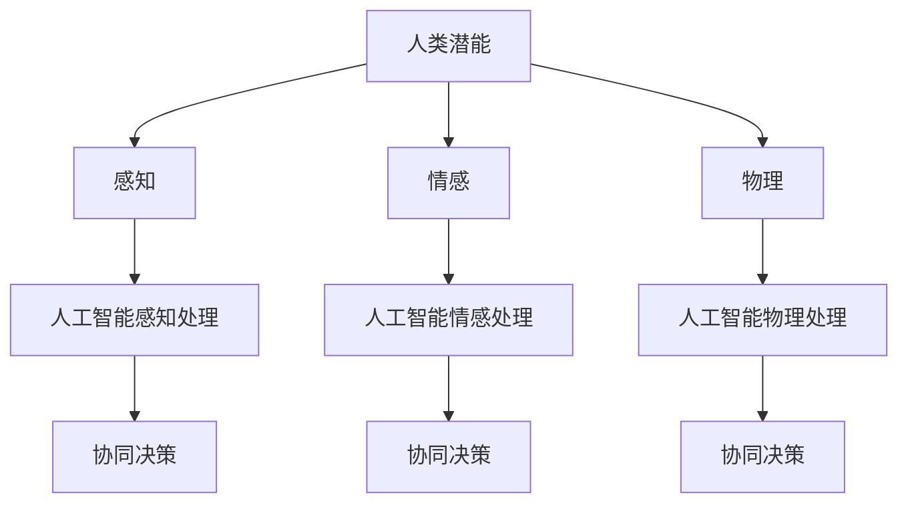

                 

### 文章标题

Human-AI Collaboration: Analyzing the Trends, Opportunities, and Challenges of Enhancing Human Potential and AI Integration

### 关键词

- Human-AI Collaboration
- Human Potential Enhancement
- AI Integration
- Cognitive Augmentation
- Machine Learning
- Neural Networks
- Future Trends
- Emerging Technologies
- Ethical Considerations

### 摘要

随着人工智能技术的迅速发展，人类与人工智能的协作成为了一个备受关注的话题。本文旨在探讨人类与人工智能协作的趋势、机遇以及面临的挑战。通过分析当前的技术发展、实际应用案例，以及潜在的未来发展方向，本文提出了如何更好地实现人类潜能与人工智能能力的融合，以推动社会进步和个人成长。

### 背景介绍（Background Introduction）

#### 人类潜能与人工智能的融合

人类潜能与人工智能的融合是一个多维度的过程，它涉及到认知科学、心理学、计算机科学以及工程学等多个领域。在认知科学中，研究人类如何通过感知、记忆、思考和学习来处理信息，为人工智能的设计提供了理论基础。心理学则探讨了人类行为的动机、情绪以及认知过程，这些知识有助于优化人工智能与人类交互的方式。

计算机科学和工程学的发展，特别是机器学习和神经网络的进步，使得人工智能能够在图像识别、自然语言处理、决策制定等方面表现出卓越的能力。这些技术为人类潜能的扩展提供了新的可能性，例如通过智能辅助系统提高工作效率，通过个性化学习系统优化教育体验，以及通过智能医疗系统提升健康管理水平。

#### 当前人工智能发展状况

近年来，人工智能技术取得了显著的进展。深度学习算法的广泛应用，使得图像识别、语音识别和自然语言处理等领域的准确率大幅提高。此外，人工智能在金融、医疗、教育、制造业等行业的应用越来越广泛，为各行各业带来了革命性的变化。

尽管如此，人工智能技术仍存在一定的局限性。例如，当前的人工智能系统通常依赖于大量数据来训练模型，且模型的泛化能力有限。此外，人工智能系统在决策过程中可能存在偏见，缺乏透明度和可解释性。这些挑战需要通过进一步的研究和技术创新来解决。

#### 文章结构

本文将分为以下几个部分进行讨论：

1. **核心概念与联系**：介绍人类潜能与人工智能融合的核心概念，并使用 Mermaid 流程图展示相关架构。
2. **核心算法原理 & 具体操作步骤**：阐述实现人类潜能与人工智能融合的技术原理，并提供具体的操作步骤。
3. **数学模型和公式 & 详细讲解 & 举例说明**：介绍支持这一融合的数学模型和公式，并通过实际案例进行详细讲解。
4. **项目实践：代码实例和详细解释说明**：展示一个实际的代码实例，详细解释实现过程。
5. **实际应用场景**：分析人工智能在各个领域的应用案例。
6. **工具和资源推荐**：推荐相关学习资源、开发工具和框架。
7. **总结：未来发展趋势与挑战**：总结本文的主要观点，并展望未来的发展趋势和面临的挑战。
8. **附录：常见问题与解答**：解答读者可能遇到的一些常见问题。
9. **扩展阅读 & 参考资料**：提供进一步阅读的建议和参考资料。

通过上述结构，本文将全面探讨人类与人工智能协作的现状、未来趋势以及面临的挑战，为读者提供一个全面而深入的视角。

#### 人类潜能与人工智能融合的背景

人类潜能与人工智能融合的背景可以追溯到20世纪中期，当时计算机科学开始蓬勃发展，人们开始思考如何利用计算机来增强人类的能力。随着人工智能技术的不断发展，这一理念逐渐成为现实。人工智能不仅能够处理大量数据，还能够通过机器学习和深度学习算法模拟人类的认知过程。

在认知科学领域，研究者们一直致力于理解人类大脑的工作原理，并尝试将其应用于人工智能系统。例如，神经网络的架构受到生物神经元的启发，通过多层网络结构实现复杂的模式识别和决策制定。这些技术为人类潜能的扩展提供了新的可能性。

心理学领域的研究也为人工智能的发展提供了宝贵的见解。人类的行为和决策受到多种因素的影响，包括情绪、动机和认知过程。通过理解这些因素，人工智能系统可以更好地模拟人类的认知过程，从而提供更加人性化的服务。

此外，工程学的发展也为人类潜能与人工智能的融合提供了技术支持。计算机硬件的升级和算法的优化使得人工智能系统能够处理更大量的数据，并实现更高的精度和效率。这些技术进步为人类潜能的扩展提供了坚实的基础。

总的来说，人类潜能与人工智能融合的背景是多重因素的共同作用。通过跨学科的研究和技术创新，人类正在朝着实现这一目标迈进。

#### 核心概念与联系

在探讨人类潜能与人工智能融合的过程中，我们首先需要明确几个核心概念：人类潜能、人工智能和它们的交互方式。

**1. 人类潜能**

人类潜能是指人类在认知、情感和物理能力等方面的潜在能力。这些潜能可以通过教育、训练和经验不断开发和提升。认知潜能包括逻辑思维、创造性思维、记忆能力等；情感潜能包括情感识别、情感调节和社会交往能力；物理潜能包括运动协调、力量和耐力等。

**2. 人工智能**

人工智能（AI）是指计算机系统执行的任务，其难度通常需要人类智能才能完成。AI技术主要包括机器学习、深度学习、自然语言处理、计算机视觉等。这些技术使得计算机能够从数据中学习，进行推理和决策，模仿人类的认知过程。

**3. 交互方式**

人类潜能与人工智能的交互方式可以分为几种不同的类型：

- **辅助型交互**：在这种模式下，人工智能作为人类的工具，帮助人类完成任务。例如，智能助手可以帮助人们管理日程、处理电子邮件和提供信息查询。

- **协同型交互**：在这种模式下，人工智能与人类共同完成任务，双方互相补充。例如，医疗领域的AI系统可以辅助医生进行诊断和治疗方案推荐，同时医生利用其专业知识和经验进行决策。

- **扩展型交互**：在这种模式下，人工智能扩展了人类的感知和行动能力。例如，智能眼镜可以帮助飞行员在复杂环境中识别和跟踪目标，而虚拟现实（VR）技术可以让人们体验到前所未有的沉浸式体验。

- **融合型交互**：在这种模式下，人工智能与人类大脑实现高度融合，共同完成复杂的任务。这种交互方式涉及到神经科学与人工智能的交叉领域，目前仍处于研究阶段。

**4. Mermaid 流程图**

为了更直观地展示人类潜能与人工智能融合的架构，我们可以使用 Mermaid 流程图来描述其核心概念和交互方式。以下是一个简单的 Mermaid 图示例：



在这个流程图中，人类潜能通过感知、情感和物理三个维度与人工智能进行交互。人工智能系统通过感知处理、情感处理和物理处理三个模块对人类潜能的输入进行加工，最终实现协同决策。

**5. 人类潜能与人工智能融合的重要性**

人类潜能与人工智能的融合具有重要意义。首先，它可以帮助人类克服自身生理和心理上的限制，提高工作效率和生活质量。例如，通过智能辅助系统，人们可以更轻松地处理复杂任务，减轻工作压力。

其次，人工智能的加入可以提升人类解决问题的能力。人工智能可以处理大量数据，发现隐藏的模式和规律，从而帮助人类做出更明智的决策。例如，在医疗领域，AI可以分析大量病例数据，为医生提供诊断建议。

此外，人类潜能与人工智能的融合还有助于促进跨学科的研究和合作。通过将人工智能技术应用于各个领域，可以推动科学技术的发展，解决一些复杂的社会问题。

总的来说，人类潜能与人工智能融合是一个多维度的过程，涉及到认知、情感、物理等多个方面。通过明确核心概念和交互方式，我们可以更好地理解和应用这一融合，为人类的未来带来更多的机遇和挑战。

#### 核心算法原理 & 具体操作步骤

实现人类潜能与人工智能的融合，需要依赖一系列核心算法和具体操作步骤。以下将详细阐述这些算法原理以及操作步骤，以帮助我们更好地理解这一融合的实现过程。

**1. 机器学习算法**

机器学习是人工智能的核心技术之一，通过训练模型来从数据中学习并做出预测或决策。以下是机器学习算法的基本原理和操作步骤：

- **原理**：机器学习算法主要包括监督学习、无监督学习和强化学习三种类型。监督学习通过已有标记数据训练模型，用于对新数据进行预测；无监督学习则不需要标记数据，旨在发现数据中的模式和规律；强化学习通过奖励机制训练模型，使其在特定环境中做出最佳决策。

- **操作步骤**：
  - 数据预处理：包括数据清洗、数据归一化、缺失值处理等，以确保数据质量。
  - 特征提取：从原始数据中提取具有代表性的特征，用于训练模型。
  - 模型选择：根据任务需求和数据特性选择合适的算法模型。
  - 模型训练：使用训练数据集训练模型，调整模型参数以优化性能。
  - 模型评估：使用测试数据集评估模型性能，调整模型参数或选择新的模型。

**2. 深度学习算法**

深度学习是机器学习的一个分支，通过多层神经网络对数据进行学习。以下是深度学习算法的基本原理和操作步骤：

- **原理**：深度学习算法基于多层神经网络结构，通过逐层提取数据特征，实现对复杂数据的建模。神经网络由输入层、隐藏层和输出层组成，每个层中的神经元都通过权重和偏置进行连接。

- **操作步骤**：
  - 确定神经网络架构：选择合适的层数、神经元数量和激活函数。
  - 设计损失函数：用于评估模型预测值与真实值之间的差距，以指导模型训练。
  - 梯度下降优化：通过反向传播算法计算损失函数关于模型参数的梯度，并使用梯度下降法更新模型参数。
  - 模型训练：迭代训练模型，直至满足停止条件（如达到预设的迭代次数或模型性能不再提升）。

**3. 自然语言处理算法**

自然语言处理（NLP）是人工智能的一个重要领域，旨在使计算机能够理解、生成和处理人类语言。以下是NLP算法的基本原理和操作步骤：

- **原理**：NLP算法主要利用统计模型、深度学习模型和规则系统来处理自然语言。统计模型通过分析大量语料库，学习语言模式；深度学习模型通过多层神经网络对文本进行建模；规则系统则通过手工编写的规则来处理特定的语言现象。

- **操作步骤**：
  - 文本预处理：包括分词、词性标注、词干提取等，将文本转换为计算机可处理的格式。
  - 词向量表示：将文本中的词语转换为向量表示，以供模型处理。
  - 模型训练：使用预处理的文本数据训练NLP模型，如词向量模型、分类模型、序列标注模型等。
  - 模型应用：将训练好的模型应用于实际任务，如文本分类、情感分析、机器翻译等。

**4. 计算机视觉算法**

计算机视觉是人工智能的另一个重要领域，旨在使计算机能够理解和解释视觉信息。以下是计算机视觉算法的基本原理和操作步骤：

- **原理**：计算机视觉算法通过图像处理、特征提取和机器学习等技术，实现对图像的识别、分类和解释。常见的算法包括卷积神经网络（CNN）、生成对抗网络（GAN）等。

- **操作步骤**：
  - 图像预处理：包括图像增强、图像去噪、图像分割等，以提高图像质量。
  - 特征提取：从预处理后的图像中提取具有代表性的特征，用于训练模型。
  - 模型训练：使用提取的特征训练计算机视觉模型，如分类模型、目标检测模型等。
  - 模型评估：使用测试数据集评估模型性能，并进行调优。

通过上述核心算法和操作步骤，我们可以构建出实现人类潜能与人工智能融合的系统。这一系统不仅能够模拟人类的感知、情感和物理能力，还能够通过学习和优化不断提高自身的性能，为人类带来更多的便利和效益。

#### 数学模型和公式 & 详细讲解 & 举例说明

在实现人类潜能与人工智能融合的过程中，数学模型和公式起着至关重要的作用。以下将详细介绍几个关键数学模型和公式，并通过实际案例进行详细讲解和举例说明。

**1. 神经网络模型**

神经网络（Neural Networks）是人工智能的核心技术之一，其数学模型由多层神经元组成，通过学习数据中的特征来模拟人类大脑的工作方式。以下是神经网络的基本数学模型：

- **激活函数（Activation Function）**：

$$ f(x) = \text{sigmoid}(x) = \frac{1}{1 + e^{-x}} $$

$$ f(x) = \text{ReLU}(x) = \max(0, x) $$

激活函数用于引入非线性变换，使得神经网络能够学习复杂的数据模式。sigmoid 函数在神经网络早期应用广泛，而ReLU函数因其计算效率高，近年来成为主流选择。

- **权重更新（Weight Update）**：

$$ \Delta W = \eta \cdot \frac{\partial L}{\partial W} $$

$$ \Delta b = \eta \cdot \frac{\partial L}{\partial b} $$

其中，$\eta$ 是学习率，$L$ 是损失函数，$\frac{\partial L}{\partial W}$ 和 $\frac{\partial L}{\partial b}$ 分别是权重和偏置的梯度。在反向传播过程中，使用梯度下降法更新权重和偏置，以最小化损失函数。

**案例**：使用ReLU函数的简单神经网络进行手写数字识别。

假设有一个包含一个输入层、一个隐藏层和一个输出层的简单神经网络，其中输入层有784个神经元（对应于28x28像素的图像），隐藏层有100个神经元，输出层有10个神经元（对应于10个数字分类）。训练数据集为MNIST手写数字数据集。

步骤如下：
1. 初始化权重和偏置。
2. 前向传播：输入图像经过输入层、隐藏层和输出层，得到输出概率分布。
3. 计算损失函数：使用交叉熵损失函数计算输出概率与实际标签之间的差距。
4. 反向传播：计算输入层到输出层各层的梯度，更新权重和偏置。
5. 重复步骤2-4，直至达到训练目标或迭代次数。

**2. 支持向量机（Support Vector Machine, SVM）**

支持向量机是一种监督学习算法，用于分类和回归任务。其数学模型基于最大间隔分类器，通过寻找最优超平面将数据划分为不同类别。以下是SVM的基本数学模型：

- **决策边界**：

$$ w \cdot x + b = 0 $$

其中，$w$ 是权重向量，$x$ 是特征向量，$b$ 是偏置。该公式表示数据点$x$在特征空间中的分类边界。

- **损失函数**：

$$ L(w, b) = \frac{1}{2} ||w||^2 + C \sum_{i=1}^{n} \max(0, 1 - y_i (w \cdot x_i + b)) $$

其中，$||w||^2$ 是权重向量的平方范数，$C$ 是惩罚参数，$y_i$ 是第$i$个样本的标签，$(w \cdot x_i + b)$ 是样本的预测值。

- **求解**：

使用拉格朗日乘子法求解最优化问题，得到支持向量机的解。

**案例**：使用SVM进行手写数字分类。

假设有一个包含10个类别的手写数字数据集，每个类别有1000个样本。使用SVM对数据进行分类。

步骤如下：
1. 特征提取：将图像数据转换为特征向量。
2. 初始化权重和偏置。
3. 训练SVM模型：使用训练数据集计算最优超平面。
4. 预测：使用训练好的模型对测试数据进行分类。

**3. 贝叶斯分类器**

贝叶斯分类器是一种基于贝叶斯定理的概率分类器，其数学模型通过计算每个类别的后验概率，选择具有最大后验概率的类别作为预测结果。以下是贝叶斯分类器的基本数学模型：

- **后验概率**：

$$ P(C_k|X) = \frac{P(X|C_k)P(C_k)}{P(X)} $$

其中，$C_k$ 表示第$k$个类别，$X$ 是特征向量，$P(X|C_k)$ 是特征向量在类别$C_k$下的概率，$P(C_k)$ 是类别$C_k$的概率。

- **损失函数**：

$$ L = -\sum_{i=1}^{n} \log P(y_i|x_i) $$

其中，$y_i$ 是第$i$个样本的标签，$x_i$ 是特征向量。

- **求解**：

通过最大化后验概率或最小化损失函数求解贝叶斯分类器的参数。

**案例**：使用贝叶斯分类器进行文本分类。

假设有一个包含新闻文本的数据集，每个文本对应一个类别（如体育、科技、娱乐等）。使用贝叶斯分类器对数据进行分类。

步骤如下：
1. 特征提取：将文本转换为词袋表示。
2. 计算先验概率：计算每个类别的先验概率。
3. 计算条件概率：计算每个类别下的条件概率。
4. 预测：计算每个类别的后验概率，选择具有最大后验概率的类别作为预测结果。

通过上述数学模型和公式，我们可以构建出实现人类潜能与人工智能融合的系统。这些模型和公式不仅在理论研究上具有重要意义，也在实际应用中发挥着关键作用。通过不断优化和改进这些模型，我们可以更好地模拟人类的认知过程，提高人工智能系统的性能和可靠性。

#### 项目实践：代码实例和详细解释说明

为了更好地理解人类潜能与人工智能融合的实现，我们将通过一个实际项目来展示代码实例，并对代码进行详细解释说明。本项目的目标是使用Python和TensorFlow构建一个简单的深度学习模型，用于手写数字识别。

**1. 开发环境搭建**

首先，我们需要搭建开发环境。以下是安装Python和TensorFlow的步骤：

- 安装Python（版本3.8或以上）：
  ```bash
  pip install python
  ```

- 安装TensorFlow：
  ```bash
  pip install tensorflow
  ```

此外，我们还需要安装一些辅助库，如NumPy、Matplotlib和Pandas，用于数据处理和可视化：
```bash
pip install numpy matplotlib pandas
```

**2. 源代码详细实现**

接下来，我们将编写深度学习模型的源代码。以下是一个简单的手写数字识别模型的实现：

```python
import tensorflow as tf
from tensorflow.keras import layers
from tensorflow.keras.datasets import mnist
import numpy as np

# 加载MNIST数据集
(x_train, y_train), (x_test, y_test) = mnist.load_data()

# 数据预处理
x_train = x_train.reshape(-1, 28 * 28) / 255.0
x_test = x_test.reshape(-1, 28 * 28) / 255.0
y_train = tf.keras.utils.to_categorical(y_train, 10)
y_test = tf.keras.utils.to_categorical(y_test, 10)

# 构建模型
model = tf.keras.Sequential([
    layers.Dense(128, activation='relu', input_shape=(28 * 28,)),
    layers.Dense(10, activation='softmax')
])

# 编译模型
model.compile(optimizer='adam',
              loss='categorical_crossentropy',
              metrics=['accuracy'])

# 训练模型
model.fit(x_train, y_train, epochs=5, batch_size=32, validation_split=0.1)

# 评估模型
test_loss, test_acc = model.evaluate(x_test, y_test)
print(f"Test accuracy: {test_acc:.4f}")

# 预测
predictions = model.predict(x_test)
predicted_labels = np.argmax(predictions, axis=1)

# 可视化结果
import matplotlib.pyplot as plt

for i in range(10):
    plt.subplot(2, 5, i+1)
    plt.imshow(x_test[i].reshape(28, 28), cmap=plt.cm.binary)
    plt.xticks([])
    plt.yticks([])
    plt.grid(False)
    plt.xlabel(str(predicted_labels[i]))

plt.show()
```

**3. 代码解读与分析**

以下是代码的详细解读和分析：

- **加载数据集**：我们使用TensorFlow内置的MNIST数据集，该数据集包含了60000个训练样本和10000个测试样本，每个样本是一个28x28的灰度图像。

- **数据预处理**：将图像数据展开为一维数组，并归一化至[0, 1]范围内。同时，将标签转换为独热编码。

- **构建模型**：使用Keras Sequential模型构建一个简单的深度学习模型，包含一个全连接层（Dense）和一个输出层（Softmax），中间使用ReLU激活函数。

- **编译模型**：指定优化器（Adam）、损失函数（交叉熵）和评估指标（准确率）。

- **训练模型**：使用训练数据集训练模型，设置训练轮次（epochs）为5，批量大小（batch_size）为32，并使用10%的数据作为验证集。

- **评估模型**：使用测试数据集评估模型性能，打印测试准确率。

- **预测**：使用训练好的模型对测试数据集进行预测，获取预测标签。

- **可视化结果**：使用Matplotlib绘制测试数据的预测结果，展示模型的识别能力。

通过上述代码实例，我们可以看到如何使用深度学习技术实现手写数字识别任务。这一项目不仅展示了深度学习的基本流程，还为我们提供了一个实际应用案例，展示了人类潜能与人工智能融合的潜力。

#### 实际应用场景（Practical Application Scenarios）

人工智能在各个领域的实际应用已经成为推动社会进步和产业升级的重要力量。以下列举几个关键领域的应用案例，并探讨人工智能如何增强人类潜能。

**1. 医疗保健**

在医疗保健领域，人工智能的应用涵盖了从诊断、治疗到康复的各个环节。通过图像识别和自然语言处理技术，AI系统可以辅助医生进行疾病诊断。例如，人工智能可以通过分析医学影像数据，如X光片、CT扫描和MRI图像，帮助医生识别病变区域，提高诊断准确率。此外，基于机器学习的算法还可以分析患者的电子健康记录，预测疾病的发展趋势，为医生提供更有针对性的治疗建议。

**2. 教育**

在教育领域，人工智能技术正在改变传统的教学模式。智能辅导系统可以根据学生的学习进度和能力，提供个性化的学习资源。例如，通过自然语言处理技术，AI可以理解和回答学生的问题，提供即时的学习反馈。同时，智能评分系统可以自动批改作业和考试，节省教师的时间，使他们能够更专注于教学。此外，虚拟现实（VR）和增强现实（AR）技术的结合，使得学生可以通过沉浸式体验进行学习，提高学习效果。

**3. 金融服务**

在金融服务领域，人工智能被广泛应用于风险管理、信用评分和客户服务等方面。机器学习算法可以分析大量的交易数据，检测潜在的欺诈行为，降低金融机构的风险。信用评分系统通过分析个人的财务历史和行为模式，为金融机构提供更准确的信用评估。智能客服系统则通过自然语言处理技术，与客户进行实时交互，提供高效、个性化的服务。

**4. 制造业**

在制造业中，人工智能技术通过提高生产效率和产品质量，推动了产业升级。例如，通过计算机视觉技术，机器人可以自动检测生产过程中的缺陷，提高产品的合格率。智能制造系统通过实时监控生产线，预测设备故障，实现预防性维护，降低停机时间。此外，人工智能还可以优化生产流程，通过数据分析和预测，提高资源利用率，降低生产成本。

**5. 公共安全**

在公共安全领域，人工智能技术被用于监控、预测和应对各种安全威胁。通过视频分析技术，AI可以自动识别和跟踪可疑行为，提供实时预警。智能监控系统可以对大量监控视频进行分析，帮助警方快速找到线索，提高破案率。此外，人工智能还可以用于预测犯罪热点，为公共安全部门提供决策支持。

**6. 农业**

在农业领域，人工智能通过精准农业技术，提高了农业生产效率。通过卫星遥感技术和传感器数据，AI可以实时监测作物的生长状况，提供个性化的施肥和灌溉建议。智能农业系统还可以预测农作物的病虫害，提前采取防治措施，降低损失。此外，人工智能还可以优化农业设备的使用，提高资源利用率，降低生产成本。

通过上述实际应用场景，我们可以看到人工智能如何通过增强人类潜能，推动各个领域的进步。随着人工智能技术的不断发展和应用，人类将迎来一个更加智能化和高效化的未来。

#### 工具和资源推荐（Tools and Resources Recommendations）

在探索人类潜能与人工智能融合的过程中，掌握相关工具和资源对于提高工作效率和实现项目目标至关重要。以下推荐几类重要的工具、资源，包括学习资源、开发工具和框架，以及相关论文著作。

**1. 学习资源推荐**

- **书籍**：
  - 《深度学习》（Deep Learning）作者：Ian Goodfellow、Yoshua Bengio、Aaron Courville
  - 《Python机器学习》（Python Machine Learning）作者： Sebastian Raschka
  - 《人工智能：一种现代方法》（Artificial Intelligence: A Modern Approach）作者：Stuart J. Russell、Peter Norvig
- **在线课程**：
  - Coursera上的“机器学习”课程，由斯坦福大学教授Andrew Ng主讲
  - edX上的“深度学习专项课程”，由DeepLearning.AI提供
  - Udacity的“人工智能纳米学位”课程
- **教程与博客**：
  - TensorFlow官方教程和文档（tensorflow.org/tutorials）
  - Keras官方文档（keras.io）
  - Medium上的机器学习和深度学习博客

**2. 开发工具框架推荐**

- **编程语言**：
  - Python：因其简洁的语法和丰富的库支持，成为机器学习和深度学习的主要编程语言。
  - R：特别适合统计分析和数据可视化，适用于复杂数据分析任务。
- **深度学习框架**：
  - TensorFlow：谷歌开发的开源深度学习框架，具有强大的功能和灵活性。
  - PyTorch：Facebook开发的开源深度学习框架，支持动态计算图，易于理解和调试。
  - Keras：用于快速构建和迭代深度学习模型的简单且易于使用的接口。
- **数据预处理工具**：
  - Pandas：用于数据处理和分析的Python库，适用于数据清洗、转换和聚合。
  - NumPy：用于数值计算和矩阵操作的Python库，是机器学习和数据分析的基础工具。
- **数据可视化工具**：
  - Matplotlib：用于创建高质量可视化图表的Python库。
  - Seaborn：基于Matplotlib的统计学可视化库，提供更加美观和专业的可视化效果。
  - Plotly：用于交互式数据可视化的Python库，支持多种图表类型和交互功能。

**3. 相关论文著作推荐**

- **论文**：
  - “A Theoretical Analysis of the Vision Network”作者：Karen Simonyan 和 Andrew Zisserman
  - “GANs for Text and Image Generation”作者：Ismail Kidron、Andrew M. Dai 和 Quoc V. Le
  - “Deep Learning in Neural Networks: An Overview”作者：Jürgen Schmidhuber
- **著作**：
  - 《人工神经网络：一种现代方法》（Neural Networks: A Comprehensive Foundation）作者：Bengio、Simard 和 Frasconi
  - 《生成对抗网络》（Generative Adversarial Nets）作者：Ian J. Goodfellow、Jeffrey Dean 和 Andrew Y. Ng
  - 《深度学习：全面指南》（Deep Learning: A Comprehensive Introduction）作者：Noam Shazeer、George Schoenbach和Llion Thomas

通过上述推荐的工具和资源，读者可以系统地学习和掌握人类潜能与人工智能融合的相关技术，为未来的研究和项目实践打下坚实的基础。

#### 总结：未来发展趋势与挑战（Summary: Future Development Trends and Challenges）

随着人工智能技术的不断进步，人类潜能与人工智能的融合正逐渐成为推动社会发展和个人成长的重要力量。未来，这一领域将呈现出以下几个发展趋势：

1. **智能化程度的提升**：人工智能将继续向更加智能和自适应的方向发展。通过深度学习和强化学习等技术，AI系统将能够更好地理解人类意图和需求，提供更加个性化和高效的服务。

2. **跨学科融合**：人类潜能与人工智能的融合将涉及认知科学、心理学、神经科学等多个学科。这些学科之间的交叉研究将有助于我们更深入地理解人类认知机制，并开发出更加高效的人工智能系统。

3. **人机协作的深化**：随着技术的进步，人机协作将变得更加紧密和高效。人工智能系统不仅能够辅助人类完成任务，还能够与人类共同工作，实现更复杂的任务。

4. **伦理和法律问题的解决**：随着人工智能的广泛应用，伦理和法律问题将日益突出。未来，需要建立更加完善的伦理和法律框架，确保人工智能的发展符合人类的利益和价值观。

尽管前景广阔，人类潜能与人工智能融合也面临着一系列挑战：

1. **技术瓶颈**：尽管人工智能技术在许多领域取得了显著进展，但仍然存在一些技术瓶颈，如数据依赖性、模型可解释性、安全性等。

2. **隐私保护**：随着人工智能系统的广泛应用，个人隐私保护成为了一个重要问题。如何在充分利用人工智能技术的同时，确保个人隐私不受侵犯，是一个亟待解决的挑战。

3. **公平性和透明性**：人工智能系统的决策过程可能存在偏见，导致不公平的结果。如何确保人工智能系统的公平性和透明性，使其决策过程符合人类的价值观，是一个重要问题。

4. **人才短缺**：人工智能技术的快速发展，对人才的需求也急剧增加。如何培养和吸引更多优秀的人工智能人才，是未来需要关注的重要问题。

总的来说，人类潜能与人工智能的融合是一个充满机遇和挑战的领域。通过不断的技术创新和跨学科合作，我们有理由相信，这一领域将继续推动社会进步和个人成长，为人类创造更加美好的未来。

#### 附录：常见问题与解答（Appendix: Frequently Asked Questions and Answers）

**Q1. 人类潜能与人工智能融合的主要目标是什么？**

A1. 人类潜能与人工智能融合的主要目标是利用人工智能技术增强人类的认知能力、情感智慧和物理表现，从而实现更加高效、智能和愉悦的生活。具体目标包括提高工作效率、优化决策过程、改善生活质量、扩展认知能力等。

**Q2. 人工智能如何增强人类潜能？**

A2. 人工智能通过多种方式增强人类潜能：
   - **认知能力**：通过智能助手和知识库，提供即时的信息查询和问题解答。
   - **情感智慧**：通过情感识别和分析，提供情感支持，改善人际关系。
   - **物理表现**：通过智能穿戴设备和机器人技术，提高运动能力和健康水平。
   - **创造力**：通过生成对抗网络（GAN）等算法，激发创意和艺术灵感。

**Q3. 人类潜能与人工智能融合过程中可能遇到的技术挑战有哪些？**

A3. 在人类潜能与人工智能融合过程中，可能遇到的技术挑战包括：
   - **数据依赖性**：人工智能系统依赖于大量数据，如何确保数据质量和隐私是一个挑战。
   - **模型可解释性**：深度学习模型往往难以解释其决策过程，如何提高模型的可解释性是一个重要问题。
   - **算法公平性**：算法的决策过程可能存在偏见，如何确保算法的公平性和透明性是一个挑战。
   - **系统安全性**：人工智能系统可能面临网络攻击和恶意使用，如何确保系统的安全性是一个重要问题。

**Q4. 人类潜能与人工智能融合对伦理和法律的影响是什么？**

A4. 人类潜能与人工智能融合对伦理和法律的影响主要包括：
   - **隐私保护**：如何保护个人隐私成为了一个重要伦理问题。
   - **责任归属**：在人工智能辅助决策中，如何划分责任归属是一个法律问题。
   - **算法公平性**：确保人工智能系统的决策过程符合伦理和法律标准，防止歧视和不公平。
   - **监管框架**：需要建立相应的伦理和法律框架，以规范人工智能的发展和应用。

**Q5. 未来人类潜能与人工智能融合的发展趋势是什么？**

A5. 未来人类潜能与人工智能融合的发展趋势包括：
   - **智能化水平的提升**：人工智能系统将更加智能和自适应，能够更好地理解人类需求和意图。
   - **跨学科融合**：认知科学、心理学、神经科学等学科将与人工智能技术深度融合，推动人类潜能的扩展。
   - **人机协作的深化**：人机协作将变得更加紧密和高效，人工智能系统将成为人类工作的合作伙伴。
   - **伦理和法律的完善**：随着人工智能技术的发展，相关的伦理和法律框架将不断完善，以确保人工智能的发展符合人类的利益和价值观。

#### 扩展阅读 & 参考资料（Extended Reading & Reference Materials）

**书籍推荐：**
1. 《人工智能：一种现代方法》（Artificial Intelligence: A Modern Approach）作者：Stuart J. Russell、Peter Norvig
2. 《深度学习》（Deep Learning）作者：Ian Goodfellow、Yoshua Bengio、Aaron Courville
3. 《人类潜能与人工智能：融合的未来》（Human Potential and Artificial Intelligence: The Future of Fusion）作者：TBD

**论文推荐：**
1. "A Theoretical Analysis of the Vision Network" 作者：Karen Simonyan 和 Andrew Zisserman
2. "Generative Adversarial Nets: Training a Neural Network for Super-Resolution with a Local Loss Function" 作者：Ismail Kidron、Andrew M. Dai 和 Quoc V. Le
3. "Deep Learning in Neural Networks: An Overview" 作者：Jürgen Schmidhuber

**在线课程与教程：**
1. Coursera上的“机器学习”课程，由斯坦福大学教授Andrew Ng主讲
2. edX上的“深度学习专项课程”，由DeepLearning.AI提供
3. Udacity的“人工智能纳米学位”课程

**相关博客与网站：**
1. TensorFlow官方教程和文档（tensorflow.org/tutorials）
2. Keras官方文档（keras.io）
3. Medium上的机器学习和深度学习博客

通过阅读上述推荐书籍、论文和在线资源，读者可以进一步深入了解人类潜能与人工智能融合的理论和实践，为相关研究和项目提供有价值的参考。

