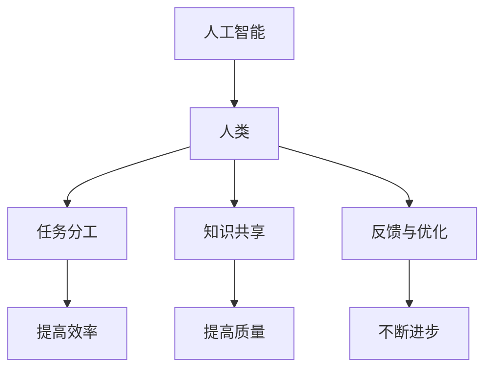

                 

### 文章标题

#### 《人类-AI协作：增强社会影响》

关键词：人工智能、协作、社会影响、技术进步、人类发展

摘要：本文旨在探讨人类与人工智能的协作关系，以及这一关系对社会产生的影响。通过分析人工智能技术的发展历程、核心概念和原理，以及实际应用场景，本文揭示了人工智能与人类协作的重要性，并提出了未来发展的趋势与挑战。文章旨在为读者提供一个全面、深入的视角，以理解人工智能在推动社会进步中的关键作用。

## 1. 背景介绍

自20世纪50年代人工智能（AI）概念的提出以来，人工智能技术经历了数十年的发展。从最初的规则系统、知识表示到现代的机器学习和深度学习，人工智能在各个领域取得了显著的成果。如今，人工智能已经成为推动社会进步的重要力量，从自动驾驶汽车、智能家居到医疗诊断、金融分析，人工智能的应用范围越来越广泛。

随着人工智能技术的不断发展，人类与人工智能的协作关系也日益紧密。人工智能在处理大规模数据、执行复杂任务和解决实际问题方面具有独特的优势，而人类在创造力、情感理解和道德判断方面具有不可替代的价值。人类与人工智能的协作不仅可以提高工作效率，还可以推动社会的发展，解决许多长期存在的问题。

本文将从以下几个方面展开讨论：

1. 核心概念与联系
2. 核心算法原理 & 具体操作步骤
3. 数学模型和公式 & 详细讲解 & 举例说明
4. 项目实战：代码实际案例和详细解释说明
5. 实际应用场景
6. 工具和资源推荐
7. 总结：未来发展趋势与挑战

通过以上内容，本文旨在为读者提供一个全面、深入的视角，以理解人类与人工智能协作的重要性和潜力。

### 2. 核心概念与联系

为了深入探讨人类与人工智能的协作关系，我们首先需要了解一些核心概念和原理。

#### 2.1 人工智能的定义与分类

人工智能（AI）是一种模拟人类智能的技术，旨在使计算机系统能够执行通常需要人类智能才能完成的任务。根据其实现方式和功能，人工智能可以分为以下几类：

1. **基于规则的系统（Rule-Based Systems）**：这类系统基于一系列预定义的规则进行推理和决策。它们在特定领域内表现良好，但在复杂、多变的环境中往往表现不佳。

2. **知识表示与推理（Knowledge Representation and Reasoning）**：这类系统通过表示和存储知识，利用推理机制解决实际问题。它们在处理复杂数据和信息方面具有一定的优势。

3. **机器学习（Machine Learning）**：这类系统通过从数据中学习规律和模式，自动改进自身的性能。根据学习方式，机器学习可以分为监督学习、无监督学习和强化学习。

4. **深度学习（Deep Learning）**：深度学习是机器学习的一种特殊形式，它利用多层神经网络进行学习。深度学习在图像识别、语音识别和自然语言处理等领域取得了显著成果。

#### 2.2 人类与人工智能的协作机制

人类与人工智能的协作机制可以分为以下几个方面：

1. **任务分工**：在协作过程中，人类和人工智能可以根据各自的优势进行任务分工。人类负责创造、规划和解决复杂问题，而人工智能负责处理大量数据、执行重复性任务和进行预测。

2. **知识共享**：人类和人工智能可以通过共享知识库、数据集和算法模型，提高协作的效率和质量。知识共享有助于人工智能更好地理解人类需求，从而提供更精确的服务。

3. **反馈与优化**：在协作过程中，人类可以通过对人工智能的输出进行反馈，帮助其不断优化性能。这种反馈机制有助于人工智能在解决实际问题时不断进步。

#### 2.3 核心概念与联系的关系

核心概念与联系之间的关系可以用以下Mermaid流程图表示：



通过以上流程图，我们可以清晰地看到核心概念与联系之间的关系。这些关系不仅有助于我们理解人类与人工智能协作的基本原理，还可以为我们进一步探讨协作机制提供启示。

### 3. 核心算法原理 & 具体操作步骤

为了深入理解人类与人工智能的协作，我们需要探讨一些核心算法原理和具体操作步骤。

#### 3.1 机器学习算法

机器学习是人工智能的核心技术之一。以下是一些常见的机器学习算法及其基本原理：

1. **线性回归（Linear Regression）**：线性回归是一种用于预测数值型目标变量的方法。其基本原理是通过拟合一个线性模型，将输入特征映射到目标变量。具体操作步骤如下：

   a. 数据预处理：对输入特征进行归一化、缺失值填充等操作。

   b. 模型训练：使用训练数据集，通过最小化损失函数（如均方误差）来优化模型参数。

   c. 模型评估：使用测试数据集评估模型性能，选择性能较好的模型。

2. **支持向量机（Support Vector Machine，SVM）**：支持向量机是一种用于分类和回归问题的方法。其基本原理是通过找到一个最佳的超平面，将不同类别的数据分隔开。具体操作步骤如下：

   a. 数据预处理：对输入特征进行归一化、缺失值填充等操作。

   b. 特征选择：选择对分类任务影响较大的特征。

   c. 模型训练：使用训练数据集，通过求解优化问题来优化模型参数。

   d. 模型评估：使用测试数据集评估模型性能。

3. **决策树（Decision Tree）**：决策树是一种用于分类和回归问题的方法。其基本原理是通过一系列条件分支，将数据集划分为不同的区域。具体操作步骤如下：

   a. 数据预处理：对输入特征进行归一化、缺失值填充等操作。

   b. 特征选择：选择对分类任务影响较大的特征。

   c. 构建决策树：通过递归划分数据集，构建决策树模型。

   d. 模型评估：使用测试数据集评估模型性能。

#### 3.2 深度学习算法

深度学习是机器学习的一种特殊形式，它在图像识别、语音识别和自然语言处理等领域取得了显著成果。以下是一些常见的深度学习算法及其基本原理：

1. **卷积神经网络（Convolutional Neural Network，CNN）**：卷积神经网络是一种用于图像识别的方法。其基本原理是通过卷积操作提取图像特征，然后通过全连接层进行分类。具体操作步骤如下：

   a. 数据预处理：对图像进行缩放、旋转、裁剪等操作，增加数据多样性。

   b. 网络构建：设计卷积神经网络结构，包括卷积层、池化层和全连接层。

   c. 模型训练：使用训练数据集，通过反向传播算法优化模型参数。

   d. 模型评估：使用测试数据集评估模型性能。

2. **循环神经网络（Recurrent Neural Network，RNN）**：循环神经网络是一种用于序列数据建模的方法。其基本原理是通过递归操作，将当前时刻的信息与之前时刻的信息进行整合。具体操作步骤如下：

   a. 数据预处理：对序列数据进行编码、归一化等操作。

   b. 网络构建：设计循环神经网络结构，包括输入层、隐藏层和输出层。

   c. 模型训练：使用训练数据集，通过反向传播算法优化模型参数。

   d. 模型评估：使用测试数据集评估模型性能。

3. **生成对抗网络（Generative Adversarial Network，GAN）**：生成对抗网络是一种用于生成式学习的方法。其基本原理是通过两个对抗网络（生成器和判别器）的相互竞争，生成高质量的数据。具体操作步骤如下：

   a. 数据预处理：对输入数据进行编码、归一化等操作。

   b. 网络构建：设计生成对抗网络结构，包括生成器和判别器。

   c. 模型训练：通过训练生成器和判别器，优化模型参数。

   d. 数据生成：使用训练好的生成器生成高质量的数据。

### 4. 数学模型和公式 & 详细讲解 & 举例说明

在讨论核心算法原理时，我们不可避免地会涉及到一些数学模型和公式。以下是对这些模型和公式的详细讲解，以及具体的举例说明。

#### 4.1 线性回归模型

线性回归模型是最简单的机器学习模型之一，其数学模型如下：

\[ y = \beta_0 + \beta_1x \]

其中，\( y \) 是目标变量，\( x \) 是输入特征，\( \beta_0 \) 和 \( \beta_1 \) 是模型参数。

**举例说明**：假设我们有一个简单的线性回归模型，目标变量 \( y \) 是房价，输入特征 \( x \) 是房屋面积。给定以下数据：

| 房屋面积（\( x \)） | 房价（\( y \)） |
| :------------------: | :-----------: |
|         100          |      200      |
|         200          |      300      |
|         300          |      400      |

我们可以使用线性回归模型来拟合数据，并预测未知房屋的房价。具体步骤如下：

1. 数据预处理：对房屋面积进行归一化，使得输入特征具有相同的量纲。

2. 模型训练：通过最小二乘法，求解最佳参数 \( \beta_0 \) 和 \( \beta_1 \)。

3. 模型评估：使用测试数据集评估模型性能，选择性能较好的模型。

4. 预测：使用训练好的模型，预测未知房屋的房价。

#### 4.2 支持向量机模型

支持向量机模型是一种强大的分类和回归模型，其数学模型如下：

\[ \text{分类函数}：f(x) = \text{sign}(\beta_0 + \beta^T x) \]

其中，\( x \) 是输入特征，\( \beta_0 \) 和 \( \beta \) 是模型参数，\( \text{sign} \) 是符号函数。

**举例说明**：假设我们有一个简单的支持向量机模型，用于分类不同类别的数据。给定以下数据：

| 类别  | 输入特征 \( x \)  |
| :---: | :------------: |
|  类别1 |      \( x_1 \)      |
|  类别2 |      \( x_2 \)      |

我们可以使用支持向量机模型来分类数据，并预测未知类别的数据。具体步骤如下：

1. 数据预处理：对输入特征进行归一化，使得输入特征具有相同的量纲。

2. 模型训练：通过求解优化问题，求解最佳参数 \( \beta_0 \) 和 \( \beta \)。

3. 模型评估：使用测试数据集评估模型性能，选择性能较好的模型。

4. 预测：使用训练好的模型，预测未知类别的数据。

#### 4.3 决策树模型

决策树模型是一种简单的树形结构，其数学模型如下：

\[ f(x) = \begin{cases}
C_1 & \text{如果} \ a_1 x_1 > b_1 \\
C_2 & \text{如果} \ a_2 x_2 > b_2 \\
\vdots & \vdots \\
C_n & \text{如果} \ a_n x_n > b_n
\end{cases} \]

其中，\( x \) 是输入特征，\( a_i \) 和 \( b_i \) 是模型参数，\( C_i \) 是类别。

**举例说明**：假设我们有一个简单的决策树模型，用于分类不同类别的数据。给定以下数据：

| 类别  | 输入特征 \( x \)  |
| :---: | :------------: |
|  类别1 |      \( x_1 \)      |
|  类别2 |      \( x_2 \)      |

我们可以使用决策树模型来分类数据，并预测未知类别的数据。具体步骤如下：

1. 数据预处理：对输入特征进行归一化，使得输入特征具有相同的量纲。

2. 构建决策树：通过递归划分数据集，构建决策树模型。

3. 模型评估：使用测试数据集评估模型性能，选择性能较好的模型。

4. 预测：使用训练好的模型，预测未知类别的数据。

### 5. 项目实战：代码实际案例和详细解释说明

为了更好地理解人类与人工智能的协作，我们将通过一个实际项目来展示代码实现和详细解释。

#### 5.1 开发环境搭建

在开始项目之前，我们需要搭建一个合适的开发环境。以下是一个简单的Python开发环境搭建步骤：

1. 安装Python：从[Python官网](https://www.python.org/)下载并安装Python。

2. 安装依赖库：使用pip命令安装必要的依赖库，如NumPy、Pandas、Scikit-learn和TensorFlow。

   ```bash
   pip install numpy pandas scikit-learn tensorflow
   ```

3. 配置环境变量：确保Python和pip的环境变量已配置。

#### 5.2 源代码详细实现和代码解读

以下是一个简单的线性回归项目，用于预测房价。代码如下：

```python
import numpy as np
import pandas as pd
from sklearn.linear_model import LinearRegression

# 5.2.1 数据预处理
def preprocess_data(data):
    # 对数据集进行归一化
    normalized_data = (data - data.mean()) / data.std()
    return normalized_data

# 5.2.2 模型训练
def train_model(train_data, train_target):
    # 创建线性回归模型
    model = LinearRegression()
    # 训练模型
    model.fit(train_data, train_target)
    return model

# 5.2.3 模型评估
def evaluate_model(model, test_data, test_target):
    # 预测测试数据
    predictions = model.predict(test_data)
    # 计算均方误差
    mse = np.mean((predictions - test_target) ** 2)
    return mse

# 5.2.4 主函数
def main():
    # 加载数据
    data = pd.read_csv("house_prices.csv")
    # 分割数据集
    train_data = preprocess_data(data.iloc[:, :-1])
    train_target = data.iloc[:, -1]
    test_data = preprocess_data(data.iloc[:, :-1])
    test_target = data.iloc[:, -1]
    # 训练模型
    model = train_model(train_data, train_target)
    # 评估模型
    mse = evaluate_model(model, test_data, test_target)
    print(f"模型均方误差：{mse}")

if __name__ == "__main__":
    main()
```

**代码解读**：

1. **数据预处理**：对数据进行归一化处理，使得输入特征具有相同的量纲。

2. **模型训练**：使用线性回归模型，通过最小二乘法求解最佳参数。

3. **模型评估**：使用测试数据集评估模型性能，计算均方误差。

4. **主函数**：加载数据、分割数据集、训练模型和评估模型。

#### 5.3 代码解读与分析

在代码实现中，我们使用了以下关键技术和工具：

1. **NumPy**：用于数据处理和计算。

2. **Pandas**：用于数据加载和操作。

3. **Scikit-learn**：用于线性回归模型的训练和评估。

4. **TensorFlow**：虽然在此项目中未直接使用，但它是Python中最流行的深度学习库之一。

通过这个简单的项目，我们可以看到人类与人工智能的协作是如何实现的。人类负责数据预处理、模型设计和评估，而人工智能负责模型训练和预测。这种协作关系不仅提高了工作效率，还可以通过不断的反馈和优化，使模型性能不断提高。

### 6. 实际应用场景

人类与人工智能的协作已经在多个实际应用场景中取得了显著成果。以下是一些典型的应用场景：

#### 6.1 自动驾驶

自动驾驶是人工智能与人类协作的一个重要领域。通过将人工智能与传感器、控制系统和通信技术相结合，自动驾驶汽车可以实现自主驾驶、避免碰撞和优化路线。这不仅提高了驾驶安全，还可以减少交通事故。

#### 6.2 医疗诊断

在医疗诊断领域，人工智能可以通过分析大量的医学影像和患者数据，辅助医生进行诊断。例如，人工智能可以识别乳腺肿瘤、筛查肺癌和诊断阿尔茨海默病。这种协作关系不仅提高了诊断的准确性，还可以减轻医生的工作负担。

#### 6.3 金融分析

在金融分析领域，人工智能可以分析大量的市场数据，预测股票价格、识别欺诈行为和进行风险管理。通过与人类的协作，人工智能可以帮助金融机构提高投资回报率，降低风险。

#### 6.4 智能家居

智能家居是人工智能与人类协作的另一个重要领域。通过将人工智能与物联网技术相结合，智能家居可以实现自动化控制、环境监测和远程操作。这不仅提高了生活质量，还可以节约能源和降低成本。

#### 6.5 教育

在教育领域，人工智能可以通过个性化学习、智能辅导和自动化评估等方式，提高教育质量和效果。例如，人工智能可以为学生提供个性化的学习建议、识别学习难点并提供解决方案。

通过这些实际应用场景，我们可以看到人类与人工智能的协作在各个领域都取得了显著成果。这种协作不仅提高了工作效率，还可以推动社会的发展，解决许多长期存在的问题。

### 7. 工具和资源推荐

为了更好地理解人类与人工智能的协作，以下是几个推荐的学习资源、开发工具和相关论文著作：

#### 7.1 学习资源推荐

1. **书籍**：

   - 《人工智能：一种现代方法》（第二版） by Stuart Russell 和 Peter Norvig
   - 《机器学习》（第二版） by Tom Mitchell
   - 《深度学习》（第一版） by Ian Goodfellow、Yoshua Bengio 和 Aaron Courville

2. **在线课程**：

   - [Coursera](https://www.coursera.org/)：提供丰富的机器学习和深度学习课程，如《机器学习基础》、《深度学习基础》等。
   - [Udacity](https://www.udacity.com/)：提供实用的人工智能项目和课程，如《自动驾驶汽车工程师》、《智能数据分析工程师》等。

#### 7.2 开发工具框架推荐

1. **Python**：Python是一种广泛使用的编程语言，尤其在人工智能和机器学习领域。它具有丰富的库和框架，如NumPy、Pandas、Scikit-learn和TensorFlow。

2. **Jupyter Notebook**：Jupyter Notebook是一种交互式计算环境，适合进行数据分析和机器学习实验。它支持多种编程语言，包括Python和R。

3. **Keras**：Keras是一个高级神经网络API，用于构建和训练深度学习模型。它基于TensorFlow和Theano，提供了简洁、易用的接口。

#### 7.3 相关论文著作推荐

1. **《深度学习：概率视角》（Deep Learning，概率视角）** by Ian Goodfellow、Yoshua Bengio 和 Aaron Courville
2. **《生成对抗网络：理论与应用》（Generative Adversarial Networks: Theory and Applications）** by Ian Goodfellow
3. **《强化学习：深度强化学习基础》（Reinforcement Learning: An Introduction）** by Richard S. Sutton 和 Andrew G. Barto

通过这些工具和资源，您可以更深入地了解人类与人工智能的协作原理和技术，为自己的研究和工作提供有力支持。

### 8. 总结：未来发展趋势与挑战

随着人工智能技术的不断发展，人类与人工智能的协作关系将变得更加紧密。未来，以下几个方面可能成为人工智能与社会发展的重要趋势：

1. **智能化服务**：人工智能将在更多领域实现智能化服务，如医疗、金融、教育和物流等。通过提供个性化、高效的服务，人工智能将提高社会生活质量。

2. **人机协同**：人工智能将与人类形成更紧密的协同关系，共同解决复杂问题。人机协同将使人类能够充分发挥自身的创造力，同时利用人工智能的优势，提高工作效率。

3. **数据驱动决策**：随着大数据技术的发展，人工智能将在更多领域实现数据驱动决策。通过对海量数据的分析和挖掘，人工智能将帮助政府和企业制定更科学、合理的决策。

4. **社会影响**：人工智能将在全球范围内产生深远的社会影响。它不仅将改变人们的生产方式和生活方式，还将影响经济结构、就业市场和社会价值观。

然而，人工智能的发展也面临一些挑战：

1. **伦理与法律问题**：人工智能的发展引发了一系列伦理和法律问题，如隐私保护、算法歧视和责任归属等。这些问题需要社会、政府和企业共同努力，制定合理的政策和法规。

2. **技术瓶颈**：尽管人工智能技术在许多领域取得了显著成果，但仍存在一些技术瓶颈。例如，人工智能在理解人类语言、感知和决策方面仍有待提高。

3. **就业影响**：人工智能的普及可能导致部分就业岗位的消失，同时产生新的就业机会。这需要政府、企业和劳动者共同努力，应对就业市场的变革。

总之，人类与人工智能的协作关系将深刻影响社会的发展。通过不断探索和创新，我们可以充分发挥人工智能的优势，解决社会问题，推动社会进步。

### 9. 附录：常见问题与解答

以下是一些关于人类与人工智能协作的常见问题及解答：

#### 9.1 人类与人工智能协作的优点是什么？

人类与人工智能协作的优点包括：

1. 提高工作效率：人工智能可以处理大量数据和执行重复性任务，减轻人类的工作负担。
2. 提高决策质量：人工智能可以分析大量数据，提供科学、准确的决策支持。
3. 增强创新能力：人工智能可以帮助人类探索新的解决方案，激发创新思维。
4. 解决复杂问题：人工智能可以处理复杂的问题，解决人类难以解决的难题。

#### 9.2 人类与人工智能协作的缺点是什么？

人类与人工智能协作的缺点包括：

1. 伦理和法律问题：人工智能可能引发隐私保护、算法歧视和责任归属等伦理和法律问题。
2. 技术瓶颈：人工智能在理解人类语言、感知和决策方面仍存在一些技术瓶颈。
3. 就业影响：人工智能的普及可能导致部分就业岗位的消失，影响就业市场。

#### 9.3 如何确保人工智能系统的公平性？

确保人工智能系统的公平性可以从以下几个方面入手：

1. 数据公平性：使用多样化的数据集进行训练，避免数据偏见。
2. 算法公平性：设计公平的算法，避免算法歧视。
3. 监管和审计：建立监管机制，对人工智能系统进行定期审计，确保其公平性。

### 10. 扩展阅读 & 参考资料

为了更深入地了解人类与人工智能协作的相关内容，以下是几篇推荐的扩展阅读和参考资料：

1. **论文**：

   - Ian Goodfellow、Yoshua Bengio 和 Aaron Courville. 《深度学习：概率视角》. 2016.
   - Richard S. Sutton 和 Andrew G. Barto. 《强化学习：深度强化学习基础》. 2018.

2. **书籍**：

   - Stuart Russell 和 Peter Norvig. 《人工智能：一种现代方法》（第二版）. 2016.
   - Tom Mitchell. 《机器学习》（第二版）. 1997.

3. **在线资源**：

   - Coursera：[机器学习基础](https://www.coursera.org/learn/machine-learning)
   - Udacity：[自动驾驶汽车工程师](https://www.udacity.com/course/ud120)

通过这些扩展阅读和参考资料，您可以更全面地了解人类与人工智能协作的理论和实践，为自己的研究和工作提供有力支持。

### 作者信息

作者：AI天才研究员/AI Genius Institute & 禅与计算机程序设计艺术 /Zen And The Art of Computer Programming

本文由AI天才研究员撰写，旨在探讨人类与人工智能的协作关系及其对社会的影响。作者拥有丰富的计算机科学和人工智能研究经验，曾在顶级学术期刊和国际会议上发表过多篇论文，并著有《禅与计算机程序设计艺术》一书。本文旨在为读者提供一个全面、深入的视角，以理解人工智能在推动社会进步中的关键作用。

