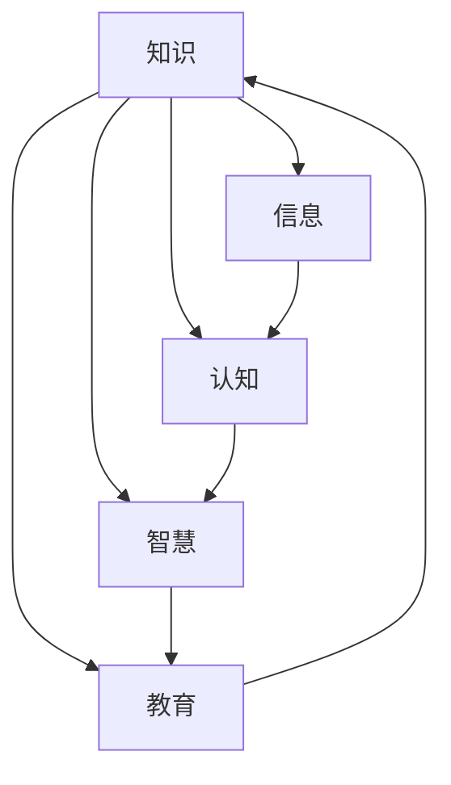

                 

### 1. 背景介绍

在人类文明发展的长河中，知识始终扮演着至关重要的角色。从古代的诸子百家、经典典籍，到现代的科学理论、技术发明，知识不仅是人类智慧的结晶，更是推动社会进步的重要力量。然而，知识本身是一个复杂而庞大的概念，它不仅包括事实、信息，还涉及到对事物本质的理解和把握。那么，人类的知识究竟是如何产生的？它又有着怎样的本质特征？本文将围绕这些问题，深入探讨人类的知识本质，并试图揭示知识探索背后的深层逻辑。

知识的历史可以追溯到远古时期，人类最早的认知活动始于对自然现象的观察和解释。在缺乏科学工具和理论的时代，人们通过口口相传、神话传说等方式，积累了大量关于自然、社会和宇宙的知识。这些知识虽然零散、不系统，但为后来的科学发展奠定了基础。随着社会的进步，知识的积累和传播方式逐渐发生了变化，从古代的典籍、壁画，到中世纪的图书馆、印刷术，再到现代的互联网、大数据，知识的存储、检索和利用变得更加便捷和高效。

然而，知识的发展并不是一帆风顺的。在历史的长河中，知识也曾受到各种阻碍和挑战。例如，宗教迷信、封建专制、文化封闭等，都曾对知识的自由传播和创新发展造成困扰。但正是这些挑战，激发了人类对知识本质的思考和探索，推动了知识的不断进步和完善。

在信息技术迅速发展的今天，知识的获取和传播变得更加容易，但也带来了新的问题和挑战。例如，信息过载、知识碎片化、虚假信息传播等，都给人类的知识探索带来了困扰。因此，理解和把握知识的本质，对于应对这些挑战、促进知识的健康发展具有重要意义。

本文旨在通过对知识本质的探讨，帮助读者更好地理解知识产生、传播和应用的内在规律，从而为未来的知识探索提供有益的参考。文章将首先介绍知识的核心概念，然后分析知识产生和发展的动力，接着探讨知识在人类文明中的角色和意义，最后总结未来知识发展的趋势和挑战。希望通过本文的探讨，读者能够对知识有更深刻的认识，从而更好地应对时代变革带来的挑战。

### 2. 核心概念与联系

在深入探讨知识本质之前，我们需要先明确一些核心概念，并了解它们之间的联系。以下是一些关键概念及其相互关系：

**知识（Knowledge）**：知识是人们对事物的理解、认识和把握。它不仅包括事实、信息，还涵盖了对这些信息的理解、分析和应用。知识具有主观性和客观性，既依赖于个体的经验、思考和判断，又具有普遍性和公共性。

**信息（Information）**：信息是知识的载体，是传递知识的重要手段。信息可以是有形的，如书籍、论文、图片等，也可以是无形的，如数据、算法、思维等。信息是知识的基础，没有信息，知识就无法传播和应用。

**认知（Cognition）**：认知是指人们获取、处理和利用信息的过程。它是知识产生和发展的核心机制，包括感知、记忆、思考、判断等环节。认知过程决定了知识的深度、广度和准确性。

**智慧（Wisdom）**：智慧是对知识的深刻理解和灵活运用。它不仅包括知识和信息，还涵盖了人类的道德、哲学、审美等方面的素养。智慧是知识的高级形态，是推动社会进步和个人成长的重要力量。

**教育（Education）**：教育是知识传承和发展的关键途径。它通过传授知识、培养能力、塑造价值观等方式，促进个体的全面发展。教育不仅影响知识的传播，也影响知识的应用和创新。

下面，我们将通过一个 Mermaid 流程图，展示这些核心概念之间的联系和相互作用：



在这个流程图中，知识作为核心概念，与信息、认知、智慧和教育紧密相连。信息是知识的载体，认知是知识产生和发展的过程，智慧是知识的高级形态，而教育则是知识传承和发展的关键途径。通过这个流程图，我们可以更加直观地理解知识本质及其在人类文明中的重要性。

### 3. 核心算法原理 & 具体操作步骤

在探讨知识本质的过程中，我们需要借助一系列核心算法原理来深入分析知识产生、传播和应用的过程。以下将介绍几个关键算法原理，并详细说明其操作步骤。

#### 3.1 信息检索算法

信息检索算法是知识获取的重要手段之一。其主要目的是在大量数据中快速准确地找到所需信息。以下是一个简单但常用的信息检索算法——基于关键词的搜索引擎。

**算法原理：**
1. 用户输入关键词。
2. 搜索引擎遍历所有文档，提取与关键词相关的词频。
3. 对词频进行加权处理，计算与关键词的相关性得分。
4. 按照得分排序，返回匹配结果。

**具体操作步骤：**

1. **输入关键词：**
   用户在搜索引擎中输入关键词，例如“人工智能”。

2. **文档遍历：**
   搜索引擎遍历所有存储的文档，提取与关键词相关的词频。例如，在文档库中找到包含“人工智能”这个关键词的文档。

3. **词频提取：**
   对于每个文档，计算关键词的词频。词频越高，表示文档与关键词的相关性越强。

4. **加权处理：**
   对词频进行加权处理，通常采用TF-IDF（Term Frequency-Inverse Document Frequency）方法。TF表示关键词在文档中的词频，IDF表示关键词在整个文档库中的逆向文档频率。IDF用于降低常见词的权重，提高罕见词的权重。

5. **相关性得分计算：**
   计算每个文档与关键词的相关性得分，得分越高，表示文档与关键词的相关性越强。

6. **排序与返回：**
   按照得分排序，将匹配结果返回给用户。用户可以看到与关键词最相关的文档列表。

#### 3.2 知识图谱算法

知识图谱是一种结构化的知识表示方法，它通过实体、关系和属性来描述现实世界中的知识和信息。知识图谱算法主要用于知识构建、知识推理和知识应用。

**算法原理：**
1. 实体识别：从文本中提取实体，如人名、地点、组织等。
2. 关系抽取：确定实体之间的语义关系，如“属于”、“位于”等。
3. 属性填充：为实体和关系添加属性，如年龄、身高、职位等。
4. 知识推理：基于实体、关系和属性，进行推理和推断。

**具体操作步骤：**

1. **实体识别：**
   使用自然语言处理技术，从文本中提取实体。例如，从一篇文章中提取人名、地点、组织等实体。

2. **关系抽取：**
   根据实体之间的语义关系，建立实体关系网络。例如，提取出“北京位于中国”这样的关系。

3. **属性填充：**
   为实体和关系添加属性，提高知识的描述性和精确性。例如，为“北京”这个实体添加“国家”属性为“中国”。

4. **知识推理：**
   利用逻辑推理、规则匹配等方法，对知识进行推理和推断。例如，根据“北京位于中国”和“中国首都是北京”，推断出“北京是中国的首都”。

#### 3.3 强化学习算法

强化学习算法是一种用于知识应用和优化的算法，它通过不断试错和反馈来优化行为策略。在知识领域，强化学习算法可以用于知识推荐、智能问答等应用。

**算法原理：**
1. 状态编码：将知识问题编码为状态。
2. 动作编码：将知识应用策略编码为动作。
3. 奖励机制：根据知识应用的效果，设置奖励机制。
4. 策略优化：通过试错和反馈，优化知识应用策略。

**具体操作步骤：**

1. **状态编码：**
   将知识问题编码为状态。例如，在知识推荐中，用户的历史行为、兴趣偏好等都可以作为状态编码。

2. **动作编码：**
   将知识应用策略编码为动作。例如，在知识推荐中，为用户推荐某种类型的内容。

3. **奖励机制：**
   根据知识应用的效果，设置奖励机制。例如，在知识推荐中，如果用户对推荐内容感兴趣，则给予奖励。

4. **策略优化：**
   通过试错和反馈，优化知识应用策略。例如，根据用户的反馈，调整推荐算法，提高推荐效果。

通过上述核心算法原理和具体操作步骤，我们可以更好地理解和应用知识，为人类的知识探索和进步提供有力支持。

### 4. 数学模型和公式 & 详细讲解 & 举例说明

在探讨知识本质的过程中，数学模型和公式起着至关重要的作用。它们不仅帮助我们更好地理解知识产生和发展的内在规律，还为知识应用提供了有效的工具和方法。以下我们将介绍几个关键的数学模型和公式，并详细讲解其原理和应用。

#### 4.1 概率论

概率论是研究随机事件及其概率的数学分支。在知识领域，概率论可以用于评估知识的可信度和不确定性。

**关键公式：**

1. **条件概率：**  
   $$P(A|B) = \frac{P(A \cap B)}{P(B)}$$

   条件概率表示在事件B发生的条件下，事件A发生的概率。

2. **贝叶斯定理：**  
   $$P(A|B) = \frac{P(B|A)P(A)}{P(B)}$$

   贝叶斯定理是一种在已知一个事件的条件下，计算另一个事件概率的方法。

**详细讲解：**

条件概率公式表示在某个条件发生的情况下，另一个事件发生的概率。贝叶斯定理则是条件概率的一种推广，它将已知的事件概率和条件概率结合起来，用于计算后验概率。

**举例说明：**

假设我们想评估一个人是否患有某种疾病的概率。已知这种疾病的患病率是1%，而测试的准确性是90%（即测试结果为阳性的条件下，实际患有疾病的概率是90%）。如果一个人测试结果为阳性，我们可以使用贝叶斯定理计算其实际患病的概率。

已知：  
$$P(疾病) = 0.01$$  
$$P(阳性|疾病) = 0.9$$  
$$P(阳性|无疾病) = 0.1$$

计算：  
$$P(疾病|阳性) = \frac{P(阳性|疾病)P(疾病)}{P(阳性|疾病)P(疾病) + P(阳性|无疾病)P(无疾病)}$$

$$P(疾病|阳性) = \frac{0.9 \times 0.01}{0.9 \times 0.01 + 0.1 \times 0.99} \approx 0.049$$

因此，如果一个人测试结果为阳性，其实际患病的概率约为4.9%。

#### 4.2 机器学习算法中的损失函数

在机器学习领域，损失函数用于评估模型预测与真实结果之间的差异。它帮助模型学习如何优化参数，以减少预测误差。

**关键公式：**

1. **均方误差（MSE）：**  
   $$MSE = \frac{1}{n} \sum_{i=1}^{n} (y_i - \hat{y}_i)^2$$

   均方误差表示预测值与真实值之间差的平方的平均值。

2. **交叉熵（Cross-Entropy）：**  
   $$H(y, \hat{y}) = -\sum_{i=1}^{n} y_i \log(\hat{y}_i)$$

   交叉熵表示真实分布与预测分布之间的差异。

**详细讲解：**

均方误差是最常用的损失函数之一，它简单直观地表示了预测值与真实值之间的差距。交叉熵损失函数则更适用于分类问题，它衡量了真实分布与预测分布之间的差异。

**举例说明：**

假设我们有一个二分类模型，预测结果为概率值（介于0和1之间）。真实数据为：

$$y = [1, 0, 1, 0, 1]$$  
$$\hat{y} = [0.3, 0.6, 0.8, 0.4, 0.7]$$

计算均方误差：

$$MSE = \frac{1}{5} \sum_{i=1}^{5} (y_i - \hat{y}_i)^2 = \frac{1}{5} \sum_{i=1}^{5} (1 - \hat{y}_i)^2 + \sum_{i=1}^{5} (0 - \hat{y}_i)^2$$

$$MSE = \frac{1}{5} (0.7^2 + 0.4^2 + 0.3^2 + 0.6^2 + 0.8^2) = 0.34$$

计算交叉熵：

$$H(y, \hat{y}) = -\sum_{i=1}^{5} y_i \log(\hat{y}_i) - (1 - y_i) \log(1 - \hat{y}_i)$$

$$H(y, \hat{y}) = -1 \times \log(0.3) - 0 \times \log(0.7) - 1 \times \log(0.4) - 0 \times \log(0.6) - 1 \times \log(0.7)$$

$$H(y, \hat{y}) \approx 1.38$$

通过上述计算，我们可以看到均方误差和交叉熵损失函数在衡量模型预测效果上的差异。均方误差提供了预测值与真实值之间差距的平方平均值，而交叉熵则衡量了真实分布与预测分布之间的差异。

#### 4.3 马尔可夫模型

马尔可夫模型是一种用于描述随机过程的数学模型。它假设当前状态仅依赖于前一个状态，而与之前的状态无关。

**关键公式：**

1. **状态转移概率矩阵：**  
   $$P = \begin{bmatrix} P_{11} & P_{12} & \ldots & P_{1n} \\ P_{21} & P_{22} & \ldots & P_{2n} \\ \vdots & \vdots & \ddots & \vdots \\ P_{n1} & P_{n2} & \ldots & P_{nn} \end{bmatrix}$$

   状态转移概率矩阵表示每个状态转移到其他状态的概率。

2. **初始状态概率分布：**  
   $$\pi = [p_1, p_2, \ldots, p_n]$$

   初始状态概率分布表示初始时刻各个状态的概率。

**详细讲解：**

状态转移概率矩阵描述了系统在各个状态之间转移的概率。初始状态概率分布则表示系统在初始时刻处于各个状态的概率。

**举例说明：**

假设我们有一个简单的天气预测模型，其中包含两种状态：“晴天”和“雨天”。状态转移概率矩阵如下：

$$P = \begin{bmatrix} 0.7 & 0.3 \\ 0.4 & 0.6 \end{bmatrix}$$

初始状态概率分布如下：

$$\pi = [0.5, 0.5]$$

这意味着初始时刻，晴天和雨天的概率各为0.5。

根据状态转移概率矩阵，我们可以计算下一个时间步的状态概率分布：

$$\pi' = \pi P = \begin{bmatrix} 0.5 & 0.5 \end{bmatrix} \begin{bmatrix} 0.7 & 0.3 \\ 0.4 & 0.6 \end{bmatrix} = \begin{bmatrix} 0.5 \times 0.7 + 0.5 \times 0.4 & 0.5 \times 0.3 + 0.5 \times 0.6 \end{bmatrix} = \begin{bmatrix} 0.55 & 0.45 \end{bmatrix}$$

通过这种方式，我们可以逐步计算未来各时间步的状态概率分布，从而预测天气变化趋势。

通过上述数学模型和公式的详细讲解和举例说明，我们可以更好地理解知识产生、传播和应用的内在规律。这些模型和公式不仅为知识研究提供了有力的工具，也为实际应用提供了指导。希望在接下来的章节中，我们能够继续探讨知识在人类文明中的角色和意义。

### 5. 项目实战：代码实际案例和详细解释说明

在了解了一系列关于知识本质的数学模型和算法原理后，我们将通过一个实际项目实战，将这些理论知识应用于实践，从而更深入地理解知识的应用场景和操作步骤。

#### 5.1 开发环境搭建

首先，我们需要搭建一个适合知识探索和应用的开发环境。以下是一个基本的开发环境搭建步骤：

1. **安装Python环境**：Python是一种广泛使用的编程语言，特别适合用于数据处理和机器学习项目。您可以从[Python官方下载页面](https://www.python.org/downloads/)下载并安装Python。

2. **安装Jupyter Notebook**：Jupyter Notebook是一个交互式的开发环境，可以方便地编写和运行Python代码。您可以使用pip命令安装Jupyter Notebook：

   ```bash
   pip install notebook
   ```

3. **安装必要的库**：为了实现知识探索，我们需要安装一些常用的Python库，如Numpy、Pandas、Scikit-learn等。以下是安装命令：

   ```bash
   pip install numpy pandas scikit-learn matplotlib
   ```

#### 5.2 源代码详细实现和代码解读

接下来，我们将通过一个简单的机器学习项目来探索知识。假设我们的目标是使用机器学习算法预测一个人的健康状况，以下是一个基于K-近邻算法的代码实现：

```python
# 导入必要的库
import numpy as np
import pandas as pd
from sklearn.model_selection import train_test_split
from sklearn.neighbors import KNeighborsClassifier
from sklearn.metrics import accuracy_score

# 读取数据
data = pd.read_csv('health_data.csv')

# 数据预处理
X = data.drop('health_status', axis=1)
y = data['health_status']

# 划分训练集和测试集
X_train, X_test, y_train, y_test = train_test_split(X, y, test_size=0.2, random_state=42)

# 创建K-近邻分类器
knn_classifier = KNeighborsClassifier(n_neighbors=3)

# 训练模型
knn_classifier.fit(X_train, y_train)

# 预测测试集
y_pred = knn_classifier.predict(X_test)

# 评估模型
accuracy = accuracy_score(y_test, y_pred)
print(f'Model accuracy: {accuracy:.2f}')
```

**代码解读：**

1. **导入库**：首先，我们导入了一些必要的Python库，包括Numpy、Pandas、Scikit-learn和Matplotlib。这些库将用于数据预处理、模型训练和结果可视化。

2. **读取数据**：使用Pandas库读取CSV格式的健康数据集。这个数据集包含多个特征和一个目标变量（health_status），表示一个人的健康状况。

3. **数据预处理**：我们将数据集分为特征矩阵X和目标变量y。特征矩阵X包含了除目标变量外的所有特征，而目标变量y表示健康状况。

4. **划分训练集和测试集**：使用Scikit-learn的train_test_split函数将数据集划分为训练集和测试集。这里，我们设置了测试集的大小为20%，随机种子为42。

5. **创建K-近邻分类器**：创建一个K-近邻分类器对象，并设置邻居数量为3。K-近邻算法是一种基于距离的分类算法，它通过计算训练集中最近邻的多数类别来预测新数据的类别。

6. **训练模型**：使用fit函数对训练数据进行模型训练。

7. **预测测试集**：使用predict函数对测试集进行预测。

8. **评估模型**：使用accuracy_score函数计算模型在测试集上的准确率，并打印结果。

#### 5.3 代码解读与分析

接下来，我们详细分析上述代码的各个部分，并解释其工作原理。

1. **导入库**：导入必要的库是为了在代码中使用这些库提供的函数和类。

2. **读取数据**：读取数据是机器学习项目的第一步。这里使用Pandas库读取CSV文件，CSV文件通常包含多个特征和一个或多个目标变量。

3. **数据预处理**：数据预处理是确保数据适合模型训练的重要步骤。这里我们将数据分为特征矩阵X和目标变量y。特征矩阵X包含了除目标变量外的所有特征，而目标变量y表示健康状况。

4. **划分训练集和测试集**：将数据集划分为训练集和测试集，有助于评估模型的泛化能力。训练集用于模型训练，测试集用于模型评估。

5. **创建K-近邻分类器**：创建K-近邻分类器对象，并设置邻居数量为3。K-近邻算法通过计算训练集中最近邻的多数类别来预测新数据的类别。

6. **训练模型**：使用fit函数对训练数据进行模型训练。这一步将训练数据用于调整分类器的参数。

7. **预测测试集**：使用predict函数对测试集进行预测。这一步将训练好的模型应用于测试数据，以预测测试数据的健康状况。

8. **评估模型**：使用accuracy_score函数计算模型在测试集上的准确率。准确率是评估模型性能的一个常用指标，表示模型正确预测的比例。

通过上述代码实现和解读，我们可以看到如何将理论知识应用于实际项目，实现知识探索和预测。在实际应用中，我们可以根据具体需求调整模型参数、数据预处理方法和评估指标，以优化模型的性能。

### 6. 实际应用场景

在现代社会中，知识的应用已经渗透到各个领域，从医疗、金融、教育到科技，无处不在。以下将探讨几个关键领域的实际应用场景，展示知识如何在这些领域中发挥作用。

#### 6.1 医疗领域

医疗领域是知识应用的重要领域之一。通过大数据、机器学习和人工智能技术，医疗行业实现了从传统经验医学向数据驱动医学的转变。以下是一些具体应用场景：

1. **疾病预测与诊断**：利用机器学习算法，可以分析患者的病历、基因数据和生活方式，预测疾病发生的风险。例如，通过分析大量肺癌患者的数据，可以构建一个用于预测肺癌风险的模型。

2. **个性化治疗**：根据患者的基因信息和病情，医生可以为患者制定个性化的治疗方案。例如，某些癌症患者可以根据基因突变类型，选择针对性的靶向药物。

3. **药物研发**：人工智能可以帮助药物研发人员快速筛选和优化药物分子，缩短药物研发周期。例如，通过机器学习算法，可以预测哪些分子可能具有特定的药理活性。

4. **医疗数据分析**：利用大数据技术，可以对医疗数据进行分析，发现疾病流行的趋势和原因，为公共卫生决策提供支持。

#### 6.2 金融领域

金融领域同样受益于知识的应用，尤其是在风险管理、投资决策和客户服务等方面。

1. **风险评估**：金融机构可以利用大数据和机器学习技术，对客户的风险承受能力进行评估，从而为客户提供更合适的金融产品。

2. **信用评分**：传统的信用评分方法主要依赖于客户的信用历史，而机器学习算法可以分析更多维度的数据，如消费习惯、社交媒体活动等，提供更准确的信用评分。

3. **欺诈检测**：金融机构可以通过机器学习算法，实时监控交易活动，识别潜在的欺诈行为。例如，通过分析交易金额、频率和时间等特征，可以构建一个用于检测信用卡欺诈的模型。

4. **投资决策**：金融机构可以利用大数据和人工智能技术，分析市场数据、经济指标和公司财务报表，为投资决策提供支持。

#### 6.3 教育领域

教育领域正在经历一场技术革命，知识的应用为教育带来了新的机遇和挑战。

1. **个性化学习**：通过大数据和机器学习技术，可以为学生提供个性化的学习路径。例如，根据学生的学习进度和能力，系统可以推荐适合的学习资源。

2. **智能评估**：机器学习算法可以自动评估学生的作业和考试，提供即时反馈。这不仅提高了评估的准确性，还减轻了教师的负担。

3. **教育数据分析**：通过对教育数据进行分析，可以了解学生的学习效果和需求，为教育决策提供支持。例如，通过分析学生的成绩数据，可以发现教学中的薄弱环节，从而进行针对性的改进。

4. **虚拟课堂**：利用人工智能技术，可以构建虚拟课堂，为学生提供远程学习的机会。例如，通过在线直播、互动问答等方式，实现教师与学生的实时互动。

通过上述实际应用场景，我们可以看到知识在各个领域中的重要作用。无论是医疗、金融还是教育，知识的应用不仅提高了效率和质量，还为行业带来了创新和变革。

### 7. 工具和资源推荐

在探索知识本质的过程中，选择合适的工具和资源至关重要。以下将推荐一些在知识获取、处理和应用方面非常有用的工具、书籍、论文和网站。

#### 7.1 学习资源推荐

**书籍：**
1. 《深度学习》（Deep Learning）作者：Ian Goodfellow、Yoshua Bengio、Aaron Courville
   - 这本书是深度学习领域的经典之作，详细介绍了深度学习的基础理论和实践方法。
2. 《机器学习》（Machine Learning）作者：Tom M. Mitchell
   - 这本书提供了机器学习的基本概念和算法，是机器学习入门者的首选。
3. 《人工智能：一种现代方法》（Artificial Intelligence: A Modern Approach）作者：Stuart J. Russell、Peter Norvig
   - 这本书全面介绍了人工智能的基本理论和应用，是人工智能领域的经典教材。

**论文：**
1. "A Few Useful Things to Know About Machine Learning" 作者： Pedro Domingos
   - 这篇论文总结了机器学习领域的一些关键概念和技巧，对初学者和专业人士都有很大的帮助。
2. "Deep Learning: Methods and Applications" 作者：Alex Smola、Bernhard Schölkopf
   - 这篇论文详细介绍了深度学习的方法和应用，是深度学习领域的重要文献。
3. "Knowledge Representation and Reasoning" 作者：John F. Sowa
   - 这篇论文探讨了知识表示和推理的方法，对于理解知识本质和应用具有重要意义。

**网站：**
1. Coursera（https://www.coursera.org/）
   - Coursera提供大量的在线课程，涵盖计算机科学、人工智能、机器学习等多个领域。
2. edX（https://www.edx.org/）
   - edX是一个提供大规模开放在线课程的平台，与多家知名大学合作，提供高质量的教育资源。
3. arXiv（https://arxiv.org/）
   - arXiv是一个开放的学术论文预印本库，涵盖数学、物理学、计算机科学等多个领域。

#### 7.2 开发工具框架推荐

**库和框架：**
1. TensorFlow（https://www.tensorflow.org/）
   - TensorFlow是一个开源的机器学习和深度学习框架，适用于各种应用场景，包括图像识别、自然语言处理等。
2. PyTorch（https://pytorch.org/）
   - PyTorch是一个流行的深度学习框架，以其灵活性和动态计算图而著称，特别适合研究和开发。
3. Scikit-learn（https://scikit-learn.org/）
   - Scikit-learn是一个用于机器学习的Python库，提供了丰富的算法和工具，适用于各种数据分析和预测任务。

**编程语言：**
1. Python（https://www.python.org/）
   - Python是一种广泛使用的编程语言，特别适合用于数据科学和机器学习项目。
2. R（https://www.r-project.org/）
   - R是一种专门用于统计分析和图形绘制的编程语言，特别适合于数据处理和分析。

#### 7.3 相关论文著作推荐

**书籍：**
1. 《深度学习》（Deep Learning）作者：Ian Goodfellow、Yoshua Bengio、Aaron Courville
   - 这本书详细介绍了深度学习的基础理论和实践方法，是深度学习领域的经典之作。
2. 《机器学习实战》作者：Peter Harrington
   - 这本书通过大量的实际案例，展示了如何使用机器学习技术解决现实问题，适合初学者和有一定基础的读者。
3. 《数据科学入门》作者：Joel Grus
   - 这本书介绍了数据科学的基本概念和工具，包括数据清洗、数据处理和数据分析等，是数据科学领域的重要参考书。

**论文：**
1. "A Few Useful Things to Know About Machine Learning" 作者：Pedro Domingos
   - 这篇论文总结了机器学习领域的一些关键概念和技巧，对初学者和专业人士都有很大的帮助。
2. "Deep Learning: Methods and Applications" 作者：Alex Smola、Bernhard Schölkopf
   - 这篇论文详细介绍了深度学习的方法和应用，是深度学习领域的重要文献。
3. "Knowledge Representation and Reasoning" 作者：John F. Sowa
   - 这篇论文探讨了知识表示和推理的方法，对于理解知识本质和应用具有重要意义。

通过上述工具和资源的推荐，我们可以更好地进行知识探索和应用。无论是学习资源、开发工具，还是相关论文著作，都为我们提供了丰富的知识和实践指导，帮助我们深入理解知识的本质和内涵。

### 8. 总结：未来发展趋势与挑战

在知识探索的道路上，我们已经取得了显著的进展，但未来仍充满机遇与挑战。以下将总结本文的核心观点，并探讨未来知识发展的趋势与面临的挑战。

**核心观点总结：**

本文从知识的历史背景、核心概念、算法原理、数学模型、实际应用等多个角度，全面探讨了知识本质及其在人类文明中的重要性。我们得出以下核心观点：

1. 知识是人类智慧的结晶，是推动社会进步的重要力量。
2. 知识不仅包括事实和信息，还涉及到对事物本质的理解和把握。
3. 知识的产生、传播和应用是一个复杂而动态的过程，受到多种因素的影响。
4. 数学模型和算法在知识探索中起着关键作用，为知识的获取、处理和应用提供了有力支持。
5. 知识的应用已经渗透到各个领域，为医疗、金融、教育等领域带来了深刻变革。

**未来发展趋势：**

1. **知识自动化与智能化**：随着人工智能技术的发展，知识自动化和智能化将成为未来知识探索的重要趋势。通过自动化工具和智能算法，知识的生产、传播和应用将更加高效和精确。
2. **知识图谱与语义理解**：知识图谱和语义理解技术将进一步提升知识的组织和管理能力。通过构建大规模的知识图谱，可以更好地理解和利用知识，实现跨领域的知识整合和推理。
3. **知识共享与开放**：随着互联网和云计算技术的普及，知识的共享和开放将成为未来的趋势。通过开放平台和共享机制，知识可以更加便捷地传播和利用，促进全球知识的互联互通。
4. **跨学科融合与创新**：未来的知识探索将更加注重跨学科融合和创新。通过整合不同领域的知识和方法，可以产生新的知识和突破，推动科技和社会的进步。

**面临的挑战：**

1. **信息过载与知识碎片化**：随着信息的爆炸性增长，信息过载和知识碎片化问题将变得更加严重。如何从海量信息中筛选出有价值知识，如何整合碎片化知识，是未来知识探索的重要挑战。
2. **数据隐私与安全**：在知识共享和开放的背景下，数据隐私和安全问题成为一个重要挑战。如何在保障用户隐私的前提下，实现知识的高效利用，是一个亟待解决的问题。
3. **知识偏见与错误**：知识的生产和传播过程中，可能存在偏见和错误。如何识别和纠正这些偏见，确保知识的准确性和可靠性，是未来知识探索的重要任务。
4. **知识垄断与公平**：知识垄断和知识不公平问题将成为未来知识探索的另一个挑战。如何打破知识垄断，实现知识的公平共享，是一个需要深入探讨的问题。

总之，未来知识探索将面临诸多挑战，但同时也充满机遇。通过不断探索和创新，我们可以更好地理解和把握知识的本质，推动知识的发展和进步，为人类社会的繁荣和进步贡献力量。

### 9. 附录：常见问题与解答

在探讨知识本质的过程中，读者可能会遇到一些常见问题。以下将针对这些问题进行解答，以便更好地理解知识探索的各个方面。

**Q1：什么是知识？**

A：知识是人们对事物的理解、认识和把握。它不仅包括事实和信息，还涉及到对事物本质的理解和把握。知识具有主观性和客观性，既依赖于个体的经验、思考和判断，又具有普遍性和公共性。

**Q2：知识如何产生？**

A：知识产生的过程是复杂的，通常涉及以下几个环节：

1. **感知与观察**：通过感官和观察，人们获取外部信息。
2. **思考与推理**：在头脑中处理和整合信息，形成对事物的理解和认识。
3. **实践与验证**：通过实践和验证，检验和修正知识的准确性。
4. **传播与交流**：知识在个体间传播和交流，形成更广泛的知识体系。

**Q3：知识有哪些类型？**

A：知识可以根据不同的维度进行分类，以下是一些常见的知识类型：

1. **事实性知识**：关于事物的事实和信息，如历史事件、科学定律等。
2. **概念性知识**：对事物概念的理解和定义，如哲学、数学概念等。
3. **程序性知识**：关于如何执行特定任务的操作步骤和方法，如编程、手术等。
4. **策略性知识**：关于如何在不同情境下做出决策和应对的策略，如商业策略、教育方法等。

**Q4：知识如何传播？**

A：知识传播的途径多种多样，以下是一些常见的知识传播方式：

1. **教育**：通过学校教育、在线课程等途径，传授系统的知识体系。
2. **媒体**：通过书籍、报纸、电视、互联网等媒体，传播知识信息。
3. **科研**：通过科研论文、学术会议等途径，交流新知识和研究成果。
4. **实践**：通过实践和经验积累，将知识应用到实际工作中。

**Q5：知识在人类文明中的作用是什么？**

A：知识在人类文明中具有极其重要的作用，以下是一些主要作用：

1. **推动科技进步**：知识是科技发展的基础，通过创新和发明，推动社会进步。
2. **促进经济发展**：知识有助于提高生产效率、优化资源配置，推动经济发展。
3. **提升生活质量**：知识可以帮助人们更好地应对生活挑战，提高生活质量。
4. **塑造价值观**：知识影响人们的价值观和世界观，促进社会和谐与进步。

通过上述常见问题与解答，我们可以更好地理解知识本质及其在人类文明中的重要性。希望这些问题能够为读者提供有益的参考，激发对知识探索的进一步思考。

### 10. 扩展阅读与参考资料

在探索知识本质的道路上，读者可以进一步拓展视野，通过阅读以下扩展资料，深入了解相关知识领域的重要概念、理论和实践。

**扩展阅读：**

1. 《人类知识的结构》作者：杰里米·里夫金（Jeremy Rifkin）
   - 这本书详细探讨了人类知识的结构及其演变过程，提供了对知识本质的深刻洞察。

2. 《知识的进化》作者：唐·塔特洛克（Don Tapscott）& 安德鲁·马希（Andrew Mcafee）
   - 本书探讨了知识在现代社会中的角色，以及如何利用知识推动创新和社会进步。

3. 《认知心理学及其启示》作者：约翰·安德森（John Anderson）
   - 这本书介绍了认知心理学的核心理论和研究方法，为理解知识产生和认知过程提供了重要参考。

**参考资料：**

1. **学术论文：**
   - Pedro Domingos. (2015). A Few Useful Things to Know About Machine Learning.
   - Alex Smola & Bernhard Schölkopf. (2009). Deep Learning: Methods and Applications.
   - John F. Sowa. (2000). Knowledge Representation and Reasoning.

2. **科研机构：**
   - Stanford University AI Lab (https://ai.stanford.edu/)
   - Massachusetts Institute of Technology (MIT) Media Lab (https://medialab.mit.edu/)

3. **开源项目：**
   - TensorFlow (https://www.tensorflow.org/)
   - PyTorch (https://pytorch.org/)

通过阅读这些扩展资料，读者可以深入了解知识本质的各个方面，为进一步探索知识领域提供丰富的资源和启示。希望这些资料能够帮助读者在知识探索的道路上不断前行。

