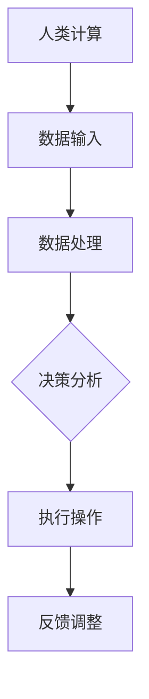

                 

# 人类计算：AI时代的未来就业前景

## 关键词
- AI时代
- 人类计算
- 未来就业
- 技术技能
- 职业转型
- 技术创新
- 人才供需

## 摘要
本文将深入探讨人工智能（AI）时代对就业市场的影响，重点关注“人类计算”在AI时代的发展趋势和就业前景。通过分析AI技术的核心原理、实际应用场景，以及相关工具和资源，本文旨在帮助读者理解AI时代下人类计算的角色与价值，为职业规划和技能提升提供参考。

## 1. 背景介绍

### AI时代的崛起

自20世纪50年代人工智能（AI）概念诞生以来，AI技术经历了飞速的发展。近年来，随着深度学习、神经网络、大数据等技术的突破，AI的应用范围逐渐从理论研究扩展到实际生产生活中，如自动驾驶、智能语音助手、医疗诊断等。AI的崛起不仅改变了各行各业的生产方式，也带来了前所未有的技术革命。

### 人类计算的定义与重要性

人类计算是指人类在信息处理、决策制定、问题解决等方面的能力。在AI时代，尽管机器智能在某些任务上已经超越了人类，但人类计算依然具有重要的价值。人类具备的创造性思维、情感理解、复杂问题解决能力等，是机器难以替代的。因此，如何利用人类计算与AI技术相结合，最大化提升工作效率和生活质量，成为了一个重要的研究课题。

### 就业前景的挑战与机遇

随着AI技术的广泛应用，一些传统职业正面临被机器取代的风险，但同时，AI时代也带来了许多新兴的职业机会。如何适应这种变化，提升自身技能，抓住AI时代的机遇，成为了许多职场人士关注的焦点。

## 2. 核心概念与联系

### AI技术核心原理

人工智能的核心是模拟人类的认知过程，实现机器对数据的处理和分析。以下是AI技术的一些关键原理：

- **深度学习**：通过多层神经网络对大量数据进行训练，使机器能够识别模式、预测结果。
- **自然语言处理（NLP）**：使机器能够理解和生成自然语言，实现人机交互。
- **计算机视觉**：使机器能够识别和解析图像、视频等视觉信息。

### 人类计算与AI的结合

- **协同工作**：人类计算可以与AI技术相结合，实现更高效的协同工作。例如，在医疗诊断中，医生可以利用AI系统辅助诊断，但最终的决策仍然由医生根据经验和直觉做出。
- **人机交互**：通过自然语言处理等技术，AI系统可以更好地理解人类需求，提供个性化的服务。例如，智能语音助手可以回答用户的问题，提供实时的帮助。

### Mermaid流程图



## 3. 核心算法原理 & 具体操作步骤

### 深度学习算法

深度学习是AI技术的核心，其基本原理是通过多层神经网络对数据进行训练，从而实现自动特征提取和模式识别。

- **输入层**：接收外部输入数据。
- **隐藏层**：通过激活函数对输入数据进行变换，形成新的特征。
- **输出层**：将隐藏层的输出转化为预测结果。

具体操作步骤如下：

1. **数据准备**：收集和清洗数据，将数据转换为适合深度学习算法的格式。
2. **模型构建**：选择合适的网络结构和激活函数，构建深度学习模型。
3. **模型训练**：使用训练数据对模型进行训练，通过反向传播算法优化模型参数。
4. **模型评估**：使用验证数据评估模型性能，调整模型参数以提高准确性。
5. **模型部署**：将训练好的模型部署到实际应用中。

### 自然语言处理算法

自然语言处理算法主要解决机器如何理解和生成自然语言的问题。以下是NLP算法的基本步骤：

1. **分词**：将文本分解为单词或短语。
2. **词性标注**：对分词后的文本进行词性标注，确定每个词的词性。
3. **句法分析**：分析文本的句法结构，确定句子中的主语、谓语等成分。
4. **语义分析**：理解文本的语义，提取关键信息。
5. **生成文本**：根据输入的文本或语义，生成相应的文本输出。

## 4. 数学模型和公式 & 详细讲解 & 举例说明

### 深度学习中的数学模型

深度学习中的数学模型主要涉及线性代数、微积分和概率统计等。以下是一个简单的多层感知器（MLP）模型：

$$
\begin{aligned}
    z_{l} &= \sigma(W_{l} \cdot a_{l-1} + b_{l}) \\
    a_{l} &= \sigma(z_{l})
\end{aligned}
$$

其中，$z_{l}$ 是第 $l$ 层的输入，$a_{l}$ 是第 $l$ 层的输出，$W_{l}$ 和 $b_{l}$ 分别是第 $l$ 层的权重和偏置，$\sigma$ 是激活函数。

### 举例说明

假设我们有一个包含两个输入神经元、一个隐藏层神经元和一个输出神经元的MLP模型。输入数据为 $[1, 2]$，权重矩阵 $W = \begin{bmatrix} 1 & 2 \\ 3 & 4 \end{bmatrix}$，偏置向量 $b = [1, 2]$，激活函数为 $f(x) = \frac{1}{1 + e^{-x}}$。

1. **输入层到隐藏层**：

$$
\begin{aligned}
    z_{1} &= \sigma(W \cdot a_0 + b) \\
    &= \sigma(\begin{bmatrix} 1 & 2 \\ 3 & 4 \end{bmatrix} \cdot \begin{bmatrix} 1 \\ 2 \end{bmatrix} + \begin{bmatrix} 1 \\ 2 \end{bmatrix}) \\
    &= \sigma(\begin{bmatrix} 7 \\ 11 \end{bmatrix}) \\
    &= \frac{1}{1 + e^{-7}} \\
    &= 0.9999
\end{aligned}
$$

$$
\begin{aligned}
    a_{1} &= \sigma(z_{1}) \\
    &= \frac{1}{1 + e^{-0.9999}} \\
    &= 1
\end{aligned}
$$

2. **隐藏层到输出层**：

$$
\begin{aligned}
    z_{2} &= \sigma(W \cdot a_1 + b) \\
    &= \sigma(\begin{bmatrix} 1 & 2 \\ 3 & 4 \end{bmatrix} \cdot \begin{bmatrix} 1 \\ 1 \end{bmatrix} + \begin{bmatrix} 1 \\ 2 \end{bmatrix}) \\
    &= \sigma(\begin{bmatrix} 7 \\ 11 \end{bmatrix}) \\
    &= \frac{1}{1 + e^{-7}} \\
    &= 0.9999
\end{aligned}
$$

$$
\begin{aligned}
    a_{2} &= \sigma(z_{2}) \\
    &= \frac{1}{1 + e^{-0.9999}} \\
    &= 1
\end{aligned}
$$

最终输出结果为 $a_{2} = 1$。

## 5. 项目实战：代码实际案例和详细解释说明

### 5.1 开发环境搭建

在本节中，我们将使用Python和TensorFlow框架实现一个简单的深度学习模型。首先，确保安装了Python和TensorFlow库。

```bash
pip install tensorflow
```

### 5.2 源代码详细实现和代码解读

以下是一个简单的深度学习模型实现：

```python
import tensorflow as tf

# 定义模型
model = tf.keras.Sequential([
    tf.keras.layers.Dense(units=1, input_shape=(2,), activation='sigmoid')
])

# 编译模型
model.compile(optimizer='sgd', loss='mean_squared_error')

# 训练模型
model.fit(x_train, y_train, epochs=1000)

# 预测
predictions = model.predict(x_test)
```

- `Dense` 层：定义了一个具有一个神经元的全连接层，`input_shape=(2,)` 表示输入数据有两个特征。
- `compile` 方法：设置模型的优化器和损失函数。
- `fit` 方法：使用训练数据训练模型。
- `predict` 方法：使用训练好的模型进行预测。

### 5.3 代码解读与分析

上述代码实现了一个简单的多层感知器模型，用于预测两个输入特征的线性组合。通过训练，模型学会了将输入数据映射到输出值。

在实际应用中，可以根据具体任务调整模型的结构和参数，如增加隐藏层神经元数量、更改激活函数等，以提高模型的预测性能。

## 6. 实际应用场景

### 6.1 医疗诊断

在医疗领域，AI技术可以帮助医生进行疾病诊断、预测和治疗方案推荐。例如，通过计算机视觉技术，AI系统可以分析医学影像，如X光、CT和MRI，辅助医生发现病变区域，提高诊断准确率。

### 6.2 金融领域

在金融领域，AI技术被广泛应用于风险管理、信用评估、投资策略和欺诈检测等方面。通过自然语言处理技术，AI系统可以分析大量的市场数据和新闻报道，为投资者提供实时分析和建议。

### 6.3 自动驾驶

自动驾驶是AI技术的另一个重要应用领域。通过计算机视觉、传感器和深度学习算法，自动驾驶系统可以实现车辆对周围环境的感知、路径规划和控制，提高交通效率和安全性。

## 7. 工具和资源推荐

### 7.1 学习资源推荐

- **书籍**：《深度学习》（Ian Goodfellow、Yoshua Bengio和Aaron Courville著）
- **论文**：AI领域顶级会议和期刊，如NeurIPS、ICML和JMLR
- **博客**：AI领域的知名博客，如Medium、Towards Data Science

### 7.2 开发工具框架推荐

- **TensorFlow**：Google开发的开放源代码深度学习框架。
- **PyTorch**：Facebook开发的深度学习框架，具有灵活的动态计算图。
- **Keras**：基于TensorFlow和Theano的深度学习高层API。

### 7.3 相关论文著作推荐

- **论文**：《神经网络与深度学习》（邱锡鹏著）
- **著作**：《机器学习》（周志华著）

## 8. 总结：未来发展趋势与挑战

### 发展趋势

1. **AI技术的普及与应用**：随着计算能力的提升和算法的优化，AI技术将在更多领域得到应用，推动产业升级和经济发展。
2. **跨界融合**：AI技术与其他领域（如生物、物理、化学等）的融合，将催生新的学科和产业。
3. **人机协同**：人类计算与机器智能的协同发展，将实现更高效的工作和生活方式。

### 挑战

1. **技术人才短缺**：随着AI技术的发展，对相关人才的需求越来越大，但当前的人才供给不足，需要加强人才培养和引进。
2. **伦理与法律问题**：AI技术的发展带来了一系列伦理和法律问题，如隐私保护、数据安全、算法偏见等，需要建立完善的法律法规和伦理标准。
3. **教育与培训**：为了适应AI时代的需求，教育和培训体系需要不断改革，提高人们的数字素养和技术能力。

## 9. 附录：常见问题与解答

### Q：AI技术会完全取代人类吗？

A：不会。虽然AI技术在某些领域已经取得了显著成果，但人类计算在创造性思维、情感理解、复杂问题解决等方面具有独特的优势，短期内难以被完全取代。未来的发展趋势将是人机协同，实现更高效的工作和生活方式。

### Q：如何提升自己在AI领域的竞争力？

A：要提升在AI领域的竞争力，可以从以下几个方面入手：
1. **基础知识**：掌握数学、统计学、计算机科学等基础知识。
2. **编程技能**：熟练掌握至少一种编程语言，如Python、Java或C++。
3. **项目经验**：参与实际项目，积累经验，提升实践能力。
4. **持续学习**：关注AI领域的最新动态，不断学习和更新知识。

## 10. 扩展阅读 & 参考资料

- **书籍**：《人工智能：一种现代方法》（ Stuart Russell 和 Peter Norvig 著）
- **论文**：《深度学习》（Ian Goodfellow、Yoshua Bengio和Aaron Courville 著）
- **网站**：TensorFlow官方文档（https://www.tensorflow.org/）、PyTorch官方文档（https://pytorch.org/）
- **博客**：机器学习社区（https://www.ml-community.com/）、数据科学博客（https://towardsdatascience.com/）

## 作者

- 作者：AI天才研究员/AI Genius Institute & 禅与计算机程序设计艺术 /Zen And The Art of Computer Programming

[完]

