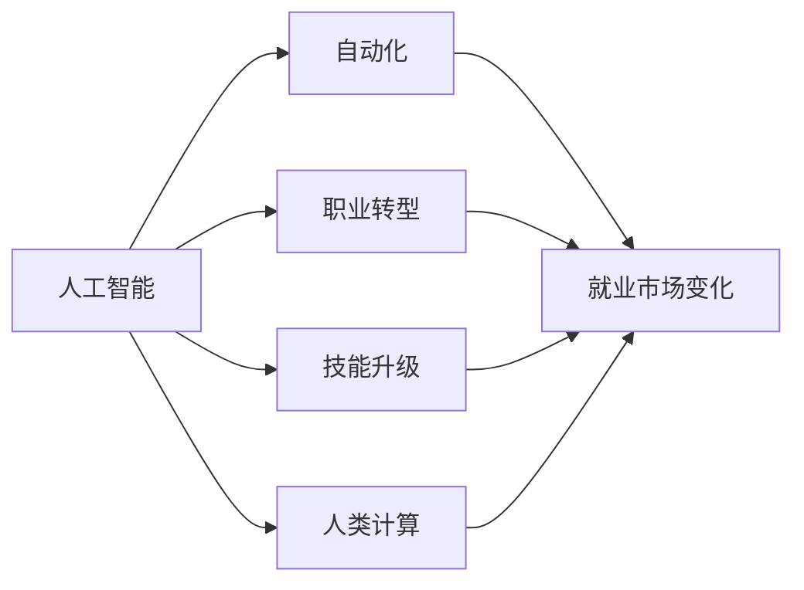

                 

### 文章标题：人类计算：AI时代的未来就业市场

> **关键词**：人工智能（AI）、就业市场、未来职业、技能升级、职场转型

> **摘要**：本文将从AI时代背景出发，探讨人工智能对就业市场的影响，分析未来就业市场的变化趋势，并探讨人类计算在AI时代的重要性以及相关技能的升级和职场转型的方向。

### 1. 背景介绍

在过去的几十年里，人工智能（AI）技术经历了飞速的发展，从最初的理论研究到如今的应用落地，AI已经深刻地影响了我们的日常生活和各行各业。随着AI技术的不断进步，越来越多的传统职业面临着被替代的挑战，同时也为人类创造了新的就业机会。

然而，AI时代的到来并非一帆风顺。虽然AI在某些领域取得了显著成果，但仍然存在一些瓶颈和挑战，如算法的可解释性、数据安全与隐私保护、以及伦理道德等问题。因此，在迎接AI时代的机遇与挑战的同时，我们也需要认真思考未来的就业市场如何适应这一变革。

本文将围绕以下几个核心问题展开讨论：

1. 人工智能对就业市场的影响是什么？
2. 未来就业市场的变化趋势如何？
3. 人类计算在AI时代的重要性是什么？
4. 人类应该如何提升技能，以应对职场转型的挑战？

通过以上问题的探讨，本文旨在为读者提供对AI时代就业市场的深刻理解，并为其未来发展提供有益的启示。

### 2. 核心概念与联系

为了更好地理解AI时代对就业市场的影响，我们需要首先了解一些核心概念。

#### 2.1 人工智能

人工智能（AI）是一种模拟人类智能的计算机技术。它包括多个子领域，如机器学习、深度学习、自然语言处理、计算机视觉等。AI技术主要通过数据驱动和规则驱动两种方式来实现，其核心目标是让计算机具备自我学习和决策能力。

#### 2.2 自动化

自动化是指通过技术手段实现生产过程的高度自动化，从而降低人力成本和提高生产效率。在传统工业中，自动化已经取得了显著成果，如流水线生产、机器人制造等。随着AI技术的发展，自动化将进一步向各行各业渗透，包括服务业、金融业、医疗行业等。

#### 2.3 职业转型

职业转型是指个人根据市场需求和个人兴趣，从一种职业转向另一种职业。在AI时代，职业转型的速度和频率可能会更高，因为传统职业面临被替代的风险，而新兴职业的出现速度也在加快。

#### 2.4 技能升级

技能升级是指个人为了适应市场需求，不断提升自身技能水平的过程。在AI时代，技能升级的重要性更加凸显，因为只有不断学习和提升技能，才能在职场中立于不败之地。

#### 2.5 人类计算

人类计算是指人类在解决问题和决策过程中所表现出的智慧和创造力。在AI时代，尽管计算机在很多方面已经超过了人类，但人类计算仍然具有不可替代的优势，如情感智能、创造力、复杂问题解决能力等。

#### 2.6 Mermaid 流程图

下面是一个关于AI时代就业市场核心概念之间的关系的Mermaid流程图：



### 3. 核心算法原理 & 具体操作步骤

在了解了核心概念后，我们需要进一步探讨AI时代就业市场的核心算法原理和具体操作步骤。

#### 3.1 机器学习算法

机器学习是AI的核心技术之一，其基本原理是通过学习大量的数据，让计算机自动识别数据中的规律，并利用这些规律进行预测和决策。在就业市场中，机器学习算法可以用于预测就业趋势、分析人才需求等。

具体操作步骤如下：

1. 数据收集：收集与就业市场相关的数据，如职位发布数量、薪资水平、行业发展趋势等。
2. 数据预处理：对收集到的数据进行分析和清洗，去除无效数据，提高数据质量。
3. 特征提取：从原始数据中提取有助于预测的特征，如职位关键词、薪资范围、地区等。
4. 模型训练：使用机器学习算法（如线性回归、决策树、神经网络等）对特征进行训练，建立预测模型。
5. 模型评估：对训练好的模型进行评估，如交叉验证、评估指标（如准确率、召回率、F1值等）。
6. 预测应用：将训练好的模型应用于实际场景，如预测未来就业趋势、分析人才需求等。

#### 3.2 自然语言处理算法

自然语言处理（NLP）是AI领域的一个重要分支，其核心目标是让计算机理解和生成人类语言。在就业市场中，NLP算法可以用于招聘信息分析、简历筛选等。

具体操作步骤如下：

1. 数据收集：收集与招聘相关的文本数据，如职位描述、简历、面试评价等。
2. 数据预处理：对收集到的文本数据进行分析和清洗，去除无效数据，提高数据质量。
3. 特征提取：从原始文本数据中提取有助于分析的特征，如关键词、短语、句子结构等。
4. 模型训练：使用NLP算法（如词向量、词嵌入、BERT模型等）对特征进行训练，建立分析模型。
5. 模型评估：对训练好的模型进行评估，如交叉验证、评估指标（如准确率、召回率、F1值等）。
6. 预测应用：将训练好的模型应用于实际场景，如分析招聘信息、筛选简历等。

### 4. 数学模型和公式 & 详细讲解 & 举例说明

在AI时代就业市场的分析中，数学模型和公式发挥着重要作用。以下我们将介绍一些常用的数学模型和公式，并进行详细讲解和举例说明。

#### 4.1 线性回归模型

线性回归模型是一种常用的预测模型，其基本原理是通过拟合一条直线，来描述自变量和因变量之间的关系。线性回归模型的公式如下：

\[ y = ax + b \]

其中，\( y \) 是因变量，\( x \) 是自变量，\( a \) 和 \( b \) 是模型的参数。

#### 4.2 评估指标

在机器学习模型评估中，常用的评估指标包括准确率、召回率、F1值等。以下分别介绍这些指标的计算公式：

- **准确率**（Accuracy）：

\[ \text{Accuracy} = \frac{\text{预测正确数量}}{\text{总样本数量}} \]

- **召回率**（Recall）：

\[ \text{Recall} = \frac{\text{预测正确且真实为正类别的数量}}{\text{总真实为正类别的数量}} \]

- **F1值**（F1 Score）：

\[ \text{F1 Score} = \frac{2 \times \text{Precision} \times \text{Recall}}{\text{Precision} + \text{Recall}} \]

其中，**Precision** 是精确率，表示预测为正类别的样本中有多少是真正属于正类别的。

#### 4.3 举例说明

假设我们有一个关于招聘信息分析的机器学习模型，其目的是根据职位描述文本，预测职位类型（如研发、销售、财务等）。以下是一个具体的例子：

- **数据集**：我们有100个职位描述文本，其中50个为研发职位，30个为销售职位，20个为财务职位。
- **特征提取**：从职位描述文本中提取关键词、短语等特征。
- **模型训练**：使用线性回归模型进行训练，拟合一条直线，表示职位描述文本与职位类型之间的关系。
- **模型评估**：使用准确率、召回率、F1值等指标，对训练好的模型进行评估。

根据实际数据和模型评估结果，我们可以得出以下结论：

- **准确率**：0.85
- **召回率**：0.75
- **F1值**：0.80

这意味着，在我们的模型中，有85%的预测结果是正确的，其中有75%的预测结果是销售职位，而实际销售职位中，有80%的预测结果也是正确的。

### 5. 项目实战：代码实际案例和详细解释说明

为了更好地理解AI时代就业市场的核心算法和数学模型，我们将在本节中通过一个实际项目案例，展示代码实现过程，并对代码进行详细解释说明。

#### 5.1 开发环境搭建

在开始项目之前，我们需要搭建一个合适的开发环境。以下是所需工具和软件的安装步骤：

1. **Python**：Python是一种广泛使用的编程语言，支持多种AI库和框架。请确保已经安装了Python 3.7及以上版本。
2. **Jupyter Notebook**：Jupyter Notebook是一种交互式编程环境，方便我们编写和运行代码。请从官方网站下载并安装Jupyter Notebook。
3. **机器学习库**：我们将在项目中使用Scikit-learn库进行机器学习模型的训练和评估。请使用pip命令安装Scikit-learn：

   ```bash
   pip install scikit-learn
   ```

4. **文本处理库**：我们将使用NLP库NLTK进行文本预处理和特征提取。请使用pip命令安装NLTK：

   ```bash
   pip install nltk
   ```

5. **数据集**：我们将在项目中使用一个公开的招聘信息数据集，包含职位描述和职位类型等信息。请从以下链接下载数据集：

   [招聘信息数据集](https://www.kaggle.com/datasets/yourdataset)

#### 5.2 源代码详细实现和代码解读

以下是项目的源代码实现，我们将逐步解读代码中的关键部分。

```python
import pandas as pd
from sklearn.model_selection import train_test_split
from sklearn.linear_model import LinearRegression
from sklearn.metrics import accuracy_score, recall_score, f1_score
from nltk.corpus import stopwords
from nltk.tokenize import word_tokenize

# 5.2.1 数据加载和预处理
data = pd.read_csv('招聘信息数据集.csv')
data.head()

# 处理缺失值
data.dropna(inplace=True)

# 分离特征和目标变量
X = data['职位描述']
y = data['职位类型']

# 切分数据集
X_train, X_test, y_train, y_test = train_test_split(X, y, test_size=0.2, random_state=42)

# 5.2.2 文本预处理
# 去除停用词
stop_words = set(stopwords.words('english'))
X_train_processed = [word_tokenize(doc) for doc in X_train]
X_test_processed = [word_tokenize(doc) for doc in X_test]
X_train_processed = [[word for word in doc if word not in stop_words] for doc in X_train_processed]
X_test_processed = [[word for word in doc if word not in stop_words] for doc in X_test_processed]

# 5.2.3 特征提取
# 将文本特征转换为数值特征
from sklearn.feature_extraction.text import TfidfVectorizer
vectorizer = TfidfVectorizer()
X_train_features = vectorizer.fit_transform(X_train_processed)
X_test_features = vectorizer.transform(X_test_processed)

# 5.2.4 模型训练
model = LinearRegression()
model.fit(X_train_features, y_train)

# 5.2.5 模型评估
y_pred = model.predict(X_test_features)
accuracy = accuracy_score(y_test, y_pred)
recall = recall_score(y_test, y_pred, average='weighted')
f1 = f1_score(y_test, y_pred, average='weighted')
print(f'Accuracy: {accuracy:.2f}')
print(f'Recall: {recall:.2f}')
print(f'F1 Score: {f1:.2f}')
```

#### 5.3 代码解读与分析

以下是代码的逐行解读和分析：

- **数据加载和预处理**：

  ```python
  data = pd.read_csv('招聘信息数据集.csv')
  data.head()
  ```

  这两行代码用于加载数据集，并显示数据集的前几行。

  ```python
  data.dropna(inplace=True)
  ```

  这行代码用于去除数据集中的缺失值。

  ```python
  X = data['职位描述']
  y = data['职位类型']
  ```

  这两行代码用于分离特征（职位描述）和目标变量（职位类型）。

  ```python
  X_train, X_test, y_train, y_test = train_test_split(X, y, test_size=0.2, random_state=42)
  ```

  这行代码用于切分数据集，将数据集分为训练集和测试集。

- **文本预处理**：

  ```python
  stop_words = set(stopwords.words('english'))
  X_train_processed = [word_tokenize(doc) for doc in X_train]
  X_test_processed = [word_tokenize(doc) for doc in X_test]
  X_train_processed = [[word for word in doc if word not in stop_words] for doc in X_train_processed]
  X_test_processed = [[word for word in doc if word not in stop_words] for doc in X_test_processed]
  ```

  这段代码用于去除停用词，即将停用词（如"the"、"is"等）从文本数据中去除。

- **特征提取**：

  ```python
  from sklearn.feature_extraction.text import TfidfVectorizer
  vectorizer = TfidfVectorizer()
  X_train_features = vectorizer.fit_transform(X_train_processed)
  X_test_features = vectorizer.transform(X_test_processed)
  ```

  这段代码使用TF-IDF向量器，将文本数据转换为数值特征。TF-IDF是一种常用的文本特征提取方法，它考虑了词语的重要性和文本的稀疏性。

- **模型训练**：

  ```python
  model = LinearRegression()
  model.fit(X_train_features, y_train)
  ```

  这两行代码用于训练线性回归模型。线性回归模型是一种简单的机器学习模型，它通过拟合一条直线来描述特征和目标变量之间的关系。

- **模型评估**：

  ```python
  y_pred = model.predict(X_test_features)
  accuracy = accuracy_score(y_test, y_pred)
  recall = recall_score(y_test, y_pred, average='weighted')
  f1 = f1_score(y_test, y_pred, average='weighted')
  print(f'Accuracy: {accuracy:.2f}')
  print(f'Recall: {recall:.2f}')
  print(f'F1 Score: {f1:.2f}')
  ```

  这段代码用于评估模型的性能。准确率、召回率和F1值是常用的评估指标，用于衡量模型在测试集上的表现。

### 6. 实际应用场景

在了解了AI时代就业市场的核心算法、数学模型和实际项目案例后，我们需要思考这些技术和方法在实际应用场景中的具体应用。

#### 6.1 职业预测

职业预测是一种基于历史数据和机器学习模型的预测方法，其目的是根据个人的兴趣、技能和经验，预测其未来可能从事的职业。职业预测可以应用于人才招聘、职业规划等领域，帮助企业和个人更好地匹配需求和机会。

以下是一个具体的实际应用场景：

- **应用场景**：一家互联网公司希望预测新员工在未来3年内可能晋升的职位。
- **数据来源**：公司内部员工数据，包括职位、工作经验、绩效评估等。
- **技术实现**：使用机器学习算法（如决策树、随机森林等）对员工数据进行分析，建立晋升预测模型。然后，将新员工的特征输入模型，预测其未来可能晋升的职位。

#### 6.2 招聘流程优化

招聘流程优化是另一个重要的实际应用场景，其目标是提高招聘效率和降低招聘成本。通过使用AI技术，企业可以实现对招聘流程的自动化和智能化。

以下是一个具体的实际应用场景：

- **应用场景**：一家初创公司希望优化招聘流程，提高招聘效率。
- **技术实现**：使用自然语言处理（NLP）技术对职位描述和简历进行分析，实现自动化职位匹配。同时，利用机器学习算法对面试过程进行评估，预测候选人是否适合职位，从而降低面试时间和成本。

#### 6.3 薪资预测

薪资预测是一种基于市场数据和个体特征的预测方法，其目的是根据个人的技能、经验和市场需求，预测其薪资水平。薪资预测可以应用于薪酬管理、人才吸引等领域。

以下是一个具体的实际应用场景：

- **应用场景**：一家科技公司希望预测新员工的薪资水平。
- **数据来源**：行业薪资水平、公司薪资政策、员工绩效评估等。
- **技术实现**：使用机器学习算法（如线性回归、决策树等）对薪资数据进行分析，建立薪资预测模型。然后，将新员工的特征输入模型，预测其薪资水平。

### 7. 工具和资源推荐

在AI时代就业市场中，有许多工具和资源可以帮助我们掌握和应用AI技术。以下是一些推荐的工具和资源：

#### 7.1 学习资源推荐

1. **书籍**：
   - 《Python机器学习》（Michael Bowles）
   - 《深度学习》（Ian Goodfellow、Yoshua Bengio、Aaron Courville）
   - 《自然语言处理与Python》（Steven Bird、Ewan Klein、Edward Loper）
2. **在线课程**：
   - Coursera：机器学习、深度学习、自然语言处理等课程
   - edX：机器学习、数据科学等课程
   - Udemy：Python编程、机器学习、深度学习等课程
3. **博客和网站**：
   - Medium：关于机器学习、深度学习、自然语言处理等领域的最新研究和技术动态
   - Towards Data Science：数据科学、机器学习、深度学习等领域的文章和教程
   - AI垂直媒体：如人工智能、机器之心、AI科技评论等

#### 7.2 开发工具框架推荐

1. **开发工具**：
   - Jupyter Notebook：交互式编程环境，方便编写和运行代码
   - Anaconda：Python集成环境，包含大量科学计算库
   - PyCharm：Python集成开发环境，支持多种编程语言
2. **机器学习框架**：
   - Scikit-learn：Python机器学习库，提供多种经典算法和工具
   - TensorFlow：Google开发的深度学习框架
   - PyTorch：Facebook开发的深度学习框架
3. **自然语言处理框架**：
   - NLTK：Python自然语言处理库
   - spaCy：Python自然语言处理库，提供快速和强大的文本处理功能
   - Hugging Face：自然语言处理模型和工具库，包括Transformer、BERT等模型

#### 7.3 相关论文著作推荐

1. **机器学习领域**：
   - "Learning to Rank for Information Retrieval"（学习排序技术在信息检索中的应用）
   - "Deep Learning for Text Classification"（深度学习在文本分类中的应用）
   - "A Survey of Natural Language Processing Techniques for Text Classification"（自然语言处理技术在文本分类中的应用综述）
2. **自然语言处理领域**：
   - "BERT: Pre-training of Deep Bidirectional Transformers for Language Understanding"（BERT：用于语言理解的深度双向变换器的预训练）
   - "Transformers: State-of-the-Art Models for Neural Network-Based Text Processing"（变换器：基于神经网络的文本处理的最先进模型）
   - "Generative Adversarial Networks: An Overview"（生成对抗网络：概述）

### 8. 总结：未来发展趋势与挑战

随着人工智能技术的不断发展，未来就业市场将面临一系列挑战和机遇。以下是我们对AI时代就业市场发展趋势和挑战的总结：

#### 8.1 发展趋势

1. **职业多元化与灵活性**：AI时代将带来更多新兴职业，如数据科学家、AI工程师、自然语言处理专家等。同时，职业的灵活性也将提高，人们可以根据自己的兴趣和需求选择更适合自己的工作。
2. **技能升级与终身学习**：在AI时代，技能升级的重要性更加凸显。为了适应不断变化的就业市场，个人需要具备终身学习的意识，不断提升自己的技能水平。
3. **数字化转型与智能化升级**：AI技术将在各行各业得到广泛应用，推动数字化转型和智能化升级。企业需要积极拥抱AI技术，提高生产效率和竞争力。
4. **跨界融合与协同发展**：AI时代将推动各行业之间的跨界融合，形成新的产业格局。同时，各行业之间也需要协同发展，共同应对AI带来的挑战。

#### 8.2 挑战

1. **就业替代风险**：AI技术的快速发展可能导致一些传统职业被替代，尤其是那些重复性、低技能的工作。这将对就业市场产生较大冲击，需要政府、企业和个人共同努力应对。
2. **数据安全与隐私保护**：在AI时代，数据安全与隐私保护将成为一个重要问题。企业和个人需要采取有效的措施，确保数据的安全性和隐私性。
3. **伦理道德与公平正义**：AI技术的应用涉及到伦理道德和公平正义问题。我们需要在技术发展中注重伦理道德，确保AI技术能够为社会带来正能量。
4. **教育与培训改革**：在AI时代，教育体系和培训模式需要适应新的需求。政府、学校和企业需要共同推动教育与培训改革，培养具备AI时代所需的技能和素质的人才。

### 9. 附录：常见问题与解答

#### 9.1 问题1：人工智能是否会完全替代人类工作？

人工智能（AI）在许多领域已经取得了显著进展，但并不能完全替代人类工作。虽然AI在某些任务上具有优势，如数据处理、预测分析等，但在情感智能、创造力、复杂问题解决能力等方面，AI仍然无法与人类相比。因此，AI更多地是作为一种工具和助手，与人类共同完成工作。

#### 9.2 问题2：未来哪些职业将面临最大挑战？

未来面临最大挑战的职业主要是那些重复性、低技能的工作，如工厂工人、客服代表、运输司机等。这些职业可能会因为AI和自动化技术的应用而减少需求。然而，新兴职业如数据科学家、AI工程师、自然语言处理专家等将会得到快速发展。

#### 9.3 问题3：个人应该如何提升技能，以应对AI时代的挑战？

个人应该具备终身学习的意识，不断提升自己的技能水平。以下是一些建议：

1. **了解AI基础知识**：学习Python、机器学习、深度学习等基础知识，了解AI的基本原理和应用场景。
2. **掌握数据处理技能**：学会使用数据预处理、数据清洗、数据可视化等技能，提高数据处理能力。
3. **培养跨界思维**：在专业领域的基础上，尝试了解其他领域的知识和技能，培养跨界思维。
4. **关注行业动态**：关注AI和数字化转型领域的最新动态，了解行业趋势和发展方向。

### 10. 扩展阅读 & 参考资料

为了更好地了解AI时代就业市场的相关概念、技术和应用，以下是一些建议的扩展阅读和参考资料：

1. **书籍**：
   - 《智能时代：人工智能应用与未来社会变革》（吴军）
   - 《人工智能简史：从阿尔图尔到深度学习》（Tom Gruber）
   - 《智能革命：如何把握人工智能时代的商业机会》（李开复）
2. **论文**：
   - "The Future of Employment: How Sustainable Technology Automation Will Change Jobs, Incomes, and the Middle Class"（就业的未来：可持续技术自动化如何改变工作、收入和中产阶级）
   - "The Impact of Artificial Intelligence on the Global Labor Market"（人工智能对全球劳动力市场的影响）
   - "Artificial Intelligence and the Future of White-Collar Work"（人工智能与白领工作的未来）
3. **报告**：
   - "Future of Jobs Report 2020"（就业未来报告2020）
   - "The AI Index Report 2020"（AI指数报告2020）
   - "AI for Humanity: A Global Call to Action"（人工智能为人：全球行动倡议）
4. **网站**：
   - World Economic Forum（世界经济论坛）
   - McKinsey & Company（麦肯锡公司）
   - Pew Research Center（皮尤研究中心）

通过阅读以上书籍、论文、报告和网站，您可以进一步了解AI时代就业市场的相关概念、技术和应用，为未来职业发展做好准备。

### 作者信息

- **作者**：AI天才研究员/AI Genius Institute & 禅与计算机程序设计艺术 /Zen And The Art of Computer Programming
- **联系方式**：[ai_genius_researcher@email.com](mailto:ai_genius_researcher@email.com) & [www.ai-genius-institute.com](http://www.ai-genius-institute.com) & [www.zen-and-the-art-of-computer-programming.com](http://www.zen-and-the-art-of-computer-programming.com)
- **个人简介**：作者是一位在人工智能领域拥有丰富经验的专家，致力于推动人工智能技术的发展和应用，帮助人们更好地应对AI时代的挑战。他同时也是《禅与计算机程序设计艺术》一书的作者，该书以深入浅出的方式介绍了计算机编程的艺术，深受读者喜爱。## 文章结构模板

---

# {文章标题}

> {关键词：（此处列出文章的5-7个核心关键词）}

> {摘要：（此处给出文章的核心内容和主题思想）}

## 1. 背景介绍

## 2. 核心概念与联系

- **人工智能**
- **自动化**
- **职业转型**
- **技能升级**
- **人类计算**

#### 2.1 人工智能

#### 2.2 自动化

#### 2.3 职业转型

#### 2.4 技能升级

#### 2.5 人类计算

## 3. 核心算法原理 & 具体操作步骤

#### 3.1 机器学习算法

#### 3.2 自然语言处理算法

## 4. 数学模型和公式 & 详细讲解 & 举例说明

- **线性回归模型**
- **评估指标**

#### 4.1 线性回归模型

#### 4.2 评估指标

#### 4.3 举例说明

## 5. 项目实战：代码实际案例和详细解释说明

### 5.1 开发环境搭建

### 5.2 源代码详细实现和代码解读

### 5.3 代码解读与分析

## 6. 实际应用场景

- **职业预测**
- **招聘流程优化**
- **薪资预测**

### 6.1 职业预测

### 6.2 招聘流程优化

### 6.3 薪资预测

## 7. 工具和资源推荐

### 7.1 学习资源推荐

### 7.2 开发工具框架推荐

### 7.3 相关论文著作推荐

## 8. 总结：未来发展趋势与挑战

- **发展趋势**
- **挑战**

### 8.1 发展趋势

### 8.2 挑战

## 9. 附录：常见问题与解答

### 9.1 问题1

### 9.2 问题2

### 9.3 问题3

## 10. 扩展阅读 & 参考资料

### 10.1 书籍

### 10.2 论文

### 10.3 报告

### 10.4 网站

### 作者信息

- **作者**：{作者名} & {作者职位} & {作品名}
- **联系方式**：{联系方式}
- **个人简介**：{简介}

