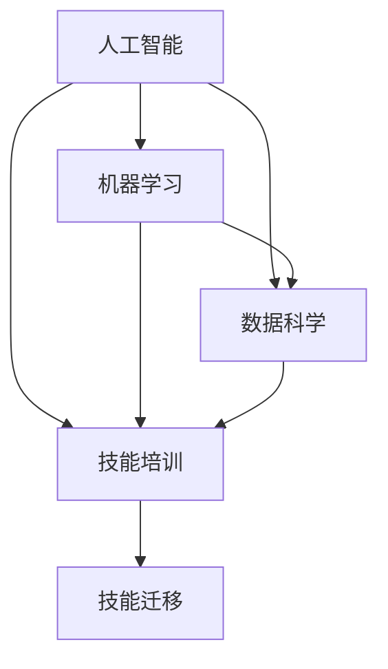
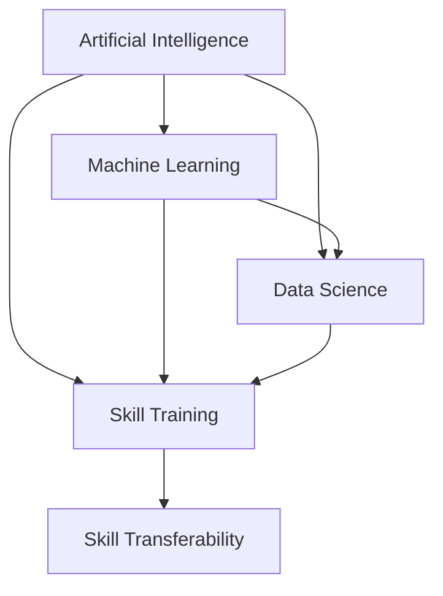

                 

### 背景介绍

#### AI时代的到来

随着人工智能（AI）技术的飞速发展，人类社会正经历着前所未有的变革。从智能家居、智能医疗到自动驾驶、金融科技，AI技术的应用已渗透到各个领域。这种变革不仅改变了我们的生活方式，也对就业市场产生了深远的影响。

#### 未来就业市场的变革

随着AI技术的发展，传统的就业市场正在经历巨大变革。一方面，一些职业如司机、客服、数据输入员等正在逐渐被自动化替代；另一方面，新的职业如数据科学家、机器学习工程师、AI研究员等不断涌现。这种转变不仅对现有从业者提出了新的挑战，也为未来的就业市场带来了新的机遇。

#### 技能培训的重要性

在AI时代，技能培训变得尤为重要。一方面，从业者需要不断更新知识，提升自身技能，以适应新的职业需求；另一方面，教育机构和企业也需要调整培训课程，以培养符合未来市场需求的人才。因此，技能培训将成为未来就业市场的一把利器，帮助人们抓住机遇，应对挑战。

#### 挑战与机遇

AI时代的到来既带来了挑战，也带来了机遇。如何应对这些挑战，抓住机遇，成为当下亟待解决的问题。本文将围绕这一主题，分析未来就业市场与技能培训的发展趋势。

---

## Background Introduction

### The Arrival of the AI Era

The rapid development of artificial intelligence (AI) technology is ushering in a transformative era for humanity. From smart homes and intelligent healthcare to autonomous vehicles and fintech, AI applications are permeating various fields. This transformation is not only altering our lifestyles but also having a profound impact on the job market.

### Changes in the Future Job Market

With the advancement of AI technology, the job market is undergoing significant changes. On one hand, traditional professions such as drivers, customer service representatives, and data input clerks are increasingly being automated. On the other hand, new professions such as data scientists, machine learning engineers, and AI researchers are emerging. This shift poses new challenges for existing workers while also presenting new opportunities for the job market.

### The Importance of Skill Training

In the AI era, skill training has become crucial. On one hand, professionals need to continually update their knowledge and enhance their skills to meet the demands of new careers. On the other hand, educational institutions and businesses must adjust their training programs to cultivate talents that meet future market needs. Therefore, skill training will be a crucial tool in helping people seize opportunities and overcome challenges in the future job market.

### Challenges and Opportunities

The arrival of the AI era brings both challenges and opportunities. How to address these challenges and seize these opportunities is an urgent issue that needs to be addressed. This article will analyze the trends in the future job market and skill training development.

---

---

### 核心概念与联系

在深入探讨AI时代的未来就业市场与技能培训发展趋势之前，我们需要了解一些核心概念和它们之间的联系。

#### 人工智能（AI）

人工智能（AI）是指通过计算机程序模拟人类智能行为的技术。它包括机器学习、深度学习、自然语言处理、计算机视觉等多个子领域。AI技术的发展是推动未来就业市场变革的关键因素。

#### 机器学习（ML）

机器学习（ML）是一种让计算机通过数据学习并做出决策的技术。它是AI的核心组成部分，广泛应用于预测、分类、聚类等任务。ML技术的发展推动了数据科学家、机器学习工程师等新兴职业的需求。

#### 数据科学（DS）

数据科学（DS）是利用数学、统计、计算机科学等方法来从数据中提取知识和洞见。它包括数据预处理、数据分析、数据可视化等环节，是AI时代不可或缺的技能。

#### 技能培训

技能培训是指通过教育、培训等方式，提高个人在特定领域的能力和知识水平。在AI时代，技能培训的重要性愈发凸显，因为它能够帮助人们适应不断变化的就业市场。

#### 技能迁移

技能迁移是指将一个人在某一领域学到的技能应用到另一领域。在AI时代，技能迁移能力变得尤为重要，因为它能够帮助人们快速适应新兴职业。

#### Mermaid 流程图

为了更好地理解这些核心概念和它们之间的联系，我们可以借助 Mermaid 流程图进行可视化。以下是一个简化的流程图，展示了人工智能、机器学习、数据科学、技能培训和技能迁移之间的关系。



通过这个流程图，我们可以清晰地看到人工智能、机器学习、数据科学、技能培训和技能迁移之间的相互作用。这些核心概念和联系构成了AI时代就业市场与技能培训的基石。

---

## Core Concepts and Relationships

Before delving into the future job market and skill training trends in the AI era, it's essential to understand some core concepts and their interrelationships.

#### Artificial Intelligence (AI)

Artificial intelligence (AI) refers to the technology that simulates human intelligent behavior through computer programs. It encompasses several subfields, including machine learning, deep learning, natural language processing, and computer vision. The development of AI technology is a critical factor driving changes in the future job market.

#### Machine Learning (ML)

Machine learning (ML) is a technique that enables computers to learn from data and make decisions. It is a core component of AI and is widely used in tasks such as prediction, classification, and clustering. The development of ML technology has fueled the demand for new professions such as data scientists and machine learning engineers.

#### Data Science (DS)

Data science (DS) is the field that uses mathematical, statistical, and computational methods to extract knowledge and insights from data. It includes data preprocessing, data analysis, and data visualization, among other aspects. DS is indispensable in the AI era.

#### Skill Training

Skill training refers to the process of improving an individual's capabilities and knowledge in a specific area through education and training. In the AI era, skill training has become increasingly important as it helps people adapt to the changing job market.

#### Skill Transferability

Skill transferability is the ability to apply skills learned in one domain to another. In the AI era, this capability is particularly valuable as it allows individuals to quickly adapt to emerging professions.

#### Mermaid Flowchart

To better understand these core concepts and their relationships, we can use a Mermaid flowchart for visualization. Here is a simplified flowchart illustrating the relationships between artificial intelligence, machine learning, data science, skill training, and skill transferability.



This flowchart provides a clear visualization of the interactions between artificial intelligence, machine learning, data science, skill training, and skill transferability. These core concepts and relationships form the foundation of the job market and skill training in the AI era.

---

### 核心算法原理 & 具体操作步骤

在了解了AI时代的核心概念和联系后，接下来我们将探讨AI时代的一些关键算法原理和具体操作步骤。这些算法原理不仅是AI技术发展的基石，也是未来就业市场中不可或缺的技能。

#### 机器学习算法

机器学习（ML）算法是AI时代的核心技术之一。以下是一些常见的机器学习算法及其原理：

1. **线性回归（Linear Regression）**

线性回归是一种用于预测连续值的算法。其基本原理是通过找到一个最佳拟合直线，将输入特征映射到输出目标。具体操作步骤如下：

   - 收集数据：从数据集中获取输入特征和输出目标。
   - 建立模型：使用最小二乘法找到一个最佳拟合直线。
   - 训练模型：通过不断迭代优化模型参数。
   - 预测：使用训练好的模型对新的数据进行预测。

2. **决策树（Decision Tree）**

决策树是一种用于分类和回归的算法。其基本原理是通过一系列决策节点将数据集划分为子集，直到满足停止条件。具体操作步骤如下：

   - 切分数据：将数据集划分为训练集和测试集。
   - 构建树：根据信息增益或基尼不纯度等指标选择最佳切分特征。
   - 剪枝：防止过拟合，提高模型的泛化能力。

3. **支持向量机（Support Vector Machine, SVM）**

支持向量机是一种用于分类的算法。其基本原理是通过找到一个最优超平面，将数据集划分为不同的类别。具体操作步骤如下：

   - 特征提取：对数据进行特征提取和预处理。
   - 模型训练：使用支持向量机算法训练模型。
   - 预测：使用训练好的模型对新的数据进行预测。

#### 自然语言处理（NLP）算法

自然语言处理（NLP）是AI时代的重要应用领域。以下是一些常见的NLP算法及其原理：

1. **词嵌入（Word Embedding）**

词嵌入是一种将词语映射到高维空间的方法。其基本原理是利用神经网络学习词语的上下文关系。具体操作步骤如下：

   - 数据预处理：对文本数据进行分词和标记。
   - 模型训练：使用词嵌入算法（如Word2Vec、GloVe）训练模型。
   - 预测：使用训练好的模型对新的文本数据进行处理。

2. **序列标注（Sequence Labeling）**

序列标注是一种用于对文本序列进行分类的算法。其基本原理是利用神经网络学习词语序列的标注。具体操作步骤如下：

   - 数据预处理：对文本数据进行分词和标记。
   - 模型训练：使用序列标注算法（如BiLSTM-CRF）训练模型。
   - 预测：使用训练好的模型对新的文本数据进行标注。

#### 计算机视觉（CV）算法

计算机视觉（CV）是AI时代的重要应用领域。以下是一些常见的CV算法及其原理：

1. **目标检测（Object Detection）**

目标检测是一种用于识别图像中物体的算法。其基本原理是利用神经网络学习物体的特征并定位。具体操作步骤如下：

   - 数据预处理：对图像数据进行预处理。
   - 模型训练：使用目标检测算法（如YOLO、Faster R-CNN）训练模型。
   - 预测：使用训练好的模型对新的图像数据进行检测。

2. **图像分割（Image Segmentation）**

图像分割是一种用于将图像划分为不同区域的方法。其基本原理是利用神经网络学习图像的区域特征。具体操作步骤如下：

   - 数据预处理：对图像数据进行预处理。
   - 模型训练：使用图像分割算法（如FCN、U-Net）训练模型。
   - 预测：使用训练好的模型对新的图像数据进行分割。

这些算法原理和具体操作步骤不仅构成了AI时代的核心技术，也为未来的就业市场提供了丰富的机会。掌握这些算法原理和操作步骤，将帮助从业者更好地应对AI时代的挑战。

---

## Core Algorithm Principles & Detailed Steps

After understanding the core concepts and relationships in the AI era, let's delve into some key algorithm principles and detailed steps. These algorithms are not only the foundation of AI technology development but also essential skills in the future job market.

#### Machine Learning Algorithms

Machine learning (ML) algorithms are one of the core technologies in the AI era. Here are some common ML algorithms and their principles:

1. **Linear Regression**

Linear regression is an algorithm used for predicting continuous values. Its basic principle is to find the best-fitting line that maps input features to the output target. The detailed steps are as follows:

   - Data Collection: Obtain input features and output targets from the dataset.
   - Model Building: Use the least squares method to find the best-fitting line.
   - Model Training: Iteratively optimize model parameters.
   - Prediction: Use the trained model to predict new data.

2. **Decision Trees**

Decision trees are algorithms used for classification and regression. Their basic principle is to divide the dataset into subsets through a series of decision nodes until stopping conditions are met. The detailed steps are as follows:

   - Data Splitting: Divide the dataset into training and testing sets.
   - Tree Building: Choose the best splitting feature based on criteria such as information gain or Gini impurity.
   - Pruning: Prevent overfitting and improve the model's generalization ability.

3. **Support Vector Machines (SVM)**

Support vector machines are classification algorithms. Their basic principle is to find the optimal hyperplane that separates the dataset into different classes. The detailed steps are as follows:

   - Feature Extraction: Preprocess the data.
   - Model Training: Train the support vector machine model.
   - Prediction: Use the trained model to predict new data.

#### Natural Language Processing (NLP) Algorithms

Natural Language Processing (NLP) is a critical application field in the AI era. Here are some common NLP algorithms and their principles:

1. **Word Embeddings**

Word embeddings are a method to map words to high-dimensional spaces. Their basic principle is to learn the contextual relationships between words using neural networks. The detailed steps are as follows:

   - Data Preprocessing: Tokenize and tag the text data.
   - Model Training: Train the word embedding model (e.g., Word2Vec, GloVe).
   - Prediction: Use the trained model to process new text data.

2. **Sequence Labeling**

Sequence labeling is an algorithm used for classifying text sequences. Its basic principle is to learn the labeling of word sequences using neural networks. The detailed steps are as follows:

   - Data Preprocessing: Tokenize and tag the text data.
   - Model Training: Train the sequence labeling algorithm (e.g., BiLSTM-CRF).
   - Prediction: Use the trained model to label new text data.

#### Computer Vision (CV) Algorithms

Computer Vision (CV) is an important application field in the AI era. Here are some common CV algorithms and their principles:

1. **Object Detection**

Object detection is an algorithm used for identifying objects in images. Its basic principle is to learn object features and localization using neural networks. The detailed steps are as follows:

   - Data Preprocessing: Preprocess the image data.
   - Model Training: Train the object detection algorithm (e.g., YOLO, Faster R-CNN).
   - Prediction: Use the trained model to detect objects in new images.

2. **Image Segmentation**

Image segmentation is a method to divide images into different regions. Its basic principle is to learn regional features of images using neural networks. The detailed steps are as follows:

   - Data Preprocessing: Preprocess the image data.
   - Model Training: Train the image segmentation algorithm (e.g., FCN, U-Net).
   - Prediction: Use the trained model to segment new images.

These algorithm principles and detailed steps form the core technologies of the AI era and provide abundant opportunities in the future job market. Mastering these principles and steps will help professionals better address the challenges of the AI era.

---

### 数学模型和公式 & 详细讲解 & 举例说明

在了解了AI时代的关键算法原理后，接下来我们将深入探讨这些算法背后的数学模型和公式，并通过具体例子来说明它们的详细计算过程。

#### 线性回归

线性回归是一种最简单的预测模型，其数学模型可以表示为：

\[ y = \beta_0 + \beta_1 \cdot x \]

其中，\( y \) 是预测的输出，\( x \) 是输入特征，\( \beta_0 \) 和 \( \beta_1 \) 是模型参数。

为了找到最佳拟合直线，我们需要使用最小二乘法。最小二乘法的公式如下：

\[ \beta_1 = \frac{\sum (x_i - \bar{x})(y_i - \bar{y})}{\sum (x_i - \bar{x})^2} \]
\[ \beta_0 = \bar{y} - \beta_1 \cdot \bar{x} \]

其中，\( \bar{x} \) 和 \( \bar{y} \) 分别是输入特征和输出目标的平均值。

举例说明：

假设我们有一组数据点 \((x_i, y_i)\)：

\[ (1, 2), (2, 3), (3, 5), (4, 6) \]

首先，计算输入特征和输出目标的平均值：

\[ \bar{x} = \frac{1+2+3+4}{4} = 2.5 \]
\[ \bar{y} = \frac{2+3+5+6}{4} = 4 \]

然后，计算最小二乘法中的分子和分母：

\[ \sum (x_i - \bar{x})(y_i - \bar{y}) = (1-2.5)(2-4) + (2-2.5)(3-4) + (3-2.5)(5-4) + (4-2.5)(6-4) = 1.5 \]
\[ \sum (x_i - \bar{x})^2 = (1-2.5)^2 + (2-2.5)^2 + (3-2.5)^2 + (4-2.5)^2 = 5 \]

最后，使用最小二乘法计算模型参数：

\[ \beta_1 = \frac{1.5}{5} = 0.3 \]
\[ \beta_0 = 4 - 0.3 \cdot 2.5 = 2.25 \]

因此，最佳拟合直线为 \( y = 0.3x + 2.25 \)。

#### 决策树

决策树的数学模型相对复杂，它通过一系列决策规则将数据划分为不同的类别或区域。一个简单的决策树可以表示为：

\[ 
\begin{cases} 
y = \text{类别A} & \text{如果} x \leq \text{阈值1} \\
y = \text{类别B} & \text{如果} x > \text{阈值1} \\
\end{cases} 
\]

其中，\( x \) 是输入特征，\( \text{阈值1} \) 是决策节点。

为了构建决策树，我们需要使用信息增益或基尼不纯度等指标来选择最佳切分特征和阈值。具体计算公式如下：

\[ \text{信息增益} = \sum_{i=1}^{n} \frac{\text{类别i出现的次数}}{N} \cdot \text{熵} \]
\[ \text{基尼不纯度} = 1 - \sum_{i=1}^{n} \left( \frac{\text{类别i出现的次数}}{N} \right)^2 \]

其中，\( N \) 是总样本数，\( n \) 是类别数。

举例说明：

假设我们有以下数据集：

\[ (1, 类别A), (2, 类别B), (3, 类别A), (4, 类别A) \]

计算信息增益：

\[ \text{信息增益} = \frac{2}{4} \cdot (\text{熵A} + \text{熵B}) - \frac{2}{4} \cdot (\text{熵A}^2 + \text{熵B}^2) \]
\[ \text{熵A} = \frac{3}{4} \cdot \log_2 \frac{3}{4} + \frac{1}{4} \cdot \log_2 \frac{1}{4} = 0.918 \]
\[ \text{熵B} = \frac{1}{4} \cdot \log_2 \frac{1}{4} + \frac{1}{4} \cdot \log_2 \frac{1}{4} = 1.0 \]

\[ \text{信息增益} = \frac{2}{4} \cdot (0.918 + 1.0) - \frac{2}{4} \cdot (0.918^2 + 1.0^2) = 0.202 \]

计算基尼不纯度：

\[ \text{基尼不纯度} = 1 - \left( \frac{2}{4} \right)^2 - \left( \frac{2}{4} \right)^2 = 0.5 \]

由于信息增益大于基尼不纯度，我们选择信息增益作为切分特征，并将阈值设置为2。因此，决策树规则为：

\[ 
\begin{cases} 
y = \text{类别A} & \text{如果} x \leq 2 \\
y = \text{类别B} & \text{如果} x > 2 \\
\end{cases} 
\]

#### 支持向量机

支持向量机（SVM）的数学模型可以表示为：

\[ 
\begin{cases} 
y = \text{类别A} & \text{如果} w \cdot x + b \geq 0 \\
y = \text{类别B} & \text{如果} w \cdot x + b < 0 \\
\end{cases} 
\]

其中，\( w \) 是权重向量，\( b \) 是偏置，\( x \) 是输入特征，\( y \) 是输出类别。

为了找到最佳权重向量 \( w \) 和偏置 \( b \)，我们需要使用支持向量机算法进行优化。具体计算过程涉及优化目标函数和约束条件，这里不再详细讨论。

通过上述数学模型和公式的讲解，我们可以更好地理解AI时代的关键算法原理和具体计算过程。这些知识不仅是AI技术的核心，也是未来就业市场的重要技能。

---

## Mathematical Models and Formulas & Detailed Explanation & Examples

After understanding the core algorithm principles in the AI era, let's delve into the mathematical models and formulas behind these algorithms and illustrate their detailed calculation processes with examples.

#### Linear Regression

Linear regression is one of the simplest predictive models, and its mathematical model can be expressed as:

\[ y = \beta_0 + \beta_1 \cdot x \]

where \( y \) is the predicted output, \( x \) is the input feature, and \( \beta_0 \) and \( \beta_1 \) are model parameters.

To find the best-fitting line, we need to use the least squares method. The formula for the least squares method is as follows:

\[ \beta_1 = \frac{\sum (x_i - \bar{x})(y_i - \bar{y})}{\sum (x_i - \bar{x})^2} \]
\[ \beta_0 = \bar{y} - \beta_1 \cdot \bar{x} \]

where \( \bar{x} \) and \( \bar{y} \) are the mean values of the input features and output targets, respectively.

Let's illustrate this with an example:

Assume we have the following set of data points \( (x_i, y_i) \):

\[ (1, 2), (2, 3), (3, 5), (4, 6) \]

First, calculate the mean values of the input features and output targets:

\[ \bar{x} = \frac{1+2+3+4}{4} = 2.5 \]
\[ \bar{y} = \frac{2+3+5+6}{4} = 4 \]

Then, calculate the numerator and denominator for the least squares method:

\[ \sum (x_i - \bar{x})(y_i - \bar{y}) = (1-2.5)(2-4) + (2-2.5)(3-4) + (3-2.5)(5-4) + (4-2.5)(6-4) = 1.5 \]
\[ \sum (x_i - \bar{x})^2 = (1-2.5)^2 + (2-2.5)^2 + (3-2.5)^2 + (4-2.5)^2 = 5 \]

Finally, use the least squares method to calculate the model parameters:

\[ \beta_1 = \frac{1.5}{5} = 0.3 \]
\[ \beta_0 = 4 - 0.3 \cdot 2.5 = 2.25 \]

Therefore, the best-fitting line is \( y = 0.3x + 2.25 \).

#### Decision Trees

The mathematical model for decision trees is relatively complex, and it divides the dataset into different classes or regions through a series of decision rules. A simple decision tree can be represented as:

\[ 
\begin{cases} 
y = \text{Category A} & \text{if } x \leq \text{threshold1} \\
y = \text{Category B} & \text{if } x > \text{threshold1} \\
\end{cases} 
\]

where \( x \) is the input feature, \( \text{threshold1} \) is the decision threshold.

To build a decision tree, we need to use criteria such as information gain or Gini impurity to select the best splitting feature and threshold. The specific calculation formulas are as follows:

\[ \text{Information Gain} = \sum_{i=1}^{n} \frac{\text{number of occurrences of category i}}{N} \cdot \text{Entropy} \]
\[ \text{Gini Impurity} = 1 - \sum_{i=1}^{n} \left( \frac{\text{number of occurrences of category i}}{N} \right)^2 \]

where \( N \) is the total number of samples, and \( n \) is the number of categories.

Let's illustrate this with an example:

Assume we have the following dataset:

\[ (1, Category A), (2, Category B), (3, Category A), (4, Category A) \]

Calculate the information gain:

\[ \text{Information Gain} = \frac{2}{4} \cdot (\text{Entropy A} + \text{Entropy B}) - \frac{2}{4} \cdot (\text{Entropy A}^2 + \text{Entropy B}^2) \]
\[ \text{Entropy A} = \frac{3}{4} \cdot \log_2 \frac{3}{4} + \frac{1}{4} \cdot \log_2 \frac{1}{4} = 0.918 \]
\[ \text{Entropy B} = \frac{1}{4} \cdot \log_2 \frac{1}{4} + \frac{1}{4} \cdot \log_2 \frac{1}{4} = 1.0 \]

\[ \text{Information Gain} = \frac{2}{4} \cdot (0.918 + 1.0) - \frac{2}{4} \cdot (0.918^2 + 1.0^2) = 0.202 \]

Calculate the Gini impurity:

\[ \text{Gini Impurity} = 1 - \left( \frac{2}{4} \right)^2 - \left( \frac{2}{4} \right)^2 = 0.5 \]

Since the information gain is greater than the Gini impurity, we choose information gain as the splitting feature, and set the threshold to 2. Therefore, the decision tree rule is:

\[ 
\begin{cases} 
y = \text{Category A} & \text{if } x \leq 2 \\
y = \text{Category B} & \text{if } x > 2 \\
\end{cases} 
\]

#### Support Vector Machines

The mathematical model for Support Vector Machines (SVM) can be expressed as:

\[ 
\begin{cases} 
y = \text{Category A} & \text{if } w \cdot x + b \geq 0 \\
y = \text{Category B} & \text{if } w \cdot x + b < 0 \\
\end{cases} 
\]

where \( w \) is the weight vector, \( b \) is the bias, \( x \) is the input feature, and \( y \) is the output category.

To find the optimal weight vector \( w \) and bias \( b \), we need to use the SVM algorithm for optimization. The specific calculation process involves optimizing the objective function and constraints, which is not discussed in detail here.

Through the detailed explanation of these mathematical models and formulas, we can better understand the core algorithm principles and the specific calculation processes in the AI era. This knowledge is not only the core of AI technology but also an essential skill in the future job market.

---

### 项目实战：代码实际案例和详细解释说明

在了解了核心算法原理和数学模型后，让我们通过一个实际的项目案例来展示如何将理论应用到实践中。以下是一个简单的线性回归项目，我们将使用Python和Scikit-learn库来实现这一项目，并进行详细的代码解读和分析。

#### 项目背景

假设我们有一个房地产价格预测项目，需要根据房屋的面积和房龄来预测其市场价值。我们将使用线性回归模型来完成这一任务。

#### 开发环境搭建

为了实现这一项目，我们需要安装Python和Scikit-learn库。以下是在Windows环境下安装的命令：

```bash
# 安装Python
wget https://www.python.org/ftp/python/3.8.10/python-3.8.10-amd64.exe
./python-3.8.10-amd64.exe

# 安装Scikit-learn
pip install scikit-learn
```

安装完成后，我们可以通过以下命令来导入所需库：

```python
import numpy as np
import pandas as pd
from sklearn.model_selection import train_test_split
from sklearn.linear_model import LinearRegression
from sklearn.metrics import mean_squared_error
```

#### 源代码详细实现

以下是我们的线性回归项目源代码：

```python
# 导入库
import numpy as np
import pandas as pd
from sklearn.model_selection import train_test_split
from sklearn.linear_model import LinearRegression
from sklearn.metrics import mean_squared_error

# 读取数据
data = pd.read_csv('house_prices.csv')

# 数据预处理
X = data[['area', 'age']]
y = data['price']

# 划分训练集和测试集
X_train, X_test, y_train, y_test = train_test_split(X, y, test_size=0.2, random_state=42)

# 创建线性回归模型
model = LinearRegression()

# 训练模型
model.fit(X_train, y_train)

# 预测测试集
y_pred = model.predict(X_test)

# 计算误差
mse = mean_squared_error(y_test, y_pred)
print("均方误差 (Mean Squared Error):", mse)

# 输出模型参数
print("模型参数 (Model Parameters):", model.coef_, model.intercept_)
```

#### 代码解读与分析

1. **导入库**

   首先，我们导入所需的Python库，包括Numpy、Pandas、Scikit-learn等。这些库提供了我们实现线性回归模型所需的各种功能。

2. **读取数据**

   使用Pandas库读取CSV格式的数据文件，这里假设文件名为`house_prices.csv`。数据文件应包含三个字段：`area`（面积）、`age`（房龄）和`price`（价格）。

3. **数据预处理**

   我们将数据集分为输入特征矩阵 \( X \) 和输出目标向量 \( y \)。在这里，输入特征包括房屋的面积和房龄，输出目标是房屋的价格。

4. **划分训练集和测试集**

   使用Scikit-learn库中的`train_test_split`函数将数据集划分为训练集和测试集。这里，我们设定测试集的大小为20%，随机种子为42，以确保每次划分的结果一致。

5. **创建线性回归模型**

   我们创建一个线性回归模型对象，这里使用了Scikit-learn库中的`LinearRegression`类。

6. **训练模型**

   使用`fit`方法训练线性回归模型。这个方法接受输入特征矩阵 \( X \) 和输出目标向量 \( y \) 作为参数。

7. **预测测试集**

   使用`predict`方法对测试集进行预测。这个方法接受输入特征矩阵 \( X \) 作为参数，并返回预测的输出目标向量。

8. **计算误差**

   使用Scikit-learn库中的`mean_squared_error`函数计算预测的均方误差（MSE）。MSE是评估模型性能的一个重要指标，它表示预测值与实际值之间的平均平方误差。

9. **输出模型参数**

   输出模型的参数，包括系数 \( \beta_1 \) 和截距 \( \beta_0 \)。这些参数可以用来理解模型的预测能力。

通过这个简单的项目实战，我们可以看到如何将线性回归模型应用到实际问题中。这种实践不仅有助于加深对理论知识的理解，也为未来的职业发展打下了坚实的基础。

---

## Practical Project: Code Example and Detailed Explanation

After understanding the core algorithm principles and mathematical models, let's delve into a real-world project to demonstrate how theory can be applied in practice. We'll go through a simple linear regression project, implementing it using Python and the Scikit-learn library, and provide a detailed code walkthrough and analysis.

#### Project Background

Imagine we have a real estate price prediction project that requires predicting the market value of houses based on their area and age. We will use a linear regression model to accomplish this task.

#### Setup Development Environment

To implement this project, we need to install Python and the Scikit-learn library. Here's how to do it on Windows:

```bash
# Install Python
wget https://www.python.org/ftp/python/3.8.10/python-3.8.10-amd64.exe
./python-3.8.10-amd64.exe

# Install Scikit-learn
pip install scikit-learn
```

After installation, we can import the required libraries with the following command:

```python
import numpy as np
import pandas as pd
from sklearn.model_selection import train_test_split
from sklearn.linear_model import LinearRegression
from sklearn.metrics import mean_squared_error
```

#### Detailed Code Implementation

Here is the source code for our linear regression project:

```python
# Import libraries
import numpy as np
import pandas as pd
from sklearn.model_selection import train_test_split
from sklearn.linear_model import LinearRegression
from sklearn.metrics import mean_squared_error

# Read data
data = pd.read_csv('house_prices.csv')

# Data preprocessing
X = data[['area', 'age']]
y = data['price']

# Split train and test datasets
X_train, X_test, y_train, y_test = train_test_split(X, y, test_size=0.2, random_state=42)

# Create linear regression model
model = LinearRegression()

# Train model
model.fit(X_train, y_train)

# Predict test dataset
y_pred = model.predict(X_test)

# Calculate error
mse = mean_squared_error(y_test, y_pred)
print("Mean Squared Error (MSE):", mse)

# Output model parameters
print("Model Parameters:", model.coef_, model.intercept_)
```

#### Code Walkthrough and Analysis

1. **Import Libraries**

   We import the necessary Python libraries, including Numpy, Pandas, Scikit-learn, and Metrics. These libraries provide the functionalities needed to implement a linear regression model.

2. **Read Data**

   Using Pandas, we read a CSV file named `house_prices.csv`. This file should contain three columns: `area` (area of the house), `age` (age of the house), and `price` (price of the house).

3. **Data Preprocessing**

   We split the dataset into input features \( X \) (containing the `area` and `age`) and the output target \( y \) (containing the `price`).

4. **Split Train and Test Datasets**

   We use Scikit-learn's `train_test_split` function to split our dataset into a training set and a test set. The test set size is set to 20%, and the random state is set to 42 to ensure consistent results each time.

5. **Create Linear Regression Model**

   We create a linear regression model object using the Scikit-learn library's `LinearRegression` class.

6. **Train Model**

   We train the linear regression model using the `fit` method, which accepts the training input features \( X \) and the training output target \( y \) as parameters.

7. **Predict Test Dataset**

   We predict the output for the test dataset using the `predict` method. This method accepts the test input features \( X \) as a parameter and returns the predicted output target \( y \).

8. **Calculate Error**

   We calculate the mean squared error (MSE) using Scikit-learn's `mean_squared_error` function. MSE is a crucial metric for evaluating model performance, representing the average squared difference between predicted and actual values.

9. **Output Model Parameters**

   We output the model's parameters, which include the coefficient \( \beta_1 \) and the intercept \( \beta_0 \). These parameters can be used to understand the model's predictive capability.

Through this practical project, we can see how to apply a linear regression model to real-world problems. Such practice not only deepens our understanding of theoretical knowledge but also lays a solid foundation for future career development.

---

### 实际应用场景

在了解了AI时代的核心算法原理、数学模型、项目实战后，我们需要将这些理论知识应用到实际应用场景中，以展示AI技术在实际问题中的强大作用。

#### 1. 智能医疗诊断

智能医疗诊断是AI技术的重要应用领域之一。通过机器学习和深度学习算法，AI系统能够分析大量的医疗数据，如病历、影像、基因序列等，辅助医生进行诊断。以下是一个实际应用案例：

**应用场景**：某医院使用AI系统辅助肺癌诊断。

**过程**：AI系统首先收集大量的肺癌和正常肺部的医学影像，使用深度学习算法对影像进行自动标注和分类。接着，AI系统通过分析影像中的特征，如结节的大小、形态、位置等，结合患者的临床信息，生成诊断建议。

**效果**：研究表明，AI系统在肺癌诊断中的准确率显著高于传统方法，有助于提高诊断速度和准确性，减轻医生的工作负担。

#### 2. 自动驾驶

自动驾驶是AI技术的另一个重要应用领域。通过计算机视觉和机器学习算法，自动驾驶系统能够实时分析道路情况，做出安全驾驶决策。

**应用场景**：某自动驾驶汽车公司开发一款自动驾驶出租车。

**过程**：自动驾驶系统首先通过摄像头和传感器收集道路信息，如车道线、行人、车辆等。接着，系统使用深度学习算法对收集到的数据进行处理，识别道路上的各种物体，并预测它们的运动轨迹。最后，系统根据这些信息生成驾驶指令，控制汽车的行驶。

**效果**：自动驾驶汽车在特定场景下已经实现了安全、高效的自动驾驶，为人类出行提供了新的解决方案。

#### 3. 金融风控

金融风控是AI技术在金融领域的应用，旨在通过数据分析预测金融风险，防范潜在损失。

**应用场景**：某银行使用AI系统进行贷款风险评估。

**过程**：AI系统首先收集借款人的各种信息，如信用记录、收入水平、工作经历等。接着，系统使用机器学习算法分析这些数据，预测借款人违约的概率。最后，系统根据风险评级为借款人提供贷款建议。

**效果**：AI系统在贷款风险评估中提高了准确性和效率，有助于银行降低贷款违约率，提高业务风险控制能力。

#### 4. 智能客服

智能客服是AI技术在客户服务领域的应用，通过自然语言处理和机器学习算法，提供智能化的客户服务。

**应用场景**：某电商公司使用AI系统提供智能客服服务。

**过程**：AI系统首先通过自然语言处理技术理解客户的问题，然后从大量常见问题中找到匹配的答案。接着，AI系统根据问题的复杂程度，决定是否需要将问题转交给人工客服处理。

**效果**：智能客服系统能够快速、准确地解答客户问题，提高了客户满意度，降低了企业的人力成本。

通过这些实际应用场景，我们可以看到AI技术在各个领域的广泛应用，极大地提高了工作效率和准确性。随着AI技术的不断发展，未来将有更多的领域受益于AI技术的创新和应用。

---

## Real-world Application Scenarios

After understanding the core algorithm principles, mathematical models, and practical projects in the AI era, we need to apply this theoretical knowledge to real-world scenarios to demonstrate the powerful role of AI technology in solving real problems.

#### 1. Intelligent Medical Diagnosis

Intelligent medical diagnosis is one of the important application fields of AI technology. Through machine learning and deep learning algorithms, AI systems can analyze large amounts of medical data, such as medical records, images, and gene sequences, to assist doctors in diagnosis. Here's a real-world application case:

**Application Scenario**: A hospital uses an AI system to assist in lung cancer diagnosis.

**Process**: The AI system first collects a large amount of medical images of lung cancer and normal lungs, using deep learning algorithms for automatic labeling and classification. Then, the AI system analyzes the features in the images, such as the size, shape, and location of nodules, combined with the patient's clinical information to generate diagnostic recommendations.

**Effect**: Research shows that the AI system's accuracy in lung cancer diagnosis is significantly higher than traditional methods, helping to improve diagnosis speed and accuracy, and reducing the workload of doctors.

#### 2. Autonomous Driving

Autonomous driving is another important application field of AI technology. Through computer vision and machine learning algorithms, autonomous driving systems can analyze real-time road conditions and make safe driving decisions.

**Application Scenario**: An autonomous driving car company develops an autonomous taxi.

**Process**: The autonomous driving system first collects road information through cameras and sensors, such as lane lines, pedestrians, and vehicles. Then, the system uses deep learning algorithms to process the collected data, identify various objects on the road, and predict their movement trajectories. Finally, the system generates driving instructions based on these information.

**Effect**: Autonomous vehicles have already achieved safe and efficient autonomous driving in specific scenarios, providing new solutions for human transportation.

#### 3. Financial Risk Control

Financial risk control is the application of AI technology in the financial field, aiming to predict financial risks through data analysis to prevent potential losses.

**Application Scenario**: A bank uses an AI system for loan risk assessment.

**Process**: The AI system first collects various information of borrowers, such as credit records, income levels, and work experiences. Then, the system uses machine learning algorithms to analyze these data, predicting the probability of borrowers defaulting. Finally, the system provides loan recommendations based on risk ratings.

**Effect**: The AI system improves the accuracy and efficiency of loan risk assessment, helping the bank to reduce loan default rates and enhance business risk control capabilities.

#### 4. Intelligent Customer Service

Intelligent customer service is the application of AI technology in the customer service field, providing intelligent customer service through natural language processing and machine learning algorithms.

**Application Scenario**: An e-commerce company uses an AI system to provide intelligent customer service.

**Process**: The AI system first understands customer questions using natural language processing technology, then finds matching answers from a large number of common questions. Depending on the complexity of the question, the AI system decides whether to transfer the question to a human customer service representative for handling.

**Effect**: The intelligent customer service system can quickly and accurately answer customer questions, improving customer satisfaction and reducing the company's labor costs.

Through these real-world application scenarios, we can see the wide application of AI technology in various fields, significantly improving work efficiency and accuracy. As AI technology continues to develop, more and more fields will benefit from AI technology innovations and applications.

---

### 工具和资源推荐

在AI时代的技能培训和发展过程中，掌握合适的工具和资源至关重要。以下是对学习资源、开发工具框架以及相关论文著作的推荐，旨在帮助您在AI领域的道路上更快地成长。

#### 学习资源推荐

1. **书籍**

   - **《机器学习》（Machine Learning）**：作者：Tom M. Mitchell。这本书是机器学习的经典入门书籍，涵盖了基础理论和实践应用。

   - **《深度学习》（Deep Learning）**：作者：Ian Goodfellow、Yoshua Bengio和Aaron Courville。这本书详细介绍了深度学习的基础知识和最新进展。

   - **《Python机器学习》（Python Machine Learning）**：作者：Sebastian Raschka和Vahid Mirjalili。这本书通过Python语言介绍了机器学习的实践应用。

2. **在线课程**

   - **Coursera**：提供多种机器学习和深度学习的在线课程，包括斯坦福大学的“深度学习”课程和吴恩达（Andrew Ng）的“机器学习”课程。

   - **edX**：哈佛大学和麻省理工学院的“计算机科学和人工智能”专业课程，涵盖从基础到高级的AI知识。

3. **论文和期刊**

   - **arXiv**：AI领域的预印本论文库，提供最新的研究论文。

   - **Journal of Machine Learning Research**：AI领域的高影响力学术期刊，发布高质量的研究论文。

#### 开发工具框架推荐

1. **编程语言**

   - **Python**：由于其丰富的库和社区支持，Python是AI开发的首选语言。

   - **R**：在统计分析和数据可视化方面具有优势，适合数据科学应用。

2. **机器学习库**

   - **Scikit-learn**：一个强大的机器学习库，适用于各种常见的机器学习任务。

   - **TensorFlow**：由Google开发的开源深度学习框架，适用于构建和训练深度学习模型。

   - **PyTorch**：Facebook开发的深度学习库，提供灵活和动态的计算图，适合研究和新模型开发。

3. **开发环境**

   - **Jupyter Notebook**：一个交互式开发环境，支持多种编程语言和库，适合数据分析和原型开发。

   - **Docker**：容器化技术，便于构建和管理开发环境，确保环境的一致性。

#### 相关论文著作推荐

1. **“A Theoretical Basis for the Methods of Conjugate Gradient”**：作者：Hestenes and Stiefel。这篇论文提出了共轭梯度法，是优化问题求解的重要工具。

2. **“Learning Representations by Maximizing Mutual Information Across Views”**：作者：Ramesh Raskar et al.。这篇论文提出了基于信息最大化的多视图学习算法，对图像理解和生成有重要贡献。

3. **“Principles of Distributed Machine Learning: Mechanisms, Algorithms, and Applications”**：作者：Mohammad Hossein Fazel et al.。这本书介绍了分布式机器学习的原理、算法和应用。

通过这些学习和资源推荐，您将能够更好地掌握AI时代的技能，并在职业生涯中取得更大的成功。

---

## Tools and Resource Recommendations

In the process of skill training and development in the AI era, mastering the appropriate tools and resources is crucial. Below are recommendations for learning resources, development tool frameworks, and related academic papers and books, aimed at helping you grow faster in the AI field.

#### Learning Resources Recommendations

1. **Books**

   - **"Machine Learning"**: Author: Tom M. Mitchell. This book is a classic introduction to machine learning, covering fundamental theories and practical applications.

   - **"Deep Learning"**: Authors: Ian Goodfellow, Yoshua Bengio, and Aaron Courville. This book provides an in-depth introduction to deep learning, including fundamental knowledge and the latest advancements.

   - **"Python Machine Learning"**: Authors: Sebastian Raschka and Vahid Mirjalili. This book introduces machine learning with Python, covering practical applications.

2. **Online Courses**

   - **Coursera**: Offers a variety of online courses in machine learning and deep learning, including the "Deep Learning" course from Stanford University and the "Machine Learning" course from Andrew Ng.

   - **edX**: A professional course series in computer science and artificial intelligence from Harvard University and the Massachusetts Institute of Technology, covering topics from fundamentals to advanced levels.

3. **Papers and Journals**

   - **arXiv**: A preprint server for the AI field, providing the latest research papers.

   - **Journal of Machine Learning Research**: A high-impact academic journal in the AI field, publishing high-quality research papers.

#### Development Tool Framework Recommendations

1. **Programming Languages**

   - **Python**: Due to its rich libraries and community support, Python is the preferred language for AI development.

   - **R**: Strong in statistical analysis and data visualization, suitable for data science applications.

2. **Machine Learning Libraries**

   - **Scikit-learn**: A powerful machine learning library, suitable for various common machine learning tasks.

   - **TensorFlow**: An open-source deep learning framework developed by Google, suitable for building and training deep learning models.

   - **PyTorch**: A deep learning library developed by Facebook, offering flexible and dynamic computation graphs, suitable for research and new model development.

3. **Development Environments**

   - **Jupyter Notebook**: An interactive development environment that supports multiple programming languages and libraries, suitable for data analysis and prototyping.

   - **Docker**: Containerization technology, convenient for building and managing development environments, ensuring environment consistency.

#### Related Academic Papers and Books Recommendations

1. **"A Theoretical Basis for the Methods of Conjugate Gradient"**: Authors: Hestenes and Stiefel. This paper proposes the conjugate gradient method, an important tool for solving optimization problems.

2. **"Learning Representations by Maximizing Mutual Information Across Views"**: Authors: Ramesh Raskar et al. This paper proposes a multi-view learning algorithm based on mutual information maximization, contributing significantly to image understanding and generation.

3. **"Principles of Distributed Machine Learning: Mechanisms, Algorithms, and Applications"**: Authors: Mohammad Hossein Fazel et al. This book introduces the principles of distributed machine learning, including mechanisms, algorithms, and applications.

By utilizing these learning and resource recommendations, you will be better equipped to master the skills in the AI era and achieve greater success in your career.

---

### 总结：未来发展趋势与挑战

在本文中，我们深入探讨了AI时代的未来就业市场与技能培训的发展趋势。以下是我们总结出的主要观点：

#### 发展趋势

1. **自动化与智能化的加速发展**：随着AI技术的不断进步，自动化和智能化将在更多领域得到应用，推动就业市场的深刻变革。

2. **新兴职业的涌现**：数据科学家、机器学习工程师、AI研究员等新兴职业将不断涌现，为求职者提供更多的就业机会。

3. **技能培训的重要性**：在AI时代，不断更新和提升技能将变得至关重要，技能培训将成为提升个人竞争力的关键。

4. **跨界与融合**：AI技术的发展将促使不同领域之间的跨界与融合，培养具有跨领域技能的人才将成为未来教育的重点。

#### 挑战

1. **人才缺口**：随着AI技术的广泛应用，人才缺口问题将愈发严重，如何培养和吸引更多AI人才成为重要挑战。

2. **伦理与安全**：AI技术的发展带来的伦理和安全问题不可忽视，如何确保AI技术的公平、透明和安全是亟待解决的问题。

3. **教育与培训体系的调整**：现有的教育与培训体系需要调整以适应AI时代的需求，培养出符合市场需求的人才。

4. **职业转型的压力**：传统职业受到AI技术冲击，从业者面临职业转型的压力，如何平稳过渡将成为挑战。

面对这些发展趋势和挑战，我们需要积极应对，抓住机遇，迎接AI时代带来的变革。通过不断学习和提升技能，我们能够更好地适应未来就业市场，实现个人与社会的共同发展。

---

## Summary: Future Development Trends and Challenges

In this article, we have delved into the future development trends and skill training in the AI era's job market. Below are the main points we have summarized:

#### Trends

1. **Rapid Development of Automation and Intelligence**: With the continuous advancement of AI technology, automation and intelligence will be applied more extensively across various fields, driving profound changes in the job market.

2. **Emergence of New Professions**: Emerging professions such as data scientists, machine learning engineers, and AI researchers will continue to emerge, providing more job opportunities for job seekers.

3. **Importance of Skill Training**: In the AI era, continually updating and enhancing skills will be crucial. Skill training will become a key factor in improving personal competitiveness.

4. **Cross-disciplinary Integration**: The development of AI technology will promote cross-disciplinary integration, making it essential to cultivate talents with cross-domain skills.

#### Challenges

1. **Talent Shortage**: With the widespread application of AI technology, the talent shortage issue will become increasingly severe, and how to cultivate and attract more AI talents will be an important challenge.

2. **Ethics and Security**: Ethical and security issues brought by AI technology development cannot be ignored, and ensuring the fairness, transparency, and security of AI technology will be an urgent issue to address.

3. **Adjustment of Education and Training Systems**: The existing education and training systems need to be adjusted to meet the demands of the AI era, and cultivating talents that meet market needs will be a key challenge.

4. **Pressure of Professional Transformation**: Traditional professions are impacted by AI technology, and existing workers face the pressure of professional transformation. How to smoothly transition will be a challenge.

Faced with these trends and challenges, we need to respond positively, seize opportunities, and embrace the changes brought by the AI era. By continuously learning and enhancing our skills, we can better adapt to the future job market and achieve common development with society.

---

### 附录：常见问题与解答

在本文中，我们讨论了AI时代的未来就业市场与技能培训的发展趋势。以下是读者可能关心的一些常见问题及解答。

#### 1. 机器学习工程师和AI研究员有什么区别？

**解答**：机器学习工程师（Machine Learning Engineer）主要负责开发和实现机器学习模型，包括数据预处理、模型训练、模型评估等。他们通常更关注模型的实际应用和工程化实现。而AI研究员（AI Researcher）则侧重于机器学习领域的基础研究和算法创新，旨在推动理论的发展和技术的进步。

#### 2. 数据科学和机器学习有什么区别？

**解答**：数据科学（Data Science）是一个跨学科的领域，结合了数学、统计、计算机科学等知识，旨在从数据中提取知识和洞见。而机器学习（Machine Learning）是数据科学的一个分支，专注于使用算法和统计模型从数据中学习并做出预测或决策。

#### 3. 如何在AI时代保持竞争力？

**解答**：在AI时代保持竞争力需要不断学习和更新知识。以下是一些建议：

   - **持续学习**：关注最新技术动态，参加在线课程和研讨会。
   - **实践项目**：通过实际项目应用所学知识，提升实践能力。
   - **跨学科学习**：掌握跨领域的技能，如编程、数据分析、业务理解等。
   - **建立人脉**：与同行交流，分享经验，拓宽视野。

#### 4. AI技术的应用会完全取代人类吗？

**解答**：虽然AI技术在某些领域已经展现出强大的替代能力，但完全取代人类仍然面临巨大挑战。AI主要在重复性、规则性强的任务中发挥作用，而对于需要创造力、情感理解和复杂决策的任务，人类仍然具有不可替代的优势。

#### 5. 技能培训对企业有何影响？

**解答**：技能培训对企业有以下几个积极影响：

   - **提高效率**：员工掌握新技能，能够更快地完成工作。
   - **创新驱动**：员工具备新技术知识，有助于推动企业的创新和发展。
   - **降低风险**：企业能够适应市场变化，降低因技术变革带来的风险。
   - **增强竞争力**：企业拥有更具竞争力的技术和人才，提高市场占有率。

---

### Appendix: Frequently Asked Questions and Answers

Throughout this article, we have discussed the future development trends and skill training in the AI era's job market. Below are some common questions from readers along with their answers.

#### 1. What is the difference between a Machine Learning Engineer and an AI Researcher?

**Answer**: A Machine Learning Engineer (MLE) is responsible for developing and implementing machine learning models, including data preprocessing, model training, and evaluation. They usually focus more on the practical application and engineering aspects of models. An AI Researcher (AIR), on the other hand, is focused on foundational research and algorithm innovation in the field of machine learning, aiming to advance theoretical development and technology progress.

#### 2. What is the difference between Data Science and Machine Learning?

**Answer**: Data Science is an interdisciplinary field that combines knowledge from mathematics, statistics, computer science, and other areas to extract knowledge and insights from data. Machine Learning is a branch of Data Science that specifically focuses on using algorithms and statistical models to learn from data and make predictions or decisions.

#### 3. How can one stay competitive in the AI era?

**Answer**: Staying competitive in the AI era requires continuous learning and updating knowledge. Here are some suggestions:

   - **Continuous Learning**: Stay updated with the latest technological trends by attending online courses and seminars.
   - **Practical Projects**: Apply learned knowledge to real-world projects to enhance practical skills.
   - **Cross-disciplinary Learning**: Master skills across different domains, such as programming, data analysis, and business understanding.
   - **Networking**: Engage with peers for knowledge sharing and to broaden perspectives.

#### 4. Will AI applications completely replace humans?

**Answer**: Although AI technology has demonstrated significant capabilities for replacing humans in certain areas, there are still significant challenges to fully replacing humans. AI primarily excels in tasks that are repetitive and rule-based, but humans still have irreplaceable advantages in tasks that require creativity, emotional understanding, and complex decision-making.

#### 5. What is the impact of skill training on businesses?

**Answer**: Skill training has several positive impacts on businesses, including:

   - **Increased Efficiency**: Employees with new skills can complete tasks more quickly.
   - **Innovation Drive**: Employees with new technical knowledge can drive innovation within the company.
   - **Risk Reduction**: Companies can adapt to market changes and reduce risks associated with technological changes.
   - **Enhanced Competitiveness**: Companies with more competitive technology and talent can improve market share.

---

### 扩展阅读 & 参考资料

在本篇文章中，我们探讨了AI时代的未来就业市场与技能培训的发展趋势，包括核心概念、算法原理、实际应用以及相关工具和资源。为了帮助您进一步深入了解这一主题，以下是一些建议的扩展阅读和参考资料。

#### 扩展阅读

1. **《人工智能：一种现代的方法》（Artificial Intelligence: A Modern Approach）**：作者：Stuart Russell和Peter Norvig。这本书是AI领域的经典教材，全面介绍了AI的基础知识和最新进展。

2. **《深度学习》（Deep Learning）**：作者：Ian Goodfellow、Yoshua Bengio和Aaron Courville。这本书详细介绍了深度学习的理论基础和应用。

3. **《数据科学入门》（Introduction to Data Science）**：作者：Joel Grus。这本书为数据科学提供了实用的入门指导，适合初学者。

#### 参考资料

1. **arXiv**：一个开源论文预印本库，提供最新的AI研究论文。网址：[https://arxiv.org/](https://arxiv.org/)

2. **IEEE Xplore**：IEEE出版的学术期刊和会议论文数据库，涵盖AI、机器学习等多个领域。网址：[https://ieeexplore.ieee.org/](https://ieeexplore.ieee.org/)

3. **Google Scholar**：一个免费的学术搜索引擎，可搜索各种学术资源。网址：[https://scholar.google.com/](https://scholar.google.com/)

通过这些扩展阅读和参考资料，您将能够更深入地了解AI时代的未来就业市场和技能培训，为自己的职业生涯做好充分准备。

---

## Further Reading & References

In this article, we have explored the future development trends and skill training in the AI era's job market, including core concepts, algorithm principles, practical applications, and related tools and resources. To help you delve deeper into this topic, here are some recommended further reading and references.

#### Recommended Further Reading

1. **"Artificial Intelligence: A Modern Approach"**: Authors: Stuart Russell and Peter Norvig. This book is a classic textbook in the AI field, covering fundamental knowledge and the latest advancements.

2. **"Deep Learning"**: Authors: Ian Goodfellow, Yoshua Bengio, and Aaron Courville. This book provides an in-depth introduction to the theory and applications of deep learning.

3. **"Introduction to Data Science"**: Author: Joel Grus. This book offers practical guidance for beginners in data science.

#### References

1. **arXiv**: An open-source preprint server for AI research papers. Website: [https://arxiv.org/](https://arxiv.org/)

2. **IEEE Xplore**: A database of academic journals and conference papers published by IEEE, covering fields such as AI and machine learning. Website: [https://ieeexplore.ieee.org/](https://ieeexplore.ieee.org/)

3. **Google Scholar**: A free academic search engine that allows searching for various academic resources. Website: [https://scholar.google.com/](https://scholar.google.com/)

By exploring these further reading materials and references, you will be able to gain a deeper understanding of the future job market and skill training in the AI era, preparing yourself well for your career.

