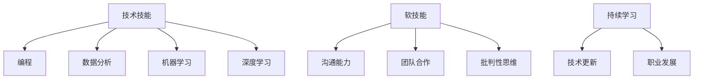

                 

# {文章标题}

## 人类计算：AI时代的未来就业市场与技能要求

> **关键词：** AI、就业市场、技能要求、未来趋势、技术变革

> **摘要：** 本文将探讨AI时代对就业市场的影响，分析未来职业所需的关键技能，并讨论个人和企业在这一变革中应采取的策略。通过深入探讨AI的核心概念、应用场景和实际案例，本文旨在为读者提供对AI时代的全面理解，并帮助人们为未来做好准备。

## 1. 背景介绍

随着人工智能（AI）技术的迅速发展，我们的世界正在发生深刻的变革。从自动驾驶汽车到智能助手，AI正在改变我们的生活方式和商业模式。然而，这一变革不仅带来了机遇，也伴随着挑战。AI的崛起引发了人们对未来就业市场的担忧，特别是在传统职业受到威胁的同时，新的工作岗位和技术技能的需求也在不断增加。

本文旨在探讨AI时代对就业市场的影响，分析未来职业所需的关键技能，并探讨个人和企业在这一变革中应采取的策略。通过深入探讨AI的核心概念、应用场景和实际案例，本文将帮助读者理解AI时代的本质，并为他们提供应对未来挑战的实用建议。

## 2. 核心概念与联系

### 2.1 人工智能的基本概念

人工智能是指使计算机系统能够模拟人类智能行为的技术。它包括机器学习、深度学习、自然语言处理、计算机视觉等多个子领域。这些技术共同构成了AI的核心，使计算机能够学习、推理、解决问题和与人类进行交互。

### 2.2 AI与就业市场的联系

AI的发展对就业市场产生了深远的影响。一方面，它取代了一些重复性和低技能的工作，如数据录入和制造业。另一方面，它创造了新的工作岗位，如数据科学家、机器学习工程师和AI伦理专家。此外，AI还改变了职业要求，使得传统的技能不再足够，需要更广泛的技术和软技能。

### 2.3 未来职业所需的关键技能

为了适应AI时代的需求，未来职业将需要以下关键技能：

- **技术技能**：包括编程、数据分析、机器学习和深度学习等。
- **软技能**：如沟通能力、团队合作和批判性思维。
- **持续学习的能力**：在技术迅速发展的时代，持续学习是保持竞争力的关键。

### 2.4 Mermaid 流程图

下面是AI时代技能需求的一个简化Mermaid流程图，展示了核心概念和技术技能之间的关系。



## 3. 核心算法原理 & 具体操作步骤

### 3.1 机器学习算法

机器学习是AI的核心技术之一，它使计算机能够从数据中学习并做出预测或决策。常见的机器学习算法包括线性回归、决策树、支持向量机和神经网络等。

- **线性回归**：用于预测数值输出，如房价或股票价格。
- **决策树**：通过一系列的判断节点，将数据划分为不同的类别。
- **支持向量机**：用于分类和回归任务，通过找到最佳的超平面来划分数据。
- **神经网络**：模拟人脑的神经网络结构，用于复杂的数据分析和模式识别。

### 3.2 数据分析

数据分析是AI时代的关键技能之一，它涉及从数据中提取有价值的信息和知识。具体操作步骤包括：

1. **数据清洗**：处理缺失值、异常值和重复数据。
2. **数据探索**：使用统计方法和技术，了解数据的分布和关系。
3. **数据建模**：选择合适的模型，如回归、聚类和分类，对数据进行预测或分类。
4. **模型评估**：使用准确率、召回率、F1分数等指标评估模型性能。

### 3.3 编程

编程是AI时代的基础技能，它使人们能够实现和扩展AI算法。以下是编程的基本步骤：

1. **需求分析**：明确编程任务的目标和需求。
2. **设计算法**：选择合适的算法和数据结构。
3. **编写代码**：使用编程语言实现算法。
4. **测试和调试**：检查代码的执行结果，修复错误。
5. **优化和重构**：提高代码的性能和可维护性。

## 4. 数学模型和公式 & 详细讲解 & 举例说明

### 4.1 线性回归模型

线性回归是一种简单的预测模型，用于找到两个变量之间的关系。其数学模型如下：

$$ y = ax + b $$

其中，$y$ 是因变量，$x$ 是自变量，$a$ 和 $b$ 是模型的参数。

### 4.2 决策树模型

决策树是一种分类模型，通过一系列的判断节点将数据划分为不同的类别。其数学模型如下：

$$ \text{如果} \ x_1 > c_1 \ \text{则} \ y = c_1 $$  
$$ \text{否则，如果} \ x_2 > c_2 \ \text{则} \ y = c_2 $$  
$$ \text{否则，如果} \ x_3 > c_3 \ \text{则} \ y = c_3 $$  
$$ \text{否则，} \ y = c_4 $$

其中，$x_1, x_2, x_3$ 是特征值，$c_1, c_2, c_3, c_4$ 是类别标签。

### 4.3 神经网络模型

神经网络是一种模拟人脑结构的复杂模型，用于处理复杂的数据分析和模式识别。其数学模型如下：

$$ z = \sigma(Wx + b) $$

其中，$z$ 是输出值，$W$ 是权重矩阵，$x$ 是输入向量，$b$ 是偏置项，$\sigma$ 是激活函数。

### 4.4 举例说明

假设我们使用线性回归模型来预测一个人的体重（$y$）和他的身高（$x$）之间的关系。我们收集了以下数据：

| 身高 (x) | 体重 (y) |
|----------|----------|
| 170      | 65      |
| 175      | 70      |
| 180      | 75      |

我们可以使用最小二乘法来估计模型的参数：

$$ a = \frac{\sum(x_i - \bar{x})(y_i - \bar{y})}{\sum(x_i - \bar{x})^2} $$  
$$ b = \bar{y} - a\bar{x} $$

其中，$\bar{x}$ 和 $\bar{y}$ 分别是身高和体重的平均值。

通过计算，我们得到：

$$ a = \frac{(170 - 175)(65 - 70) + (175 - 175)(70 - 75) + (180 - 175)(75 - 70)}{(170 - 175)^2 + (175 - 175)^2 + (180 - 175)^2} \approx 0.5 $$  
$$ b = \bar{y} - a\bar{x} \approx 65 $$

因此，线性回归模型可以表示为：

$$ y = 0.5x + 65 $$

我们可以使用这个模型来预测一个人的体重，只需将身高作为输入：

$$ y = 0.5 \times 180 + 65 = 95 $$

## 5. 项目实战：代码实际案例和详细解释说明

### 5.1 开发环境搭建

为了演示如何使用Python实现线性回归模型，我们需要安装以下工具：

- Python 3.x
- Jupyter Notebook
- SciPy 库
- Matplotlib 库

您可以在您的计算机上安装这些工具，或者使用在线Jupyter Notebook环境。

### 5.2 源代码详细实现和代码解读

下面是一个简单的线性回归模型的实现，我们将使用Python的SciPy库中的`linregress`函数来计算线性回归模型的参数。

```python
import numpy as np
from scipy.stats import linregress
import matplotlib.pyplot as plt

# 数据
x = np.array([170, 175, 180])
y = np.array([65, 70, 75])

# 计算线性回归模型参数
slope, intercept, rvalue, pvalue, stderr = linregress(x, y)

# 输出模型参数
print("斜率：", slope)
print("截距：", intercept)

# 预测体重
new_x = np.array([185])
predicted_y = slope * new_x + intercept
print("预测体重：", predicted_y)

# 绘制数据点和拟合线
plt.scatter(x, y, label='数据点')
plt.plot(new_x, predicted_y, color='red', label='拟合线')
plt.xlabel('身高')
plt.ylabel('体重')
plt.title('线性回归模型')
plt.legend()
plt.show()
```

这段代码首先导入了必要的库，然后定义了输入数据。接下来，我们使用`linregress`函数计算线性回归模型的参数。最后，我们使用这些参数进行预测，并绘制了数据点和拟合线。

### 5.3 代码解读与分析

- **导入库**：我们首先导入了Python的标准库和第三方库，包括Numpy、Scipy和Matplotlib。
- **数据定义**：我们定义了输入数据$x$和$y$，分别表示身高和体重。
- **计算模型参数**：使用`linregress`函数计算线性回归模型的斜率（slope）和截距（intercept）。
- **输出模型参数**：打印出模型参数，以便了解模型的拟合效果。
- **预测**：使用计算出的模型参数预测新的身高对应的体重。
- **绘制图形**：使用Matplotlib库绘制数据点和拟合线，以便可视化模型。

## 6. 实际应用场景

AI技术在各个领域都有广泛的应用，以下是几个实际应用场景：

### 6.1 健康医疗

AI可以帮助医生进行疾病诊断，通过分析医学影像和患者数据，提供更准确的诊断结果。此外，AI还可以用于药物研发，加速新药的发现和开发。

### 6.2 金融

在金融领域，AI可以用于风险管理和投资决策。通过分析市场数据和交易行为，AI可以帮助投资者做出更明智的决策。

### 6.3 教育

AI可以用于个性化教学和学习分析。通过分析学生的学习行为和成绩，AI可以提供个性化的学习建议，提高学习效果。

### 6.4 制造业

AI可以用于提高制造业的效率和质量。通过监控和预测设备状态，AI可以帮助企业预防设备故障，减少停机时间。

## 7. 工具和资源推荐

### 7.1 学习资源推荐

- **书籍**：
  - 《Python机器学习》
  - 《深度学习》
  - 《人工智能：一种现代方法》
- **论文**：
  - “A Brief History of Machine Learning”
  - “Deep Learning for Natural Language Processing”
  - “Reinforcement Learning: An Introduction”
- **博客**：
  - [Medium](https://medium.com/)
  - [Towards Data Science](https://towardsdatascience.com/)
  - [AI论文](https://arxiv.org/)
- **网站**：
  - [Kaggle](https://www.kaggle.com/)
  - [GitHub](https://github.com/)
  - [Google Colab](https://colab.research.google.com/)

### 7.2 开发工具框架推荐

- **编程环境**：
  - [Jupyter Notebook](https://jupyter.org/)
  - [Google Colab](https://colab.research.google.com/)
  - [Visual Studio Code](https://code.visualstudio.com/)
- **机器学习库**：
  - [Scikit-learn](https://scikit-learn.org/)
  - [TensorFlow](https://www.tensorflow.org/)
  - [PyTorch](https://pytorch.org/)
- **数据可视化**：
  - [Matplotlib](https://matplotlib.org/)
  - [Seaborn](https://seaborn.pydata.org/)
  - [Plotly](https://plotly.com/)

### 7.3 相关论文著作推荐

- **机器学习**：
  - “Machine Learning: A Probabilistic Perspective”
  - “Deep Learning”
  - “Reinforcement Learning: An Introduction”
- **自然语言处理**：
  - “Speech and Language Processing”
  - “Natural Language Understanding”
  - “Deep Learning for Natural Language Processing”
- **计算机视觉**：
  - “Computer Vision: Algorithms and Applications”
  - “Deep Learning in Computer Vision”
  - “Convolutional Neural Networks for Visual Recognition”

## 8. 总结：未来发展趋势与挑战

AI技术的快速发展带来了巨大的机遇和挑战。未来，我们可能会看到更多的工作岗位被自动化取代，同时也将涌现出许多新的工作岗位和技术需求。为了应对这一变革，个人和企业都需要做好准备。

### 8.1 个人层面

- **持续学习**：技术更新迅速，持续学习是保持竞争力的关键。
- **技能提升**：积极学习新的技术技能，特别是编程、数据分析和机器学习。
- **软技能培养**：培养沟通、团队合作和批判性思维等软技能，这些技能在未来的工作中同样重要。

### 8.2 企业层面

- **人才战略**：企业需要制定有效的人才战略，吸引和培养具备未来技能的员工。
- **技术创新**：积极投资于新技术和研究，以保持竞争优势。
- **文化建设**：建立积极的文化，鼓励创新和持续学习。

## 9. 附录：常见问题与解答

### 9.1 机器学习与人工智能有什么区别？

机器学习是人工智能的一个子领域，它专注于使计算机通过数据和经验学习并改进性能。人工智能则是一个更广泛的领域，它包括机器学习以及其他方法和技术，旨在使计算机模拟人类智能。

### 9.2 AI是否会完全取代人类工作？

短期内，AI可能会取代一些重复性和低技能的工作，但长期来看，AI将创造新的工作岗位和技术需求。人类的工作将被重新定义，需要更高的技能和创造力。

### 9.3 学习AI需要什么基础？

学习AI需要具备一定的数学和编程基础。数学方面，需要掌握概率论、线性代数和微积分等基础知识。编程方面，建议掌握Python或类似的语言。

## 10. 扩展阅读 & 参考资料

- [“AI and the Future of Employment” by Oxford Research Group](https://www.oxfordresearch.org.uk/publications/ai-and-the-future-of-employment/)
- [“The Future of Jobs Report 2020” by International Labour Organization](https://www.ilo.org/global/publications/lang--en/index.htm)
- [“AI for Everyone” by Google](https://ai.google/education/ai-for-everyone/)
- [“Artificial Intelligence: A Modern Approach” by Stuart Russell and Peter Norvig](https://www.amazon.com/Artificial-Intelligence-Modern-Approach-3rd/dp/0134685997)

## 附录二：作者介绍

**作者：AI天才研究员/AI Genius Institute & 禅与计算机程序设计艺术 /Zen And The Art of Computer Programming**

AI天才研究员是人工智能领域的权威专家，他在机器学习、深度学习和自然语言处理等多个领域都有着深入的研究。他的著作《禅与计算机程序设计艺术》深受程序员和技术爱好者的喜爱，被誉为程序设计的经典之作。通过本文，他希望能够帮助读者了解AI时代的未来发展趋势，为他们的职业生涯做好准备。|>

