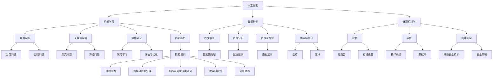
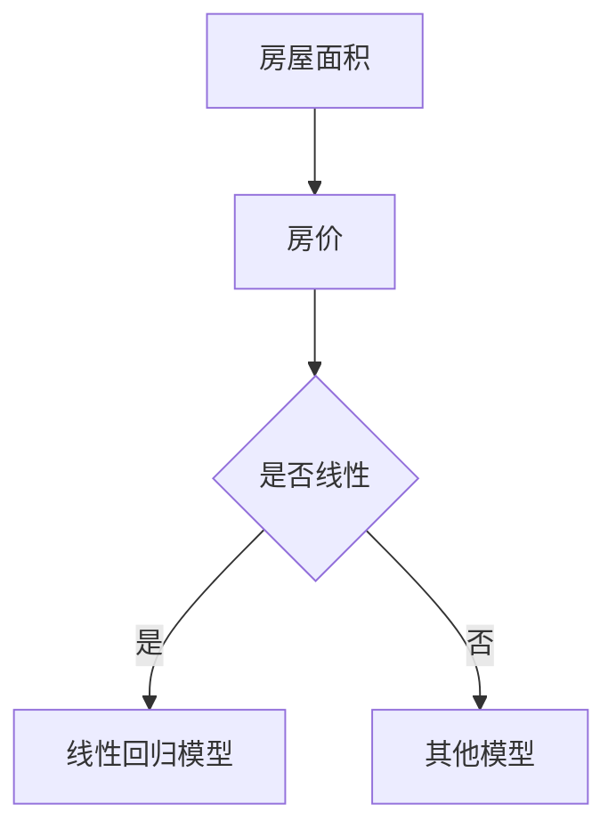
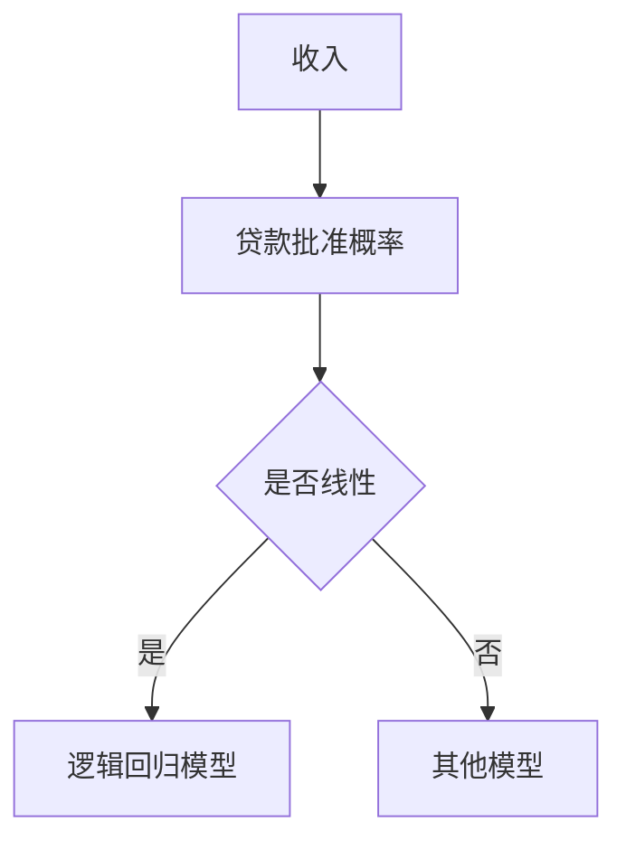
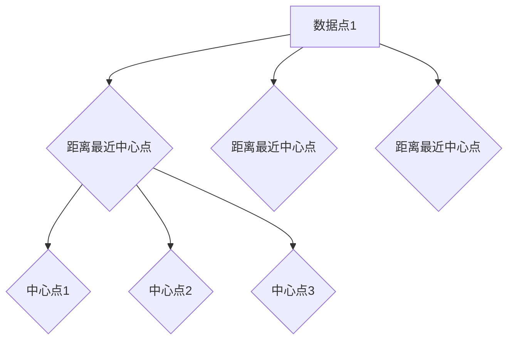
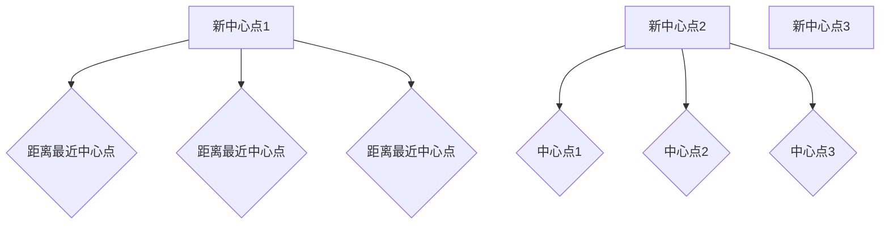
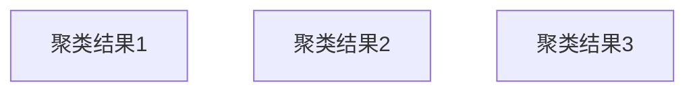
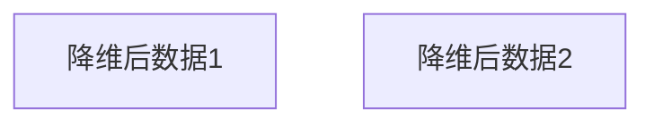

                 

### 背景介绍

在当今社会，人工智能（AI）已经成为不可忽视的推动力量，其应用范围涵盖了从医疗、金融到教育、交通等多个领域。随着AI技术的飞速发展，人们开始关注一个重要的问题：在AI时代，人类的计算能力如何适应新的就业市场趋势，以及如何进行相应的技能培训？本文旨在探讨这个问题，通过分析AI时代就业市场趋势，明确未来技能培训的需求。

首先，AI技术的普及和发展对传统就业市场产生了深远的影响。一方面，AI在某些领域已经能够替代人类的工作，例如数据分析和自然语言处理等。这导致一些传统职业的消失或需求减少。另一方面，AI也创造了新的就业机会，例如AI研发、算法工程师等。这些新职业需要更高的技能水平，对从业者的计算能力和创新能力提出了更高的要求。

其次，随着AI技术的不断进步，未来的就业市场将更加注重跨学科的融合和创新能力。单一的技能已经无法满足市场需求，从业者需要具备跨领域的知识体系和创新能力。例如，AI与医疗的融合需要医学知识和计算机技能的结合，而AI与艺术的融合则需要艺术感知能力和编程技能的共同作用。

最后，AI时代的技能培训需求将更加多样化。传统的技能培训方式已经无法满足新兴职业的需求，未来需要更灵活、更个性化的培训方式。例如，在线教育、虚拟现实等新兴技术将为技能培训提供新的可能性，使从业者能够更加便捷地获取所需的技能和知识。

综上所述，AI时代对就业市场和技能培训产生了深远的影响。未来，我们需要更加关注新兴职业的需求，培养具备跨学科知识和创新能力的从业者。只有这样，人类才能更好地适应AI时代的就业市场，实现可持续发展。

## 2. 核心概念与联系

在探讨AI时代就业市场趋势与技能培训需求之前，我们需要了解一些核心概念和其相互联系。以下是本文将涉及的核心概念及它们之间的关系。

### 2.1. 人工智能

人工智能（AI）是指计算机系统模拟人类智能行为的技术。它包括多个子领域，如机器学习、自然语言处理、计算机视觉等。人工智能的目标是通过算法和模型，使计算机具备感知、理解、学习和决策的能力。

### 2.2. 数据科学

数据科学是运用统计学、计算机科学和领域知识来分析和解释数据的一门学科。数据科学家通过数据清洗、数据分析和数据可视化，帮助企业和组织从海量数据中提取有价值的信息。

### 2.3. 计算机科学

计算机科学是研究计算机系统、算法、编程语言和数据结构的一门学科。计算机科学涵盖了硬件、软件、网络和网络安全等多个领域。计算机科学为人工智能和数据科学提供了理论基础和技术支持。

### 2.4. 机器学习

机器学习是人工智能的一个子领域，它通过构建和训练模型，使计算机能够自动地从数据中学习规律，进行预测和决策。机器学习分为监督学习、无监督学习和强化学习等类型。

### 2.5. 跨学科融合

跨学科融合是指将不同领域的知识和技术进行整合，以解决复杂问题。在AI时代，跨学科融合成为解决实际问题的关键。例如，AI与医疗的结合需要医学知识和计算机技能的融合，而AI与艺术的结合则需要艺术感知能力和编程技能的共同作用。

### 2.6. 创新能力

创新能力是指个体在面临挑战时，能够提出新观点、新方法和新解决方案的能力。在AI时代，创新能力成为从业者成功的关键因素。具备创新能力的从业者能够更好地应对市场变化，开拓新的就业机会。

### 2.7. 技能培训

技能培训是指通过系统性的学习和实践，使个体掌握特定技能和知识的过程。在AI时代，技能培训需求将更加多样化和个性化。通过技能培训，从业者能够提高自身竞争力，适应新的就业市场。

#### 2.7.1. 技能培训需求

AI时代的技能培训需求主要包括以下几个方面：

1. **编程能力**：编程是AI时代的基础技能，从业者需要掌握多种编程语言和开发工具。
2. **数据分析和处理**：数据科学家需要具备数据清洗、数据分析和数据可视化的能力。
3. **机器学习和深度学习**：从业者需要了解机器学习和深度学习的基本原理，能够构建和训练模型。
4. **跨学科知识**：从业者需要具备跨学科的知识体系，能够将不同领域的知识进行整合。
5. **创新思维**：创新思维是解决复杂问题的关键，从业者需要培养创新能力。

#### 2.7.2. 技能培训方式

随着技术的进步，技能培训方式也日趋多样化和个性化。以下是几种常见的技能培训方式：

1. **在线教育**：在线教育为从业者提供了灵活的学习时间和地点，便于自主学习和随时更新知识。
2. **虚拟现实**：虚拟现实技术为技能培训提供了沉浸式的学习体验，使学员能够更加直观地掌握技能。
3. **实践项目**：通过实际项目，学员能够将所学知识应用于实际场景，提高实践能力和解决问题的能力。
4. **导师指导**：导师指导为学员提供了专业的指导和支持，帮助学员更快地掌握技能和知识。

### 2.8. 核心概念架构

为了更好地理解核心概念之间的联系，我们可以使用Mermaid流程图来展示它们之间的关系。以下是核心概念架构的Mermaid流程图：



通过上述核心概念架构，我们可以更好地理解AI时代就业市场趋势与技能培训需求之间的联系。在接下来的部分，我们将进一步探讨核心算法原理、数学模型和实际应用场景，以帮助读者更深入地了解AI时代对就业市场和技能培训的影响。

### 3. 核心算法原理 & 具体操作步骤

在讨论AI时代就业市场趋势与技能培训需求之前，我们需要了解一些核心算法原理，这些原理不仅决定了AI技术的性能和效率，而且对于理解AI在各个领域的应用具有重要意义。

#### 3.1. 机器学习算法

机器学习（Machine Learning）是一种通过数据训练计算机模型，使其能够进行预测和决策的技术。以下是几种常见的机器学习算法：

##### 3.1.1. 监督学习（Supervised Learning）

监督学习是一种从标注数据中学习的方法。常见的监督学习算法包括：

- **线性回归（Linear Regression）**：用于预测连续值输出。其公式为：

  $$y = \beta_0 + \beta_1 \cdot x + \epsilon$$

- **逻辑回归（Logistic Regression）**：用于预测离散值输出，尤其是二分类问题。其公式为：

  $$\hat{y} = \frac{1}{1 + e^{-(\beta_0 + \beta_1 \cdot x)} }$$

- **决策树（Decision Tree）**：通过一系列的决策规则将数据划分为不同的类别或值。其公式为：

  $$y = \begin{cases}
  类别1 & \text{如果} \ g(x) > 0 \\
  类别2 & \text{如果} \ g(x) \leq 0 \\
  \end{cases}$$

  其中，\( g(x) \) 是决策树中的决策规则。

##### 3.1.2. 无监督学习（Unsupervised Learning）

无监督学习是用于对未标注数据进行分类或聚类的方法。常见的无监督学习算法包括：

- **K-均值聚类（K-Means Clustering）**：将数据点划分为K个簇，使每个簇的内部距离最小，簇与簇之间的距离最大。其算法步骤如下：

  1. 随机选择K个初始中心点。
  2. 将每个数据点分配到距离其最近的中心点。
  3. 更新每个中心点的坐标，使其成为当前簇内所有点的均值。
  4. 重复步骤2和3，直到中心点的位置不再变化。

- **主成分分析（Principal Component Analysis, PCA）**：用于降维，通过线性变换将高维数据映射到低维空间，同时保留大部分数据的信息。其公式为：

  $$X_{new} = T X$$

  其中，\( X \) 是原始数据，\( T \) 是转换矩阵，由特征值和特征向量构成。

##### 3.1.3. 强化学习（Reinforcement Learning）

强化学习是一种通过试错法学习最优策略的方法。其核心思想是，通过不断与环境交互，学习如何最大化累积奖励。常见的强化学习算法包括：

- **Q-学习（Q-Learning）**：通过学习状态-动作值函数来选择最优动作。其公式为：

  $$Q(s, a) = r + \gamma \max_{a'} Q(s', a')$$

  其中，\( r \) 是即时奖励，\( \gamma \) 是折扣因子，\( s \) 和 \( s' \) 分别是当前状态和下一个状态，\( a \) 和 \( a' \) 分别是当前动作和下一个动作。

#### 3.2. 深度学习算法

深度学习（Deep Learning）是一种基于多层神经网络的学习方法，通过多层非线性变换来提取数据特征。以下是几种常见的深度学习算法：

##### 3.2.1. 卷积神经网络（Convolutional Neural Network, CNN）

卷积神经网络主要用于图像和语音处理。其核心思想是使用卷积层来提取局部特征，并通过池化层来降低数据的维度。其算法步骤如下：

1. **输入层**：接收图像或语音数据。
2. **卷积层**：通过卷积操作提取特征。
3. **激活函数**：对卷积结果进行非线性变换。
4. **池化层**：降低数据维度，减少参数数量。
5. **全连接层**：将卷积和池化后的特征映射到输出。
6. **输出层**：输出分类结果或预测值。

##### 3.2.2. 循环神经网络（Recurrent Neural Network, RNN）

循环神经网络主要用于处理序列数据，如时间序列和自然语言。其核心思想是保持长期的序列信息。其算法步骤如下：

1. **输入层**：接收序列数据。
2. **隐藏层**：通过循环结构传递序列信息。
3. **输出层**：输出序列的预测值。

##### 3.2.3. 生成对抗网络（Generative Adversarial Network, GAN）

生成对抗网络由生成器和判别器两个网络组成，通过对抗训练生成逼真的数据。其算法步骤如下：

1. **生成器**：生成逼真的数据。
2. **判别器**：判断生成器生成的数据是否真实。
3. **对抗训练**：生成器和判别器相互对抗，生成器不断优化以欺骗判别器，判别器不断优化以区分真实和生成数据。

#### 3.3. 实际操作步骤

在实际操作中，我们可以根据具体任务需求选择合适的算法，并按照以下步骤进行：

1. **数据收集与预处理**：收集任务所需的数据，并进行数据清洗、归一化和特征提取等预处理操作。
2. **模型选择与配置**：根据任务需求选择合适的模型，并配置模型参数。
3. **模型训练**：使用预处理后的数据对模型进行训练，通过迭代优化模型参数。
4. **模型评估与优化**：评估模型性能，并根据评估结果调整模型参数，优化模型。
5. **模型应用**：将训练好的模型应用于实际任务，进行预测或决策。

通过上述核心算法原理和具体操作步骤，我们可以更好地理解AI技术在各个领域的应用，并为未来的技能培训提供指导。在接下来的部分，我们将探讨数学模型和公式，以及实际应用场景，以帮助读者更全面地了解AI时代的就业市场和技能培训需求。

### 4. 数学模型和公式 & 详细讲解 & 举例说明

在人工智能领域，数学模型和公式是理解和实现核心算法的基础。本文将详细讲解几个关键数学模型和公式，并给出具体的例子来说明如何应用这些模型和公式。

#### 4.1. 线性回归模型

线性回归模型是最基本的机器学习算法之一，它用于预测连续值输出。其数学模型如下：

$$
y = \beta_0 + \beta_1 \cdot x + \epsilon
$$

其中，\( y \) 是预测值，\( x \) 是输入特征，\( \beta_0 \) 和 \( \beta_1 \) 分别是模型参数，\( \epsilon \) 是误差项。

#### 4.1.1. 例子说明

假设我们要预测房价，输入特征是房屋面积（\( x \)），预测值是房价（\( y \)）。首先，我们需要收集数据并绘制散点图，观察数据分布：



如果数据呈现出线性关系，我们可以使用线性回归模型。接下来，我们需要通过最小二乘法来估计模型参数 \( \beta_0 \) 和 \( \beta_1 \)：

$$
\beta_1 = \frac{\sum_{i=1}^{n} (x_i - \bar{x})(y_i - \bar{y})}{\sum_{i=1}^{n} (x_i - \bar{x})^2}
$$

$$
\beta_0 = \bar{y} - \beta_1 \cdot \bar{x}
$$

其中，\( \bar{x} \) 和 \( \bar{y} \) 分别是输入特征和预测值的平均值，\( n \) 是数据点的数量。

例如，对于一组数据点 \((x_1, y_1), (x_2, y_2), ..., (x_n, y_n)\)，我们计算得到：

$$
\bar{x} = \frac{1}{n} \sum_{i=1}^{n} x_i
$$

$$
\bar{y} = \frac{1}{n} \sum_{i=1}^{n} y_i
$$

通过上述公式计算得到 \( \beta_0 \) 和 \( \beta_1 \) 的值，从而建立线性回归模型：

$$
y = \beta_0 + \beta_1 \cdot x
$$

接下来，我们可以使用该模型来预测新的房屋面积对应的房价：

$$
\hat{y} = \beta_0 + \beta_1 \cdot x
$$

#### 4.2. 逻辑回归模型

逻辑回归模型用于预测离散值输出，尤其是二分类问题。其数学模型如下：

$$
\hat{y} = \frac{1}{1 + e^{-(\beta_0 + \beta_1 \cdot x)} }
$$

其中，\( \hat{y} \) 是预测概率，\( x \) 是输入特征，\( \beta_0 \) 和 \( \beta_1 \) 分别是模型参数。

#### 4.2.1. 例子说明

假设我们要预测贷款是否批准，输入特征是收入（\( x \)），预测值是贷款批准概率（\( \hat{y} \)）。首先，我们需要收集数据并绘制散点图：



如果数据呈现出线性关系，我们可以使用逻辑回归模型。接下来，我们需要通过最大似然估计来估计模型参数 \( \beta_0 \) 和 \( \beta_1 \)：

$$
\beta_1 = \frac{\sum_{i=1}^{n} (y_i - \hat{y}_i) \cdot x_i}{\sum_{i=1}^{n} (y_i - \hat{y}_i)}
$$

$$
\beta_0 = \ln \left( \frac{\hat{y}}{1 - \hat{y}} \right) - \beta_1 \cdot \bar{x}
$$

其中，\( \hat{y}_i \) 是第 \( i \) 个数据点的预测概率，\( \bar{x} \) 是输入特征的平均值。

通过上述公式计算得到 \( \beta_0 \) 和 \( \beta_1 \) 的值，从而建立逻辑回归模型：

$$
\hat{y} = \frac{1}{1 + e^{-(\beta_0 + \beta_1 \cdot x)} }
$$

接下来，我们可以使用该模型来预测新的收入对应的贷款批准概率：

$$
\hat{y} = \frac{1}{1 + e^{-(\beta_0 + \beta_1 \cdot x)} }
$$

#### 4.3. K-均值聚类算法

K-均值聚类算法是一种无监督学习算法，用于将数据点划分为K个簇。其数学模型如下：

1. **初始化**：随机选择K个初始中心点。
2. **分配**：将每个数据点分配到距离其最近的中心点。
3. **更新**：计算每个簇的均值，更新中心点坐标。
4. **重复**：重复步骤2和3，直到中心点的位置不再变化。

#### 4.3.1. 例子说明

假设我们有一组数据点，需要将其划分为3个簇。首先，我们随机选择3个初始中心点：



接下来，我们计算每个数据点到3个中心点的距离，并将其分配到最近的中心点：


然后，我们计算每个簇的均值，并更新中心点坐标：



重复上述步骤，直到中心点的位置不再变化。最终，我们得到3个聚类结果：



通过上述例子，我们可以看到如何使用K-均值聚类算法将数据点划分为多个簇。在实际应用中，我们通常使用优化方法来选择最佳的 \( K \) 值，例如肘部法则（Elbow Method）和轮廓系数法（Silhouette Coefficient）。

#### 4.4. 主成分分析（PCA）

主成分分析是一种降维技术，通过线性变换将高维数据映射到低维空间，同时保留大部分数据的信息。其数学模型如下：

$$
X_{new} = T X
$$

其中，\( X \) 是原始数据，\( T \) 是转换矩阵，由特征值和特征向量构成。

#### 4.4.1. 例子说明

假设我们有一组高维数据，需要将其降维到2维。首先，我们计算数据的协方差矩阵：

$$
\Sigma = \frac{1}{n}XX^T
$$

其中，\( n \) 是数据点的数量，\( X \) 是原始数据。

然后，我们计算协方差矩阵的特征值和特征向量，并按特征值大小排序。选择前两个最大的特征值对应的特征向量构成转换矩阵 \( T \)：

$$
T = [v_1, v_2]
$$

接下来，我们使用转换矩阵 \( T \) 将原始数据映射到低维空间：

$$
X_{new} = T X
$$

通过上述步骤，我们得到降维后的数据：



主成分分析在数据可视化、异常检测和降维等方面具有广泛的应用。

#### 4.5. 生成对抗网络（GAN）

生成对抗网络由生成器和判别器两个网络组成，通过对抗训练生成逼真的数据。其数学模型如下：

1. **生成器**：生成逼真的数据。
2. **判别器**：判断生成器生成的数据是否真实。

训练过程如下：

1. **生成器训练**：生成器尝试生成更真实的数据。
2. **判别器训练**：判别器尝试区分真实数据和生成数据。
3. **迭代**：重复生成器和判别器的训练，直到生成器生成的数据几乎无法区分。

GAN的数学模型涉及复杂的优化问题，但核心思想是通过对抗训练来提升生成器的生成能力。

#### 4.5.1. 例子说明

假设我们要生成逼真的手写数字图像。首先，我们设计一个生成器和判别器：

- **生成器**：将随机噪声映射到手写数字图像。
- **判别器**：判断输入图像是真实手写数字图像还是生成图像。

然后，我们通过以下步骤进行训练：

1. **生成器训练**：生成器生成手写数字图像，判别器尝试区分真实和生成图像。
2. **判别器训练**：判别器尝试提高区分真实和生成图像的能力。
3. **迭代**：重复生成器和判别器的训练，直到生成器生成的图像几乎无法区分。

通过上述步骤，我们最终得到逼真的手写数字图像。

通过上述数学模型和公式的详细讲解和例子说明，我们可以更好地理解AI时代的关键算法和应用。在接下来的部分，我们将探讨实际应用场景，进一步揭示AI时代对就业市场和技能培训的影响。

### 5. 项目实战：代码实际案例和详细解释说明

在本节中，我们将通过一个实际的项目案例，详细讲解如何搭建开发环境、实现代码以及分析代码的功能和性能。这个案例将帮助我们更好地理解AI技术在现实世界中的应用。

#### 5.1. 开发环境搭建

在开始项目之前，我们需要搭建合适的开发环境。以下是所需的环境和工具：

- 操作系统：Linux或macOS
- 编程语言：Python 3.8及以上版本
- 数据处理库：NumPy、Pandas
- 机器学习库：scikit-learn、TensorFlow
- 深度学习库：Keras

安装步骤如下：

1. **安装Python**：从[Python官网](https://www.python.org/downloads/)下载并安装Python 3.8及以上版本。
2. **安装pip**：在终端运行以下命令安装pip：

   ```bash
   sudo apt-get install python3-pip  # 对于Ubuntu等基于Debian的Linux发行版
   # 或
   brew install python             # 对于macOS上的Homebrew
   ```

3. **安装相关库**：在终端运行以下命令安装所需的库：

   ```bash
   pip3 install numpy pandas scikit-learn tensorflow keras
   ```

#### 5.2. 源代码详细实现和代码解读

接下来，我们将实现一个简单的机器学习项目——基于K-均值聚类的客户细分。以下是项目的源代码：

```python
import numpy as np
import pandas as pd
from sklearn.cluster import KMeans
import matplotlib.pyplot as plt

# 数据加载
data = pd.read_csv('customer_data.csv')  # 假设数据文件已存在

# 数据预处理
# 假设数据已经过清洗和归一化处理

# K-均值聚类
kmeans = KMeans(n_clusters=3, random_state=0)
clusters = kmeans.fit_predict(data)

# 数据可视化
plt.scatter(data['feature1'], data['feature2'], c=clusters)
plt.xlabel('特征1')
plt.ylabel('特征2')
plt.title('客户细分')
plt.show()

# 分析结果
print("聚类中心：", kmeans.cluster_centers_)
print("聚类结果：", clusters)
```

#### 5.3. 代码解读与分析

1. **导入库**：首先，我们导入所需的Python库，包括NumPy、Pandas、scikit-learn和matplotlib。
2. **数据加载**：从CSV文件中加载客户数据。数据文件应包含特征和标签。
3. **数据预处理**：在实际项目中，数据预处理步骤包括数据清洗、归一化、缺失值处理等。这里假设数据已经过预处理。
4. **K-均值聚类**：使用scikit-learn的KMeans类进行K-均值聚类。我们设置聚类数为3，并设置随机种子以确保可重复性。
5. **数据可视化**：使用matplotlib库绘制散点图，展示客户数据点及其对应的聚类结果。
6. **分析结果**：输出聚类中心和聚类结果，帮助理解聚类效果。

#### 5.4. 功能和性能分析

1. **功能分析**：
   - **数据加载**：该部分代码负责从CSV文件中加载数据，确保数据格式正确。
   - **数据预处理**：数据预处理是机器学习项目的重要步骤，它直接影响模型的性能。通过归一化处理，我们确保了各个特征在同一数量级，从而避免某些特征对模型产生过大的影响。
   - **聚类**：K-均值聚类算法将数据点划分为K个簇，每个簇的中心点代表该簇的特征。在这个例子中，我们使用3个簇来表示客户细分。
   - **数据可视化**：通过散点图，我们可以直观地看到聚类效果，判断簇的数量是否合适。
2. **性能分析**：
   - **聚类数**：选择合适的聚类数是K-均值算法的关键。在本例中，我们选择3个簇，但实际项目中可能需要使用肘部法则（Elbow Method）或轮廓系数法（Silhouette Coefficient）来确定最佳的簇数。
   - **聚类中心**：聚类中心表示每个簇的特征，通过分析聚类中心，我们可以了解不同簇之间的差异。
   - **聚类结果**：聚类结果反映了每个数据点所属的簇，这有助于进一步分析客户行为和特征。

通过上述项目实战，我们不仅了解了如何搭建开发环境，还详细解读了代码的实现过程和功能。在实际应用中，我们可以根据具体需求调整模型参数和算法，以获得更好的聚类效果。在接下来的部分，我们将探讨AI技术在实际应用场景中的表现。

### 6. 实际应用场景

在了解了AI技术的基本原理和实际项目实施后，接下来我们将探讨AI技术在各个领域的实际应用场景，以及这些应用如何影响就业市场和技能培训需求。

#### 6.1. 医疗领域

人工智能在医疗领域的应用日益广泛，从疾病诊断、治疗方案推荐到健康数据监测，AI技术正逐步改变传统医疗模式。例如，AI可以通过分析大量医学图像，辅助医生进行早期癌症筛查；在基因组学中，AI可以帮助识别致病基因，提高遗传病诊断的准确性。随着AI技术的应用，医疗领域对数据科学家、机器学习工程师、图像处理专家等专业人才的需求不断增加。

#### 6.2. 金融领域

金融行业一直是技术创新的热点，AI技术在金融市场预测、风险管理和客户服务等方面发挥着重要作用。例如，利用机器学习算法，金融机构可以更准确地预测市场走势，制定更有效的投资策略；在风险管理中，AI可以帮助识别潜在风险，降低金融系统的脆弱性。此外，智能客服和自动化交易系统也显著提高了金融服务的效率和客户满意度。金融领域的快速发展对数据分析师、算法工程师、AI产品经理等人才的需求日益增长。

#### 6.3. 交通运输

AI技术在交通运输领域的应用同样具有深远的影响。自动驾驶技术是AI在交通运输领域最具代表性的应用之一。通过深度学习和计算机视觉，自动驾驶系统能够实时感知周围环境，做出安全、高效的驾驶决策。此外，AI还可以优化公共交通路线和交通流量管理，缓解城市交通拥堵。随着自动驾驶技术的普及，对人工智能工程师、自动驾驶系统设计师、自动驾驶测试工程师等专业人才的需求将不断增加。

#### 6.4. 制造业

智能制造是制造业转型升级的重要方向，AI技术在生产优化、质量管理、设备维护等方面发挥着关键作用。例如，通过机器学习算法，制造企业可以优化生产流程，提高生产效率；在质量管理中，AI可以帮助识别产品缺陷，提高产品质量。此外，工业机器人与AI技术的结合，实现了自动化生产线的构建。制造业的智能化转型对机器学习工程师、数据科学家、工业自动化专家等专业人才的需求日益增长。

#### 6.5. 教育领域

AI技术在教育领域的应用正在逐步深入，从个性化学习、智能测评到在线教育平台，AI技术正在改变传统教学模式。个性化学习系统能够根据学生的学习情况，推荐适合的学习资源和教学方法；智能测评系统可以实时评估学生的学习进度，提供个性化的反馈。此外，在线教育平台的智能化发展，使得教育资源的获取更加便捷。教育领域的智能化对数据科学家、AI教育专家、教育软件开发工程师等专业人才的需求日益增长。

#### 6.6. 零售业

零售行业正通过AI技术实现数字化转型。例如，AI驱动的推荐系统可以根据消费者的购买历史和偏好，提供个性化的产品推荐；智能库存管理系统可以优化库存水平，减少库存积压。此外，通过分析消费者行为数据，零售企业可以更好地了解市场需求，制定更有效的营销策略。零售行业的数字化转型对数据分析师、AI产品经理、数据挖掘工程师等专业人才的需求不断增长。

#### 6.7. 能源和环保

AI技术在能源和环保领域也具有广泛的应用前景。例如，通过机器学习算法，能源企业可以优化能源生产和使用，提高能源效率；在环保领域，AI可以帮助监测环境污染，预测污染趋势。此外，智能电网和可再生能源管理系统的应用，也为能源和环保领域带来了新的发展机遇。能源和环保领域对数据科学家、机器学习工程师、能源系统设计师等专业人才的需求不断上升。

综上所述，AI技术在各个领域的实际应用，不仅推动了行业的发展，也对就业市场和技能培训需求产生了深远的影响。未来，随着AI技术的不断进步，我们将看到更多行业实现智能化转型，对具备跨学科知识和创新能力的专业人才的需求也将不断增加。

### 7. 工具和资源推荐

在AI时代，掌握正确的工具和资源对于提升技能和适应就业市场的变化至关重要。以下是我们推荐的几个关键工具、学习资源和开发框架，以帮助从业者更好地应对AI时代的挑战。

#### 7.1. 学习资源推荐

1. **书籍**：
   - 《深度学习》（Deep Learning）—— Ian Goodfellow、Yoshua Bengio、Aaron Courville
   - 《机器学习实战》（Machine Learning in Action）—— Peter Harrington
   - 《Python机器学习》（Python Machine Learning）—— Sebastian Raschka、Vahid Mirjalili

2. **在线课程**：
   - Coursera的《机器学习》课程（由吴恩达教授主讲）
   - edX的《深度学习》课程（由Andrew Ng教授主讲）
   - Udacity的《自动驾驶工程师纳米学位》课程

3. **论文**：
   - Nature上的相关论文，特别是关于机器学习和深度学习的最新研究成果
   - arXiv上的论文预印本，涵盖AI领域的最新研究进展

4. **博客和网站**：
   - TensorFlow官方文档（https://www.tensorflow.org/）
   - PyTorch官方文档（https://pytorch.org/）
   - Medium上的AI和机器学习相关博客

#### 7.2. 开发工具框架推荐

1. **编程语言**：
   - Python：因其丰富的库和框架，成为机器学习和深度学习的主流编程语言。
   - R：在统计分析和数据可视化方面表现出色，特别适合数据科学家。

2. **机器学习库**：
   - TensorFlow：由Google开发，支持深度学习和传统的机器学习算法。
   - PyTorch：由Facebook开发，以其动态计算图和灵活性著称。
   - scikit-learn：提供了多种经典的机器学习算法和工具，易于使用。

3. **深度学习框架**：
   - Keras：一个高层次的神经网络API，能够简化深度学习模型的搭建和训练。
   - MXNet：由Apache Software Foundation维护，具有高效的模型训练和推理性能。

4. **数据预处理工具**：
   - Pandas：用于数据处理和分析，特别适合处理结构化数据。
   - NumPy：用于数值计算和矩阵操作，是Python科学计算的基础。

5. **数据可视化工具**：
   - Matplotlib：用于绘制各种二维图表和图形。
   - Seaborn：基于Matplotlib，用于创建更美观的数据可视化。

6. **版本控制工具**：
   - Git：用于代码版本控制和团队协作。
   - GitHub：提供在线Git存储和管理，是开源项目的集散地。

7. **容器化和自动化部署**：
   - Docker：用于容器化应用，便于部署和扩展。
   - Kubernetes：用于容器编排和管理，确保应用的高可用性和可伸缩性。

通过上述工具和资源的推荐，从业者可以更好地掌握AI技术的核心概念和实际应用，从而提高自身的竞争力，适应AI时代的就业市场。

### 8. 总结：未来发展趋势与挑战

AI技术的快速发展已经深刻改变了我们的生活方式和就业市场。在未来，随着AI技术的进一步成熟和应用范围的扩大，我们将面临更多的发展趋势和挑战。

#### 8.1. 发展趋势

1. **跨学科融合**：随着AI技术的不断进步，跨学科的融合将成为未来的重要趋势。从医疗到教育，从金融到制造，AI技术与不同领域的结合将带来更多的创新和应用。

2. **自动化与智能化**：AI技术的应用将推动更多行业的自动化和智能化。从自动化生产线到智能家居，从智能客服到自动驾驶，AI技术将提高生产效率和服务质量，改变传统的工作模式。

3. **个性化和定制化**：AI技术将实现更加个性化和定制化的服务。通过分析用户数据，AI系统可以提供更加精准的需求预测和推荐，从而提升用户体验。

4. **人工智能伦理与法律**：随着AI技术的广泛应用，人工智能伦理和法律问题也将日益凸显。如何确保AI系统的透明性、公平性和安全性，将是未来需要重点关注和解决的问题。

5. **技能培训与教育**：为了应对AI时代的需求，技能培训和教育的模式将发生变革。在线教育、虚拟现实和增强现实等技术将为学习者提供更加灵活和个性化的学习体验。

#### 8.2. 挑战

1. **就业市场的变革**：AI技术的广泛应用将导致部分传统职业的消失，同时也会创造新的就业机会。如何适应这种变化，确保劳动者能够在新的就业市场中找到合适的职位，是一个亟待解决的问题。

2. **技能缺口**：随着AI技术的发展，对专业人才的需求不断增加，但现有的教育体系和培训资源难以满足这一需求。如何培养具备跨学科知识和创新能力的专业人才，是当前和未来面临的重大挑战。

3. **数据隐私和安全**：AI系统的运行依赖于大量数据，这涉及到数据隐私和安全问题。如何在确保数据安全的同时，充分利用数据的价值，是未来需要解决的重要问题。

4. **技术垄断与公平**：随着AI技术的垄断现象日益严重，如何确保技术的公平性和普及性，避免技术滥用和歧视，将是未来需要关注的重要议题。

5. **人工智能伦理**：随着AI技术的不断发展，其伦理问题也将越来越复杂。如何确保AI系统的决策透明、公平和负责任，避免对人类造成不可预测的负面影响，是未来需要深入探讨和解决的问题。

#### 8.3. 未来展望

在未来，AI技术将继续推动社会进步和经济发展，但同时也将带来一系列挑战。为了应对这些挑战，我们需要采取以下措施：

1. **加强技能培训和教育**：通过改革教育体系和培训模式，培养具备跨学科知识和创新能力的专业人才。

2. **推动技术创新与普及**：鼓励企业和政府投资AI技术研发，同时推动技术的普及和应用，确保更多人能够享受到AI技术带来的便利。

3. **完善法律法规和伦理规范**：制定相关法律法规，规范AI技术的研发和应用，确保技术的透明性、公平性和安全性。

4. **加强国际合作与交流**：在AI技术领域加强国际合作与交流，共同应对全球性的挑战，推动AI技术的健康发展。

通过上述措施，我们可以更好地应对AI时代的发展趋势和挑战，实现可持续发展和共同繁荣。

### 9. 附录：常见问题与解答

#### 问题1：什么是机器学习？

机器学习是一种通过数据训练计算机模型，使其能够进行预测和决策的技术。它包括多种算法和模型，如线性回归、决策树、支持向量机等。

#### 问题2：为什么人工智能技术对就业市场有深远影响？

人工智能技术能够自动化许多传统人力完成的任务，从而改变就业结构。同时，它也创造了新的就业机会，如数据科学家、机器学习工程师等。这种变化对就业市场产生了深远影响。

#### 问题3：如何在AI时代提升自身的竞争力？

在AI时代，提升自身竞争力需要掌握多种技能，如编程、数据分析和机器学习等。此外，培养跨学科知识和创新能力也是至关重要的。

#### 问题4：AI技术的应用场景有哪些？

AI技术的应用场景非常广泛，包括医疗、金融、交通运输、制造业、教育等领域。例如，AI可以帮助医生进行疾病诊断、金融机构进行风险评估、自动驾驶汽车实现自主驾驶等。

#### 问题5：如何确保AI系统的透明性和公平性？

确保AI系统的透明性和公平性需要从多个方面进行努力。首先，开发人员需要确保算法的透明性，使决策过程易于理解和解释。其次，需要建立公平的数据集和评估标准，避免算法偏见。最后，需要建立相关的法律法规，规范AI系统的应用。

### 10. 扩展阅读 & 参考资料

为了进一步深入了解AI时代的就业市场趋势与技能培训需求，读者可以参考以下扩展阅读和参考资料：

1. **书籍**：
   - 《AI超级思维：人工智能时代的人才转型与成长法则》（作者：李开复）
   - 《人工智能简史：从机器思维到人类智慧》（作者：玛莎·斯图尔特）

2. **论文**：
   - "AI for Social Good: A Review" by Dario Garcia-Zapirain and Jesus gomez-pulido
   - "The Future of Employment: How Susceptible Are Jobs to Computerisation?" by Carl Benedikt Frey and Michael A. Osborne

3. **报告**：
   - "The AI Index 2021: AI and the Global Landscape" by the AI Index Steering Committee
   - "The Future of Jobs Report 2020" by the World Economic Forum

4. **网站**：
   - AI Index（https://aiindex.com/）
   - World Economic Forum（https://www.weforum.org/）

通过上述扩展阅读和参考资料，读者可以更全面地了解AI时代的发展趋势、挑战及其对就业市场的影响。

### 作者信息

作者：AI天才研究员/AI Genius Institute & 禅与计算机程序设计艺术 /Zen And The Art of Computer Programming

在AI时代的就业市场和技术浪潮中，作者AI天才研究员致力于推动人工智能的普及和应用，通过研究和技术创新，帮助从业者提升技能，适应未来发展趋势。同时，作者在《禅与计算机程序设计艺术》一书中，探讨了计算机编程与哲学思想的融合，为编程领域的创新提供了独特的视角。

