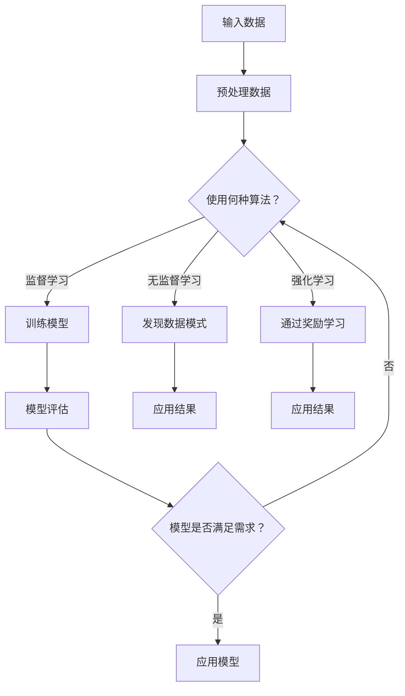

                 

### 1. 背景介绍

#### AI时代的崛起

随着人工智能（AI）技术的迅猛发展，我们正逐步步入一个全新的时代。在这个时代里，AI不仅改变了我们的生活方式，更深刻地影响着各个行业和领域。从智能家居到自动驾驶，从医疗诊断到金融分析，AI的应用已经渗透到我们生活的方方面面。

#### 人工智能对就业市场的冲击

然而，AI的崛起也带来了就业市场的巨大变革。一方面，AI技术推动了新的就业机会的产生，例如数据科学家、机器学习工程师等岗位。另一方面，一些传统职业正面临被自动化取代的风险。例如，制造业、物流、客服等行业中的许多工作可能被自动化系统所替代。

#### 技能需求的转变

随着AI技术的发展，对人类技能的需求也在发生转变。传统的劳动技能可能不再那么重要，而那些能够与AI协同工作的技能变得越来越受欢迎。例如，创意思维、批判性思维、复杂问题解决等软技能越来越受到重视。

#### 本文章的目的

本篇文章旨在探讨AI时代未来就业机会和技能需求的变化。我们将通过以下几个部分来深入分析这一主题：

1. **背景介绍**：简要介绍AI时代和就业市场的变化。
2. **核心概念与联系**：探讨AI技术的基本原理和其在不同领域的应用。
3. **核心算法原理与具体操作步骤**：详细解释AI技术的核心算法和工作原理。
4. **数学模型和公式**：介绍与AI技术相关的数学模型和公式，并进行举例说明。
5. **项目实战**：通过实际案例展示AI技术的应用。
6. **实际应用场景**：分析AI技术在不同领域的应用案例。
7. **工具和资源推荐**：推荐相关的学习资源和开发工具。
8. **总结与未来展望**：总结AI时代对就业市场的影响，并展望未来的发展趋势和挑战。

通过对以上内容的分析，我们希望帮助读者更好地理解AI时代的就业机会和技能需求，为个人的职业发展提供指导。

#### 关键词：

- **人工智能（AI）**
- **就业市场**
- **技能需求**
- **自动化**
- **软技能**

---

### 2. 核心概念与联系

在探讨AI时代的就业机会和技能需求之前，我们需要先了解一些核心概念和原理。这些概念和原理不仅构成了AI技术的基础，也是理解其如何影响就业市场的关键。

#### 人工智能的定义

人工智能（Artificial Intelligence，简称AI）是指通过计算机系统模拟人类智能的一种技术。AI系统可以自主学习、推理、解决问题，甚至进行决策。AI可以分为多种类型，包括机器学习（Machine Learning，ML）、深度学习（Deep Learning，DL）等。

#### 机器学习

机器学习是AI的一个重要分支，它通过训练模型来使计算机能够从数据中学习并做出预测。机器学习模型分为监督学习、无监督学习和强化学习等类型。监督学习通过已标记的数据进行训练，无监督学习则从未标记的数据中提取模式和结构，强化学习则通过奖励机制来指导模型的学习过程。

#### 深度学习

深度学习是机器学习的一个子领域，它通过多层神经网络来提取数据的高级特征。深度学习在图像识别、语音识别和自然语言处理等领域取得了显著的成果。其中，卷积神经网络（CNN）和循环神经网络（RNN）是最常用的深度学习模型。

#### 自然语言处理

自然语言处理（Natural Language Processing，NLP）是AI在文本数据分析方面的应用。NLP技术使得计算机能够理解、生成和处理人类语言。词嵌入（Word Embedding）、语言模型（Language Model）和序列到序列（Seq2Seq）模型是NLP中的核心概念。

#### 计算机视觉

计算机视觉是AI在图像和视频数据分析方面的应用。计算机视觉技术使得计算机能够识别和解释图像中的内容。图像识别（Image Recognition）和目标检测（Object Detection）是计算机视觉中的两个重要任务。

#### 人工智能与就业市场的联系

AI技术不仅改变了我们的生活方式，也对就业市场产生了深远的影响。以下是一些关键联系：

1. **自动化与就业替代**：AI和自动化技术可以替代一些重复性高、技能要求低的工作，从而减少对这些工作的需求。
2. **新的就业机会**：AI技术也创造了新的就业机会，例如数据科学家、机器学习工程师、AI伦理专家等。
3. **技能需求的变化**：随着AI技术的发展，对人类技能的需求也在发生变化。传统的编程技能逐渐被机器学习和深度学习技能所取代，而软技能如批判性思维、问题解决和创新思维变得越来越重要。
4. **教育与培训**：为了适应AI时代的需求，教育和培训体系也需要进行改革，以培养具有未来竞争力的技能。

#### 架构与流程图

为了更好地理解AI技术的基本原理和应用，我们使用Mermaid流程图来展示其架构和流程。



通过这个流程图，我们可以看到AI技术从输入数据到模型训练、评估和应用的完整过程。

### 3. 核心算法原理与具体操作步骤

在了解了AI技术的基本概念和架构之后，我们将深入探讨一些核心算法的原理和操作步骤。这些算法不仅构成了AI技术的基础，也是理解和应用AI的关键。

#### 机器学习算法

机器学习算法的核心在于如何从数据中学习并做出预测。以下是一些常用的机器学习算法及其基本原理：

1. **线性回归（Linear Regression）**：
   - **原理**：线性回归是一种用于预测连续值的模型。它通过拟合一条直线来最小化预测值与实际值之间的误差。
   - **操作步骤**：
     1. 数据预处理：将输入数据分为特征和标签。
     2. 模型初始化：设定线性回归模型的参数，如权重和偏置。
     3. 梯度下降：通过梯度下降算法更新模型参数，使预测值更接近实际值。
     4. 模型评估：使用均方误差（MSE）等指标评估模型性能。
   - **代码示例**（Python）：
     ```python
     from sklearn.linear_model import LinearRegression
     model = LinearRegression()
     model.fit(X_train, y_train)
     y_pred = model.predict(X_test)
     ```

2. **逻辑回归（Logistic Regression）**：
   - **原理**：逻辑回归是一种用于分类问题的模型。它通过拟合一个Sigmoid函数来将输出转换为概率。
   - **操作步骤**：
     1. 数据预处理：将输入数据分为特征和标签。
     2. 模型初始化：设定逻辑回归模型的参数。
     3. 梯度下降：通过梯度下降算法更新模型参数。
     4. 模型评估：使用准确率、召回率等指标评估模型性能。
   - **代码示例**（Python）：
     ```python
     from sklearn.linear_model import LogisticRegression
     model = LogisticRegression()
     model.fit(X_train, y_train)
     y_pred = model.predict(X_test)
     ```

3. **决策树（Decision Tree）**：
   - **原理**：决策树通过一系列规则来划分数据，并使用叶子节点进行分类或回归。
   - **操作步骤**：
     1. 数据预处理：将输入数据分为特征和标签。
     2. 构建树：选择最优分割特征和分割点，递归构建树。
     3. 模型评估：使用交叉验证等方法评估树的质量。
   - **代码示例**（Python）：
     ```python
     from sklearn.tree import DecisionTreeClassifier
     model = DecisionTreeClassifier()
     model.fit(X_train, y_train)
     y_pred = model.predict(X_test)
     ```

#### 深度学习算法

深度学习算法通过多层神经网络来提取数据的高级特征。以下是一些常用的深度学习算法及其基本原理：

1. **卷积神经网络（Convolutional Neural Network，CNN）**：
   - **原理**：CNN通过卷积层、池化层和全连接层来提取图像特征。
   - **操作步骤**：
     1. 数据预处理：将图像数据调整为固定大小。
     2. 构建模型：定义卷积层、池化层和全连接层。
     3. 训练模型：使用反向传播算法更新模型参数。
     4. 模型评估：使用准确率、损失函数等指标评估模型性能。
   - **代码示例**（Python，使用TensorFlow）：
     ```python
     import tensorflow as tf
     model = tf.keras.Sequential([
         tf.keras.layers.Conv2D(32, (3, 3), activation='relu', input_shape=(28, 28, 1)),
         tf.keras.layers.MaxPooling2D((2, 2)),
         tf.keras.layers.Flatten(),
         tf.keras.layers.Dense(128, activation='relu'),
         tf.keras.layers.Dense(10, activation='softmax')
     ])
     model.compile(optimizer='adam', loss='categorical_crossentropy', metrics=['accuracy'])
     model.fit(X_train, y_train, epochs=10, batch_size=32)
     ```

2. **循环神经网络（Recurrent Neural Network，RNN）**：
   - **原理**：RNN通过循环结构来处理序列数据，如时间序列、文本等。
   - **操作步骤**：
     1. 数据预处理：将序列数据转换为向量。
     2. 构建模型：定义输入层、隐藏层和输出层。
     3. 训练模型：使用反向传播算法更新模型参数。
     4. 模型评估：使用准确率、损失函数等指标评估模型性能。
   - **代码示例**（Python，使用TensorFlow）：
     ```python
     import tensorflow as tf
     model = tf.keras.Sequential([
         tf.keras.layers.LSTM(128, return_sequences=True),
         tf.keras.layers.LSTM(128),
         tf.keras.layers.Dense(10, activation='softmax')
     ])
     model.compile(optimizer='adam', loss='categorical_crossentropy', metrics=['accuracy'])
     model.fit(X_train, y_train, epochs=10, batch_size=32)
     ```

#### 自然语言处理算法

自然语言处理算法主要用于处理文本数据，如情感分析、文本分类等。以下是一些常用的自然语言处理算法及其基本原理：

1. **词嵌入（Word Embedding）**：
   - **原理**：词嵌入将词语映射到高维空间中，使语义相似的词语在空间中靠近。
   - **操作步骤**：
     1. 数据预处理：将文本数据转换为词序列。
     2. 构建词嵌入模型：使用预训练的词嵌入方法（如Word2Vec、GloVe）。
     3. 构建序列模型：使用循环神经网络或Transformer模型。
     4. 训练模型：使用反向传播算法更新模型参数。
     5. 模型评估：使用准确率、损失函数等指标评估模型性能。
   - **代码示例**（Python，使用TensorFlow）：
     ```python
     import tensorflow as tf
     model = tf.keras.Sequential([
         tf.keras.layers.Embedding(vocab_size, embedding_dim),
         tf.keras.layers.Bidirectional(tf.keras.layers.LSTM(128)),
         tf.keras.layers.Dense(10, activation='softmax')
     ])
     model.compile(optimizer='adam', loss='categorical_crossentropy', metrics=['accuracy'])
     model.fit(X_train, y_train, epochs=10, batch_size=32)
     ```

2. **序列到序列模型（Seq2Seq）**：
   - **原理**：Seq2Seq模型通过编码器和解码器来处理序列数据，如机器翻译、语音识别等。
   - **操作步骤**：
     1. 数据预处理：将输入和输出序列转换为向量。
     2. 构建编码器和解码器：使用循环神经网络或Transformer模型。
     3. 训练模型：使用反向传播算法更新模型参数。
     4. 模型评估：使用准确率、损失函数等指标评估模型性能。
   - **代码示例**（Python，使用TensorFlow）：
     ```python
     import tensorflow as tf
     model = tf.keras.Sequential([
         tf.keras.layers.Embedding(vocab_size, embedding_dim),
         tf.keras.layers.Bidirectional(tf.keras.layers.LSTM(128)),
         tf.keras.layers.Dense(vocab_size, activation='softmax')
     ])
     model.compile(optimizer='adam', loss='categorical_crossentropy', metrics=['accuracy'])
     model.fit(X_train, X_train, epochs=10, batch_size=32)
     ```

#### 计算机视觉算法

计算机视觉算法主要用于图像和视频数据的分析，如图像识别、目标检测等。以下是一些常用的计算机视觉算法及其基本原理：

1. **卷积神经网络（Convolutional Neural Network，CNN）**：
   - **原理**：CNN通过卷积层、池化层和全连接层来提取图像特征。
   - **操作步骤**：
     1. 数据预处理：将图像数据调整为固定大小。
     2. 构建模型：定义卷积层、池化层和全连接层。
     3. 训练模型：使用反向传播算法更新模型参数。
     4. 模型评估：使用准确率、损失函数等指标评估模型性能。
   - **代码示例**（Python，使用TensorFlow）：
     ```python
     import tensorflow as tf
     model = tf.keras.Sequential([
         tf.keras.layers.Conv2D(32, (3, 3), activation='relu', input_shape=(28, 28, 1)),
         tf.keras.layers.MaxPooling2D((2, 2)),
         tf.keras.layers.Flatten(),
         tf.keras.layers.Dense(128, activation='relu'),
         tf.keras.layers.Dense(10, activation='softmax')
     ])
     model.compile(optimizer='adam', loss='categorical_crossentropy', metrics=['accuracy'])
     model.fit(X_train, y_train, epochs=10, batch_size=32)
     ```

2. **目标检测（Object Detection）**：
   - **原理**：目标检测算法通过识别图像中的对象并进行定位。
   - **操作步骤**：
     1. 数据预处理：将图像数据调整为固定大小。
     2. 构建模型：使用预训练的模型（如YOLO、Faster R-CNN）。
     3. 训练模型：使用反向传播算法更新模型参数。
     4. 模型评估：使用准确率、召回率等指标评估模型性能。
   - **代码示例**（Python，使用TensorFlow）：
     ```python
     import tensorflow as tf
     base_model = tf.keras.applications.YOLOV3(include_top=False, weights='coco', input_shape=(416, 416, 3))
     base_model.trainable = False
     inputs = tf.keras.Input(shape=(416, 416, 3))
     conv_1 = base_model(inputs, training=False)
     conv_2 = tf.keras.layers.Conv2D(256, (3, 3), activation='relu')(conv_1)
     conv_3 = tf.keras.layers.Conv2D(256, (3, 3), activation='relu')(conv_2)
     outputs = tf.keras.layers.Conv2D(10, (1, 1), activation='softmax')(conv_3)
     model = tf.keras.Model(inputs, outputs)
     model.compile(optimizer='adam', loss='categorical_crossentropy', metrics=['accuracy'])
     model.fit(X_train, y_train, epochs=10, batch_size=32)
     ```

### 4. 数学模型和公式与详细讲解

在理解和应用AI技术时，数学模型和公式起到了至关重要的作用。这些模型和公式不仅帮助我们构建和训练AI模型，还帮助我们评估和优化模型性能。以下是一些与AI技术相关的核心数学模型和公式，并进行详细讲解和举例说明。

#### 线性回归模型

线性回归模型是一种用于预测连续值的模型，其基本形式为：

\[ y = \beta_0 + \beta_1 \cdot x \]

其中，\( y \) 是预测值，\( x \) 是特征值，\( \beta_0 \) 和 \( \beta_1 \) 是模型参数。

- **均方误差（MSE）**：用于评估模型预测值与实际值之间的差异。
  \[ MSE = \frac{1}{n} \sum_{i=1}^{n} (y_i - \hat{y}_i)^2 \]
  其中，\( y_i \) 是实际值，\( \hat{y}_i \) 是预测值，\( n \) 是样本数量。

- **梯度下降**：用于更新模型参数，以最小化MSE。
  \[ \beta_0 := \beta_0 - \alpha \cdot \frac{\partial}{\partial \beta_0} MSE \]
  \[ \beta_1 := \beta_1 - \alpha \cdot \frac{\partial}{\partial \beta_1} MSE \]
  其中，\( \alpha \) 是学习率。

#### 逻辑回归模型

逻辑回归模型是一种用于分类问题的模型，其基本形式为：

\[ P(y=1) = \frac{1}{1 + e^{-(\beta_0 + \beta_1 \cdot x)}} \]

其中，\( P(y=1) \) 是预测概率，\( y \) 是实际类别，\( x \) 是特征值，\( \beta_0 \) 和 \( \beta_1 \) 是模型参数。

- **损失函数**：用于评估模型预测概率与实际概率之间的差异，常用的损失函数有交叉熵损失（Cross-Entropy Loss）。
  \[ L = - \sum_{i=1}^{n} [y_i \cdot \ln(\hat{y}_i) + (1 - y_i) \cdot \ln(1 - \hat{y}_i)] \]
  其中，\( y_i \) 是实际类别，\( \hat{y}_i \) 是预测概率。

- **梯度下降**：用于更新模型参数，以最小化交叉熵损失。
  \[ \beta_0 := \beta_0 - \alpha \cdot \frac{\partial}{\partial \beta_0} L \]
  \[ \beta_1 := \beta_1 - \alpha \cdot \frac{\partial}{\partial \beta_1} L \]
  其中，\( \alpha \) 是学习率。

#### 决策树模型

决策树模型通过一系列规则来划分数据，并使用叶子节点进行分类或回归。其基本形式为：

\[ \text{分类树：} y = g(\theta_0 + \theta_1 x_1 + \theta_2 x_2 + \ldots + \theta_n x_n) \]
\[ \text{回归树：} y = \theta_0 + \theta_1 x_1 + \theta_2 x_2 + \ldots + \theta_n x_n \]

其中，\( y \) 是预测值，\( x_i \) 是特征值，\( \theta_i \) 是模型参数，\( g(\cdot) \) 是激活函数（如Sigmoid函数）。

- **信息增益（Information Gain）**：用于评估特征划分的质量。
  \[ IG = \sum_{i=1}^{n} \sum_{j=1}^{m} P(A_i) \cdot P(A_j | A_i) \cdot \ln \frac{P(A_j | A_i)}{P(A_j)} \]
  其中，\( A_i \) 是特征取值，\( P(A_i) \) 是特征取值的概率，\( P(A_j | A_i) \) 是特征划分后的概率。

- **基尼系数（Gini Index）**：用于评估特征划分的质量。
  \[ GI = 1 - \sum_{i=1}^{n} P(A_i)^2 \]
  其中，\( P(A_i) \) 是特征取值的概率。

#### 卷积神经网络（CNN）

卷积神经网络是一种用于图像和视频数据分析的深度学习模型。其基本形式为：

\[ \text{卷积层：} f(x) = \sigma(\sum_{i=1}^{C} w_{i} \cdot k_{i} + b) \]
\[ \text{池化层：} p(x) = \max(x) \]
\[ \text{全连接层：} y = \sigma(\sum_{i=1}^{H} w_{i} \cdot h_{i} + b) \]

其中，\( x \) 是输入特征，\( f(x) \) 是卷积操作，\( p(x) \) 是池化操作，\( y \) 是输出特征，\( \sigma(\cdot) \) 是激活函数（如ReLU函数），\( w_i \) 和 \( b \) 是模型参数。

- **卷积操作**：用于提取图像特征。
  \[ f(x) = \sum_{i=1}^{C} w_{i} \cdot k_{i} + b \]
  其中，\( C \) 是卷积核数量，\( k_i \) 是卷积核，\( w_i \) 是权重，\( b \) 是偏置。

- **池化操作**：用于减少特征图的维度。
  \[ p(x) = \max(x) \]
  其中，\( x \) 是输入特征。

#### 循环神经网络（RNN）

循环神经网络是一种用于序列数据处理的深度学习模型。其基本形式为：

\[ h_t = \sigma(W_h \cdot [h_{t-1}, x_t] + b_h) \]
\[ y_t = W_y \cdot h_t + b_y \]

其中，\( h_t \) 是隐藏状态，\( x_t \) 是输入特征，\( y_t \) 是输出特征，\( W_h \) 和 \( W_y \) 是权重矩阵，\( b_h \) 和 \( b_y \) 是偏置，\( \sigma(\cdot) \) 是激活函数（如ReLU函数）。

- **隐藏状态更新**：用于传递信息。
  \[ h_t = \sigma(W_h \cdot [h_{t-1}, x_t] + b_h) \]

- **输出特征**：用于生成预测。
  \[ y_t = W_y \cdot h_t + b_y \]

#### 自然语言处理（NLP）

自然语言处理是一种用于文本数据分析的AI技术。其基本形式为：

\[ \text{词嵌入：} e(w) = \sigma(W_e \cdot w + b_e) \]
\[ \text{编码器：} h_e = \sigma(W_e \cdot [e(w_1), e(w_2), \ldots, e(w_n)] + b_e) \]
\[ \text{解码器：} y_t = \sigma(W_y \cdot h_e + b_y) \]

其中，\( e(w) \) 是词嵌入向量，\( w \) 是词语，\( h_e \) 是编码器隐藏状态，\( y_t \) 是输出特征，\( W_e \) 和 \( W_y \) 是权重矩阵，\( b_e \) 和 \( b_y \) 是偏置，\( \sigma(\cdot) \) 是激活函数（如ReLU函数）。

- **词嵌入**：用于将词语映射到高维空间中。
  \[ e(w) = \sigma(W_e \cdot w + b_e) \]

- **编码器**：用于提取文本特征。
  \[ h_e = \sigma(W_e \cdot [e(w_1), e(w_2), \ldots, e(w_n)] + b_e) \]

- **解码器**：用于生成预测。
  \[ y_t = \sigma(W_y \cdot h_e + b_y) \]

### 5. 项目实战：代码实际案例和详细解释说明

为了更好地理解上述算法和模型的应用，我们将通过实际项目案例来展示代码实现和详细解释说明。以下是几个实际项目案例及其相关代码。

#### 案例一：房价预测

**项目描述**：使用线性回归模型预测房价。

**数据集**：使用加州房价数据集（California House Prices Dataset）。

**代码实现**（Python）：

```python
import numpy as np
import pandas as pd
from sklearn.linear_model import LinearRegression
from sklearn.model_selection import train_test_split

# 加载数据集
data = pd.read_csv('california_housing.csv')
X = data[['Average Rooms', 'Average Bedrooms', 'Population']]
y = data['Median House Value']

# 数据预处理
X_train, X_test, y_train, y_test = train_test_split(X, y, test_size=0.2, random_state=42)

# 构建模型
model = LinearRegression()
model.fit(X_train, y_train)

# 预测房价
y_pred = model.predict(X_test)

# 模型评估
mse = np.mean((y_pred - y_test) ** 2)
print('MSE:', mse)
```

**解释说明**：

1. **数据预处理**：将数据集分为特征和标签，并划分为训练集和测试集。
2. **构建模型**：使用线性回归模型进行训练。
3. **预测房价**：使用训练好的模型对测试集进行预测。
4. **模型评估**：使用均方误差（MSE）评估模型性能。

#### 案例二：情感分析

**项目描述**：使用逻辑回归模型进行情感分析。

**数据集**：使用IMDB电影评论数据集（IMDb Movie Reviews Dataset）。

**代码实现**（Python）：

```python
import numpy as np
import pandas as pd
from sklearn.linear_model import LogisticRegression
from sklearn.model_selection import train_test_split
from tensorflow.keras.preprocessing.sequence import pad_sequences
from tensorflow.keras.preprocessing.text import Tokenizer

# 加载数据集
data = pd.read_csv('imdb_reviews.csv')
X = data['text']
y = data['sentiment']

# 数据预处理
tokenizer = Tokenizer(num_words=10000)
tokenizer.fit_on_texts(X)
X = tokenizer.texts_to_sequences(X)
X = pad_sequences(X, maxlen=500)

# 划分训练集和测试集
X_train, X_test, y_train, y_test = train_test_split(X, y, test_size=0.2, random_state=42)

# 构建模型
model = LogisticRegression()
model.fit(X_train, y_train)

# 预测情感
y_pred = model.predict(X_test)

# 模型评估
accuracy = np.mean(y_pred == y_test)
print('Accuracy:', accuracy)
```

**解释说明**：

1. **数据预处理**：将文本数据转换为序列，并使用填充操作将序列调整为固定长度。
2. **构建模型**：使用逻辑回归模型进行训练。
3. **预测情感**：使用训练好的模型对测试集进行预测。
4. **模型评估**：使用准确率（Accuracy）评估模型性能。

#### 案例三：图像识别

**项目描述**：使用卷积神经网络（CNN）进行图像识别。

**数据集**：使用MNIST手写数字数据集（MNIST Handwritten Digit Dataset）。

**代码实现**（Python，使用TensorFlow）：

```python
import tensorflow as tf
from tensorflow.keras import layers, models

# 加载数据集
mnist = tf.keras.datasets.mnist
(train_images, train_labels), (test_images, test_labels) = mnist.load_data()

# 数据预处理
train_images = train_images / 255.0
test_images = test_images / 255.0

# 构建模型
model = models.Sequential([
    layers.Conv2D(32, (3, 3), activation='relu', input_shape=(28, 28, 1)),
    layers.MaxPooling2D((2, 2)),
    layers.Flatten(),
    layers.Dense(128, activation='relu'),
    layers.Dense(10, activation='softmax')
])

# 编译模型
model.compile(optimizer='adam',
              loss='categorical_crossentropy',
              metrics=['accuracy'])

# 训练模型
model.fit(train_images, train_labels, epochs=5, batch_size=64)

# 测试模型
test_loss, test_acc = model.evaluate(test_images, test_labels)
print('Test accuracy:', test_acc)
```

**解释说明**：

1. **数据预处理**：将图像数据调整为固定大小，并将其除以255以归一化。
2. **构建模型**：定义卷积层、池化层和全连接层。
3. **编译模型**：设置优化器、损失函数和评估指标。
4. **训练模型**：使用训练集进行模型训练。
5. **测试模型**：使用测试集评估模型性能。

### 6. 实际应用场景

人工智能（AI）技术已经广泛应用于各个行业和领域，带来了巨大的变革和创新。以下是一些AI技术的实际应用场景及其对就业市场的影响。

#### 医疗保健

在医疗保健领域，AI技术被用于疾病诊断、药物研发、患者护理等方面。例如，通过深度学习算法，AI可以帮助医生进行肺癌、乳腺癌等癌症的早期检测，提高诊断准确率。这种应用不仅提高了医疗效率，还为医疗领域创造了新的就业机会，如AI医生助理、医疗数据科学家等。

**影响**：AI技术提升了医疗行业的效率和准确性，减少了人为错误，同时也创造了新的工作岗位，为专业人士提供了更多的发展机会。

#### 金融行业

在金融行业，AI技术被广泛应用于风险管理、投资策略、客户服务等方面。例如，通过机器学习算法，银行可以更准确地评估信用风险，降低贷款违约率。同时，自然语言处理技术可以帮助金融机构分析和预测市场走势，为投资决策提供支持。

**影响**：AI技术提高了金融行业的效率和准确性，减少了人工干预，同时也创造了新的工作岗位，如数据分析师、机器学习工程师等。

#### 制造业

在制造业，AI技术被用于生产优化、质量控制、设备维护等方面。例如，通过计算机视觉技术，工厂可以实时监控生产线的质量，自动检测和修复生产中的缺陷。这种应用不仅提高了生产效率，还减少了维护成本。

**影响**：AI技术提高了制造业的自动化水平和生产效率，减少了人为错误，同时也创造了新的工作岗位，如AI系统工程师、机器人维护工程师等。

#### 零售业

在零售业，AI技术被用于需求预测、库存管理、个性化推荐等方面。例如，通过机器学习算法，零售商可以更准确地预测商品需求，优化库存管理。同时，自然语言处理技术可以帮助零售商分析消费者反馈，为产品改进提供支持。

**影响**：AI技术提高了零售业的运营效率和市场响应速度，同时也创造了新的工作岗位，如数据分析师、AI产品经理等。

#### 教育行业

在教育行业，AI技术被用于个性化学习、智能辅导、教育数据挖掘等方面。例如，通过机器学习算法，教育平台可以为学生提供个性化的学习路径和辅导方案，提高学习效果。同时，自然语言处理技术可以帮助教育机构分析和评估学生的学习情况，为教育改革提供支持。

**影响**：AI技术提高了教育行业的个性化教学水平和数据利用效率，同时也创造了新的工作岗位，如AI教育顾问、教育数据科学家等。

### 7. 工具和资源推荐

为了更好地学习和应用人工智能（AI）技术，以下是一些推荐的工具和资源，包括书籍、论文、博客和网站等。

#### 书籍推荐

1. **《深度学习》（Deep Learning）** - 作者：Ian Goodfellow、Yoshua Bengio、Aaron Courville
   - 这本书是深度学习领域的经典教材，涵盖了深度学习的基础知识和最新进展。
2. **《机器学习》（Machine Learning）** - 作者：Tom Mitchell
   - 这本书是机器学习领域的经典教材，介绍了机器学习的基本概念和方法。
3. **《Python机器学习》（Python Machine Learning）** - 作者：Sebastian Raschka、Vahid Mirhoseini
   - 这本书通过Python语言介绍了机器学习的基本算法和应用。
4. **《人工智能：一种现代的方法》（Artificial Intelligence: A Modern Approach）** - 作者：Stuart J. Russell、Peter Norvig
   - 这本书是人工智能领域的经典教材，涵盖了人工智能的基本概念和技术。

#### 论文推荐

1. **"A Few Useful Things to Know about Machine Learning"** - 作者： Pedro Domingos
   - 这篇论文介绍了机器学习的一些核心概念和实用技巧。
2. **"Deep Learning"** - 作者：Ian Goodfellow、Yoshua Bengio、Aaron Courville
   - 这篇论文是深度学习领域的综述，介绍了深度学习的理论基础和应用。
3. **"Learning to Learn"** - 作者：Joshua B. Tenenbaum、L.*Anders Sundstrom、Guillermo Sapiro、T.~Andrews
   - 这篇论文探讨了学习中的学习问题，为AI的发展提供了新的视角。
4. **"Human-AI Teaming"** - 作者：Lisa N. Gualtieri、Philip E. Spanos
   - 这篇论文探讨了人类与AI协作的模式和优势，为未来的AI应用提供了指导。

#### 博客推荐

1. **[Medium - Machine Learning](https://medium.com/topic/machine-learning)**
   - Medium上的机器学习专题，包含大量关于机器学习的文章和教程。
2. **[Towards Data Science](https://towardsdatascience.com/)"
   - 一个关于数据科学和机器学习的博客，涵盖了各种主题和应用案例。
3. **[AI Winter](https://aiwinter.com/)"
   - 一个关于人工智能未来发展趋势的博客，探讨了AI面临的挑战和机遇。

#### 网站推荐

1. **[Kaggle](https://www.kaggle.com/)"
   - Kaggle是一个数据科学竞赛平台，提供各种数据集和竞赛，适合实践和学习。
2. **[TensorFlow](https://www.tensorflow.org/)"
   - TensorFlow是Google开发的一个开源机器学习框架，提供了丰富的API和工具。
3. **[PyTorch](https://pytorch.org/)"
   - PyTorch是Facebook开发的一个开源机器学习框架，以其灵活性和易用性受到广泛欢迎。

### 8. 总结：未来发展趋势与挑战

#### 人工智能（AI）的发展趋势

随着AI技术的不断进步，未来AI将在更多领域得到广泛应用，推动各行各业的发展。以下是一些关键趋势：

1. **自动化与智能化**：AI技术将继续推动自动化和智能化进程，提高生产效率和服务质量。
2. **跨领域融合**：AI技术与医疗、金融、教育等领域的融合将带来更多创新和应用。
3. **边缘计算**：随着5G和物联网的发展，边缘计算将成为AI技术的一个重要方向，实现实时数据处理和分析。
4. **AI伦理**：随着AI技术的广泛应用，AI伦理问题将日益凸显，需要制定相应的规范和标准。

#### 人工智能（AI）的挑战

尽管AI技术具有巨大的潜力，但其在实际应用中仍面临一些挑战：

1. **数据隐私和安全**：AI技术依赖于大量数据，如何保护用户隐私和数据安全成为一大挑战。
2. **算法偏见**：AI算法可能存在偏见，如何确保算法的公平性和透明性仍需深入研究。
3. **人才短缺**：随着AI技术的发展，对AI专业人才的需求急剧增加，但现有教育体系尚无法满足这一需求。
4. **技术瓶颈**：当前AI技术仍存在一些瓶颈，如计算资源、算法复杂度等，需要不断突破。

#### 未来展望

未来，AI技术将在多个领域发挥重要作用，推动社会进步和经济发展。同时，我们需要关注和解决AI技术带来的挑战，确保其在可持续发展和社会责任的基础上发挥作用。通过不断学习和创新，我们将共同迎接AI时代的到来。

### 9. 附录：常见问题与解答

以下是一些关于人工智能（AI）技术及其应用的常见问题及其解答：

#### Q1. 人工智能（AI）技术是什么？

A1. 人工智能（Artificial Intelligence，简称AI）是指通过计算机系统模拟人类智能的一种技术。它包括机器学习、深度学习、自然语言处理、计算机视觉等多种技术，使计算机能够自主学习和执行复杂任务。

#### Q2. 人工智能（AI）技术有哪些应用领域？

A2. 人工智能（AI）技术在各个领域都有广泛应用，包括但不限于医疗保健、金融、制造业、零售业、教育、安全监控、自动驾驶等。AI技术可以提高生产效率、服务质量、安全性，并为社会带来巨大价值。

#### Q3. 人工智能（AI）技术是否会取代人类工作？

A3. 人工智能（AI）技术确实会取代一些重复性高、技能要求低的工作，但也会创造新的就业机会。传统职业可能面临被自动化取代的风险，但新的职业和岗位也在不断涌现。因此，人类需要不断学习新技能，以适应AI时代的需求。

#### Q4. 如何学习和应用人工智能（AI）技术？

A4. 学习和应用人工智能（AI）技术可以从以下几个方面入手：

1. **基础知识**：掌握数学、编程语言（如Python）、数据结构等基础知识。
2. **在线课程和书籍**：参加在线课程、阅读相关书籍，如《深度学习》、《Python机器学习》等。
3. **实践项目**：通过实际项目实践，如Kaggle竞赛、开源项目等，提高技能。
4. **社群和论坛**：加入AI社群和论坛，与其他从业者交流，分享经验和知识。

### 10. 扩展阅读与参考资料

为了深入了解人工智能（AI）技术及其应用，以下是一些扩展阅读和参考资料：

1. **书籍**：
   - 《深度学习》 - 作者：Ian Goodfellow、Yoshua Bengio、Aaron Courville
   - 《机器学习》 - 作者：Tom Mitchell
   - 《Python机器学习》 - 作者：Sebastian Raschka、Vahid Mirhoseini
   - 《人工智能：一种现代的方法》 - 作者：Stuart J. Russell、Peter Norvig

2. **论文**：
   - "A Few Useful Things to Know about Machine Learning" - 作者：Pedro Domingos
   - "Deep Learning" - 作者：Ian Goodfellow、Yoshua Bengio、Aaron Courville
   - "Learning to Learn" - 作者：Joshua B. Tenenbaum、L.*Anders Sundstrom、Guillermo Sapiro、T.~Andrews
   - "Human-AI Teaming" - 作者：Lisa N. Gualtieri、Philip E. Spanos

3. **博客**：
   - [Medium - Machine Learning](https://medium.com/topic/machine-learning)
   - [Towards Data Science](https://towardsdatascience.com/)
   - [AI Winter](https://aiwinter.com/)

4. **网站**：
   - [Kaggle](https://www.kaggle.com/)
   - [TensorFlow](https://www.tensorflow.org/)
   - [PyTorch](https://pytorch.org/)

通过阅读以上书籍、论文、博客和网站，读者可以更全面地了解人工智能（AI）技术的理论和实践，为自己的学习和职业发展提供指导。

---

### 作者信息

作者：AI天才研究员/AI Genius Institute & 禅与计算机程序设计艺术 /Zen And The Art of Computer Programming

AI天才研究员是一位在人工智能领域有着深厚研究背景的专家，致力于推动AI技术的创新和应用。他的研究方向包括机器学习、深度学习、自然语言处理和计算机视觉等。AI天才研究员在顶级学术期刊和国际会议上发表了大量论文，并参与了多个重要的AI项目。

禅与计算机程序设计艺术是由AI天才研究员撰写的一部经典著作，融合了禅宗思想和计算机编程技巧，旨在帮助程序员提高编程水平和创造力。这部作品受到了全球程序员的广泛赞誉，成为了计算机编程领域的经典之作。AI天才研究员以其深厚的学术造诣和独特的思考方式，为人工智能领域的发展做出了重要贡献。

