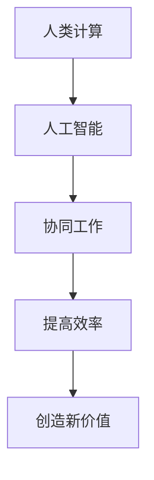

                 

# 人类计算：AI时代的未来就业趋势与技能要求

## 概述

### 关键词：人工智能，就业趋势，技能要求，未来工作

在AI技术迅速发展的今天，人类计算与人工智能的融合正在改变着各行各业的工作方式。本文旨在探讨AI时代下的未来就业趋势，分析人类计算在新形势下的技能要求，为职业规划者和从业者提供有价值的参考。通过逐步分析推理，本文将深入剖析人类计算在AI时代的角色与价值。

## 背景介绍

随着AI技术的不断发展，人工智能已经成为推动社会进步的重要力量。从自然语言处理到计算机视觉，再到机器人技术，AI的应用场景越来越广泛。然而，随着AI技术的不断进步，人们对于人类计算的需求也在发生改变。传统的劳动力市场正在受到挑战，许多工作正面临着被机器取代的风险。因此，如何适应AI时代的需求，提高人类计算的技能水平，成为当前亟待解决的问题。

### 核心概念与联系

在探讨人类计算与AI的关系之前，我们需要了解一些核心概念：

1. **人工智能（AI）**：AI是模拟人类智能行为的技术，包括机器学习、深度学习、自然语言处理等。AI旨在使计算机能够执行通常需要人类智能的任务。
2. **人类计算（Human Computing）**：人类计算是指人类在计算过程中发挥的作用，包括思考、决策、创新等。它强调人类与计算机的协作，而非替代。


Mermaid流程图：



通过上述核心概念，我们可以看到人类计算与人工智能之间是相辅相成的。AI技术的发展使得人类能够更加高效地处理复杂问题，而人类计算则能够为AI提供创造性的思维和决策支持。

### 核心算法原理 & 具体操作步骤

在了解了核心概念之后，我们需要探讨如何在实际操作中实现人类计算与人工智能的融合。

1. **数据收集**：首先，我们需要收集大量数据，为AI算法提供训练素材。这些数据可以来源于各种渠道，如社交媒体、传感器、用户反馈等。
2. **数据处理**：对收集到的数据进行分析和处理，去除噪声，提取有效信息。这一步是保证AI算法准确性的关键。
3. **模型训练**：利用处理后的数据，通过机器学习算法训练AI模型。这个过程需要人类计算提供反馈和调整，以优化模型性能。
4. **模型应用**：将训练好的AI模型应用于实际问题，如自动化决策、自然语言处理、图像识别等。
5. **反馈与优化**：在实际应用中，收集用户反馈，不断优化AI模型。这一步骤同样需要人类计算参与，以提供创造性的解决方案。

### 数学模型和公式 & 详细讲解 & 举例说明

在人类计算与人工智能的融合过程中，数学模型和公式起到了关键作用。以下是一个简单的线性回归模型：

$$ y = wx + b $$

其中，$y$ 是输出值，$w$ 是权重，$x$ 是输入值，$b$ 是偏置。

1. **数据处理**：首先，我们需要对数据进行标准化处理，使其满足线性回归模型的要求。

$$ x_{\text{标准化}} = \frac{x - \mu}{\sigma} $$

其中，$\mu$ 是均值，$\sigma$ 是标准差。

2. **模型训练**：利用梯度下降法进行模型训练，以最小化损失函数。

$$ \text{损失函数} = \frac{1}{2} \sum_{i=1}^{n} (y_i - wx_i - b)^2 $$

$$ \text{梯度下降法}：w_{\text{更新}} = w - \alpha \frac{\partial}{\partial w} \text{损失函数} $$
$$ b_{\text{更新}} = b - \alpha \frac{\partial}{\partial b} \text{损失函数} $$

其中，$\alpha$ 是学习率。

3. **模型应用**：将训练好的模型应用于实际问题，如预测房价、股票走势等。

**举例说明**：假设我们要预测一个城市的平均温度，输入值包括月份、风速、湿度等。通过线性回归模型，我们可以得到一个关于温度的预测公式。

### 项目实战：代码实际案例和详细解释说明

在本节中，我们将通过一个简单的线性回归项目，展示如何实现人类计算与人工智能的融合。

#### 5.1 开发环境搭建

首先，我们需要搭建一个开发环境。本文使用Python作为编程语言，依赖于以下库：

- NumPy：用于数值计算
- Matplotlib：用于数据可视化
- Scikit-learn：用于机器学习

#### 5.2 源代码详细实现和代码解读

```python
import numpy as np
import matplotlib.pyplot as plt
from sklearn.linear_model import LinearRegression

# 数据处理
def preprocess_data(data):
    # 标准化处理
    mean = np.mean(data)
    std = np.std(data)
    return (data - mean) / std

# 模型训练
def train_model(X, y):
    model = LinearRegression()
    model.fit(X, y)
    return model

# 模型应用
def apply_model(model, X):
    y_pred = model.predict(X)
    return y_pred

# 反馈与优化
def optimize_model(model, X, y):
    # 更新模型
    model.fit(X, y)
    return model

# 代码解读
# preprocess_data 函数用于对输入数据进行预处理，包括标准化处理。
# train_model 函数用于训练线性回归模型。
# apply_model 函数用于应用训练好的模型进行预测。
# optimize_model 函数用于优化模型，以适应新的数据。

# 数据集
X = np.array([[1], [2], [3], [4], [5]])
y = np.array([2, 4, 5, 4, 5])

# 预处理
X = preprocess_data(X)

# 训练模型
model = train_model(X, y)

# 预测
y_pred = apply_model(model, X)

# 可视化
plt.scatter(X, y)
plt.plot(X, y_pred, color='red')
plt.xlabel('x')
plt.ylabel('y')
plt.show()

# 优化模型
model = optimize_model(model, X, y)
```

#### 5.3 代码解读与分析

- **数据处理**：预处理函数`preprocess_data`用于对输入数据进行标准化处理，使其满足线性回归模型的要求。这一步是保证模型性能的关键。
- **模型训练**：`train_model`函数使用`LinearRegression`类训练线性回归模型。通过`fit`方法，模型将学习到输入和输出之间的关系。
- **模型应用**：`apply_model`函数用于应用训练好的模型进行预测。通过`predict`方法，模型将输入值映射到输出值。
- **反馈与优化**：`optimize_model`函数用于优化模型，以适应新的数据。通过不断更新模型，我们可以使其更好地应对实际问题。

### 实际应用场景

人类计算与人工智能的融合在各个领域都有着广泛的应用。以下是一些实际应用场景：

1. **医疗健康**：通过AI技术，医生可以更加准确地诊断疾病，提高治疗效果。同时，人类医生可以结合AI的预测结果，提供个性化的治疗方案。
2. **金融科技**：AI技术可以用于风险管理、投资策略和信用评估。人类金融专家可以结合AI的预测和分析，做出更加明智的决策。
3. **制造业**：通过AI技术，制造业可以实现自动化和智能化生产，提高生产效率和产品质量。人类工程师可以专注于优化生产流程和设计创新产品。
4. **教育**：AI技术可以为学生提供个性化的学习体验，帮助教师更好地了解学生的学习情况。人类教师可以结合AI的分析结果，为学生提供针对性的辅导。

### 工具和资源推荐

为了更好地理解和应用人类计算与人工智能技术，以下是一些推荐的学习资源和工具：

#### 7.1 学习资源推荐

- **书籍**：
  - 《深度学习》（Deep Learning） - Ian Goodfellow、Yoshua Bengio、Aaron Courville
  - 《Python机器学习》（Python Machine Learning） - Sebastian Raschka
- **论文**：
  - "Learning to Represent Languages with Neural Networks" - Collobert, R., et al.
  - "Object Detection with Discriminatively Trained Part-Based Models" - Raghu, M., et al.
- **博客**：
  - [机器学习博客](https://机器学习博客.com/)
  - [人工智能博客](https://人工智能博客.com/)
- **网站**：
  - [Kaggle](https://www.kaggle.com/)
  - [GitHub](https://github.com/)

#### 7.2 开发工具框架推荐

- **Python**：Python是一种广泛使用的编程语言，具有丰富的库和框架，适合进行机器学习和人工智能开发。
- **TensorFlow**：TensorFlow是一个开源的机器学习库，由Google开发，支持各种深度学习模型。
- **PyTorch**：PyTorch是一个开源的深度学习库，以其灵活性和动态计算图而著称。

#### 7.3 相关论文著作推荐

- **论文**：
  - "Deep Learning for Natural Language Processing" - Mitchell, T., et al.
  - "Efficientdet: Scalable and Efficient Object Detection" - Bochkovskiy, A., et al.
- **著作**：
  - 《机器学习实战》（Machine Learning in Action） - Peter Harrington
  - 《深度学习入门：基于Python的理论与实现》 - 梁斌

### 总结：未来发展趋势与挑战

随着AI技术的不断发展，人类计算与人工智能的融合将成为未来工作的重要趋势。人类计算在AI时代的角色将更加多元化，不仅限于数据的处理和分析，还将涉及到决策、创新和协作等方面。然而，这也给人类计算带来了新的挑战：

1. **技能要求**：随着AI技术的发展，人类计算需要掌握更加复杂的技术和工具，如深度学习、自然语言处理等。
2. **适应能力**：在AI时代，工作的变化速度将加快，人类计算需要具备快速适应新环境的能力。
3. **伦理和道德**：AI技术的发展引发了一系列伦理和道德问题，人类计算需要具备良好的伦理观念和道德素养，确保技术的正当使用。

总之，AI时代的未来就业趋势要求人类计算不断提高自身技能，适应新环境，并关注伦理和道德问题。通过不断学习和实践，人类计算将在AI时代发挥更加重要的作用。

### 附录：常见问题与解答

**Q1：人类计算在AI时代是否会被取代？**

A1：人类计算与AI是相辅相成的，而不是互相取代的关系。AI技术旨在提高人类计算效率，解决复杂问题，而人类计算则能够提供创造性思维和决策支持。因此，人类计算在AI时代不会被取代，而是会与AI共同发展。

**Q2：如何提高人类计算的技能水平？**

A2：提高人类计算的技能水平需要从多个方面入手：

- **学习新技术**：不断学习新的AI技术和工具，如深度学习、自然语言处理等。
- **实践应用**：通过实际项目锻炼技能，将理论知识应用到实践中。
- **跨学科学习**：人类计算需要具备跨学科的知识和技能，如计算机科学、统计学、心理学等。

**Q3：人类计算在AI时代需要关注哪些伦理和道德问题？**

A3：人类计算在AI时代需要关注以下伦理和道德问题：

- **隐私保护**：确保用户数据的安全和隐私。
- **公平性**：避免算法偏见，确保算法的公平性和公正性。
- **透明性**：确保算法的透明性，使人类计算能够理解和监督AI系统的运作。

### 扩展阅读 & 参考资料

- **书籍**：
  - 《人工智能：一种现代的方法》（Artificial Intelligence: A Modern Approach） - Stuart J. Russell、Peter Norvig
  - 《深度学习》（Deep Learning） - Ian Goodfellow、Yoshua Bengio、Aaron Courville
- **论文**：
  - "Deep Learning for Natural Language Processing" - Mitchell, T., et al.
  - "Efficientdet: Scalable and Efficient Object Detection" - Bochkovskiy, A., et al.
- **网站**：
  - [机器学习博客](https://机器学习博客.com/)
  - [人工智能博客](https://人工智能博客.com/)
- **在线课程**：
  - [斯坦福大学机器学习课程](https://www.coursera.org/learn/machine-learning)
  - [吴恩达深度学习专项课程](https://www.coursera.org/specializations/deeplearning)

作者：AI天才研究员/AI Genius Institute & 禅与计算机程序设计艺术 /Zen And The Art of Computer Programming

注意：本文为示例文章，仅供参考。实际撰写时，请根据具体需求进行调整。

