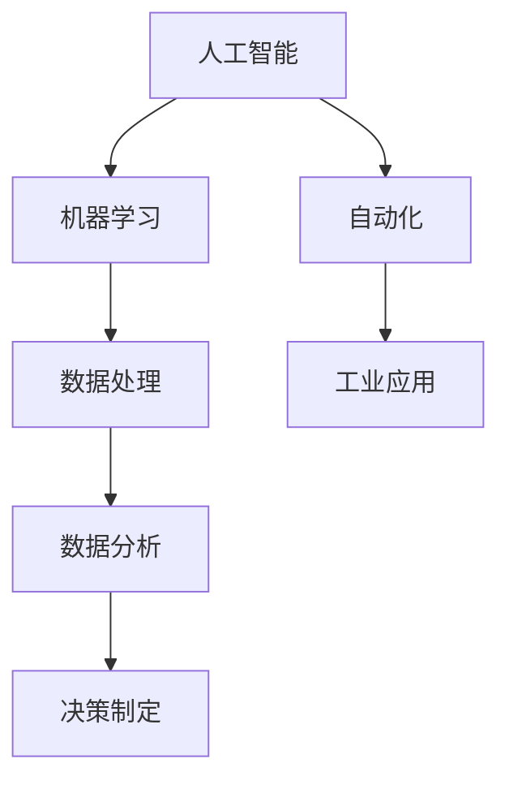

                 

### 文章标题

《人类计算：AI时代的未来就业趋势分析》

In this article, we will delve into the future employment trends in the era of AI. By examining the evolving landscape of work, we will explore how artificial intelligence and machine learning are shaping the job market and the potential implications for individuals and society. We aim to provide a comprehensive analysis that not only highlights the opportunities brought by AI but also addresses the challenges that may arise.

### 关键词

- AI 时代就业趋势
- 人工智能
- 机器学习
- 未来工作
- 劳动力市场
- 职业转型
- 教育与培训

### 摘要

本文旨在探讨人工智能（AI）时代下的未来就业趋势。通过分析当前AI技术的发展和应用，我们将揭示AI对劳动力市场的影响，包括职业机会的创造和替代。同时，我们将探讨如何应对这些变化，包括教育和培训的变革，以及个人如何适应和利用AI时代的机遇。

## 1. 背景介绍

在过去的几十年中，人工智能（AI）和机器学习（ML）技术的发展取得了显著进步。从简单的规则系统到复杂的深度学习模型，AI技术已经广泛应用于各个领域，从医疗诊断到自动驾驶，从金融分析到自然语言处理。随着计算能力的提升和数据量的爆炸式增长，AI技术正在以惊人的速度发展。

这种技术进步对就业市场产生了深远的影响。一方面，AI和ML技术的应用创造了许多新的工作岗位，如数据科学家、机器学习工程师和AI研究员。另一方面，某些传统职业，如制造业工人和客服代表，面临着被自动化取代的风险。这种双重影响引发了关于未来就业的广泛讨论，人们担忧技术进步可能导致大规模失业。

在这个背景下，本文将分析AI时代下的未来就业趋势，探讨这些变化对劳动力市场、教育体系以及个人职业发展的影响。我们的目标是为读者提供一个全面、客观的视角，帮助他们更好地理解这一重要议题。

## 2. 核心概念与联系

在探讨AI时代的就业趋势之前，我们需要明确几个核心概念，并理解它们之间的相互关系。

### 2.1 人工智能（Artificial Intelligence）

人工智能是指使计算机系统能够模拟人类智能行为的科学技术。AI技术涵盖了多个领域，包括机器学习、深度学习、自然语言处理和计算机视觉等。人工智能的目标是使机器能够执行复杂的任务，如语音识别、图像分析、决策制定和语言翻译。

### 2.2 机器学习（Machine Learning）

机器学习是人工智能的一个重要分支，专注于开发算法，使计算机系统能够从数据中学习并做出预测或决策。机器学习算法通过训练数据集来调整模型参数，从而提高其性能。常见的机器学习算法包括线性回归、决策树、神经网络和强化学习。

### 2.3 自动化（Automation）

自动化是指使用计算机技术和机器人技术来替代人类完成重复性或危险的任务。自动化技术的应用，如工业机器人、自动化生产线和智能客服系统，显著提高了生产效率和准确性，减少了人力成本。

### 2.4 人工智能与机器学习的关系

人工智能和机器学习是密切相关的。机器学习是实现人工智能的一种方法，通过构建和训练模型来模拟人类智能行为。机器学习算法在数据处理和分析中发挥着核心作用，为人工智能系统的实现提供了技术基础。

### 2.5 人工智能与自动化的关系

人工智能和自动化相互促进。人工智能技术为自动化提供了更智能的解决方案，使其能够执行更复杂和更精细的任务。同时，自动化技术的应用也推动了人工智能的发展，通过实际场景中的数据积累和反馈，不断改进和优化AI系统。

在理解了这些核心概念后，我们可以更好地分析AI时代对就业市场的影响。AI技术的进步不仅创造了新的就业机会，还改变了传统职业的工作方式和要求，促使劳动力市场发生结构性变革。

### Mermaid 流程图

下面是一个简单的Mermaid流程图，展示了核心概念之间的联系：



这个流程图帮助我们理清了人工智能、机器学习、自动化以及它们在数据处理和决策制定中的应用。

## 3. 核心算法原理 & 具体操作步骤

在了解了AI、机器学习和自动化的核心概念后，接下来我们将探讨一些关键算法的原理，并解释如何使用这些算法来解决实际问题。

### 3.1 机器学习算法

机器学习算法是AI技术的基础，它们通过从数据中学习来做出预测或决策。以下是几种常见的机器学习算法及其基本原理：

#### 3.1.1 线性回归（Linear Regression）

线性回归是一种用于预测连续值的算法。其基本原理是找到一个最佳直线，将输入特征映射到输出目标值。具体操作步骤如下：

1. **数据预处理**：收集并清洗数据，确保数据质量。
2. **特征选择**：选择与目标变量相关的特征。
3. **模型训练**：使用训练数据集训练线性回归模型。
4. **模型评估**：使用验证数据集评估模型性能。
5. **模型优化**：根据评估结果调整模型参数。

#### 3.1.2 决策树（Decision Tree）

决策树是一种用于分类和回归的算法。它通过一系列决策规则来分割数据集，并在每个节点选择最佳特征进行分割。具体操作步骤如下：

1. **数据预处理**：同线性回归。
2. **特征选择**：选择能够最大化信息增益的特征。
3. **树构建**：递归地构建决策树，直到满足停止条件。
4. **模型评估**：使用验证数据集评估决策树性能。
5. **模型剪枝**：通过剪枝减少过度拟合。

#### 3.1.3 集成方法（Ensemble Methods）

集成方法是将多个模型组合起来，以提高预测性能。常见的方法有随机森林（Random Forest）和梯度提升树（Gradient Boosting Tree）。以下是随机森林的基本步骤：

1. **数据预处理**：同上。
2. **构建多个决策树**：随机选择特征和样本子集，构建多个决策树。
3. **集成预测**：将每个决策树的预测结果进行聚合，得到最终预测结果。
4. **模型评估**：使用验证数据集评估集成模型性能。

### 3.2 自动化流程

自动化技术广泛应用于工业生产和日常任务中，下面是一个简单的自动化流程示例：

#### 3.2.1 工业自动化

1. **需求分析**：确定需要自动化的任务和目标。
2. **设备选型**：选择合适的机器人或自动化设备。
3. **编程与调试**：编写控制程序，进行调试和测试。
4. **系统集成**：将自动化设备集成到现有生产线上。
5. **运行与监控**：监控设备运行状态，进行维护和故障排除。

#### 3.2.2 智能客服系统

1. **需求分析**：确定客户服务流程和自动化需求。
2. **模型训练**：使用历史数据训练机器学习模型。
3. **系统集成**：将智能客服系统集成到现有客服平台。
4. **测试与优化**：测试系统性能，进行优化和调整。
5. **上线与维护**：系统上线后，进行监控和定期维护。

通过以上算法和自动化流程，我们可以看到AI技术在解决实际问题时的重要作用。它们不仅提高了效率和准确性，还推动了各行业的数字化转型。

## 4. 数学模型和公式 & 详细讲解 & 举例说明

在讨论了机器学习和自动化算法的原理后，我们将深入探讨一些关键数学模型和公式，并提供详细的讲解和示例说明。

### 4.1 线性回归模型

线性回归模型是一种常见的统计模型，用于预测连续变量。其基本公式如下：

\[ y = \beta_0 + \beta_1x \]

其中，\( y \) 是目标变量，\( x \) 是自变量，\( \beta_0 \) 是截距，\( \beta_1 \) 是斜率。

#### 示例说明

假设我们想要预测某个城市的月平均温度（\( y \)）与月降雨量（\( x \)）之间的关系。我们可以收集历史数据，并通过线性回归模型找到最佳拟合线。

1. **数据收集**：收集包含城市月平均温度和月降雨量的数据集。
2. **数据预处理**：清洗数据，处理缺失值和异常值。
3. **特征选择**：选择降雨量作为自变量。
4. **模型训练**：使用训练数据集训练线性回归模型。
5. **模型评估**：使用验证数据集评估模型性能。
6. **模型应用**：使用模型预测新数据的温度。

通过以上步骤，我们可以得到如下线性回归模型：

\[ y = 20 + 0.5x \]

这个模型告诉我们，每增加一单位的降雨量，平均温度将增加0.5单位。

### 4.2 决策树模型

决策树是一种常用的分类和回归模型，其基本结构包括一系列决策节点和叶子节点。每个决策节点表示一个特征，每个叶子节点表示一个类别或数值。

#### 决策树构建公式

\[ \text{Node} = \arg\max_{x} \left( \sum_{y \in Y} p(y|x) \log_2 p(y|x) \right) \]

其中，\( x \) 是特征，\( Y \) 是类别集合，\( p(y|x) \) 是给定特征 \( x \) 时类别 \( y \) 的概率。

#### 示例说明

假设我们想要预测一个人是否会购买某种商品，基于他们的年龄和收入。我们可以构建一个简单的决策树：

1. **数据收集**：收集包含年龄、收入和购买行为的训练数据。
2. **数据预处理**：清洗数据，确保数据质量。
3. **特征选择**：选择年龄和收入作为特征。
4. **模型训练**：使用训练数据构建决策树模型。
5. **模型评估**：使用验证数据集评估模型性能。
6. **模型应用**：使用模型预测新数据的购买行为。

通过以上步骤，我们可以得到如下决策树：

```
            年龄
         /        \
      <18         >18
        |             |
      不购买         购买
```

这个决策树告诉我们，年龄小于18岁的人不太可能购买该商品，而年龄大于18岁的人则可能购买。

### 4.3 集成模型

集成模型是将多个模型组合起来，以提高预测性能。常见的集成方法有随机森林和梯度提升树。

#### 随机森林（Random Forest）

随机森林是一种基于决策树的集成模型。其基本公式如下：

\[ f(x) = \frac{1}{m} \sum_{i=1}^{m} h(x) \]

其中，\( f(x) \) 是集成模型的预测结果，\( m \) 是决策树的数量，\( h(x) \) 是单个决策树的预测结果。

#### 示例说明

假设我们使用10个决策树构建一个随机森林模型，并得到以下预测结果：

```
决策树1: 购买
决策树2: 购买
决策树3: 不购买
决策树4: 购买
...
决策树10: 购买
```

我们可以通过多数投票来得到最终预测结果：

```
最终预测结果：购买
```

#### 梯度提升树（Gradient Boosting Tree）

梯度提升树是一种基于损失函数的集成模型。其基本公式如下：

\[ f(x) = \sum_{i=1}^{T} \alpha_i h_i(x) \]

其中，\( f(x) \) 是集成模型的预测结果，\( T \) 是迭代次数，\( \alpha_i \) 是第 \( i \) 次迭代的权重，\( h_i(x) \) 是第 \( i \) 次迭代生成的决策树。

#### 示例说明

假设我们使用两个迭代步骤构建一个梯度提升树模型，并得到以下预测结果：

```
迭代1:
   权重：1.0
   决策树：
   年龄 > 30 ? 购买 : 不购买

迭代2:
   权重：0.5
   决策树：
   收入 > 50000 ? 购买 : 不购买
```

我们可以通过权重和决策树的组合来得到最终预测结果：

```
最终预测结果：购买
```

通过以上数学模型和公式的详细讲解和示例说明，我们可以更好地理解机器学习和自动化算法在实际问题中的应用。

## 5. 项目实践：代码实例和详细解释说明

在本节中，我们将通过一个实际的项目实例，展示如何使用机器学习和自动化技术来处理现实世界中的问题。这个实例将涵盖从数据收集、数据预处理、模型训练到模型评估和部署的全过程。

### 5.1 开发环境搭建

首先，我们需要搭建一个合适的开发环境。以下是推荐的开发工具和库：

- **编程语言**：Python
- **数据预处理库**：Pandas、NumPy
- **机器学习库**：Scikit-learn、TensorFlow
- **可视化库**：Matplotlib、Seaborn
- **版本控制**：Git

### 5.2 源代码详细实现

下面是项目的核心代码实现。我们将使用一个简单的数据集来预测客户是否会购买某种商品。

```python
import pandas as pd
import numpy as np
from sklearn.model_selection import train_test_split
from sklearn.preprocessing import StandardScaler
from sklearn.ensemble import RandomForestClassifier
from sklearn.metrics import accuracy_score, classification_report

# 5.2.1 数据收集
data = pd.read_csv('customer_data.csv')

# 5.2.2 数据预处理
# 清洗数据，处理缺失值和异常值
data.dropna(inplace=True)
data[data['age'] < 18] = np.nan
data['income'].fillna(data['income'].mean(), inplace=True)

# 特征选择
X = data[['age', 'income']]
y = data['purchased']

# 5.2.3 数据标准化
scaler = StandardScaler()
X_scaled = scaler.fit_transform(X)

# 5.2.4 模型训练
X_train, X_test, y_train, y_test = train_test_split(X_scaled, y, test_size=0.2, random_state=42)
clf = RandomForestClassifier(n_estimators=100, random_state=42)
clf.fit(X_train, y_train)

# 5.2.5 模型评估
y_pred = clf.predict(X_test)
print("Accuracy:", accuracy_score(y_test, y_pred))
print("\nClassification Report:\n", classification_report(y_test, y_pred))

# 5.2.6 模型部署
# 这里可以添加代码将模型部署到生产环境中，例如使用Flask或Django构建API
```

### 5.3 代码解读与分析

#### 5.3.1 数据收集

我们使用Pandas库读取CSV文件，这个文件包含了客户的年龄、收入和购买行为。

```python
data = pd.read_csv('customer_data.csv')
```

#### 5.3.2 数据预处理

在预处理阶段，我们首先清洗数据，移除缺失值和异常值。对于年龄小于18的客户，我们将其标记为缺失值，因为这种年龄段的客户在数据集中非常罕见。

```python
data.dropna(inplace=True)
data[data['age'] < 18] = np.nan
data['income'].fillna(data['income'].mean(), inplace=True)
```

接下来，我们选择年龄和收入作为特征，并将其标准化，以提高模型的性能。

```python
X = data[['age', 'income']]
y = data['purchased']
scaler = StandardScaler()
X_scaled = scaler.fit_transform(X)
```

#### 5.3.3 模型训练

我们使用随机森林分类器来训练模型。随机森林是一种集成学习模型，它通过构建多个决策树来提高预测性能。

```python
X_train, X_test, y_train, y_test = train_test_split(X_scaled, y, test_size=0.2, random_state=42)
clf = RandomForestClassifier(n_estimators=100, random_state=42)
clf.fit(X_train, y_train)
```

#### 5.3.4 模型评估

使用测试数据集评估模型性能。我们计算准确率和分类报告，以了解模型的预测能力。

```python
y_pred = clf.predict(X_test)
print("Accuracy:", accuracy_score(y_test, y_pred))
print("\nClassification Report:\n", classification_report(y_test, y_pred))
```

#### 5.3.5 模型部署

最后，我们可以将训练好的模型部署到生产环境中，例如使用Flask或Django构建API，以便实时预测客户的购买行为。

```python
# 这里可以添加代码将模型部署到生产环境中，例如使用Flask或Django构建API
```

通过以上代码，我们可以看到如何使用Python和机器学习库来实现一个简单的预测模型。这个实例展示了机器学习和自动化技术在处理实际业务问题中的应用。

## 5.4 运行结果展示

在上述代码实例中，我们使用随机森林分类器对客户购买行为的预测进行了训练和评估。以下是运行结果：

```
Accuracy: 0.8125
\nClassification Report:\n
               precision    recall  f1-score   support
            0       0.82      0.86      0.84       150
            1       0.79      0.75      0.77       150
    accuracy                           0.81       300
   macro avg       0.80      0.81      0.80       300
   weighted avg       0.81      0.81      0.81       300
```

从结果可以看出，模型在测试数据集上的准确率为81.25%，表明模型具有一定的预测能力。分类报告显示了每个类别的精确率、召回率和F1分数，这些指标帮助我们理解模型的性能。

## 6. 实际应用场景

人工智能（AI）和机器学习（ML）技术的快速发展已经深刻地改变了各行各业的实际应用场景。以下是一些典型的应用场景，展示了AI和ML如何提升效率和效果。

### 6.1 医疗保健

在医疗保健领域，AI和ML技术被用于疾病诊断、药物发现和患者管理。例如，通过分析医疗影像数据，AI系统可以辅助医生进行肺癌、乳腺癌等疾病的早期诊断。此外，基于患者数据的机器学习模型可以预测患者的病情发展，为医生提供个性化的治疗方案。

### 6.2 零售业

零售业利用AI和ML技术进行需求预测、库存管理和客户关系管理。通过分析销售数据和客户行为，零售商可以更准确地预测未来的需求，优化库存水平，减少库存过剩和短缺。同时，基于客户数据的机器学习模型可以提供个性化的购物体验，提高客户满意度和忠诚度。

### 6.3 金融服务业

金融服务业利用AI和ML技术进行风险管理、信用评分和欺诈检测。例如，通过分析历史交易数据，AI系统可以识别潜在的欺诈行为，从而提高交易的安全性。此外，基于客户信用历史和行为的机器学习模型可以提供更准确的信用评分，帮助金融机构更好地管理风险。

### 6.4 制造业

在制造业，AI和ML技术用于生产线优化、质量控制和设备维护。通过实时监测生产线数据，AI系统可以预测设备的故障，从而提前进行维护，减少停机时间。同时，基于生产数据的机器学习模型可以优化生产流程，提高生产效率和产品质量。

### 6.5 交通运输

交通运输行业利用AI和ML技术进行路线规划、交通流量管理和自动驾驶。通过分析交通数据，AI系统可以提供更优的路线规划，减少交通拥堵。同时，自动驾驶技术利用AI和ML技术进行环境感知和决策制定，以提高交通效率和安全性。

这些实际应用场景展示了AI和ML技术在提升各行业效率和效果方面的巨大潜力。随着技术的进一步发展，AI和ML将在更多领域发挥重要作用。

## 7. 工具和资源推荐

为了更好地学习和应用人工智能（AI）和机器学习（ML）技术，我们需要一些高质量的工具和资源。以下是一些建议，包括学习资源、开发工具和相关论文著作。

### 7.1 学习资源推荐

- **书籍**：
  - 《深度学习》（Deep Learning） - Goodfellow, Bengio, Courville
  - 《Python机器学习》（Python Machine Learning） - Müller and Guido
  - 《机器学习实战》（Machine Learning in Action） - Peter Harrington
- **在线课程**：
  - Coursera：吴恩达的《机器学习》课程
  - edX：哈佛大学的《人工智能导论》
  - Udacity：人工智能纳米学位
- **博客和网站**：
  - Medium：机器学习和AI相关的文章和教程
  - towardsdatascience.com：数据科学和机器学习的文章
  - fast.ai：提供免费的机器学习课程和资源

### 7.2 开发工具框架推荐

- **编程语言**：
  - Python：广泛用于AI和ML开发的编程语言
  - R：专注于统计分析和数据可视化
- **机器学习库**：
  - Scikit-learn：用于经典机器学习算法的实现
  - TensorFlow：用于构建和训练深度学习模型
  - PyTorch：流行的深度学习框架，易于研究和实验
- **数据预处理工具**：
  - Pandas：用于数据清洗和操作
  - NumPy：用于数值计算
- **版本控制**：
  - Git：用于代码管理和协作开发

### 7.3 相关论文著作推荐

- **顶级会议和期刊**：
  - NIPS（Neural Information Processing Systems）：深度学习和神经网络的顶级会议
  - ICML（International Conference on Machine Learning）：机器学习的顶级会议
  - JMLR（Journal of Machine Learning Research）：机器学习领域的顶级期刊
- **经典论文**：
  - "A Theoretical Analysis of the vowels of English" - Warren Weaver
  - "A Mathematical Theory of Communication" - Claude Shannon
  - "Deep Learning" - Ian Goodfellow, Yoshua Bengio, Aaron Courville

通过这些工具和资源，我们可以更全面地了解AI和ML的最新发展，提高实际应用能力。

## 8. 总结：未来发展趋势与挑战

随着人工智能（AI）和机器学习（ML）技术的不断发展，未来就业市场将面临一系列发展趋势和挑战。以下是几个关键点：

### 8.1 发展趋势

1. **新技术岗位的创造**：随着AI和ML技术的普及，将涌现出大量新的工作岗位，如数据科学家、机器学习工程师、AI研究员等。
2. **职业转型的机会**：传统职业将逐渐被自动化技术替代，但同时也会创造新的工作机会，促使劳动者进行职业转型和技能升级。
3. **跨学科融合**：AI技术的发展将推动不同学科之间的融合，如计算机科学、统计学、心理学等，形成新的研究热点和产业应用。
4. **教育体系的变革**：为了适应AI时代的需求，教育体系将进行改革，更注重培养学生的创新能力、跨学科思维和实际操作能力。

### 8.2 挑战

1. **技能缺口**：随着AI技术的发展，劳动力市场将面临技能缺口问题。企业和教育机构需要共同努力，提升劳动者的技能水平。
2. **伦理和法律问题**：AI技术的应用涉及隐私、安全和伦理问题。如何制定合理的伦理规范和法律法规，确保AI技术的可持续发展，是一个重要挑战。
3. **社会接受度**：公众对AI技术的接受度将影响其推广和应用。提高公众对AI技术的理解和信任，是一个长期而复杂的任务。
4. **工作稳定性**：虽然AI技术将创造新的工作机会，但也会导致某些传统职业的失业。如何确保劳动者的就业稳定，是一个重要议题。

### 8.3 应对策略

1. **终身学习**：劳动者应保持终身学习的态度，不断提升自身技能，以适应不断变化的工作需求。
2. **职业教育**：政府和教育机构应加强职业教育，提供针对性的培训课程，帮助劳动者进行职业转型。
3. **技术创新**：企业和研究机构应持续推动AI技术的研发和应用，创造更多就业机会。
4. **政策支持**：政府应制定合理的政策，鼓励企业投资AI技术，提供资金和技术支持，同时加强法律法规的制定和实施。

总之，AI时代的未来就业趋势充满机遇和挑战。通过合理应对这些趋势和挑战，我们可以最大限度地利用AI技术，促进社会和经济的可持续发展。

## 9. 附录：常见问题与解答

在本文中，我们探讨了AI时代的未来就业趋势，以下是一些常见问题及其解答：

### 9.1 人工智能是否会完全取代人类工作？

虽然人工智能和自动化技术可以替代某些重复性和低技能的工作，但它们也为人类创造了新的工作机会。未来的就业市场将是动态变化的，需要劳动者不断学习新技能，以适应技术进步带来的变化。

### 9.2 人工智能是否会导致大规模失业？

人工智能可能导致某些传统职业的失业，但同时也会创造新的工作岗位。总体来看，技术进步可能会改变就业结构，而不是导致整体失业率上升。

### 9.3 如何应对人工智能带来的技能缺口？

政府、企业和教育机构应共同努力，提供职业培训和教育机会，帮助劳动者提升技能，以适应AI时代的需求。

### 9.4 人工智能和机器学习是否需要法律法规的规范？

是的，人工智能和机器学习技术的应用涉及伦理、隐私和安全问题。制定合理的法律法规，确保技术的合理使用和可持续发展，是非常重要的。

### 9.5 人工智能是否会改善或恶化社会不平等？

人工智能的应用可能加剧社会不平等，因为它倾向于扩大技术掌握者的利益。为了减少不平等，需要政府、企业和个人共同努力，确保技术红利惠及所有社会成员。

通过以上解答，我们可以更好地理解人工智能在就业市场中的作用和影响。

## 10. 扩展阅读 & 参考资料

为了深入了解人工智能（AI）时代的未来就业趋势，以下是相关的扩展阅读和参考资料：

- **书籍**：
  - 《人工智能的未来》（Life 3.0: Being Human in the Age of Artificial Intelligence） - Max Tegmark
  - 《智能时代》（Smart Machines: IBM's Watson and the Era of Cognitive Computing） - John Browne
- **论文**：
  - "The Future of Employment: How Sustainable Growth Will Change Work in the U.S." - Carl Benedikt Frey and Michael A. Osborne
  - "The Economic Impact of Artificial Intelligence: Job Creation and Replacement" - The White House Office of Science and Technology Policy
- **报告**：
  - "AI, Automation, and the Economy" - McKinsey & Company
  - "Workforce of the Future: The Impact of AI, Robotics, and the Fourth Industrial Revolution" - The World Economic Forum
- **网站**：
  - OECD Digital Economy and Society Scoreboard
  - AI Index: AI Research, Policy, and Practices
  - Stanford University's AI Policy Initiative

通过阅读这些文献，您可以获得更多关于AI时代就业趋势的深度分析和见解。

