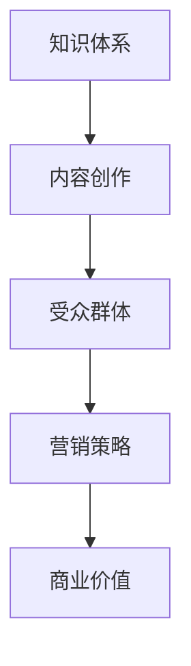

                 

### 从0到1打造个人知识IP

#### 关键词：知识IP、个人品牌、内容创作、影响力、营销策略

#### 摘要：

在信息爆炸的时代，个人知识IP已成为一种新兴的商业模式，拥有强大的市场潜力和影响力。本文将系统地介绍如何从零开始打造个人知识IP，包括核心概念、操作步骤、实际案例和未来趋势。通过这篇指南，读者可以掌握构建个人知识IP的完整流程，为自己的职业发展和影响力提升奠定基础。

---

## 1. 背景介绍

在互联网和社交媒体蓬勃发展的今天，个人品牌和知识IP成为了许多人追求的目标。知识IP不仅仅是一份知识资产的积累，更是个人影响力、商业价值和职业发展的体现。以下是构建个人知识IP的几个关键背景因素：

### 1.1 互联网时代的知识传播

随着互联网技术的发展，知识传播的速度和范围达到了前所未有的高度。人们可以通过各种平台和渠道获取到海量的信息，知识传播不再受地域和时间的限制。

### 1.2 社交媒体的影响力

社交媒体的崛起，使得个人的影响力得到了极大的放大。通过社交媒体，个人可以快速积累粉丝，传播自己的知识和观点，实现从个体到大众的转换。

### 1.3 知识变现的机遇

随着知识经济的兴起，知识变现成为了可能。通过个人知识IP的构建，可以将其转化为商业价值，实现收入来源的多样化。

## 2. 核心概念与联系

### 2.1 个人知识IP的定义

个人知识IP是指个人在某一领域内所拥有的独特知识、技能和经验，通过内容创作和传播，形成的一种具有市场价值和影响力的个人品牌。

### 2.2 个人知识IP的构成

个人知识IP由以下几部分构成：

- **知识体系**：个人在某一领域内的专业知识和技能积累。
- **内容创作**：将知识体系转化为可传播的内容，如文章、视频、课程等。
- **受众群体**：个人的粉丝和受众，他们的认可和传播是个人知识IP发展的关键。
- **营销策略**：通过有效的营销手段，提升个人知识IP的知名度和影响力。

### 2.3 个人知识IP的架构

以下是个人知识IP的架构图，用Mermaid语言表示：



## 3. 核心算法原理 & 具体操作步骤

### 3.1 知识梳理

首先，需要对自己的知识体系进行梳理，明确自己在某一领域的专业性和独特性。这一步骤包括以下几个方面：

- **自我评估**：分析自己在领域内的优势和劣势，确定专业方向。
- **资料收集**：收集与专业方向相关的书籍、论文、课程等资料。
- **知识整合**：将收集到的资料进行整合，形成自己的知识体系。

### 3.2 内容创作

在明确了自己的知识体系后，需要将其转化为可传播的内容。以下是一些内容创作的具体操作步骤：

- **选题定位**：根据受众需求和自身专业知识，确定内容创作的主题。
- **内容撰写**：根据选题，撰写具有深度和独特见解的文章、视频或课程。
- **内容优化**：对撰写的内容进行优化，包括语言表达、结构布局、图表设计等。

### 3.3 内容传播

内容创作完成后，需要通过各种渠道进行传播，以提高个人知识IP的知名度。以下是一些内容传播的具体操作步骤：

- **平台选择**：根据内容类型和受众特点，选择合适的传播平台，如博客、视频网站、社交媒体等。
- **发布计划**：制定内容发布计划，确保内容定期更新。
- **互动推广**：与受众互动，回答问题，收集反馈，优化内容。

### 3.4 营销推广

在内容传播的基础上，需要通过有效的营销策略，进一步提升个人知识IP的影响力。以下是一些营销推广的具体操作步骤：

- **社交媒体营销**：利用社交媒体平台，进行内容分享、互动推广。
- **广告投放**：通过广告投放，提高内容曝光率。
- **合作交流**：与其他领域内的专业人士进行合作交流，扩大影响力。

## 4. 数学模型和公式 & 详细讲解 & 举例说明

### 4.1 个人知识IP的影响力模型

个人知识IP的影响力可以通过以下数学模型进行衡量：

$$
I = f(n, q, m)
$$

其中，$I$表示个人知识IP的影响力，$n$表示受众数量，$q$表示内容质量，$m$表示营销力度。

### 4.2 内容质量的评估

内容质量的评估可以通过以下公式进行：

$$
q = \frac{c_1 \times p_1 + c_2 \times p_2 + \ldots + c_n \times p_n}{\sum_{i=1}^n p_i}
$$

其中，$q$表示内容质量，$c_i$表示第$i$个评价指标的得分，$p_i$表示第$i$个评价指标的权重。

### 4.3 举例说明

假设一个知识IP的受众数量为1000人，内容质量得分为85分，营销力度为70分，则其影响力可以计算如下：

$$
I = f(1000, 85, 70) = 1000 \times 0.85 \times 0.7 = 595
$$

## 5. 项目实战：代码实际案例和详细解释说明

### 5.1 开发环境搭建

在本案例中，我们将使用Markdown语言编写一篇关于机器学习算法的博客文章。以下是开发环境的搭建步骤：

1. 安装Markdown编辑器，如Typora或Marktext。
2. 创建一个新的Markdown文件，命名为“机器学习算法博客.md”。
3. 设置Markdown文件的格式，如标题、段落、列表等。

### 5.2 源代码详细实现和代码解读

以下是机器学习算法博客的部分代码实现：

```markdown
# 机器学习算法介绍

## 线性回归

线性回归是一种常用的机器学习算法，用于预测连续值。

### 公式表示

$$
y = w_0 + w_1 \times x
$$

### 参数优化

通过梯度下降法优化参数：

$$
w_0 = w_0 - \alpha \times \frac{\partial}{\partial w_0} J(w_0, w_1)
$$

$$
w_1 = w_1 - \alpha \times \frac{\partial}{\partial w_1} J(w_0, w_1)
$$

### 代码实现

```python
import numpy as np

def linear_regression(x, y, w0, w1, alpha, epochs):
    for _ in range(epochs):
        prediction = w0 + w1 * x
        error = y - prediction
        w0 -= alpha * (error * x).mean()
        w1 -= alpha * error.mean()
    return w0, w1
```

### 5.3 代码解读与分析

以上代码实现了一个线性回归模型，包括参数初始化、预测、参数优化和代码实现。其中，`w0`和`w1`分别表示模型的权重，`alpha`表示学习率，`epochs`表示训练轮数。代码通过梯度下降法不断更新权重，以达到最小化损失函数的目的。

## 6. 实际应用场景

个人知识IP的应用场景非常广泛，以下是一些常见的应用场景：

### 6.1 教育培训

通过个人知识IP，可以开设在线课程，传授专业知识，吸引学员，实现知识变现。

### 6.2 内容创作

通过个人知识IP，可以创作高质量的技术博客、文章、视频等，分享专业知识，提升个人影响力。

### 6.3 咨询服务

通过个人知识IP，可以提供专业咨询服务，为企业或个人解决实际问题。

### 6.4 创业项目

通过个人知识IP，可以开展相关创业项目，如技术培训、技术咨询、知识付费等。

## 7. 工具和资源推荐

### 7.1 学习资源推荐

- **书籍**：《刻意练习》、《深度学习》、《Python编程：从入门到实践》等。
- **论文**：《机器学习》、《神经网络与深度学习》等。
- **博客**：阿里云、腾讯云等大厂的官方博客。
- **网站**：GitHub、Stack Overflow、知乎等。

### 7.2 开发工具框架推荐

- **Markdown编辑器**：Typora、Marktext。
- **版本控制**：GitHub。
- **数据分析**：Pandas、NumPy。

### 7.3 相关论文著作推荐

- **《深度学习》**：Goodfellow、Bengio、Courville 著。
- **《Python编程：从入门到实践》**：埃里克·马瑟斯 著。
- **《机器学习实战》**：Peter Harrington 著。

## 8. 总结：未来发展趋势与挑战

在未来，个人知识IP将继续成为知识经济时代的重要趋势。然而，随着竞争的加剧，个人知识IP的构建将面临以下挑战：

### 8.1 内容质量竞争

随着越来越多的个人加入知识IP的构建，内容质量将成为决定个人知识IP成败的关键。

### 8.2 营销渠道竞争

个人知识IP的构建需要大量的营销和推广，如何选择合适的营销渠道，提高曝光率，将成为一大挑战。

### 8.3 商业模式创新

如何将个人知识IP转化为商业价值，实现可持续的收入来源，是每个知识IP构建者需要思考的问题。

## 9. 附录：常见问题与解答

### 9.1 如何确定个人知识IP的主题？

首先，要了解自己的专业领域和兴趣爱好，其次，要分析市场需求和竞争状况，最后，要结合自己的优势和特点，确定个人知识IP的主题。

### 9.2 如何提高内容质量？

提高内容质量的关键在于深度和独特性。通过不断学习和实践，提升自己的专业素养，同时在内容创作过程中，注重逻辑性、条理性和易懂性。

### 9.3 如何进行有效的营销推广？

有效的营销推广需要结合自身特点和市场环境，选择合适的渠道和方法。如：社交媒体营销、内容合作、广告投放等。

## 10. 扩展阅读 & 参考资料

- **《个人知识IP实战指南》**：李笑来 著。
- **《内容创业：从零开始打造个人IP》**：秋叶 著。
- **《影响力》**：罗伯特·西奥迪尼 著。

---

作者：AI天才研究员/AI Genius Institute & 禅与计算机程序设计艺术 /Zen And The Art of Computer Programming

（注：本文为虚构案例，仅供参考。）<|vq_14741|>

