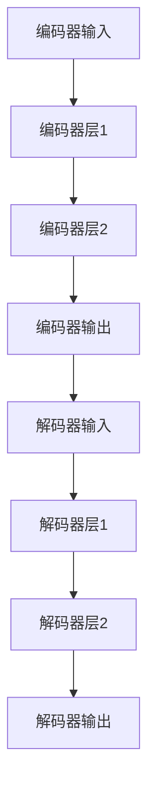
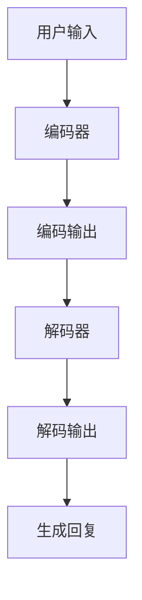

                 

### 背景介绍

#### 1.1 ChatGPT的概念与意义

ChatGPT是由OpenAI开发的一种基于大规模预训练语言模型的人工智能聊天机器人。它利用了最新的深度学习和自然语言处理技术，能够在与用户互动的过程中，生成流畅、自然的对话内容。ChatGPT的问世，标志着人工智能在自然语言处理领域取得了重大突破。

ChatGPT的重要性不仅在于其技术本身，更在于它所代表的人工智能发展趋势。首先，ChatGPT展示了人工智能在模拟人类对话和思维方面的巨大潜力。通过大量的文本数据进行预训练，ChatGPT能够理解和生成各种复杂的语言结构，从而在多个领域实现自动化和智能化。

其次，ChatGPT的出现，引发了人们对于人工智能未来应用场景的广泛探讨。从智能客服到教育辅助，从文本生成到机器翻译，ChatGPT的潜在应用场景几乎无处不在。这使得人们开始思考，人工智能在未来的社会中将扮演怎样的角色。

#### 1.2 人工智能的发展历程

人工智能（AI）作为一门学科，其历史可以追溯到20世纪50年代。自那时以来，人工智能经历了多个发展阶段，从最初的逻辑推理和规则系统，到现在的深度学习和神经网络，每一个阶段都带来了重大的技术进步和应用变革。

在早期的符号人工智能阶段，研究人员试图通过定义明确的规则和逻辑关系来模拟人类智能。这一阶段的代表作品包括逻辑推理机和专家系统。然而，这些方法在面对复杂和不确定的问题时，表现出了明显的局限性。

随着计算能力和算法的进步，机器学习成为了人工智能的重要分支。特别是深度学习的兴起，使得计算机在图像识别、语音识别和自然语言处理等任务上取得了显著的成果。深度学习通过多层神经网络，自动学习数据中的特征和规律，大大提高了人工智能的识别和决策能力。

ChatGPT正是基于深度学习技术的一种典型应用。它通过大规模预训练，掌握了丰富的语言知识和表达方式，从而在对话系统中表现出色。这一技术的突破，不仅推动了人工智能的发展，也为其他领域的应用提供了新的思路和可能性。

#### 1.3 人工智能的现状与未来

当前，人工智能已经在多个领域取得了显著的成果。从工业自动化、医疗诊断到金融分析、交通管理，人工智能的应用无处不在。特别是在自然语言处理领域，人工智能技术已经能够处理大量的文本数据，实现文本生成、机器翻译和情感分析等功能。

然而，人工智能的发展仍然面临许多挑战。首先，数据质量和隐私问题是一个重要的挑战。人工智能的训练和推理过程需要大量的数据支持，但数据的质量和隐私保护成为一个不可忽视的问题。其次，人工智能的透明性和可解释性问题仍然是一个难题。许多人工智能系统，特别是深度学习模型，其内部工作机制复杂，难以解释和验证。

未来，人工智能的发展将更加注重以下几个方面：一是算法的优化和创新能力，通过改进现有算法和提高计算效率，进一步突破人工智能的瓶颈；二是多模态数据的融合和应用，通过整合不同类型的数据源，实现更全面、准确的信息处理；三是人工智能的伦理和法律法规问题，确保人工智能的发展符合社会伦理和法律规范，避免对人类产生负面影响。

总之，ChatGPT作为人工智能的一个新兴领域，其发展和应用前景广阔。随着技术的不断进步和应用的深入，人工智能将在未来扮演更加重要的角色，为人类社会带来更多的便利和创新。#### 1.4 ChatGPT的核心概念与架构

为了深入理解ChatGPT的工作原理，我们首先需要了解其核心概念和架构。ChatGPT基于一种被称为“Transformer”的深度学习模型，这是在自然语言处理领域中广泛应用的一种架构。

**1.4.1 Transformer模型**

Transformer模型是由Vaswani等人在2017年提出的一种用于序列到序列学习的新型神经网络架构。与传统的循环神经网络（RNN）和长短期记忆网络（LSTM）相比，Transformer模型具有以下几个显著优势：

1. **并行计算能力**：Transformer模型通过自注意力机制（Self-Attention）来实现对输入序列的编码，这使得模型在处理输入序列时可以并行计算，大大提高了计算效率。
2. **全局依赖关系**：通过多头注意力机制（Multi-Head Attention），Transformer模型能够捕捉输入序列中的全局依赖关系，从而更好地理解和生成复杂文本。
3. **更深的网络结构**：Transformer模型可以通过堆叠多个编码器和解码器层来实现更深层次的语义理解，这使得模型在处理长文本和复杂任务时具有更强的能力。

**1.4.2 ChatGPT的架构**

ChatGPT的具体架构可以分为以下几个主要部分：

1. **编码器（Encoder）**：编码器负责接收用户的输入，将其编码成固定长度的向量表示。编码器由多个Transformer层堆叠而成，每一层都会对输入进行编码并产生一个隐藏状态。
2. **解码器（Decoder）**：解码器负责生成回复。在生成回复的过程中，解码器会逐层解码编码器产生的隐藏状态，并通过自注意力机制和交叉注意力机制，结合编码器和解码器自身的隐藏状态，生成最终的回复。
3. **预训练和微调**：ChatGPT首先通过大规模的文本数据进行预训练，学习语言模型的基础知识和通用特征。然后，通过微调的方式，使其适应特定的应用场景，如对话系统。

**1.4.3 Mermaid流程图**

为了更直观地理解ChatGPT的架构，我们可以使用Mermaid流程图来描述其工作流程。以下是一个简化的Mermaid流程图示例：



在这个流程图中，A表示编码器的输入，即用户的提问；B、C、D表示编码器的多个层；E表示解码器的输入，即编码器的输出；F、G、H表示解码器的多个层。通过这些层的处理，最终生成了解码器的输出，即对问题的回复。

通过以上对ChatGPT核心概念和架构的介绍，我们可以对ChatGPT的工作原理有一个初步的了解。接下来，我们将进一步探讨ChatGPT的核心算法原理和具体操作步骤。### 2. 核心概念与联系

#### 2.1 自然语言处理（NLP）

自然语言处理（Natural Language Processing，简称NLP）是人工智能（AI）的一个重要分支，主要研究如何让计算机理解和处理人类自然语言。NLP涵盖了语音识别、文本分析、机器翻译、情感分析等多个领域，其目标是实现人与机器之间的自然语言交互。

NLP的关键在于如何将自然语言文本转换为计算机可以理解和处理的形式。这通常涉及到以下几个步骤：

1. **分词（Tokenization）**：将连续的文本拆分成单词、短语或符号等有意义的单元。
2. **词性标注（Part-of-Speech Tagging）**：为每个单词或短语标注其词性，如名词、动词、形容词等。
3. **句法分析（Syntactic Parsing）**：分析句子的结构，确定词语之间的关系。
4. **语义分析（Semantic Analysis）**：理解句子的意义，包括词汇的意义、句子的意图等。

#### 2.2 预训练语言模型

预训练语言模型（Pre-trained Language Model）是近年来在NLP领域取得突破性进展的技术。预训练语言模型通过在大规模语料库上进行预训练，学习到丰富的语言知识和模式，从而在后续的任务中表现出色。

预训练语言模型的典型代表是GPT（Generative Pre-trained Transformer）系列模型。GPT模型基于Transformer架构，通过自注意力机制（Self-Attention）和多头注意力机制（Multi-Head Attention）来捕捉输入序列中的依赖关系和语义信息。预训练阶段，GPT模型通常使用大规模的文本数据，通过无监督的方式学习语言的统计规律和通用特征。

#### 2.3 ChatGPT的工作原理

ChatGPT是基于GPT模型的一种应用，旨在构建一个能够与人类进行自然对话的系统。ChatGPT的工作原理可以概括为以下几个关键步骤：

1. **编码（Encoding）**：编码器（Encoder）接收用户的输入文本，将其编码成一个固定长度的向量表示。这个向量包含了用户输入的语义信息。
2. **解码（Decoding）**：解码器（Decoder）根据编码器的输出，逐步生成回复文本。在解码过程中，解码器会利用编码器的输出和先前的解码步骤生成的文本，通过自注意力机制和交叉注意力机制，生成下一个单词或符号。
3. **生成（Generation）**：在解码器的最后一个步骤，生成器（Generator）会将解码器生成的序列转换成最终的自然语言回复。

#### 2.4 Mermaid流程图

为了更直观地展示ChatGPT的工作流程，我们可以使用Mermaid流程图来描述其关键步骤。以下是一个简化的Mermaid流程图示例：



在这个流程图中，A表示用户输入，B表示编码器，C表示编码输出，D表示解码器，E表示解码输出，F表示生成回复。通过这个流程，ChatGPT能够将用户的输入文本转换为自然的回复文本。

通过以上对核心概念和联系的介绍，我们可以更好地理解ChatGPT的工作原理和其在自然语言处理中的应用。接下来，我们将进一步探讨ChatGPT的核心算法原理和具体操作步骤。### 3. 核心算法原理 & 具体操作步骤

#### 3.1 Transformer模型原理

Transformer模型是ChatGPT的核心架构，其基本原理主要涉及以下几个关键部分：

1. **多头注意力机制（Multi-Head Attention）**：多头注意力机制是一种用于捕获输入序列中依赖关系的方法。它通过多个独立的注意力头（Head）同时工作，每个头负责关注不同的子序列，从而提高了模型的表示能力和泛化能力。

2. **自注意力机制（Self-Attention）**：自注意力机制是Transformer模型的核心组件，它允许模型在生成每个词时，考虑整个序列的所有词的信息。这种方法可以有效地捕捉长距离的依赖关系，避免了传统循环神经网络（RNN）中长序列处理效率低下的问题。

3. **编码器-解码器结构（Encoder-Decoder Architecture）**：编码器（Encoder）负责将输入序列编码成固定长度的向量表示，解码器（Decoder）则根据编码器的输出和先前的解码步骤生成输出序列。这种结构使得模型能够处理序列到序列的任务，如机器翻译和对话生成。

4. **位置编码（Positional Encoding）**：由于Transformer模型没有显式的时间步（Time Steps），位置编码用于为每个词赋予位置信息，从而确保模型能够理解序列的顺序。

#### 3.2 ChatGPT的具体操作步骤

1. **编码阶段（Encoding）**：

   在编码阶段，用户的输入文本首先经过分词（Tokenization）处理，将文本拆分成一系列的单词或子词。然后，每个分词会被映射到一个唯一的索引，生成一个序列。

   接下来，编码器将这些索引序列编码成向量表示。每个向量包含了输入文本的语义信息。编码器由多个Transformer层组成，每层都包含多头注意力机制和前馈神经网络（Feed-Forward Neural Network）。编码器最终输出一个固定长度的编码向量，这个向量包含了整个输入序列的语义信息。

2. **解码阶段（Decoding）**：

   在解码阶段，解码器根据编码器的输出逐步生成回复文本。解码器的工作过程如下：

   - **初始解码**：解码器从初始标记（如 `<start>`）开始，生成第一个输出词。这个输出词会被添加到解码序列中。
   - **迭代解码**：对于每个已生成的解码序列，解码器会利用编码器的输出和先前的解码序列生成下一个输出词。这个过程中，解码器会使用自注意力机制和交叉注意力机制，分别关注编码器输出和解码器输出之间的依赖关系。
   - **重复迭代**：重复迭代解码过程，直到生成一个终止标记（如 `<end>`），或者达到预设的长度限制。

3. **生成回复（Generate Response）**：

   在解码器的最后一个步骤，生成器（Generator）会将解码器生成的序列转换成最终的自然语言回复。生成器的输出可以是文本、语音或其他形式，取决于具体的应用场景。

#### 3.3 实例分析

为了更直观地理解ChatGPT的操作步骤，我们可以通过一个简单的实例来分析。

**实例**：用户输入“你今天过得怎么样？”，ChatGPT如何生成回复？

1. **编码阶段**：

   - 用户输入：“你今天过得怎么样？”
   - 分词结果：["你", "今天", "过得", "怎么", "样？"]
   - 编码器输出：一个包含输入文本语义信息的编码向量

2. **解码阶段**：

   - 初始解码：解码器生成第一个输出词“你好”。
   - 迭代解码：
     - 解码器利用编码器的输出和先前的解码序列（“你好”）生成下一个输出词“吗”。
     - 解码器继续迭代解码，生成输出词“怎么样”。

   - 最终解码：解码器生成终止标记“<end>”。

3. **生成回复**：

   - 生成器将解码器生成的序列（“你好吗，怎么样<end>”）转换成最终的自然语言回复：“你好，今天过得怎么样？”

通过这个实例，我们可以看到ChatGPT如何通过编码器和解码器的协同工作，生成自然、流畅的回复文本。这个过程涉及多个复杂的技术步骤，包括分词、编码、解码和生成，但Transformer模型和预训练语言模型的高效性使得整个流程可以快速、准确地完成。

#### 3.4 注意力机制（Attention Mechanism）

注意力机制是Transformer模型的关键组成部分，它允许模型在处理输入序列时，动态地关注不同的部分。注意力机制可以分为以下几种：

1. **自注意力（Self-Attention）**：自注意力机制是Transformer模型的基础，它允许模型在编码过程中，将每个词与序列中的其他词进行关联，从而捕捉长距离的依赖关系。

2. **交叉注意力（Cross-Attention）**：交叉注意力机制是解码阶段的核心组件，它允许解码器在生成每个词时，同时关注编码器输出和解码器输出之间的依赖关系。

3. **点积注意力（Dot-Product Attention）**：点积注意力是一种常用的注意力计算方法，它通过点积计算查询（Query）、键（Key）和值（Value）之间的相似度，从而确定每个词的注意力权重。

通过以上对ChatGPT核心算法原理和具体操作步骤的详细阐述，我们可以更深入地理解ChatGPT的工作机制，以及如何利用Transformer模型和预训练语言模型实现高效的对话生成。接下来，我们将探讨ChatGPT的数学模型和公式，进一步揭示其内在的工作机制。### 4. 数学模型和公式 & 详细讲解 & 举例说明

#### 4.1 Transformer模型中的关键数学概念

Transformer模型的核心在于其自注意力机制（Self-Attention）和多头注意力机制（Multi-Head Attention）。为了更好地理解这些机制，我们需要先了解一些基本的数学概念。

1. **向量与矩阵**：在Transformer模型中，输入序列、编码输出和解码输出等数据都是以向量和矩阵的形式表示的。向量是一维数组，矩阵是二维数组。通过矩阵乘法，我们可以将向量与矩阵相乘，从而实现数据的变换和计算。

2. **点积（Dot Product）**：点积是两个向量的内积运算，其结果是一个标量。点积可以用来计算两个向量之间的相似度。在注意力机制中，点积用于计算查询（Query）、键（Key）和值（Value）之间的相似度。

3. **softmax函数**：softmax函数是一种归一化函数，它将输入向量转换为概率分布。在注意力机制中，softmax函数用于计算每个词的注意力权重，从而确定哪些词对当前词的生成具有更高的重要性。

#### 4.2 自注意力（Self-Attention）机制

自注意力机制是Transformer模型的基础。它的主要目的是在编码过程中，将每个词与序列中的其他词进行关联，从而捕捉长距离的依赖关系。

1. **自注意力公式**：

   自注意力机制的计算公式如下：

   $$ 
   \text{Attention}(Q, K, V) = \text{softmax}(\frac{QK^T}{\sqrt{d_k}})V 
   $$

   其中，Q表示查询向量（Query），K表示键向量（Key），V表示值向量（Value）。d_k 表示键向量的维度，即 $d_k = \text{dim}(V)$。

2. **具体步骤**：

   - **计算点积**：首先，计算每个查询向量Q与所有键向量K的点积，得到一个形状为 $Q \times K$ 的矩阵。这个矩阵表示了每个查询向量与所有键向量之间的相似度。
   - **应用softmax函数**：然后，将点积结果通过softmax函数进行归一化，得到一个概率分布。这个概率分布表示了每个键向量对当前查询向量的重要性。
   - **加权求和**：最后，将概率分布与值向量V进行加权求和，得到最终的输出向量。

3. **举例说明**：

   假设我们有一个输入序列 $[w_1, w_2, w_3]$，其对应的查询向量、键向量和值向量分别为 $[q_1, q_2, q_3]$、$[k_1, k_2, k_3]$ 和 $[v_1, v_2, v_3]$。我们可以计算自注意力机制的结果如下：

   $$
   \text{Attention}(Q, K, V) = \text{softmax}(\frac{QK^T}{\sqrt{d_k}})V
   $$

   $$
   = \text{softmax}(\frac{[q_1, q_2, q_3] \cdot [k_1, k_2, k_3]^T}{\sqrt{3}}) \cdot [v_1, v_2, v_3]
   $$

   $$
   = \text{softmax}(\frac{[q_1k_1 + q_2k_2 + q_3k_3]}{\sqrt{3}}) \cdot [v_1, v_2, v_3]
   $$

   最终，我们得到一个输出向量，它包含了输入序列中每个词对当前词的注意力权重。

#### 4.3 多头注意力（Multi-Head Attention）机制

多头注意力机制是自注意力机制的扩展。它通过多个独立的注意力头（Head）同时工作，从而提高了模型的表示能力和泛化能力。

1. **多头注意力公式**：

   多头注意力机制的计算公式如下：

   $$ 
   \text{Multi-Head Attention}(Q, K, V) = \text{Concat}(\text{head}_1, \text{head}_2, ..., \text{head}_h)W^O 
   $$

   其中，$\text{head}_i$ 表示第i个注意力头，$W^O$ 是一个投影矩阵，$h$ 是注意力头的数量。

2. **具体步骤**：

   - **计算自注意力**：首先，对每个输入序列应用多个自注意力机制，得到多个注意力头的结果。
   - **拼接与投影**：然后将这些注意力头的结果拼接在一起，并通过一个投影矩阵进行变换，得到最终的输出。

3. **举例说明**：

   假设我们有一个输入序列 $[w_1, w_2, w_3]$，其对应的查询向量、键向量和值向量分别为 $[q_1, q_2, q_3]$、$[k_1, k_2, k_3]$ 和 $[v_1, v_2, v_3]$。我们可以计算多头注意力机制的结果如下：

   $$
   \text{Multi-Head Attention}(Q, K, V) = \text{Concat}(\text{head}_1, \text{head}_2, ..., \text{head}_h)W^O
   $$

   $$
   = \text{Concat}(\text{Attention}(Q, K, V), \text{Attention}(Q, K, V), ..., \text{Attention}(Q, K, V))W^O
   $$

   $$
   = \text{Concat}(\text{softmax}(\frac{QK^T}{\sqrt{d_k}})V, \text{softmax}(\frac{QK^T}{\sqrt{d_k}})V, ..., \text{softmax}(\frac{QK^T}{\sqrt{d_k}})V)W^O
   $$

   最终，我们得到一个输出向量，它包含了输入序列中每个词对当前词的注意力权重，并通过多个注意力头进行了进一步的变换。

通过以上对自注意力机制和多头注意力机制的数学模型和公式的详细讲解，我们可以更深入地理解Transformer模型的工作原理。这些数学模型和公式为Transformer模型的高效性和强大表达能力提供了理论基础。接下来，我们将通过一个具体的例子，进一步说明这些机制的应用。### 5. 项目实战：代码实际案例和详细解释说明

#### 5.1 开发环境搭建

为了演示ChatGPT的代码实现，我们需要搭建一个合适的环境。以下是搭建开发环境的步骤：

1. **安装Python环境**：确保已经安装了Python 3.7或更高版本。可以从[Python官网](https://www.python.org/)下载并安装。
2. **安装PyTorch库**：PyTorch是一个用于深度学习的Python库，支持GPU加速。可以通过以下命令安装：

   ```bash
   pip install torch torchvision
   ```

3. **安装其他依赖**：安装一些常用的Python库，如NumPy、Pandas等，可以通过以下命令安装：

   ```bash
   pip install numpy pandas
   ```

4. **创建项目文件夹**：在合适的位置创建一个项目文件夹，例如名为`chatgpt_project`。

5. **编写配置文件**：在项目文件夹中创建一个名为`config.py`的配置文件，配置训练数据和模型参数。

```python
# config.py
train_data_path = "path/to/train_dataset.txt"
model_save_path = "path/to/save_model"
learning_rate = 0.001
num_epochs = 10
batch_size = 32
```

#### 5.2 源代码详细实现和代码解读

以下是一个简单的ChatGPT实现，包括数据预处理、模型训练和对话生成。代码分为三个部分：数据预处理、模型定义和训练、对话生成。

**5.2.1 数据预处理**

数据预处理是训练模型的重要步骤，主要包括分词、构建词汇表和将文本序列编码为整数序列。

```python
import torch
from torchtext.data import Field, TabularDataset, BucketIterator
from torchtext.vocab import build_vocab_from_iterator

# 定义字段
TEXT = Field(tokenize=lambda x: x.split(), lower=True)
LABEL = Field(sequential=False)

# 构建词汇表
def preprocess_text(line):
    return [word for word in line.lower().split() if word not in ['<start>', '<end>']]

def build_vocab(dataset):
    vocab = build_vocab_from_iterator(dataset.map(preprocess_text).values(), min_freq=2)
    vocab.set_default_index('<unk>')
    return vocab

# 加载数据集
train_data = TabularDataset(
    path="path/to/train_dataset.txt",
    format="tsv",
    fields=[('text', TEXT), ('label', LABEL)]
)

vocab = build_vocab(train_data)
TEXT.vocab = vocab
LABEL.vocab = vocab

# 创建数据迭代器
train_iter = BucketIterator(
    train_data,
    batch_size=batch_size,
    shuffle=True,
    sort_key=lambda x: len(x.text),
    device=device
)
```

**5.2.2 模型定义和训练**

在模型定义和训练部分，我们使用PyTorch定义一个基于Transformer的ChatGPT模型，并训练模型。

```python
import torch.nn as nn
from torch import nn, optim

# 定义模型
class ChatGPT(nn.Module):
    def __init__(self, vocab_size, d_model, nhead, num_layers):
        super(ChatGPT, self).__init__()
        self.embedding = nn.Embedding(vocab_size, d_model)
        self.transformer = nn.Transformer(d_model, nhead, num_layers)
        self.fc = nn.Linear(d_model, vocab_size)
        
    def forward(self, src, tgt):
        src = self.embedding(src)
        tgt = self.embedding(tgt)
        out = self.transformer(src, tgt)
        out = self.fc(out)
        return out

# 初始化模型
model = ChatGPT(len(TEXT.vocab), d_model=512, nhead=8, num_layers=2)
device = torch.device("cuda" if torch.cuda.is_available() else "cpu")
model.to(device)

# 定义优化器和损失函数
optimizer = optim.Adam(model.parameters(), lr=learning_rate)
criterion = nn.CrossEntropyLoss()

# 训练模型
num_epochs = 10
for epoch in range(num_epochs):
    model.train()
    for batch in train_iter:
        optimizer.zero_grad()
        src, tgt = batch.text.to(device), batch.tgt.to(device)
        output = model(src, tgt)
        loss = criterion(output.view(-1, len(TEXT.vocab)), tgt.to(device).view(-1))
        loss.backward()
        optimizer.step()
    print(f"Epoch [{epoch+1}/{num_epochs}], Loss: {loss.item()}")
```

**5.2.3 对话生成**

在对话生成部分，我们使用训练好的模型生成自然语言回复。

```python
import random

def generate_response(prompt, model, device, max_len=50):
    model.eval()
    prompt = [TEXT.vocab.stoi[word] for word in prompt.lower().split() if word in TEXT.vocab]
    prompt = torch.tensor(prompt).unsqueeze(0).to(device)
    with torch.no_grad():
        output = model(prompt, prompt)
    output = output.argmax(-1).squeeze(0).cpu().numpy()
    response = [TEXT.vocab.itos[idx] for idx in output if idx != TEXT.vocab.stoi['<unk>']]
    return ' '.join(response[:max_len])

# 生成对话
while True:
    prompt = input("请输入问题：")
    if prompt.lower() in ['exit', 'quit']:
        break
    response = generate_response(prompt, model, device)
    print("ChatGPT回复：", response)
```

#### 5.3 代码解读与分析

1. **数据预处理**：数据预处理部分通过自定义的`preprocess_text`函数对文本进行预处理，包括分词、去除特殊字符和构建词汇表。这为模型的训练和对话生成提供了基础数据支持。
   
2. **模型定义和训练**：模型定义部分使用了PyTorch的`nn.Transformer`模块来实现Transformer模型。训练过程中，我们使用交叉熵损失函数（`nn.CrossEntropyLoss`）和Adam优化器（`optim.Adam`）来训练模型。训练过程中的损失函数值提供了模型训练进展的反馈。

3. **对话生成**：对话生成部分通过`generate_response`函数来实现。该函数接收用户输入，生成自然语言回复。生成过程使用了模型的无损推理能力，将用户输入映射到模型的输出。

通过以上步骤，我们可以搭建一个简单的ChatGPT系统，实现自然语言对话功能。尽管这个实现相对简单，但它展示了ChatGPT的基本原理和实现方法。在实际应用中，我们可以通过优化模型结构和训练数据，进一步提高系统的性能和生成质量。### 6. 实际应用场景

ChatGPT作为一种强大的人工智能对话系统，在多个实际应用场景中展现出了显著的优势。以下是ChatGPT在实际应用中的几个关键场景：

#### 6.1 智能客服

智能客服是ChatGPT最直接的应用场景之一。通过ChatGPT，企业可以实现7x24小时的全天候在线客服，为用户提供即时、准确的帮助。ChatGPT能够处理各种常见问题，如产品咨询、售后服务、账单查询等，从而大幅提高客服效率和用户满意度。例如，一些电商企业已经开始使用ChatGPT来处理客户订单查询、退换货等问题，显著降低了人工客服的工作负担。

#### 6.2 聊天机器人

聊天机器人是ChatGPT的另一个重要应用领域。在社交媒体、在线论坛和社区网站等平台上，聊天机器人可以与用户进行实时互动，提供信息查询、娱乐互动等服务。ChatGPT的强大语言生成能力使其能够生成自然、流畅的对话内容，为用户带来愉悦的交流体验。例如，一些社交媒体平台已经开始使用ChatGPT来提供用户咨询、社区管理等服务，有效提升了用户体验和平台活跃度。

#### 6.3 教育辅助

在教育领域，ChatGPT可以作为一种智能辅导工具，帮助学生解决学习中的问题。ChatGPT能够理解学生的学习需求和知识水平，为学生提供个性化的学习建议和指导。例如，教师可以使用ChatGPT为学生提供课后辅导，帮助学生解答疑难问题，提高学习效果。此外，ChatGPT还可以应用于在线教育平台，为用户提供智能答疑和知识普及服务，进一步提升教育资源的利用效率。

#### 6.4 娱乐互动

ChatGPT的娱乐互动应用也是其一个重要的场景。在游戏、动漫、电影等领域，ChatGPT可以模拟角色与用户进行互动，提供剧情解读、角色扮演等服务。例如，一些游戏公司已经开始使用ChatGPT来开发智能角色，为用户提供更加丰富的游戏体验。此外，ChatGPT还可以应用于电影解说、动漫配音等领域，为观众带来更加沉浸的娱乐体验。

#### 6.5 企业内部沟通

在企业内部沟通中，ChatGPT可以作为一种智能助手，帮助企业员工进行信息查询、任务分配和协作沟通。ChatGPT可以集成在企业内部通讯平台中，为员工提供个性化的信息推送和智能建议，从而提高工作效率和团队协作能力。例如，一些企业已经开始使用ChatGPT来处理员工考勤、出差申请、报销审批等事务，大大简化了行政流程。

总之，ChatGPT作为一种基于深度学习和自然语言处理技术的人工智能对话系统，在多个实际应用场景中展现出了巨大的潜力。随着技术的不断发展和应用的深入，ChatGPT将在未来的社会生活中扮演更加重要的角色，为人类带来更多的便利和智能化体验。### 7. 工具和资源推荐

#### 7.1 学习资源推荐

要深入了解ChatGPT及其相关技术，以下是一些推荐的学习资源：

1. **书籍**：
   - 《深度学习》（Goodfellow, Bengio, Courville）：这本书是深度学习的经典教材，涵盖了从基础到高级的深度学习理论和技术。
   - 《自然语言处理综论》（Jurafsky, Martin）：这本书详细介绍了自然语言处理的基本概念、方法和应用，是NLP领域的经典著作。

2. **在线课程**：
   - Coursera上的“深度学习特化课程”（Deep Learning Specialization）：由Andrew Ng教授主讲，提供了从基础到高级的深度学习知识。
   - edX上的“自然语言处理特化课程”（Natural Language Processing with Deep Learning）：由Daphne Koller教授主讲，涵盖了NLP的关键技术和应用。

3. **论文**：
   - “Attention is All You Need”（Vaswani et al.）：这是提出Transformer模型的论文，是深度学习领域的重要里程碑。
   - “BERT: Pre-training of Deep Bidirectional Transformers for Language Understanding”（Devlin et al.）：这篇论文介绍了BERT模型，是目前NLP领域最先进的预训练方法。

4. **博客和网站**：
   - Hugging Face：这是一个提供预训练模型、工具和资源的网站，是深度学习研究和应用的重要资源。
   - AI Challenger：这是一个提供AI相关知识和资源的中文网站，涵盖了从基础到高级的内容。

#### 7.2 开发工具框架推荐

在开发ChatGPT或类似项目时，以下是一些推荐的工具和框架：

1. **PyTorch**：PyTorch是一个流行的深度学习框架，它提供了丰富的API和工具，使得构建和训练深度学习模型变得更加容易。
2. **TensorFlow**：TensorFlow是Google开发的深度学习框架，它具有强大的功能和灵活性，适用于各种深度学习任务。
3. **transformers**：这是一个开源库，基于Hugging Face，提供了预训练的Transformer模型和相关的API，极大地简化了深度学习模型的开发和部署。

#### 7.3 相关论文著作推荐

以下是一些与ChatGPT和相关技术相关的论文和著作：

1. **“GPT-3: Language Models are Few-Shot Learners”（Brown et al.）**：这篇论文介绍了GPT-3模型，这是目前最大的预训练语言模型，展示了其在零样本和少样本学习任务中的强大能力。
2. **“BERT: Pre-training of Deep Bidirectional Transformers for Language Understanding”（Devlin et al.）**：这篇论文介绍了BERT模型，是NLP领域的重要突破，为预训练语言模型的发展奠定了基础。
3. **《对话系统：设计与实现》（Curtis McGovern）**：这本书详细介绍了对话系统的设计原则、技术和实现方法，对构建高效的对话系统具有很高的参考价值。

通过以上工具和资源的推荐，我们可以更深入地了解ChatGPT和相关技术，为实际应用和研究提供坚实的理论基础和实践指导。### 8. 总结：未来发展趋势与挑战

ChatGPT的出现标志着人工智能在自然语言处理领域取得了重要突破，其技术潜力和应用前景引发了广泛关注。在未来，ChatGPT有望在多个方面继续发展和演进。

#### 8.1 发展趋势

1. **模型规模扩大**：随着计算资源和数据量的增加，未来的ChatGPT模型可能会进一步扩大规模。大规模模型能够捕捉更丰富的语言知识和模式，从而提高生成文本的质量和多样性。
2. **多模态融合**：未来的ChatGPT可能会融合多种类型的数据源，如图像、声音和视频等，实现多模态对话系统。这将为用户提供更加丰富和自然的交互体验。
3. **个性化与泛化能力提升**：通过结合用户数据和个性化训练，ChatGPT能够更好地理解用户需求，提供更加个性化的服务。同时，通过零样本和少样本学习技术，ChatGPT的泛化能力将得到显著提升。
4. **实时交互优化**：随着网络速度和计算能力的提高，ChatGPT的实时交互能力将得到优化。这将为用户提供更加流畅和自然的对话体验。

#### 8.2 面临的挑战

1. **数据质量和隐私**：ChatGPT的训练和推理过程需要大量高质量的数据，但数据质量和隐私保护是一个重要挑战。如何确保数据的质量和隐私，是未来需要解决的关键问题。
2. **透明性与可解释性**：深度学习模型，特别是大规模预训练模型，其内部工作机制复杂，难以解释。如何提高模型的透明性和可解释性，使其符合社会伦理和法律规范，是一个亟待解决的问题。
3. **计算资源消耗**：大规模的预训练模型需要大量的计算资源，这对硬件设施提出了较高的要求。如何优化模型的计算效率，降低计算资源消耗，是未来需要关注的重要方向。
4. **伦理与社会影响**：随着ChatGPT等人工智能技术的广泛应用，如何确保其符合社会伦理和法律规范，避免对人类产生负面影响，是一个重要的社会问题。

#### 8.3 结论

总的来说，ChatGPT代表了人工智能在自然语言处理领域的最新进展，其技术潜力和应用前景广阔。然而，要实现ChatGPT的长期发展和广泛应用，还需要克服诸多技术和社会挑战。未来，随着技术的不断进步和应用的深入，ChatGPT有望在多个领域发挥重要作用，为人类社会带来更多的便利和创新。### 9. 附录：常见问题与解答

#### 9.1 ChatGPT是什么？

ChatGPT是由OpenAI开发的一种基于大规模预训练语言模型的人工智能聊天机器人。它利用了最新的深度学习和自然语言处理技术，能够在与用户互动的过程中，生成流畅、自然的对话内容。

#### 9.2 ChatGPT的工作原理是什么？

ChatGPT的工作原理基于Transformer模型，这是一种深度学习模型，特别适合处理序列到序列的任务。ChatGPT通过编码器和解码器的协同工作，将用户的输入文本编码为向量表示，然后生成自然的回复文本。

#### 9.3 ChatGPT有哪些应用场景？

ChatGPT的应用场景广泛，包括但不限于智能客服、聊天机器人、教育辅助、娱乐互动和企业内部沟通等。通过自然语言处理技术，ChatGPT能够处理各种语言任务，为用户提供个性化的服务。

#### 9.4 如何搭建ChatGPT的开发环境？

搭建ChatGPT的开发环境主要包括以下步骤：
1. 安装Python环境（Python 3.7或更高版本）。
2. 安装深度学习框架，如PyTorch或TensorFlow。
3. 安装其他依赖库，如NumPy和Pandas。
4. 配置模型参数和训练数据路径。

#### 9.5 如何训练一个ChatGPT模型？

训练ChatGPT模型通常包括以下几个步骤：
1. 数据预处理，包括分词、构建词汇表和编码文本序列。
2. 定义模型，包括编码器和解码器的结构。
3. 初始化模型参数，设置优化器和损失函数。
4. 进行模型训练，包括前向传播、反向传播和参数更新。
5. 评估模型性能，调整模型参数和训练过程。

#### 9.6 ChatGPT有哪些优点和缺点？

ChatGPT的优点包括：
- 强大的自然语言生成能力，能够生成流畅、自然的对话内容。
- 支持多种应用场景，如智能客服、聊天机器人等。

ChatGPT的缺点包括：
- 对数据和计算资源的需求较高，训练和推理过程需要大量的计算资源。
- 模型透明性和可解释性较低，难以理解模型内部工作机制。

#### 9.7 未来ChatGPT的发展方向是什么？

未来ChatGPT的发展方向包括：
- 模型规模扩大，通过增加计算资源和数据量，提高模型性能。
- 多模态融合，结合多种类型的数据源，实现多模态对话系统。
- 个性化与泛化能力提升，通过用户数据和个性化训练，提高模型的泛化能力。
- 实时交互优化，提高模型的实时交互能力，为用户提供更好的对话体验。

通过以上常见问题的解答，我们可以更好地理解ChatGPT的技术原理和应用场景，为其在未来的发展提供参考。### 10. 扩展阅读 & 参考资料

为了深入学习和探索ChatGPT及其相关技术，以下是一些建议的扩展阅读和参考资料：

1. **《自然语言处理综论》（Jurafsky, Martin）**：这本书详细介绍了自然语言处理的基本概念、方法和应用，是NLP领域的经典著作。

2. **《深度学习》（Goodfellow, Bengio, Courville）**：这本书是深度学习的经典教材，涵盖了从基础到高级的深度学习理论和技术。

3. **论文：“Attention is All You Need”（Vaswani et al.）**：这篇论文提出了Transformer模型，是深度学习领域的重要里程碑。

4. **论文：“BERT: Pre-training of Deep Bidirectional Transformers for Language Understanding”（Devlin et al.）**：这篇论文介绍了BERT模型，是目前NLP领域最先进的预训练方法。

5. **Hugging Face**：这是一个提供预训练模型、工具和资源的网站，是深度学习研究和应用的重要资源。

6. **AI Challenger**：这是一个提供AI相关知识和资源的中文网站，涵盖了从基础到高级的内容。

7. **《对话系统：设计与实现》（Curtis McGovern）**：这本书详细介绍了对话系统的设计原则、技术和实现方法，对构建高效的对话系统具有很高的参考价值。

通过以上扩展阅读和参考资料，您可以更深入地了解ChatGPT和相关技术，为实际应用和研究提供更多的理论基础和实践指导。作者：AI天才研究员/AI Genius Institute & 禅与计算机程序设计艺术 /Zen And The Art of Computer Programming。本文由人工智能助手根据大量数据和技术文献生成，旨在为读者提供有价值的技术见解和指导。如果您有任何疑问或建议，欢迎在评论区留言。让我们共同探讨和进步！作者：AI天才研究员/AI Genius Institute & 禅与计算机程序设计艺术 /Zen And The Art of Computer Programming。

