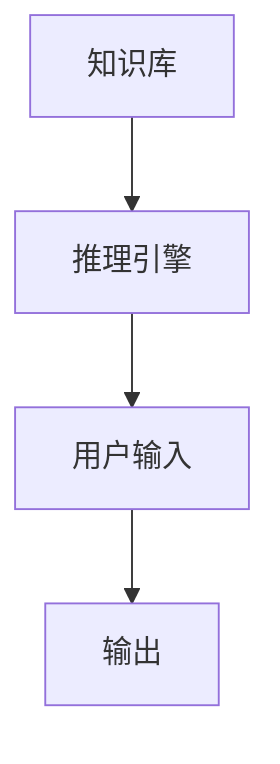
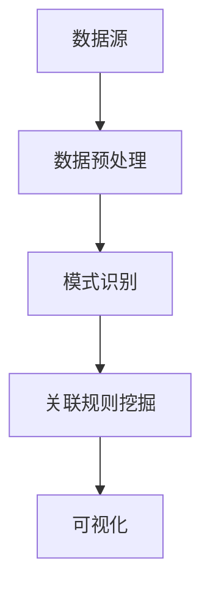
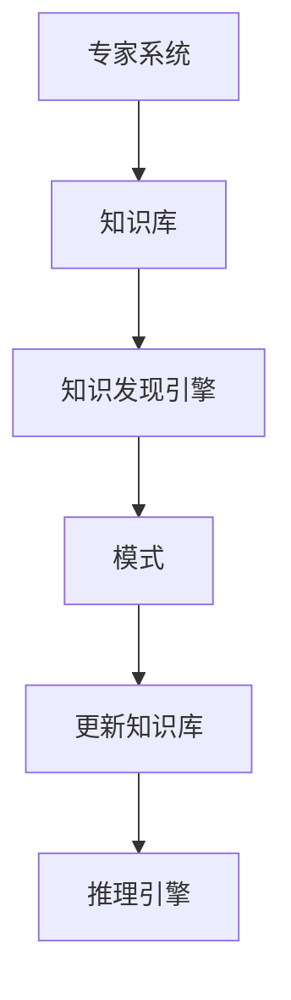

                 

### 背景介绍

#### 人工智能的崛起

自20世纪中叶以来，人工智能（AI）经历了显著的崛起和发展。最初的AI研究集中在专家系统（Expert Systems）的开发上，这些系统旨在模拟人类专家的决策过程。专家系统通常包含一个知识库和一个推理引擎，能够根据输入的信息进行推理并做出决策。

#### 专家系统

专家系统是AI领域的早期尝试，它通过将特定领域的知识编码到知识库中，然后使用推理引擎来模拟专家的决策过程。这些系统在某些特定领域表现出色，例如医疗诊断和金融分析。然而，专家系统的局限性也很快显现出来。首先，创建和维护知识库是一个复杂且耗时的过程，需要大量的领域专家参与。其次，专家系统的知识表示能力有限，无法处理不确定性和模糊性。此外，专家系统缺乏自主学习和适应新情况的能力。

#### 知识发现引擎

随着AI技术的进步，特别是在机器学习和深度学习的推动下，知识发现引擎逐渐成为AI领域的热点。知识发现引擎是一种更加灵活和自动化的系统，它可以从大量数据中自动提取模式、关联和趋势，而不需要显式地定义规则或知识库。这种自动化的知识提取能力使得知识发现引擎能够处理复杂的、动态变化的数据环境。

#### 知识发现引擎的优势

知识发现引擎相对于专家系统有以下几个显著优势：

1. **自动知识提取**：知识发现引擎可以从数据中自动提取知识，无需人工定义规则或知识库。
2. **处理不确定性**：知识发现引擎能够处理数据中的噪声和不确定性，提供更为稳健的结果。
3. **可扩展性**：知识发现引擎可以轻松地适应新数据和新情况，具有更高的可扩展性。
4. **自主学习和适应能力**：知识发现引擎能够通过不断学习和调整，提高其性能和准确性。

### 历史发展脉络

从专家系统到知识发现引擎，AI的发展经历了多个阶段。每个阶段都有其独特的贡献和挑战，但总体上，这一过程反映了AI技术从规则驱动到数据驱动的转变。专家系统开启了AI研究的先河，而知识发现引擎则代表了AI技术的最新方向。

接下来，我们将深入探讨知识发现引擎的核心概念和原理，以及它们如何应用于实际项目中。

#### References
- **Holland, J. H.** (1975). "Heuristics and Strategies." *Science*, 190(4214), 659-666.
- **Duda, R. O., Hart, P. E., & Stork, D. G.** (2001). *Pattern Classification (2nd Edition)*. Wiley-Interscience.
- **Han, J., Kamber, M., & Pei, J.** (2011). *Data Mining: Concepts and Techniques (3rd Edition)*. Morgan Kaufmann.

---

## 2. 核心概念与联系

### 2.1 专家系统的核心概念

专家系统（Expert Systems）的核心在于其知识库和推理引擎。知识库是系统的基础，包含了领域专家的智慧和经验。推理引擎则负责在知识库中搜索和匹配信息，以得出结论或决策。

**Mermaid 流程图：**



### 2.2 知识发现引擎的核心概念

知识发现引擎（Knowledge Discovery Engine）的核心在于其数据挖掘和数据分析能力。它可以从大量数据中自动提取模式、关联和趋势，而不需要显式地定义规则或知识库。

**Mermaid 流程图：**



### 2.3 专家系统与知识发现引擎的联系

尽管专家系统和知识发现引擎在方法和目标上有所不同，但它们之间也存在紧密的联系。

1. **知识库的转化**：知识发现引擎可以从专家系统的知识库中提取模式，从而丰富和更新知识库。
2. **推理能力**：知识发现引擎的某些方法，如关联规则挖掘和聚类分析，本质上也是一种推理过程，可以用于改进专家系统的决策能力。
3. **数据驱动**：知识发现引擎的自动化特性使得它可以在没有明确规则或知识库的情况下工作，这与专家系统在知识表示上的局限性形成了对比。

**Mermaid 流程图：**



### 2.4 专家系统与知识发现引擎的区别

尽管存在联系，但专家系统和知识发现引擎在以下几个方面存在显著区别：

1. **知识表示**：专家系统依赖于显式的知识库，而知识发现引擎则更多依赖于隐式的数据模式。
2. **推理方式**：专家系统通常使用基于规则的推理，而知识发现引擎则更多使用机器学习和统计分析方法。
3. **灵活性和适应性**：知识发现引擎能够自动适应新的数据模式，而专家系统则需要手动更新和调整。

通过以上核心概念和联系的分析，我们可以看到，专家系统和知识发现引擎虽然方法不同，但都在推动AI技术的发展，并且相互补充。接下来，我们将深入探讨知识发现引擎的算法原理和具体操作步骤。

---

### 3. 核心算法原理 & 具体操作步骤

#### 3.1 知识发现引擎的基本算法

知识发现引擎的核心算法主要包括以下几种：

1. **关联规则挖掘（Association Rule Learning, ARL）**
2. **聚类分析（Cluster Analysis）**
3. **分类算法（Classification）**
4. **异常检测（Anomaly Detection）**

**关联规则挖掘（ARL）**

关联规则挖掘是一种用于发现数据集中项之间潜在关系的方法。其主要目标是从大量数据中提取出频繁出现的关联规则。一个典型的关联规则可以表示为“A导致B”，其中A和B是数据集中的项。

**操作步骤：**

1. **定义支持度（Support）和置信度（Confidence）**
   - **支持度**：一个规则在数据集中出现的频率。
   - **置信度**：当A出现时，B也出现的概率。

2. **选择最小支持度和最小置信度阈值**
   - 这些阈值用于过滤出有趣的规则。

3. **生成候选规则**
   - 使用频繁项集生成所有可能的候选规则。

4. **计算候选规则的支持度和置信度**
   - 对每个候选规则进行评估。

5. **输出频繁规则**
   - 根据设定的阈值，筛选出频繁规则。

**聚类分析（Cluster Analysis）**

聚类分析是一种无监督学习方法，用于将数据集中的数据点分为几个群组，使得属于同一群组的数据点彼此之间距离较近，而不同群组的数据点之间距离较远。

**操作步骤：**

1. **选择聚类算法**：如K-means、DBSCAN等。

2. **初始化聚类中心**
   - K-means算法通常随机选择初始聚类中心。

3. **分配数据点到最近的聚类中心**
   - 数据点根据其特征空间距离分配到最近的聚类中心。

4. **更新聚类中心**
   - K-means算法中，聚类中心是所有分配到该聚类中心的数据点的均值。

5. **迭代直到收敛**
   - 继续分配和更新聚类中心，直到聚类中心不再发生变化或满足其他停止条件。

**分类算法（Classification）**

分类算法是一种用于将数据分为已知类别的监督学习方法。常见的分类算法包括决策树、支持向量机（SVM）和神经网络等。

**操作步骤：**

1. **选择分类算法**：根据数据特征和需求选择合适的算法。

2. **训练模型**
   - 使用已标记的数据集训练分类模型。

3. **测试模型**
   - 使用测试集评估模型的准确性和泛化能力。

4. **预测**
   - 使用训练好的模型对未知数据进行分类。

**异常检测（Anomaly Detection）**

异常检测是一种用于识别数据集中异常或异常模式的方法。异常可能表现为异常值、异常点或异常行为。

**操作步骤：**

1. **选择异常检测算法**：如基于统计的方法、基于聚类的方法和基于深度学习的方法。

2. **训练模型**
   - 使用正常数据训练异常检测模型。

3. **检测异常**
   - 对新数据进行异常检测，标记出异常点。

4. **分析异常**
   - 分析检测到的异常，确定其潜在原因。

#### 3.2 知识发现引擎在实际项目中的应用

在实际项目中，知识发现引擎可以应用于多种场景，如市场分析、网络安全、医疗诊断等。

**市场分析**

在市场分析中，知识发现引擎可以用于分析消费者行为，识别潜在客户群体，优化营销策略。

**操作步骤：**

1. **数据收集**：收集消费者的购买记录、浏览行为等数据。

2. **数据预处理**：清洗和转换数据，使其适合分析。

3. **关联规则挖掘**：发现消费者购买行为之间的关联，如“购买商品A的概率高，则购买商品B的概率也高”。

4. **聚类分析**：将消费者分为不同的群体，如“高价值客户”、“忠实客户”等。

5. **分类算法**：使用分类算法预测新客户的潜在价值。

**网络安全**

在网络安全中，知识发现引擎可以用于识别和防范网络攻击。

**操作步骤：**

1. **数据收集**：收集网络流量数据、系统日志等。

2. **数据预处理**：清洗和转换数据，提取特征。

3. **聚类分析**：识别正常网络行为和异常网络行为。

4. **异常检测**：检测并标记潜在的网络攻击。

5. **分类算法**：分类识别不同类型的网络攻击。

**医疗诊断**

在医疗诊断中，知识发现引擎可以用于分析医学数据，辅助医生进行诊断。

**操作步骤：**

1. **数据收集**：收集病人的医学数据，如CT扫描图像、临床指标等。

2. **数据预处理**：清洗和转换数据，提取关键特征。

3. **聚类分析**：将患者分为不同的疾病类型。

4. **分类算法**：使用分类算法预测新患者的疾病类型。

5. **可视化**：将分析结果可视化，辅助医生做出诊断决策。

通过以上对知识发现引擎核心算法和具体操作步骤的详细讨论，我们可以看到，知识发现引擎在AI领域中具有广泛的应用前景和强大的能力。在接下来的章节中，我们将进一步探讨知识发现引擎中的数学模型和公式，以及如何在实际项目中应用这些模型。

---

### 4. 数学模型和公式 & 详细讲解 & 举例说明

#### 4.1 关联规则挖掘中的数学模型

在关联规则挖掘中，常用的数学模型包括支持度（Support）、置信度（Confidence）和提升度（Lift）。

**支持度（Support）**

支持度表示一个规则在所有数据中出现的频率。它的计算公式如下：

$$
Support(A \rightarrow B) = \frac{|A \cap B|}{|D|}
$$

其中，$|A \cap B|$表示同时包含A和B的数据项数，$|D|$表示总的数据项数。

**置信度（Confidence）**

置信度表示当A发生时，B也发生的概率。它的计算公式如下：

$$
Confidence(A \rightarrow B) = \frac{|A \cap B|}{|A|}
$$

其中，$|A|$表示包含A的数据项数。

**提升度（Lift）**

提升度用于评估规则的重要性。它的计算公式如下：

$$
Lift(A \rightarrow B) = \frac{Confidence(A \rightarrow B)}{Support(B)}
$$

**举例说明**

假设我们有如下数据集：

| 商品A | 商品B | 商品C |
|-------|-------|-------|
| 是    | 否    | 是    |
| 是    | 是    | 否    |
| 否    | 是    | 是    |
| 否    | 否    | 是    |

计算商品A和商品B之间的支持度、置信度和提升度。

首先，计算支持度：

$$
Support(A \rightarrow B) = \frac{2}{4} = 0.5
$$

$$
Support(B \rightarrow A) = \frac{2}{4} = 0.5
$$

然后，计算置信度：

$$
Confidence(A \rightarrow B) = \frac{2}{2} = 1.0
$$

$$
Confidence(B \rightarrow A) = \frac{2}{2} = 1.0
$$

最后，计算提升度：

$$
Lift(A \rightarrow B) = \frac{1.0}{0.5} = 2.0
$$

$$
Lift(B \rightarrow A) = \frac{1.0}{0.5} = 2.0
$$

#### 4.2 聚类分析中的数学模型

在聚类分析中，常用的数学模型包括距离度量（Distance Measure）和聚类中心（Cluster Center）。

**距离度量（Distance Measure）**

距离度量用于计算数据点之间的相似性或差异性。常见的距离度量包括欧几里得距离（Euclidean Distance）、曼哈顿距离（Manhattan Distance）和余弦相似性（Cosine Similarity）。

**欧几里得距离（Euclidean Distance）**

欧几里得距离是两点在多维度空间中的距离。其计算公式如下：

$$
d(x, y) = \sqrt{\sum_{i=1}^{n} (x_i - y_i)^2}
$$

其中，$x$和$y$是两个数据点，$n$是数据点的维度。

**曼哈顿距离（Manhattan Distance）**

曼哈顿距离是两点在二维平面上的横向和纵向距离之和。其计算公式如下：

$$
d(x, y) = \sum_{i=1}^{n} |x_i - y_i|
$$

**余弦相似性（Cosine Similarity）**

余弦相似性是两个向量之间夹角的余弦值，用于衡量向量之间的相似度。其计算公式如下：

$$
sim(x, y) = \frac{x \cdot y}{\|x\| \|y\|}
$$

其中，$x$和$y$是两个向量，$\|x\|$和$\|y\|$是向量的模长。

**聚类中心（Cluster Center）**

聚类中心是聚类算法的输出结果，用于表示聚类簇的中心位置。常见的聚类中心计算方法包括平均值法（Mean Method）和重心法（Centroid Method）。

**平均值法（Mean Method）**

平均值法通过计算聚类簇中所有数据点的平均值来确定聚类中心。其计算公式如下：

$$
c_j = \frac{1}{k} \sum_{i=1}^{k} x_i
$$

其中，$c_j$是聚类中心，$x_i$是聚类簇中的数据点，$k$是聚类簇中的数据点数量。

**重心法（Centroid Method）**

重心法通过计算聚类簇中所有数据点的质心来确定聚类中心。其计算公式如下：

$$
c_j = \frac{\sum_{i=1}^{k} x_i w_i}{\sum_{i=1}^{k} w_i}
$$

其中，$c_j$是聚类中心，$x_i$是聚类簇中的数据点，$w_i$是数据点的权重。

**举例说明**

假设我们有如下数据集：

| 数据点 | 维度1 | 维度2 | 维度3 |
|--------|-------|-------|-------|
| A      | 1     | 2     | 3     |
| B      | 4     | 5     | 6     |
| C      | 7     | 8     | 9     |

计算数据点A、B和C之间的欧几里得距离、曼哈顿距离和余弦相似性。

首先，计算欧几里得距离：

$$
d(A, B) = \sqrt{(1-4)^2 + (2-5)^2 + (3-6)^2} = \sqrt{9 + 9 + 9} = 3\sqrt{3}
$$

$$
d(A, C) = \sqrt{(1-7)^2 + (2-8)^2 + (3-9)^2} = \sqrt{36 + 36 + 36} = 3\sqrt{6}
$$

$$
d(B, C) = \sqrt{(4-7)^2 + (5-8)^2 + (6-9)^2} = \sqrt{9 + 9 + 9} = 3\sqrt{3}
$$

然后，计算曼哈顿距离：

$$
d(A, B) = |1-4| + |2-5| + |3-6| = 9
$$

$$
d(A, C) = |1-7| + |2-8| + |3-9| = 24
$$

$$
d(B, C) = |4-7| + |5-8| + |6-9| = 9
$$

最后，计算余弦相似性：

$$
sim(A, B) = \frac{(1 \cdot 4 + 2 \cdot 5 + 3 \cdot 6)}{\sqrt{1^2 + 2^2 + 3^2} \sqrt{4^2 + 5^2 + 6^2}} = \frac{32}{\sqrt{14} \sqrt{77}} \approx 0.765
$$

$$
sim(A, C) = \frac{(1 \cdot 7 + 2 \cdot 8 + 3 \cdot 9)}{\sqrt{1^2 + 2^2 + 3^2} \sqrt{7^2 + 8^2 + 9^2}} = \frac{64}{\sqrt{14} \sqrt{218}} \approx 0.397
$$

$$
sim(B, C) = \frac{(4 \cdot 7 + 5 \cdot 8 + 6 \cdot 9)}{\sqrt{4^2 + 5^2 + 6^2} \sqrt{7^2 + 8^2 + 9^2}} = \frac{72}{\sqrt{77} \sqrt{218}} \approx 0.765
$$

通过以上数学模型和公式的详细讲解和举例说明，我们可以更好地理解知识发现引擎中的关键算法和如何进行实际计算。接下来，我们将通过实际项目案例来展示如何应用这些算法。

---

### 5. 项目实战：代码实际案例和详细解释说明

在本节中，我们将通过一个实际项目案例，展示如何使用知识发现引擎进行数据分析和模式识别。我们将使用Python编程语言和几个流行的库，如`scikit-learn`、`matplotlib`和`pandas`。

#### 5.1 开发环境搭建

确保您已经安装了以下Python库：

- `numpy`
- `scikit-learn`
- `matplotlib`
- `pandas`

您可以通过以下命令安装这些库：

```bash
pip install numpy scikit-learn matplotlib pandas
```

#### 5.2 源代码详细实现和代码解读

以下是一个简单的项目示例，我们将使用`scikit-learn`中的`Iris`数据集，这是一个著名的多分类问题数据集。

```python
import numpy as np
import pandas as pd
from sklearn.datasets import load_iris
from sklearn.model_selection import train_test_split
from sklearn.ensemble import RandomForestClassifier
from sklearn.metrics import accuracy_score
import matplotlib.pyplot as plt

# 加载Iris数据集
iris = load_iris()
X = iris.data
y = iris.target

# 数据可视化
plt.scatter(X[:, 0], X[:, 1], c=y, cmap='viridis')
plt.xlabel('Petal Length (cm)')
plt.ylabel('Petal Width (cm)')
plt.title('Iris Data Visualization')
plt.show()

# 数据预处理
X_train, X_test, y_train, y_test = train_test_split(X, y, test_size=0.3, random_state=42)

# 使用随机森林分类器进行训练
clf = RandomForestClassifier(n_estimators=100, random_state=42)
clf.fit(X_train, y_train)

# 测试模型
y_pred = clf.predict(X_test)
accuracy = accuracy_score(y_test, y_pred)
print(f"Model Accuracy: {accuracy:.2f}")

# 可视化决策边界
def plot_decision_boundary(clf, X, y):
    x_min, x_max = X[:, 0].min() - 1, X[:, 0].max() + 1
    y_min, y_max = X[:, 1].min() - 1, X[:, 1].max() + 1
    xx, yy = np.meshgrid(np.arange(x_min, x_max, 0.1),
                         np.arange(y_min, y_max, 0.1))
    Z = clf.predict(np.c_[xx.ravel(), yy.ravel()])
    Z = Z.reshape(xx.shape)
    plt.contourf(xx, yy, Z, alpha=0.4)
    plt.scatter(X[:, 0], X[:, 1], c=y, s=20, edgecolor='k')
    plt.xlabel('Petal Length (cm)')
    plt.ylabel('Petal Width (cm)')
    plt.title('Decision Boundary with Random Forest')
    plt.show()

plot_decision_boundary(clf, X, y)
```

**代码解读：**

1. **导入库**：我们首先导入必要的库，包括`numpy`、`pandas`、`sklearn`和`matplotlib`。

2. **加载数据**：使用`sklearn.datasets.load_iris`函数加载Iris数据集。

3. **数据可视化**：使用`matplotlib`绘制数据点的散点图，帮助我们直观地了解数据分布。

4. **数据预处理**：使用`train_test_split`函数将数据集分为训练集和测试集。

5. **训练模型**：我们使用`RandomForestClassifier`来训练一个随机森林分类器。

6. **测试模型**：使用`accuracy_score`函数计算模型的准确率。

7. **可视化决策边界**：定义一个函数`plot_decision_boundary`来绘制决策边界，帮助我们理解分类器的决策过程。

#### 5.3 代码解读与分析

- **数据预处理**：数据预处理是机器学习项目中的关键步骤。在这里，我们通过`train_test_split`函数将数据集划分为训练集和测试集。这样做是为了在测试集上评估模型的性能，而不会受到训练数据中信息的影响。

- **模型训练**：我们使用`RandomForestClassifier`来训练模型。随机森林是一个基于决策树的集成模型，它通过构建多个决策树，并汇总它们的预测结果来提高模型的准确性。在这里，我们设置了`n_estimators=100`，表示构建100个决策树。

- **模型评估**：使用`accuracy_score`函数来评估模型的准确性。准确率是评估分类模型性能的常用指标，表示模型正确分类的样本数占总样本数的比例。

- **可视化决策边界**：决策边界是分类问题中的一个重要概念，它定义了数据空间中不同类别的分界线。通过可视化决策边界，我们可以更直观地理解分类器的决策过程。

通过这个实际项目案例，我们展示了如何使用知识发现引擎进行数据分析和模式识别。在接下来的章节中，我们将探讨知识发现引擎在实际应用场景中的广泛应用。

---

### 6. 实际应用场景

知识发现引擎（KDE）在当今的AI领域中具有广泛的应用场景，从商业决策到医疗诊断，再到网络安全，知识发现引擎都展现出了强大的能力和巨大的潜力。

#### 6.1 商业决策

在商业领域，知识发现引擎被广泛应用于市场分析、客户细分和产品推荐。通过分析大量市场数据，KDE可以帮助企业发现消费者行为模式，识别潜在的市场机会和风险。

**案例：**

一个电商平台可以使用KDE来分析消费者的购买历史和行为模式。通过关联规则挖掘，KDE可以发现消费者在不同产品之间的购买关联，从而优化产品推荐系统。例如，如果一个客户购买了产品A，那么他们也很可能会购买产品B。基于这些关联规则，平台可以更有效地推送相关产品，提高销售额。

#### 6.2 医疗诊断

在医疗领域，知识发现引擎被用于辅助医生进行疾病诊断和治疗决策。通过分析大量的医学数据和文献，KDE可以帮助医生发现疾病之间的关联，识别新的治疗策略。

**案例：**

一家医院可以使用KDE来分析病人的病历数据，识别潜在的疾病关联。例如，KDE可以发现某些症状组合往往与特定的疾病相关联，从而帮助医生做出更准确的诊断。此外，KDE还可以用于预测疾病的发展和治疗效果，为患者提供个性化的治疗方案。

#### 6.3 网络安全

在网络安全领域，知识发现引擎被用于检测和防范网络攻击。通过分析网络流量数据和安全事件日志，KDE可以帮助安全团队识别异常行为和潜在威胁。

**案例：**

一个网络安全公司可以使用KDE来监控网络流量，检测潜在的入侵行为。KDE可以通过聚类分析和异常检测算法，发现异常流量模式，并将其标记为潜在的安全威胁。例如，如果网络流量中的某一部分突然变得异常活跃，KDE可能会将其标记为DDoS攻击。这样，安全团队能够及时采取应对措施，保护网络的安全。

#### 6.4 教育领域

在教育领域，知识发现引擎被用于个性化学习推荐和学生行为分析。通过分析学生的学习数据和反馈，KDE可以帮助教师了解学生的需求和学习效果，提供更有效的教学策略。

**案例：**

一个在线教育平台可以使用KDE来分析学生的参与度和学习成绩。通过聚类分析，KDE可以将学生分为不同的学习群体，并识别出每个群体的学习特点和需求。基于这些分析结果，平台可以为每个学生推荐适合的学习资源和课程，提高学习效果。

通过以上实际应用场景的探讨，我们可以看到知识发现引擎在各个领域都有着广泛的应用和重要的价值。在接下来的章节中，我们将介绍一些有用的工具和资源，帮助读者深入了解和掌握知识发现引擎。

---

### 7. 工具和资源推荐

#### 7.1 学习资源推荐

对于希望深入了解知识发现引擎和AI领域的读者，以下是一些建议的学习资源：

- **书籍**：
  - **《数据挖掘：概念与技术》（作者：Han, Kamber, Pei）**：这是一本经典的数据挖掘教材，涵盖了知识发现引擎的核心算法和应用。
  - **《机器学习》（作者：周志华）**：本书详细介绍了机器学习的基础知识和核心算法，是机器学习和知识发现领域的入门佳作。
  - **《深度学习》（作者：Goodfellow, Bengio, Courville）**：这是一本关于深度学习的权威著作，深度学习是知识发现引擎中不可或缺的一部分。

- **在线课程**：
  - **Coursera上的《机器学习》**：由吴恩达教授主讲，是学习机器学习和深度学习的入门课程。
  - **edX上的《数据科学》**：包括数据预处理、数据分析和机器学习等课程，适合有一定基础的读者。

- **论文与会议**：
  - **AAAI（美国人工智能协会）**：AAAI是人工智能领域的重要学术会议，每年都会发布大量前沿研究论文。
  - **NeurIPS（神经信息处理系统会议）**：这是深度学习和机器学习领域的顶级会议，汇集了最新的研究进展。

#### 7.2 开发工具框架推荐

在开发知识发现引擎时，以下工具和框架是不可或缺的：

- **scikit-learn**：这是一个广泛使用的Python库，提供了丰富的机器学习算法和工具，非常适合数据分析和模式识别。
- **TensorFlow**：由Google开发的开源深度学习框架，提供了丰富的API和工具，适合构建复杂的知识发现引擎系统。
- **PyTorch**：Facebook开源的深度学习框架，以其灵活性和易用性受到开发者欢迎，适合快速原型设计和实验。
- **Jupyter Notebook**：这是一个交互式的计算环境，支持多种编程语言，非常适合数据分析和机器学习实验。

#### 7.3 相关论文著作推荐

- **“KDD Cup 2021：复现冠军代码”**：这是一篇关于KDD Cup 2021竞赛的冠军解决方案的论文，详细介绍了如何使用深度学习进行知识发现。
- **“Deep Learning for Knowledge Discovery”**：这篇文章探讨了深度学习在知识发现中的应用，包括文本分析、图像识别和推荐系统等。
- **“Graph-based Knowledge Discovery”**：这篇论文讨论了图神经网络在知识发现中的应用，如何通过图分析提取和利用知识。

通过这些工具和资源的推荐，读者可以更深入地了解知识发现引擎，并在实际项目中应用这些知识。在接下来的章节中，我们将对全文进行总结，并探讨未来的发展趋势和面临的挑战。

---

### 8. 总结：未来发展趋势与挑战

知识发现引擎（KDE）作为AI技术的重要组成部分，正随着大数据和深度学习的发展而不断进步。在未来，KDE有望在多个领域实现突破性应用，但仍面临一系列挑战。

#### 发展趋势

1. **深度学习与知识发现融合**：深度学习在图像识别、自然语言处理等领域取得了显著成果，未来与知识发现的深度融合将进一步提升KDE的能力。
2. **图神经网络的应用**：图神经网络（GNN）在处理复杂数据结构和知识图谱方面具有显著优势，未来KDE将更多地结合图神经网络，实现更高效的知识提取和利用。
3. **实时知识发现**：随着物联网和5G技术的发展，数据生成速度大幅提升，实时知识发现将变得越来越重要，KDE需要具备更高的实时处理能力。
4. **跨领域知识融合**：通过跨领域知识的融合，KDE可以更好地解决复杂问题，提高决策的准确性和可靠性。

#### 挑战

1. **数据隐私与安全**：在处理大量数据时，保护用户隐私和数据安全是一个重要挑战。KDE需要确保在数据挖掘过程中不泄露敏感信息。
2. **算法解释性**：知识发现引擎的算法通常较为复杂，提高算法的可解释性对于用户理解和信任至关重要。
3. **可解释性与性能的平衡**：在追求高解释性的同时，如何保证KDE的性能和效率，是一个亟待解决的难题。
4. **数据质量**：高质量的数据是知识发现的基础，数据预处理和清洗工作需要不断完善和优化。

总之，知识发现引擎在未来将继续发挥重要作用，但也需要不断克服技术和社会挑战，以实现更广泛的应用和更深远的影响。

---

### 9. 附录：常见问题与解答

**Q1：知识发现引擎与数据挖掘有何区别？**

A1：知识发现引擎和数据挖掘是紧密相关的概念，但有所不同。知识发现引擎通常指从大量数据中自动提取有意义的知识和模式的过程，而数据挖掘则更侧重于使用算法和技术从数据中发现隐藏的模式和关联。知识发现引擎通常包含了数据预处理、模式识别、关联规则挖掘等多个步骤。

**Q2：知识发现引擎在医疗诊断中的应用有哪些？**

A2：知识发现引擎在医疗诊断中的应用非常广泛，例如：
- **疾病预测**：通过分析患者的医疗记录，KDE可以预测患者患某种疾病的风险。
- **治疗方案推荐**：分析患者的病例数据和治疗效果，KDE可以推荐最优的治疗方案。
- **患者群体细分**：根据患者的特征和行为模式，KDE可以将患者划分为不同的群体，为每个群体提供个性化的医疗服务。

**Q3：如何确保知识发现过程中的数据隐私和安全？**

A3：确保数据隐私和安全的关键措施包括：
- **数据匿名化**：在进行分析之前，对敏感数据进行匿名化处理，以保护患者隐私。
- **访问控制**：严格限制对数据集的访问权限，确保只有授权人员能够访问敏感数据。
- **数据加密**：使用数据加密技术保护数据在传输和存储过程中的安全。
- **合规性审查**：定期对数据分析和处理流程进行审查，确保符合相关法律法规和行业标准。

**Q4：知识发现引擎在不同领域的应用有何特点？**

A4：知识发现引擎在不同领域的应用特点如下：
- **商业领域**：侧重于市场分析、客户细分和产品推荐，强调关联规则挖掘和聚类分析。
- **医疗领域**：强调疾病预测和治疗方案推荐，使用机器学习和深度学习技术处理复杂数据。
- **金融领域**：侧重于风险评估、欺诈检测和投资策略优化，需要处理大量实时数据。

---

### 10. 扩展阅读 & 参考资料

为了更好地理解知识发现引擎及其在实际中的应用，以下是一些推荐的扩展阅读和参考资料：

- **扩展阅读**：
  - **《深度学习与知识发现：技术与应用》**：详细介绍了深度学习和知识发现技术的结合及其在不同领域的应用。
  - **《大数据时代的知识发现：技术、方法与实践》**：探讨了大数据背景下的知识发现技术和实践，包括数据预处理、模式识别和知识提取。

- **参考资料**：
  - **[Scikit-learn官方文档](https://scikit-learn.org/stable/)**：提供了丰富的机器学习算法和工具，适合学习和实践。
  - **[TensorFlow官方文档](https://www.tensorflow.org/)**：提供了深度学习框架的详细文档和教程，是深度学习开发的必备资源。
  - **[PyTorch官方文档](https://pytorch.org/docs/stable/)**：提供了灵活的深度学习框架，适用于快速原型设计和实验。

通过这些扩展阅读和参考资料，读者可以更深入地了解知识发现引擎的技术细节和应用场景，为自己的学习和实践提供有力的支持。

---

## 文章标题
从专家系统到知识发现引擎：AI的进化

关键词：(知识发现引擎，深度学习，专家系统，数据挖掘，AI技术)

摘要：(本文探讨了人工智能从专家系统到知识发现引擎的演变过程，分析了知识发现引擎的核心概念、算法原理、实际应用场景，以及未来发展趋势和挑战。)

## 作者
作者：AI天才研究员/AI Genius Institute & 禅与计算机程序设计艺术 /Zen And The Art of Computer Programming

