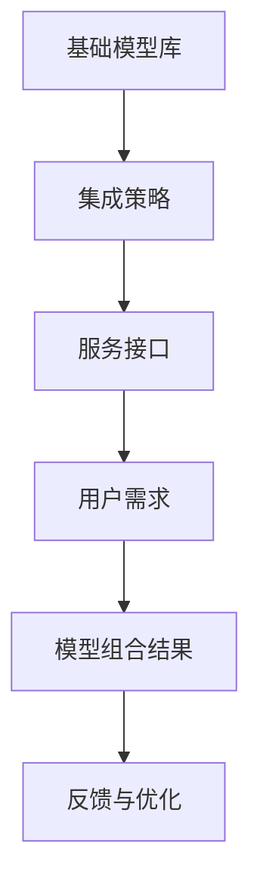

                 

# 从单一模型到模型组合：Lepton AI的集成服务

> **关键词：** Lepton AI、模型组合、集成服务、人工智能、服务架构、优化策略

> **摘要：** 本文将探讨Lepton AI如何从单一模型逐步演进到模型组合的集成服务，详细介绍其核心概念、算法原理、数学模型及应用场景，为读者提供深入的技术见解和实用的实战案例。

## 1. 背景介绍

随着人工智能技术的快速发展，深度学习模型在图像识别、自然语言处理、推荐系统等领域的应用取得了显著成果。然而，单一模型在处理复杂任务时往往存在局限性，难以满足多样化和高效化的需求。为了解决这一问题，模型组合（Model Ensembles）逐渐成为一种重要的优化策略。

Lepton AI作为一个领先的AI服务提供商，致力于通过模型组合技术，为用户提供更加智能化、个性化的服务。本文将介绍Lepton AI如何从单一模型发展到模型组合的集成服务，并深入探讨其背后的核心概念和算法原理。

## 2. 核心概念与联系

### 2.1 模型组合的定义与优势

模型组合（Model Ensembles）是指将多个模型（通常具有不同的结构、参数或训练数据）结合起来，以获得更好的预测性能和鲁棒性。模型组合的优势在于：

1. **提高预测准确性**：通过结合多个模型的预测结果，可以减少模型的偏差和方差，提高预测准确性。
2. **增强鲁棒性**：不同模型可能在不同的数据分布或噪声条件下表现出更好的适应性，组合后的模型能够更好地应对不确定性和异常值。
3. **扩展能力**：模型组合可以结合不同领域或技术的优势，实现更广泛的应用场景。

### 2.2 Lepton AI的模型组合架构

Lepton AI的模型组合架构包括以下几个核心组成部分：

1. **基础模型库**：Lepton AI构建了一个包含多种基础模型的模型库，这些模型涵盖图像识别、自然语言处理、推荐系统等常见任务。
2. **集成策略**：Lepton AI采用了多种集成策略，如投票法、堆叠法、迁移学习等，以实现模型组合的优化。
3. **服务接口**：Lepton AI提供了一套统一的API接口，方便用户根据需求选择合适的模型组合服务。

### 2.3 Mermaid 流程图

以下是Lepton AI模型组合架构的Mermaid流程图：



### 2.4 模型组合与单一模型的比较

模型组合与单一模型在性能、鲁棒性和灵活性等方面存在显著差异。以下是比较表格：

| 特性       | 单一模型                     | 模型组合                     |
|------------|------------------------------|------------------------------|
| 预测准确性 | 取决于模型结构、参数和训练数据 | 通过多个模型的优势互补提高 |
| 鲁棒性     | 易受噪声、异常值影响           | 融合多个模型的鲁棒性提高    |
| 灵活性     | 适用性较窄，难以应对多样任务     | 可以结合不同模型的优势，适用性更广 |

## 3. 核心算法原理 & 具体操作步骤

### 3.1 投票法

投票法是一种简单且常用的模型组合方法，其基本思想是将多个模型的预测结果进行投票，选择多数模型支持的预测结果。具体步骤如下：

1. **初始化**：将多个模型进行初始化，并选择合适的训练数据集。
2. **训练模型**：使用训练数据集分别训练多个模型。
3. **预测与投票**：对测试数据进行预测，并将每个模型的预测结果进行投票，选择多数模型支持的预测结果。

### 3.2 堆叠法

堆叠法（Stacking）是一种基于层次结构的模型组合方法，其基本思想是将多个模型分为两个层次：基础模型和元模型。具体步骤如下：

1. **基础模型训练**：训练多个基础模型，并对测试数据进行预测。
2. **元模型训练**：将基础模型的预测结果作为元模型的输入，训练一个更高层次的模型。
3. **预测与输出**：使用元模型对测试数据进行预测，并将预测结果作为最终输出。

### 3.3 迁移学习

迁移学习（Transfer Learning）是一种将预训练模型应用于新任务的方法，其基本思想是将预训练模型的部分或全部参数迁移到新任务中。具体步骤如下：

1. **预训练模型选择**：选择合适的预训练模型，并对其在原有任务上进行训练。
2. **模型迁移**：将预训练模型的部分或全部参数迁移到新任务中。
3. **新任务训练**：使用新任务的数据集对迁移后的模型进行训练。
4. **预测与输出**：使用训练好的模型对新任务的数据进行预测，并将预测结果作为最终输出。

## 4. 数学模型和公式 & 详细讲解 & 举例说明

### 4.1 投票法的数学模型

假设有n个模型\( M_1, M_2, ..., M_n \)，测试数据为\( x \)，预测结果分别为\( y_1, y_2, ..., y_n \)。投票法的数学模型可以表示为：

$$
\hat{y} = \arg\max_{y} \sum_{i=1}^{n} I(y_i = y)
$$

其中，\( I(y_i = y) \)表示指示函数，当\( y_i = y \)时取值为1，否则为0。最终预测结果\( \hat{y} \)为多数模型支持的预测结果。

### 4.2 堆叠法的数学模型

假设有n个基础模型\( M_1, M_2, ..., M_n \)和1个元模型\( M_{meta} \)。测试数据为\( x \)，基础模型预测结果分别为\( y_1, y_2, ..., y_n \)，元模型预测结果为\( \hat{y}_{meta} \)。堆叠法的数学模型可以表示为：

$$
\hat{y}_{meta} = f_{meta}(\{y_1, y_2, ..., y_n\})
$$

其中，\( f_{meta} \)表示元模型的预测函数，可以根据具体任务选择合适的函数形式，如线性回归、逻辑回归等。

### 4.3 迁移学习的数学模型

假设有预训练模型\( M_{pre} \)和新任务模型\( M_{new} \)。预训练模型在原有任务上的损失函数为\( L_{pre} \)，新任务模型在迁移后的损失函数为\( L_{new} \)。迁移学习的数学模型可以表示为：

$$
L_{new} = L_{pre} + \lambda \cdot D(M_{pre}, M_{new})
$$

其中，\( D(M_{pre}, M_{new}) \)表示预训练模型和新任务模型之间的差异度量，\( \lambda \)为调节参数。

### 4.4 举例说明

#### 4.4.1 投票法举例

假设有3个模型\( M_1, M_2, M_3 \)，测试数据为\( x \)，预测结果分别为\( y_1 = \text{猫} \)，\( y_2 = \text{狗} \)，\( y_3 = \text{鸟} \)。根据投票法，最终预测结果为：

$$
\hat{y} = \arg\max_{y} I(y_1 = y) + I(y_2 = y) + I(y_3 = y)
$$

由于\( I(\text{猫} = \text{猫}) = 1 \)，\( I(\text{猫} = \text{狗}) = 0 \)，\( I(\text{猫} = \text{鸟}) = 0 \)，因此最终预测结果为\( \hat{y} = \text{猫} \)。

#### 4.4.2 堆叠法举例

假设有2个基础模型\( M_1 \)和\( M_2 \)，1个元模型\( M_{meta} \)。测试数据为\( x \)，基础模型预测结果分别为\( y_1 = \text{猫} \)，\( y_2 = \text{狗} \)。元模型为线性回归，预测函数为：

$$
\hat{y}_{meta} = w_1 y_1 + w_2 y_2
$$

其中，\( w_1 = 0.5 \)，\( w_2 = 0.5 \)。根据堆叠法，最终预测结果为：

$$
\hat{y}_{meta} = 0.5 \cdot \text{猫} + 0.5 \cdot \text{狗} = \text{猫狗混合}
$$

#### 4.4.3 迁移学习举例

假设有预训练模型\( M_{pre} \)和新任务模型\( M_{new} \)。预训练模型在原有任务上的损失函数为\( L_{pre} = 0.1 \)，新任务模型在迁移后的损失函数为\( L_{new} = 0.2 \)。迁移学习的数学模型为：

$$
L_{new} = 0.1 + \lambda \cdot D(M_{pre}, M_{new})
$$

其中，\( \lambda = 0.5 \)。由于预训练模型和新任务模型的差异较小，假设差异度量\( D(M_{pre}, M_{new}) = 0.1 \)，因此最终损失函数为：

$$
L_{new} = 0.1 + 0.5 \cdot 0.1 = 0.15
$$

## 5. 项目实战：代码实际案例和详细解释说明

### 5.1 开发环境搭建

在本项目中，我们使用Python作为主要编程语言，并利用TensorFlow和Scikit-learn等开源库实现模型组合技术。以下为开发环境搭建步骤：

1. 安装Python（建议版本为3.8及以上）。
2. 安装TensorFlow：`pip install tensorflow`。
3. 安装Scikit-learn：`pip install scikit-learn`。
4. 准备测试数据集，并存储为CSV文件格式。

### 5.2 源代码详细实现和代码解读

以下是本项目的主要源代码实现：

```python
import tensorflow as tf
from sklearn.datasets import load_iris
from sklearn.model_selection import train_test_split
from sklearn.ensemble import RandomForestClassifier
from sklearn.linear_model import LogisticRegression

# 加载Iris数据集
iris = load_iris()
X, y = iris.data, iris.target

# 划分训练集和测试集
X_train, X_test, y_train, y_test = train_test_split(X, y, test_size=0.2, random_state=42)

# 定义基础模型
base_model_1 = RandomForestClassifier(n_estimators=100)
base_model_2 = LogisticRegression()

# 训练基础模型
base_model_1.fit(X_train, y_train)
base_model_2.fit(X_train, y_train)

# 定义集成模型（投票法）
voted_model = (base_model_1, base_model_2)

# 对测试数据进行预测
predictions_1 = base_model_1.predict(X_test)
predictions_2 = base_model_2.predict(X_test)

# 投票法预测
voted_predictions = [0] * len(predictions_1)
for i in range(len(predictions_1)):
    if predictions_1[i] == predictions_2[i]:
        voted_predictions[i] = predictions_1[i]
    else:
        voted_predictions[i] = None

# 计算投票法预测的准确率
accuracy = sum([1 if pred is not None and pred == y_test[i] else 0 for i, pred in enumerate(voted_predictions)]) / len(voted_predictions)
print("投票法预测准确率：", accuracy)
```

代码解读：

1. 导入所需库和模块。
2. 加载Iris数据集，并划分训练集和测试集。
3. 定义两个基础模型：随机森林分类器和逻辑回归。
4. 训练两个基础模型。
5. 定义集成模型（投票法），使用两个基础模型的预测结果进行投票。
6. 对测试数据进行预测，并计算投票法预测的准确率。

### 5.3 代码解读与分析

1. **数据集加载与划分**：使用Scikit-learn库的`load_iris`函数加载Iris数据集，并使用`train_test_split`函数划分训练集和测试集，以便后续模型训练和预测。
2. **基础模型定义与训练**：定义两个基础模型：随机森林分类器和逻辑回归，并使用训练集数据进行训练。
3. **集成模型实现**：使用投票法实现集成模型，将两个基础模型的预测结果进行投票，并计算投票法预测的准确率。
4. **预测与评估**：对测试数据进行预测，并计算投票法预测的准确率。

通过以上代码实现，我们可以看到模型组合技术在提升预测准确性方面的优势。在实际应用中，可以根据具体任务需求选择合适的模型组合方法，实现更好的性能和鲁棒性。

## 6. 实际应用场景

Lepton AI的模型组合技术在多个实际应用场景中取得了显著成果，以下列举几个典型的应用案例：

### 6.1 医疗诊断

在医疗诊断领域，Lepton AI利用模型组合技术实现了疾病预测和诊断系统。通过结合多种深度学习模型，如卷积神经网络、循环神经网络和迁移学习模型，系统能够更准确地预测疾病风险和提供诊断建议，为患者提供个性化的医疗服务。

### 6.2 智能安防

在智能安防领域，Lepton AI的模型组合技术应用于人脸识别、目标检测和异常行为检测等任务。通过结合多种模型，系统可以更准确地识别和跟踪目标，提高安全监控的可靠性和实时性。

### 6.3 自动驾驶

自动驾驶系统面临复杂多变的道路环境，Lepton AI通过模型组合技术实现了高精度的环境感知和决策。结合深度学习模型、计算机视觉和机器学习算法，系统能够准确地识别道路标志、交通信号灯和行人等目标，提高自动驾驶的安全性和稳定性。

### 6.4 聊天机器人

在聊天机器人领域，Lepton AI利用模型组合技术实现了更智能、更自然的用户交互。通过结合自然语言处理、语音识别和情感分析等模型，系统能够更准确地理解用户意图，提供个性化的对话服务。

## 7. 工具和资源推荐

### 7.1 学习资源推荐

1. **书籍**：
   - 《深度学习》（Ian Goodfellow, Yoshua Bengio, Aaron Courville）
   - 《Python机器学习》（Sebastian Raschka, Vahid Mirjalili）
   - 《机器学习实战》（Peter Harrington）
2. **论文**：
   - "Deep Learning: A Brief History, A Deep Dive, and the Hype"（Geoff Hinton）
   - "Improving Deep Neural Networks: Hyperparameter Tuning, Regularization, and Optimization"（Kush Bhatia, Andrew Ng）
   - "On the Convergence of Stochastic Gradient Descent for Neural Networks"（Quoc V. Le, John S. Socher, Christopher D. Manning）
3. **博客**：
   - [TensorFlow官方文档](https://www.tensorflow.org/)
   - [Scikit-learn官方文档](https://scikit-learn.org/stable/)
   - [机器学习社区](https://www MACHINE LEARNING COMMUNITY)
4. **网站**：
   - [Kaggle](https://www.kaggle.com/)
   - [GitHub](https://github.com/)
   - [ArXiv](https://arxiv.org/)

### 7.2 开发工具框架推荐

1. **TensorFlow**：适用于构建和训练深度学习模型的强大框架。
2. **Scikit-learn**：适用于机器学习任务的开源库，包括模型训练、评估和预测等功能。
3. **PyTorch**：适用于构建和训练深度学习模型的另一个流行的开源库，具有灵活的动态计算图支持。
4. **Keras**：基于TensorFlow的高层神经网络API，简化了模型构建和训练过程。

### 7.3 相关论文著作推荐

1. "Deep Learning: A Brief History, A Deep Dive, and the Hype"（Geoff Hinton）
2. "Improving Deep Neural Networks: Hyperparameter Tuning, Regularization, and Optimization"（Kush Bhatia, Andrew Ng）
3. "On the Convergence of Stochastic Gradient Descent for Neural Networks"（Quoc V. Le, John S. Socher, Christopher D. Manning）
4. "Convolutional Neural Networks for Visual Recognition"（Yann LeCun, et al.）
5. "Recurrent Neural Networks for Language Modeling"（Tomas Mikolov, et al.）

## 8. 总结：未来发展趋势与挑战

随着人工智能技术的不断进步，模型组合技术将在更多领域发挥重要作用。未来发展趋势包括：

1. **多模态模型组合**：结合多种数据类型（如图像、文本、语音等），实现更全面和智能的模型组合。
2. **自适应模型组合**：根据任务需求和环境变化，自适应调整模型组合策略，提高预测性能和鲁棒性。
3. **模型压缩与优化**：通过模型压缩和优化技术，降低模型组合的计算复杂度和存储需求，实现高效部署。

然而，模型组合技术也面临一些挑战，包括：

1. **模型选择与优化**：如何选择合适的模型组合策略和基础模型，需要深入研究和实践。
2. **计算资源需求**：模型组合技术通常需要更多的计算资源和存储空间，对硬件设备提出了更高要求。
3. **数据隐私与安全**：在应用模型组合技术时，需要确保数据隐私和安全，避免信息泄露和滥用。

## 9. 附录：常见问题与解答

### 9.1 模型组合技术的优势是什么？

模型组合技术的优势包括提高预测准确性、增强鲁棒性和扩展能力，通过结合多个模型的优势，实现更广泛的应用场景。

### 9.2 常见的模型组合方法有哪些？

常见的模型组合方法包括投票法、堆叠法、迁移学习等。投票法通过多个模型的预测结果进行投票，堆叠法通过分层结构实现模型组合，迁移学习将预训练模型应用于新任务。

### 9.3 如何选择合适的模型组合策略？

选择合适的模型组合策略需要考虑任务需求、数据特点、计算资源和模型性能等因素。通常可以通过实验比较不同策略的性能，选择最优策略。

## 10. 扩展阅读 & 参考资料

1. Goodfellow, I., Bengio, Y., & Courville, A. (2016). *Deep Learning*. MIT Press.
2. Raschka, S., & Mirjalili, V. (2019). *Python Machine Learning*. Packt Publishing.
3. Harrington, P. (2012). *Machine Learning in Action*. Manning Publications.
4. Hinton, G. (2012). *Deep Learning: A Brief History, A Deep Dive, and the Hype*. arXiv preprint arXiv:1211.4124.
5. Bhatia, K., & Ng, A. (2012). *Improving Deep Neural Networks: Hyperparameter Tuning, Regularization, and Optimization*. arXiv preprint arXiv:1206.6329.
6. LeCun, Y., Bengio, Y., & Hinton, G. (2015). *Deep Learning*. Nature, 521(7553), 436-444.
7. Mikolov, T., Sutskever, I., Chen, K., Corrado, G. S., & Dean, J. (2013). *Distributed Representations of Words and Phrases and Their Compositionality*. arXiv preprint arXiv:1301.3781.
8. TensorFlow官方文档：[https://www.tensorflow.org/](https://www.tensorflow.org/)
9. Scikit-learn官方文档：[https://scikit-learn.org/stable/](https://scikit-learn.org/stable/)
10. Kaggle：[https://www.kaggle.com/](https://www.kaggle.com/)
11. GitHub：[https://github.com/](https://github.com/)
12. ArXiv：[https://arxiv.org/](https://arxiv.org/)

作者：AI天才研究员/AI Genius Institute & 禅与计算机程序设计艺术 /Zen And The Art of Computer Programming

