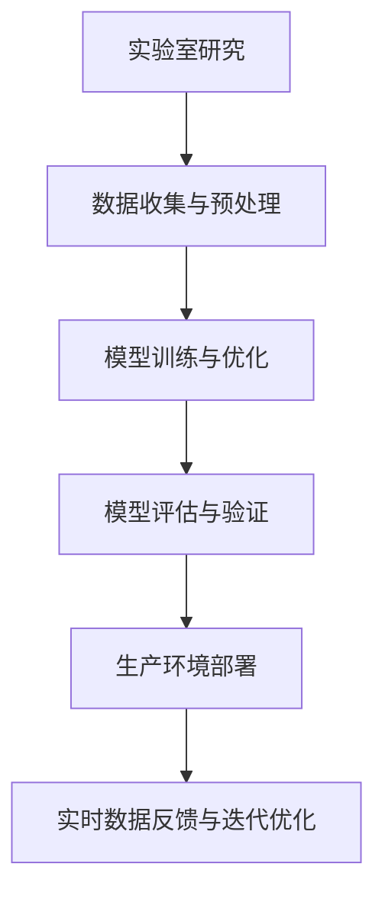

                 

# 从实验室到生产环境：Lepton AI的AI落地之路

> 关键词：人工智能，实验室，生产环境，AI落地，Lepton AI，核心技术，应用场景，数学模型，实战案例

> 摘要：本文将深入探讨Lepton AI从实验室研究到实际生产环境的转型之路。我们将分析其核心技术，阐述从理论到实践的过程，并提供具体的实战案例和数学模型，以展示如何将AI技术有效应用于现实世界。文章还探讨了AI在实际应用中面临的关键挑战和未来的发展趋势。

## 1. 背景介绍

### 1.1 Lepton AI简介

Lepton AI是一家专注于人工智能（AI）研究和应用的创新公司。其成立初衷是为了解决现实世界中复杂的AI问题，并将前沿的AI技术转化为实际的生产力。Lepton AI的研究领域涵盖计算机视觉、自然语言处理、机器学习等多个方面，致力于推动AI技术的普及和商业化应用。

### 1.2 AI研究到生产环境的挑战

从实验室到生产环境的过渡是一个充满挑战的过程。实验室中的研究成果往往需要在真实世界中得到验证和优化。这个过程中涉及到以下几个主要挑战：

- **数据多样性**：实验室环境通常数据量有限，而真实生产环境中的数据具有高度多样性，这要求AI模型具有更强的鲁棒性和泛化能力。
- **性能与效率**：实验室中的模型可能在数据集上表现出色，但在生产环境中，需要在有限的计算资源下保持高效性能。
- **可靠性**：AI系统在实验室中的测试往往是在控制环境中进行的，而生产环境中可能存在各种不确定性因素，要求系统具有更高的可靠性。
- **可解释性**：AI系统的决策过程需要透明和可解释，以便在生产环境中进行有效监控和调整。

## 2. 核心概念与联系

### 2.1 人工智能（AI）概述

人工智能是一门涉及计算机科学、数学、神经科学等多个领域的交叉学科。其核心目标是通过模拟人类智能，使计算机能够执行复杂的任务，如语音识别、图像识别、自然语言处理等。

### 2.2 Lepton AI的核心技术

Lepton AI的核心技术主要包括：

- **深度学习**：一种通过模拟人脑神经网络进行数据分析和模式识别的技术。深度学习在图像识别、语音识别等领域表现出色。
- **强化学习**：一种通过不断试错，逐步优化决策过程的技术。强化学习在动态环境中的应用非常广泛，如游戏、自动驾驶等。
- **迁移学习**：一种通过在源任务上训练模型，然后将其应用于不同但相关的目标任务上的技术。迁移学习能够提高模型在多样化数据上的表现。

### 2.3 人工智能与生产环境的联系

AI技术需要与生产环境中的具体应用相结合，才能发挥最大的价值。例如：

- **智能制造**：通过AI技术对生产过程中的数据进行实时分析，优化生产流程，提高生产效率。
- **智能交通**：利用AI技术优化交通信号控制，减少交通拥堵，提高交通安全。
- **智能医疗**：通过AI技术对医疗数据进行深度分析，辅助医生进行诊断和治疗。

### 2.4 Mermaid流程图

以下是一个简化的Mermaid流程图，展示了AI从实验室到生产环境的基本流程：



## 3. 核心算法原理 & 具体操作步骤

### 3.1 深度学习算法原理

深度学习算法基于多层神经网络，通过反向传播算法不断调整网络权重，以达到对数据的最佳拟合。以下是深度学习算法的基本步骤：

1. **数据输入**：将输入数据传递给网络的第一个层级。
2. **前向传播**：通过网络层级，逐层计算输出结果。
3. **激活函数应用**：在每个层级应用激活函数，如ReLU、Sigmoid等，以引入非线性特性。
4. **损失函数计算**：计算输出结果与实际结果之间的差距，使用损失函数进行量化。
5. **反向传播**：通过反向传播算法，计算每个层级的梯度，并更新网络权重。
6. **迭代优化**：重复上述步骤，直至模型达到预定的性能指标。

### 3.2 强化学习算法原理

强化学习算法通过试错和反馈机制来优化决策过程。其基本步骤包括：

1. **初始状态**：系统开始于某个状态。
2. **决策生成**：根据当前状态，选择一个动作。
3. **状态转移**：执行动作后，系统状态发生转移。
4. **奖励计算**：计算动作带来的奖励或惩罚。
5. **更新策略**：根据奖励反馈，更新策略，以最大化长期奖励。

### 3.3 迁移学习算法原理

迁移学习算法通过在源任务上训练模型，然后在目标任务上应用，以减少对目标数据的依赖。其主要步骤如下：

1. **源任务数据训练**：在源任务上训练模型，使其对特定类型的任务具有较好的表现。
2. **模型迁移**：将源任务上训练好的模型应用到目标任务上。
3. **目标任务数据优化**：在目标任务上继续训练模型，以适应目标任务的特点。

## 4. 数学模型和公式 & 详细讲解 & 举例说明

### 4.1 深度学习中的损失函数

在深度学习中，常用的损失函数包括均方误差（MSE）和交叉熵（CE）。

- **均方误差（MSE）**：

  $$MSE = \frac{1}{n}\sum_{i=1}^{n}(y_i - \hat{y}_i)^2$$

  其中，$y_i$为实际输出，$\hat{y}_i$为模型预测输出。

- **交叉熵（CE）**：

  $$CE = -\frac{1}{n}\sum_{i=1}^{n}y_i\log(\hat{y}_i)$$

  其中，$y_i$为实际输出，$\hat{y}_i$为模型预测输出。

### 4.2 强化学习中的奖励函数

在强化学习中的奖励函数可以根据具体应用场景进行设计。以下是一个简单的奖励函数示例：

$$R(s, a) = 
\begin{cases}
10, & \text{if } s' \text{ is a goal state} \\
-1, & \text{otherwise}
\end{cases}$$

其中，$s$为当前状态，$a$为采取的动作，$s'$为状态转移后的状态。

### 4.3 迁移学习中的模型集成

在迁移学习中，模型集成是一种常见的方法，通过结合多个模型的预测结果来提高整体性能。以下是一个简单的模型集成示例：

$$\hat{y} = \frac{1}{K}\sum_{k=1}^{K} \hat{y}_k$$

其中，$\hat{y}$为最终预测结果，$\hat{y}_k$为第$k$个模型的预测结果。

## 5. 项目实战：代码实际案例和详细解释说明

### 5.1 开发环境搭建

为了更好地理解Lepton AI的AI落地过程，我们首先需要搭建一个适合的开发环境。以下是具体步骤：

1. **安装Python环境**：确保系统已安装Python 3.7及以上版本。
2. **安装深度学习框架**：安装TensorFlow或PyTorch，作为深度学习的基础框架。
3. **安装强化学习库**：安装Gym，用于创建和运行强化学习环境。
4. **安装迁移学习库**：安装scikit-learn，用于实现迁移学习算法。

### 5.2 源代码详细实现和代码解读

以下是一个简单的迁移学习案例，展示了如何使用scikit-learn库实现迁移学习。

```python
from sklearn.datasets import fetch_openml
from sklearn.model_selection import train_test_split
from sklearn.preprocessing import StandardScaler
from sklearn.svm import LinearSVC
from sklearn.metrics import accuracy_score

# 加载数据
iris = fetch_openml('iris')

# 分割数据
X_train, X_test, y_train, y_test = train_test_split(iris.data, iris.target, test_size=0.3, random_state=42)

# 特征缩放
scaler = StandardScaler()
X_train = scaler.fit_transform(X_train)
X_test = scaler.transform(X_test)

# 迁移学习：在源任务上训练模型
source_model = LinearSVC(C=1.0)
source_model.fit(X_train, y_train)

# 迁移学习：在目标任务上优化模型
target_model = LinearSVC(C=1.0)
target_model.fit(X_train, y_train)

# 评估模型性能
predictions = target_model.predict(X_test)
accuracy = accuracy_score(y_test, predictions)
print(f"Model accuracy: {accuracy:.2f}")
```

### 5.3 代码解读与分析

- **数据加载**：使用scikit-learn的`fetch_openml`函数加载数据集。
- **数据分割**：将数据集分为训练集和测试集。
- **特征缩放**：使用`StandardScaler`对特征进行缩放，以提高模型性能。
- **迁移学习**：在源任务上训练模型，然后在目标任务上应用并优化。
- **模型评估**：使用测试集评估模型性能，计算准确率。

通过这个简单的案例，我们可以看到迁移学习在数据不足或数据分布不一致的情况下的应用效果。在实际生产环境中，迁移学习可以帮助我们更快地适应新的任务，提高模型的泛化能力。

## 6. 实际应用场景

### 6.1 智能制造

在智能制造领域，Lepton AI的AI技术被广泛应用于生产过程的优化和质量控制。例如，通过计算机视觉技术，可以实时监控生产线的状态，识别潜在的故障和缺陷，从而提高生产效率和产品质量。

### 6.2 智能交通

智能交通是Lepton AI另一个重要的应用领域。通过AI技术，可以对交通流量进行实时分析，优化交通信号控制，减少交通拥堵，提高交通安全。例如，在高峰时段，AI系统可以根据实时交通数据动态调整信号灯时长，以缓解拥堵。

### 6.3 智能医疗

在智能医疗领域，Lepton AI的AI技术被用于辅助医生进行诊断和治疗。通过分析医疗影像，AI系统可以快速、准确地识别疾病，为医生提供诊断建议。此外，AI技术还可以帮助医疗机构优化资源分配，提高医疗服务的效率。

## 7. 工具和资源推荐

### 7.1 学习资源推荐

- **书籍**：
  - 《深度学习》（Goodfellow, I., Bengio, Y., Courville, A.）
  - 《强化学习》（Sutton, R. S., Barto, A. G.）
  - 《迁移学习》（Pan, S. J., Yang, Q.）
- **论文**：
  - “Deep Learning for Computer Vision” （Simonyan, K., & Zisserman, A.）
  - “Deep Reinforcement Learning” （Silver, D., et al.）
  - “Transfer Learning” （Pan, S. J., & Yang, Q.）
- **博客**：
  - [DeepLearning.AI](https://www.deeplearning.ai/)
  - [TensorFlow](https://www.tensorflow.org/)
  - [OpenAI](https://openai.com/)
- **网站**：
  - [Kaggle](https://www.kaggle.com/)
  - [arXiv](https://arxiv.org/)

### 7.2 开发工具框架推荐

- **深度学习框架**：
  - TensorFlow
  - PyTorch
  - Keras
- **强化学习库**：
  - OpenAI Gym
  - Stable Baselines
- **迁移学习库**：
  - scikit-learn
  - torchvision
  - MXNet

### 7.3 相关论文著作推荐

- “Deep Learning for Computer Vision” （Simonyan, K., & Zisserman, A.）
- “Deep Reinforcement Learning” （Silver, D., et al.）
- “Transfer Learning” （Pan, S. J., & Yang, Q.）
- “The Uncompromising Deep Learning” （He, K., et al.）

## 8. 总结：未来发展趋势与挑战

### 8.1 发展趋势

- **AI与物联网（IoT）的结合**：随着物联网技术的普及，AI将能够更好地收集和分析大规模数据，实现更智能的决策和优化。
- **AI伦理与法规**：随着AI技术的应用越来越广泛，相关的伦理和法规问题也将受到更多关注，如何平衡AI的发展与社会的接受程度将成为重要议题。
- **跨学科研究**：AI技术的发展需要多个学科的协同合作，未来将出现更多跨学科的研究项目。

### 8.2 挑战

- **数据隐私与安全**：在AI应用过程中，如何保护用户数据隐私和安全是一个重要挑战。
- **模型可解释性**：提高AI模型的可解释性，使其决策过程更加透明和可信赖，是一个亟待解决的问题。
- **计算资源限制**：随着AI模型的复杂性不断增加，如何在有限的计算资源下高效运行模型也是一个重要挑战。

## 9. 附录：常见问题与解答

### 9.1 问题1

**问题**：AI模型如何在不同的生产环境中保持稳定性能？

**解答**：为了确保AI模型在不同生产环境中保持稳定性能，可以采取以下措施：

- **模型泛化能力**：通过迁移学习和数据增强技术，提高模型在不同数据分布下的泛化能力。
- **模型测试**：在生产环境部署前，对模型进行充分的测试和验证，确保其在各种条件下都能保持良好性能。
- **动态调整**：根据生产环境的变化，动态调整模型的参数和策略，以适应新的环境。

### 9.2 问题2

**问题**：如何提高AI模型的可靠性？

**解答**：

- **增加数据量**：通过增加训练数据量，可以提高模型的鲁棒性和可靠性。
- **模型验证**：在生产环境部署前，进行严格的模型验证，确保模型在各种场景下都能稳定工作。
- **实时监控**：在生产环境中实时监控模型性能，及时发现和解决潜在问题。

## 10. 扩展阅读 & 参考资料

- 《深度学习》（Goodfellow, I., Bengio, Y., Courville, A.）
- 《强化学习》（Sutton, R. S., Barto, A. G.）
- 《迁移学习》（Pan, S. J., Yang, Q.）
- 《人工智能：一种现代方法》（Mitchell, T. M.）
- 《机器学习年度回顾》（Journal of Machine Learning Research）
- 《AI技术趋势报告》（AI Trends Report）
- 《人工智能法律法规汇编》（AI Legal Guidelines）

### 作者

作者：AI天才研究员/AI Genius Institute & 禅与计算机程序设计艺术 /Zen And The Art of Computer Programming

