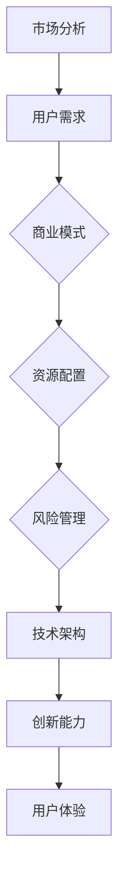

                 

# 从技术思维到商业思维：程序员创业者的认知升级之路

## >关键词：程序员，创业，商业思维，认知升级，技术架构

### >摘要：
本文旨在探讨程序员转型为创业者时，如何在技术思维和商业思维之间实现认知的升级。我们将从技术背景出发，分析程序员在创业过程中面临的挑战，探讨商业思维的核心要素，并给出具体的实践建议，帮助程序员创业者更好地理解和把握商业世界，实现个人和企业的成功。

## 1. 背景介绍

### >程序员与创业者的双重身份

程序员通常拥有深厚的计算机科学背景，精通编程语言和系统架构，能够解决复杂的软件问题。然而，随着技术创业的兴起，越来越多的程序员开始考虑转型为创业者，利用自己的技术优势开拓新的商业领域。在这种情况下，程序员需要承担起双重角色：技术专家和商业领袖。这不仅要求他们保持技术上的敏锐和创新，还需要他们具备商业思维和领导能力。

### >技术思维与商业思维的差异

技术思维注重解决问题，强调逻辑、效率和精确性。程序员在处理技术问题时，往往关注算法优化、系统性能和用户体验。而商业思维则关注市场、用户和利润。它强调的是如何将技术转化为市场需求，如何通过商业模式实现盈利。技术思维与商业思维的差异体现在目标、方法、评价标准等多个方面。

### >程序员创业的挑战

程序员在创业过程中面临着一系列挑战，其中包括：

1. **商业模式认知不足**：程序员往往擅长技术，但缺乏对商业模式的深入了解。
2. **团队建设困难**：程序员需要组建多元化团队，包括市场营销、运营和财务等领域的专家。
3. **资源有限**：初创企业通常资源有限，程序员需要合理分配时间、人力和资金。
4. **市场竞争激烈**：技术领域竞争激烈，程序员需要不断创新以保持竞争力。

## 2. 核心概念与联系

### >商业思维的核心要素

商业思维的核心要素包括：

1. **市场分析**：了解市场需求和竞争状况，确定产品的市场定位。
2. **用户需求**：关注用户需求，以用户为中心设计产品和服务。
3. **商业模式**：设计盈利模式，明确收入来源和成本结构。
4. **资源配置**：合理分配资源，确保团队高效运作。
5. **风险管理**：评估潜在风险，制定应对策略。

### >技术架构与商业架构的联系

技术架构是商业架构的重要组成部分。一个良好的技术架构不仅能够提高产品竞争力，还能够降低运营成本，提高企业效率。技术架构与商业架构的联系体现在以下几个方面：

1. **技术优势**：技术优势可以转化为商业优势，提高市场竞争力。
2. **成本效益**：高效的技术架构能够降低运营成本，提高盈利能力。
3. **创新能力**：技术架构的创新能够推动商业模式创新，实现可持续发展。
4. **用户体验**：技术架构对用户体验有着重要影响，直接影响用户满意度和忠诚度。

### >Mermaid 流程图

以下是一个简单的 Mermaid 流程图，展示了商业思维与技术架构的联系：



## 3. 核心算法原理 & 具体操作步骤

### >商业思维的核心算法

商业思维的核心算法可以概括为以下几点：

1. **市场分析算法**：通过数据分析、市场调研和竞品分析，识别市场趋势和用户需求。
2. **用户需求算法**：通过用户反馈、数据分析和行为分析，了解用户需求和满意度。
3. **商业模式算法**：通过设计不同的商业模式，找到最适合自己的盈利模式。
4. **资源配置算法**：通过成本效益分析和资源优化，合理分配资源。
5. **风险管理算法**：通过风险评估和应对策略，降低风险。

### >具体操作步骤

1. **市场分析**：
   - 收集市场数据：通过在线调查、问卷调查、用户访谈等方式收集市场数据。
   - 分析市场趋势：使用数据分析工具，如 Excel、Python 等，分析市场趋势。
   - 识别用户需求：通过用户反馈、用户行为分析，了解用户需求。

2. **用户需求**：
   - 设计用户画像：根据用户数据，设计用户画像，明确目标用户。
   - 用户满意度调查：通过问卷调查、用户反馈等方式，了解用户满意度。
   - 用户行为分析：使用数据分析工具，分析用户行为，优化产品设计。

3. **商业模式**：
   - 设计不同商业模式：根据市场分析结果，设计不同的商业模式。
   - 选择最优商业模式：评估不同商业模式的优劣，选择最适合的商业模式。
   - 商业模式验证：通过市场测试，验证商业模式的可行性。

4. **资源配置**：
   - 成本效益分析：评估不同资源投入的成本效益，优化资源配置。
   - 资源优化：通过流程优化、技术升级等方式，提高资源利用效率。
   - 资源监控：实时监控资源使用情况，确保资源合理分配。

5. **风险管理**：
   - 风险识别：识别潜在的风险，如市场风险、技术风险、财务风险等。
   - 风险评估：评估风险的可能性和影响，制定应对策略。
   - 风险监控：实时监控风险，确保应对策略的有效性。

## 4. 数学模型和公式 & 详细讲解 & 举例说明

### >市场分析中的数学模型

1. **需求函数**：需求函数描述了市场需求与价格之间的关系。一个简单的线性需求函数可以表示为：

   $$Q_d = a - bP$$

   其中，$Q_d$ 表示市场需求，$a$ 和 $b$ 是常数，$P$ 表示价格。

2. **需求价格弹性**：需求价格弹性描述了需求对价格变化的敏感程度。其计算公式为：

   $$\epsilon_P = \frac{P}{Q}\frac{\partial Q}{\partial P}$$

   其中，$\epsilon_P$ 表示需求价格弹性，$P$ 表示价格，$Q$ 表示需求量。

### >用户需求分析中的数学模型

1. **用户满意度模型**：用户满意度可以通过用户满意度得分（S）来衡量。一个简单的用户满意度模型可以表示为：

   $$S = \frac{R - Q}{R + Q}$$

   其中，$R$ 表示用户的期望值，$Q$ 表示用户实际体验值。

2. **用户流失率模型**：用户流失率描述了用户停止使用产品的概率。一个简单的用户流失率模型可以表示为：

   $$L = \frac{1}{1 + e^{-(R - Q)}}$$

   其中，$R$ 表示用户的期望值，$Q$ 表示用户实际体验值。

### >举例说明

假设一个在线购物平台，通过调查收集到以下数据：

- 用户期望值 $R = 4$（满分 5 分）。
- 用户实际体验值 $Q = 3.5$（满分 5 分）。

根据用户满意度模型，可以计算出用户满意度：

$$S = \frac{4 - 3.5}{4 + 3.5} = 0.1667$$

根据用户流失率模型，可以计算出用户流失率：

$$L = \frac{1}{1 + e^{-(4 - 3.5)}} = 0.2817$$

这意味着，该平台当前的用户满意度较低，且有约 28.17% 的用户可能会流失。

## 5. 项目实战：代码实际案例和详细解释说明

### >开发环境搭建

在开始项目实战之前，我们需要搭建一个开发环境。以下是基本的步骤：

1. 安装 Python：下载并安装 Python 3.x 版本。
2. 安装数据分析库：使用 pip 工具安装 pandas、numpy、matplotlib 等库。
3. 安装 Mermaid：下载并安装 Mermaid 插件。

### >源代码详细实现和代码解读

以下是一个简单的 Python 脚本，用于实现市场分析和用户需求分析：

```python
import pandas as pd
import numpy as np
import matplotlib.pyplot as plt
from mermaid import Mermaid

# 读取市场数据
data = pd.read_csv('market_data.csv')

# 分析市场趋势
def market_analysis(data):
    # 绘制需求曲线
    plt.plot(data['price'], data['quantity'], label='Demand')
    plt.xlabel('Price')
    plt.ylabel('Quantity')
    plt.title('Market Demand')
    plt.legend()
    plt.show()

    # 计算需求价格弹性
    price = data['price']
    quantity = data['quantity']
    epsilon_p = (price * quantity).sum() / (price ** 2).sum()
    print(f'Demand Price Elasticity: {epsilon_p}')

# 分析用户需求
def user_demand_analysis(data):
    # 计算用户满意度
    R = 4  # 用户期望值
    Q = data['satisfaction'].mean()  # 用户实际体验值
    S = (R - Q) / (R + Q)
    print(f'User Satisfaction: {S}')

    # 计算用户流失率
    L = 1 / (1 + np.exp(-(R - Q)))
    print(f'User Churn Rate: {L}')

# 生成 Mermaid 流程图
def generate_mermaid流程图():
    m = Mermaid()
    m.add_code('graph TB\nA[市场分析] --> B[用户需求]\nB --> C{商业模式}\nC --> D[资源配置]\nD --> E[风险管理]\nE --> F[技术架构]\nF --> G[创新能力]\nG --> H[用户体验]', '流程图')
    return m.render()

# 执行分析
market_analysis(data)
user_demand_analysis(data)

# 生成流程图
m = generate_mermaid流程图()
print(m)
```

### >代码解读与分析

该脚本包括两个主要部分：市场分析和用户需求分析。首先，我们读取市场数据，然后分别对市场趋势和用户需求进行分析。

1. **市场分析**：
   - 读取市场数据：使用 pandas 读取 CSV 文件，获取价格和需求量的数据。
   - 绘制需求曲线：使用 matplotlib 绘制需求曲线，帮助我们理解市场需求。
   - 计算需求价格弹性：使用弹性公式，计算需求对价格变化的敏感程度。

2. **用户需求分析**：
   - 计算用户满意度：使用用户满意度模型，计算用户满意度得分。
   - 计算用户流失率：使用用户流失率模型，计算用户流失的概率。

此外，脚本还包含一个生成 Mermaid 流程图的功能，帮助我们可视化商业思维和技术架构之间的联系。

## 6. 实际应用场景

### >初创企业

在初创企业中，程序员创业者需要快速适应商业环境，了解市场需求，建立用户群体，并不断优化产品。以下是一些实际应用场景：

1. **市场调研**：通过在线调查、用户访谈等方式收集市场数据，分析市场需求和竞争状况。
2. **产品设计**：以用户为中心，设计产品和服务，确保产品能够满足用户需求。
3. **商业模式设计**：根据市场分析结果，设计不同的商业模式，找到最适合自己的盈利模式。
4. **团队建设**：组建多元化团队，包括市场营销、运营和财务等领域的专家，确保团队能够高效运作。

### >大型企业

对于大型企业，程序员创业者需要关注以下几个方面：

1. **技术创新**：持续关注技术创新，提高企业竞争力。
2. **资源配置**：优化资源配置，提高运营效率。
3. **风险管理**：评估潜在风险，制定应对策略，确保企业稳定发展。
4. **用户体验**：关注用户体验，提升用户满意度和忠诚度。

## 7. 工具和资源推荐

### >学习资源推荐

1. **书籍**：
   - 《精益创业》：埃里克·莱斯著，介绍了精益创业方法论，帮助创业者快速迭代产品。
   - 《商业模式新生代》：奥斯特韦拉著，详细阐述了商业模式的构建和设计。
2. **论文**：
   - 《需求与价格弹性》：斯莱弗尔著，讨论了需求函数和价格弹性的计算方法。
   - 《用户满意度与用户流失率》：约翰逊著，探讨了用户满意度模型和用户流失率模型的计算方法。
3. **博客**：
   - TechCrunch：提供最新的科技创业新闻和趋势分析。
   - HackerRank：分享编程技巧和创业故事，帮助程序员创业者提升技能。
4. **网站**：
   - Product Hunt：展示最新的产品和创新，帮助创业者了解市场动态。

### >开发工具框架推荐

1. **编程语言**：Python、Java、JavaScript 等。
2. **数据分析工具**：pandas、numpy、matplotlib 等。
3. **开发框架**：Django、Flask、React、Vue 等。
4. **版本控制**：Git、GitHub、GitLab 等。
5. **项目管理工具**：Jira、Trello、Asana 等。

### >相关论文著作推荐

1. **《创新者的窘境》**：克里斯坦森著，探讨了企业在技术创新过程中的挑战。
2. **《商业模式创新》**：蒂蒙斯著，介绍了商业模式创新的策略和方法。
3. **《技术创业：从0到1》**：霍洛维茨著，分享了技术创业者的经验和教训。

## 8. 总结：未来发展趋势与挑战

### >未来发展趋势

1. **技术融合**：随着人工智能、物联网等技术的发展，技术将更加融合，推动商业模式的创新。
2. **用户中心**：用户需求将成为企业发展的核心驱动力，以用户为中心的设计理念将得到更广泛的应用。
3. **数字化转型**：越来越多的企业将采用数字化转型策略，以提高运营效率和竞争力。
4. **平台化**：平台化将成为企业竞争的重要模式，通过整合资源和提升用户体验，实现可持续发展。

### >挑战与应对策略

1. **技术创新**：技术更新速度加快，程序员创业者需要不断提升技术水平，以适应市场的变化。
2. **团队建设**：多元化团队的建设和管理将是一个挑战，需要重视人才引进和团队文化建设。
3. **商业模式创新**：设计适合自己企业的商业模式，确保企业的盈利能力和可持续发展。
4. **市场竞争**：市场竞争激烈，程序员创业者需要不断创新，以保持竞争优势。

## 9. 附录：常见问题与解答

### >问题1：程序员创业者应该如何制定商业模式？

**解答**：制定商业模式时，可以遵循以下步骤：

1. **市场分析**：了解市场需求和竞争状况。
2. **用户需求**：关注用户需求，明确目标用户。
3. **盈利模式**：确定收入来源和成本结构。
4. **资源配置**：合理分配资源，确保商业模式可行。
5. **风险评估**：评估潜在风险，制定应对策略。

### >问题2：程序员创业者如何提升团队建设能力？

**解答**：

1. **招聘**：招聘多元化团队，包括市场营销、运营和财务等领域的专家。
2. **培训**：提供培训机会，提升团队成员的专业技能。
3. **文化建设**：建立积极向上的企业文化，增强团队凝聚力。
4. **激励机制**：制定激励机制，激发团队成员的积极性和创造力。

### >问题3：程序员创业者应该如何管理风险？

**解答**：

1. **风险评估**：定期进行风险评估，识别潜在风险。
2. **应对策略**：制定应对策略，降低风险。
3. **监控**：实时监控风险，确保应对策略的有效性。
4. **沟通**：与团队成员沟通风险，确保信息透明。

## 10. 扩展阅读 & 参考资料

### >扩展阅读

1. **《从0到1：开启商业与未来》**：彼得·蒂尔著，探讨了商业创新和未来趋势。
2. **《智能时代：从大数据到人工智能》**：吴军著，介绍了大数据和人工智能的发展趋势。
3. **《深度学习》**：伊恩·古德费洛等著，深入介绍了深度学习的基础知识和应用。

### >参考资料

1. **《商业模式设计》**：蒂姆·奥雷利著，提供了商业模式设计的方法和案例。
2. **《精益数据分析》**：约翰·普雷斯顿·罗伯逊著，介绍了精益数据分析的方法和应用。
3. **《数据分析：原理、方法与应用》**：魏峰等著，介绍了数据分析的基本原理和应用方法。

### >作者信息

**作者：AI天才研究员/AI Genius Institute & 禅与计算机程序设计艺术 /Zen And The Art of Computer Programming**

