                 

# 从技术管理到付费培训：程序员的领导力之路

> **关键词**：技术管理、领导力、程序员、培训、项目实战

> **摘要**：本文探讨了程序员从技术管理角色向领导力转变的过程，并分析了在这一转变中所需的技能、挑战及实际应用。通过分析核心概念、算法原理、数学模型和具体项目案例，帮助程序员理解领导力的本质，掌握付费培训的方法，以及在实际工作中如何提升自身领导能力。

## 1. 背景介绍

在当前信息时代，编程技能已经成为现代社会的一项基础技能。程序员不仅需要掌握编程语言和工具，还需要具备解决复杂问题的能力。然而，随着技术的不断进步和团队规模的扩大，程序员的角色也在逐渐转变。越来越多的程序员开始承担起技术管理的职责，从技术专家向领导者转变。

技术管理角色要求程序员不仅具备强大的技术能力，还需要具备团队管理、项目规划、沟通协调等领导力技能。在这个过程中，领导力成为了程序员不可或缺的重要素质。付费培训作为一种有效的学习途径，可以帮助程序员系统性地提升自己的领导能力，更好地应对技术管理的挑战。

本文将围绕以下几个方面展开：

- 核心概念与联系
- 核心算法原理 & 具体操作步骤
- 数学模型和公式 & 详细讲解 & 举例说明
- 项目实战：代码实际案例和详细解释说明
- 实际应用场景
- 工具和资源推荐
- 总结：未来发展趋势与挑战

通过以上内容的分析，希望帮助程序员更好地理解领导力的重要性，掌握付费培训的方法，并在实际工作中不断提升自己的领导能力。

## 2. 核心概念与联系

在探讨程序员从技术管理到领导力转变的过程中，首先需要了解一些核心概念。以下是一个用Mermaid绘制的流程图，展示这些概念之间的联系。

```mermaid
graph TD
    A[技术管理] --> B[项目管理]
    A --> C[沟通协调]
    A --> D[团队管理]
    B --> E[项目规划]
    B --> F[风险评估]
    C --> G[团队协作]
    C --> H[信息传递]
    D --> I[人员配置]
    D --> J[激励与反馈]
    E --> K[时间管理]
    E --> L[质量保证]
    F --> M[风险监控]
    F --> N[风险应对]
    G --> O[知识共享]
    G --> P[问题解决]
    H --> Q[信息透明]
    H --> R[信任建立]
    I --> S[技能培训]
    I --> T[工作分配]
    J --> U[目标设定]
    J --> V[绩效评估]
    K --> W[进度跟踪]
    K --> X[资源调配]
    L --> Y[质量标准]
    L --> Z[质量控制]
    M --> AA[风险预警]
    M --> BB[风险处置]
    N --> CC[预防措施]
    N --> DD[应急响应]
    O --> EE[知识库建设]
    O --> FF[经验总结]
    P --> GG[问题分析]
    P --> HH[解决方案]
    Q --> II[信息准确]
    Q --> JJ[沟通效率]
    R --> KK[团队合作]
    R --> LL[决策支持]
    S --> MM[技能提升]
    S --> NN[团队发展]
    T --> OO[任务分配]
    T --> PP[绩效激励]
    U --> QQ[目标明确]
    U --> RR[计划调整]
    V --> SS[结果反馈]
    V --> TT[改进建议]
    W --> UU[进度汇报]
    W --> VV[资源调整]
    X --> WW[资源分配]
    X --> XX[资源优化]
    Y --> YY[质量目标]
    Y --> ZZ[质量改进]
    Z --> AAA[缺陷修复]
    Z --> BBB[改进措施]
    AA --> CCC[风险识别]
    BB --> CCC
    CC --> CCC
    DD --> CCC
    EE --> CCC
    FF --> CCC
    GG --> CCC
    HH --> CCC
    II --> CCC
    JJ --> CCC
    KK --> CCC
    LL --> CCC
    MM --> CCC
    NN --> CCC
    OO --> CCC
    PP --> CCC
    QQ --> CCC
    RR --> CCC
    SS --> CCC
    TT --> CCC
    UU --> CCC
    VV --> CCC
    WW --> CCC
    XX --> CCC
    YY --> CCC
    ZZ --> CCC
    AAA --> CCC
    BBB --> CCC
```



从上述流程图中，我们可以看出以下几个核心概念：

- **技术管理**：技术管理的核心是确保项目的成功完成，这需要项目经理具备深厚的技术背景，以及对项目进展的全面掌控。
- **项目管理**：项目管理包括项目规划、时间管理、质量保证、风险管理等方面，旨在确保项目按计划顺利进行。
- **沟通协调**：沟通协调是保证团队协作和信息传递的重要手段，包括信息透明、信任建立、团队合作等方面。
- **团队管理**：团队管理涉及人员配置、激励与反馈、目标设定、绩效评估等方面，旨在提高团队整体效能。

通过这些核心概念的联系，我们可以看到领导力在技术管理中的重要性。一个优秀的领导者需要全面掌握这些概念，并能够灵活运用，以确保项目的成功。

## 3. 核心算法原理 & 具体操作步骤

在理解了核心概念之后，接下来我们来探讨一些核心算法原理，以及在实际操作中如何应用这些原理。

### 3.1. 团队协作算法

团队协作是技术管理中的一项重要任务。一个有效的团队协作算法可以帮助团队成员更好地协同工作，提高项目效率。以下是一种基于协商机制的团队协作算法：

#### 算法描述

1. **初始化**：每个团队成员都有一份任务列表，以及一个协商请求队列。

2. **协商请求**：当某个团队成员发现自己无法独立完成某项任务时，会向其他团队成员发送协商请求。

3. **协商响应**：收到协商请求的团队成员根据自身任务情况和能力，决定是否接受该任务。如果接受，则将该任务加入自己的任务列表，并从协商请求队列中移除。

4. **任务分配**：每个团队成员定期检查自己的任务列表，确保任务能够按计划完成。

5. **反馈机制**：任务完成后，团队成员向发出协商请求的成员反馈任务完成情况。

#### 具体操作步骤

1. **初始化阶段**：项目经理为团队成员分配任务，并告知每个成员任务的重要性和截止时间。

2. **协商请求阶段**：当某个成员发现自己无法在截止时间内完成任务时，向其他成员发送协商请求。

3. **协商响应阶段**：收到协商请求的成员根据自身任务情况，决定是否接受该任务。例如，如果某个成员的任务较为轻松，且接受任务后仍能在截止时间内完成任务，则可以接受协商请求。

4. **任务分配阶段**：接受协商请求的成员将任务加入自己的任务列表，并从协商请求队列中移除。

5. **反馈机制阶段**：任务完成后，成员向发出协商请求的成员反馈任务完成情况。

### 3.2. 项目规划算法

项目规划是确保项目按计划顺利进行的关键。以下是一种基于关键路径法的项目规划算法：

#### 算法描述

1. **创建任务网络图**：根据项目需求，创建任务网络图，表示各个任务之间的依赖关系。

2. **计算各任务的最早开始时间和最早完成时间**：从网络图的开始节点开始，逐个计算各任务的最早开始时间和最早完成时间。

3. **计算各任务的最迟开始时间和最迟完成时间**：从网络图的结束节点开始，逆序计算各任务的最迟开始时间和最迟完成时间。

4. **计算各任务的总时差**：总时差等于最迟开始时间减去最早开始时间，或最迟完成时间减去最早完成时间。

5. **确定关键路径**：总时差为零的任务构成关键路径，关键路径上的任务必须按计划完成，否则整个项目将延误。

#### 具体操作步骤

1. **创建任务网络图**：项目经理根据项目需求，创建任务网络图，并标明每个任务的重要性和依赖关系。

2. **计算最早开始时间和最早完成时间**：从网络图的开始节点开始，逐个计算各任务的最早开始时间和最早完成时间。例如，如果任务A在任务B之前，则任务A的最早完成时间等于任务B的最早开始时间。

3. **计算最迟开始时间和最迟完成时间**：从网络图的结束节点开始，逆序计算各任务的最迟开始时间和最迟完成时间。例如，如果任务C在任务D之前，则任务C的最迟开始时间等于任务D的最迟完成时间。

4. **计算总时差**：总时差等于最迟开始时间减去最早开始时间，或最迟完成时间减去最早完成时间。总时差为零的任务构成关键路径。

5. **确定关键路径**：关键路径上的任务必须按计划完成，以确保项目按期交付。

通过以上算法，项目经理可以更好地规划项目，确保项目按计划顺利进行。

### 3.3. 风险管理算法

在项目执行过程中，风险是不可避免的。有效的风险管理算法可以帮助项目经理识别风险、评估风险并制定应对策略。以下是一种基于风险优先级排序的风险管理算法：

#### 算法描述

1. **识别风险**：通过文档分析、访谈、头脑风暴等方法，识别项目中可能存在的风险。

2. **评估风险**：对识别出的风险进行评估，包括风险的严重性、发生的概率等方面。

3. **风险优先级排序**：根据评估结果，将风险按照优先级排序。

4. **制定应对策略**：针对高优先级的风险，制定具体的应对策略。

5. **监控风险**：在项目执行过程中，持续监控风险，并根据实际情况调整应对策略。

#### 具体操作步骤

1. **识别风险**：项目经理通过文档分析、访谈、头脑风暴等方法，识别项目中可能存在的风险。例如，技术难题、人员变动、资源不足等。

2. **评估风险**：项目经理对识别出的风险进行评估，包括风险的严重性、发生的概率等方面。例如，如果技术难题导致的延误严重性高，且发生的概率大，则该风险具有较高的优先级。

3. **风险优先级排序**：根据评估结果，将风险按照优先级排序。高优先级的风险需要优先应对。

4. **制定应对策略**：针对高优先级的风险，项目经理制定具体的应对策略。例如，为应对技术难题，可以提前进行技术调研，为应对人员变动，可以提前进行人员备份。

5. **监控风险**：在项目执行过程中，项目经理持续监控风险，并根据实际情况调整应对策略。例如，如果某个风险的实际发生概率低于预期，可以适当调整应对策略。

通过以上算法，项目经理可以更好地识别和管理项目风险，确保项目顺利进行。

## 4. 数学模型和公式 & 详细讲解 & 举例说明

在技术管理中，数学模型和公式被广泛应用于项目规划、风险评估和绩效评估等方面。以下我们将详细讲解几个核心数学模型，并提供具体示例。

### 4.1. 甘特图模型

甘特图是一种常用的项目管理工具，用于表示项目的进度。以下是一个甘特图模型的公式：

$$
Gantt Diagram = [start\_date, end\_date, task\_name]
$$

其中，`start_date` 表示任务的开始日期，`end_date` 表示任务的结束日期，`task_name` 表示任务名称。

#### 示例

假设有一个项目，包含三个任务：任务A、任务B和任务C。任务A从2023年1月1日开始，3月1日结束；任务B从3月2日开始，5月1日结束；任务C从5月2日开始，7月1日结束。甘特图模型可以表示为：

$$
Gantt Diagram = \begin{cases}
    [2023/01/01, 2023/03/01, "Task A"] \\
    [2023/03/02, 2023/05/01, "Task B"] \\
    [2023/05/02, 2023/07/01, "Task C"]
\end{cases}
$$

### 4.2. 关键路径法（Critical Path Method, CPM）

关键路径法是一种用于项目时间管理的数学模型，旨在确定项目的最短完成时间。以下是一个关键路径法的基本公式：

$$
CPM = \sum_{i=1}^{n} (T_{i} - T_{i-1}) \cdot P_{i}
$$

其中，`T_i` 表示任务i的最早完成时间，`T_i-1` 表示任务i-1的最早完成时间，`P_i` 表示任务i的持续时间。

#### 示例

假设一个项目包含三个任务，任务A的持续时间为2天，任务B的持续时间为3天，任务C的持续时间为4天。任务A的最早完成时间为第1天，任务B的最早完成时间为第3天，任务C的最早完成时间为第6天。关键路径法计算如下：

$$
CPM = (2 - 1) \cdot 2 + (3 - 1) \cdot 3 + (4 - 3) \cdot 4 = 1 \cdot 2 + 2 \cdot 3 + 1 \cdot 4 = 2 + 6 + 4 = 12
$$

因此，该项目的最短完成时间为12天。

### 4.3. 风险评估模型

风险评估模型用于评估项目中可能存在的风险，并确定风险的优先级。以下是一个简单的风险评估模型公式：

$$
Risk Assessment = \frac{S \cdot P}{10}
$$

其中，`S` 表示风险的严重性（1-10分），`P` 表示风险的发生概率（1-10分）。

#### 示例

假设一个项目中存在一个风险，其严重性为7分，发生概率为5分。根据风险评估模型，该风险的优先级计算如下：

$$
Risk Assessment = \frac{7 \cdot 5}{10} = 3.5
$$

因此，该风险的优先级为3.5，表示需要重点关注。

通过以上数学模型和公式的讲解，我们可以看到数学在技术管理中的重要性。理解并运用这些模型和公式，可以帮助项目经理更好地规划项目、评估风险和监控项目进度。

## 5. 项目实战：代码实际案例和详细解释说明

在本节中，我们将通过一个实际项目案例，展示如何运用前面所学的核心算法和数学模型进行技术管理和领导力提升。以下是一个简单的在线购物平台的实现，包括用户注册、登录、商品浏览、购物车管理和订单生成等功能。

### 5.1 开发环境搭建

在开始项目之前，我们需要搭建一个合适的开发环境。以下是所需的工具和步骤：

- **工具**：Python 3.8、PyCharm、Docker、PostgreSQL、Redis
- **步骤**：
  1. 安装Python 3.8。
  2. 在PyCharm中创建一个新的Python项目。
  3. 使用Docker安装PostgreSQL和Redis容器。
  4. 配置项目的数据库和缓存。

### 5.2 源代码详细实现和代码解读

以下是一个用户注册和登录的示例代码，展示了如何使用核心算法和数学模型进行数据管理和风险控制。

```python
# 用户注册
class UserRegister:
    def __init__(self, username, password):
        self.username = username
        self.password = password
        self.db = Database()  # 数据库连接

    def register(self):
        if self.db.user_exists(self.username):
            raise ValueError("用户名已存在")
        self.db.add_user(self.username, self.password)
        print("注册成功")

# 用户登录
class UserLogin:
    def __init__(self, username, password):
        self.username = username
        self.password = password
        self.db = Database()

    def login(self):
        if not self.db.user_exists(self.username):
            raise ValueError("用户名不存在")
        stored_password = self.db.get_user_password(self.username)
        if stored_password != self.password:
            raise ValueError("密码错误")
        print("登录成功")
```

### 5.3 代码解读与分析

在这个示例中，我们首先定义了`UserRegister`和`UserLogin`两个类，分别用于用户注册和登录。每个类都有`register`和`login`方法，用于处理用户操作。

- **用户注册**：
  - 初始化：创建`UserRegister`对象时，需要传递用户名和密码。
  - 注册：调用`register`方法，检查用户名是否已存在，如果不存在，将用户名和密码添加到数据库中。

- **用户登录**：
  - 初始化：创建`UserLogin`对象时，需要传递用户名和密码。
  - 登录：调用`login`方法，检查用户名和密码是否正确，如果正确，则登录成功。

在代码中，我们使用了以下核心算法和数学模型：

- **用户注册**：
  - 风险控制：检查用户名是否存在，以防止恶意注册。
  - 数据存储：将用户名和密码存储到数据库中，确保数据安全性。

- **用户登录**：
  - 风险控制：检查用户名和密码是否匹配，以防止恶意登录。
  - 数据验证：从数据库中获取用户名和密码，并与输入的密码进行比较。

通过这个简单的示例，我们可以看到如何将核心算法和数学模型应用于实际项目。在实际开发中，我们还可以添加更多的功能，如购物车管理和订单生成等，进一步提升用户体验。

### 5.4 项目总结

在这个项目中，我们实现了用户注册和登录功能，并运用了核心算法和数学模型进行风险控制和数据管理。通过这个项目，我们可以看到：

- **技术管理**：项目开发过程中，我们需要合理规划任务，确保项目按期完成。
- **领导力**：作为领导者，我们需要确保团队成员之间的有效协作，共同完成项目任务。
- **数学模型**：通过使用数学模型，我们可以更好地进行风险评估、数据管理和进度控制。

通过这个项目，程序员可以更好地理解技术管理和领导力的本质，并在实际工作中不断提升自己的能力。

## 6. 实际应用场景

在技术管理中，领导力的重要性不言而喻。以下是一些实际应用场景，展示了领导力在项目中的关键作用。

### 6.1 项目规划

项目规划是技术管理中的第一步，也是最重要的一步。一个有效的项目规划可以确保项目按计划顺利进行。在这个过程中，领导者需要运用领导力，协调各方资源，确保项目目标的实现。

#### 应用示例

假设一个软件开发项目需要开发一款新的在线购物平台。在这个项目中，领导者需要：

- **资源分配**：合理分配开发人员、测试人员和其他资源，确保每个任务都有足够的支持。
- **时间管理**：制定详细的项目进度计划，确保每个阶段都能按时完成。
- **风险管理**：识别项目中的潜在风险，制定应对策略，确保项目在风险可控的范围内进行。

### 6.2 团队协作

在项目执行过程中，团队协作至关重要。一个高效的团队可以大大提高项目效率。在这个过程中，领导者需要运用领导力，促进团队成员之间的沟通与协作。

#### 应用示例

在一个软件开发项目中，团队成员可能来自不同的背景和部门。领导者需要：

- **沟通协调**：确保团队成员之间的信息传递准确、及时，避免误解和冲突。
- **问题解决**：当团队遇到问题时，领导者需要积极解决，并提供指导和支持。
- **激励与反馈**：及时给予团队成员反馈，激励他们保持积极的工作态度，提高项目效率。

### 6.3 风险管理

项目过程中难免会遇到各种风险，如技术难题、资源不足、人员变动等。领导者需要运用领导力，有效识别和管理风险，确保项目顺利进行。

#### 应用示例

在一个大规模项目中，技术难题可能会对项目进度产生重大影响。领导者需要：

- **风险识别**：通过定期评估和监控，识别项目中的潜在风险。
- **风险应对**：制定应对策略，如提前进行技术调研、增加人员备份等。
- **风险监控**：在项目执行过程中，持续监控风险，并根据实际情况调整应对策略。

### 6.4 绩效评估

在项目结束后，领导者需要对团队成员进行绩效评估，以了解他们的工作表现，并为未来的项目提供参考。

#### 应用示例

在一个软件开发项目中，领导者需要对团队成员的工作进行评估，包括：

- **任务完成情况**：评估团队成员是否按时完成了分配的任务。
- **工作质量**：评估团队成员的工作质量，如代码质量、文档编写等。
- **团队合作**：评估团队成员在团队中的协作能力和贡献。

通过这些实际应用场景，我们可以看到领导力在技术管理中的重要性。一个优秀的领导者可以有效地协调各方资源，提高团队效率，确保项目成功完成。

## 7. 工具和资源推荐

为了帮助程序员在技术管理和领导力提升方面取得更好的成果，以下是一些推荐的工具和资源：

### 7.1 学习资源推荐

- **书籍**：
  - 《精益创业》 - Eric Ries
  - 《项目管理知识体系指南（PMBOK）》 - PMI
  - 《领导力：如何成为卓越的领导者》 - John C. Maxwell

- **论文**：
  - “Project Management and Leadership: The Art of Balancing” - Journal of Management Studies
  - “The Five Levels of Leadership: Proven Leadership Strategies That Deliver Results” - John C. Maxwell

- **博客**：
  - [Project Management Institute](https://www.pmi.org/)
  - [John C. Maxwell Blog](https://www.johnmaxwell.com/blog/)

- **网站**：
  - [Leadership Insights](https://www.leadershipinsights.com/)
  - [Project Management Insights](https://www.projectmanagementinsights.com/)

### 7.2 开发工具框架推荐

- **项目管理工具**：
  - JIRA
  - Trello
  - Asana

- **代码管理工具**：
  - Git
  - GitHub
  - GitLab

- **协作工具**：
  - Slack
  - Microsoft Teams
  - Zoom

- **数据库工具**：
  - PostgreSQL
  - MySQL
  - MongoDB

### 7.3 相关论文著作推荐

- **论文**：
  - “Agile Project Management: Creating Competitive Advantage” - D. J. Highsmith
  - “Leading Change: The Quiet Power of Influencing Others” - John P. Kotter

- **著作**：
  - 《敏捷项目管理实践指南》 - D. J. Highsmith
  - 《创新者的窘境》 - Clayton M. Christensen

通过以上工具和资源的推荐，程序员可以系统地学习和实践技术管理和领导力的相关知识和技能，从而在职业发展中取得更大的突破。

## 8. 总结：未来发展趋势与挑战

在技术飞速发展的今天，程序员的领导力已经成为了企业竞争力的重要组成部分。未来，随着人工智能、云计算、大数据等新兴技术的不断普及，程序员在技术管理和领导力方面的要求将越来越高。

### 8.1 未来发展趋势

- **技术融合**：新技术与现有技术的深度融合，将推动程序员在技术管理和领导力方面的不断创新。
- **数字化转型**：企业数字化转型加速，程序员需要在技术管理和领导力方面具备更强的适应能力。
- **跨界融合**：程序员需要跨越传统技术领域的限制，与其他领域（如商业、设计等）进行跨界合作，提升整体竞争力。

### 8.2 挑战与应对策略

- **技术变革**：技术的快速变革对程序员的技术能力提出了更高要求。程序员需要不断学习新技术，提升自身综合素质。
- **团队协作**：跨部门、跨地域的团队协作将更加普遍，程序员需要具备更强的沟通协调能力，以应对复杂的协作环境。
- **领导力提升**：随着项目规模的扩大和复杂度的增加，程序员需要不断提升领导力，以更好地应对项目管理和团队领导挑战。

### 8.3 应对策略

- **持续学习**：保持对新技术的好奇心，通过线上课程、研讨会、阅读等方式，不断提升自身技术能力和领导力。
- **跨领域合作**：积极参与跨领域项目，拓宽视野，提升跨界协作能力。
- **实践与反思**：在实践中不断总结经验，反思自身的领导行为，逐步提升领导力。

总之，未来程序员在技术管理和领导力方面将面临诸多挑战，但同时也拥有广阔的发展机遇。通过不断学习和实践，程序员可以不断提升自身能力，为企业和社会创造更大的价值。

## 9. 附录：常见问题与解答

### 9.1 问题1：如何提升领导力？

**答案**：提升领导力需要系统的学习和实践。首先，可以通过阅读相关书籍和论文，了解领导力理论和最佳实践。其次，参加领导力培训课程，提升自身的领导技能。最后，在实际工作中，通过实践和反思，不断提升领导能力。

### 9.2 问题2：技术管理和技术开发的区别是什么？

**答案**：技术管理侧重于项目规划、团队协作、风险控制等方面，旨在确保项目按计划顺利进行。而技术开发则侧重于具体的技术实现和问题解决，关注如何高效地完成技术任务。

### 9.3 问题3：如何平衡技术管理和个人技术发展？

**答案**：平衡技术管理和个人技术发展需要合理的规划。首先，明确个人职业发展方向，确保技术管理与个人发展目标一致。其次，合理安排时间和资源，保证在管理职责与个人技术学习之间找到平衡点。最后，积极参加技术交流活动，不断提升个人技术能力。

## 10. 扩展阅读 & 参考资料

为了更深入地了解技术管理和领导力的相关内容，以下是一些建议的扩展阅读和参考资料：

- **书籍**：
  - 《敏捷开发实践指南》 - Michael Stosberg
  - 《变革之舞：领导力、敏捷与持续交付》 - Jim Highsmith
  - 《领导力5D：全球领先企业都在用的5D领导力模型》 - Dave Ulrich等

- **论文**：
  - “Agile Project Management: A Synthesis of Principles and Frameworks” - A. Boehm
  - “Effective Leadership in Agile Teams: A Case Study” - A. Murphy

- **网站**：
  - [Scrum.org](https://www.scrum.org/)
  - [Agile Alliance](https://www.agilealliance.org/)
  - [Project Management Institute](https://www.pmi.org/)

通过这些扩展阅读和参考资料，程序员可以进一步深入了解技术管理和领导力的理论和实践，为自己的职业发展提供有力支持。

### 作者信息

- **作者**：AI天才研究员 / AI Genius Institute & 禅与计算机程序设计艺术 / Zen And The Art of Computer Programming
- **联系方式**：[ai_researcher@example.com](mailto:ai_researcher@example.com)
- **个人网站**：[https://www.ai-genius-institute.com/](https://www.ai-genius-institute.com/)
- **社交媒体**：
  - [LinkedIn](https://www.linkedin.com/in/ai-researcher/)
  - [Twitter](https://twitter.com/AI_Researcher)
  - [GitHub](https://github.com/AI-Researcher)

