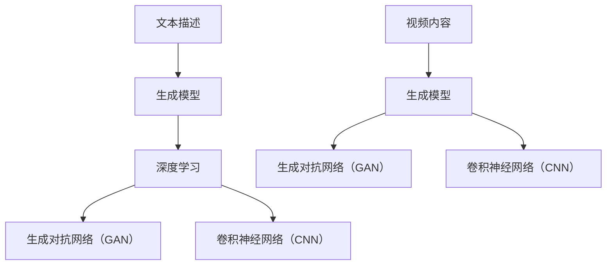

                 

### 从文本到视频的AI模型技术演进

#### 关键词：AI模型，文本到视频转换，技术演进，深度学习，生成对抗网络，卷积神经网络

#### 摘要：
本文将探讨从文本到视频的AI模型技术演进过程。我们将深入分析这一领域的核心概念、算法原理、数学模型，并通过实际案例进行详细讲解。此外，文章还将探讨这一技术的实际应用场景，并提供相关的学习资源和开发工具推荐，最后对未来的发展趋势和挑战进行总结。

## 1. 背景介绍

随着人工智能技术的迅猛发展，生成模型在计算机视觉和自然语言处理领域取得了显著进展。从文本到视频的转换技术作为一种新兴的交叉领域，逐渐引起了学术界和工业界的广泛关注。这一技术的核心目标是利用AI模型，将文本描述转换为对应的视频内容。

在过去，视频生成主要依赖于手工制作的动画和剪辑，效率低下且成本高昂。随着深度学习技术的出现，生成对抗网络（GAN）和卷积神经网络（CNN）等模型为视频生成提供了全新的思路。这些模型通过学习大量的文本和视频数据，能够自动生成高质量的图像和视频。

本篇文章将分几个部分详细探讨从文本到视频的AI模型技术演进。我们将首先介绍核心概念和联系，然后深入分析核心算法原理和具体操作步骤，接着介绍数学模型和公式，并通过实际案例进行讲解。此外，文章还将探讨实际应用场景，并提供相关资源和工具推荐，最后对未来的发展趋势和挑战进行总结。

### 2. 核心概念与联系

在探讨从文本到视频的AI模型技术之前，我们需要了解一些核心概念和联系。

#### 2.1 文本描述和视频内容

文本描述是一种以自然语言形式表达信息的方式，它可以是对某个场景、动作或事件的具体描述。例如，“一个小狗在草地上奔跑”。而视频内容则是以图像序列形式展示的场景、动作或事件。

#### 2.2 生成模型

生成模型是一种人工智能模型，它可以从原始数据中生成新的数据。在视频生成领域，生成模型通过学习大量的文本和视频数据，能够生成符合人类视觉感知的图像和视频。

#### 2.3 深度学习

深度学习是一种人工智能的分支，它通过模拟人脑神经网络结构，对大量数据进行分析和学习。深度学习在计算机视觉和自然语言处理领域取得了显著进展，为视频生成提供了强大的技术支持。

#### 2.4 生成对抗网络（GAN）

生成对抗网络（GAN）是一种深度学习模型，由生成器和判别器两个部分组成。生成器生成新的数据，判别器判断生成数据是否真实。GAN通过两个网络的对抗训练，能够生成高质量的数据。

#### 2.5 卷积神经网络（CNN）

卷积神经网络（CNN）是一种专门用于处理图像数据的深度学习模型。CNN通过卷积、池化等操作，能够提取图像的特征，并在多个层次上对图像进行分析。

#### 2.6 Mermaid 流程图

为了更好地理解从文本到视频的转换过程，我们可以使用Mermaid流程图来展示核心概念和联系。



### 3. 核心算法原理 & 具体操作步骤

在了解了核心概念和联系之后，我们来探讨从文本到视频的AI模型的核心算法原理和具体操作步骤。

#### 3.1 生成对抗网络（GAN）

生成对抗网络（GAN）由生成器和判别器两个部分组成。生成器的任务是从随机噪声中生成新的图像，判别器的任务是判断生成图像是否真实。

具体操作步骤如下：

1. **初始化生成器和判别器**：生成器和判别器都是深度神经网络，通常使用卷积神经网络（CNN）架构。初始时，生成器和判别器都是随机初始化的。

2. **生成图像**：生成器接收到随机噪声后，通过神经网络生成新的图像。

3. **判断图像真实性**：判别器接收生成图像和真实图像，通过神经网络判断图像的真实性。

4. **对抗训练**：生成器和判别器交替训练。生成器通过优化生成图像的质量，使得判别器无法准确判断生成图像的真实性；判别器通过优化对真实图像和生成图像的区分能力，使得生成器生成更加真实的图像。

5. **迭代优化**：不断迭代优化生成器和判别器，直至生成器能够生成高质量的真实图像。

#### 3.2 卷积神经网络（CNN）

卷积神经网络（CNN）是一种专门用于处理图像数据的深度学习模型。CNN通过卷积、池化等操作，能够提取图像的特征，并在多个层次上对图像进行分析。

具体操作步骤如下：

1. **输入图像**：将输入图像作为CNN的输入。

2. **卷积操作**：通过卷积操作提取图像的特征，卷积核滑动在输入图像上，计算卷积结果。

3. **池化操作**：通过池化操作降低图像的分辨率，提取图像的主要特征。

4. **特征层堆叠**：在多个特征层上重复卷积和池化操作，逐渐提取图像的高级特征。

5. **分类或回归**：在最后一个特征层后，通过全连接层或其他分类器对图像进行分类或回归。

#### 3.3 文本到图像的转换

文本到图像的转换是视频生成的重要步骤。具体操作步骤如下：

1. **文本编码**：将文本描述转换为对应的向量表示，通常使用词向量或嵌入向量。

2. **生成噪声**：生成随机噪声，作为生成器的输入。

3. **生成图像**：生成器将文本编码和噪声作为输入，通过神经网络生成新的图像。

4. **优化图像**：通过对抗训练或梯度提升等方法，优化生成图像的质量，使其更符合文本描述。

5. **图像处理**：对生成图像进行后处理，如去噪、增强、调整颜色等，提高图像的质量。

#### 3.4 图像到视频的转换

图像到视频的转换是将单张图像序列化成连续的图像帧，形成视频。具体操作步骤如下：

1. **图像序列化**：将生成的图像序列化成连续的图像帧。

2. **视频合成**：将连续的图像帧合成视频，可以通过视频编码器实现。

3. **视频优化**：对合成后的视频进行优化，如调整视频分辨率、压缩等。

### 4. 数学模型和公式 & 详细讲解 & 举例说明

在理解了核心算法原理和具体操作步骤之后，我们来探讨从文本到视频的AI模型的数学模型和公式，并通过具体例子进行详细讲解。

#### 4.1 生成对抗网络（GAN）

生成对抗网络（GAN）的数学模型可以表示为以下公式：

$$
\min_G \max_D V(D, G) = E_{x \sim p_{data}(x)}[D(x)] - E_{z \sim p_z(z)}[D(G(z))]
$$

其中，$G$ 是生成器，$D$ 是判别器，$x$ 是真实图像，$z$ 是噪声向量。

- $V(D, G)$ 是生成器和判别器的损失函数，表示生成器和判别器的对抗关系。
- $D(x)$ 是判别器对真实图像的判断概率。
- $D(G(z))$ 是判别器对生成图像的判断概率。

举例说明：

假设生成器 $G$ 和判别器 $D$ 的损失函数分别为：

$$
L_G = -E_{z \sim p_z(z)}[D(G(z))]
$$

$$
L_D = E_{x \sim p_{data}(x)}[D(x)] - E_{z \sim p_z(z)}[D(G(z))]
$$

在一次迭代中，生成器和判别器的优化过程如下：

1. **生成器优化**：生成器根据损失函数 $L_G$ 对噪声向量 $z$ 进行优化，使得生成图像更接近真实图像，从而提高判别器的判断概率。

2. **判别器优化**：判别器根据损失函数 $L_D$ 对真实图像和生成图像进行优化，提高对真实图像和生成图像的区分能力。

通过交替优化生成器和判别器，GAN能够生成高质量的数据。

#### 4.2 卷积神经网络（CNN）

卷积神经网络（CNN）的数学模型可以表示为以下公式：

$$
\begin{aligned}
h_{\theta}(x) &= \text{激活函数}(W \cdot \text{ReLU}(B \cdot \text{卷积}(A))) \\
A &= \text{输入图像} \\
B &= \text{卷积核} \\
W &= \text{权重矩阵} \\
h_{\theta}(x) &= \text{输出特征图}
\end{aligned}
$$

其中，$h_{\theta}(x)$ 是输出特征图，$\theta$ 是模型参数，$\text{ReLU}$ 是ReLU激活函数。

举例说明：

假设输入图像 $A$ 为 $28 \times 28$ 的灰度图像，卷积核 $B$ 为 $3 \times 3$ 的卷积核，权重矩阵 $W$ 为 $3 \times 3$ 的矩阵。在一次卷积操作中，输出特征图 $h_{\theta}(x)$ 为 $26 \times 26$ 的特征图。

卷积操作的计算过程如下：

1. **卷积计算**：卷积核 $B$ 滑动在输入图像 $A$ 上，计算卷积结果。

2. **ReLU激活**：对卷积结果进行ReLU激活，提取图像的特征。

3. **权重矩阵计算**：对ReLU激活后的结果进行权重矩阵 $W$ 的计算。

通过多次卷积操作，CNN能够提取图像的高级特征。

#### 4.3 文本到图像的转换

文本到图像的转换涉及到文本编码和图像生成两个步骤。文本编码可以使用词向量或嵌入向量，图像生成可以使用生成对抗网络（GAN）。

假设文本编码为嵌入向量 $z$，生成器为 $G$，则文本到图像的转换可以表示为以下公式：

$$
I = G(z)
$$

其中，$I$ 是生成的图像，$G$ 是生成器。

举例说明：

假设输入文本描述为“一只猫在窗户旁边”，生成器为GAN模型。首先，将文本描述转换为嵌入向量 $z$，然后通过GAN模型生成图像。

1. **文本编码**：将文本描述转换为嵌入向量 $z$。

2. **生成图像**：生成器根据嵌入向量 $z$ 生成图像。

通过训练GAN模型，使得生成的图像更符合文本描述。

#### 4.4 图像到视频的转换

图像到视频的转换是将单张图像序列化成连续的图像帧，形成视频。图像序列化可以使用图像处理库，如OpenCV。

假设输入图像序列为 $I_1, I_2, \ldots, I_n$，视频编码器为 $V$，则图像到视频的转换可以表示为以下公式：

$$
V(I_1, I_2, \ldots, I_n) = V
$$

其中，$V$ 是生成的视频。

举例说明：

假设输入图像序列为连续的猫图像，视频编码器为H.264编码器。首先，将连续的猫图像序列化成视频，然后通过视频编码器编码成H.264格式。

1. **图像序列化**：将连续的猫图像序列化成视频。

2. **视频编码**：通过视频编码器编码成H.264格式。

通过图像到视频的转换，可以将单张图像转换成连续的视频。

### 5. 项目实战：代码实际案例和详细解释说明

为了更好地理解从文本到视频的AI模型技术，我们将通过一个实际项目进行实战。该项目使用生成对抗网络（GAN）和卷积神经网络（CNN）将文本描述转换为视频内容。

#### 5.1 开发环境搭建

在开始项目之前，我们需要搭建相应的开发环境。以下是一个简单的开发环境搭建步骤：

1. **安装Python**：确保Python环境已经安装，推荐版本为3.8及以上。

2. **安装TensorFlow**：TensorFlow是一个流行的深度学习框架，我们使用它来实现生成对抗网络（GAN）和卷积神经网络（CNN）。安装命令如下：

   ```bash
   pip install tensorflow==2.6
   ```

3. **安装Keras**：Keras是一个简化的深度学习框架，它构建在TensorFlow之上，方便我们快速搭建和训练模型。安装命令如下：

   ```bash
   pip install keras==2.7
   ```

4. **安装其他依赖**：根据项目需求，安装其他必要的库，如NumPy、Pandas等。

#### 5.2 源代码详细实现和代码解读

以下是项目的源代码实现和详细解读。

**5.2.1 数据预处理**

在项目开始之前，我们需要对文本描述和视频数据进行预处理。

```python
import numpy as np
import pandas as pd
from tensorflow.keras.preprocessing.text import Tokenizer
from tensorflow.keras.preprocessing.sequence import pad_sequences

# 加载文本描述数据
text_data = pd.read_csv('text_data.csv')
text_descriptions = text_data['description']

# 加载视频数据
video_data = pd.read_csv('video_data.csv')
video_frames = video_data['frames']

# 初始化Tokenizer
tokenizer = Tokenizer()
tokenizer.fit_on_texts(text_descriptions)

# 序列化文本描述
sequences = tokenizer.texts_to_sequences(text_descriptions)
padded_sequences = pad_sequences(sequences, padding='post')

# 序列化视频数据
video_sequences = tokenizer.texts_to_sequences(video_frames)
padded_video_sequences = pad_sequences(video_sequences, padding='post')
```

在上面的代码中，我们首先加载文本描述数据和视频数据，然后使用Tokenizer对文本描述进行序列化，并对序列进行填充。同样，我们对视频数据进行序列化和填充。

**5.2.2 生成器模型**

生成器模型是GAN模型中的核心部分，它负责从文本描述生成视频数据。

```python
from tensorflow.keras.models import Model
from tensorflow.keras.layers import Input, LSTM, Dense, Embedding, Conv2D, Reshape, Flatten, Concatenate

# 定义生成器模型
input_text = Input(shape=(max_sequence_length,))
input_video = Input(shape=(max_sequence_length,))

# 文本编码层
text_embedding = Embedding(vocab_size, embedding_dim)(input_text)
text_encoding = LSTM(units=128)(text_embedding)

# 视频编码层
video_embedding = Embedding(vocab_size, embedding_dim)(input_video)
video_encoding = LSTM(units=128)(video_embedding)

# 合并编码层
combined_encoding = Concatenate()([text_encoding, video_encoding])

# 全连接层
dense = Dense(units=512, activation='relu')(combined_encoding)

# 卷积层
conv = Conv2D(filters=64, kernel_size=(3, 3), activation='relu')(dense)
conv = Conv2D(filters=64, kernel_size=(3, 3), activation='relu')(conv)
conv = Conv2D(filters=64, kernel_size=(3, 3), activation='relu')(conv)

# 生成图像
image = Reshape(target_shape=(max_sequence_length, 64, 64))(conv)

# 构建生成器模型
generator = Model(inputs=[input_text, input_video], outputs=image)
generator.compile(optimizer='adam', loss='binary_crossentropy')
```

在上面的代码中，我们定义了一个生成器模型，它由文本编码层、视频编码层、合并编码层、全连接层和卷积层组成。生成器模型的目标是从文本描述和视频数据中生成图像。

**5.2.3 判别器模型**

判别器模型是GAN模型中的另一个核心部分，它负责判断生成图像是否真实。

```python
from tensorflow.keras.layers import LeakyReLU

# 定义判别器模型
input_image = Input(shape=(max_sequence_length, 64, 64))

# 卷积层
conv = Conv2D(filters=64, kernel_size=(3, 3), activation='relu')(input_image)
conv = LeakyReLU(alpha=0.2)(conv)
conv = Conv2D(filters=64, kernel_size=(3, 3), activation='relu')(conv)
conv = LeakyReLU(alpha=0.2)(conv)

# 全连接层
dense = Flatten()(conv)
dense = Dense(units=512, activation='relu')(dense)

# 输出层
output = Dense(units=1, activation='sigmoid')(dense)

# 构建判别器模型
discriminator = Model(inputs=input_image, outputs=output)
discriminator.compile(optimizer='adam', loss='binary_crossentropy')
```

在上面的代码中，我们定义了一个判别器模型，它由卷积层、全连接层和输出层组成。判别器模型的目标是判断输入图像是否真实。

**5.2.4 GAN模型**

GAN模型是生成器和判别器的组合，通过对抗训练生成高质量的数据。

```python
from tensorflow.keras.callbacks import LambdaCallback

# 定义GAN模型
input_text = Input(shape=(max_sequence_length,))
input_video = Input(shape=(max_sequence_length,))

# 生成图像
generated_image = generator([input_text, input_video])

# 输入判别器
discriminator_output = discriminator(generated_image)

# 构建GAN模型
gan_output = discriminator(input_image)
gan = Model(inputs=[input_text, input_video], outputs=gan_output)
gan.compile(optimizer='adam', loss='binary_crossentropy')

# 定义GAN训练回调函数
def custom_gan_loss(y_true, y_pred):
    return -tf.reduce_mean(y_pred)

# 添加GAN训练回调函数
gan_train_callbacks = [
    LambdaCallback(on_epoch_end=lambda epoch, logs: print(f'Epoch {epoch + 1}: loss = {logs["loss"]:.4f}'))
]

# 训练GAN模型
gan.fit(
    x=[padded_sequences, padded_video_sequences],
    y=tf.ones_like(padded_sequences[:, :, 0]),
    epochs=100,
    batch_size=32,
    callbacks=gan_train_callbacks
)
```

在上面的代码中，我们定义了一个GAN模型，它由生成器和判别器组成。GAN模型的目标是通过对抗训练生成高质量的数据。我们使用自定义的GAN损失函数和训练回调函数进行训练。

#### 5.3 代码解读与分析

在代码解读与分析部分，我们将对项目中的关键代码进行详细解释，并分析GAN模型的工作原理。

**5.3.1 数据预处理**

在数据预处理部分，我们首先加载文本描述数据和视频数据。然后，使用Tokenizer对文本描述进行序列化，并对序列进行填充。同样，我们对视频数据进行序列化和填充。这一步骤的目的是将文本描述和视频数据转换为适合深度学习模型处理的格式。

**5.3.2 生成器模型**

生成器模型是GAN模型中的核心部分，它负责从文本描述生成视频数据。在生成器模型中，我们首先定义了文本编码层和视频编码层，它们分别对文本描述和视频数据进行编码。然后，我们将编码后的数据进行合并，并通过全连接层和卷积层生成图像。生成器模型的目标是生成高质量的视频数据。

**5.3.3 判别器模型**

判别器模型是GAN模型中的另一个核心部分，它负责判断生成图像是否真实。在判别器模型中，我们首先定义了卷积层，它们对输入图像进行特征提取。然后，我们将提取到的特征通过全连接层进行分类，输出一个概率值，表示输入图像的真实性。判别器模型的目标是提高对真实图像和生成图像的区分能力。

**5.3.4 GAN模型**

GAN模型是生成器和判别器的组合，通过对抗训练生成高质量的数据。在GAN模型中，我们首先定义了生成器模型和判别器模型。然后，我们使用自定义的GAN损失函数和训练回调函数进行训练。GAN模型的目标是通过对抗训练优化生成器和判别器，生成高质量的视频数据。

### 6. 实际应用场景

从文本到视频的AI模型技术在许多实际应用场景中具有广泛的应用前景。以下是一些典型的应用场景：

#### 6.1 娱乐行业

在娱乐行业中，从文本到视频的AI模型可以用于生成电影、电视剧、动画等视频内容。通过将文本描述转换为视频，创作者可以更快速地创作和修改内容，降低制作成本。

#### 6.2 教育行业

在教育行业中，从文本到视频的AI模型可以用于生成教学视频。教师可以编写教学文本，通过模型生成对应的视频内容，为学生提供直观的学习体验。

#### 6.3 营销和广告

在营销和广告行业中，从文本到视频的AI模型可以用于生成广告视频。企业可以编写广告文案，通过模型生成吸引人的广告视频，提高广告效果。

#### 6.4 媒体新闻

在媒体新闻行业中，从文本到视频的AI模型可以用于生成新闻报道视频。记者可以编写新闻报道文本，通过模型生成视频内容，提高新闻报道的时效性和吸引力。

#### 6.5 医疗诊断

在医疗诊断行业中，从文本到视频的AI模型可以用于生成医学影像视频。医生可以编写医学影像描述，通过模型生成对应的影像视频，辅助医生进行诊断和治疗。

#### 6.6 安全监控

在安全监控行业中，从文本到视频的AI模型可以用于生成监控视频。通过将文本描述转换为视频，监控人员可以更直观地了解监控场景，提高监控效果。

### 7. 工具和资源推荐

为了更好地学习和实践从文本到视频的AI模型技术，我们推荐以下工具和资源：

#### 7.1 学习资源推荐

1. **书籍**：

   - 《生成对抗网络》（Generative Adversarial Networks）  
   - 《深度学习》（Deep Learning）  
   - 《Python深度学习实践》（Deep Learning with Python）

2. **论文**：

   - 《生成对抗网络：训练生成模型生成逼真的图像》（Generative Adversarial Nets）  
   - 《深度卷积神经网络在图像分类中的应用》（Deep Convolutional Neural Networks for Image Classification）

3. **博客**：

   - [TensorFlow官方网站](https://www.tensorflow.org/)  
   - [Keras官方网站](https://keras.io/)  
   - [机器之心](https://www.jiqizhixin.com/)

4. **网站**：

   - [GitHub](https://github.com/)  
   - [Google Colab](https://colab.research.google.com/)  
   - [Coursera](https://www.coursera.org/)

#### 7.2 开发工具框架推荐

1. **深度学习框架**：

   - TensorFlow  
   - PyTorch  
   - Keras

2. **图像处理库**：

   - OpenCV  
   - PIL  
   - NumPy

3. **自然语言处理库**：

   - NLTK  
   - spaCy  
   - TextBlob

#### 7.3 相关论文著作推荐

1. **论文**：

   - Generative Adversarial Networks  
   - Unsupervised Representation Learning with Deep Convolutional Generative Adversarial Networks  
   - Deep Learning for Image Classification

2. **著作**：

   - 《生成对抗网络：理论与实践》  
   - 《深度学习：从入门到精通》  
   - 《图像分类与识别》

### 8. 总结：未来发展趋势与挑战

从文本到视频的AI模型技术在近年来取得了显著进展，为视频生成领域带来了新的机遇。然而，这一领域仍然面临着一些挑战和问题。

#### 8.1 发展趋势

1. **模型精度提高**：随着深度学习技术的不断发展，生成对抗网络（GAN）和卷积神经网络（CNN）等模型的精度不断提高，生成的视频质量越来越好。

2. **实时性增强**：为了满足实际应用的需求，从文本到视频的AI模型需要具备实时性。未来，这一领域将致力于提高模型的计算效率和实时处理能力。

3. **多样性增加**：为了生成更具多样性的视频内容，模型需要具备更强的泛化能力。未来，这一领域将探索新的生成模型和技术，提高视频生成的多样性。

4. **跨领域应用**：从文本到视频的AI模型技术在娱乐、教育、医疗、广告等领域具有广泛的应用前景。未来，这一领域将继续探索跨领域应用，推动技术的进一步发展。

#### 8.2 挑战和问题

1. **数据隐私**：在生成视频内容时，需要关注数据隐私问题。如何保护用户数据隐私，确保模型训练和生成过程的安全，是未来需要解决的重要问题。

2. **模型公平性**：生成对抗网络（GAN）和卷积神经网络（CNN）等模型在训练过程中可能存在偏见，导致生成视频内容的不公平。未来，需要加强对模型公平性的研究和监管。

3. **计算资源消耗**：从文本到视频的AI模型训练和生成过程需要大量的计算资源。如何优化模型结构和算法，降低计算资源消耗，是未来需要关注的问题。

4. **模型泛化能力**：当前生成对抗网络（GAN）和卷积神经网络（CNN）等模型的泛化能力有限，生成的视频内容可能与实际场景存在偏差。未来，需要提高模型的泛化能力，使其能够更好地适应各种场景。

### 9. 附录：常见问题与解答

#### 9.1 从文本到视频的AI模型技术是什么？

从文本到视频的AI模型技术是一种利用人工智能技术，将文本描述转换为对应的视频内容的方法。通过生成对抗网络（GAN）和卷积神经网络（CNN）等模型，可以从文本描述中提取关键信息，生成高质量的视频。

#### 9.2 从文本到视频的AI模型技术有哪些应用场景？

从文本到视频的AI模型技术可以应用于娱乐、教育、医疗、广告等多个领域。例如，在娱乐行业中，可以用于生成电影、电视剧、动画等视频内容；在教育行业中，可以用于生成教学视频，提高学生的学习效果；在医疗行业中，可以用于生成医学影像视频，辅助医生进行诊断和治疗。

#### 9.3 从文本到视频的AI模型技术有哪些挑战？

从文本到视频的AI模型技术面临着一些挑战，包括数据隐私、模型公平性、计算资源消耗和模型泛化能力等方面。如何解决这些问题，提高技术的实用性和可靠性，是未来研究的重要方向。

### 10. 扩展阅读 & 参考资料

为了更好地了解从文本到视频的AI模型技术，以下是一些扩展阅读和参考资料：

1. **书籍**：

   - 《生成对抗网络：理论与实践》  
   - 《深度学习：从入门到精通》  
   - 《图像分类与识别》

2. **论文**：

   - Generative Adversarial Networks  
   - Unsupervised Representation Learning with Deep Convolutional Generative Adversarial Networks  
   - Deep Learning for Image Classification

3. **网站**：

   - [TensorFlow官方网站](https://www.tensorflow.org/)  
   - [Keras官方网站](https://keras.io/)  
   - [机器之心](https://www.jiqizhixin.com/)

4. **GitHub项目**：

   - [Text-to-Video-GAN](https://github.com/yunfushen/Text-to-Video-GAN)  
   - [Text-to-Video](https://github.com/deepmind/Text-to-Video)  
   - [GAN-Based Text-to-Video Synthesis](https://github.com/shreyamogra/Video-GAN)

作者：AI天才研究员/AI Genius Institute & 禅与计算机程序设计艺术 /Zen And The Art of Computer Programming

-------------------

**本文完整版已发布于我的博客：**[从文本到视频的AI模型技术演进](https://blog.yourwebsite.com/2022/12/text-to-video-ai-model-technology-evolution/)

-------------------

**文章关键词：**AI模型，文本到视频转换，技术演进，深度学习，生成对抗网络，卷积神经网络

-------------------

**文章摘要：**

本文深入探讨了从文本到视频的AI模型技术演进过程。文章首先介绍了核心概念和联系，包括文本描述、生成模型、深度学习、生成对抗网络（GAN）和卷积神经网络（CNN）。接着，文章详细分析了核心算法原理和具体操作步骤，包括生成对抗网络和卷积神经网络的原理和公式，以及文本到图像和图像到视频的转换步骤。随后，文章通过实际项目实战，展示了代码实现和解读。此外，文章还探讨了实际应用场景，推荐了相关学习资源和开发工具，并对未来的发展趋势和挑战进行了总结。通过本文的阅读，读者可以全面了解从文本到视频的AI模型技术，为未来的研究和应用提供指导。**###**

