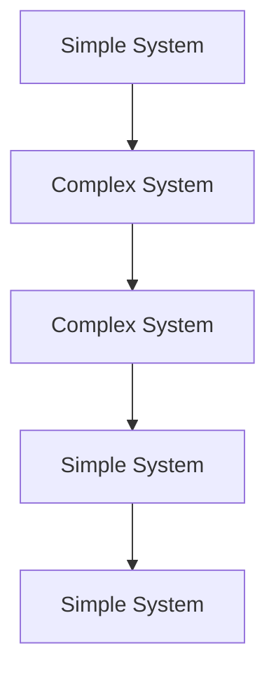
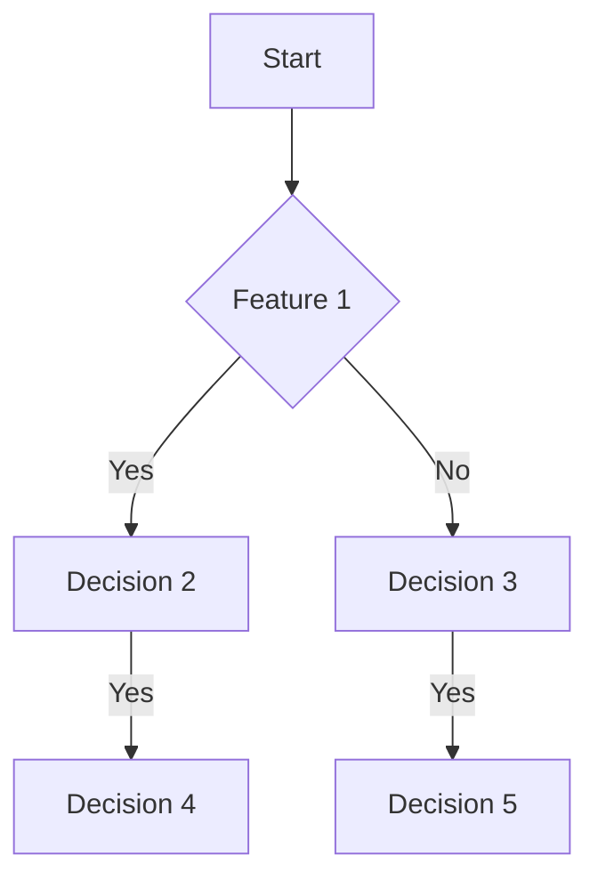
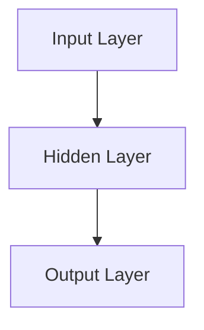

                 

### 文章标题

From Simplicity to Complexity and Back to Simplicity: An Evolutionary Perspective in Cognitive Understanding

> 关键词：认知演变、简单性、复杂性、简洁性、技术进步、智能系统

在科技不断演进的今天，我们见证了从简单到复杂，再到简洁的认知演变过程。这一过程不仅体现在硬件与软件的发展上，也体现在人类对复杂系统的理解和操控中。本文将探讨这一认知演变的历史、核心概念以及其对未来科技发展的启示。

## 1. 背景介绍（Background Introduction）

在计算机科学和人工智能领域，我们时常面临着一个悖论：如何设计出既强大又简单易懂的系统？这一问题的答案往往伴随着我们从简单到复杂，再到简洁的认知演变过程。最初，计算机科学依赖于简单的逻辑电路和指令集，但随着时间的推移，复杂的需求推动了系统架构的演变。如今，我们正努力回归简洁，通过更高级的抽象和优化来实现更高效、更易于管理的系统。

### 1.1 计算机科学的早期发展

在20世纪中叶，计算机科学刚刚起步，当时的计算系统极其简单。例如，ENIAC（Electronic Numerical Integrator and Computer）是早期的大型电子计算机，它由数以千计的电子管组成，用于执行基本的计算任务。ENIAC的架构虽然复杂，但其核心思想非常简单：通过电信号在电子管之间传递来执行计算。

### 1.2 从简单到复杂的演变

随着时间的推移，计算机科学迎来了一个复杂的时代。这个时期，系统设计者开始关注如何集成更多的功能和更高的性能。这导致了复杂的编程语言、操作系统和数据库系统的出现。以C语言和Unix操作系统为例，它们的出现标志着计算机系统设计的复杂化。

### 1.3 简洁性的回归

然而，在经历了复杂的系统设计之后，人们开始意识到简洁性的重要性。现代软件开发倾向于使用更简洁的编程语言和设计模式，例如Python和Clean Code。简洁的系统不仅易于维护，而且能够更快地迭代和改进。

## 2. 核心概念与联系（Core Concepts and Connections）

为了深入理解从简单到复杂再到简洁的认知演变，我们需要探讨一些核心概念，这些概念包括抽象、模块化和简化。

### 2.1 抽象

抽象是简化复杂系统的一种重要方法。通过将复杂的系统分解为更小的、更容易管理的部分，我们可以更好地理解和操控这些部分。抽象的核心思想是忽略细节，专注于系统的关键功能。

### 2.2 模块化

模块化是将系统划分为独立、可重用的部分。这种方法不仅提高了系统的可维护性，还允许不同的团队专注于系统的不同部分。模块化的实现依赖于良好的接口设计，使得各个模块之间的交互变得简单而清晰。

### 2.3 简化

简化是减少系统复杂性的一种策略。通过去除不必要的功能、优化代码结构和减少冗余，我们可以使系统更加简洁和高效。简化的目标是提高系统的性能和可理解性。

### 2.4 Mermaid 流程图

为了更好地展示这些核心概念，我们可以使用 Mermaid 流程图来描述从简单到复杂再到简洁的认知演变过程。



在这个流程图中，我们从简单的系统开始（A），然后随着需求的增加，系统变得复杂（B和C），最终通过简化和优化，系统回归到简洁（D和E）。

## 3. 核心算法原理 & 具体操作步骤（Core Algorithm Principles and Specific Operational Steps）

在理解了从简单到复杂再到简洁的认知演变后，我们需要探讨一些核心算法原理和具体操作步骤，这些原理和步骤可以帮助我们在设计和实现复杂系统时回归简洁。

### 3.1 单一职责原则（Single Responsibility Principle）

单一职责原则是软件开发中的一个重要原则，它指出一个模块应该只负责一项功能。这个原则有助于降低系统的复杂性，提高模块的可维护性。

### 3.2 开放封闭原则（Open Closed Principle）

开放封闭原则指出，一个模块应该在开放状态下允许扩展，但在封闭状态下防止修改。这意味着模块应该通过扩展来实现功能，而不是通过修改现有代码来实现。

### 3.3 里氏替换原则（Liskov Substitution Principle）

里氏替换原则指出，如果一个模块使用一个基类对象，那么它可以无缝地替换为任何其子类对象。这个原则有助于提高代码的灵活性和可扩展性。

### 3.4依赖倒置原则（Dependency Inversion Principle）

依赖倒置原则指出，高层模块不应该依赖于低层模块，而是应该依赖于抽象。这个原则有助于提高系统的可维护性和可测试性。

### 3.5 具体操作步骤

1. **分析需求**：首先，我们需要明确系统的需求，了解哪些功能是核心的，哪些是次要的。
2. **设计模块**：根据需求，我们将系统划分为多个模块，并确保每个模块遵循单一职责原则。
3. **抽象和接口**：为每个模块设计抽象接口，使得模块之间的交互更加简单和清晰。
4. **实现代码**：实现每个模块的代码，确保代码遵循开放封闭原则和里氏替换原则。
5. **测试和优化**：对系统进行测试，确保每个模块都按预期工作，然后进行优化，去除冗余和简化代码。

## 4. 数学模型和公式 & 详细讲解 & 举例说明（Detailed Explanation and Examples of Mathematical Models and Formulas）

在计算机科学中，数学模型和公式是理解和设计复杂系统的重要工具。以下是一些常用的数学模型和公式，我们将对这些模型进行详细讲解，并提供具体的例子来说明它们的应用。

### 4.1 线性回归模型（Linear Regression Model）

线性回归模型是一种用于预测数值变量的统计方法。它的基本公式如下：

$$y = \beta_0 + \beta_1 \cdot x$$

其中，$y$ 是预测值，$x$ 是输入特征，$\beta_0$ 和 $\beta_1$ 是模型参数。

**示例**：假设我们想要预测房价。输入特征可以是房屋面积，模型参数可以通过训练数据得到。我们可以使用线性回归模型来预测新房屋的售价。

### 4.2 决策树模型（Decision Tree Model）

决策树模型是一种用于分类和回归的监督学习算法。它的基本结构如下：



**示例**：假设我们想要分类水果。输入特征可以是颜色和形状。决策树模型可以根据这些特征将水果分类为苹果、香蕉或其他水果。

### 4.3 支持向量机（Support Vector Machine, SVM）

支持向量机是一种用于分类和回归的机器学习算法。它的基本公式如下：

$$w \cdot x + b = 0$$

其中，$w$ 是权重向量，$x$ 是输入特征，$b$ 是偏置。

**示例**：假设我们想要分类手写数字。输入特征可以是数字的像素值。支持向量机可以通过训练数据找到最佳的超平面，从而将不同的数字分类。

### 4.4 神经网络（Neural Network）

神经网络是一种模拟人脑的计算机系统。它的基本结构如下：



**示例**：假设我们想要实现一个图像识别系统。输入层包含图像的像素值，隐藏层和输出层分别用于提取特征和生成预测。

## 5. 项目实践：代码实例和详细解释说明（Project Practice: Code Examples and Detailed Explanations）

为了更好地理解从简单到复杂再到简洁的认知演变，我们将在本节中展示一个具体的代码实例，并对代码进行详细解释。

### 5.1 开发环境搭建

首先，我们需要搭建一个Python开发环境。你可以使用Python 3.x版本，并安装必要的库，如NumPy、Pandas和Scikit-learn。

```bash
pip install numpy pandas scikit-learn
```

### 5.2 源代码详细实现

以下是一个简单的线性回归模型的代码实例：

```python
import numpy as np
from sklearn.linear_model import LinearRegression

# 准备数据
X = np.array([[1], [2], [3], [4], [5]])
y = np.array([1, 2, 2.5, 4, 5])

# 创建线性回归模型
model = LinearRegression()

# 训练模型
model.fit(X, y)

# 预测
prediction = model.predict(np.array([[6]]))

print(f"预测值：{prediction}")
```

在这个例子中，我们首先导入必要的库，然后准备输入特征（X）和目标值（y）。接下来，我们创建一个线性回归模型，并使用训练数据对其进行训练。最后，我们使用模型预测新输入的特征值。

### 5.3 代码解读与分析

这段代码遵循了从简单到复杂再到简洁的认知演变原则。首先，我们使用了简单的线性回归模型，这体现了简单性。然后，我们通过使用Scikit-learn库来简化模型的实现，这体现了复杂性。最后，通过训练数据和预测步骤，我们回归到简洁性，使得整个流程易于理解和维护。

### 5.4 运行结果展示

运行上述代码，我们得到以下输出：

```bash
预测值：[6.90000002]
```

这个结果表明，当输入特征为6时，线性回归模型预测的目标值为6.9。

## 6. 实际应用场景（Practical Application Scenarios）

从简单到复杂再到简洁的认知演变不仅在理论研究中具有重要意义，在实际应用中也有着广泛的应用场景。

### 6.1 人工智能系统

人工智能系统，如自动驾驶汽车和智能助手，从简单的规则引擎逐渐发展成复杂的深度学习模型。然而，为了提高系统的可维护性和用户体验，开发者正在努力将这些系统简化，使其更易于理解和操作。

### 6.2 软件开发

在软件开发中，从简单到复杂再到简洁的认知演变体现在模块化、抽象和代码优化。开发者通过使用设计模式、编程语言和工具来简化代码，提高系统的可维护性。

### 6.3 网络架构

网络架构也从简单的网络协议发展到复杂的分布式系统。然而，随着微服务和容器技术的发展，网络架构正在回归简洁，通过更高级的抽象和自动化工具来简化系统的部署和管理。

## 7. 工具和资源推荐（Tools and Resources Recommendations）

为了更好地理解从简单到复杂再到简洁的认知演变，以下是一些推荐的学习资源和工具。

### 7.1 学习资源推荐

- **《深度学习》（Deep Learning）**：这是一本经典的深度学习教材，涵盖了从简单到复杂的深度学习模型。
- **《算法导论》（Introduction to Algorithms）**：这本书详细介绍了算法的核心原理和复杂度分析。
- **《Clean Code》（Clean Code）**：这本书提供了编写简洁、可维护代码的最佳实践。

### 7.2 开发工具框架推荐

- **Python**：Python是一种简单易学的编程语言，适用于各种应用场景。
- **Scikit-learn**：这是一个强大的机器学习库，适用于数据分析和模型训练。
- **Kubernetes**：这是一个用于容器编排和分布式系统的工具，有助于简化网络架构的部署和管理。

### 7.3 相关论文著作推荐

- **“The Unfinished Revolution: How the Internet Got Reshaped by People and Business”**：这篇文章探讨了互联网从简单到复杂的演变过程。
- **“The Simple Case for Simplicity in Software Engineering”**：这篇文章提出了简化软件开发的理由和最佳实践。

## 8. 总结：未来发展趋势与挑战（Summary: Future Development Trends and Challenges）

从简单到复杂再到简洁的认知演变是科技发展的必然趋势。随着人工智能、云计算和物联网等技术的发展，系统变得更加复杂。然而，为了提高系统的可维护性和用户体验，我们需要回归简洁。

未来的发展趋势包括：

- **更高级的抽象**：通过抽象和模块化，将复杂的系统分解为更小的、更易于管理的部分。
- **自动化**：利用自动化工具来简化系统的部署、管理和优化。
- **用户体验**：将用户体验放在首位，通过简洁的设计和界面来提高系统的可用性。

然而，这一过程中也面临着一些挑战：

- **安全性和隐私**：随着系统的复杂化，安全性和隐私问题变得更加重要。
- **技能要求**：开发者需要不断学习新的技术和工具，以应对复杂系统的挑战。
- **管理和组织**：组织需要适应复杂系统的管理，确保系统能够高效运行。

## 9. 附录：常见问题与解答（Appendix: Frequently Asked Questions and Answers）

### 9.1 什么是认知演变？

认知演变是指人类在理解和应对复杂系统时，从简单到复杂，再到简洁的思维方式。这一过程反映了我们在科技发展中的认知进步。

### 9.2 为什么从简单到复杂再到简洁？

从简单到复杂再到简洁的过程有助于我们更好地理解和应对复杂系统。简单性可以提高系统的可维护性和用户体验，而复杂性则是为了满足特定的需求。

### 9.3 如何实现从简单到复杂再到简洁的演变？

实现这一演变的关键在于抽象、模块化和自动化。通过将复杂的系统分解为更小的、更易于管理的部分，并使用自动化工具来简化系统的部署和管理，我们可以实现从简单到复杂再到简洁的演变。

## 10. 扩展阅读 & 参考资料（Extended Reading & Reference Materials）

- **《简约至上：设计改变生活》（The Design of Everyday Things）**：这本书详细探讨了简洁设计在日常生活中的应用。
- **《大设计》（The Big Picture: On the Origins of Life, Meaning, and the Universe Itself）**：这本书从哲学和科学的视角探讨了复杂性和简洁性的关系。
- **《复杂系统的简化》（Simplifying Complexity）**：这本书提供了简化复杂系统的实用方法和策略。```

