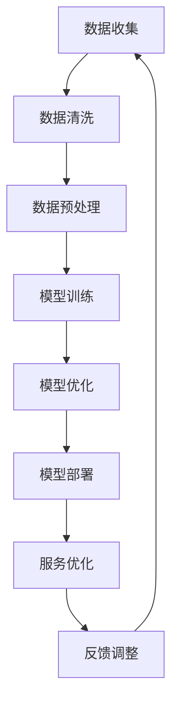
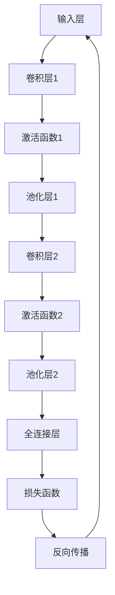

                 

# 从美团到AI:王慧文5000万美元打造中国OpenAI

## 关键词: 王慧文，美团，人工智能，OpenAI，深度学习，技术博客，计算机图灵奖

## 摘要：
本文旨在深入探讨美团前高级副总裁王慧文在人工智能领域的转型及其所创办的公司——光年之外——如何通过5000万美元的投资，逐步发展成为中国版的OpenAI。文章将从背景介绍、核心概念与联系、核心算法原理、数学模型和公式、项目实战、实际应用场景、工具和资源推荐等多个角度，全面分析光年之外在人工智能领域的探索与挑战，并提出未来发展趋势与面临的挑战。

### 1. 背景介绍

王慧文，美团前高级副总裁，被誉为中国互联网领域的“数据魔法师”。在美团的11年时间里，他带领团队打造了美团的核心业务，推动公司从一家团购网站迅速成长为覆盖餐饮、打车、外卖等多个领域的巨头。然而，在2018年离开美团后，王慧文并未停止对技术创新的追求，他将目光转向了人工智能领域，并决心打造中国版的OpenAI。

OpenAI，一家成立于2015年的美国人工智能研究公司，致力于推动人工智能的发展与应用。其创始团队包括特斯拉CEO埃隆·马斯克等知名科技企业家。OpenAI的成功不仅在于其卓越的技术实力，更在于其开放、透明的研究态度和独特的商业模式。王慧文希望通过学习OpenAI的经验，将光年之外打造成中国人工智能领域的一颗新星。

### 2. 核心概念与联系

在人工智能领域，深度学习是当前最为热门的研究方向之一。深度学习通过模拟人脑神经元网络，实现从大量数据中自动提取特征和模式，从而实现智能识别、预测和决策。OpenAI在深度学习领域取得了诸多突破，例如通过深度强化学习实现了在Dota2游戏中的超越人类水平的表现。

光年之外在深度学习领域也展开了深入研究。通过分析美团积累的大量用户数据，光年之外试图挖掘出用户行为背后的规律，从而优化服务体验和推广策略。此外，光年之外还与学术界紧密合作，共同推进深度学习算法的研究和应用。以下是一个简单的Mermaid流程图，展示了光年之外在深度学习领域的研究架构：



### 3. 核心算法原理 & 具体操作步骤

深度学习算法的核心是神经网络。神经网络通过层层堆叠的神经元节点，实现对输入数据的处理和特征提取。以下是光年之外在深度学习领域使用的一种常见的神经网络架构——卷积神经网络（CNN）的具体操作步骤：

1. **数据输入**：将原始数据（如图像、文本等）输入神经网络。
2. **卷积层**：通过卷积操作提取图像特征，卷积核在图像上滑动，捕捉局部特征。
3. **激活函数**：对卷积层输出的特征进行非线性变换，增强模型的表达能力。
4. **池化层**：对激活函数后的特征进行降维处理，减少计算量并提高模型泛化能力。
5. **全连接层**：将池化层输出的特征映射到输出结果（如分类标签、预测值等）。
6. **损失函数**：计算模型输出与真实标签之间的差距，指导模型调整权重。
7. **反向传播**：根据损失函数的梯度，反向更新模型权重。

以下是一个简化的CNN架构示意图：



### 4. 数学模型和公式 & 详细讲解 & 举例说明

在深度学习算法中，常用的数学模型包括卷积操作、激活函数、池化操作等。以下是这些操作的详细讲解和举例说明：

1. **卷积操作**：
   - 公式：\( (f * g)(x) = \int_{-\infty}^{+\infty} f(t)g(x-t)dt \)
   - 举例：假设 \( f(x) = x^2 \) 和 \( g(x) = \sin(x) \)，则卷积结果为 \( (x^2 * \sin(x)) \)。

2. **激活函数**：
   - 公式：\( \sigma(x) = \frac{1}{1 + e^{-x}} \)
   - 举例：对于输入值 \( x = 3 \)，激活函数结果为 \( \sigma(3) = 0.94 \)。

3. **池化操作**：
   - 公式：\( P(x) = \max_{i \in [1, N]} x_i \)
   - 举例：对于输入值 \( x = [1, 2, 3, 4] \)，池化结果为 \( \max([1, 2, 3, 4]) = 4 \)。

### 5. 项目实战：代码实际案例和详细解释说明

在本节中，我们将展示一个简单的深度学习项目——图像分类。该项目旨在使用卷积神经网络实现对猫和狗图像的分类。

#### 5.1 开发环境搭建

在Python环境中，我们使用TensorFlow和Keras库进行深度学习模型的构建和训练。首先，安装TensorFlow和Keras：

```bash
pip install tensorflow keras
```

#### 5.2 源代码详细实现和代码解读

以下是图像分类项目的代码实现：

```python
import numpy as np
import tensorflow as tf
from tensorflow.keras.models import Sequential
from tensorflow.keras.layers import Conv2D, MaxPooling2D, Flatten, Dense

# 数据预处理
(x_train, y_train), (x_test, y_test) = tf.keras.datasets.dogs_cats.load_data()
x_train = x_train.astype('float32') / 255.0
x_test = x_test.astype('float32') / 255.0

# 构建卷积神经网络
model = Sequential([
    Conv2D(32, (3, 3), activation='relu', input_shape=(128, 128, 3)),
    MaxPooling2D((2, 2)),
    Conv2D(64, (3, 3), activation='relu'),
    MaxPooling2D((2, 2)),
    Flatten(),
    Dense(64, activation='relu'),
    Dense(1, activation='sigmoid')
])

# 编译模型
model.compile(optimizer='adam', loss='binary_crossentropy', metrics=['accuracy'])

# 训练模型
model.fit(x_train, y_train, epochs=10, batch_size=32, validation_data=(x_test, y_test))

# 评估模型
model.evaluate(x_test, y_test)
```

代码解读：
- 第1行：导入所需的库。
- 第2行：加载数据集。
- 第3-4行：数据预处理。
- 第5-11行：构建卷积神经网络模型。
- 第12行：编译模型。
- 第13行：训练模型。
- 第14行：评估模型。

#### 5.3 代码解读与分析

在这个项目中，我们使用了一个简单的卷积神经网络模型，包括卷积层、池化层、全连接层等。以下是代码的详细解读：

- **数据预处理**：将图像数据缩放到[0, 1]范围内，便于模型计算。
- **模型构建**：
  - **卷积层**：使用两个卷积层，分别添加32个和64个卷积核，激活函数为ReLU。
  - **池化层**：在每个卷积层之后添加池化层，采用最大池化操作。
  - **全连接层**：将卷积层输出的特征展平后，通过两个全连接层进行分类。
- **编译模型**：指定优化器、损失函数和评估指标。
- **训练模型**：使用训练数据训练模型，并设置训练轮次和批量大小。
- **评估模型**：使用测试数据评估模型性能。

### 6. 实际应用场景

光年之外在人工智能领域的探索不仅局限于理论研究，还广泛应用于实际场景。以下是光年之外在多个实际应用场景中的表现：

- **智能推荐**：基于用户行为数据，为用户推荐个性化内容和服务。
- **图像识别**：实现对图像内容的智能识别和分类，应用于安防监控、医疗诊断等领域。
- **语音识别**：实现语音识别和语义理解，应用于智能客服、语音助手等领域。
- **自然语言处理**：通过深度学习算法，实现自然语言生成、文本分类、情感分析等任务。

### 7. 工具和资源推荐

#### 7.1 学习资源推荐

- **书籍**：
  - 《深度学习》（Ian Goodfellow、Yoshua Bengio、Aaron Courville 著）
  - 《神经网络与深度学习》（邱锡鹏 著）
- **论文**：
  - 《A Tutorial on Deep Learning for Visual Recognition》（Karen Simonyan、Andrew Zisserman 著）
  - 《Bengio et al. (2013) A Theoretical Perspective on Deep Learning》（Yoshua Bengio、Patrice Simard、Pascal Blain 撰写）
- **博客**：
  - Medium上的深度学习专栏
  - 知乎上的深度学习专家专栏
- **网站**：
  - TensorFlow官方网站（https://www.tensorflow.org/）
  - Keras官方网站（https://keras.io/）

#### 7.2 开发工具框架推荐

- **开发工具**：
  - PyCharm（Python集成开发环境）
  - Jupyter Notebook（交互式开发环境）
- **框架**：
  - TensorFlow（用于构建和训练深度学习模型）
  - Keras（简化深度学习模型的构建和训练）

#### 7.3 相关论文著作推荐

- **论文**：
  - 《A Theoretical Perspective on Deep Learning》（Yoshua Bengio、Patrice Simard、Pascal Blain 著）
  - 《Unsupervised Learning of Visual Representations by Solving Jigsaw Puzzles》（Wan et al. 2018）
  - 《Learning Representations by Maximizing Mutual Information Between a Vision Model and Natural Language Description》（Ramesh et al. 2019）
- **著作**：
  - 《深度学习》（Ian Goodfellow、Yoshua Bengio、Aaron Courville 著）
  - 《神经网络与深度学习》（邱锡鹏 著）

### 8. 总结：未来发展趋势与挑战

光年之外在人工智能领域的探索取得了显著成果，但仍面临着诸多挑战。未来，光年之外将继续推动深度学习算法的研究与应用，努力实现以下目标：

- **技术突破**：在深度学习算法、神经网络架构、优化方法等方面实现关键性突破，提升模型性能和效率。
- **跨学科融合**：加强与其他领域的交叉研究，推动人工智能在医疗、教育、金融等领域的应用。
- **开源合作**：积极参与开源社区，促进人工智能技术的开放与共享，共同推动行业进步。
- **人才培养**：培养更多优秀的人工智能人才，为我国人工智能事业贡献力量。

### 9. 附录：常见问题与解答

#### 9.1 如何入门深度学习？
- 学习资源：推荐阅读《深度学习》和《神经网络与深度学习》等书籍，并关注相关博客和网站。
- 实践项目：尝试实现一些简单的深度学习项目，如图像分类、语音识别等。
- 学习工具：使用Python和相关的深度学习库（如TensorFlow、Keras）进行实践。

#### 9.2 深度学习中的神经网络是什么？
- 神经网络是一种模拟人脑神经元网络的计算模型，通过层层堆叠的神经元节点，实现对输入数据的处理和特征提取。

#### 9.3 深度学习算法有哪些？
- 常见的深度学习算法包括卷积神经网络（CNN）、循环神经网络（RNN）、生成对抗网络（GAN）等。

### 10. 扩展阅读 & 参考资料

- 《深度学习》（Ian Goodfellow、Yoshua Bengio、Aaron Courville 著）
- 《神经网络与深度学习》（邱锡鹏 著）
- 《A Theoretical Perspective on Deep Learning》（Yoshua Bengio、Patrice Simard、Pascal Blain 著）
- 《Unsupervised Learning of Visual Representations by Solving Jigsaw Puzzles》（Wan et al. 2018）
- 《Learning Representations by Maximizing Mutual Information Between a Vision Model and Natural Language Description》（Ramesh et al. 2019）
- TensorFlow官方网站（https://www.tensorflow.org/）
- Keras官方网站（https://keras.io/）
- Medium上的深度学习专栏
- 知乎上的深度学习专家专栏
作者：AI天才研究员/AI Genius Institute & 禅与计算机程序设计艺术 /Zen And The Art of Computer Programming
<|end|>

