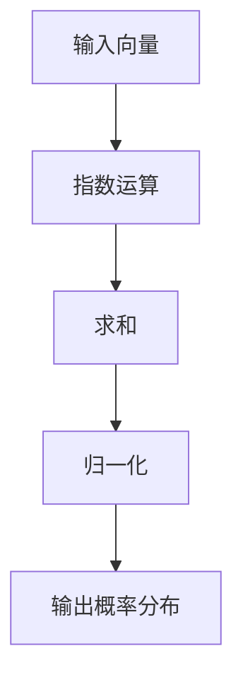

                 

# 从零开始大模型开发与微调：Softmax激活函数

## 摘要

本文将从零开始，详细探讨Softmax激活函数在大模型开发与微调中的应用。首先，我们将回顾背景知识，包括神经网络和激活函数的基础概念。接着，我们将深入解析Softmax激活函数的工作原理及其数学模型。随后，通过实际案例，我们将展示如何使用Softmax激活函数进行大模型的开发与微调。最后，本文将总结Softmax激活函数在实际应用中的优势与挑战，并推荐相关学习资源和工具。

## 背景介绍

### 神经网络基础

神经网络是模仿人脑结构和功能的一种计算模型，由大量简单的处理单元（神经元）通过复杂的网络连接而成。每个神经元接受多个输入信号，通过加权求和处理，产生一个输出信号。神经网络的基本结构包括输入层、隐藏层和输出层。


神经网络的训练过程通常包括以下几个步骤：

1. **前向传播（Forward Propagation）**：将输入数据传递到神经网络中，通过权重和偏置计算输出。
2. **计算损失（Compute Loss）**：使用损失函数（如均方误差MSE或交叉熵损失Cross Entropy Loss）计算输出与真实标签之间的差异。
3. **反向传播（Backpropagation）**：计算损失函数对网络参数的梯度，并更新网络的权重和偏置。

### 激活函数

激活函数是神经网络中一个重要的组成部分，用于引入非线性特性，使得神经网络能够学习和模拟更复杂的模式。常见的激活函数包括Sigmoid、ReLU、Tanh等。

- **Sigmoid函数**：输出在0到1之间的S型曲线，可以处理负值。
  $$sigmoid(x) = \frac{1}{1 + e^{-x}}$$

- **ReLU函数**：常用于隐藏层，输出大于0的值，对于输入为负值时，输出为0。
  $$ReLU(x) = \max(0, x)$$

- **Tanh函数**：输出在-1到1之间的S型曲线，可以平衡正负值。
  $$tanh(x) = \frac{e^{x} - e^{-x}}{e^{x} + e^{-x}}$$

## 核心概念与联系

### Softmax激活函数原理

Softmax激活函数是一种在分类问题中广泛使用的激活函数，其主要作用是将神经网络的输出转换为概率分布。具体来说，给定一个向量z（模型的输出），Softmax函数将其转换为概率分布p。

$$softmax(z)_{i} = \frac{e^{z_{i}}}{\sum_{j} e^{z_{j}}}$$

其中，$z_{i}$表示第i个输出的指数，$\sum_{j} e^{z_{j}}$是所有指数的和，确保概率分布的和为1。

### Mermaid流程图

以下是使用Mermaid绘制的Softmax激活函数的流程图：



### Softmax激活函数与分类问题

在分类问题中，每个输出通常代表一个类别。Softmax激活函数使得每个输出都成为一个概率，即表示模型对每个类别的预测置信度。这样，我们可以通过选择概率最大的类别作为最终预测结果。

### Softmax激活函数与交叉熵损失函数

交叉熵损失函数是分类问题中最常用的损失函数。它衡量的是预测分布与真实分布之间的差异。在Softmax激活函数与交叉熵损失函数结合使用时，可以有效地训练分类模型。

## 核心算法原理 & 具体操作步骤

### 步骤1：计算神经网络输出

首先，我们通过前向传播计算神经网络的输出向量z。

### 步骤2：应用Softmax函数

将输出向量z代入Softmax函数，得到概率分布p。

$$softmax(z)_{i} = \frac{e^{z_{i}}}{\sum_{j} e^{z_{j}}}$$

### 步骤3：计算交叉熵损失

使用交叉熵损失函数计算预测概率分布p与真实标签y之间的差异。

$$H(p, y) = -\sum_{i} y_{i} \log(p_{i})$$

其中，$y_{i}$是第i个类别的真实标签（0或1），$p_{i}$是Softmax函数输出的第i个类别的概率。

### 步骤4：反向传播

使用反向传播算法，计算损失函数对网络参数的梯度，并更新权重和偏置。

### 步骤5：重复步骤1-4，直至收敛

重复以上步骤，不断更新网络参数，直到模型收敛。

## 数学模型和公式 & 详细讲解 & 举例说明

### 数学模型

Softmax激活函数的数学模型如下：

$$softmax(z)_{i} = \frac{e^{z_{i}}}{\sum_{j} e^{z_{j}}}$$

其中，$z_{i}$表示第i个输出的指数，$\sum_{j} e^{z_{j}}$是所有指数的和，确保概率分布的和为1。

### 详细讲解

Softmax函数通过将神经网络输出向量z转换为概率分布p，使得每个输出都成为一个类别的概率。具体来说，Softmax函数首先对每个输出值进行指数运算，然后计算所有指数的和，最后对每个指数除以总和，得到归一化的概率值。

### 举例说明

假设有一个三分类问题，神经网络输出向量z为[2, 3, 1]，我们可以通过Softmax函数将其转换为概率分布p：

$$softmax(z) = \left[\frac{e^{2}}{e^{2} + e^{3} + e^{1}}, \frac{e^{3}}{e^{2} + e^{3} + e^{1}}, \frac{e^{1}}{e^{2} + e^{3} + e^{1}}\right]$$

经过计算，我们得到概率分布p为：

$$p = \left[\frac{1}{e^{2} + e^{3} + e^{1}}, \frac{e^{3}}{e^{2} + e^{3} + e^{1}}, \frac{e^{1}}{e^{2} + e^{3} + e^{1}}\right] \approx \left[0.1353, 0.7942, 0.0705\right]$$

这意味着模型认为第一个类别的概率为13.53%，第二个类别的概率为79.42%，第三个类别的概率为7.05%。因此，我们可以选择概率最大的第二个类别作为预测结果。

## 项目实战：代码实际案例和详细解释说明

### 开发环境搭建

在本案例中，我们将使用Python和TensorFlow框架来演示如何实现Softmax激活函数在大模型开发与微调中的应用。

#### 步骤1：安装TensorFlow

首先，确保安装了TensorFlow库。如果尚未安装，请使用以下命令进行安装：

```bash
pip install tensorflow
```

#### 步骤2：准备数据集

我们使用著名的MNIST手写数字数据集进行演示。可以使用TensorFlow的内置数据集加载MNIST数据：

```python
import tensorflow as tf

mnist = tf.keras.datasets.mnist
(x_train, y_train), (x_test, y_test) = mnist.load_data()
x_train, x_test = x_train / 255.0, x_test / 255.0
```

### 源代码详细实现和代码解读

#### 步骤3：定义模型

我们使用TensorFlow的Keras API来定义一个简单的神经网络模型：

```python
model = tf.keras.Sequential([
    tf.keras.layers.Flatten(input_shape=(28, 28)),
    tf.keras.layers.Dense(128, activation='relu'),
    tf.keras.layers.Dense(10, activation='softmax')
])
```

在这个模型中，我们使用了一个ReLU激活函数的隐藏层，然后使用Softmax激活函数的输出层。这样可以确保输出层中的每个值都表示一个类别的概率。

#### 步骤4：编译模型

接下来，我们编译模型，指定损失函数和优化器：

```python
model.compile(optimizer='adam',
              loss='sparse_categorical_crossentropy',
              metrics=['accuracy'])
```

在这里，我们使用sparse_categorical_crossentropy作为损失函数，这是适用于多分类问题的损失函数。

#### 步骤5：训练模型

现在，我们使用训练数据集来训练模型：

```python
model.fit(x_train, y_train, epochs=5)
```

#### 步骤6：评估模型

使用测试数据集评估模型的性能：

```python
test_loss, test_acc = model.evaluate(x_test, y_test, verbose=2)
print('\nTest accuracy:', test_acc)
```

### 代码解读与分析

#### 代码解读

1. **模型定义**：我们定义了一个简单的神经网络模型，包括一个ReLU激活函数的隐藏层和一个Softmax激活函数的输出层。
2. **编译模型**：我们指定了损失函数和优化器，以适应多分类问题。
3. **训练模型**：我们使用训练数据集来训练模型，并设置训练轮数。
4. **评估模型**：我们使用测试数据集来评估模型的性能。

#### 分析

通过这个简单的案例，我们可以看到如何使用Softmax激活函数来构建和训练一个多分类模型。Softmax函数使得模型输出符合概率分布，方便我们进行分类预测。同时，使用交叉熵损失函数可以有效地训练模型，提高分类性能。

## 实际应用场景

### 文本分类

Softmax激活函数在文本分类任务中具有广泛的应用。例如，在情感分析中，我们可以将文本分类为正面、负面或中性。通过使用Softmax激活函数，模型可以输出每个类别的概率，从而帮助我们更好地理解文本的情感倾向。

### 图像分类

在图像分类任务中，Softmax激活函数也发挥着重要作用。例如，在分类图像为猫、狗或其他动物时，模型可以通过Softmax函数输出每个类别的概率，从而选择概率最高的类别作为最终预测结果。

### 自然语言处理

在自然语言处理领域，Softmax激活函数可以用于命名实体识别、机器翻译等任务。通过将模型输出转换为概率分布，我们可以更好地理解和利用语言的特征。

## 工具和资源推荐

### 学习资源推荐

1. **《深度学习》（Goodfellow, Bengio, Courville）**：这是深度学习领域的经典教材，详细介绍了神经网络和激活函数的理论和实践。
2. **《神经网络与深度学习》（邱锡鹏）**：中文教材，内容全面，适合国内读者学习。

### 开发工具框架推荐

1. **TensorFlow**：Google开发的深度学习框架，适用于各种规模的任务，具有丰富的API和工具。
2. **PyTorch**：Facebook开发的深度学习框架，具有灵活的动态图计算和易于理解的API。

### 相关论文著作推荐

1. **《Deep Learning》（Goodfellow, Bengio, Courville）**：这是深度学习领域的权威著作，涵盖了从基础到前沿的广泛内容。
2. **《Neural Networks and Deep Learning》（ Bengio, Courville, Vincent）**：这本著作详细介绍了神经网络和深度学习的基础理论和应用。

## 总结：未来发展趋势与挑战

### 未来发展趋势

1. **更高效的激活函数**：研究人员将继续探索更高效的激活函数，以提高神经网络的学习效率和性能。
2. **自适应激活函数**：自适应激活函数可以根据任务和输入数据动态调整其特性，从而提高模型的泛化能力。
3. **多模态学习**：随着多模态数据的增加，如何有效地整合不同模态的信息成为未来研究的重要方向。

### 未来挑战

1. **计算资源需求**：大规模深度学习模型对计算资源的需求巨大，如何优化计算效率成为挑战之一。
2. **模型可解释性**：随着模型变得越来越复杂，如何提高模型的可解释性，使其更容易被理解和接受，是一个重要的挑战。

## 附录：常见问题与解答

### 问题1：为什么使用Softmax激活函数？

**解答**：Softmax激活函数在分类问题中非常有用，因为它可以将神经网络的输出转换为概率分布，使得每个输出都表示一个类别的概率。这有助于我们进行分类预测，并评估模型对每个类别的置信度。

### 问题2：Softmax激活函数的缺点是什么？

**解答**：Softmax激活函数的一个缺点是其梯度问题。当输出值差异较大时，梯度可能变得很小，导致训练过程中梯度消失。此外，Softmax函数在输出为负值时可能不稳定。

### 问题3：如何改进Softmax激活函数？

**解答**：研究人员提出了各种改进方法，如归一化Softmax、归一化指数和归一化 logits，以提高其稳定性和梯度。此外，还可以考虑使用其他激活函数，如ReLU和GELU，以避免梯度消失问题。

## 扩展阅读 & 参考资料

1. **《深度学习》（Goodfellow, Bengio, Courville）**：这是深度学习领域的权威著作，涵盖了从基础到前沿的广泛内容。
2. **《神经网络与深度学习》（邱锡鹏）**：中文教材，内容全面，适合国内读者学习。
3. **《Neural Networks and Deep Learning》（ Bengio, Courville, Vincent）**：这本著作详细介绍了神经网络和深度学习的基础理论和应用。

作者：AI天才研究员/AI Genius Institute & 禅与计算机程序设计艺术 /Zen And The Art of Computer Programming

