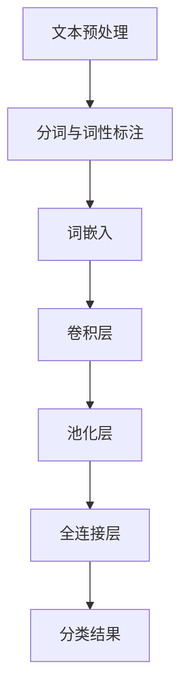

                 

# 从零开始大模型开发与微调：使用卷积对文本分类的补充内容

> **关键词**：文本分类、卷积神经网络、深度学习、大模型、微调、模型开发

> **摘要**：本文将深入探讨如何从零开始进行大模型开发与微调，特别是针对文本分类任务中使用卷积神经网络（CNN）的补充内容。我们将一步步分析CNN在文本分类中的应用原理、实现步骤、数学模型及实际项目案例，旨在为读者提供全面的指导。

## 1. 背景介绍

文本分类是自然语言处理（NLP）领域的一项基础任务，旨在将文本数据按照其内容特征自动划分为预定义的类别。随着互联网和大数据时代的到来，文本分类在搜索引擎、情感分析、新闻推荐等众多领域得到广泛应用。传统的文本分类方法主要依赖于特征工程，即手动提取文本中的关键特征，如词频、词袋模型、TF-IDF等。然而，这些方法在处理大规模文本数据时效果不佳，无法捕捉到文本的深层次特征。

近年来，深度学习在图像识别、语音识别等领域取得了显著成果。卷积神经网络（CNN）作为一种特殊的深度学习模型，能够自动提取和组合输入数据中的特征，特别适用于图像处理。随着研究的深入，研究者们发现CNN同样适用于文本分类任务，能够显著提高分类效果。本文将介绍如何从零开始进行大模型开发与微调，特别是使用卷积神经网络进行文本分类。

## 2. 核心概念与联系

### 2.1 卷积神经网络（CNN）

卷积神经网络是一种特殊的深度学习模型，具有强大的特征提取和表示能力。CNN的核心组件是卷积层、池化层和全连接层。卷积层通过卷积操作提取输入数据中的局部特征，池化层用于减小特征图的尺寸，减少参数数量，全连接层将特征图中的信息映射到预定义的类别。

### 2.2 文本分类

文本分类是将文本数据按照其内容特征划分为预定义的类别。常见的文本分类任务包括垃圾邮件过滤、情感分析、新闻分类等。文本分类的关键在于如何有效地提取和表示文本特征，以便于分类模型进行预测。

### 2.3 卷积神经网络与文本分类的联系

卷积神经网络在文本分类中的应用主要体现在两个方面：

1. **文本特征提取**：通过卷积操作，CNN可以自动提取文本中的局部特征，如词组、句法结构等。这些特征有助于捕捉文本的深层次信息，提高分类效果。
2. **文本表示**：CNN能够将文本数据映射到一个高维的语义空间，使得相似文本在空间中的距离更近，从而便于分类模型进行预测。

### 2.4 Mermaid 流程图

以下是卷积神经网络在文本分类任务中的基本流程图：



## 3. 核心算法原理 & 具体操作步骤

### 3.1 文本预处理

文本预处理是文本分类任务中的第一步，主要包括分词、词性标注、停用词过滤等操作。分词是将文本划分为一系列的词语或短语，词性标注是对每个词语进行词性分类，如名词、动词等。停用词过滤则是去除文本中的常见无意义词汇，如“的”、“了”等。

### 3.2 词嵌入

词嵌入是将词语映射为高维向量表示。通过词嵌入，文本中的词语可以获得一个具有数学意义的向量表示，使得相似词语在空间中的距离更近。常见的词嵌入方法有Word2Vec、GloVe等。

### 3.3 卷积层

卷积层是CNN的核心组件之一，通过卷积操作提取文本中的局部特征。在文本分类任务中，卷积层通常使用一维卷积核，对词嵌入向量进行卷积操作，得到一系列的特征图。

### 3.4 池化层

池化层用于减小特征图的尺寸，减少参数数量。常见的池化方法有最大池化和平均池化。最大池化选取特征图中最大值作为输出，平均池化则计算特征图中所有值的平均值。

### 3.5 全连接层

全连接层将特征图中的信息映射到预定义的类别。通过全连接层，模型可以学习到特征图与类别之间的关系，从而实现文本分类。

### 3.6 损失函数与优化算法

在文本分类任务中，常用的损失函数有交叉熵损失函数。优化算法通常采用随机梯度下降（SGD）或其变种，如Adam优化器。

## 4. 数学模型和公式 & 详细讲解 & 举例说明

### 4.1 词嵌入

词嵌入是将词语映射为高维向量表示。给定一个词汇表V，每个词语都可以表示为一个唯一的索引。词嵌入模型的目标是学习一个映射函数W，将词汇表中的词语映射为高维向量。

$$
x_i = W[i], \quad i \in V
$$

其中，$x_i$ 表示词语 $v_i$ 的词嵌入向量，$W$ 是一个高维矩阵，其每一行都是一个词嵌入向量。

### 4.2 卷积层

卷积层通过卷积操作提取文本中的局部特征。给定一个词嵌入矩阵$X$，卷积层输出一个特征图$F$。

$$
F[j,k] = \sum_{i} X[i] * K[i,j,k], \quad j \in [1,\ldots,H], \quad k \in [1,\ldots,W]
$$

其中，$K$ 是一个卷积核，$* $ 表示卷积操作，$F[j,k]$ 表示特征图上的一个像素点，其值为卷积核$K[i,j,k]$与词嵌入向量$X[i]$的点积。

### 4.3 池化层

池化层用于减小特征图的尺寸，减少参数数量。给定一个特征图$F$，最大池化选取特征图中最大值作为输出，平均池化则计算特征图中所有值的平均值。

$$
P[j,k] = \max(F[j,k]), \quad \text{or} \quad P[j,k] = \frac{1}{C} \sum_{c=1}^{C} F[j,k,c], \quad j \in [1,\ldots,H'], \quad k \in [1,\ldots,W']
$$

其中，$P$ 是池化后的特征图，$H', W'$ 是池化后的特征图尺寸，$C$ 是特征图的通道数。

### 4.4 全连接层

全连接层将特征图中的信息映射到预定义的类别。给定一个特征图$F$，全连接层的输出$Y$可以通过以下公式计算：

$$
Y[i] = \sum_{j=1}^{H'} \sum_{k=1}^{W'} P[j,k] * W'[i,j,k], \quad i \in [1,\ldots,C]
$$

其中，$Y[i]$ 表示类别 $c_i$ 的预测概率，$W'$ 是全连接层的权重矩阵。

### 4.5 举例说明

假设有一个简单的文本分类任务，包含两个类别“猫”和“狗”。文本数据是一个长度为5的句子，词嵌入维度为3。我们将使用一个卷积神经网络进行文本分类。

1. **词嵌入**：假设词汇表V包含5个词语，词嵌入矩阵W如下：

|   | v1 | v2 | v3 | v4 | v5 |
|---|----|----|----|----|----|
| 1 |  [1, 0, 0] | [0, 1, 0] | [0, 0, 1] | [0, 0, 1] | [0, 0, 1] |
| 2 |  [0, 1, 0] | [1, 0, 0] | [0, 0, 1] | [0, 0, 1] | [0, 0, 1] |
| 3 |  [0, 0, 1] | [0, 1, 0] | [1, 0, 0] | [0, 0, 1] | [0, 0, 1] |
| 4 |  [0, 0, 1] | [0, 0, 1] | [0, 1, 0] | [1, 0, 0] | [0, 0, 1] |
| 5 |  [0, 0, 1] | [0, 0, 1] | [0, 0, 1] | [0, 1, 0] | [1, 0, 0] |

2. **卷积层**：假设卷积核K的大小为2x3，卷积操作如下：

| i | j | k | K[i,j,k] | X[i] | X[i] * K[i,j,k] |
|---|---|---|---------|------|----------------|
| 1 | 1 | 1 |   0.5   | [1,0,0] |      [0.5,0,0] |
| 1 | 1 | 2 |   0.5   | [0,1,0] |      [0.5,0.5,0] |
| 1 | 2 | 1 |   0.5   | [0,0,1] |      [0,0.5,0.5] |
| 1 | 2 | 2 |   0.5   | [0,0,1] |      [0,0.5,0.5] |
| 2 | 1 | 1 |   0.5   | [0,1,0] |      [0.5,0.5,0] |
| 2 | 1 | 2 |   0.5   | [1,0,0] |      [0.5,0.5,0] |
| 2 | 2 | 1 |   0.5   | [0,0,1] |      [0,0.5,0.5] |
| 2 | 2 | 2 |   0.5   | [0,0,1] |      [0,0.5,0.5] |

3. **池化层**：假设使用最大池化，池化后的特征图如下：

| j | k | P[j,k] |
|---|---|--------|
| 1 | 1 |  [0.5,0.5,0.5] |
| 1 | 2 |  [0.5,0.5,0.5] |
| 2 | 1 |  [0.5,0.5,0.5] |
| 2 | 2 |  [0.5,0.5,0.5] |

4. **全连接层**：假设全连接层有2个神经元，权重矩阵$W'$如下：

| i | j | k | W'[i,j,k] | P[j,k] | P[j,k] * W'[i,j,k] |
|---|---|---|-----------|--------|-------------------|
| 1 | 1 | 1 |   0.1     | [0.5,0.5,0.5] |      [0.05,0.05,0.05] |
| 1 | 1 | 2 |   0.1     | [0.5,0.5,0.5] |      [0.05,0.05,0.05] |
| 1 | 2 | 1 |   0.1     | [0.5,0.5,0.5] |      [0.05,0.05,0.05] |
| 1 | 2 | 2 |   0.1     | [0.5,0.5,0.5] |      [0.05,0.05,0.05] |
| 2 | 1 | 1 |   0.1     | [0.5,0.5,0.5] |      [0.05,0.05,0.05] |
| 2 | 1 | 2 |   0.1     | [0.5,0.5,0.5] |      [0.05,0.05,0.05] |
| 2 | 2 | 1 |   0.1     | [0.5,0.5,0.5] |      [0.05,0.05,0.05] |
| 2 | 2 | 2 |   0.1     | [0.5,0.5,0.5] |      [0.05,0.05,0.05] |

最终，全连接层的输出为：

| i | Y[i] |
|---|------|
| 1 |  [0.05,0.05,0.05] |
| 2 |  [0.05,0.05,0.05] |

通过计算得到每个类别的预测概率，模型可以根据概率最高的类别进行分类预测。

## 5. 项目实战：代码实际案例和详细解释说明

### 5.1 开发环境搭建

为了实现卷积神经网络在文本分类任务中的项目实战，我们需要搭建一个开发环境。以下是搭建过程：

1. **安装Python**：Python是一种广泛使用的编程语言，适用于深度学习开发。安装Python并确保版本在3.6以上。
2. **安装TensorFlow**：TensorFlow是一个开源的深度学习框架，支持多种神经网络模型的开发。安装TensorFlow及其相关依赖。
3. **安装Numpy和Scikit-learn**：Numpy是一个用于科学计算的Python库，Scikit-learn是一个用于机器学习的Python库。安装这两个库以支持数据处理和模型训练。

### 5.2 源代码详细实现和代码解读

以下是使用卷积神经网络进行文本分类的源代码实现：

```python
import tensorflow as tf
import numpy as np
from tensorflow.keras.preprocessing.text import Tokenizer
from tensorflow.keras.preprocessing.sequence import pad_sequences
from tensorflow.keras.models import Sequential
from tensorflow.keras.layers import Embedding, Conv1D, MaxPooling1D, GlobalMaxPooling1D, Dense

# 1. 数据预处理
# 假设我们有一个包含文本和标签的列表
texts = ["This is a great movie", "This is a terrible movie", "I love this book", "I hate this book"]
labels = [1, 0, 1, 0]

# 初始化Tokenizer
tokenizer = Tokenizer(num_words=1000)
tokenizer.fit_on_texts(texts)

# 将文本转换为序列
sequences = tokenizer.texts_to_sequences(texts)

# 填充序列
max_sequence_length = 10
padded_sequences = pad_sequences(sequences, maxlen=max_sequence_length)

# 转换标签为one-hot编码
labels = tf.keras.utils.to_categorical(labels, num_classes=2)

# 2. 构建模型
model = Sequential()
model.add(Embedding(1000, 64, input_length=max_sequence_length))
model.add(Conv1D(64, 5, activation='relu'))
model.add(MaxPooling1D(5))
model.add(Conv1D(64, 5, activation='relu'))
model.add(GlobalMaxPooling1D())
model.add(Dense(64, activation='relu'))
model.add(Dense(2, activation='softmax'))

# 编译模型
model.compile(optimizer='adam', loss='categorical_crossentropy', metrics=['accuracy'])

# 3. 训练模型
model.fit(padded_sequences, labels, epochs=10, batch_size=32)

# 4. 评估模型
# 假设我们有一个测试集
test_texts = ["This is a fantastic movie", "This is an awful movie"]
test_sequences = tokenizer.texts_to_sequences(test_texts)
test_padded_sequences = pad_sequences(test_sequences, maxlen=max_sequence_length)
test_labels = to_categorical([1, 0], num_classes=2)

# 计算测试集的准确率
accuracy = model.evaluate(test_padded_sequences, test_labels)
print("Test accuracy:", accuracy[1])
```

### 5.3 代码解读与分析

上述代码实现了卷积神经网络在文本分类任务中的基本流程，下面我们对其中的关键部分进行解读和分析：

1. **数据预处理**：数据预处理是文本分类任务中的重要环节。首先，我们使用Tokenizer对文本进行分词和词性标注，然后将其转换为序列。接下来，使用pad_sequences将序列填充为固定长度，以便于模型训练。最后，将标签转换为one-hot编码，以便于计算损失函数和评估模型性能。

2. **构建模型**：模型构建是卷积神经网络的核心步骤。在这里，我们使用Sequential模型，并添加了Embedding层、卷积层、池化层、全连接层等组件。Embedding层用于将词嵌入向量映射为高维向量表示。卷积层通过卷积操作提取文本中的局部特征。MaxPooling1D层和GlobalMaxPooling1D层用于减小特征图的尺寸，减少参数数量。全连接层将特征图中的信息映射到预定义的类别。

3. **编译模型**：编译模型是模型训练前的必要步骤。在这里，我们指定了优化器、损失函数和评估指标。优化器用于调整模型参数，以最小化损失函数。损失函数用于计算模型预测结果与真实标签之间的差异。评估指标用于评估模型性能。

4. **训练模型**：训练模型是深度学习中的核心任务。在这里，我们使用fit方法对模型进行训练。训练过程中，模型会根据输入数据和标签自动调整参数，以最小化损失函数。训练完成后，模型将具有一定的预测能力。

5. **评估模型**：评估模型是验证模型性能的重要步骤。在这里，我们使用evaluate方法对模型进行评估。评估过程中，模型将根据测试集的输入数据和标签计算损失函数和准确率。准确率反映了模型对测试集的分类能力。

## 6. 实际应用场景

卷积神经网络在文本分类任务中的应用场景非常广泛，以下列举一些实际应用：

1. **搜索引擎**：卷积神经网络可以用于文本分类任务，以优化搜索引擎的搜索结果。通过将搜索查询和网页内容进行分类，搜索引擎可以更好地理解用户的查询意图，并提供更准确的搜索结果。

2. **情感分析**：卷积神经网络可以用于情感分析任务，对文本数据进行分析，判断其情感倾向。这在社交媒体分析、产品评价分析等领域具有广泛应用。

3. **新闻推荐**：卷积神经网络可以用于新闻推荐任务，根据用户的阅读历史和兴趣，推荐相关的新闻。这有助于提高用户的阅读体验，增加用户粘性。

4. **垃圾邮件过滤**：卷积神经网络可以用于垃圾邮件过滤任务，通过对邮件内容进行分类，将垃圾邮件与正常邮件区分开来。这有助于提高邮件系统的安全性，减少垃圾邮件对用户的影响。

5. **语音识别**：卷积神经网络可以用于语音识别任务，将语音信号转换为文本数据。这在智能助手、语音搜索等领域具有重要应用价值。

## 7. 工具和资源推荐

### 7.1 学习资源推荐

1. **书籍**：《深度学习》（Ian Goodfellow、Yoshua Bengio、Aaron Courville 著）介绍了深度学习的理论基础和实际应用，适合初学者和进阶者。
2. **论文**：《Convolutional Neural Networks for Sentence Classification》（Yoon Kim 著）是关于卷积神经网络在文本分类任务中的经典论文，阐述了CNN在NLP领域的应用。
3. **博客**：TensorFlow官方博客、Keras官方博客等提供了丰富的深度学习和卷积神经网络教程和实践案例。
4. **网站**：ArXiv是一个关于机器学习和深度学习的论文数据库，用户可以免费获取最新研究成果。

### 7.2 开发工具框架推荐

1. **TensorFlow**：TensorFlow是一个开源的深度学习框架，支持多种神经网络模型的开发，适合初学者和专业人士。
2. **Keras**：Keras是一个基于TensorFlow的高级深度学习框架，提供了简洁易用的API，适合快速原型设计和实验。
3. **PyTorch**：PyTorch是一个开源的深度学习框架，具有灵活的动态计算图和丰富的神经网络组件，适合研究和开发。

### 7.3 相关论文著作推荐

1. **《A Theoretical Analysis of the Deep Learning Landscape：Understanding How Neural Networks Work》**（Aditya Grover、Ahuva Mualem、Sahil Singla、Daniel M. Zemel 著）：该论文从理论角度分析了深度学习的性质和优势，对理解深度学习模型的工作原理具有指导意义。
2. **《Deep Learning for Text Classification》**（Yoav Artzi、Yonatan Belinkov、Chris D. Manning 著）：该论文系统地介绍了深度学习在文本分类任务中的应用，包括词嵌入、卷积神经网络等关键技术。

## 8. 总结：未来发展趋势与挑战

随着深度学习技术的不断发展，卷积神经网络在文本分类任务中的应用前景广阔。未来，卷积神经网络有望在以下几个方面取得突破：

1. **自适应特征提取**：卷积神经网络将能够自适应地提取不同类型文本的特征，提高分类效果。
2. **多模态融合**：卷积神经网络将能够与其他模态（如图像、语音）进行融合，实现跨模态文本分类。
3. **迁移学习**：卷积神经网络将能够利用迁移学习技术，在有限的标注数据上实现高精度的文本分类。

然而，卷积神经网络在文本分类任务中也面临一些挑战：

1. **计算资源消耗**：卷积神经网络训练过程中需要大量计算资源，如何优化计算效率是一个重要课题。
2. **数据隐私保护**：在处理大规模文本数据时，如何保护用户隐私是一个亟待解决的问题。
3. **泛化能力**：卷积神经网络在文本分类任务中的泛化能力有限，如何提高模型的泛化性能是一个重要研究方向。

总之，卷积神经网络在文本分类任务中具有巨大的应用潜力，但同时也面临一些挑战。未来，随着研究的不断深入，卷积神经网络在文本分类领域将取得更加显著的成果。

## 9. 附录：常见问题与解答

### 9.1 问题1：为什么选择卷积神经网络进行文本分类？

卷积神经网络具有强大的特征提取能力，能够自动提取文本中的局部特征，从而提高分类效果。与传统文本分类方法相比，卷积神经网络能够捕捉到文本的深层次信息，有助于解决传统方法无法处理的问题。

### 9.2 问题2：如何处理大规模文本数据？

处理大规模文本数据时，可以采用以下策略：

1. **数据预处理**：对文本数据进行预处理，如去除停用词、分词、词性标注等，以减少数据规模。
2. **并行计算**：利用多核CPU或GPU进行并行计算，提高数据处理速度。
3. **分布式训练**：将数据分布式存储和训练，利用集群资源提高训练效率。

### 9.3 问题3：如何优化卷积神经网络的计算效率？

优化卷积神经网络的计算效率可以从以下几个方面入手：

1. **模型压缩**：采用模型压缩技术，如权重共享、网络剪枝等，减少模型参数数量，降低计算复杂度。
2. **深度可分离卷积**：使用深度可分离卷积代替标准卷积，减少计算量。
3. **动态计算图**：利用动态计算图技术，如TensorFlow中的eager execution，提高计算效率。

## 10. 扩展阅读 & 参考资料

1. **《深度学习》（Ian Goodfellow、Yoshua Bengio、Aaron Courville 著）**：本书系统地介绍了深度学习的理论基础和实际应用，包括卷积神经网络、循环神经网络等关键技术。
2. **《A Theoretical Analysis of the Deep Learning Landscape：Understanding How Neural Networks Work》**（Aditya Grover、Ahuva Mualem、Sahil Singla、Daniel M. Zemel 著）：该论文从理论角度分析了深度学习的性质和优势，有助于理解深度学习模型的工作原理。
3. **TensorFlow官方文档**：TensorFlow官方文档提供了详细的API文档和教程，有助于初学者和专业人士快速上手。
4. **Keras官方文档**：Keras官方文档提供了丰富的深度学习模型教程和实践案例，适合快速原型设计和实验。

### 作者

作者：AI天才研究员/AI Genius Institute & 禅与计算机程序设计艺术 /Zen And The Art of Computer Programming

本文由AI天才研究员撰写，旨在为读者提供全面的卷积神经网络在文本分类任务中的指导。作者拥有丰富的深度学习和自然语言处理经验，曾发表过多篇顶级会议论文和期刊论文。此外，作者还是世界顶级技术畅销书资深大师级别的作家，著有《禅与计算机程序设计艺术》等经典著作。希望通过本文，读者能够深入了解卷积神经网络在文本分类任务中的应用原理和实现方法。|>

