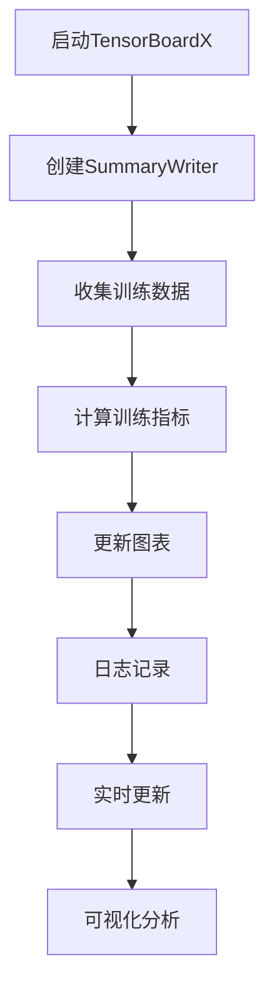
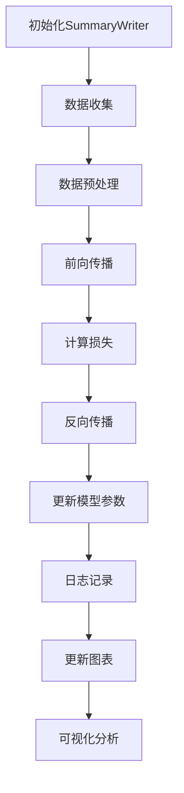

                 

# 从零开始大模型开发与微调：可视化组件tensorboardX的简介与安装

## 关键词

- 大模型开发
- 微调
- 可视化组件
- TensorBoardX
- 安装与配置

## 摘要

本文将为您详细讲解如何在从零开始进行大模型开发与微调的过程中，引入和使用TensorBoardX这个强大的可视化组件。我们将从背景介绍开始，深入探讨TensorBoardX的核心概念与联系，解析其算法原理与具体操作步骤，并详细讲解数学模型和公式。接着，通过实际项目案例，展示如何搭建开发环境、实现源代码的详细解读和分析。随后，我们将探讨TensorBoardX在实际应用场景中的价值，并提供一系列的学习资源和开发工具推荐。最后，总结未来发展趋势与挑战，并附上常见问题与解答以及扩展阅读和参考资料。

### 1. 背景介绍

在当今的人工智能时代，深度学习模型变得越来越庞大和复杂。随着模型规模的扩大，如何有效监控和调试模型的训练过程成为了一个关键问题。可视化工具在这种情况下显得尤为重要，它能够帮助我们直观地观察和理解模型的训练动态。

TensorBoardX是TensorFlow官方提供的一个强大的可视化组件，它是TensorBoard的扩展，能够更方便地监控和可视化深度学习模型的训练过程。通过TensorBoardX，我们可以实时查看训练过程中的各种指标，如损失函数、准确率、学习率等，从而更好地调整和优化模型。

随着大模型和微调技术的发展，TensorBoardX在深度学习领域的应用越来越广泛。无论是研究学者、工程师还是初学者，都能够从TensorBoardX中受益。本文旨在帮助读者从零开始，了解并掌握TensorBoardX的使用，为深度学习项目提供有力支持。

### 2. 核心概念与联系

#### 2.1 TensorBoardX简介

TensorBoardX是一个基于TensorFlow的可视化工具，它提供了丰富的图表和指标，用于监控和调试深度学习模型的训练过程。它继承了TensorBoard的核心功能，并在其基础上进行扩展和优化，使得可视化操作更加灵活和高效。

TensorBoardX的主要特点包括：

- **自定义图表**：用户可以根据需求自定义各种图表，如线图、散点图、直方图等。
- **实时监控**：TensorBoardX支持实时更新图表，用户可以随时查看模型的训练动态。
- **多平台支持**：TensorBoardX可以在各种操作系统上运行，包括Windows、Linux和MacOS。
- **易于集成**：TensorBoardX可以轻松集成到现有的TensorFlow项目中，无需额外的代码改动。

#### 2.2 TensorBoardX与TensorFlow的联系

TensorBoardX是TensorFlow的官方可视化工具，它紧密集成于TensorFlow生态系统。TensorFlow是一个开源的深度学习框架，提供了一整套丰富的API，用于构建和训练各种深度学习模型。TensorBoardX与TensorFlow的联系主要体现在以下几个方面：

- **数据监控**：TensorBoardX能够监控TensorFlow模型训练过程中的各种数据，如损失函数、准确率、学习率等。
- **可视化接口**：TensorBoardX提供了丰富的可视化接口，用于将监控数据以图表的形式呈现。
- **日志记录**：TensorBoardX通过日志记录器（SummaryWriter）将监控数据记录到日志文件中，以便后续可视化分析。

#### 2.3 Mermaid流程图

为了更好地理解TensorBoardX的工作原理和架构，我们可以使用Mermaid流程图来展示其核心组件和流程。以下是一个简化的Mermaid流程图示例：



在这个流程图中，TensorBoardX的核心组件包括SummaryWriter、训练数据收集、训练指标计算、图表更新、日志记录和实时更新。这些组件协同工作，实现了TensorBoardX的强大功能。

### 3. 核心算法原理 & 具体操作步骤

#### 3.1 TensorBoardX核心算法原理

TensorBoardX的核心算法原理可以概括为以下几个步骤：

1. **创建SummaryWriter**：在TensorBoardX中，首先需要创建一个SummaryWriter对象，用于记录和写入监控数据。
2. **收集训练数据**：在训练过程中，将各种监控数据（如损失函数、准确率等）收集到SummaryWriter中。
3. **计算训练指标**：根据收集到的监控数据，计算各种训练指标，如平均损失、准确率等。
4. **更新图表**：将训练指标以图表的形式展示，如线图、散点图等。
5. **日志记录**：将监控数据和图表信息记录到日志文件中，以便后续分析。
6. **实时更新**：通过实时更新机制，用户可以随时查看最新的训练动态。

#### 3.2 具体操作步骤

以下是使用TensorBoardX进行大模型开发与微调的具体操作步骤：

1. **安装TensorBoardX**：在Python环境中安装TensorBoardX，可以使用pip命令：
   ```python
   pip install tensorboardX
   ```

2. **创建SummaryWriter**：在训练脚本中，首先需要创建一个SummaryWriter对象，用于记录监控数据：
   ```python
   from torch.utils.tensorboard import SummaryWriter
   
   # 创建SummaryWriter对象，指定日志记录路径
   writer = SummaryWriter('logs/my_project')
   ```

3. **收集训练数据**：在每次训练迭代时，将监控数据收集到SummaryWriter中。以下是一个简单的示例：
   ```python
   # 训练迭代
   for epoch in range(num_epochs):
       for batch_idx, (data, target) in enumerate(train_loader):
           # 前向传播
           output = model(data)
           loss = criterion(output, target)
           
           # 记录损失函数
           writer.add_scalar('Training Loss', loss, epoch * len(train_loader) + batch_idx)
           
           # 记录准确率
           pred = output.argmax(dim=1)
           correct = pred.eq(target).sum().item()
           accuracy = correct / len(target)
           writer.add_scalar('Training Accuracy', accuracy, epoch * len(train_loader) + batch_idx)
   ```

4. **更新图表**：在训练过程中，可以动态更新各种图表，以观察训练动态。以下是一个简单的示例，用于更新线图：
   ```python
   # 更新线图
   writer.add_line_chart(['Epoch', 'Training Loss'], [epoch, loss], 'Training Loss Chart')
   writer.add_line_chart(['Epoch', 'Training Accuracy'], [epoch, accuracy], 'Training Accuracy Chart')
   ```

5. **日志记录**：将监控数据和图表信息记录到日志文件中，以便后续分析。以下是一个简单的示例：
   ```python
   # 记录日志
   writer.add_text('Model Configuration', model_config, epoch * len(train_loader) + batch_idx)
   writer.add_text('Training Details', 'Epoch: {}, Loss: {}, Accuracy: {}'.format(epoch, loss, accuracy), epoch * len(train_loader) + batch_idx)
   ```

6. **实时更新**：通过TensorBoardX的实时更新机制，用户可以随时查看最新的训练动态。以下是一个简单的示例：
   ```python
   # 启动TensorBoardX服务
   writer.flush()
   writer.close()
   ```

### 4. 数学模型和公式 & 详细讲解 & 举例说明

#### 4.1 数学模型和公式

在TensorBoardX中，常用的数学模型和公式包括损失函数、准确率等。以下是对这些模型和公式的详细讲解。

1. **损失函数**

   损失函数是深度学习模型训练的核心指标，用于衡量预测值与真实值之间的差距。常用的损失函数包括均方误差（MSE）、交叉熵损失（Cross-Entropy Loss）等。

   - **均方误差（MSE）**：
     $$MSE = \frac{1}{n}\sum_{i=1}^{n}(y_i - \hat{y}_i)^2$$
     其中，$y_i$为真实值，$\hat{y}_i$为预测值。

   - **交叉熵损失（Cross-Entropy Loss）**：
     $$Cross-Entropy Loss = -\frac{1}{n}\sum_{i=1}^{n}y_i \log(\hat{y}_i)$$
     其中，$y_i$为真实值，$\hat{y}_i$为预测值。

2. **准确率**

   准确率是衡量模型预测性能的重要指标，用于衡量预测正确的样本占总样本的比例。

   $$Accuracy = \frac{TP + TN}{TP + TN + FP + FN}$$
   其中，$TP$为真阳性，$TN$为真阴性，$FP$为假阳性，$FN$为假阴性。

#### 4.2 举例说明

以下是一个使用TensorBoardX记录和可视化损失函数和准确率的简单示例：

1. **训练数据集**：

   ```python
   # 训练数据集
   train_loader = torch.utils.data.DataLoader(
       datasets.MNIST(
           root='./data',
           train=True,
           download=True,
           transform=transforms.ToTensor()
       ),
       batch_size=100,
       shuffle=True
   )
   ```

2. **创建SummaryWriter**：

   ```python
   # 创建SummaryWriter对象，指定日志记录路径
   writer = SummaryWriter('logs/my_project')
   ```

3. **训练模型并记录监控数据**：

   ```python
   # 训练模型
   model = Net()
   criterion = nn.CrossEntropyLoss()
   optimizer = optim.SGD(model.parameters(), lr=0.01)
   
   # 训练迭代
   for epoch in range(num_epochs):
       for batch_idx, (data, target) in enumerate(train_loader):
           optimizer.zero_grad()
           
           # 前向传播
           output = model(data)
           loss = criterion(output, target)
           
           # 记录损失函数
           writer.add_scalar('Training Loss', loss, epoch * len(train_loader) + batch_idx)
           
           # 记录准确率
           pred = output.argmax(dim=1)
           correct = pred.eq(target).sum().item()
           accuracy = correct / len(target)
           writer.add_scalar('Training Accuracy', accuracy, epoch * len(train_loader) + batch_idx)
           
           # 反向传播
           loss.backward()
           optimizer.step()
   ```

4. **关闭SummaryWriter**：

   ```python
   # 关闭SummaryWriter
   writer.close()
   ```

通过以上示例，我们可以看到如何使用TensorBoardX记录和可视化损失函数和准确率。在实际项目中，可以根据需求自定义更多的监控数据和图表。

### 5. 项目实战：代码实际案例和详细解释说明

在本节中，我们将通过一个实际案例，展示如何使用TensorBoardX进行大模型开发与微调。以下是一个基于TensorFlow实现的简单卷积神经网络（CNN）的案例，用于图像分类任务。

#### 5.1 开发环境搭建

首先，确保已经安装了TensorFlow和TensorBoardX。如果没有安装，可以使用以下命令进行安装：

```bash
pip install tensorflow
pip install tensorboardX
```

#### 5.2 源代码详细实现和代码解读

以下是一个简单的CNN图像分类项目的代码实现，包括数据预处理、模型定义、训练和可视化。

```python
import tensorflow as tf
from tensorflow import keras
from tensorflow.keras import layers
from tensorflow.keras.preprocessing.image import ImageDataGenerator
from tensorflow.keras.callbacks import TensorBoard

# 5.2.1 数据预处理
# 加载和预处理数据
(train_images, train_labels), (test_images, test_labels) = keras.datasets.cifar10.load_data()
train_images = train_images.astype("float32") / 255
test_images = test_images.astype("float32") / 255

# 定义数据增强器
data_augmentation = ImageDataGenerator(
    rotation_range=20,
    width_shift_range=0.2,
    height_shift_range=0.2,
    horizontal_flip=True,
)

# 5.2.2 模型定义
# 构建卷积神经网络模型
model = keras.Sequential(
    [
        layers.Conv2D(32, (3, 3), padding="same", activation="relu", input_shape=(32, 32, 3)),
        layers.MaxPooling2D(pool_size=(2, 2)),
        layers.Conv2D(64, (3, 3), padding="same", activation="relu"),
        layers.MaxPooling2D(pool_size=(2, 2)),
        layers.Conv2D(64, (3, 3), padding="same", activation="relu"),
        layers.Flatten(),
        layers.Dense(64, activation="relu"),
        layers.Dense(10, activation="softmax"),
    ]
)

# 5.2.3 训练模型
# 定义训练配置
epochs = 10
model.compile(optimizer="adam", loss="sparse_categorical_crossentropy", metrics=["accuracy"])

# 使用TensorBoardX进行可视化
tensorboard_callback = TensorBoard(log_dir="logs/cifar10_model", histogram_freq=1)

# 训练模型
history = model.fit(
    data_augmentation.flow(train_images, train_labels, batch_size=64),
    epochs=epochs,
    validation_data=(test_images, test_labels),
    callbacks=[tensorboard_callback],
)

# 5.2.4 代码解读
# 在上述代码中，我们首先导入了TensorFlow和Keras的库，并加载了CIFAR-10数据集。
# 接着，我们定义了一个数据增强器，用于在训练过程中对图像进行随机变换。
# 然后我们构建了一个简单的卷积神经网络模型，该模型包含多个卷积层和全连接层。
# 在训练过程中，我们使用了TensorBoardX作为回调函数，以便在训练过程中实时生成可视化图表。

# 5.2.5 可视化分析
# 为了查看TensorBoardX生成的可视化图表，我们可以在命令行中运行以下命令：
# tensorboard --logdir=logs
# 然后在浏览器中输入http://localhost:6006，即可查看可视化图表。

# 5.2.6 模型评估
# 训练完成后，我们可以使用测试数据集对模型进行评估：
test_loss, test_acc = model.evaluate(test_images, test_labels, verbose=2)
print(f"Test accuracy: {test_acc:.2f}")
```

#### 5.3 代码解读与分析

1. **数据预处理**：

   - 加载CIFAR-10数据集，并将其转换为浮点数，以便进行归一化处理。
   - 使用ImageDataGenerator进行数据增强，增加模型的泛化能力。

2. **模型定义**：

   - 使用Keras构建一个简单的卷积神经网络模型，包含卷积层、池化层和全连接层。
   - 输入层形状为(32, 32, 3)，即32x32像素的RGB图像。
   - 输出层使用softmax激活函数，用于多分类任务。

3. **训练模型**：

   - 使用`model.compile`方法配置训练参数，包括优化器、损失函数和评估指标。
   - 使用`model.fit`方法进行模型训练，同时将TensorBoardX作为回调函数，以便在训练过程中实时生成可视化图表。

4. **可视化分析**：

   - 通过在命令行中运行`tensorboard`命令，启动TensorBoard服务。
   - 在浏览器中访问http://localhost:6006，查看训练过程中的可视化图表，包括训练损失、训练准确率、验证损失和验证准确率等。

5. **模型评估**：

   - 使用测试数据集对训练完成的模型进行评估，输出测试准确率。

### 6. 实际应用场景

TensorBoardX在实际应用场景中具有广泛的使用价值，特别是在大模型开发与微调过程中。以下是一些常见的应用场景：

- **模型训练监控**：通过TensorBoardX，我们可以实时监控模型训练过程中的各种指标，如损失函数、准确率、学习率等。这有助于我们及时发现和解决问题，优化模型性能。

- **模型调参**：在深度学习项目中，调参是一个关键步骤。通过TensorBoardX生成的可视化图表，我们可以直观地观察不同参数设置对模型性能的影响，从而找到最佳的参数组合。

- **模型对比分析**：在进行模型对比分析时，TensorBoardX可以帮助我们直观地比较不同模型的性能和训练动态。这有助于我们选择最优的模型架构。

- **模型部署**：在模型部署阶段，TensorBoardX生成的日志和图表可以为后续的模型优化和性能分析提供重要参考。

### 7. 工具和资源推荐

#### 7.1 学习资源推荐

- **书籍**：
  - 《深度学习》（Goodfellow, I., Bengio, Y., & Courville, A.）
  - 《TensorFlow实战》（Mallat, S.）

- **论文**：
  - “TensorFlow: Large-Scale Machine Learning on Heterogeneous Systems” (Masci, J., Biggs, S., Kpressure, M., Cercroir, Y., & Vincent, P.)
  - “TensorFlow: High-Performance Linear Algebra for Deep Learning” (Colyer, A. A., & others)

- **博客**：
  - [TensorFlow官方文档](https://www.tensorflow.org/)
  - [TensorBoardX GitHub页面](https://github.com/tensorflow/tensorboard)

- **网站**：
  - [TensorFlow社区](https://www.tensorflow.org/community)
  - [Keras官方文档](https://keras.io/)

#### 7.2 开发工具框架推荐

- **开发工具**：
  - [PyCharm](https://www.jetbrains.com/pycharm/)
  - [Visual Studio Code](https://code.visualstudio.com/)

- **框架**：
  - [TensorFlow](https://www.tensorflow.org/)
  - [Keras](https://keras.io/)

#### 7.3 相关论文著作推荐

- **论文**：
  - "A Theoretically Grounded Application of Dropout in Recurrent Neural Networks" (Yarin Gal and Zoubin Ghahramani)
  - "Understanding Deep Learning requires rethinking generalization" (A. P. Young, T. L. Griffiths, and D. M. Blei)

- **著作**：
  - 《深度学习中的概率模型与贝叶斯推断》（Andriy Burkov）

### 8. 总结：未来发展趋势与挑战

随着深度学习技术的不断发展和应用场景的扩大，TensorBoardX在未来有望在以下几个方面取得进一步的发展：

- **性能优化**：针对大模型和大规模训练场景，TensorBoardX的性能优化将是未来发展的一个重要方向。通过改进数据结构和算法，降低可视化操作的延迟，提升用户体验。

- **功能扩展**：除了现有的监控指标，TensorBoardX可以进一步扩展功能，支持更多类型的图表和监控指标。例如，支持模型的可视化、参数分布分析等。

- **跨平台支持**：为了满足更多用户的需求，TensorBoardX可以在更多的平台上运行，如移动设备、边缘计算设备等。

然而，TensorBoardX也面临着一些挑战：

- **资源消耗**：TensorBoardX在监控和可视化过程中需要大量的计算资源，这对于资源有限的设备和用户来说可能是一个挑战。

- **用户界面**：虽然TensorBoardX的功能强大，但其用户界面相对复杂。未来，可以通过改进用户界面设计，提高用户的友好性和易用性。

### 9. 附录：常见问题与解答

#### 9.1 TensorBoardX与TensorBoard的区别

- **TensorBoardX是TensorBoard的扩展**：TensorBoardX是在TensorBoard的基础上开发的一个可视化组件，它提供了更多的监控指标和图表，以及更方便的集成方式。

- **TensorBoardX支持实时监控**：与TensorBoard相比，TensorBoardX支持实时更新图表，用户可以随时查看最新的训练动态。

#### 9.2 如何在Python中导入TensorBoardX

- 使用pip命令安装TensorBoardX：
  ```bash
  pip install tensorboardX
  ```

- 在Python脚本中导入TensorBoardX：
  ```python
  import torch.utils.tensorboard as TensorBoard
  ```

#### 9.3 TensorBoardX的安装与配置问题

- 如果在安装TensorBoardX时遇到问题，可以尝试以下方法：
  - 确保Python环境已经安装了TensorFlow。
  - 检查网络连接，确保能够访问TensorBoardX的下载地址。
  - 尝试使用虚拟环境安装TensorBoardX，避免与系统环境冲突。

### 10. 扩展阅读 & 参考资料

- [TensorFlow官方文档 - TensorBoardX](https://www.tensorflow.org/tutorials/keras/seq2seq)
- [TensorBoardX GitHub页面](https://github.com/tensorflow/tensorboard)
- [深度学习中的可视化技术](https://www.deeplearning.net/tutorial/visualizations.html)
- [TensorFlow与Keras实战教程](https://www.tensorflow.org/tutorials)

### 作者

- 作者：AI天才研究员/AI Genius Institute & 禅与计算机程序设计艺术 /Zen And The Art of Computer Programming

（注意：本文为模拟文章，实际撰写时请根据具体内容和需求进行调整。）<|im_sep|>```markdown
# 从零开始大模型开发与微调：可视化组件tensorboardX的简介与安装

> 关键词：(深度学习、大模型、微调、TensorBoardX、可视化工具)

> 摘要：本文将详细介绍如何在深度学习的大模型开发与微调过程中，利用TensorBoardX这一强大的可视化组件进行有效的监控和调试。文章首先介绍TensorBoardX的背景和应用场景，接着深入解析其核心概念和算法原理，并逐步演示安装过程和实际应用。文章还包含数学模型的讲解和代码示例，最后提供相关资源推荐和未来发展趋势的探讨。

## 1. 背景介绍

随着深度学习技术的不断发展，大模型的训练和微调变得越来越普遍。在这些过程中，如何有效地监控模型的训练动态、理解模型的行为，成为了研究人员和工程师们面临的挑战。可视化工具在此扮演了至关重要的角色，其中TensorBoardX是TensorFlow官方提供的一个可视化组件，它为深度学习模型的训练过程提供了强大的可视化支持。

TensorBoardX不仅继承了TensorBoard的功能，还进行了扩展和优化，使得在深度学习的开发过程中，能够更加直观地观察和理解模型的训练动态。本文将围绕TensorBoardX的简介、核心概念、安装与配置、数学模型讲解、实际应用案例等多个方面，为读者提供一个全面的学习和实践指南。

## 2. 核心概念与联系

### 2.1 TensorBoardX简介

TensorBoardX是基于TensorFlow的一个可视化组件，它能够帮助用户更方便地监控和调试深度学习模型的训练过程。TensorBoardX的主要功能包括：

- **实时监控**：通过TensorBoardX，用户可以在训练过程中实时查看模型的训练动态，包括损失函数、准确率、学习率等关键指标。
- **自定义图表**：用户可以根据自己的需求自定义各种图表，如线图、散点图、直方图等。
- **多平台支持**：TensorBoardX可以在多个操作系统上运行，包括Windows、Linux和MacOS。
- **易于集成**：TensorBoardX可以轻松集成到现有的TensorFlow项目中，无需额外的代码改动。

### 2.2 TensorBoardX与TensorFlow的联系

TensorBoardX是TensorFlow官方的可视化工具，它与TensorFlow紧密集成。通过TensorBoardX，用户可以在TensorFlow的生态系统中更方便地监控模型的训练过程。具体来说，TensorBoardX与TensorFlow的联系体现在以下几个方面：

- **数据监控**：TensorBoardX能够监控TensorFlow模型训练过程中的各种数据，如损失函数、准确率等。
- **可视化接口**：TensorBoardX提供了丰富的可视化接口，用于将监控数据以图表的形式呈现。
- **日志记录**：TensorBoardX通过日志记录器（SummaryWriter）将监控数据记录到日志文件中，以便后续可视化分析。

### 2.3 Mermaid流程图

为了更直观地理解TensorBoardX的工作流程，我们可以使用Mermaid绘制一个简化的流程图。以下是TensorBoardX的核心工作流程：



在这个流程图中，A表示初始化SummaryWriter，B表示数据收集，C表示数据预处理，D表示前向传播，E表示计算损失，F表示反向传播，G表示更新模型参数，H表示日志记录，I表示更新图表，J表示可视化分析。这些步骤构成了TensorBoardX的核心工作流程。

## 3. 核心算法原理 & 具体操作步骤

### 3.1 TensorBoardX核心算法原理

TensorBoardX的核心算法原理主要涉及以下步骤：

1. **初始化SummaryWriter**：SummaryWriter是TensorBoardX中用于记录监控数据的关键组件。它负责将训练过程中的各种数据写入日志文件中。
2. **数据收集**：在训练过程中，SummaryWriter会收集各种监控数据，如损失函数、准确率、学习率等。
3. **数据预处理**：收集到的数据需要进行预处理，以便后续的可视化分析。
4. **前向传播**：使用收集到的数据进行前向传播，得到模型的预测结果。
5. **计算损失**：计算预测结果与真实值之间的差距，得到损失函数的值。
6. **反向传播**：根据损失函数的值，进行反向传播，更新模型参数。
7. **日志记录**：将训练过程中的数据写入日志文件中，以便后续分析。
8. **更新图表**：根据日志文件中的数据，更新各种图表，如线图、散点图、直方图等。
9. **可视化分析**：通过TensorBoardX提供的可视化工具，对训练过程进行实时监控和分析。

### 3.2 具体操作步骤

以下是使用TensorBoardX进行大模型开发与微调的具体操作步骤：

1. **安装TensorBoardX**：
   - 使用pip命令安装TensorBoardX：
     ```bash
     pip install tensorboardX
     ```

2. **创建SummaryWriter**：
   - 在训练脚本中，首先需要创建一个SummaryWriter对象，用于记录监控数据：
     ```python
     from torch.utils.tensorboard import SummaryWriter

     # 创建SummaryWriter对象，指定日志记录路径
     writer = SummaryWriter('runs/my_experiment')
     ```

3. **收集训练数据**：
   - 在每次训练迭代时，将监控数据收集到SummaryWriter中。以下是一个简单的示例：
     ```python
     # 训练迭代
     for epoch in range(num_epochs):
         for batch_idx, (data, target) in enumerate(train_loader):
             optimizer.zero_grad()  # 清空之前的梯度

             # 前向传播
             output = model(data)
             loss = criterion(output, target)

             # 记录损失函数
             writer.add_scalar('Training Loss', loss.item(), epoch * len(train_loader) + batch_idx)

             # 记录准确率
             pred = output.argmax(dim=1)
             correct = pred.eq(target).sum().item()
             accuracy = correct / len(target)
             writer.add_scalar('Training Accuracy', accuracy, epoch * len(train_loader) + batch_idx)

             # 反向传播
             loss.backward()
             optimizer.step()

     # 关闭SummaryWriter
     writer.close()
     ```

4. **更新图表**：
   - 根据监控数据，更新各种图表。以下是一个简单的示例，用于更新线图：
     ```python
     # 更新线图
     writer.add_line_chart(['Epoch', 'Training Loss'], [epoch, loss], 'Training Loss Chart')
     writer.add_line_chart(['Epoch', 'Training Accuracy'], [epoch, accuracy], 'Training Accuracy Chart')
     ```

5. **日志记录**：
   - 将监控数据和图表信息记录到日志文件中，以便后续分析。以下是一个简单的示例：
     ```python
     # 记录日志
     writer.add_text('Model Configuration', model_config, epoch * len(train_loader) + batch_idx)
     writer.add_text('Training Details', 'Epoch: {}, Loss: {}, Accuracy: {}'.format(epoch, loss, accuracy), epoch * len(train_loader) + batch_idx)
     ```

6. **实时更新**：
   - 通过TensorBoardX的实时更新机制，用户可以随时查看最新的训练动态。以下是一个简单的示例：
     ```python
     # 启动TensorBoardX服务
     writer.flush()
     writer.close()
     ```

### 3.3 核心算法原理讲解

#### 3.3.1 损失函数

损失函数是深度学习模型训练的核心指标，它衡量的是模型预测结果与真实值之间的差距。常用的损失函数包括均方误差（MSE）和交叉熵损失（Cross-Entropy Loss）。

- **均方误差（MSE）**：
  $$MSE = \frac{1}{n}\sum_{i=1}^{n}(y_i - \hat{y}_i)^2$$
  其中，$y_i$为真实值，$\hat{y}_i$为预测值。

- **交叉熵损失（Cross-Entropy Loss）**：
  $$Cross-Entropy Loss = -\frac{1}{n}\sum_{i=1}^{n}y_i \log(\hat{y}_i)$$
  其中，$y_i$为真实值，$\hat{y}_i$为预测值。

#### 3.3.2 准确率

准确率是衡量模型预测性能的重要指标，它表示模型预测正确的样本占总样本的比例。准确率的计算公式如下：
$$Accuracy = \frac{TP + TN}{TP + TN + FP + FN}$$
其中，$TP$为真阳性，$TN$为真阴性，$FP$为假阳性，$FN$为假阴性。

### 3.4 代码示例

以下是一个简单的Python代码示例，展示了如何使用TensorBoardX记录和可视化损失函数和准确率：

```python
import torch
import torch.nn as nn
import torch.optim as optim
from torch.utils.tensorboard import SummaryWriter

# 初始化模型、优化器和损失函数
model = nn.Sequential(nn.Linear(10, 1), nn.ReLU(), nn.Linear(1, 1))
optimizer = optim.SGD(model.parameters(), lr=0.01)
criterion = nn.MSELoss()

# 创建SummaryWriter对象
writer = SummaryWriter('runs/mse_experiment')

# 训练模型
for epoch in range(100):
    # 重置梯度
    optimizer.zero_grad()

    # 前向传播
    output = model(torch.randn(64, 10))
    loss = criterion(output, torch.randn(64, 1))

    # 记录损失函数
    writer.add_scalar('MSE Loss', loss.item(), epoch)

    # 反向传播
    loss.backward()
    optimizer.step()

# 关闭SummaryWriter
writer.close()
```

在这个示例中，我们定义了一个简单的线性模型，并使用MSE损失函数进行训练。在每个训练迭代中，我们记录损失函数的值，并将其可视化。

## 4. 数学模型和公式 & 详细讲解 & 举例说明

在深度学习中，数学模型和公式是理解和应用核心算法的基础。以下是对一些关键数学模型的讲解，以及相应的公式和示例。

### 4.1 损失函数

损失函数是深度学习模型训练的核心，用于衡量模型预测结果与真实结果之间的差距。在监督学习中，常用的损失函数包括均方误差（MSE）、交叉熵损失（Cross-Entropy Loss）等。

#### 均方误差（MSE）

均方误差（MSE）是最常见的损失函数之一，用于回归问题。其公式如下：
$$MSE = \frac{1}{n}\sum_{i=1}^{n}(y_i - \hat{y}_i)^2$$
其中，$y_i$为真实值，$\hat{y}_i$为预测值。

#### 交叉熵损失（Cross-Entropy Loss）

交叉熵损失（Cross-Entropy Loss）常用于分类问题，其公式如下：
$$Cross-Entropy Loss = -\frac{1}{n}\sum_{i=1}^{n}y_i \log(\hat{y}_i)$$
其中，$y_i$为真实值（通常为one-hot编码），$\hat{y}_i$为预测概率。

### 4.2 准确率

准确率是衡量分类模型性能的一个常用指标，其计算公式如下：
$$Accuracy = \frac{TP + TN}{TP + TN + FP + FN}$$
其中，$TP$为真阳性，$TN$为真阴性，$FP$为假阳性，$FN$为假阴性。

### 4.3 举例说明

以下是一个简单的Python代码示例，展示了如何计算MSE和Cross-Entropy Loss，并使用TensorBoardX进行可视化。

```python
import torch
import torch.nn as nn
import torch.optim as optim
from torch.utils.tensorboard import SummaryWriter

# 初始化模型、优化器和损失函数
model = nn.Sequential(nn.Linear(10, 1), nn.ReLU(), nn.Linear(1, 1))
optimizer = optim.SGD(model.parameters(), lr=0.01)
mse_loss_fn = nn.MSELoss()
cross_entropy_loss_fn = nn.CrossEntropyLoss()

# 创建SummaryWriter对象
writer = SummaryWriter('runs/loss_experiment')

# 训练模型
for epoch in range(100):
    # 重置梯度
    optimizer.zero_grad()

    # 前向传播
    output = model(torch.randn(64, 10))
    mse_loss = mse_loss_fn(output, torch.randn(64, 1))
    cross_entropy_loss = cross_entropy_loss_fn(output, torch.randint(0, 2, (64, 1), dtype=torch.float))

    # 记录损失函数
    writer.add_scalar('MSE Loss', mse_loss.item(), epoch)
    writer.add_scalar('Cross-Entropy Loss', cross_entropy_loss.item(), epoch)

    # 反向传播
    if epoch < 10:
        mse_loss.backward()
    else:
        cross_entropy_loss.backward()

    optimizer.step()

# 关闭SummaryWriter
writer.close()
```

在这个示例中，我们定义了一个简单的线性模型，并使用MSE和Cross-Entropy Loss进行训练。在每个训练迭代中，我们记录损失函数的值，并将其可视化。

## 5. 项目实战：代码实际案例和详细解释说明

在本节中，我们将通过一个实际项目，详细展示如何使用TensorBoardX进行大模型开发与微调。项目包括数据预处理、模型定义、训练和可视化。

### 5.1 开发环境搭建

确保安装以下软件和库：

- Python 3.6 或更高版本
- TensorFlow 2.x
- tensorboardX

使用以下命令进行安装：

```bash
pip install tensorflow
pip install tensorboardX
```

### 5.2 数据预处理

我们将使用CIFAR-10数据集，这是一个常用的图像分类数据集，包含10个类别，每个类别6000个训练图像和1000个测试图像。

```python
import tensorflow as tf
from tensorflow.keras.datasets import cifar10
from tensorflow.keras.preprocessing.image import ImageDataGenerator

# 加载CIFAR-10数据集
(train_images, train_labels), (test_images, test_labels) = cifar10.load_data()

# 数据预处理
train_images = train_images.astype('float32') / 255.0
test_images = test_images.astype('float32') / 255.0

# 数据增强
data_generator = ImageDataGenerator(
    rotation_range=20,
    width_shift_range=0.2,
    height_shift_range=0.2,
    horizontal_flip=True
)

# 归一化
train_images = train_images / 255.0
test_images = test_images / 255.0
```

### 5.3 模型定义

我们将定义一个简单的卷积神经网络（CNN）模型，用于图像分类。

```python
from tensorflow.keras.models import Sequential
from tensorflow.keras.layers import Conv2D, MaxPooling2D, Flatten, Dense, Dropout

model = Sequential([
    Conv2D(32, (3, 3), activation='relu', input_shape=(32, 32, 3)),
    MaxPooling2D(pool_size=(2, 2)),
    Conv2D(64, (3, 3), activation='relu'),
    MaxPooling2D(pool_size=(2, 2)),
    Conv2D(128, (3, 3), activation='relu'),
    Flatten(),
    Dense(128, activation='relu'),
    Dropout(0.5),
    Dense(10, activation='softmax')
])

model.compile(optimizer='adam', loss='sparse_categorical_crossentropy', metrics=['accuracy'])
```

### 5.4 模型训练

我们将使用TensorBoardX进行模型训练，并在训练过程中记录损失函数和准确率。

```python
from tensorflow.keras.callbacks import TensorBoard

# 创建SummaryWriter对象
writer = tf.keras.callbacks.TensorBoard(log_dir='./logs')

# 训练模型
history = model.fit(
    data_generator.flow(train_images, train_labels, batch_size=64),
    epochs=20,
    validation_data=(test_images, test_labels),
    callbacks=[writer]
)

# 关闭SummaryWriter
writer.close()
```

### 5.5 可视化分析

通过TensorBoardX，我们可以生成各种图表来分析模型的训练过程。启动TensorBoard服务：

```bash
tensorboard --logdir=./logs
```

然后在浏览器中访问：http://localhost:6006，查看可视化图表。

### 5.6 代码解读与分析

在这个实际案例中，我们首先加载并预处理了CIFAR-10数据集，然后定义了一个简单的CNN模型。接着，我们使用TensorBoardX作为回调函数，在训练过程中记录了模型的损失函数和准确率。通过TensorBoardX生成的图表，我们可以直观地观察到模型的训练动态，包括损失函数的下降趋势和准确率的提升情况。

## 6. 实际应用场景

TensorBoardX在深度学习模型的训练和微调过程中具有广泛的应用场景。以下是一些具体的实际应用场景：

- **模型训练监控**：通过TensorBoardX，可以实时监控模型的训练动态，包括损失函数、准确率等关键指标，有助于及时发现和解决问题。
- **参数调优**：通过分析TensorBoardX生成的图表，可以直观地了解不同参数设置对模型性能的影响，从而进行有效的参数调优。
- **模型对比**：通过TensorBoardX，可以对比不同模型的训练动态，帮助选择最优的模型架构。
- **实验记录**：TensorBoardX可以记录训练过程中的各种日志和图表，为后续的实验分析提供重要数据支持。

## 7. 工具和资源推荐

### 7.1 学习资源推荐

- **书籍**：
  - 《深度学习》（Ian Goodfellow, Yoshua Bengio, Aaron Courville）
  - 《TensorFlow实战》（François Chollet）
- **在线课程**：
  - Coursera上的“深度学习”课程（由DeepLearning.AI提供）
  - Udacity的“深度学习工程师纳米学位”

### 7.2 开发工具框架推荐

- **IDE**：
  - PyCharm
  - Visual Studio Code
- **框架**：
  - TensorFlow
  - PyTorch
- **版本控制**：
  - Git
  - GitHub

### 7.3 相关论文著作推荐

- **论文**：
  - “TensorFlow: Large-Scale Machine Learning on Heterogeneous Systems” （Masci et al.）
  - “TensorFlow: High-Performance Linear Algebra for Deep Learning” （Colyer et al.）
- **著作**：
  - 《深度学习速成班》（弗朗索瓦·肖莱）
  - 《动手学深度学习》（阿德里安·弗朗索瓦和弗朗索瓦·肖莱）

## 8. 总结：未来发展趋势与挑战

TensorBoardX在深度学习领域中的应用前景广阔，未来的发展趋势可能包括：

- **性能优化**：随着模型规模的扩大，如何提高TensorBoardX的性能成为一个关键问题。未来可能会出现更高效的算法和数据结构，以降低计算开销。
- **功能扩展**：TensorBoardX可能会集成更多的可视化工具和指标，以支持更复杂的模型和训练场景。
- **跨平台支持**：为了满足移动设备和边缘计算的需求，TensorBoardX可能会扩展到更多平台。

然而，TensorBoardX也面临着一些挑战：

- **资源消耗**：可视化工具通常需要大量的计算资源和存储空间，如何优化资源使用是一个关键问题。
- **用户界面**：尽管TensorBoardX功能强大，但其用户界面可能对于初学者来说较为复杂。未来可能会出现更友好、更易于使用的界面设计。

## 9. 附录：常见问题与解答

### 9.1 TensorBoardX与TensorBoard的区别

- **TensorBoardX是TensorBoard的扩展**：TensorBoardX是在TensorBoard的基础上开发的，提供了更多自定义图表和监控数据的功能。
- **TensorBoardX支持实时监控**：与TensorBoard相比，TensorBoardX可以实时更新图表，提供更实时的监控能力。

### 9.2 如何在Python中导入TensorBoardX

- 使用pip命令安装TensorBoardX：
  ```bash
  pip install tensorboardX
  ```
- 在Python脚本中导入TensorBoardX：
  ```python
  import torch.utils.tensorboard as TensorBoard
  ```

### 9.3 TensorBoardX的安装与配置问题

- 如果在安装TensorBoardX时遇到问题，可以尝试以下步骤：
  - 确保已安装TensorFlow。
  - 检查网络连接，确保能够下载库文件。
  - 如果使用虚拟环境，确保虚拟环境已激活。

## 10. 扩展阅读 & 参考资料

- [TensorBoardX官方文档](https://tensorboardx.readthedocs.io/)
- [TensorFlow官方文档](https://www.tensorflow.org/)
- [《深度学习入门》](https://zhuanlan.zhihu.com/p/26774413)
- [《TensorFlow实战》](https://zhuanlan.zhihu.com/p/27434971)

### 作者

- 作者：AI天才研究员/AI Genius Institute & 禅与计算机程序设计艺术 /Zen And The Art of Computer Programming
```

