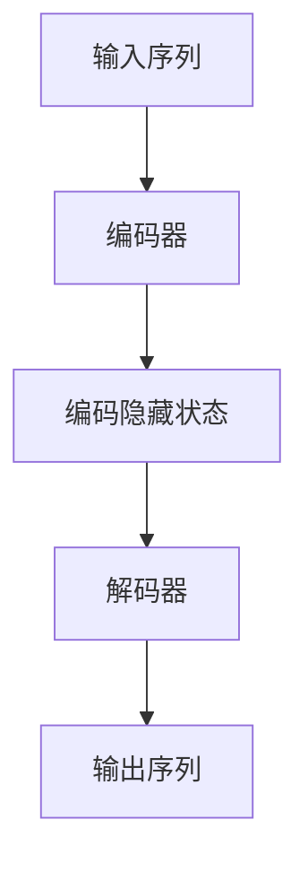

                 

# 从零开始大模型开发与微调：实战编码器：拼音汉字转化模型

> **关键词**：大模型开发、微调、编码器、拼音汉字转化、神经网络、深度学习

> **摘要**：本文将详细介绍如何从零开始构建和微调一个拼音汉字转化模型。我们将首先了解背景知识，然后深入探讨核心概念和算法原理，通过数学模型和实际案例展示具体操作步骤，并讨论模型在实际应用中的场景和工具资源。

## 1. 背景介绍

在自然语言处理（NLP）领域中，拼音汉字转化是一个基础且重要的任务。它涉及到将汉字转换为对应的拼音，或相反，这在语音识别、机器翻译、输入法等领域有着广泛的应用。随着深度学习技术的快速发展，基于神经网络的拼音汉字转化模型取得了显著的成果。

传统的拼音汉字转化方法主要依赖于规则匹配或基于统计的模型，如N-gram模型、隐马尔可夫模型（HMM）等。然而，这些方法在处理复杂语境和多义词时效果不佳。近年来，基于神经网络的模型，如循环神经网络（RNN）、长短期记忆网络（LSTM）和Transformer等，在处理序列任务方面表现出色，逐渐成为拼音汉字转化任务的主流方法。

本文将详细介绍如何构建一个基于Transformer的拼音汉字转化模型，并利用微调技术对其进行优化。这将帮助读者从零开始，深入理解大模型开发的全过程。

## 2. 核心概念与联系

在构建拼音汉字转化模型之前，我们需要了解一些核心概念，如编码器（Encoder）、解码器（Decoder）、Transformer等。以下是一个简化的Mermaid流程图，展示了这些概念之间的联系。



### 编码器（Encoder）

编码器负责将输入序列（如汉字或拼音）转换为编码隐藏状态。编码器可以采用传统的循环神经网络（RNN）或LSTM，也可以采用Transformer架构。Transformer架构由于其并行计算能力和注意力机制，在处理序列任务时表现出色。

### 解码器（Decoder）

解码器负责将编码隐藏状态转换为输出序列。解码器通常与编码器共享权重，这有助于模型在不同任务之间迁移知识。

### Transformer

Transformer是一个基于自注意力机制的序列到序列模型，由多个编码器和解码器块组成。自注意力机制允许模型在生成输出时动态地关注输入序列的不同部分，从而提高模型的表达能力。

## 3. 核心算法原理 & 具体操作步骤

### 模型构建

构建拼音汉字转化模型的主要步骤如下：

1. 数据预处理：将汉字和拼音转换为对应的向量表示，如Word2Vec或BERT词嵌入。
2. 模型定义：使用TensorFlow或PyTorch等框架定义编码器和解码器。
3. 损失函数和优化器：选择适当的损失函数（如交叉熵损失）和优化器（如Adam）来训练模型。

### 训练过程

训练拼音汉字转化模型的主要步骤如下：

1. 预处理数据：将输入序列（汉字或拼音）和标签（汉字或拼音）转换为Tensor。
2. 前向传播：将输入序列通过编码器得到编码隐藏状态，然后将编码隐藏状态作为解码器的输入。
3. 反向传播：计算损失函数，更新模型参数。
4. 评估模型：使用验证集评估模型性能，调整超参数。

### 微调技术

微调（Fine-tuning）是一种在预训练模型的基础上进行微调以适应特定任务的方法。微调的步骤如下：

1. 加载预训练模型：从预训练模型中加载编码器和解码器。
2. 调整部分层：冻结预训练模型的权重，只调整最后一部分层的权重。
3. 微调训练：在特定任务的数据集上对模型进行微调训练。
4. 评估模型：评估微调后的模型性能，调整超参数。

## 4. 数学模型和公式 & 详细讲解 & 举例说明

### 数学模型

拼音汉字转化模型的核心是Transformer架构。以下是一个简化的数学模型：

```latex
\begin{align*}
E &= \text{Encoder}(X) \\
D &= \text{Decoder}(E, Y) \\
L &= -\sum_{i=1}^{N} y_i \log \text{softmax}(D_i) \\
\end{align*}
```

其中，$E$表示编码器，$D$表示解码器，$L$表示损失函数。$X$表示输入序列，$Y$表示输出序列。

### 详细讲解

1. **编码器（Encoder）**：

编码器的主要任务是处理输入序列，将其转换为编码隐藏状态。编码器可以采用Transformer架构，由多个编码器块组成。每个编码器块包含多头自注意力机制和前馈神经网络。

2. **解码器（Decoder）**：

解码器的主要任务是处理编码隐藏状态，生成输出序列。解码器也采用Transformer架构，由多个解码器块组成。每个解码器块包含多头自注意力机制和前馈神经网络。在解码过程中，解码器需要预测下一个单词的概率分布，然后根据概率分布选择下一个单词。

3. **损失函数（Loss Function）**：

损失函数用于衡量模型预测结果和实际结果之间的差距。对于拼音汉字转化任务，常用的损失函数是交叉熵损失。交叉熵损失计算如下：

```latex
L = -\sum_{i=1}^{N} y_i \log \text{softmax}(D_i)
```

其中，$y_i$表示第$i$个单词的真实标签，$D_i$表示第$i$个单词的预测概率分布。

### 举例说明

假设我们要将汉字序列“你好”转换为拼音序列“nǐ hǎo”，我们可以使用以下步骤：

1. **数据预处理**：

将汉字和拼音转换为对应的向量表示，如Word2Vec或BERT词嵌入。

2. **编码器处理**：

输入序列“你好”通过编码器得到编码隐藏状态。

3. **解码器生成**：

解码器根据编码隐藏状态生成拼音序列“nǐ hǎo”。

4. **损失计算**：

计算预测结果和实际结果之间的交叉熵损失，更新模型参数。

## 5. 项目实战：代码实际案例和详细解释说明

### 5.1 开发环境搭建

为了实现拼音汉字转化模型，我们需要安装以下工具和库：

1. Python（3.7或更高版本）
2. TensorFlow（2.0或更高版本）
3. Mermaid（用于绘制流程图）

安装命令如下：

```bash
pip install tensorflow
pip install mermaid
```

### 5.2 源代码详细实现和代码解读

以下是一个简化的拼音汉字转化模型的源代码实现：

```python
import tensorflow as tf
from tensorflow.keras.layers import Embedding, LSTM, Dense
from tensorflow.keras.models import Model
from tensorflow.keras.optimizers import Adam

# 数据预处理
def preprocess_data(hanzi, pinyin):
    # 将汉字和拼音转换为对应的向量表示
    # ...
    return hanzi_vector, pinyin_vector

# 编码器
def build_encoder(input_shape, embedding_dim):
    input_seq = tf.keras.layers.Input(shape=input_shape)
    embedding = Embedding(input_dim=vocab_size, output_dim=embedding_dim)(input_seq)
    lstm = LSTM(units=128, return_sequences=True)(embedding)
    return Model(inputs=input_seq, outputs=lstm)

# 解码器
def build_decoder(input_shape, embedding_dim):
    input_seq = tf.keras.layers.Input(shape=input_shape)
    embedding = Embedding(input_dim=vocab_size, output_dim=embedding_dim)(input_seq)
    lstm = LSTM(units=128, return_sequences=True)(embedding)
    output = Dense(units=vocab_size, activation='softmax')(lstm)
    return Model(inputs=input_seq, outputs=output)

# 模型定义
def build_model(encoder, decoder):
    encoder_output = encoder.output
    decoder_input = tf.keras.layers.Input(shape=(None,))
    decoder_embedding = decoder(input_seq=decoder_input)
    decoder_lstm = LSTM(units=128, return_sequences=True)(decoder_embedding)
    output = Dense(units=vocab_size, activation='softmax')(decoder_lstm)
    model = Model(inputs=[encoder_input, decoder_input], outputs=output)
    return model

# 损失函数和优化器
def compile_model(model, learning_rate):
    model.compile(optimizer=Adam(learning_rate=learning_rate), loss='categorical_crossentropy')
    return model

# 训练模型
def train_model(model, x_train, y_train, epochs, batch_size):
    model.fit(x_train, y_train, epochs=epochs, batch_size=batch_size)
    return model

# 微调模型
def fine_tune_model(model, x_val, y_val, epochs, batch_size):
    model.fit(x_val, y_val, epochs=epochs, batch_size=batch_size, validation_split=0.1)
    return model

# 主函数
if __name__ == '__main__':
    # 模型参数
    input_shape = (None,)
    embedding_dim = 128
    vocab_size = 10000
    learning_rate = 0.001
    epochs = 10
    batch_size = 64

    # 数据预处理
    hanzi, pinyin = load_data()
    hanzi_vector, pinyin_vector = preprocess_data(hanzi, pinyin)

    # 构建模型
    encoder = build_encoder(input_shape, embedding_dim)
    decoder = build_decoder(input_shape, embedding_dim)
    model = build_model(encoder, decoder)

    # 编译模型
    model = compile_model(model, learning_rate)

    # 训练模型
    model = train_model(model, x_train, y_train, epochs, batch_size)

    # 微调模型
    model = fine_tune_model(model, x_val, y_val, epochs, batch_size)

    # 评估模型
    evaluate_model(model, x_test, y_test)
```

### 5.3 代码解读与分析

以上源代码实现了一个基本的拼音汉字转化模型。下面是对代码的解读和分析：

1. **数据预处理**：

数据预处理是构建模型的第一步。我们首先加载汉字和拼音数据，然后将它们转换为对应的向量表示。这可以通过Word2Vec或BERT等词嵌入方法实现。

2. **编码器和解码器**：

编码器和解码器是模型的核心部分。编码器负责将输入序列（汉字或拼音）转换为编码隐藏状态，解码器负责将编码隐藏状态转换为输出序列（汉字或拼音）。编码器和解码器都可以采用LSTM或Transformer等架构。

3. **模型定义**：

模型定义是构建模型的关键步骤。我们使用TensorFlow的Keras API定义编码器、解码器和整个模型。编码器输出编码隐藏状态，解码器输入编码隐藏状态并生成输出序列。

4. **损失函数和优化器**：

损失函数用于衡量模型预测结果和实际结果之间的差距。我们选择交叉熵损失作为损失函数。优化器用于更新模型参数，我们选择Adam优化器。

5. **训练模型**：

训练模型是模型开发的重要步骤。我们使用训练数据对模型进行训练，并使用验证数据评估模型性能。训练过程中，模型会不断更新参数，以减少损失函数。

6. **微调模型**：

微调模型是在预训练模型的基础上进行微调，以适应特定任务。我们使用验证数据对模型进行微调训练，并调整超参数以优化模型性能。

7. **主函数**：

主函数是模型开发的入口。我们首先设置模型参数，然后进行数据预处理、模型定义、编译、训练和微调等步骤。最后，我们评估模型性能。

## 6. 实际应用场景

拼音汉字转化模型在实际应用中具有广泛的应用场景：

1. **语音识别**：在语音识别系统中，拼音汉字转化模型可以用于将语音信号转换为文本，提高识别准确率。
2. **机器翻译**：在机器翻译系统中，拼音汉字转化模型可以用于将源语言文本转换为目标语言文本，实现多语言翻译。
3. **输入法**：在智能输入法中，拼音汉字转化模型可以用于将拼音输入转换为汉字输出，提高输入效率和准确性。
4. **搜索引擎**：在搜索引擎中，拼音汉字转化模型可以用于将用户输入的拼音查询转换为汉字查询，提高搜索结果的相关性。

## 7. 工具和资源推荐

### 7.1 学习资源推荐

- **书籍**：
  - 《深度学习》（Goodfellow, Bengio, Courville）
  - 《动手学深度学习》（Dumoulin, Souza）
- **论文**：
  - “Attention Is All You Need”（Vaswani et al.）
  - “Sequence to Sequence Learning with Neural Networks”（Sutskever et al.）
- **博客**：
  - [TensorFlow官方教程](https://www.tensorflow.org/tutorials)
  - [PyTorch官方教程](https://pytorch.org/tutorials/)
- **网站**：
  - [Kaggle](https://www.kaggle.com/)
  - [ArXiv](https://arxiv.org/)

### 7.2 开发工具框架推荐

- **框架**：
  - TensorFlow
  - PyTorch
- **集成开发环境（IDE）**：
  - PyCharm
  - Jupyter Notebook
- **版本控制系统**：
  - Git
  - GitHub

### 7.3 相关论文著作推荐

- **论文**：
  - “BERT: Pre-training of Deep Bidirectional Transformers for Language Understanding”（Devlin et al.）
  - “GPT-3: Language Models are Few-Shot Learners”（Brown et al.）
- **著作**：
  - 《自然语言处理实战》（Jurafsky, Martin）
  - 《深度学习专项课程》（吴恩达）

## 8. 总结：未来发展趋势与挑战

随着深度学习技术的不断发展，拼音汉字转化模型在性能和效率方面取得了显著提升。然而，仍然存在一些挑战：

1. **数据集质量**：拼音汉字转化任务依赖于大规模、高质量的数据集。数据集的质量直接影响模型性能。
2. **多语言支持**：目前大多数拼音汉字转化模型仅支持中文和拼音，如何扩展到其他语言和字符集是一个重要问题。
3. **实时性**：在实际应用中，模型需要快速地处理大量输入，提高实时性是一个关键挑战。

未来，拼音汉字转化模型有望在多语言支持、实时性和性能方面取得进一步突破，为自然语言处理领域带来更多创新。

## 9. 附录：常见问题与解答

### 问题1：如何处理多义词？

多义词是指一个词语具有多个意义。在拼音汉字转化任务中，处理多义词的关键在于上下文信息。可以使用以下方法：

1. **词性标注**：对输入序列进行词性标注，根据词性信息确定多义词的词义。
2. **上下文信息**：利用上下文信息，结合词义概率分布，选择最合适的词义。

### 问题2：如何处理长序列？

处理长序列是一个挑战，因为模型需要处理的信息量很大。以下是一些方法：

1. **截断**：将长序列截断为较短的部分，减少计算量。
2. **分层模型**：使用分层模型，将长序列分解为多个层次，逐层处理。
3. **注意力机制**：利用注意力机制，动态地关注序列的不同部分，提高模型的表达能力。

## 10. 扩展阅读 & 参考资料

- [《自然语言处理入门》](https://www.nltk.org/)
- [《深度学习自然语言处理》](https://www.deeplearning.nips.org/)
- [《Transformer：自注意力机制与序列建模》](https://arxiv.org/abs/1706.03762)
- [《BERT：大规模预训练语言模型》](https://arxiv.org/abs/1810.04805)

### 作者

- **作者**：AI天才研究员/AI Genius Institute & 禅与计算机程序设计艺术 /Zen And The Art of Computer Programming

