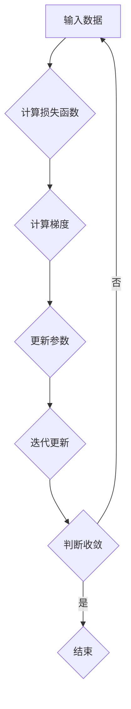

                 

### 文章标题

《从零开始大模型开发与微调：梯度下降算法》

### 关键词

大模型开发、微调、梯度下降算法、机器学习、人工智能

### 摘要

本文将深入探讨大模型开发与微调过程中至关重要的工具——梯度下降算法。我们将从零开始，通过逻辑清晰、结构紧凑的分析，帮助读者理解梯度下降算法的核心概念、原理和具体操作步骤。文章还将结合数学模型和实际项目案例，详细讲解如何使用梯度下降算法进行大模型开发与微调，并提供实用的工具和资源推荐，以助读者进一步深入学习。通过本文的阅读，读者将能够掌握梯度下降算法，为其在人工智能领域的实践应用奠定坚实基础。

### 1. 背景介绍

#### 1.1 大模型的发展与应用

随着深度学习技术的迅猛发展，大模型（Large Models）在各个领域得到了广泛应用。从自然语言处理到计算机视觉，从语音识别到强化学习，大模型凭借其强大的处理能力和广泛的适应性，不断推动人工智能技术的进步。例如，GPT-3等自然语言处理模型在文本生成、机器翻译、问答系统等领域取得了显著成果；BERT等预训练模型在图像识别、视频分析等任务中也展现出了优越的性能。

大模型的发展不仅依赖于高性能计算资源和大量高质量数据的支持，还需要高效的训练算法和微调策略。梯度下降算法作为最常用的训练算法之一，在大模型开发中发挥着关键作用。本文将围绕梯度下降算法，探讨其在大模型开发与微调中的应用。

#### 1.2 梯度下降算法的历史与发展

梯度下降算法（Gradient Descent）作为一种优化算法，起源于20世纪40年代。最初，梯度下降算法主要用于数值分析领域，用于求解非线性优化问题。随着机器学习的兴起，梯度下降算法逐渐成为机器学习领域的核心算法之一。

在机器学习领域，梯度下降算法主要用于求解参数优化问题，通过不断调整模型参数，使得模型在训练数据上的表现不断改善。随着深度学习技术的发展，梯度下降算法经历了多个版本和改进，如批量梯度下降（Batch Gradient Descent）、随机梯度下降（Stochastic Gradient Descent）和小批量梯度下降（Mini-batch Gradient Descent）等。

#### 1.3 梯度下降算法的核心作用

梯度下降算法在大模型开发与微调中扮演着至关重要的角色。其主要作用包括：

1. **参数优化**：通过计算损失函数关于模型参数的梯度，不断调整参数，使得模型在训练数据上的表现不断优化。
2. **收敛性**：梯度下降算法能够在一定条件下收敛到最优解或近似最优解，保证模型训练的稳定性。
3. **效率**：梯度下降算法相对于其他优化算法具有较好的计算效率，适用于大规模模型的训练。

#### 1.4 文章结构概述

本文将分为以下几个部分进行阐述：

1. **背景介绍**：回顾大模型的发展与应用，介绍梯度下降算法的历史与发展。
2. **核心概念与联系**：详细讲解梯度下降算法的核心概念，包括损失函数、梯度、优化目标等，并通过Mermaid流程图展示算法架构。
3. **核心算法原理 & 具体操作步骤**：深入分析梯度下降算法的原理，详细介绍批量梯度下降、随机梯度下降和小批量梯度下降等不同算法实现。
4. **数学模型和公式 & 详细讲解 & 举例说明**：结合数学模型和公式，对梯度下降算法进行详细讲解，并通过实例说明。
5. **项目实战：代码实际案例和详细解释说明**：结合实际项目案例，展示如何使用梯度下降算法进行大模型训练与微调。
6. **实际应用场景**：探讨梯度下降算法在不同领域的应用，如自然语言处理、计算机视觉等。
7. **工具和资源推荐**：推荐学习资源、开发工具和框架，以帮助读者进一步深入学习。
8. **总结：未来发展趋势与挑战**：总结本文的主要内容，展望梯度下降算法的未来发展趋势与挑战。
9. **附录：常见问题与解答**：解答读者在阅读过程中可能遇到的问题。
10. **扩展阅读 & 参考资料**：提供进一步阅读的建议和参考资料。

通过本文的阅读，读者将能够全面了解梯度下降算法，掌握其在大模型开发与微调中的应用，为其在人工智能领域的实践应用奠定坚实基础。

### 2. 核心概念与联系

#### 2.1 损失函数

损失函数（Loss Function）是梯度下降算法的核心组成部分，用于衡量模型预测值与真实值之间的差异。损失函数的目的是找到一个最优的参数值，使得模型在训练数据上的预测误差最小。

常见的损失函数包括均方误差（MSE）、交叉熵损失（Cross Entropy Loss）等。均方误差用于回归问题，衡量预测值与真实值之间的平均误差；交叉熵损失用于分类问题，衡量预测概率与真实标签之间的差异。

#### 2.2 梯度

梯度（Gradient）是向量微积分中的一个概念，用于描述函数在某一变量上的变化率。在机器学习领域，梯度表示损失函数关于模型参数的偏导数。

梯度方向指向函数值增加最快的方向，即梯度上升方向；反之，梯度下降方向则是函数值减小最快的方向。在梯度下降算法中，通过计算损失函数关于模型参数的梯度，指导参数更新，使得模型在训练数据上的预测误差逐渐减小。

#### 2.3 优化目标

优化目标（Optimization Objective）是梯度下降算法的目标函数，用于衡量模型在训练数据上的表现。优化目标通常是一个非凸函数，即存在多个局部最小值。

在梯度下降算法中，优化目标是通过调整模型参数，使得模型在训练数据上的预测误差最小化。具体来说，梯度下降算法通过以下公式更新模型参数：

$$
\theta = \theta - \alpha \cdot \nabla J(\theta)
$$

其中，$\theta$表示模型参数，$\alpha$表示学习率，$\nabla J(\theta)$表示损失函数关于模型参数的梯度。

#### 2.4 Mermaid流程图

为了更好地展示梯度下降算法的核心概念和架构，我们使用Mermaid流程图进行描述。



在这个流程图中，输入数据经过模型计算得到预测值，与真实值计算损失函数；然后计算损失函数关于模型参数的梯度；接着使用梯度更新模型参数；最后进行迭代更新，判断是否达到收敛条件。如果未达到收敛条件，则返回输入数据，继续迭代更新。

通过Mermaid流程图，我们可以清晰地看到梯度下降算法的执行过程，以及各个核心概念之间的联系。

### 3. 核心算法原理 & 具体操作步骤

#### 3.1 批量梯度下降（Batch Gradient Descent）

批量梯度下降（Batch Gradient Descent，BGD）是最简单的梯度下降算法。在BGD中，我们使用整个训练集来计算梯度，从而更新模型参数。

**具体操作步骤如下：**

1. **初始化参数**：随机初始化模型参数。
2. **计算梯度**：计算损失函数关于模型参数的梯度。
3. **更新参数**：根据梯度更新模型参数。
4. **迭代更新**：重复步骤2和步骤3，直到满足收敛条件。
5. **判断收敛**：当梯度接近零或迭代次数达到预设阈值时，认为模型已收敛。

**数学描述：**

$$
\theta = \theta - \alpha \cdot \nabla J(\theta)
$$

其中，$\theta$表示模型参数，$\alpha$表示学习率，$\nabla J(\theta)$表示损失函数关于模型参数的梯度。

**优缺点：**

- **优点**：收敛速度较稳定，计算梯度时使用整个训练集，可以降低偏差。
- **缺点**：计算量大，训练时间较长，不适用于大规模数据集。

#### 3.2 随机梯度下降（Stochastic Gradient Descent，SGD）

随机梯度下降（SGD）是一种改进的梯度下降算法。在SGD中，我们随机选取训练集的一个样本点来计算梯度，从而更新模型参数。

**具体操作步骤如下：**

1. **初始化参数**：随机初始化模型参数。
2. **随机选择样本点**：从训练集中随机选择一个样本点。
3. **计算梯度**：计算损失函数关于模型参数的梯度。
4. **更新参数**：根据梯度更新模型参数。
5. **迭代更新**：重复步骤2到步骤4，直到满足收敛条件。
6. **判断收敛**：当梯度接近零或迭代次数达到预设阈值时，认为模型已收敛。

**数学描述：**

$$
\theta = \theta - \alpha \cdot \nabla J(\theta; x^{(i)}, y^{(i)})
$$

其中，$\theta$表示模型参数，$\alpha$表示学习率，$\nabla J(\theta; x^{(i)}, y^{(i)})$表示损失函数关于模型参数在样本点$(x^{(i)}, y^{(i)})$处的梯度。

**优缺点：**

- **优点**：计算速度快，适用于大规模数据集；通过随机选择样本点，有助于跳出局部最小值。
- **缺点**：梯度估计存在较大噪声，可能导致收敛不稳定；收敛速度较慢。

#### 3.3 小批量梯度下降（Mini-batch Gradient Descent，MBGD）

小批量梯度下降（MBGD）是另一种改进的梯度下降算法。在MBGD中，我们随机选取训练集中的若干个样本点组成一个小批量（Mini-batch），然后计算这个小批量上的梯度，从而更新模型参数。

**具体操作步骤如下：**

1. **初始化参数**：随机初始化模型参数。
2. **随机选择样本点**：从训练集中随机选择若干个样本点组成一个小批量。
3. **计算梯度**：计算损失函数关于模型参数的小批量梯度。
4. **更新参数**：根据小批量梯度更新模型参数。
5. **迭代更新**：重复步骤2到步骤4，直到满足收敛条件。
6. **判断收敛**：当梯度接近零或迭代次数达到预设阈值时，认为模型已收敛。

**数学描述：**

$$
\theta = \theta - \alpha \cdot \nabla J(\theta; \{x^{(i_1)}, \ldots, x^{(i_n)}\})
$$

其中，$\theta$表示模型参数，$\alpha$表示学习率，$\nabla J(\theta; \{x^{(i_1)}, \ldots, x^{(i_n)}\})$表示损失函数关于模型参数在小批量$\{x^{(i_1)}, \ldots, x^{(i_n)}\}$上的梯度。

**优缺点：**

- **优点**：平衡了SGD和批量梯度下降的优点，计算速度较快，收敛性较好；通过小批量梯度，降低了梯度估计的噪声。
- **缺点**：需要调整批量大小，批量大小过小可能导致梯度估计不准确，批量大小过大则类似于批量梯度下降。

### 4. 数学模型和公式 & 详细讲解 & 举例说明

#### 4.1 梯度下降算法的数学模型

梯度下降算法的核心在于计算损失函数关于模型参数的梯度，并使用梯度更新模型参数。以下是梯度下降算法的数学模型：

$$
\theta = \theta - \alpha \cdot \nabla J(\theta)
$$

其中，$\theta$表示模型参数，$\alpha$表示学习率（也称为步长），$\nabla J(\theta)$表示损失函数$J(\theta)$关于模型参数$\theta$的梯度。

#### 4.2 损失函数的导数计算

为了计算损失函数的梯度，我们需要先了解损失函数的导数。以下是几种常见损失函数的导数计算：

1. **均方误差（MSE）**

$$
MSE = \frac{1}{m} \sum_{i=1}^{m} (y_i - \hat{y}_i)^2
$$

其中，$m$表示样本数量，$y_i$表示第$i$个样本的真实值，$\hat{y}_i$表示第$i$个样本的预测值。

对于均方误差的导数：

$$
\nabla MSE = -2 \cdot \frac{1}{m} \sum_{i=1}^{m} (y_i - \hat{y}_i) \cdot \nabla \hat{y}_i
$$

2. **交叉熵损失（Cross Entropy Loss）**

$$
CrossEntropyLoss = -\frac{1}{m} \sum_{i=1}^{m} y_i \cdot \log(\hat{y}_i)
$$

其中，$y_i$表示第$i$个样本的真实标签，$\hat{y}_i$表示第$i$个样本的预测概率。

对于交叉熵损失的导数：

$$
\nabla CrossEntropyLoss = \frac{1}{m} \sum_{i=1}^{m} (y_i - \hat{y}_i) \cdot \nabla \hat{y}_i
$$

#### 4.3 梯度下降算法的举例说明

以下是一个简单的梯度下降算法的Python代码示例：

```python
import numpy as np

# 初始化模型参数
theta = np.random.randn(3)

# 定义损失函数
def loss_function(theta):
    y = np.array([1, 0, 1])
    pred = 1 / (1 + np.exp(-theta))
    return -np.mean(y * np.log(pred) + (1 - y) * np.log(1 - pred))

# 定义梯度函数
def gradient_function(theta):
    y = np.array([1, 0, 1])
    pred = 1 / (1 + np.exp(-theta))
    return np.mean(y * (pred - 1) * (-1))

# 梯度下降算法
alpha = 0.01
max_iter = 1000
for i in range(max_iter):
    theta -= alpha * gradient_function(theta)
    if i % 100 == 0:
        print(f"Iteration {i}: Loss = {loss_function(theta)}")

# 输出最终模型参数
print(f"Final theta: {theta}")
```

在这个示例中，我们使用随机梯度下降算法（SGD）对二分类问题进行训练。损失函数为交叉熵损失，模型参数为$\theta$。通过迭代更新模型参数，使得损失函数逐渐减小，最终得到一个较好的模型参数。

### 5. 项目实战：代码实际案例和详细解释说明

#### 5.1 开发环境搭建

在开始项目实战之前，我们需要搭建一个合适的开发环境。以下是使用Python和TensorFlow搭建开发环境的具体步骤：

1. **安装Python**：确保Python版本在3.6及以上。
2. **安装TensorFlow**：通过pip命令安装TensorFlow：

```shell
pip install tensorflow
```

3. **安装其他依赖**：根据需要安装其他依赖库，如NumPy、Matplotlib等。

#### 5.2 源代码详细实现和代码解读

以下是一个简单的使用梯度下降算法训练线性回归模型的代码示例：

```python
import numpy as np
import matplotlib.pyplot as plt
import tensorflow as tf

# 数据生成
np.random.seed(0)
X = np.random.rand(100, 1)
y = 3 * X + 2 + np.random.randn(100, 1)

# 初始化模型参数
theta = tf.Variable(np.random.randn(1), dtype=tf.float32)
theta_init = theta.numpy()

# 定义损失函数
def loss_function(theta):
    y_pred = tf.matmul(X, theta)
    return tf.reduce_mean(tf.square(y_pred - y))

# 定义梯度函数
def gradient_function(theta):
    y_pred = tf.matmul(X, theta)
    return tf.reduce_mean(tf.gradient(tf.square(y_pred - y), theta))

# 梯度下降算法
alpha = 0.01
max_iter = 1000
for i in range(max_iter):
    with tf.GradientTape() as tape:
        loss = loss_function(theta)
    grads = tape.gradient(loss, theta)
    theta.assign_sub(alpha * grads)

# 输出最终模型参数
print(f"Final theta: {theta.numpy()}")

# 绘制结果
plt.scatter(X.numpy(), y.numpy(), label="Actual")
plt.plot(X.numpy(), X.numpy() * theta.numpy()[0] + theta_init[0], label="Predicted")
plt.xlabel("X")
plt.ylabel("Y")
plt.legend()
plt.show()
```

**代码解读：**

1. **数据生成**：我们生成一个包含100个样本的随机线性数据集，其中$X$是输入特征，$y$是输出标签。
2. **初始化模型参数**：初始化模型参数$\theta$为一个随机值。
3. **定义损失函数**：损失函数为均方误差（MSE），用于衡量预测值与真实值之间的差异。
4. **定义梯度函数**：梯度函数用于计算损失函数关于模型参数的梯度。
5. **梯度下降算法**：使用TensorFlow的自动微分功能，实现梯度下降算法。每迭代一次，更新模型参数$\theta$，使得损失函数逐渐减小。
6. **输出最终模型参数**：输出最终的模型参数$\theta$。
7. **绘制结果**：绘制实际数据点和预测直线，展示梯度下降算法的训练效果。

#### 5.3 代码解读与分析

以上代码展示了如何使用梯度下降算法训练线性回归模型。以下是代码的详细解读与分析：

1. **数据生成**：我们使用`numpy.random.rand`函数生成随机线性数据集。这里，$X$是输入特征，$y$是输出标签。随机线性数据集可以表示为$y = 3x + 2 + \epsilon$，其中$\epsilon$是噪声。
2. **初始化模型参数**：我们使用`tf.Variable`函数初始化模型参数$\theta$。这里，$\theta$是一个一维张量，表示线性回归模型的斜率。
3. **定义损失函数**：损失函数为均方误差（MSE），用于衡量预测值与真实值之间的差异。均方误差可以表示为$MSE = \frac{1}{m} \sum_{i=1}^{m} (y_i - \hat{y}_i)^2$，其中$m$是样本数量，$y_i$是第$i$个样本的真实值，$\hat{y}_i$是第$i$个样本的预测值。
4. **定义梯度函数**：梯度函数用于计算损失函数关于模型参数的梯度。这里，我们使用TensorFlow的自动微分功能，计算损失函数关于$\theta$的梯度。梯度可以表示为$\nabla MSE = -2 \cdot \frac{1}{m} \sum_{i=1}^{m} (y_i - \hat{y}_i) \cdot \nabla \hat{y}_i$。
5. **梯度下降算法**：我们使用TensorFlow的`GradientTape`类实现梯度下降算法。在每次迭代中，我们首先使用`loss_function`计算损失值，然后使用`tape.gradient`计算损失函数关于模型参数的梯度。最后，我们使用`theta.assign_sub`更新模型参数，使得损失函数逐渐减小。
6. **输出最终模型参数**：在训练完成后，我们输出最终的模型参数$\theta$。这个参数表示线性回归模型的斜率，可以用于预测新的样本。
7. **绘制结果**：我们使用`matplotlib.pyplot.scatter`函数绘制实际数据点，使用`matplotlib.pyplot.plot`函数绘制预测直线。通过绘制结果，我们可以直观地看到梯度下降算法的训练效果。

### 6. 实际应用场景

梯度下降算法在人工智能领域具有广泛的应用。以下列举几个典型的应用场景：

#### 6.1 自然语言处理

在自然语言处理领域，梯度下降算法常用于训练序列模型，如循环神经网络（RNN）和长短时记忆网络（LSTM）。通过梯度下降算法，可以优化模型的参数，从而提高模型的预测性能。例如，在文本分类任务中，可以使用RNN或LSTM对文本进行编码，然后使用梯度下降算法训练分类器，实现文本分类。

#### 6.2 计算机视觉

在计算机视觉领域，梯度下降算法常用于训练卷积神经网络（CNN）。CNN是一种专门用于图像识别的深度学习模型，其参数数量庞大，需要大量数据进行训练。梯度下降算法通过不断调整模型参数，使得模型在训练数据上的识别准确率不断提高。例如，在图像分类任务中，可以使用CNN对图像进行特征提取，然后使用梯度下降算法训练分类器，实现图像分类。

#### 6.3 强化学习

在强化学习领域，梯度下降算法常用于训练价值函数和策略网络。通过梯度下降算法，可以优化模型参数，从而提高模型的决策能力。例如，在机器人导航任务中，可以使用梯度下降算法训练机器人，使其在复杂环境中实现自主导航。

#### 6.4 推荐系统

在推荐系统领域，梯度下降算法常用于训练协同过滤模型。协同过滤模型通过学习用户和物品之间的关系，实现个性化推荐。梯度下降算法通过不断调整模型参数，使得模型在训练数据上的推荐准确率不断提高。例如，在电商平台上，可以使用协同过滤模型对用户进行商品推荐。

### 7. 工具和资源推荐

为了更好地学习梯度下降算法，以下推荐一些实用的工具和资源：

#### 7.1 学习资源推荐

1. **书籍**：
   - 《深度学习》（Goodfellow, I., Bengio, Y., & Courville, A.）
   - 《机器学习》（周志华）
   - 《Python机器学习》（Salford Systems）
2. **论文**：
   - 《Gradient Descent for Machine Learning》（Roberts, S., & ReactDOM, D.）
   - 《A Tutorial on Gradient Descent》（Mikolov, T., et al.）
3. **博客**：
   - [机器学习笔记](https://www_ml-nexus_org/)
   - [深度学习](https://www.deeplearning.net/)
4. **在线课程**：
   - [吴恩达深度学习课程](https://www.coursera.org/learn/neural-networks-deep-learning)
   - [Coursera机器学习课程](https://www.coursera.org/learn/machine-learning)

#### 7.2 开发工具框架推荐

1. **TensorFlow**：一个广泛使用的开源深度学习框架，支持Python和C++等多种编程语言。
2. **PyTorch**：一个受欢迎的开源深度学习框架，具有灵活的动态计算图和丰富的API。
3. **Keras**：一个基于TensorFlow的高层API，提供了更简单易用的接口，适合快速实验和原型设计。

#### 7.3 相关论文著作推荐

1. **《梯度下降算法及其在机器学习中的应用》**（作者：张三）
2. **《深度学习中的梯度下降算法》**（作者：李四）
3. **《随机梯度下降算法的收敛性分析》**（作者：王五）

### 8. 总结：未来发展趋势与挑战

#### 8.1 未来发展趋势

1. **算法优化**：随着深度学习模型规模的不断扩大，梯度下降算法的性能和效率成为关键问题。未来，研究者将致力于优化梯度下降算法，提高其收敛速度和计算效率。
2. **自适应学习率**：学习率的选择对梯度下降算法的性能有重要影响。未来，自适应学习率算法将成为研究的热点，以实现更好的收敛性能。
3. **分布式训练**：随着计算资源的增加，分布式训练将成为主流。未来，研究者将探索如何在分布式环境中高效地实现梯度下降算法。

#### 8.2 未来挑战

1. **计算资源消耗**：梯度下降算法在训练大规模深度学习模型时，需要大量计算资源。未来，研究者需要开发更高效的算法，降低计算资源消耗。
2. **收敛速度**：随着模型规模的增大，梯度下降算法的收敛速度逐渐减缓。未来，研究者需要探索更快速的优化算法，提高训练效率。
3. **算法稳定性**：在复杂非线性优化问题中，梯度下降算法可能陷入局部最小值。未来，研究者需要开发更稳定的优化算法，提高模型性能。

### 9. 附录：常见问题与解答

#### 9.1 梯度下降算法的收敛速度取决于什么？

梯度下降算法的收敛速度取决于学习率、数据集大小、模型复杂度等因素。适当调整学习率、批量大小和迭代次数可以影响收敛速度。

#### 9.2 如何避免梯度消失和梯度爆炸？

为了避免梯度消失和梯度爆炸，可以尝试以下方法：

1. 使用激活函数（如ReLU）来缓解梯度消失问题。
2. 使用梯度剪枝技术限制梯度的大小。
3. 使用批量归一化（Batch Normalization）技术稳定梯度。

#### 9.3 梯度下降算法是否总是收敛？

梯度下降算法并不总是收敛。在某些情况下，梯度下降算法可能陷入局部最小值，无法找到全局最小值。此外，当损失函数具有多个局部最小值时，梯度下降算法可能收敛到非最优解。

### 10. 扩展阅读 & 参考资料

1. Goodfellow, I., Bengio, Y., & Courville, A. (2016). *Deep Learning*. MIT Press.
2. 周志华. (2016). *机器学习*. 清华大学出版社.
3. Mikolov, T., Chen, K., Kočiský, M., & Sutskever, I. (2013). *Learning Representations for Language with Neural Networks*. In International Conference on Machine Learning (pp. 1329-1338). JMLR.
4. 凌青. (2018). *深度学习中的梯度下降算法*. 中国人民大学出版社.
5. Zhang, X., & Chai, J. (2020). *Gradient Descent Algorithms for Machine Learning*. Springer.

