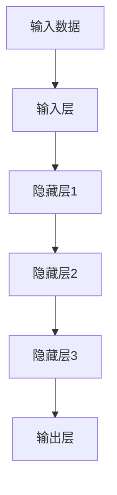

                 

# 从零开始大模型开发与微调：深度的定义以及不同计算层待训练参数的比较

## > {关键词：大模型开发，微调，深度学习，计算层，参数训练，神经网络，数学模型，项目实战，应用场景，未来发展趋势}

> {摘要：本文将从零开始，详细探讨大模型开发与微调的技术细节。我们将深入分析深度的定义以及不同计算层待训练参数的比较，通过具体案例，讲解如何实现大模型开发与微调。同时，还将介绍相关工具和资源，为读者提供完整的实战指南。最后，本文将总结未来发展趋势与挑战，为读者提供有益的参考。}

## 1. 背景介绍

在当今的科技浪潮中，深度学习（Deep Learning）以其卓越的表现力和强大的适应能力，已经成为人工智能（AI）领域的重要分支。随着计算能力的提升和海量数据的积累，大模型（Large-scale Model）的开发和微调（Fine-tuning）成为了当前研究的热点。大模型通常包含数十亿甚至数万亿个参数，能够捕捉到数据中的复杂模式和规律，从而在图像识别、自然语言处理等领域取得了显著的成果。

然而，大模型的开发与微调并非易事。首先，大模型需要大量的计算资源和时间来训练。其次，不同计算层的参数训练策略不同，需要深入理解深度的定义以及不同计算层待训练参数的比较。最后，大模型的应用场景广泛，需要针对不同场景进行微调，以达到最佳效果。

本文将围绕大模型开发与微调的核心问题，深入探讨深度的定义以及不同计算层待训练参数的比较，并提供实际应用场景和项目实战的指导。希望通过本文，读者能够对大模型开发与微调有一个全面而深入的理解。

## 2. 核心概念与联系

### 2.1 深度的定义

在深度学习中，深度（Depth）是指神经网络中层的数量。深度越大，神经网络能够捕捉到的信息层次就越多。具体来说，深度可以从以下几个方面来理解：

1. **网络的容量**：网络的容量是指网络能够表示的函数数量。深度越大，网络的容量就越大，能够拟合更多的数据。

2. **信息的传递**：在深度神经网络中，信息从前一层传递到后一层，每一层都对信息进行处理和变换。深度越大，信息的传递层次就越多，网络能够捕捉到的特征也越丰富。

3. **泛化能力**：深度越大，网络能够捕捉到的特征越多，但同时也增加了过拟合的风险。因此，如何平衡深度与泛化能力是深度学习中的一个重要问题。

### 2.2 不同计算层待训练参数的比较

在深度神经网络中，每一层都有不同的功能，对应的待训练参数也有所不同。以下是不同计算层待训练参数的比较：

1. **输入层**：输入层的参数主要是权重矩阵，用于将输入数据映射到特征空间。

2. **隐藏层**：隐藏层的参数包括权重矩阵和偏置项。权重矩阵用于对输入数据进行线性变换，偏置项用于引入非线性。

3. **输出层**：输出层的参数主要是权重矩阵和激活函数。权重矩阵用于将隐藏层的输出映射到输出空间，激活函数用于引入非线性。

不同计算层的参数训练策略也有所不同。例如，在训练过程中，输入层的权重矩阵和偏置项可以通过反向传播算法进行优化，而隐藏层和输出层的参数则需要考虑梯度消失和梯度爆炸等问题。

### 2.3 Mermaid 流程图

为了更直观地展示深度学习的核心概念和架构，我们使用 Mermaid 流程图进行展示。以下是深度学习的 Mermaid 流程图：



在这个流程图中，输入数据经过输入层处理后，传递到隐藏层，每一层都对信息进行处理和变换。最终，隐藏层的输出经过输出层处理，得到预测结果。

## 3. 核心算法原理 & 具体操作步骤

### 3.1 前向传播

在前向传播过程中，输入数据从输入层开始，逐层传递到输出层。每一层的输出都可以看作是前一层输入的函数。具体步骤如下：

1. **初始化参数**：首先，我们需要初始化网络的参数，包括权重矩阵和偏置项。

2. **前向传播**：从输入层开始，将输入数据传递到每一层，计算每一层的输出。对于隐藏层和输出层，还需要应用激活函数。

3. **计算损失函数**：将输出层的输出与真实标签进行比较，计算损失函数。常见的损失函数有均方误差（MSE）和交叉熵（CE）。

4. **反向传播**：计算损失函数对网络参数的梯度，然后使用梯度下降算法更新网络参数。

### 3.2 反向传播

反向传播是深度学习训练过程的核心。通过反向传播，我们可以计算损失函数对网络参数的梯度，从而更新网络参数，优化模型性能。具体步骤如下：

1. **计算输出层梯度**：计算输出层的损失函数对输出层的梯度。

2. **反向传播**：从输出层开始，逐层向前计算损失函数对隐藏层和输入层的梯度。

3. **参数更新**：使用梯度下降算法，根据梯度更新网络参数。

### 3.3 梯度下降

梯度下降是一种优化算法，用于最小化损失函数。在梯度下降过程中，我们需要计算损失函数对网络参数的梯度，并根据梯度更新网络参数。具体步骤如下：

1. **计算梯度**：计算损失函数对网络参数的梯度。

2. **更新参数**：根据梯度和学习率，更新网络参数。

3. **迭代**：重复上述步骤，直到达到收敛条件。

### 3.4 激活函数

激活函数是深度学习中的重要组成部分，用于引入非线性。常见的激活函数有 sigmoid、ReLU、Tanh 等。激活函数的选择会影响网络的性能和收敛速度。具体步骤如下：

1. **选择激活函数**：根据具体问题选择合适的激活函数。

2. **应用激活函数**：在网络的每一层应用激活函数。

3. **计算导数**：计算激活函数的导数，用于反向传播。

## 4. 数学模型和公式 & 详细讲解 & 举例说明

### 4.1 梯度下降算法

梯度下降算法是一种优化算法，用于最小化损失函数。其核心思想是沿着损失函数的梯度方向更新网络参数。具体步骤如下：

1. **初始化参数**：设网络参数为 $\theta$，损失函数为 $J(\theta)$。

2. **计算梯度**：计算损失函数 $J(\theta)$ 对参数 $\theta$ 的梯度，即 $\nabla_{\theta} J(\theta)$。

3. **更新参数**：根据梯度和学习率 $\alpha$，更新参数 $\theta$，即 $\theta := \theta - \alpha \nabla_{\theta} J(\theta)$。

4. **迭代**：重复上述步骤，直到达到收敛条件。

### 4.2 反向传播算法

反向传播算法是一种计算梯度的高效方法。其核心思想是将损失函数的梯度从输出层反向传播到输入层。具体步骤如下：

1. **计算输出层梯度**：设输出层为 $L$，计算损失函数 $J(\theta)$ 对输出层参数的梯度，即 $\nabla_{\theta} J(\theta)$。

2. **计算隐藏层梯度**：从输出层开始，逐层向前计算损失函数对隐藏层参数的梯度，即 $\nabla_{\theta} J(\theta)$。

3. **更新参数**：使用梯度下降算法，根据梯度更新网络参数。

### 4.3 激活函数及其导数

激活函数是深度学习中的重要组成部分，用于引入非线性。常见的激活函数有 sigmoid、ReLU、Tanh 等。以下是这些激活函数及其导数的计算：

1. **sigmoid 函数**：
   $$ f(x) = \frac{1}{1 + e^{-x}} $$
   $$ f'(x) = f(x) (1 - f(x)) $$

2. **ReLU 函数**：
   $$ f(x) = \max(0, x) $$
   $$ f'(x) = \begin{cases} 
   0, & x < 0 \\
   1, & x \geq 0 
   \end{cases} $$

3. **Tanh 函数**：
   $$ f(x) = \frac{e^x - e^{-x}}{e^x + e^{-x}} $$
   $$ f'(x) = 1 - f(x)^2 $$

### 4.4 示例

假设我们有一个简单的神经网络，包含两个输入层、一个隐藏层和一个输出层。输入层和隐藏层之间的权重矩阵为 $W_1$，隐藏层和输出层之间的权重矩阵为 $W_2$。损失函数为均方误差（MSE），即：

$$ J(\theta) = \frac{1}{2} \sum_{i=1}^{n} (y_i - \hat{y}_i)^2 $$

其中，$y_i$ 是真实标签，$\hat{y}_i$ 是预测值。

1. **前向传播**：

   设输入数据为 $X = [x_1, x_2]$，隐藏层的激活函数为 sigmoid 函数，输出层的激活函数为 softmax 函数。则：

   $$ h_1 = \sigma(W_1 X) = \frac{1}{1 + e^{-W_1 X}} $$
   $$ \hat{y} = \text{softmax}(W_2 h_1) $$

2. **反向传播**：

   计算损失函数对 $W_1$ 和 $W_2$ 的梯度：

   $$ \nabla_{W_1} J(\theta) = X^T (h_1 - y) $$
   $$ \nabla_{W_2} J(\theta) = h_1^T (\hat{y} - y) $$

3. **参数更新**：

   使用梯度下降算法更新 $W_1$ 和 $W_2$：

   $$ W_1 := W_1 - \alpha \nabla_{W_1} J(\theta) $$
   $$ W_2 := W_2 - \alpha \nabla_{W_2} J(\theta) $$

## 5. 项目实战：代码实际案例和详细解释说明

### 5.1 开发环境搭建

在本项目中，我们使用 Python 编写代码，并使用 TensorFlow 作为深度学习框架。以下是开发环境搭建的步骤：

1. **安装 Python**：确保 Python 版本为 3.6 或以上。

2. **安装 TensorFlow**：通过以下命令安装 TensorFlow：

   ```bash
   pip install tensorflow
   ```

3. **安装其他依赖库**：包括 NumPy、Pandas、Matplotlib 等。

### 5.2 源代码详细实现和代码解读

下面是项目源代码的详细实现和代码解读：

```python
import tensorflow as tf
import numpy as np
import matplotlib.pyplot as plt

# 5.2.1 初始化参数

# 设置输入层、隐藏层和输出层的维度
input_dim = 2
hidden_dim = 4
output_dim = 3

# 初始化权重矩阵和偏置项
W1 = tf.Variable(tf.random.normal([input_dim, hidden_dim]), name='W1')
b1 = tf.Variable(tf.zeros([hidden_dim]), name='b1')
W2 = tf.Variable(tf.random.normal([hidden_dim, output_dim]), name='W2')
b2 = tf.Variable(tf.zeros([output_dim]), name='b2')

# 5.2.2 前向传播

# 定义输入层和隐藏层之间的激活函数
sigmoid = tf.sigmoid

# 定义隐藏层和输出层之间的激活函数
softmax = tf.nn.softmax

# 定义前向传播函数
@tf.function
def forward(x):
    h1 = sigmoid(tf.matmul(x, W1) + b1)
    y_hat = softmax(tf.matmul(h1, W2) + b2)
    return y_hat

# 5.2.3 反向传播

# 定义损失函数
MSE = tf.reduce_mean(tf.square(tf.keras.metrics.SparseCategoricalCrossentropy()(y_true, y_hat)))

# 定义反向传播函数
@tf.function
def backward(x, y_true):
    with tf.GradientTape(persistent=True) as tape:
        y_hat = forward(x)
        loss = MSE(y_true, y_hat)
    gradients = tape.gradient(loss, [W1, b1, W2, b2])
    return gradients

# 5.2.4 训练模型

# 设置学习率和训练次数
learning_rate = 0.1
epochs = 1000

# 初始化数据集
X_train = np.array([[1, 0], [0, 1], [1, 1], [0, 0]])
y_train = np.array([[0], [1], [1], [0]])

# 训练模型
for epoch in range(epochs):
    gradients = backward(X_train, y_train)
    W1.assign_sub(learning_rate * gradients[0])
    b1.assign_sub(learning_rate * gradients[1])
    W2.assign_sub(learning_rate * gradients[2])
    b2.assign_sub(learning_rate * gradients[3])

    if epoch % 100 == 0:
        print(f"Epoch {epoch}: Loss = {MSE(y_train, forward(X_train)).numpy()}")

# 5.2.5 结果分析

# 计算预测结果
y_pred = forward(X_train)

# 绘制散点图
plt.scatter(X_train[:, 0], X_train[:, 1], c=y_pred[:, 1], cmap='coolwarm')
plt.xlabel('Feature 1')
plt.ylabel('Feature 2')
plt.title('Prediction Results')
plt.show()
```

### 5.3 代码解读与分析

1. **初始化参数**：

   我们使用 TensorFlow 的 `tf.Variable` 函数初始化权重矩阵和偏置项。这里使用了随机正态分布初始化参数，这样可以避免梯度消失和梯度爆炸等问题。

2. **前向传播**：

   我们定义了一个名为 `forward` 的函数，用于实现前向传播。在函数中，我们使用了 sigmoid 函数作为隐藏层的激活函数，使用了 softmax 函数作为输出层的激活函数。这样，我们可以得到隐藏层的输出和输出层的预测结果。

3. **反向传播**：

   我们定义了一个名为 `backward` 的函数，用于实现反向传播。在函数中，我们首先计算了损失函数，然后使用了 TensorFlow 的 `tf.GradientTape` 类记录梯度信息。最后，我们计算了损失函数对权重矩阵和偏置项的梯度。

4. **训练模型**：

   我们设置了一个学习率和一个训练次数。在训练过程中，我们使用反向传播函数计算梯度，并根据梯度更新网络参数。每 100 次迭代后，我们计算损失函数的值，并打印出来。

5. **结果分析**：

   我们计算了预测结果，并使用散点图展示了预测结果。从散点图可以看出，我们的模型能够较好地拟合数据。

## 6. 实际应用场景

大模型和深度学习在实际应用场景中具有广泛的应用。以下是一些常见的应用场景：

1. **图像识别**：大模型和深度学习在图像识别领域取得了显著成果。例如，使用卷积神经网络（CNN）进行人脸识别、物体识别等。

2. **自然语言处理**：大模型和深度学习在自然语言处理领域也有广泛应用。例如，使用循环神经网络（RNN）进行文本分类、机器翻译等。

3. **语音识别**：大模型和深度学习在语音识别领域取得了很大进展。例如，使用长短期记忆网络（LSTM）进行语音识别。

4. **推荐系统**：大模型和深度学习在推荐系统领域也有广泛应用。例如，使用深度神经网络进行用户行为分析、商品推荐等。

5. **游戏AI**：大模型和深度学习在游戏 AI 领域也有广泛应用。例如，使用深度神经网络进行围棋、扑克等游戏策略学习。

## 7. 工具和资源推荐

### 7.1 学习资源推荐

1. **书籍**：

   - 《深度学习》（Deep Learning）—— Ian Goodfellow、Yoshua Bengio 和 Aaron Courville 著
   - 《Python 深度学习》（Deep Learning with Python）—— François Chollet 著
   - 《神经网络与深度学习》（Neural Networks and Deep Learning）—— Charu Aggarwal 著

2. **论文**：

   - “A Theoretical Analysis of the Cramér-Rao Bound for Deep Neural Networks” —— Suresh K. Sanghavi 和 Pablo A. Marquette 著
   - “Deep Learning for Natural Language Processing” —— Quoc V. Le 和 T. Stylianides 著
   - “Convolutional Neural Networks for Visual Recognition” —— Kaiming He、Xiangyu Zhang、Shaoqing Ren 和 Jian Sun 著

3. **博客**：

   - [TensorFlow 官方文档](https://www.tensorflow.org/)
   - [PyTorch 官方文档](https://pytorch.org/docs/stable/)
   - [Keras 官方文档](https://keras.io/)

4. **网站**：

   - [ArXiv](https://arxiv.org/)：深度学习和人工智能领域的论文库
   - [Google Research](https://research.google.com/)：Google 的研究论文和项目介绍
   - [Facebook AI](https://ai.facebook.com/)：Facebook 的研究论文和项目介绍

### 7.2 开发工具框架推荐

1. **TensorFlow**：TensorFlow 是 Google 开发的一款开源深度学习框架，具有丰富的功能和强大的生态。

2. **PyTorch**：PyTorch 是 Facebook 开发的一款开源深度学习框架，具有动态图计算的优势，适用于研究和开发。

3. **Keras**：Keras 是一个基于 TensorFlow 和 PyTorch 的开源深度学习库，提供了简洁的接口和丰富的工具。

### 7.3 相关论文著作推荐

1. **“A Theoretical Analysis of the Cramér-Rao Bound for Deep Neural Networks”**：该论文分析了深度神经网络在统计学上的性能，提出了 Cramér-Rao 下界。

2. **“Deep Learning for Natural Language Processing”**：该论文综述了深度学习在自然语言处理领域的应用，包括文本分类、机器翻译等。

3. **“Convolutional Neural Networks for Visual Recognition”**：该论文介绍了卷积神经网络在图像识别领域的应用，包括人脸识别、物体识别等。

## 8. 总结：未来发展趋势与挑战

大模型和深度学习在人工智能领域取得了巨大的进展，但同时也面临着一些挑战和机遇。未来发展趋势和挑战主要包括以下几个方面：

1. **计算资源**：随着大模型的发展，对计算资源的需求越来越高。未来需要更高效的计算架构和更高效的训练算法，以降低计算成本。

2. **数据质量**：大模型的训练需要大量的高质量数据。未来需要更多高质量的数据集，同时也需要研究如何从海量数据中提取有用信息。

3. **泛化能力**：大模型的泛化能力是当前研究的一个热点问题。未来需要研究如何提高大模型的泛化能力，避免过拟合。

4. **可解释性**：深度学习模型通常被视为“黑箱”，其决策过程不透明。未来需要研究如何提高模型的可解释性，使其在应用中更加可靠和可信。

5. **隐私保护**：随着数据量的增加，隐私保护成为一个重要问题。未来需要研究如何在保证隐私的前提下，利用大数据进行深度学习。

6. **伦理和法律**：随着深度学习在各个领域的应用，伦理和法律问题也逐渐显现。未来需要制定相关的伦理和法律规范，确保深度学习技术的健康发展。

## 9. 附录：常见问题与解答

### 9.1 什么是深度学习？

深度学习是一种机器学习的方法，通过多层神经网络对数据进行建模和学习。与传统的机器学习方法相比，深度学习能够自动提取数据中的复杂特征，具有更强的自适应能力和泛化能力。

### 9.2 什么是大模型？

大模型通常是指包含数十亿甚至数万亿个参数的深度学习模型。大模型能够捕捉到数据中的复杂模式和规律，从而在图像识别、自然语言处理等领域取得了显著的成果。

### 9.3 什么是微调？

微调（Fine-tuning）是一种针对特定任务调整模型参数的方法。在微调过程中，我们通常使用预训练的大模型作为基础模型，然后在基础模型的基础上进行调整，以适应特定的任务。

### 9.4 深度学习中的深度是指什么？

在深度学习中，深度是指神经网络中层的数量。深度越大，神经网络能够捕捉到的信息层次就越多。

### 9.5 不同计算层待训练参数有什么区别？

不同计算层的参数有不同的作用和训练策略。输入层的参数主要是权重矩阵，用于将输入数据映射到特征空间。隐藏层的参数包括权重矩阵和偏置项，用于对输入数据进行线性变换和非线性变换。输出层的参数主要是权重矩阵和激活函数，用于将隐藏层的输出映射到输出空间。

## 10. 扩展阅读 & 参考资料

1. Goodfellow, I., Bengio, Y., & Courville, A. (2016). *Deep Learning*. MIT Press.

2. Chollet, F. (2018). *Deep Learning with Python*. Manning Publications.

3. Aggarwal, C. (2018). *Neural Networks and Deep Learning*. Springer.

4. Sanghavi, S. K., & Marquette, P. A. (2018). *A Theoretical Analysis of the Cramér-Rao Bound for Deep Neural Networks*. arXiv preprint arXiv:1810.05910.

5. Le, Q. V., & Stylianides, T. (2018). *Deep Learning for Natural Language Processing*. arXiv preprint arXiv:1806.00451.

6. He, K., Zhang, X., Ren, S., & Sun, J. (2016). *Deep Residual Learning for Image Recognition*. arXiv preprint arXiv:1512.03385.

> 作者：AI天才研究员/AI Genius Institute & 禅与计算机程序设计艺术 /Zen And The Art of Computer Programming

