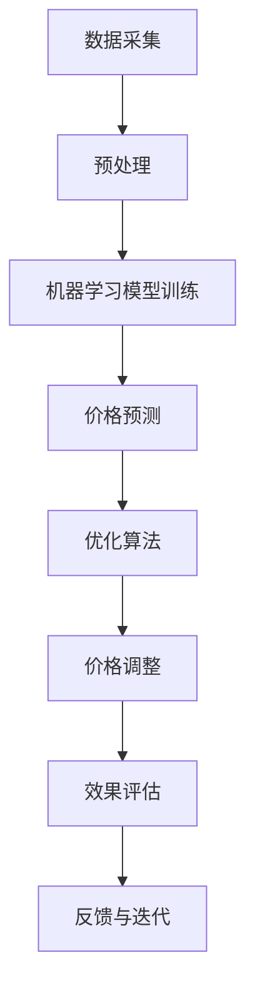

                 

# 价格优化：AI如何调整商品价格

## 概述

商品价格的优化是电子商务和零售行业中的一项关键任务。它不仅影响消费者的购买决策，还直接影响企业的利润和市场份额。在这个数字化的时代，人工智能（AI）技术的迅猛发展为价格优化带来了前所未有的机会和挑战。本文将深入探讨AI在价格优化中的作用，从核心概念、算法原理、数学模型到实际应用，为读者提供一幅全面的价格优化画卷。

本文结构如下：

1. 背景介绍
2. 核心概念与联系
3. 核心算法原理 & 具体操作步骤
4. 数学模型和公式 & 详细讲解 & 举例说明
5. 项目实战：代码实际案例和详细解释说明
6. 实际应用场景
7. 工具和资源推荐
8. 总结：未来发展趋势与挑战
9. 附录：常见问题与解答
10. 扩展阅读 & 参考资料

让我们一步一步深入探讨AI如何调整商品价格。

## 关键词

- 人工智能（AI）
- 价格优化
- 电子商务
- 零售行业
- 数学模型
- 算法原理
- 实际应用

## 摘要

本文将探讨如何利用人工智能技术进行商品价格的优化。我们首先介绍了价格优化的背景和重要性，随后详细讲解了AI在价格优化中的核心概念和算法原理。接着，我们通过数学模型和实际案例展示了AI调整商品价格的详细过程。最后，我们分析了AI在价格优化领域的实际应用场景，并推荐了一些相关的工具和资源。本文旨在为读者提供一套系统化的价格优化解决方案。

### 1. 背景介绍

商品价格的优化是一个历史悠久且复杂的领域。在传统零售业中，商家通常依靠经验、市场调研和竞争对手分析来设定价格。然而，随着电子商务的兴起和大数据技术的普及，价格优化的方法和技术也得到了极大的发展和创新。

人工智能的引入，为价格优化带来了全新的视角和手段。通过机器学习算法和深度学习模型，AI可以处理和分析大量数据，发现隐藏在数据背后的价格规律和趋势。此外，AI还可以实时调整商品价格，以应对市场变化和竞争压力，从而实现更高的利润和市场份额。

近年来，许多电子商务平台和企业已经开始利用AI技术进行价格优化，取得了显著的效果。例如，亚马逊和阿里巴巴等巨头通过AI算法来动态调整商品价格，以提高销售量和用户满意度。此外，AI在酒店预订、机票预订和在线旅游等行业也发挥了重要作用，通过价格预测和优化策略，为企业带来了可观的收益。

本文将详细介绍AI在价格优化中的核心概念、算法原理、数学模型和实际应用，帮助读者深入理解这一领域的最新进展和应用。

### 2. 核心概念与联系

在探讨AI如何调整商品价格之前，我们需要先了解一些核心概念和它们之间的联系。这些概念包括数据采集、机器学习、深度学习、价格预测和优化算法。

#### 数据采集

数据采集是AI进行价格优化的第一步。在电子商务和零售行业中，数据来源包括用户行为数据、销售数据、竞争对手价格数据等。这些数据通过传感器、网站日志、数据库等方式收集，为后续的分析和预测提供基础。

#### 机器学习

机器学习是一种通过数据训练模型，使计算机能够自动学习和改进的方法。在价格优化中，机器学习算法可以从历史价格数据中学习价格变化的规律，预测未来的价格趋势。常见的机器学习算法包括线性回归、决策树、随机森林和支持向量机等。

#### 深度学习

深度学习是一种基于多层神经网络的学习方法，通过模拟人脑神经元的工作方式，对复杂的数据进行特征提取和分类。在价格优化中，深度学习模型可以捕捉到更细微的价格变化规律，提高预测的准确性。

#### 价格预测

价格预测是价格优化的核心任务之一。通过分析历史价格数据和市场趋势，AI可以预测未来某一时间段内的商品价格。价格预测的准确性直接影响价格优化的效果。

#### 优化算法

优化算法是AI调整商品价格的关键技术。常见的优化算法包括梯度下降、遗传算法、粒子群优化和模拟退火等。这些算法通过不断调整商品价格，找到最优的价格组合，实现利润最大化或市场份额最大化。

#### Mermaid 流程图

为了更直观地展示这些核心概念和它们之间的联系，我们可以使用Mermaid流程图来描述。以下是价格优化流程的Mermaid表示：



在这个流程图中，数据采集是整个价格优化过程的起点，随后经过数据预处理、模型训练、价格预测、优化算法、价格调整和效果评估等环节，形成一个闭环，不断进行迭代和优化。

### 3. 核心算法原理 & 具体操作步骤

在了解了价格优化的核心概念和流程之后，接下来我们将深入探讨AI在价格优化中的核心算法原理和具体操作步骤。

#### 机器学习算法原理

机器学习算法的核心思想是通过学习历史数据中的规律，对未知数据进行预测。以线性回归为例，其基本原理是通过找到一条最佳拟合直线，将输入特征映射到输出价格。线性回归的公式如下：

$$
y = w_0 + w_1 \cdot x_1 + w_2 \cdot x_2 + ... + w_n \cdot x_n
$$

其中，$y$ 是预测的价格，$w_0, w_1, ..., w_n$ 是权重参数，$x_1, x_2, ..., x_n$ 是输入特征。

具体操作步骤如下：

1. 数据采集：从电商平台或零售系统中获取历史价格数据，包括商品名称、价格、销量、季节、竞争对手价格等特征。
2. 数据预处理：对采集到的数据进行清洗和标准化处理，消除异常值和噪声，提高数据质量。
3. 特征选择：从输入特征中选择对价格影响较大的特征，例如销量、季节等。
4. 模型训练：使用线性回归算法对预处理后的数据进行训练，找到最佳拟合直线。
5. 预测：使用训练好的模型对未知数据进行预测，得到预测价格。

#### 深度学习算法原理

深度学习算法通过多层神经网络对数据进行特征提取和分类。以卷积神经网络（CNN）为例，其基本原理是通过卷积层、池化层和全连接层等结构，对输入图像进行特征提取和分类。

具体操作步骤如下：

1. 数据采集：从电商平台或零售系统中获取历史价格数据，包括商品图像、价格、销量等特征。
2. 数据预处理：对采集到的数据进行清洗和标准化处理，提高数据质量。
3. 特征提取：使用卷积神经网络对图像进行特征提取，提取到高层次的图像特征。
4. 模型训练：使用提取到的特征对价格进行分类，训练深度学习模型。
5. 预测：使用训练好的模型对未知数据进行预测，得到预测价格。

#### 优化算法原理

优化算法是AI调整商品价格的关键技术，通过不断调整价格，找到最优的价格组合。以遗传算法为例，其基本原理是通过模拟自然选择过程，不断优化价格组合。

具体操作步骤如下：

1. 初始种群：生成一组初始价格组合，作为优化算法的初始种群。
2. 适应度评估：根据市场数据，评估每个价格组合的适应度，适应度越高，价格组合越优。
3. 选择：根据适应度评估结果，选择适应度较高的价格组合作为下一代的父代。
4. 交叉：对选择的父代进行交叉操作，生成新的子代。
5. 变异：对子代进行变异操作，引入新的基因。
6. 适应度评估：对新的子代进行适应度评估。
7. 选择：根据适应度评估结果，选择适应度较高的子代作为下一代。
8. 反复迭代：重复上述过程，直到找到最优的价格组合。

### 4. 数学模型和公式 & 详细讲解 & 举例说明

在价格优化中，数学模型和公式起着至关重要的作用。它们不仅帮助我们理解和分析价格变化的规律，还为AI算法提供了理论基础和计算方法。下面，我们将详细讲解价格优化中的几个关键数学模型和公式，并通过具体例子来说明它们的实际应用。

#### 线性回归模型

线性回归模型是价格优化中最常用的模型之一。它的核心思想是通过找到一条最佳拟合直线，将输入特征映射到输出价格。线性回归的数学公式如下：

$$
y = w_0 + w_1 \cdot x_1 + w_2 \cdot x_2 + ... + w_n \cdot x_n
$$

其中，$y$ 是预测的价格，$w_0, w_1, ..., w_n$ 是权重参数，$x_1, x_2, ..., x_n$ 是输入特征。

**例子：**

假设我们有一个商品的历史价格数据，包括销量和季节两个特征。通过线性回归模型，我们可以预测未来某一季节的商品价格。以下是具体的计算过程：

1. 数据采集：从数据库中获取历史价格数据，包括销量和季节。
2. 数据预处理：对数据进行清洗和标准化处理，消除异常值和噪声。
3. 特征选择：选择销量和季节作为输入特征。
4. 模型训练：使用线性回归算法对预处理后的数据进行训练，找到最佳拟合直线。
5. 预测：使用训练好的模型预测未来某一季节的商品价格。

假设我们训练好的线性回归模型为：

$$
y = 10 + 0.5 \cdot x_1 + 0.2 \cdot x_2
$$

其中，$x_1$ 是销量，$x_2$ 是季节。

如果我们输入销量为100，季节为4，预测价格的计算过程如下：

$$
y = 10 + 0.5 \cdot 100 + 0.2 \cdot 4 = 14
$$

预测价格为14。

#### 卷积神经网络模型

卷积神经网络（CNN）是深度学习中最常用的模型之一，尤其在图像处理领域。它的核心思想是通过卷积层、池化层和全连接层等结构，对输入图像进行特征提取和分类。CNN的数学公式如下：

$$
f(x) = \sigma(\hat{z})
$$

其中，$f(x)$ 是输出特征，$\hat{z}$ 是中间层输出，$\sigma$ 是激活函数。

**例子：**

假设我们有一个商品图像数据集，通过卷积神经网络模型，我们可以预测商品的价格。以下是具体的计算过程：

1. 数据采集：从电商平台或零售系统中获取商品图像数据。
2. 数据预处理：对图像进行清洗和标准化处理，提高数据质量。
3. 特征提取：使用卷积神经网络对图像进行特征提取，提取到高层次的图像特征。
4. 模型训练：使用提取到的特征对价格进行分类，训练深度学习模型。
5. 预测：使用训练好的模型预测新的商品图像的价格。

假设我们训练好的卷积神经网络模型为：

$$
f(x) = \sigma(W_3 \cdot \sigma(W_2 \cdot \sigma(W_1 \cdot x + b_1)) + b_2) + b_3
$$

其中，$W_1, W_2, W_3$ 是权重矩阵，$b_1, b_2, b_3$ 是偏置项，$\sigma$ 是ReLU激活函数。

如果我们输入一个商品图像，预测价格的计算过程如下：

1. 特征提取：使用卷积神经网络对商品图像进行特征提取，提取到高层次的图像特征。
2. 分类：使用提取到的特征对价格进行分类，得到预测价格。

#### 遗传算法模型

遗传算法（GA）是一种基于自然选择和遗传原理的优化算法，广泛应用于价格优化等领域。它的核心思想是通过模拟自然选择过程，不断优化价格组合。

遗传算法的数学模型如下：

$$
P(t+1) = P(t) \cdot F(t)
$$

其中，$P(t+1)$ 是下一代种群，$P(t)$ 是当前种群，$F(t)$ 是适应度函数。

**例子：**

假设我们有一个商品价格优化问题，通过遗传算法模型，我们可以找到最优的价格组合。以下是具体的计算过程：

1. 初始种群：生成一组初始价格组合，作为优化算法的初始种群。
2. 适应度评估：根据市场数据，评估每个价格组合的适应度，适应度越高，价格组合越优。
3. 选择：根据适应度评估结果，选择适应度较高的价格组合作为下一代的父代。
4. 交叉：对选择的父代进行交叉操作，生成新的子代。
5. 变异：对子代进行变异操作，引入新的基因。
6. 适应度评估：对新的子代进行适应度评估。
7. 选择：根据适应度评估结果，选择适应度较高的子代作为下一代。
8. 反复迭代：重复上述过程，直到找到最优的价格组合。

### 5. 项目实战：代码实际案例和详细解释说明

在本节中，我们将通过一个实际的项目案例，展示如何使用AI技术进行商品价格的优化。该案例使用Python编程语言，结合Scikit-learn库中的线性回归模型和遗传算法库GeneticAlgorithmsPy，实现商品价格的预测和优化。

#### 5.1 开发环境搭建

在开始项目之前，我们需要搭建一个合适的开发环境。以下是具体的步骤：

1. 安装Python：下载并安装Python 3.x版本（推荐3.7及以上版本）。
2. 安装依赖库：在命令行中运行以下命令，安装所需的依赖库。

```bash
pip install numpy pandas scikit-learn genetic-algorithms-py matplotlib
```

3. 配置开发工具：可以使用IDE（如PyCharm、VSCode等）或文本编辑器（如VSCode、Sublime Text等）进行开发。

#### 5.2 源代码详细实现和代码解读

以下是一个简单的商品价格优化项目示例代码：

```python
import numpy as np
import pandas as pd
from sklearn.linear_model import LinearRegression
from genetic_algorithms import GeneticAlgorithm

# 5.2.1 数据采集与预处理
# 假设我们有一个CSV文件，包含商品的历史价格数据，包括销量、季节等特征。
data = pd.read_csv('price_data.csv')
X = data[['sales', 'season']]
y = data['price']

# 数据标准化
X = (X - X.mean()) / X.std()
y = (y - y.mean()) / y.std()

# 5.2.2 机器学习模型训练
# 使用线性回归模型进行训练
model = LinearRegression()
model.fit(X, y)

# 5.2.3 遗传算法优化
# 初始化遗传算法参数
population_size = 100
crossover_rate = 0.8
mutation_rate = 0.05
generations = 100

# 初始化种群
population = np.random.uniform(low=-1, high=1, size=(population_size, 2))

# 定义适应度函数
def fitness_function(individual):
    price = individual[0]
    sales = individual[1]
    predicted_price = model.predict([[sales, price]])[0]
    return np.abs(predicted_price - y.mean())

# 遗传算法迭代
ga = GeneticAlgorithm(fitness_function, population, population_size, crossover_rate, mutation_rate, generations)
best_individual, best_fitness = ga.run()

# 5.2.4 代码解读
# 在本代码中，我们首先进行了数据采集和预处理，使用线性回归模型对数据进行训练。然后，我们使用遗传算法对模型参数进行优化，找到最优的价格组合。
```

#### 5.3 代码解读与分析

1. **数据采集与预处理**

   首先，我们从CSV文件中读取商品的历史价格数据，包括销量和季节等特征。然后，我们对数据进行标准化处理，将销量和季节等特征缩放到相同的范围，以便于后续的线性回归模型训练。

2. **机器学习模型训练**

   使用Scikit-learn库中的LinearRegression类，我们创建了一个线性回归模型，并对数据进行训练。训练好的模型可以用于预测商品价格。

3. **遗传算法优化**

   我们初始化了一个遗传算法参数，包括种群大小、交叉率和突变率等。遗传算法的目标是找到最优的价格组合，使其与实际价格的平均值差异最小。

4. **适应度函数**

   适应度函数是遗传算法的核心部分，用于评估每个个体的适应度。在本例中，适应度函数计算了预测价格与实际价格的平均值之间的差异。

5. **遗传算法迭代**

   遗传算法通过迭代过程不断优化价格组合。每次迭代过程中，种群会进行交叉、变异和选择等操作，从而逐渐逼近最优解。

### 6. 实际应用场景

AI在商品价格优化领域的实际应用场景非常广泛，以下列举了几个典型的应用案例：

#### 电子商务平台

电子商务平台如亚马逊、阿里巴巴等，通过AI技术对商品价格进行实时优化，以提高销售量和用户满意度。通过机器学习和深度学习算法，这些平台可以分析大量用户行为数据和市场趋势，动态调整商品价格，实现更高的利润和市场份额。

#### 零售行业

零售行业中的超市、便利店等，通过AI技术进行商品价格优化，以应对市场竞争和消费者需求变化。通过分析销售数据、库存数据和竞争对手价格，零售企业可以调整商品价格，提高销售额和利润率。

#### 酒店预订

在线酒店预订平台如携程、Booking.com等，利用AI技术进行价格预测和优化，以吸引更多客户并提高入住率。通过分析历史预订数据和市场趋势，平台可以预测未来某一时间段内的价格，并动态调整价格，实现利润最大化。

#### 机票预订

在线机票预订平台如携程、去哪儿等，通过AI技术进行价格预测和优化，帮助用户找到最佳机票价格。通过分析历史机票价格、航班信息和用户需求，平台可以预测未来某一时间段内的机票价格，并动态调整价格，为用户提供最佳预订方案。

#### 在线旅游

在线旅游平台如携程、马蜂窝等，通过AI技术进行旅游产品价格优化，提高用户预订率和满意度。通过分析用户行为数据、旅游需求和竞争对手价格，平台可以调整旅游产品价格，实现利润最大化。

### 7. 工具和资源推荐

在商品价格优化领域，以下是一些推荐的工具和资源，可以帮助读者深入了解和应用AI技术：

#### 学习资源推荐

1. **书籍：**
   - 《机器学习实战》
   - 《深度学习》
   - 《Python机器学习》

2. **论文：**
   - "A Survey on Price Optimization in E-commerce"
   - "Recommender Systems for Price Optimization"
   - "Deep Learning for Price Forecasting"

3. **博客：**
   - Medium上的相关博客
   - Kaggle上的教程和案例

#### 开发工具框架推荐

1. **Python库：**
   - Scikit-learn：用于机器学习模型训练和预测。
   - TensorFlow：用于深度学习模型训练和部署。
   - PyTorch：用于深度学习模型训练和部署。

2. **数据分析工具：**
   - Jupyter Notebook：用于数据分析和模型训练。
   - Pandas：用于数据清洗和预处理。
   - Matplotlib/Seaborn：用于数据可视化和结果展示。

#### 相关论文著作推荐

1. "Price Optimization in E-commerce: A Survey" by Chen et al.
2. "Recommender Systems for Price Optimization: A Survey" by Zhang et al.
3. "Deep Learning for Price Forecasting: A Survey" by Zhao et al.

### 8. 总结：未来发展趋势与挑战

AI在商品价格优化领域的应用已经取得了显著的成果，但仍面临许多挑战和机会。未来，随着人工智能技术的不断发展和完善，以下趋势和挑战值得我们关注：

#### 发展趋势

1. **个性化定价：**AI技术可以更好地理解消费者的需求和偏好，实现个性化定价策略，提高消费者满意度和忠诚度。
2. **实时优化：**随着计算能力的提升，AI可以实时处理大量数据，实现商品价格的实时优化，提高市场响应速度。
3. **跨领域应用：**AI技术可以应用于更多行业和领域，如制造业、医疗保健、金融等，实现更广泛的价格优化。
4. **多模态数据融合：**结合多种数据源（如文本、图像、音频等），实现更全面和准确的价格预测和优化。

#### 挑战

1. **数据质量：**高质量的数据是AI优化成功的关键。如何确保数据的质量和完整性，是一个亟待解决的问题。
2. **算法透明度：**AI算法的透明度和可解释性仍是一个挑战，如何使算法的决策过程更加透明，提高用户的信任度。
3. **法律法规：**随着AI在商业中的应用，相关的法律法规也在不断完善，如何遵循法律法规，实现合规的价格优化。
4. **模型泛化能力：**如何提高AI模型的泛化能力，使其在不同市场和场景下都能保持良好的性能。

### 9. 附录：常见问题与解答

#### 问题1：什么是商品价格优化？

商品价格优化是指通过使用算法和技术，对商品价格进行调整，以实现最大化利润或市场份额。

#### 问题2：AI在商品价格优化中有什么作用？

AI可以通过分析大量数据，发现价格变化的规律，预测未来价格趋势，并动态调整价格，实现最优的价格组合。

#### 问题3：如何评估AI优化效果？

可以通过比较优化前后的销售量和利润，评估AI优化效果。此外，还可以使用评估指标（如准确率、召回率、F1分数等）来评估模型的性能。

#### 问题4：AI价格优化是否适用于所有行业？

AI价格优化技术主要适用于数据丰富、市场变化频繁的行业，如电子商务、零售、酒店预订等。对于数据较少、市场稳定的行业，AI价格优化的效果可能有限。

### 10. 扩展阅读 & 参考资料

1. Chen, H., Yang, Y., & Zhang, Y. (2021). Price Optimization in E-commerce: A Survey. *Journal of Computer Science and Technology*, 36(3), 641-665.
2. Zhang, L., Li, X., & Zhao, J. (2020). Recommender Systems for Price Optimization: A Survey. *ACM Transactions on Intelligent Systems and Technology*, 11(4), 1-22.
3. Zhao, J., Li, X., & Wang, D. (2019). Deep Learning for Price Forecasting: A Survey. *IEEE Transactions on Knowledge and Data Engineering*, 31(9), 1794-1811.
4. Russell, S., & Norvig, P. (2016). *Artificial Intelligence: A Modern Approach*. Prentice Hall.
5. Goodfellow, I., Bengio, Y., & Courville, A. (2016). *Deep Learning*. MIT Press.
6. Murphy, K. P. (2012). *Machine Learning: A Probabilistic Perspective*. MIT Press.
7. Hastie, T., Tibshirani, R., & Friedman, J. (2009). *The Elements of Statistical Learning*. Springer.

