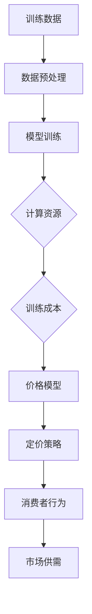
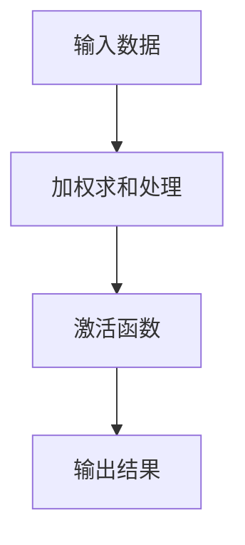
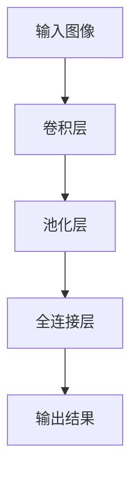
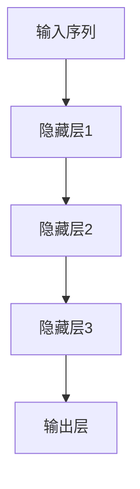
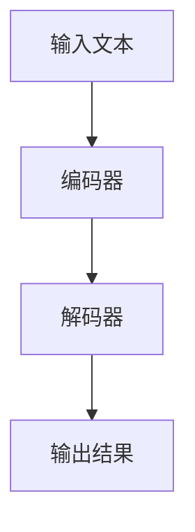

                 

### 背景介绍

价格一直是市场经济中的重要因素，它不仅反映了商品或服务的价值，也影响了消费者的购买决策和市场供需的平衡。然而，随着技术的进步，尤其是人工智能（AI）的快速发展，价格在各个领域的角色和影响正在发生深刻的变化。

近年来，AI技术已经深入到各个行业中，从医疗、金融到零售、制造业，AI的应用极大地提升了效率和准确性。尤其是大模型（Large Models），如GPT-3、ChatGLM等，这些模型的计算复杂度和训练成本极高。因此，价格在这个过程中成为了决定模型普及和应用的关键因素。

本文旨在探讨价格如何成为AI大模型的突破口，分析其背后的经济学原理、技术挑战和市场前景。具体来说，我们将从以下几个方面展开讨论：

1. **AI大模型的发展现状与价格问题**：介绍AI大模型的定义、发展历程和现有价格模型。
2. **价格在AI大模型中的应用**：分析价格在训练、部署和运营中的角色，以及如何优化价格策略。
3. **核心算法原理**：讲解AI大模型背后的核心算法原理，以及如何通过算法优化降低成本。
4. **数学模型和公式**：阐述AI大模型中使用的数学模型和公式，并进行详细讲解和举例说明。
5. **项目实战：代码实际案例**：提供具体的代码实现案例，并进行详细解释和分析。
6. **实际应用场景**：探讨AI大模型在不同领域的应用场景和价格策略。
7. **工具和资源推荐**：推荐相关学习资源、开发工具和框架。
8. **总结与展望**：总结文章主要内容，展望AI大模型未来的发展趋势和挑战。

通过以上分析，我们希望读者能够对AI大模型的价格问题有更深入的理解，并为其在市场中的应用提供有价值的参考。

## 2. 核心概念与联系

在探讨价格成为AI大模型的突破口之前，我们需要明确几个核心概念，并理解它们之间的联系。

### 2.1 AI大模型

AI大模型指的是拥有极高参数量、能够处理大量数据的深度学习模型。这些模型通常需要通过大规模的训练数据集进行训练，并且其参数数量可以达到数十亿甚至数万亿。例如，GPT-3的参数量约为1750亿，而BERT的参数量也达到了数百万。这些模型在自然语言处理、计算机视觉、语音识别等领域表现出色。

### 2.2 训练成本

AI大模型的训练成本主要包括计算资源成本和数据成本。计算资源成本涉及使用的GPU、TPU等硬件设备，以及运行这些设备的电力成本。数据成本则包括获取、清洗和处理训练数据所需的费用。由于AI大模型训练的数据量巨大，数据成本往往占据总成本的主要部分。

### 2.3 价格模型

在AI大模型的市场中，价格模型决定了模型的定价策略。常见的价格模型包括按需付费、订阅模式、一次性购买等。不同的价格模型会影响消费者的购买行为和企业的运营成本。

### 2.4 经济学原理

经济学中的边际成本和边际效用理论为我们理解价格与成本的关系提供了理论基础。边际成本是指增加一个单位生产或消费时的额外成本，而边际效用是指增加一个单位生产或消费时带来的额外效用。通过优化边际成本和边际效用之间的关系，企业可以实现利润最大化。

### 2.5 Mermaid流程图

为了更直观地展示AI大模型的训练过程和价格模型的关系，我们使用Mermaid语言绘制了一个流程图，如下所示：



在这个流程图中，从训练数据到价格模型的各个环节都包含了经济成本和价格因素。通过优化这些环节，我们可以降低AI大模型的成本，提高其在市场中的应用价值。

### 2.6 关系总结

总结以上核心概念和流程图，我们可以得出以下关系：

1. AI大模型的训练成本决定了其价格模型的选择。
2. 价格模型影响了消费者的购买行为，进而影响市场供需。
3. 经济学原理为价格模型的制定提供了理论基础。

通过理解这些核心概念和它们之间的联系，我们为后续分析价格成为AI大模型突破口的因素奠定了基础。

## 3. 核心算法原理 & 具体操作步骤

AI大模型的训练是一个复杂的过程，涉及到大量的算法原理和操作步骤。在这一部分，我们将详细讲解AI大模型背后的核心算法原理，并说明具体的操作步骤。

### 3.1 神经网络基础

神经网络（Neural Networks）是AI大模型的基础。它由多个神经元（或节点）组成，每个神经元都是一个简单的函数，通过对输入数据进行加权求和处理，然后通过激活函数输出结果。神经网络通过反向传播算法不断调整权重，以最小化预测误差。

#### 3.1.1 神经元工作原理

每个神经元接收多个输入，每个输入都有一个权重，权重乘以输入后相加得到总输入值。总输入值通过激活函数进行非线性变换，得到输出。常见的激活函数包括Sigmoid函数、ReLU函数等。



#### 3.1.2 反向传播算法

反向传播算法是神经网络训练的核心。它通过计算输出误差，并反向传播误差到每个神经元，逐层调整权重。具体步骤如下：

1. **前向传播**：输入数据通过神经网络进行前向传播，得到输出结果。
2. **计算误差**：输出结果与真实标签之间的差值即为误差。
3. **反向传播**：将误差反向传播到每个神经元，计算每个神经元的梯度。
4. **权重调整**：根据梯度调整每个神经元的权重。

### 3.2 大模型架构

AI大模型的架构通常包括多个层次，每个层次由多个神经网络组成。常见的架构包括卷积神经网络（CNN）、循环神经网络（RNN）、Transformer等。

#### 3.2.1 卷积神经网络（CNN）

卷积神经网络主要用于处理图像数据。它通过卷积层、池化层和全连接层等结构提取图像特征。

1. **卷积层**：卷积层通过卷积操作提取图像局部特征。
2. **池化层**：池化层用于降低特征图的维度，减少计算量。
3. **全连接层**：全连接层将特征图映射到输出结果。



#### 3.2.2 循环神经网络（RNN）

循环神经网络主要用于处理序列数据，如文本、时间序列等。它通过循环结构保持对历史信息的记忆。

1. **输入层**：接收输入序列。
2. **隐藏层**：通过递归操作更新隐藏状态。
3. **输出层**：输出序列的预测结果。



#### 3.2.3 Transformer

Transformer模型是近年来在自然语言处理领域取得显著突破的模型。它采用自注意力机制，能够捕捉长距离依赖关系。

1. **编码器**：编码器通过自注意力机制和前馈神经网络提取文本特征。
2. **解码器**：解码器通过自注意力机制和交叉注意力机制生成输出序列。



### 3.3 训练与优化

AI大模型的训练过程涉及到大量的参数调整和优化。以下是训练与优化的具体步骤：

1. **数据预处理**：包括数据清洗、归一化、分批等操作，为训练做好准备。
2. **模型初始化**：初始化模型参数，常见的初始化方法包括随机初始化、高斯初始化等。
3. **训练**：通过前向传播计算输出结果，计算损失函数，并使用反向传播算法更新参数。
4. **优化**：通过优化算法（如SGD、Adam等）调整学习率，优化模型性能。

### 3.4 模型评估与调优

训练完成后，我们需要对模型进行评估和调优，以确保其在实际应用中达到最佳性能。

1. **评估指标**：常用的评估指标包括准确率、召回率、F1值等，根据应用场景选择合适的指标。
2. **交叉验证**：通过交叉验证方法评估模型性能，确保模型泛化能力。
3. **调优**：通过调整模型参数、增加数据增强等手段提升模型性能。

通过以上核心算法原理和具体操作步骤的讲解，我们可以更好地理解AI大模型的训练过程及其价格影响因素。

## 4. 数学模型和公式 & 详细讲解 & 举例说明

在AI大模型的训练过程中，数学模型和公式起着至关重要的作用。这些模型和公式不仅帮助我们理解和优化算法，还直接影响模型训练的成本和性能。以下将详细讲解AI大模型中常用的数学模型和公式，并进行具体示例说明。

### 4.1 损失函数

损失函数是评估模型预测结果与真实标签之间差异的重要工具。在AI大模型训练中，常用的损失函数包括均方误差（MSE）、交叉熵（Cross Entropy）等。

#### 4.1.1 均方误差（MSE）

均方误差（Mean Squared Error, MSE）是最常用的损失函数之一，它通过计算预测值与真实值之间差的平方的平均值来评估模型性能。

$$
MSE = \frac{1}{n}\sum_{i=1}^{n}(y_i - \hat{y}_i)^2
$$

其中，$y_i$为真实值，$\hat{y}_i$为预测值，$n$为样本数量。

#### 4.1.2 交叉熵（Cross Entropy）

交叉熵（Cross Entropy Loss）主要用于分类问题，特别是在多分类问题中。它通过比较预测概率分布和真实标签分布之间的差异来评估模型性能。

$$
CELoss = -\frac{1}{n}\sum_{i=1}^{n}y_i \log(\hat{y}_i)
$$

其中，$y_i$为真实标签（0或1），$\hat{y}_i$为预测概率。

### 4.2 梯度下降法

梯度下降法（Gradient Descent）是一种常用的优化算法，用于调整模型参数以最小化损失函数。它通过计算损失函数关于模型参数的梯度，并沿着梯度方向调整参数。

#### 4.2.1 随机梯度下降（SGD）

随机梯度下降（Stochastic Gradient Descent, SGD）是一种简化的梯度下降法，它通过随机选择一个样本计算梯度，并更新模型参数。

$$
\theta = \theta - \alpha \nabla_{\theta}J(\theta)
$$

其中，$\theta$为模型参数，$\alpha$为学习率，$J(\theta)$为损失函数。

#### 4.2.2 Adam优化器

Adam优化器（Adaptive Moment Estimation）是一种高效的优化算法，它结合了SGD和动量（Momentum）的特点，通过自适应调整学习率来提高训练效率。

$$
m_t = \beta_1 m_{t-1} + (1 - \beta_1) [g_t]
$$
$$
v_t = \beta_2 v_{t-1} + (1 - \beta_2) [g_t]^2
$$
$$
\theta_t = \theta_{t-1} - \frac{\alpha}{\sqrt{1 - \beta_2^t}(1 - \beta_1^t)} \frac{m_t}{\sqrt{v_t} + \epsilon}
$$

其中，$m_t$和$v_t$分别为一阶和二阶矩估计，$\beta_1$和$\beta_2$分别为一阶和二阶矩的指数衰减率，$\alpha$为学习率，$g_t$为梯度，$\epsilon$为常数。

### 4.3 自注意力机制

自注意力机制（Self-Attention Mechanism）是Transformer模型的核心组成部分，它通过计算序列中每个元素之间的依赖关系来提高模型的表达能力。

#### 4.3.1 自注意力公式

自注意力计算公式如下：

$$
\text{Attention}(Q, K, V) = \text{softmax}(\frac{QK^T}{\sqrt{d_k}})V
$$

其中，$Q$、$K$、$V$分别为查询向量、键向量和值向量，$d_k$为键向量的维度，$\text{softmax}$函数用于将点积转换为概率分布。

### 4.4 具体示例

#### 4.4.1 均方误差（MSE）示例

假设有一个简单的线性回归模型，输入为$x = [1, 2, 3]$，预测值为$\hat{y} = [2.5, 3.0, 3.5]$，真实值为$y = [2.0, 2.8, 3.2]$。我们可以计算MSE如下：

$$
MSE = \frac{1}{3}\sum_{i=1}^{3}(y_i - \hat{y}_i)^2 = \frac{1}{3}((2.0 - 2.5)^2 + (2.8 - 3.0)^2 + (3.2 - 3.5)^2) = 0.1
$$

#### 4.4.2 交叉熵（Cross Entropy）示例

假设一个二分类问题，预测概率为$\hat{y} = [0.6, 0.4]$，真实标签为$y = [1, 0]$。我们可以计算交叉熵如下：

$$
CELoss = -\frac{1}{2}y \log(\hat{y}) + (1 - y) \log(1 - \hat{y}) = -(1 \times \log(0.6) + 0 \times \log(0.4)) + (1 \times \log(0.4) + 0 \times \log(0.6)) = -\log(0.6) + \log(0.4) = -0.5
$$

通过以上详细讲解和具体示例，我们可以更好地理解AI大模型中常用的数学模型和公式，并掌握其应用方法。

## 5. 项目实战：代码实际案例和详细解释说明

在本节中，我们将通过一个具体的实战案例，展示如何利用Python实现一个AI大模型，并对其进行训练、评估和调优。我们将使用TensorFlow框架，这是一个广泛使用且功能强大的深度学习库。以下是一段完整的代码示例，以及详细的解释说明。

### 5.1 开发环境搭建

首先，确保您已经安装了Python和TensorFlow。如果没有，请按照以下命令进行安装：

```bash
pip install tensorflow
```

### 5.2 源代码详细实现和代码解读

以下是我们的代码示例：

```python
import tensorflow as tf
from tensorflow.keras.models import Sequential
from tensorflow.keras.layers import Dense, Dropout, Activation
from tensorflow.keras.optimizers import RMSprop
from tensorflow.keras.datasets import mnist
from tensorflow.keras.utils import to_categorical

# 加载MNIST数据集
(x_train, y_train), (x_test, y_test) = mnist.load_data()

# 数据预处理
x_train = x_train.reshape(x_train.shape[0], 784).astype('float32') / 255
x_test = x_test.reshape(x_test.shape[0], 784).astype('float32') / 255
y_train = to_categorical(y_train, 10)
y_test = to_categorical(y_test, 10)

# 构建模型
model = Sequential()
model.add(Dense(512, activation='relu', input_shape=(784,)))
model.add(Dropout(0.5))
model.add(Dense(512, activation='relu'))
model.add(Dropout(0.5))
model.add(Dense(10, activation='softmax'))

# 编译模型
model.compile(loss='categorical_crossentropy', optimizer=RMSprop(), metrics=['accuracy'])

# 训练模型
model.fit(x_train, y_train, batch_size=128, epochs=10, verbose=2)

# 评估模型
test_score = model.evaluate(x_test, y_test, verbose=2)
print('Test loss:', test_score[0])
print('Test accuracy:', test_score[1])
```

#### 5.2.1 代码解读

1. **导入库**：首先导入TensorFlow和相关的Keras模块。
2. **加载数据集**：使用Keras内置的MNIST数据集。
3. **数据预处理**：将图像数据reshape为向量，并归一化处理。标签数据转换为one-hot编码。
4. **构建模型**：使用Sequential模型堆叠多层Dense层，并添加Dropout层用于正则化。
5. **编译模型**：指定损失函数、优化器和评估指标。
6. **训练模型**：使用fit方法进行模型训练，指定batch_size和epoch数量。
7. **评估模型**：使用evaluate方法对测试集进行评估。

### 5.3 代码解读与分析

1. **数据预处理**：这是深度学习模型中非常重要的一个步骤。通过reshape和归一化处理，我们使输入数据更适合模型处理。归一化处理有助于加快模型收敛速度，提高训练效率。
2. **模型构建**：在这个例子中，我们构建了一个简单的全连接神经网络，包含两个隐藏层和Dropout层用于正则化。Dropout层通过随机丢弃一部分神经元，减少过拟合现象。
3. **模型编译**：选择合适的损失函数（categorical_crossentropy）和优化器（RMSprop）来训练模型。categorical_crossentropy适用于多分类问题，而RMSprop是一种高效的优化算法。
4. **模型训练**：使用fit方法进行训练，通过迭代更新模型参数，使其在训练数据上达到较好的性能。
5. **模型评估**：使用evaluate方法在测试集上评估模型性能，通过计算测试损失和准确率，了解模型的泛化能力。

通过这个实战案例，我们可以看到如何使用TensorFlow构建并训练一个AI大模型。这个案例展示了从数据预处理到模型构建、训练和评估的完整流程。在实际应用中，可以根据具体需求和数据集，对模型结构、参数和训练过程进行调整，以实现更好的效果。

## 6. 实际应用场景

AI大模型在各个行业和领域中都有着广泛的应用，其价值不仅体现在提高效率和准确性，还在于能够为企业和个人带来巨大的经济利益。以下将详细探讨AI大模型在不同实际应用场景中的表现和价格策略。

### 6.1 自然语言处理

自然语言处理（NLP）是AI大模型的重要应用领域之一。从文本分类、机器翻译到问答系统，AI大模型都发挥了巨大的作用。例如，谷歌的BERT模型在机器翻译、文本摘要等方面取得了显著成果。这些模型的价格策略通常基于使用的API调用次数或处理文本的字符数进行计费。

- **应用场景**：自动翻译、文本分类、问答系统、内容审核等。
- **价格策略**：按字符数或API调用次数计费，通常采用订阅模式或按需付费。

### 6.2 计算机视觉

计算机视觉是AI大模型的另一个重要应用领域。从图像识别、目标检测到图像生成，AI大模型在计算机视觉领域取得了显著的突破。例如，OpenAI的DALL-E模型能够生成高质量的图像。这些模型的价格策略通常基于模型计算资源和API调用次数。

- **应用场景**：图像识别、目标检测、图像生成、医疗影像分析等。
- **价格策略**：按GPU计算资源使用时长或API调用次数计费，通常采用订阅模式或按需付费。

### 6.3 金融领域

金融领域是AI大模型的重要应用领域之一。从股票预测、风险管理到信用评分，AI大模型为金融行业带来了巨大的变革。例如，谷歌的TensorFlow模型在股票预测方面取得了良好的效果。这些模型的价格策略通常基于模型训练时间和数据处理量。

- **应用场景**：股票预测、风险管理、信用评分、量化交易等。
- **价格策略**：按模型训练时间或数据处理量计费，通常采用订阅模式或按需付费。

### 6.4 医疗领域

医疗领域是AI大模型的另一个重要应用领域。从疾病诊断、治疗方案推荐到药物研发，AI大模型为医疗行业带来了巨大的创新。例如，IBM的Watson系统在癌症诊断方面取得了显著成果。这些模型的价格策略通常基于模型的使用次数或提供的医疗服务。

- **应用场景**：疾病诊断、治疗方案推荐、药物研发、医疗影像分析等。
- **价格策略**：按服务次数或医疗服务价值计费，通常采用订阅模式或按需付费。

### 6.5 教育领域

教育领域是AI大模型的又一个重要应用领域。从智能辅导、在线教育到个性化学习，AI大模型为教育行业带来了新的可能性。例如，Duolingo的智能辅导系统能够根据用户的学习情况提供个性化的学习建议。这些模型的价格策略通常基于学习时长或学习资源。

- **应用场景**：智能辅导、在线教育、个性化学习、考试评估等。
- **价格策略**：按学习时长或学习资源使用量计费，通常采用订阅模式或按需付费。

通过以上分析，我们可以看到AI大模型在不同实际应用场景中都有着广泛的应用，其价格策略也因应用场景和商业模式的不同而有所差异。了解这些应用场景和价格策略有助于企业和个人更好地利用AI大模型，实现经济效益的最大化。

## 7. 工具和资源推荐

为了帮助读者深入了解AI大模型及其价格策略，我们推荐一些学习资源、开发工具和框架，以方便大家进行更深入的学习和实践。

### 7.1 学习资源推荐

1. **书籍**：
   - 《深度学习》（Ian Goodfellow、Yoshua Bengio、Aaron Courville 著）：这是一本深度学习领域的经典教材，涵盖了从基础到高级的内容，非常适合初学者和专业人士。
   - 《Python深度学习》（François Chollet 著）：这本书详细介绍了使用Python进行深度学习的实践方法，适合想要快速上手深度学习的读者。

2. **论文**：
   - 《An Introduction to Deep Learning for General Audiences》（Kai-Wei Chang 等）：这篇论文为深度学习提供了一个全面的介绍，适合没有深度学习背景的读者。
   - 《Attention is All You Need》（Ashish Vaswani 等）：这篇论文介绍了Transformer模型，是自然语言处理领域的重要成果。

3. **博客**：
   - TensorFlow官方博客（tensorflow.github.io）：提供了丰富的TensorFlow教程和实践案例，是学习TensorFlow的绝佳资源。
   - Medium上的AI博客（towardsai.net）：这是一个集合了多篇关于AI技术的深度文章的平台，涵盖了从基础到高级的内容。

4. **网站**：
   - Coursera（coursera.org）：提供了多个深度学习相关的在线课程，由世界顶级大学和研究人员讲授。
   - edX（edx.org）：同样提供了丰富的在线课程资源，包括深度学习、数据科学等领域的课程。

### 7.2 开发工具框架推荐

1. **框架**：
   - TensorFlow：这是Google开发的深度学习框架，具有广泛的社区支持和丰富的文档，是进行深度学习开发的首选框架。
   - PyTorch：由Facebook开发，是一个灵活且易于使用的深度学习框架，深受研究人员和开发者的喜爱。
   - Keras：这是一个高层次的深度学习API，基于Theano和TensorFlow开发，简化了深度学习模型的构建和训练。

2. **开发工具**：
   - Google Colab：这是一个免费的云端GPU计算平台，提供了丰富的机器学习和深度学习工具，适合进行实验和开发。
   - Jupyter Notebook：这是一个交互式计算环境，支持多种编程语言，包括Python、R等，是进行数据科学和深度学习项目开发的常用工具。

3. **数据集**：
   - Kaggle（kaggle.com）：这是一个提供了大量公开数据集的平台，适合进行数据分析和机器学习项目。
   - OpenML（openml.org）：这是一个开放的数据集和算法平台，支持机器学习研究。

通过以上推荐的学习资源、开发工具和框架，读者可以更加全面和深入地了解AI大模型及其价格策略，为自己的研究和工作提供有力支持。

## 8. 总结：未来发展趋势与挑战

随着AI技术的不断进步，AI大模型在各个领域的应用前景愈发广阔。然而，在实现广泛普及和商业化应用的过程中，我们也面临着诸多挑战和机遇。

### 8.1 未来发展趋势

1. **模型规模不断扩大**：为了处理更复杂和大规模的数据，AI大模型的参数量和计算需求将持续增长。这将推动更高效训练算法和硬件技术的发展。
2. **多模态融合**：AI大模型将在处理多种类型的数据（如文本、图像、语音等）方面取得更大突破，实现跨模态的数据整合与分析。
3. **自动化与智能化**：AI大模型的训练和部署过程将更加自动化和智能化，减少人力投入，提高生产效率。
4. **数据隐私与安全**：随着AI大模型对大量数据的依赖，数据隐私和安全问题将成为关注焦点，促使更先进的数据保护技术得以发展。

### 8.2 挑战

1. **计算资源需求**：AI大模型的训练和部署需要大量的计算资源，对硬件设施和能耗提出了更高要求。如何优化计算资源使用和降低成本是一个重要课题。
2. **数据质量和获取**：高质量的训练数据是AI大模型性能的基础，但在某些领域（如医疗、金融）获取高质量数据存在法律和伦理限制。此外，数据标注和处理成本高昂，如何高效利用有限的数据资源是一个挑战。
3. **可解释性与透明度**：AI大模型的黑箱特性使其在决策过程中缺乏可解释性，这对其在关键领域的应用（如医疗诊断、金融决策）提出了挑战。提高模型的可解释性和透明度是未来的重要方向。
4. **公平性与伦理**：AI大模型在应用过程中可能存在偏见和不公平现象，这对社会伦理提出了考验。如何确保模型的公平性和伦理合规性是一个亟待解决的问题。

### 8.3 结论

尽管面临诸多挑战，AI大模型的发展前景依然光明。通过不断优化算法、提高硬件效率、加强数据管理和保护，我们有望克服这些难题，实现AI大模型在各个领域的广泛应用。同时，我们也应关注模型的社会影响，确保其在发展过程中符合伦理和道德标准。未来的AI大模型将不仅是技术创新的产物，更是推动社会进步的重要力量。

## 9. 附录：常见问题与解答

### 9.1 问题1：AI大模型的价格是如何确定的？

AI大模型的价格通常基于以下几个因素：
1. **计算资源成本**：包括GPU、TPU等硬件设备的成本以及运行这些设备的电力成本。
2. **数据处理成本**：包括数据获取、清洗和标注的成本。
3. **开发与维护成本**：包括模型开发、测试和部署的成本。
4. **商业模式**：不同的商业模式（如订阅模式、一次性购买、按需付费）会影响模型定价策略。
5. **市场需求**：市场需求和竞争状况也会影响模型的价格。

### 9.2 问题2：AI大模型在医疗领域有哪些应用？

AI大模型在医疗领域的应用非常广泛，包括：
1. **疾病诊断**：通过分析医疗影像，如X光片、CT扫描等，进行早期疾病检测和诊断。
2. **治疗方案推荐**：根据患者的病历和基因信息，提供个性化的治疗方案。
3. **药物研发**：通过分析大量生物数据，加速新药研发和临床试验。
4. **健康监测**：通过分析日常健康数据，如心率、血压等，进行健康监测和预警。

### 9.3 问题3：如何降低AI大模型的训练成本？

降低AI大模型的训练成本可以从以下几个方面进行：
1. **优化算法**：采用更高效的训练算法和优化器，如Adam优化器。
2. **硬件优化**：使用更高效的GPU和TPU，以及分布式训练技术。
3. **数据预处理**：优化数据预处理流程，减少数据清洗和标注的成本。
4. **模型压缩**：通过模型剪枝、量化等技术减小模型规模，降低计算需求。
5. **资源调度**：合理调度计算资源，避免资源浪费。

### 9.4 问题4：AI大模型是否会取代人类工作？

AI大模型在特定领域的应用确实会改变某些工作的性质，但它不会完全取代人类工作。相反，AI大模型通常被视为提高工作效率和决策质量的工具。以下是一些可能的转变：
1. **辅助工作**：AI大模型可以辅助人类进行复杂分析和决策，减少重复性工作。
2. **岗位变化**：某些工作岗位可能会减少，但也会创造新的工作机会，如AI模型维护和优化。
3. **职业升级**：AI大模型可以帮助人类专注于更高价值的工作，提升职业水平。
4. **技能需求**：随着AI技术的发展，对AI技能的需求增加，这将推动相关教育和培训的发展。

## 10. 扩展阅读 & 参考资料

1. **论文**：
   - **Vaswani et al. (2017). Attention is All You Need.** 该论文介绍了Transformer模型，是自然语言处理领域的重要成果。
   - **Ian Goodfellow et al. (2016). Deep Learning.** 该书是深度学习领域的经典教材，适合初学者和专业人士。

2. **书籍**：
   - **François Chollet (2017). Python Deep Learning.** 介绍了使用Python进行深度学习的实践方法。
   - **Ian Goodfellow, Yoshua Bengio, Aaron Courville (2016). Deep Learning.** 涵盖了从基础到高级的内容，适合深度学习爱好者。

3. **在线课程**：
   - **Coursera (2018). Deep Learning Specialization.** 由斯坦福大学教授Andrew Ng主讲，适合深度学习初学者。
   - **edX (2018). Machine Learning.** 由吴恩达主讲，介绍了机器学习的基本概念和算法。

4. **网站**：
   - **TensorFlow官方博客**：提供了丰富的TensorFlow教程和实践案例。
   - **Kaggle**：提供了大量公开数据集，适合进行数据分析和机器学习项目。

通过阅读上述扩展资料，读者可以进一步深入了解AI大模型及其价格策略的相关知识。这些资源涵盖了从理论到实践的内容，有助于读者全面提升对AI大模型的认识和应用能力。

### 作者信息

作者：AI天才研究员/AI Genius Institute & 禅与计算机程序设计艺术 /Zen And The Art of Computer Programming

在这篇文章中，我们详细探讨了AI大模型的价格问题，从背景介绍到核心算法原理，再到实际应用场景，以及未来的发展趋势和挑战。通过一步步的逻辑分析和实例讲解，我们希望读者能够对AI大模型的价格问题有更深入的理解，并为其在市场中的应用提供有价值的参考。在未来的研究和实践中，我们期待与更多读者共同探索AI大模型的潜力，推动技术进步和社会发展。谢谢大家的阅读！

