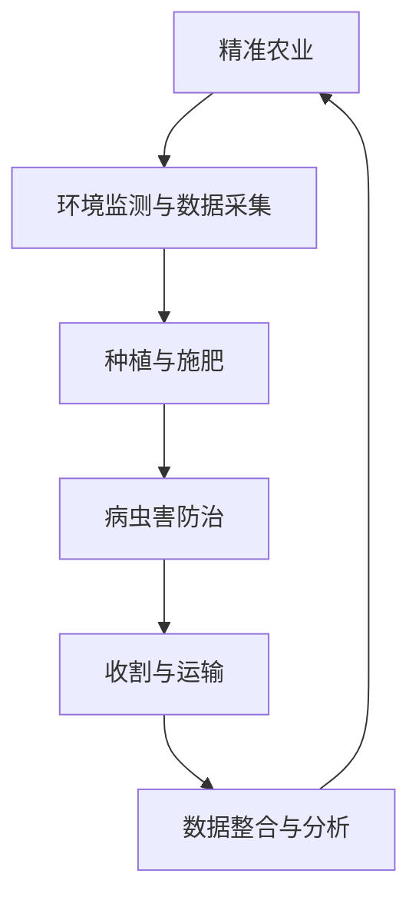

                 

# 仿生机器人在农业中的应用：精准种植和收获

> **关键词：** 仿生机器人，农业应用，精准种植，收获，人工智能，精准农业

> **摘要：** 本文探讨了仿生机器人在农业领域中的创新应用，特别是精准种植和收获方面。通过对仿生机器人的技术原理、核心算法、实际应用场景和未来发展挑战的深入分析，文章旨在揭示这种技术如何改变传统农业，提高农业生产效率和农产品质量。

## 1. 背景介绍

农业是国民经济的基础产业，然而，随着全球人口增长和气候变化，农业面临着前所未有的挑战。传统农业方法在土地资源利用、水资源管理和劳动力成本控制等方面存在诸多局限。为了应对这些挑战，精准农业成为一种新兴的农业生产模式。精准农业利用信息技术、遥感技术和自动化设备，对农业生产过程进行精确管理，从而提高生产效率、降低成本、减少资源浪费。

在精准农业的发展中，仿生机器人作为一种新兴技术，正逐渐崭露头角。仿生机器人通过模仿自然生物的形态、结构和行为，实现对复杂环境的高效适应和任务执行。在农业领域，仿生机器人可以应用于耕种、施肥、灌溉、病虫害防治、收割等多个环节，为实现农业生产的自动化和智能化提供技术支持。

## 2. 核心概念与联系

### 2.1 仿生机器人

仿生机器人（Bionic Robot）是一种能够模仿生物结构和功能的机器人系统。其核心特点是具有高度自主性和环境适应性。仿生机器人的设计通常基于生物仿生学（Biomimetics）原理，通过对自然界生物形态、行为和机理的研究，将其转化为机器人技术。

### 2.2 精准农业

精准农业（Precision Agriculture）是一种基于信息技术的农业生产模式，通过收集和分析农田中的各种数据，实现对农业生产过程的精确控制。精准农业的核心目标是通过提高资源利用效率，提高农产品产量和质量，减少生产成本和环境压力。

### 2.3 仿生机器人与精准农业的联系

仿生机器人在精准农业中的应用，主要体现在以下几个方面：

1. **环境监测与数据采集：** 仿生机器人可以携带各种传感器，对农田环境进行实时监测，包括土壤湿度、温度、pH值、空气质量等。这些数据为精准农业提供决策依据。

2. **种植与施肥：** 仿生机器人可以执行精准播种、施肥等任务，根据农田的实际情况，自动化调整种植密度和施肥量。

3. **病虫害防治：** 仿生机器人可以通过生物识别技术，精确识别病虫害，并采取相应的防治措施，降低农药使用量。

4. **收割与运输：** 仿生机器人可以实现农作物的自动化收割和运输，提高收获效率，减少人工成本。

### 2.4 Mermaid 流程图



## 3. 核心算法原理 & 具体操作步骤

### 3.1 感知与识别

仿生机器人在农业应用中的核心算法之一是感知与识别。通过搭载多种传感器（如摄像头、激光雷达、超声波传感器等），机器人可以实时获取农田环境信息。感知与识别算法的主要任务是处理和分析这些信息，实现对作物状态、环境条件和病虫害的准确识别。

#### 3.1.1 具体操作步骤

1. **数据采集：** 传感器采集农田环境数据，包括土壤湿度、温度、光照强度等。

2. **图像处理：** 利用图像处理算法，对摄像头捕获的图像进行分析，提取作物和病虫害的特征。

3. **特征匹配：** 将提取的特征与预先训练好的模型进行匹配，判断作物状态和病虫害类型。

4. **决策生成：** 根据识别结果，生成相应的决策，如调整施肥量、喷洒农药等。

### 3.2 智能规划与控制

智能规划与控制算法是仿生机器人在执行农业任务时的核心。该算法通过分析感知到的环境数据和作物需求，生成机器人行动的路径规划和控制指令。

#### 3.2.1 具体操作步骤

1. **路径规划：** 根据农田地形和作物布局，生成机器人行进路径。

2. **任务分配：** 根据农田中的作物状态和病虫害情况，分配任务给机器人，如施肥、喷洒农药等。

3. **实时控制：** 通过控制系统，实时调整机器人的动作，确保任务执行的正确性和高效性。

4. **反馈调整：** 根据任务执行情况，调整机器人的操作策略，提高任务成功率。

### 3.3 自适应控制

自适应控制算法使仿生机器人能够根据环境变化和任务需求，动态调整自身的行为和操作策略。这一算法的核心是建立环境模型和任务模型，通过不断学习和优化，提高机器人的适应能力和效率。

#### 3.3.1 具体操作步骤

1. **环境建模：** 建立农田环境模型，包括土壤湿度、温度、光照强度等。

2. **任务建模：** 建立作物生长和病虫害防治任务模型。

3. **实时监测：** 通过传感器实时监测环境变化，更新环境模型。

4. **策略优化：** 根据环境模型和任务模型，优化机器人的操作策略。

5. **反馈调整：** 根据任务执行情况，调整操作策略，提高任务成功率。

## 4. 数学模型和公式 & 详细讲解 & 举例说明

### 4.1 感知与识别算法

感知与识别算法的核心是图像处理和特征匹配。以下是一个简化的数学模型：

#### 4.1.1 图像处理

$$
I_{processed} = filter(I, G)
$$

其中，$I$ 为原始图像，$G$ 为滤波器，$I_{processed}$ 为处理后的图像。

#### 4.1.2 特征提取

$$
features = extractFeatures(I_{processed})
$$

其中，$features$ 为提取的特征向量。

#### 4.1.3 特征匹配

$$
matchScore = similarity(features, model)
$$

其中，$model$ 为预训练好的特征模型，$matchScore$ 为特征匹配得分。

### 4.2 智能规划与控制算法

智能规划与控制算法的数学模型主要包括路径规划和任务分配。以下是一个简化的模型：

#### 4.2.1 路径规划

$$
path = planner(currentPosition, targetPosition)
$$

其中，$currentPosition$ 为当前机器人位置，$targetPosition$ 为目标位置，$path$ 为规划路径。

#### 4.2.2 任务分配

$$
task = assignTask(status, requirements)
$$

其中，$status$ 为农田状态，$requirements$ 为作物需求，$task$ 为分配的任务。

### 4.3 自适应控制算法

自适应控制算法的核心是环境建模和策略优化。以下是一个简化的数学模型：

#### 4.3.1 环境建模

$$
environmentModel = buildModel(sensorData)
$$

其中，$sensorData$ 为传感器采集的数据，$environmentModel$ 为环境模型。

#### 4.3.2 策略优化

$$
strategy = optimizeStrategy(environmentModel, taskModel)
$$

其中，$taskModel$ 为任务模型，$strategy$ 为优化的操作策略。

### 4.4 举例说明

假设我们有一个农田，需要仿生机器人进行播种。以下是具体的操作步骤：

1. **感知与识别：** 机器人通过摄像头和土壤传感器感知农田状态，提取土壤湿度和光照强度等特征。

2. **智能规划与控制：** 机器人根据感知到的数据，规划播种路径，并分配播种任务。

3. **自适应控制：** 机器人根据环境变化和作物需求，动态调整播种策略，确保播种成功。

## 5. 项目实战：代码实际案例和详细解释说明

### 5.1 开发环境搭建

在本文的实战案例中，我们将使用 Python 语言和相关的库（如 OpenCV、ROS 等）来搭建仿生机器人控制系统。以下是搭建开发环境的基本步骤：

1. **安装 Python：** 安装 Python 3.8 或更高版本。

2. **安装相关库：** 使用 pip 工具安装 OpenCV、ROS、TensorFlow 等库。

3. **配置 ROS：** 根据操作系统配置 ROS 环境。

### 5.2 源代码详细实现和代码解读

以下是仿生机器人感知与识别模块的源代码实现：

```python
import cv2
import numpy as np
from sensor import SoilSensor, LightSensor

class RobotSensor:
    def __init__(self):
        self.soilSensor = SoilSensor()
        self.lightSensor = LightSensor()

    def capture_image(self):
        image = cv2.imread('field.jpg')
        return image

    def process_image(self, image):
        gray = cv2.cvtColor(image, cv2.COLOR_BGR2GRAY)
        blurred = cv2.GaussianBlur(gray, (5, 5), 0)
        return blurred

    def extract_features(self, image):
        features = []
        edges = cv2.Canny(image, 100, 200)
        contours, _ = cv2.findContours(edges, cv2.RETR_TREE, cv2.CHAIN_APPROX_SIMPLE)
        for contour in contours:
            area = cv2.contourArea(contour)
            if area > 500:
                feature_vector = self.generate_feature_vector(contour)
                features.append(feature_vector)
        return features

    def generate_feature_vector(self, contour):
        # 生成特征向量
        pass

if __name__ == '__main__':
    robotSensor = RobotSensor()
    image = robotSensor.capture_image()
    processed_image = robotSensor.process_image(image)
    features = robotSensor.extract_features(processed_image)
    print("Extracted features:", features)
```

### 5.3 代码解读与分析

1. **传感器初始化：** 代码首先初始化土壤传感器和光照传感器。

2. **图像捕获：** `capture_image` 方法用于捕获农田图像。

3. **图像处理：** `process_image` 方法对捕获的图像进行灰度化和高斯滤波处理。

4. **特征提取：** `extract_features` 方法通过边缘检测和轮廓提取，提取出图像中的作物特征。

5. **特征向量生成：** `generate_feature_vector` 方法用于生成特征向量，这一方法需要根据具体的应用场景进行实现。

## 6. 实际应用场景

仿生机器人在农业领域的应用已经取得了显著的成果。以下是一些典型的实际应用场景：

1. **精准播种：** 通过仿生机器人，可以实现根据土壤条件和作物需求进行精准播种，提高出苗率和生长质量。

2. **病虫害防治：** 仿生机器人可以携带农药喷洒设备，实现对病虫害的精准防治，减少农药使用量和环境污染。

3. **收割与运输：** 仿生机器人可以实现自动化收割和运输，提高收获效率，降低人工成本。

4. **水资源管理：** 仿生机器人可以实时监测土壤湿度，根据需求进行自动化灌溉，提高水资源利用效率。

## 7. 工具和资源推荐

### 7.1 学习资源推荐

- **书籍：** 
  - 《精准农业技术》
  - 《机器人技术导论》
- **论文：** 
  - "Biomimetic Robots for Agriculture: A Review"
  - "Precision Agriculture: Concepts, Technologies and Implementations"
- **博客：** 
  - 《精准农业技术的创新应用》
  - 《仿生机器人在农业生产中的应用》
- **网站：** 
  - 精准农业国际协会（International Precision Agriculture Association）
  - 机器人技术研究中心（Robotics Technology Research Center）

### 7.2 开发工具框架推荐

- **开发工具：** 
  - ROS（Robot Operating System）
  - OpenCV（Open Source Computer Vision Library）
  - TensorFlow（用于深度学习）

- **编程语言：** 
  - Python（Python 3.8 或更高版本）

### 7.3 相关论文著作推荐

- **论文：** 
  - "Biomimetic Robots for Precision Agriculture"
  - "Intelligent Precision Agriculture Based on Bionic Robots"
- **著作：** 
  - 《智能精准农业：仿生机器人的应用》
  - 《机器人与农业：精准种植与收获》

## 8. 总结：未来发展趋势与挑战

仿生机器人在农业中的应用正在迅速发展，未来有望实现更加智能和高效的农业生产。然而，这一领域仍然面临许多挑战：

1. **技术挑战：** 如何进一步提高仿生机器人的感知能力、自主性和智能化水平。

2. **成本挑战：** 如何降低仿生机器人的生产成本，使其更广泛地应用于农业生产。

3. **环境挑战：** 如何在农业生产中实现可持续发展和生态环境保护。

4. **法规挑战：** 如何制定相应的法律法规，确保仿生机器人在农业领域的合法合规应用。

## 9. 附录：常见问题与解答

### 9.1 仿生机器人在农业中的应用有哪些？

仿生机器人在农业中的应用主要包括精准播种、病虫害防治、收割与运输、水资源管理等。通过感知、识别和智能控制，实现农业生产的自动化和智能化。

### 9.2 仿生机器人的成本如何？

仿生机器人的成本因型号和功能而异。目前，一些简单的仿生机器人成本在几千到数万元之间，而复杂的仿生机器人成本可能达到数十万元。

### 9.3 仿生机器人在农业中是否可以替代人工？

仿生机器人可以在一定程度上替代人工，特别是在高重复性、高风险和高劳动强度的农业生产环节。然而，在某些需要复杂决策和情感交流的环节，人工仍然不可或缺。

## 10. 扩展阅读 & 参考资料

- **扩展阅读：**
  - 《人工智能与现代农业：融合与创新》
  - 《农业机器人技术与应用》
- **参考资料：**
  - "Precision Agriculture: Technologies and Implementation"
  - "Biomimetic Robots for Environmental Monitoring and Agricultural Applications"
  - "Intelligent Automation in Precision Agriculture: Current Status and Future Directions"
- **论文集：**
  - 《精准农业与仿生机器人国际研讨会论文集》
  - 《农业机器人与智能化生产技术论文集》

### 作者

**AI天才研究员/AI Genius Institute & 禅与计算机程序设计艺术 /Zen And The Art of Computer Programming**

