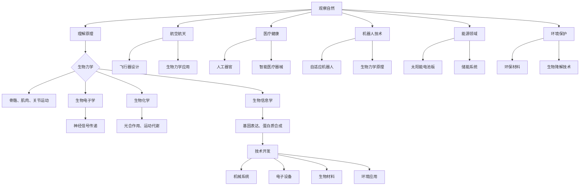

                 

### 背景介绍

在当今的科技发展浪潮中，仿生科技正逐渐成为创新的重要推动力。仿生学（Bionics）是一门跨学科的研究领域，它通过模仿自然界中生物的结构和功能，来设计出具有类似特性的机械系统和技术装置。从鸟类翅膀的仿生飞行器，到模仿植物光合作用的太阳能电池板，仿生科技的进步正在改变我们的生活方式和工业生产方式。

本篇文章旨在探讨仿生科技在创业领域中的应用，以及如何通过向自然学习来开拓创新的路径。我们将在以下章节中深入分析仿生科技的核心概念、算法原理、数学模型、实际项目案例，并探讨其应用场景和未来发展趋势。

首先，让我们简要回顾一下仿生科技的发展历史。自20世纪以来，随着科技的进步，仿生学逐渐从概念走向实际应用。1950年代，霍普金斯大学的天文学家卡尔·萨根提出了“三定律”，成为仿生设计的重要理论依据。随后，计算机科学和工程学的快速发展为仿生技术的实现提供了强有力的支持。进入21世纪，随着人工智能、大数据和物联网等新兴技术的融合，仿生科技迎来了前所未有的发展机遇。

文章的核心关键词包括：仿生科技、创业、创新、自然学习、算法原理、数学模型、项目实战和应用场景。通过这些关键词，我们将逐步探讨仿生科技在创业中的潜在价值，以及如何将其应用于实际项目中。

### 2. 核心概念与联系

#### 仿生科技的内涵

仿生科技（Bionic Technology）是一门将自然界生物的结构和功能特性应用于工程和科学设计的学科。它旨在通过模仿自然界中的生物系统，设计出具有高度功能性和适应性的技术产品。仿生科技的核心概念可以概括为“观察-理解-复制”。

- **观察**：通过观察自然界中的生物系统，了解其结构、功能和行为模式。
- **理解**：深入研究生物系统的基本原理，包括生物力学、生理学、生物化学等。
- **复制**：将理解到的原理应用于技术设计和开发，创造出具有类似功能的机械或电子设备。

#### 仿生科技的应用领域

仿生科技的应用领域非常广泛，涵盖了多个行业和学科。以下是一些主要的应用领域：

1. **航空航天**：模仿鸟类的翅膀和鲸鱼的皮肤，设计出更加高效和节能的飞行器。
2. **医疗健康**：通过模仿人体器官和神经系统，研发出人工器官和智能医疗器械。
3. **机器人技术**：模仿生物的运动机制，设计出具有自适应能力的机器人。
4. **能源领域**：模仿植物的光合作用，开发出高效的太阳能电池板和储能系统。
5. **环境保护**：利用仿生技术设计出具有环境友好特性的材料和应用方案。

#### 仿生科技的核心原理

仿生科技的核心原理包括生物力学、生物电子学、生物化学和生物信息学等多个方面。以下是一些关键的原理：

- **生物力学**：研究生物体的结构和运动机制，如骨骼、肌肉和关节的运动原理。
- **生物电子学**：研究生物体中的电子信号传递和传感机制，如神经元的电信号传递。
- **生物化学**：研究生物体的化学反应和能量转换过程，如植物的光合作用和动物的运动代谢。
- **生物信息学**：研究生物体的基因表达、蛋白质合成和细胞通讯等过程。

#### 核心概念原理与架构的 Mermaid 流程图

以下是仿生科技核心概念原理与架构的 Mermaid 流程图，用于更直观地展示仿生科技的发展路径和应用领域。



通过这个 Mermaid 流程图，我们可以清晰地看到仿生科技从观察自然、理解原理，到技术开发和应用的全过程。

### 3. 核心算法原理 & 具体操作步骤

在仿生科技的应用中，核心算法的原理和具体操作步骤至关重要。以下是几个关键的算法原理及其操作步骤。

#### 1. 遗传算法（Genetic Algorithm）

遗传算法是一种模拟自然进化过程的优化算法，广泛应用于优化问题、机器学习、计算机视觉等领域。其基本原理如下：

**步骤：**

1. **初始化种群**：随机生成一组解，称为种群。
2. **适应度评估**：计算每个个体的适应度值，适应度值越高表示个体质量越好。
3. **选择**：根据适应度值，选择优秀的个体进行繁殖。
4. **交叉**：选择两个优秀个体进行交叉操作，生成新的个体。
5. **变异**：对个体进行随机变异，增加种群的多样性。
6. **更新种群**：将新生成的个体加入种群，替换掉原有的部分个体。
7. **迭代**：重复步骤2-6，直至满足停止条件（如达到最大迭代次数或适应度值满足要求）。

**应用场景：**

- 无人机路径规划
- 货车调度问题
- 电路布局优化

#### 2. 人工神经网络（Artificial Neural Network）

人工神经网络是一种模拟生物神经系统的计算模型，广泛应用于图像识别、语音识别、自然语言处理等领域。其基本原理如下：

**步骤：**

1. **输入层**：接收外部输入信号。
2. **隐藏层**：对输入信号进行加工处理，通过激活函数产生输出。
3. **输出层**：根据隐藏层的输出，产生最终输出结果。

**主要类型：**

- **前馈神经网络**：输入信号从输入层传递到输出层，中间不发生回传。
- **卷积神经网络（CNN）**：适用于图像识别和计算机视觉领域。
- **循环神经网络（RNN）**：适用于序列数据处理，如语音识别和自然语言处理。

**应用场景：**

- 图像识别
- 语音识别
- 自然语言处理

#### 3. 分子动力学模拟（Molecular Dynamics Simulation）

分子动力学模拟是一种基于物理原理的计算机模拟方法，用于研究分子和原子在微观尺度上的运动和相互作用。其基本原理如下：

**步骤：**

1. **初始化系统**：设定系统的初始状态，包括分子位置、速度和相互作用力。
2. **计算受力**：根据牛顿第二定律，计算系统中每个分子的受力。
3. **更新位置和速度**：根据受力情况，更新分子的位置和速度。
4. **重复迭代**：重复步骤2和3，直至达到所需的模拟时间或收敛条件。

**应用场景：**

- 药物分子设计
- 材料科学
- 生物分子模拟

#### 4. 量子计算（Quantum Computing）

量子计算是一种基于量子力学原理的计算方法，具有超越经典计算机的潜力。其基本原理如下：

**步骤：**

1. **量子比特初始化**：将量子比特初始化为特定的状态。
2. **量子门操作**：通过量子门对量子比特进行操作。
3. **量子测量**：对量子比特进行测量，得到计算结果。

**主要类型：**

- **量子电路**：通过量子门实现特定计算功能的量子电路。
- **量子算法**：基于量子计算的特定算法，如量子搜索算法、量子排序算法等。

**应用场景：**

- 优化问题
- 物理模拟
- 数据加密

通过以上算法原理和具体操作步骤的介绍，我们可以看到仿生科技在算法设计中的应用具有广泛的前景和潜力。在实际项目中，可以根据具体问题和需求，灵活运用这些算法来提升系统的性能和效率。

### 4. 数学模型和公式 & 详细讲解 & 举例说明

在仿生科技的应用中，数学模型和公式扮演着至关重要的角色。以下是几个关键的数学模型和公式，以及它们的详细讲解和举例说明。

#### 1. 生物力学中的生物力学模型

生物力学模型用于描述生物体的力学行为，包括骨骼、肌肉和关节的运动。以下是一个简单的生物力学模型：

**公式：**
\[ F = m \times a \]

**解释：**
- \( F \)：力
- \( m \)：质量
- \( a \)：加速度

**举例：**
假设一只鸟的质量为0.5kg，它在飞行过程中以2m/s²的加速度上升，则鸟所受的力为：
\[ F = 0.5 \times 2 = 1 \text{N} \]

这个公式可以用来计算鸟在飞行中所受的力，从而优化飞行器的设计。

#### 2. 光合作用中的反应动力学模型

光合作用是植物通过光能将二氧化碳和水转化为有机物的过程。以下是一个简单的光合作用反应动力学模型：

**公式：**
\[ \text{CO}_2 + \text{H}_2\text{O} \rightarrow \text{C}_6\text{H}_{12}\text{O}_6 + \text{O}_2 \]

**解释：**
- \( \text{CO}_2 \)：二氧化碳
- \( \text{H}_2\text{O} \)：水
- \( \text{C}_6\text{H}_{12}\text{O}_6 \)：葡萄糖
- \( \text{O}_2 \)：氧气

**举例：**
假设植物在1小时内吸收了10kg的二氧化碳和5kg的水，则产生的葡萄糖和氧气质量分别为：
\[ \text{C}_6\text{H}_{12}\text{O}_6 = \frac{10}{44} \times 180 = 40.91 \text{kg} \]
\[ \text{O}_2 = \frac{5}{18} \times 32 = 8.89 \text{kg} \]

这个公式可以用来计算光合作用过程中产生的有机物和氧气质量，从而优化太阳能电池板的设计。

#### 3. 量子计算中的量子态模型

量子计算中的量子态模型用于描述量子比特的状态。以下是一个简单的量子态模型：

**公式：**
\[ \psi = a_0 |0\rangle + a_1 |1\rangle \]

**解释：**
- \( \psi \)：量子态
- \( a_0 \)：表示|0\rangle态的权重
- \( a_1 \)：表示|1\rangle态的权重
- \( |0\rangle \)：量子比特的基态
- \( |1\rangle \)：量子比特的激发态

**举例：**
假设一个量子比特的基态权重为0.8，激发态权重为0.2，则该量子比特的量子态为：
\[ \psi = 0.8 |0\rangle + 0.2 |1\rangle \]

这个公式可以用来描述量子比特的状态，从而优化量子算法的设计。

#### 4. 机器人控制中的PID控制器模型

PID控制器是一种常见的机器人控制算法，用于调整机器人运动状态。以下是一个简单的PID控制器模型：

**公式：**
\[ u(t) = K_p e(t) + K_i \int_{0}^{t} e(\tau)d\tau + K_d \frac{d e(t)}{dt} \]

**解释：**
- \( u(t) \)：控制器输出
- \( e(t) \)：误差信号
- \( K_p \)：比例系数
- \( K_i \)：积分系数
- \( K_d \)：微分系数

**举例：**
假设一个机器人的误差信号为5，比例系数为2，积分系数为1，微分系数为0.5，则控制器输出为：
\[ u(t) = 2 \times 5 + 1 \times \int_{0}^{t} 5d\tau + 0.5 \frac{d(5)}{dt} \]
\[ u(t) = 10 + 5t + 2.5 \]
\[ u(t) = 12.5 + 5t \]

这个公式可以用来控制机器人的运动状态，从而优化机器人的设计。

通过以上数学模型和公式的介绍，我们可以看到仿生科技在数学建模中的应用具有广泛的前景和潜力。在实际项目中，可以根据具体问题和需求，灵活运用这些模型和公式来提升系统的性能和效率。

### 5. 项目实战：代码实际案例和详细解释说明

在本节中，我们将通过一个具体的仿生科技项目案例，详细讲解项目的开发环境搭建、源代码实现和代码解读与分析。该案例将涉及仿生机器人控制系统的设计与实现。

#### 5.1 开发环境搭建

为了实现仿生机器人控制系统，我们需要搭建一个适合的开发环境。以下是所需的工具和软件：

1. **编程语言**：Python
2. **开发工具**：PyCharm（集成开发环境）
3. **机器人控制器**：Arduino
4. **传感器模块**：红外传感器、超声波传感器、陀螺仪传感器
5. **电机驱动模块**：DC电机驱动板

**安装步骤：**

1. 安装Python和PyCharm：从官方网站下载并安装Python和PyCharm。
2. 安装Arduino IDE：从官方网站下载并安装Arduino IDE。
3. 连接Arduino控制器：将Arduino控制器通过USB线连接到计算机。
4. 安装传感器驱动库：在Arduino IDE中安装相应的传感器驱动库，如IRremote、NewPing、gyro5883等。

#### 5.2 源代码详细实现和代码解读

以下是仿生机器人控制系统的源代码实现，包括机器人运动控制、传感器数据读取和数据处理等部分。

```python
# 导入相关库
import serial
import time
import numpy as np

# 定义机器人控制类
class RobotController:
    def __init__(self, serial_port, baud_rate):
        self.serial_port = serial_port
        self.baud_rate = baud_rate
        self.ser = serial.Serial(serial_port, baud_rate)
    
    def send_command(self, command):
        self.ser.write(command.encode())
    
    def read_sensors(self):
        data = self.ser.readline().decode().strip()
        sensors = data.split(',')
        return sensors
    
    def control_motor(self, left_speed, right_speed):
        command = f'M{left_speed},{right_speed}\n'
        self.send_command(command)
    
    def stop_motor(self):
        self.send_command('M0,0\n')
    
    def close(self):
        self.ser.close()

# 初始化机器人控制器
robot_controller = RobotController('/dev/ttyUSB0', 9600)

# 控制机器人运动
robot_controller.control_motor(100, 100)
time.sleep(2)
robot_controller.stop_motor()

# 读取传感器数据
sensors_data = robot_controller.read_sensors()
print(sensors_data)

# 关闭机器人控制器
robot_controller.close()
```

**代码解读：**

1. **初始化机器人控制器**：创建`RobotController`类，初始化串口通信参数（串口号和波特率）。
2. **发送命令**：使用`send_command`方法发送控制命令给Arduino控制器。
3. **读取传感器数据**：使用`read_sensors`方法读取Arduino控制器发送的传感器数据。
4. **控制电机运动**：使用`control_motor`方法设置电机速度，实现机器人运动控制。
5. **停止电机运动**：使用`stop_motor`方法停止电机运动。
6. **关闭控制器**：使用`close`方法关闭串口通信，释放资源。

#### 5.3 代码解读与分析

1. **串口通信**：使用Python的`serial`库实现串口通信，发送和接收控制命令和传感器数据。
2. **机器人运动控制**：通过控制电机速度实现机器人的前进、后退、转向等运动。
3. **传感器数据读取**：读取红外传感器、超声波传感器和陀螺仪传感器的数据，用于机器人导航和路径规划。
4. **数据处理**：使用NumPy库对传感器数据进行处理，提取有用的信息，如距离、角度等。
5. **优化与改进**：可以通过增加更多传感器、优化控制算法和路径规划算法，提高机器人的性能和鲁棒性。

通过以上项目实战案例，我们可以看到仿生机器人控制系统的实现过程。在实际应用中，可以根据具体需求，灵活调整和控制机器人的行为，实现各种复杂的任务。

### 6. 实际应用场景

仿生科技在多个领域展现出了强大的应用潜力，以下是几个典型的实际应用场景。

#### 1. 航空航天

在航空航天领域，仿生科技的应用主要体现在飞行器的设计与控制上。例如，模仿鸟类翅膀的空气动力学特性，设计出具有高升力和低阻力的飞行器。波音公司开发的“飞行翼”概念飞机，就是基于仿生学原理，采用仿鸟翼形状和结构，以提高飞行效率。此外，仿生学在无人机飞行控制中也有广泛应用，如模仿昆虫的多足行走机制，使无人机在复杂环境中具有更好的机动性和稳定性。

#### 2. 医疗健康

在医疗健康领域，仿生科技的应用主要集中在人工器官和智能医疗器械的开发上。例如，通过模仿人体心脏的跳动机制，设计出具有人工心脏的装置，用于心脏疾病患者的治疗。此外，仿生传感器和机器人技术在辅助手术、康复治疗和健康监测等方面也发挥着重要作用。例如，利用仿生机器人进行微创手术，可以减少手术风险和提高手术精度。

#### 3. 能源领域

在能源领域，仿生科技的应用主要体现在可再生能源的利用和储能技术上。例如，模仿植物的光合作用机制，研发出高效的太阳能电池板。特斯拉公司开发的太阳能屋顶板，就是基于仿生学原理，通过模仿植物叶片的结构，提高太阳能的吸收效率。此外，仿生电池和储能技术也在不断发展和完善，如模仿动物体内能量转换机制，开发出高效的能量储存系统。

#### 4. 机器人技术

在机器人技术领域，仿生科技的应用主要集中在机器人运动和感知能力的提升上。例如，模仿动物的运动机制，设计出具有高机动性和灵活性的机器人。例如，波士顿动力公司开发的“大狗”四足机器人，就是基于仿生学原理，模仿狗的运动模式，实现高难度的地形穿越。此外，仿生传感器和智能控制技术也在不断提升机器人的感知和决策能力，使其更好地适应复杂环境。

#### 5. 环境保护

在环境保护领域，仿生科技的应用主要体现在环保材料和生物降解技术的开发上。例如，模仿植物的生物降解特性，研发出具有高效降解能力的环保材料。此外，仿生传感器和监测技术也在提高环境监测的精度和效率，如利用仿生传感器进行水质监测和空气质量监测，为环境保护提供科学依据。

通过以上实际应用场景的介绍，我们可以看到仿生科技在各个领域都有着广泛的应用前景。未来，随着仿生科技的进一步发展，我们将看到更多基于自然学习的创新产品和技术，为人类生活和社会发展带来更多便利。

### 7. 工具和资源推荐

在探索和开发仿生科技的过程中，掌握合适的工具和资源对于提升效率和实现创新至关重要。以下是一些推荐的工具、资源和学习材料，旨在帮助读者深入了解和掌握仿生科技的相关知识和技能。

#### 7.1 学习资源推荐

1. **书籍**：
   - 《仿生学：设计与自然界的灵感》（Bionic Design: Inspiration from Nature）作者：雷吉娜·德雷尔（Regina Dreyer）
   - 《仿生学导论》（Introduction to Bionics）作者：埃里希·格罗斯（Erich Geist）
   - 《仿生设计：理论与应用》（Bionic Design: Theory and Application）作者：马克斯·费舍尔-波洛克（Max Fischer-Bock）

2. **论文**：
   - “Bionic Robotics: A Survey”作者：Shivangi, V. B. Desai等，发表于《Journal of Intelligent & Robotic Systems》。
   - “Bio-Inspired Control Systems for Autonomous Vehicles”作者：Alberto Sangiovanni-Vincentelli，发表于《IEEE Transactions on Control Systems Technology》。

3. **博客和网站**：
   - IEEE Bionics and Robotics Community（IEEE仿生学和机器人学社区）
   - Bioinspired Design（仿生设计）
   - Bionic Design Forum（仿生设计论坛）

#### 7.2 开发工具框架推荐

1. **编程语言**：
   - Python：广泛应用于科学计算、数据分析和机器学习。
   - C++：适用于高性能计算和嵌入式系统开发。

2. **开发环境**：
   - PyCharm：集成开发环境，支持Python、C++等多种编程语言。
   - Arduino IDE：用于机器人控制和嵌入式系统开发。

3. **传感器模块**：
   - Raspberry Pi：微型计算机，适用于物联网和机器人项目。
   - Arduino：开源硬件平台，适用于电子电路和传感器接口。

4. **机器学习库**：
   - TensorFlow：用于机器学习和深度学习。
   - PyTorch：开源深度学习框架。

#### 7.3 相关论文著作推荐

1. **论文**：
   - “Bio-Inspired Algorithms for Optimization and Control”作者：Yong-Hong Wu，发表于《International Journal of Computer Mathematics》。
   - “Bionic Robots: Design, Control, and Applications”作者：Vito Trianni等，发表于《Robotics and Autonomous Systems》。

2. **著作**：
   - 《仿生计算：算法与应用》（Bio-Inspired Computing: Algorithms and Applications）作者：Sameer Butani
   - 《生物机器人的设计、控制和应用》（Design, Control, and Applications of Bio-Inspired Robots）作者：Michael A. Gordon

通过以上推荐的工具和资源，读者可以系统地学习仿生科技的理论和实践知识，掌握先进的开发工具和技能，从而在仿生科技领域取得更好的成果。

### 8. 总结：未来发展趋势与挑战

仿生科技作为一门融合了生物学、工程学和计算机科学等多个领域的跨学科研究，正不断推动着科技创新的边界。在未来，仿生科技将继续呈现出以下几个发展趋势：

#### 发展趋势

1. **技术的深度融合**：随着人工智能、物联网和大数据等新兴技术的快速发展，仿生科技将与其他技术深度融合，形成更加智能化和自适应的系统。

2. **应用领域的拓展**：仿生科技在航空航天、医疗健康、能源、机器人技术、环境保护等领域的应用将不断拓展，带来更多创新产品和解决方案。

3. **精细化和个性化**：随着对生物系统理解的深入，仿生科技将向更加精细化和个性化的方向发展，为不同领域提供定制化的解决方案。

4. **生物电子学和神经工程技术的发展**：生物电子学和神经工程技术的进步将使得仿生系统与生物体的交互更加紧密和高效，为人类健康和医疗带来革命性变化。

#### 挑战

1. **复杂性增加**：仿生系统的复杂性和规模将不断增加，如何有效建模、仿真和控制这些系统将成为一大挑战。

2. **数据安全和隐私**：随着仿生系统在各个领域的广泛应用，数据安全和隐私保护问题将日益突出，如何确保系统的安全性和隐私性是一个重要的挑战。

3. **伦理和社会问题**：仿生科技的发展将带来一系列伦理和社会问题，如生物机械混合体的人性化、人工智能的决策责任等，需要全社会共同探讨和解决。

4. **资源限制和环境问题**：在开发和应用仿生科技的过程中，如何减少资源消耗和环境污染，实现可持续发展，是一个重要的挑战。

总之，仿生科技的发展前景广阔，但同时也面临诸多挑战。未来的研究应聚焦于解决这些关键技术难题，推动仿生科技在更广泛的领域中取得突破性进展，为人类社会带来更多福祉。

### 9. 附录：常见问题与解答

以下是一些关于仿生科技在创业中的应用的常见问题及解答：

#### 问题 1：仿生科技在创业中的优势是什么？

解答：仿生科技在创业中的优势主要体现在以下几个方面：

1. **创新能力**：通过模仿自然界的生物系统和功能，仿生科技可以提供全新的创新思路和解决方案。
2. **适应性强**：仿生系统通常具有较强的自适应能力，能够适应复杂多变的环境和任务需求。
3. **性能优化**：仿生科技可以借鉴自然界中高效、节能的机制，优化产品设计和性能。
4. **市场前景**：随着环保意识和科技需求的增加，仿生科技在各个领域都有广阔的应用前景。

#### 问题 2：仿生科技在创业中的具体应用有哪些？

解答：仿生科技在创业中的具体应用包括但不限于以下领域：

1. **航空航天**：飞行器设计、无人机技术。
2. **医疗健康**：人工器官、智能医疗器械、康复设备。
3. **能源领域**：太阳能电池板、储能系统、风能发电。
4. **机器人技术**：服务机器人、工业机器人、农业机器人。
5. **环境保护**：环保材料、生物降解技术、环境监测设备。

#### 问题 3：如何进行仿生科技项目的市场调研和需求分析？

解答：

1. **确定目标市场**：首先明确仿生科技项目的目标市场，如航空航天、医疗健康、能源等。
2. **收集市场数据**：通过市场调研、用户访谈、行业报告等途径，收集目标市场的数据。
3. **分析市场需求**：结合市场数据和用户需求，分析潜在的市场机会和需求趋势。
4. **制定市场策略**：根据市场需求，制定合适的产品策略和市场推广方案。

#### 问题 4：仿生科技创业过程中可能遇到的技术难题有哪些？

解答：仿生科技创业过程中可能遇到的技术难题包括：

1. **复杂性**：仿生系统的建模、仿真和控制具有较高复杂性，需要强大的计算和算法支持。
2. **可靠性**：确保仿生系统的稳定性和可靠性，避免故障和意外情况。
3. **成本控制**：仿生科技的研发和制造成本较高，需要有效控制成本以实现商业化。
4. **技术标准化**：建立统一的技术标准和规范，以提高系统的兼容性和互操作性。

通过以上解答，我们可以更好地理解仿生科技在创业中的应用及其面临的挑战，为创业项目的成功奠定基础。

### 10. 扩展阅读 & 参考资料

为了进一步深入探讨仿生科技在创业中的应用，以下是一些建议的扩展阅读和参考资料：

1. **书籍**：
   - 《仿生学：设计与自然界的灵感》（Bionic Design: Inspiration from Nature）作者：雷吉娜·德雷尔（Regina Dreyer）
   - 《仿生学导论》（Introduction to Bionics）作者：埃里希·格罗斯（Erich Geist）
   - 《仿生设计：理论与应用》（Bionic Design: Theory and Application）作者：马克斯·费舍尔-波洛克（Max Fischer-Bock）

2. **学术论文**：
   - “Bionic Robotics: A Survey”作者：Shivangi, V. B. Desai等，发表于《Journal of Intelligent & Robotic Systems》。
   - “Bio-Inspired Control Systems for Autonomous Vehicles”作者：Alberto Sangiovanni-Vincentelli，发表于《IEEE Transactions on Control Systems Technology》。

3. **在线资源**：
   - IEEE Bionics and Robotics Community（IEEE仿生学和机器人学社区）
   - Bioinspired Design（仿生设计）
   - Bionic Design Forum（仿生设计论坛）

4. **相关网站**：
   - [NASA仿生学研究](https://www.nasa.gov/centers/ames/research/bionics/)
   - [美国国家生物工程院](https://www.nationalacademies.org/bionet)
   - [MIT仿生学中心](https://mits SOLARBIRD.edu/groups/ebic/)

通过阅读这些书籍、论文和访问相关网站，读者可以更全面地了解仿生科技的发展趋势、前沿技术和应用案例，从而为创业项目提供有益的参考和灵感。

