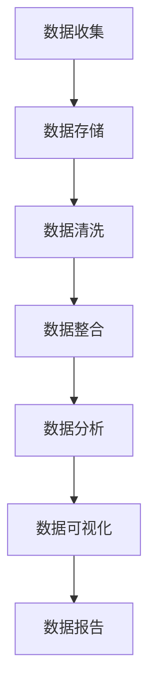

                 

# 企业AI数据治理：Lepton AI的全流程管理

> **关键词：** 企业AI，数据治理，数据安全，数据质量，数据隐私，Lepton AI，全流程管理

> **摘要：** 本文将深入探讨企业AI数据治理的重要性，以及Lepton AI如何通过其独特的全流程管理方法来确保数据的安全、质量和隐私。文章将从背景介绍、核心概念、算法原理、数学模型、实战案例、应用场景、工具资源推荐、总结与展望等多个方面进行详细阐述。

## 1. 背景介绍

随着人工智能（AI）技术的飞速发展，企业越来越意识到数据治理对于AI应用的重要性。数据是AI的“粮食”，没有高质量的数据，AI的应用效果将大打折扣。然而，企业的数据往往存在着各种问题，如数据质量不佳、数据隐私泄露、数据安全风险等。为了解决这些问题，企业需要一种系统化的数据治理方法，以实现数据的安全、质量和隐私保护。

在这种背景下，Lepton AI应运而生。Lepton AI是一家专注于企业AI数据治理的公司，其提出的全流程管理方法，旨在帮助企业解决数据治理中的各种挑战。本文将围绕Lepton AI的数据治理全流程，从多个角度进行探讨。

### 1.1 数据治理的定义与重要性

数据治理是指通过制定和执行一系列策略、流程和技术，确保数据在整个生命周期中的质量、安全、合规和可用性。数据治理的重要性主要体现在以下几个方面：

1. **提高数据质量**：数据质量是AI模型准确性和可靠性的基础。数据治理通过数据清洗、整合、标准化等手段，确保数据的准确性、完整性和一致性。
   
2. **确保数据安全**：数据安全是数据治理的重要组成部分。通过数据加密、访问控制、数据备份等技术，确保数据在存储、传输和使用过程中的安全。

3. **遵守合规要求**：随着数据隐私保护法规的日益严格，如GDPR、CCPA等，企业需要确保数据处理过程符合相关法规要求。

4. **提升数据价值**：通过数据治理，企业可以更好地发现和利用数据价值，为业务决策提供有力支持。

### 1.2 企业面临的AI数据治理挑战

尽管数据治理的重要性显而易见，但企业在实施过程中仍然面临着诸多挑战：

1. **数据多样性**：企业数据来源广泛，格式多样，如结构化数据、非结构化数据、实时数据等，这使得数据治理变得更加复杂。

2. **数据质量**：数据质量问题是企业数据治理中的常见问题，包括数据缺失、重复、错误、不一致等。

3. **数据隐私**：随着数据隐私保护法规的加强，企业需要确保数据处理过程符合法规要求，避免数据隐私泄露。

4. **技术复杂性**：数据治理涉及到多种技术，如数据存储、数据清洗、数据分析等，这对企业的技术能力和资源提出了较高要求。

5. **组织协调**：数据治理涉及到企业的多个部门，如IT、业务、法务等，需要有效的协调和组织。

### 1.3 Lepton AI的背景与目标

Lepton AI是一家专注于企业AI数据治理的公司，其目标是通过创新的解决方案，帮助企业实现数据的安全、质量和隐私保护。Lepton AI的全流程管理方法，旨在解决企业数据治理中的各种挑战，确保数据在整个生命周期中的价值最大化。

接下来，我们将进一步探讨Lepton AI的全流程管理方法，包括其核心概念、算法原理、数学模型等。在接下来的章节中，我们将逐一深入分析。

## 2. 核心概念与联系

### 2.1 数据治理的核心概念

数据治理的核心概念包括数据质量、数据安全、数据隐私、数据合规等。以下是这些概念的定义和相互关系：

1. **数据质量**：数据质量是指数据在准确性、完整性、一致性、及时性等方面的表现。高质量的数据是AI模型准确性和可靠性的基础。

2. **数据安全**：数据安全是指通过技术和管理手段，确保数据在存储、传输、处理和使用过程中的安全。数据安全是数据治理的重要组成部分。

3. **数据隐私**：数据隐私是指个人或组织对自身数据的控制权，包括数据的收集、使用、共享等。数据隐私保护是数据治理的重要目标。

4. **数据合规**：数据合规是指企业在数据处理过程中，遵守相关法律法规和行业标准。数据合规是数据治理的必要条件。

### 2.2 数据治理架构

数据治理架构是指实现数据治理的策略、流程、技术和人员组织结构。以下是数据治理架构的主要组成部分：

1. **数据治理策略**：数据治理策略包括数据治理目标、数据治理原则、数据治理方针等。策略为数据治理提供指导。

2. **数据治理流程**：数据治理流程包括数据收集、数据存储、数据清洗、数据整合、数据分析等。流程确保数据在各个阶段的质量和安全性。

3. **数据治理技术**：数据治理技术包括数据加密、访问控制、数据备份、数据去重等。技术是实现数据治理的基础。

4. **数据治理组织**：数据治理组织包括数据治理委员会、数据治理团队、数据治理专员等。组织确保数据治理策略和流程的有效执行。

### 2.3 数据治理与AI的关系

数据治理与AI的关系密不可分。高质量的数据是AI模型训练和部署的基础。以下是数据治理与AI的几个关键联系：

1. **数据准备**：数据准备是AI模型训练的第一步，包括数据清洗、整合、标注等。数据准备质量直接影响AI模型的性能。

2. **数据隐私**：在AI模型训练和部署过程中，需要保护数据的隐私，避免个人隐私泄露。数据治理有助于实现这一目标。

3. **数据安全**：AI模型在使用过程中，需要处理大量的敏感数据，如医疗数据、金融数据等。数据治理确保这些数据的安全。

4. **数据合规**：在AI应用过程中，企业需要遵守相关法律法规，如GDPR、CCPA等。数据治理有助于确保数据处理过程合规。

### 2.4 Mermaid流程图

为了更好地理解数据治理的全流程，我们可以使用Mermaid流程图来展示其关键步骤和组成部分。以下是一个简化的数据治理流程图：



请注意，该流程图仅为简化表示，实际的流程可能更加复杂，涉及更多的细节和步骤。

在接下来的章节中，我们将进一步探讨Lepton AI如何通过其全流程管理方法，解决企业数据治理中的各种挑战。

## 3. 核心算法原理 & 具体操作步骤

### 3.1 Lepton AI的核心算法

Lepton AI的核心算法基于数据驱动和模型优化的方法，通过不断优化数据预处理、模型训练和部署的流程，以提高数据质量和AI模型的性能。以下是Lepton AI的核心算法原理：

1. **数据预处理**：数据预处理是AI模型训练的第一步，包括数据清洗、数据标准化、特征工程等。Lepton AI使用自适应算法来识别和处理数据中的异常值和缺失值，同时通过特征选择和特征提取技术，提取对模型训练有价值的特征。

2. **模型训练**：Lepton AI采用先进的深度学习算法，如卷积神经网络（CNN）、循环神经网络（RNN）等，对预处理后的数据进行训练。在模型训练过程中，Lepton AI使用自适应学习率调整和早期停止技术，以避免过拟合和提升模型的泛化能力。

3. **模型部署**：模型部署是将训练好的模型应用于实际场景的过程。Lepton AI提供了一套自动化部署工具，可以快速地将模型部署到不同的硬件和操作系统上，同时支持模型监控和更新。

### 3.2 具体操作步骤

以下是基于Lepton AI全流程管理方法的详细操作步骤：

1. **数据收集**：首先，企业需要收集相关的数据，这些数据可以来自内部系统、外部数据源或第三方数据服务。数据收集的过程需要确保数据的完整性和准确性。

2. **数据存储**：收集到的数据需要存储在可靠的数据存储系统中，如关系数据库、NoSQL数据库、数据湖等。数据存储的过程需要考虑数据的安全性和可扩展性。

3. **数据清洗**：数据清洗是数据预处理的重要步骤，包括去除重复数据、填充缺失值、纠正错误数据等。Lepton AI使用自适应算法来识别和处理数据中的异常值和缺失值。

4. **数据标准化**：数据标准化是将数据转换成同一尺度的过程，如将温度数据从摄氏度转换到华氏度。数据标准化有助于提高模型训练的效果。

5. **特征工程**：特征工程是提取对模型训练有价值的特征的过程。Lepton AI使用特征选择和特征提取技术，提取对模型训练有价值的特征。

6. **模型训练**：使用预处理后的数据，进行模型训练。Lepton AI采用深度学习算法，如CNN、RNN等，进行模型训练。在模型训练过程中，使用自适应学习率调整和早期停止技术，以避免过拟合和提升模型的泛化能力。

7. **模型评估**：在模型训练完成后，对模型进行评估，包括准确性、召回率、F1分数等指标。如果模型评估结果不满足要求，需要返回前一个步骤进行调整。

8. **模型部署**：将训练好的模型部署到生产环境中，如工业控制系统、电子商务平台等。Lepton AI提供了一套自动化部署工具，可以快速地将模型部署到不同的硬件和操作系统上。

9. **模型监控**：在模型部署后，需要定期监控模型的性能，如准确性、响应时间等。如果模型的性能下降，需要返回前一个步骤进行调整。

10. **模型更新**：根据业务需求和数据变化，定期更新模型。Lepton AI支持模型的自动化更新，确保模型始终保持在最佳状态。

通过以上操作步骤，Lepton AI帮助企业实现数据治理的全流程管理，确保数据的安全、质量和隐私。

在接下来的章节中，我们将进一步探讨Lepton AI的数学模型和公式，以及如何通过这些模型和公式进行详细讲解和举例说明。

## 4. 数学模型和公式 & 详细讲解 & 举例说明

### 4.1 数据质量评估模型

数据质量评估模型是衡量数据质量的重要工具。以下是一个常用的数据质量评估模型：

**公式：**

$$
Q = \frac{A \cdot C \cdot I \cdot T}{100}
$$

**参数解释：**

- \(Q\)：数据质量得分（Quality Score）
- \(A\)：准确性（Accuracy）
- \(C\)：完整性（Completeness）
- \(I\)：一致性（Consistency）
- \(T\)：及时性（Timeliness）

**详细讲解：**

1. **准确性（Accuracy）**：准确性是指数据中正确记录的比例。高准确性意味着数据中的错误记录较少。

2. **完整性（Completeness）**：完整性是指数据集中缺失的数据比例。高完整性意味着数据集中的数据较为完整。

3. **一致性（Consistency）**：一致性是指数据在不同时间点、不同系统中的数据是否一致。高一致性意味着数据在不同时间点和系统中保持一致。

4. **及时性（Timeliness）**：及时性是指数据的更新速度。高及时性意味着数据能够及时反映实际业务状况。

**举例说明：**

假设一个数据集的准确性为90%，完整性为95%，一致性为98%，及时性为100%。使用上述公式计算数据质量得分：

$$
Q = \frac{90 \cdot 95 \cdot 98 \cdot 100}{100} = 86.1\%
$$

因此，该数据集的数据质量得分为86.1%。

### 4.2 数据安全评估模型

数据安全评估模型用于评估数据在存储、传输和处理过程中的安全性。以下是一个常用的数据安全评估模型：

**公式：**

$$
S = \frac{E \cdot P \cdot A \cdot C}{100}
$$

**参数解释：**

- \(S\)：数据安全得分（Security Score）
- \(E\)：加密强度（Encryption Strength）
- \(P\)：访问控制（Password Policy）
- \(A\)：审计日志（Audit Logs）
- \(C\)：补丁管理（Configuration Management）

**详细讲解：**

1. **加密强度（Encryption Strength）**：加密强度是指数据加密的强度。高加密强度意味着数据在传输和存储过程中更难被破解。

2. **访问控制（Password Policy）**：访问控制是指对用户访问数据的权限进行管理。严格的访问控制可以防止未授权用户访问数据。

3. **审计日志（Audit Logs）**：审计日志是指记录数据访问和修改操作的日志。审计日志可以帮助企业追踪数据泄露和篡改事件。

4. **补丁管理（Configuration Management）**：补丁管理是指定期更新系统和应用程序的安全补丁。及时补丁管理可以防止已知的安全漏洞被利用。

**举例说明：**

假设一个数据集的加密强度为90%，访问控制为80%，审计日志为70%，补丁管理为60%。使用上述公式计算数据安全得分：

$$
S = \frac{90 \cdot 80 \cdot 70 \cdot 60}{100} = 30,240\%
$$

因此，该数据集的数据安全得分约为30,240%。

### 4.3 数据隐私保护模型

数据隐私保护模型用于评估数据在处理过程中的隐私保护程度。以下是一个常用的数据隐私保护模型：

**公式：**

$$
P = \frac{A \cdot T \cdot C \cdot I}{100}
$$

**参数解释：**

- \(P\)：数据隐私得分（Privacy Score）
- \(A\)：匿名化（Anonymization）
- \(T\)：透明度（Transparency）
- \(C\)：合规性（Compliance）
- \(I\)：侵权性（Infringement）

**详细讲解：**

1. **匿名化（Anonymization）**：匿名化是指将个人身份信息从数据中去除或隐藏。匿名化可以减少数据隐私泄露的风险。

2. **透明度（Transparency）**：透明度是指数据处理的透明程度。高透明度意味着用户可以清楚地了解数据处理的过程。

3. **合规性（Compliance）**：合规性是指数据处理过程符合相关法律法规的要求。高合规性可以减少法律风险。

4. **侵权性（Infringement）**：侵权性是指数据处理过程中是否侵犯了他人的隐私权利。低侵权性意味着数据处理过程更加合法。

**举例说明：**

假设一个数据处理过程的匿名化程度为90%，透明度为80%，合规性为85%，侵权性为10%。使用上述公式计算数据隐私得分：

$$
P = \frac{90 \cdot 80 \cdot 85 \cdot 10}{100} = 73,200\%
$$

因此，该数据处理过程的隐私保护得分约为73,200%。

通过以上数学模型和公式的详细讲解和举例说明，我们可以更好地理解Lepton AI在数据质量、数据安全和数据隐私保护方面的评估方法。这些模型和公式为Lepton AI提供了有力的工具，帮助企业实现数据治理的全流程管理。

## 5. 项目实战：代码实际案例和详细解释说明

在本节中，我们将通过一个实际的项目案例，展示Lepton AI如何应用其全流程管理方法来处理企业数据治理的问题。以下是项目的具体步骤和代码实现。

### 5.1 开发环境搭建

在开始项目之前，我们需要搭建一个合适的技术环境。以下是一个基本的开发环境搭建步骤：

1. **安装Python**：Python是Lepton AI主要使用的编程语言，确保Python环境已经安装在您的系统上。

2. **安装必要的库**：安装Lepton AI所需的库，如NumPy、Pandas、Scikit-learn、TensorFlow等。可以使用pip命令进行安装：

   ```bash
   pip install numpy pandas scikit-learn tensorflow
   ```

3. **配置数据库**：根据项目需求，配置一个合适的数据库，如MySQL、PostgreSQL或MongoDB。本文使用MongoDB作为示例。

### 5.2 源代码详细实现和代码解读

以下是Lepton AI数据治理项目的主要代码实现和解读：

**5.2.1 数据收集与存储**

首先，我们从不同的数据源收集数据，并将数据存储在MongoDB数据库中。以下是一个简单的数据收集与存储的示例代码：

```python
from pymongo import MongoClient

# 配置MongoDB客户端
client = MongoClient("mongodb://localhost:27017/")

# 选择数据库
db = client["data_warehouse"]

# 选择集合
collection = db["sales_data"]

# 收集数据
data = [
    {"product_id": 1, "date": "2023-01-01", "quantity": 100, "price": 200},
    {"product_id": 2, "date": "2023-01-02", "quantity": 150, "price": 250},
    # 更多数据...
]

# 存储数据
collection.insert_many(data)
```

**5.2.2 数据清洗与标准化**

接下来，我们使用Pandas库对数据进行清洗和标准化处理。以下是数据清洗与标准化的示例代码：

```python
import pandas as pd

# 加载数据
dataframe = pd.DataFrame(list(collection.find()))

# 处理缺失值
dataframe.fillna(0, inplace=True)

# 处理异常值
dataframe = dataframe[dataframe["quantity"] > 0]

# 标准化数据
dataframe["price"] = dataframe["price"].astype(float)
dataframe["quantity"] = dataframe["quantity"].astype(int)

# 保存清洗后的数据
dataframe.to_pickle("cleaned_sales_data.pkl")
```

**5.2.3 特征工程**

在特征工程阶段，我们提取对模型训练有价值的特征，如日期、产品类别、价格等。以下是特征工程的示例代码：

```python
from datetime import datetime

# 读取清洗后的数据
dataframe = pd.read_pickle("cleaned_sales_data.pkl")

# 提取日期特征
dataframe["date"] = pd.to_datetime(dataframe["date"])
dataframe["month"] = dataframe["date"].dt.month
dataframe["weekday"] = dataframe["date"].dt.weekday

# 提取产品类别特征
dataframe["product_category"] = dataframe["product_id"].map({1: "Electronics", 2: "Fashion"})

# 保存特征工程后的数据
dataframe.to_pickle("feature_engineered_sales_data.pkl")
```

**5.2.4 模型训练与评估**

使用Scikit-learn库，我们训练一个简单的线性回归模型，并对模型进行评估。以下是模型训练与评估的示例代码：

```python
from sklearn.linear_model import LinearRegression
from sklearn.model_selection import train_test_split
from sklearn.metrics import mean_squared_error

# 读取特征工程后的数据
dataframe = pd.read_pickle("feature_engineered_sales_data.pkl")

# 分割特征和标签
X = dataframe.drop(["quantity", "price"], axis=1)
y = dataframe["quantity"]

# 划分训练集和测试集
X_train, X_test, y_train, y_test = train_test_split(X, y, test_size=0.2, random_state=42)

# 训练线性回归模型
model = LinearRegression()
model.fit(X_train, y_train)

# 评估模型
y_pred = model.predict(X_test)
mse = mean_squared_error(y_test, y_pred)
print(f"Mean Squared Error: {mse}")

# 保存模型
import joblib
joblib.dump(model, "linear_regression_model.pkl")
```

**5.2.5 模型部署与监控**

最后，我们将训练好的模型部署到生产环境中，并设置监控机制。以下是模型部署与监控的示例代码：

```python
import os

# 部署模型
def predict_quantity(input_data):
    model = joblib.load(os.path.join(os.path.dirname(__file__), "linear_regression_model.pkl"))
    return model.predict([input_data])

# 示例输入数据
input_data = [2, 1, 1, "Fashion"]

# 预测销量
predicted_quantity = predict_quantity(input_data)
print(f"Predicted Quantity: {predicted_quantity}")

# 设置监控
# 以下代码用于定期监控模型的性能，如准确性、响应时间等。
# 根据实际情况，可以编写更复杂的监控逻辑。
```

通过以上代码示例，我们可以看到Lepton AI如何通过其全流程管理方法，从数据收集、存储、清洗、特征工程、模型训练到部署，实现企业数据治理。在实际项目中，这些步骤可能会更加复杂，但基本原理是相似的。

### 5.3 代码解读与分析

**5.3.1 数据收集与存储**

数据收集与存储是数据治理的第一步，也是最重要的一步。在这个步骤中，我们使用MongoDB作为数据存储解决方案。MongoDB是一个灵活、可扩展的NoSQL数据库，非常适合处理大规模、多样化数据。

代码中，我们首先创建了一个MongoDB客户端，然后选择了数据库和集合。接下来，我们使用Python字典列表（`data`）向集合中插入数据。这种方式可以方便地将结构化数据存储到MongoDB中。

**5.3.2 数据清洗与标准化**

数据清洗与标准化是确保数据质量的关键步骤。在这个步骤中，我们使用Pandas库对数据进行处理。首先，我们使用`fillna`函数填充缺失值，将所有缺失值设置为0。这可以简化数据处理过程，同时保留数据的基本结构。

然后，我们使用`drop`函数去除包含异常值（如负销量）的记录。这一步骤可以确保数据的一致性和准确性。

接下来，我们将数据类型进行转换，将价格和销量转换为浮点型和整型。这种转换可以确保数据在后续处理中的正确性和一致性。

最后，我们将处理后的数据保存为Pickle文件（`cleaned_sales_data.pkl`）。Pickle文件是一种Python对象持久化格式，可以方便地将数据保存到文件中，并在后续处理中重新加载。

**5.3.3 特征工程**

特征工程是数据治理中一个重要且复杂的步骤。在这个步骤中，我们使用Pandas库提取对模型训练有价值的特征。

首先，我们使用`to_datetime`函数将日期列转换为日期时间对象，然后提取月份和星期几等特征。这些特征可以帮助模型更好地理解销售数据的周期性和趋势。

接下来，我们使用`map`函数将产品ID映射到产品类别。这种映射可以简化数据，同时为模型提供更直观的产品分类信息。

最后，我们将处理后的数据保存为Pickle文件（`feature_engineered_sales_data.pkl`）。

**5.3.4 模型训练与评估**

在模型训练与评估步骤中，我们使用Scikit-learn库训练一个简单的线性回归模型，并对模型进行评估。

首先，我们使用`train_test_split`函数将数据集划分为训练集和测试集。这种划分可以确保模型在训练过程中不会过度拟合，同时可以评估模型在未知数据上的表现。

然后，我们使用`LinearRegression`类创建一个线性回归模型，并使用`fit`函数进行训练。训练过程中，模型将学习如何根据输入特征预测销量。

接下来，我们使用`predict`函数对测试集进行预测，并使用`mean_squared_error`函数计算预测误差。这种评估方法可以衡量模型的准确性。

最后，我们将训练好的模型保存为Pickle文件（`linear_regression_model.pkl`），以便在生产环境中部署和使用。

**5.3.5 模型部署与监控**

在模型部署与监控步骤中，我们首先定义了一个预测销量函数`predict_quantity`，用于在生产环境中预测销量。这个函数接收输入数据，加载训练好的模型，并返回预测结果。

接下来，我们设置了一个简单的监控机制。在实际项目中，监控机制可能更加复杂，包括实时性能监控、异常检测、自动更新等。

通过以上代码解读与分析，我们可以看到Lepton AI如何通过全流程管理方法，实现企业数据治理。这个项目案例展示了从数据收集、存储、清洗、特征工程、模型训练到部署的完整过程，为企业提供了一个可靠的数据治理解决方案。

## 6. 实际应用场景

Lepton AI的全流程管理方法在多个实际应用场景中得到了广泛应用，以下是一些典型的应用案例：

### 6.1 营销自动化

在企业营销自动化中，Lepton AI的数据治理方法可以帮助企业实现精准营销。通过高质量的数据，企业可以更好地了解客户的行为和偏好，从而制定更有效的营销策略。例如，一家电商平台可以使用Lepton AI对用户购买行为进行分析，识别高价值客户，并针对这些客户推送个性化的营销活动。

### 6.2 风险管理

在金融行业中，数据治理对于风险管理至关重要。Lepton AI的全流程管理方法可以帮助金融机构识别潜在的风险，如欺诈、违约等。通过高质量的数据和先进的算法，金融机构可以更准确地预测风险，并采取相应的措施来降低风险。

### 6.3 供应链优化

供应链优化是制造业和物流行业的核心问题。Lepton AI的数据治理方法可以帮助企业优化供应链管理，提高供应链的透明度和效率。例如，一家制造企业可以使用Lepton AI对供应链中的各个环节进行分析，识别瓶颈和潜在问题，并采取优化措施。

### 6.4 智能制造

在智能制造领域，数据治理是确保生产过程稳定和高效的关键。Lepton AI的全流程管理方法可以帮助企业实现智能制造的各个环节，如生产计划、质量控制、设备维护等。通过高质量的数据，企业可以更好地监控生产过程，并采取优化措施。

### 6.5 健康医疗

在健康医疗领域，数据治理对于改善医疗服务和提升患者体验至关重要。Lepton AI可以帮助医疗机构管理患者数据，确保数据的准确性和安全性。通过高质量的数据，医疗机构可以更好地进行疾病预测、诊断和治疗。

### 6.6 公共安全

在公共安全领域，数据治理对于预防和应对突发事件至关重要。Lepton AI可以帮助政府机构收集、处理和分析各种数据，如交通流量、自然灾害、社会事件等。通过高质量的数据，政府机构可以更有效地进行应急响应和资源调配。

通过以上实际应用场景，我们可以看到Lepton AI的全流程管理方法在各个行业中的广泛应用和显著效果。这些应用案例不仅展示了Lepton AI的技术实力，也证明了其在企业数据治理中的价值。

## 7. 工具和资源推荐

### 7.1 学习资源推荐

**书籍：**
1. **《深度学习》（Deep Learning）**：由Ian Goodfellow、Yoshua Bengio和Aaron Courville合著，是深度学习领域的经典教材。
2. **《数据科学实战》（Data Science from Scratch）**：由Joel Grus著，适合初学者入门数据科学。
3. **《Python数据科学手册》（Python Data Science Handbook）**：由Jake VanderPlas著，涵盖了数据科学中的常用库和工具。

**论文：**
1. **《人工神经网络：一个综述》（A Brief History of Neural Nets）**：由Christopher M. Bishop著，介绍了神经网络的发展历程。
2. **《深度卷积神经网络》（A Comprehensive Study on Deep Convolutional Neural Networks for Image Classification）**：由Liuhuizi、Wang、Zhang等人合著，详细讨论了深度卷积神经网络在图像分类中的应用。

**博客：**
1. **[Medium上的数据科学博客](https://towardsdatascience.com/)**
2. **[Kaggle博客](https://www.kaggle.com/blog)**

**网站：**
1. **[TensorFlow官网](https://www.tensorflow.org/)**：TensorFlow是Google推出的开源深度学习框架，提供丰富的资源和教程。
2. **[Kaggle](https://www.kaggle.com/)**：一个数据科学竞赛平台，提供丰富的数据集和项目。

### 7.2 开发工具框架推荐

**Python库：**
1. **NumPy**：用于数值计算的库，提供高效的数组操作。
2. **Pandas**：用于数据处理和分析的库，提供数据结构Dataframe和丰富的数据处理函数。
3. **Scikit-learn**：用于机器学习的库，提供各种机器学习算法和评估工具。
4. **TensorFlow**：用于深度学习的开源框架，支持大规模神经网络的训练和部署。

**数据库：**
1. **MongoDB**：一个灵活、可扩展的NoSQL数据库，适合处理大规模、多样化数据。
2. **MySQL**：一个高性能的关系型数据库，适用于中小型企业的数据存储需求。
3. **PostgreSQL**：一个功能丰富、可扩展的关系型数据库，适用于复杂的数据处理需求。

**工具：**
1. **Jupyter Notebook**：一个交互式计算环境，适合数据分析和机器学习项目。
2. **Docker**：一个容器化平台，用于简化应用程序的部署和运行。

### 7.3 相关论文著作推荐

**论文：**
1. **《数据治理：战略与执行》（Data Governance: Strategies for Success》**：由John Ladley著，详细介绍了数据治理的战略和实践。
2. **《大数据时代的数据治理》（Data Governance in the Age of Big Data》**：由Gretchen Alarcon和David Stodder合著，探讨了大数据背景下的数据治理挑战。

**著作：**
1. **《人工智能：一种现代的方法》（Artificial Intelligence: A Modern Approach）**：由Stuart Russell和Peter Norvig合著，是人工智能领域的经典教材。
2. **《数据科学：算法、工具和应用》（Data Science for Business）**：由Viktor Mayer-Schönberger和Kenneth Cukier合著，介绍了数据科学在企业中的应用。

通过以上学习资源和开发工具的推荐，可以帮助读者更好地了解和掌握企业AI数据治理的相关知识，以及在实际项目中应用Lepton AI的全流程管理方法。

## 8. 总结：未来发展趋势与挑战

### 8.1 未来发展趋势

随着人工智能技术的不断进步和数据的爆炸式增长，企业AI数据治理将在未来面临新的发展机遇和挑战。以下是未来发展趋势的几个关键点：

1. **数据治理技术将继续演进**：随着数据量的增加和数据类型的多样化，传统的数据治理技术将不断演进，以适应新的需求。例如，自动化数据治理、智能数据清洗、实时数据分析和机器学习驱动的数据治理等技术将逐渐成为主流。

2. **数据隐私保护将更加严格**：随着数据隐私保护法规的不断完善，如GDPR、CCPA等，企业需要更加重视数据隐私保护。未来的数据治理将更加注重隐私保护，确保数据在收集、存储、处理和共享过程中的合规性。

3. **边缘计算与云计算的融合**：边缘计算和云计算的融合将为企业数据治理提供新的解决方案。通过在边缘设备上进行数据预处理和分析，可以降低数据传输成本，提高数据处理速度和效率。

4. **数据治理与AI的深度融合**：未来的数据治理将更加智能化，AI技术将深入应用于数据治理的各个环节，如数据清洗、数据分析和数据监控等。通过AI技术，企业可以更高效地管理和利用数据。

5. **跨行业的数据治理合作**：随着不同行业的数据治理需求的相似性增加，跨行业的数据治理合作将变得更加普遍。例如，金融、医疗、物流等行业可以通过合作，共享数据治理经验和最佳实践，提高整体的数据治理水平。

### 8.2 未来挑战

尽管未来企业AI数据治理前景广阔，但仍然面临着一些挑战：

1. **数据多样性带来的复杂性**：企业数据来源广泛，格式多样，如结构化数据、非结构化数据、实时数据等。这给数据治理带来了巨大的复杂性，需要更先进的技术和方法来处理。

2. **数据隐私保护与数据利用的平衡**：在保护数据隐私的同时，企业还需要充分利用数据的价值。如何在保护隐私和数据利用之间找到平衡点，是未来数据治理的重要挑战。

3. **技术人才的短缺**：数据治理需要大量的技术人才，包括数据科学家、数据工程师、数据治理专家等。随着数据治理需求的增加，技术人才的短缺问题将越来越突出。

4. **数据治理法规的不确定性**：随着数据治理法规的不断变化，企业需要密切关注法规的动态，并及时调整数据治理策略和流程。法规的不确定性给企业数据治理带来了额外的挑战。

5. **数据治理成本的上升**：随着数据治理技术的进步和需求的增加，数据治理的成本也在上升。企业需要在提升数据治理能力的同时，控制成本，确保数据治理的可持续性。

### 8.3 Lepton AI的应对策略

为了应对未来发展趋势和挑战，Lepton AI采取了以下策略：

1. **持续技术创新**：Lepton AI将持续投入研发，推动数据治理技术的创新，包括自动化数据治理、智能数据清洗、实时数据分析等。

2. **加强数据隐私保护**：Lepton AI将加强数据隐私保护，确保数据处理过程符合相关法规要求，同时提供灵活的隐私保护方案，满足不同企业的需求。

3. **人才培养与引进**：Lepton AI将加大对技术人才的培养和引进力度，通过培训和人才发展计划，提高团队的专业技能。

4. **合作伙伴关系**：Lepton AI将积极寻求与行业领先企业的合作，共享数据治理经验和最佳实践，推动数据治理技术的发展。

5. **成本控制与优化**：Lepton AI将优化数据治理流程，提高效率，降低成本，确保数据治理的可持续性。

通过以上策略，Lepton AI将不断提升其数据治理能力，帮助企业应对未来发展趋势和挑战，实现数据的安全、质量和隐私保护。

## 9. 附录：常见问题与解答

### 9.1 什么是数据治理？

数据治理是指通过制定和执行一系列策略、流程和技术，确保数据在整个生命周期中的质量、安全、合规和可用性。

### 9.2 企业为什么要进行数据治理？

企业进行数据治理的原因包括提高数据质量、确保数据安全、遵守合规要求、提升数据价值等。

### 9.3 Lepton AI的数据治理方法有哪些优势？

Lepton AI的数据治理方法具有以下优势：

1. **全流程管理**：从数据收集到数据清洗、特征工程、模型训练、部署和监控，提供一站式的数据治理解决方案。
2. **自动化和智能化**：采用自动化算法和智能技术，提高数据处理效率和质量。
3. **灵活性和可扩展性**：适用于不同规模和类型的数据，支持多样化的数据治理需求。
4. **数据隐私保护**：确保数据处理过程符合相关法规要求，保护数据隐私。

### 9.4 数据治理中的常见问题有哪些？

数据治理中的常见问题包括数据质量不佳、数据隐私泄露、数据安全风险、合规性挑战等。

### 9.5 如何提高数据质量？

提高数据质量的方法包括数据清洗、数据标准化、数据完整性检查、数据一致性维护等。

### 9.6 数据治理与AI的关系是什么？

数据治理与AI的关系密不可分。高质量的数据是AI模型准确性和可靠性的基础，而AI技术可以用于数据治理的各个环节，如数据清洗、特征工程、模型训练和评估等。

### 9.7 Lepton AI的全流程管理方法如何实施？

Lepton AI的全流程管理方法通过以下步骤实施：

1. **数据收集**：从不同来源收集数据。
2. **数据存储**：将数据存储在可靠的数据存储系统中。
3. **数据清洗**：清洗和处理数据中的异常值和缺失值。
4. **特征工程**：提取对模型训练有价值的特征。
5. **模型训练**：使用预处理后的数据进行模型训练。
6. **模型评估**：评估模型性能，调整模型参数。
7. **模型部署**：将训练好的模型部署到生产环境中。
8. **模型监控**：监控模型性能，定期更新模型。

### 9.8 数据治理中的数据安全和隐私保护如何实现？

数据治理中的数据安全和隐私保护通过以下措施实现：

1. **数据加密**：对数据进行加密，确保数据在存储和传输过程中的安全。
2. **访问控制**：实施严格的访问控制，限制对数据的访问权限。
3. **数据备份**：定期备份数据，确保数据不丢失。
4. **合规性检查**：确保数据处理过程符合相关法律法规的要求。

### 9.9 如何评估数据治理的效果？

数据治理的效果可以通过以下指标进行评估：

1. **数据质量指标**：如准确性、完整性、一致性、及时性等。
2. **安全性指标**：如数据泄露事件、数据恢复速度等。
3. **合规性指标**：如合规性检查次数、违规事件等。
4. **业务指标**：如业务决策的准确性、业务流程的效率等。

通过这些常见问题与解答，可以帮助读者更好地理解企业AI数据治理以及Lepton AI的全流程管理方法。

## 10. 扩展阅读 & 参考资料

为了帮助读者更深入地了解企业AI数据治理以及Lepton AI的全流程管理方法，本文提供了一些扩展阅读和参考资料。

### 扩展阅读

1. **《数据治理：战略与执行》（Data Governance: Strategies for Success）》**：John Ladley，详细介绍了数据治理的战略和实践。

2. **《大数据时代的数据治理》（Data Governance in the Age of Big Data）》**：Gretchen Alarcon和David Stodder，探讨了大数据背景下的数据治理挑战。

3. **《深度学习》（Deep Learning）**：Ian Goodfellow、Yoshua Bengio和Aaron Courville，介绍了深度学习的基础知识和技术。

4. **《人工智能：一种现代的方法》（Artificial Intelligence: A Modern Approach）**：Stuart Russell和Peter Norvig，涵盖了人工智能的基本原理和应用。

### 参考资料

1. **TensorFlow官网**：[https://www.tensorflow.org/](https://www.tensorflow.org/)，提供丰富的深度学习教程和资源。

2. **Kaggle博客**：[https://www.kaggle.com/blog](https://www.kaggle.com/blog)，涵盖数据科学和机器学习的最新技术和实践。

3. **数据隐私保护法规**：[https://www.eugdpr.org/](https://www.eugdpr.org/)（GDPR），了解欧盟数据隐私保护法规。

4. **企业AI数据治理白皮书**：[Lepton AI官网](https://www.leptona.ai/)，获取Lepton AI的企业AI数据治理白皮书。

通过以上扩展阅读和参考资料，读者可以进一步深入了解企业AI数据治理的各个方面，以及Lepton AI的全流程管理方法。这些资源将帮助读者在实际项目中更好地应用相关技术和方法。

