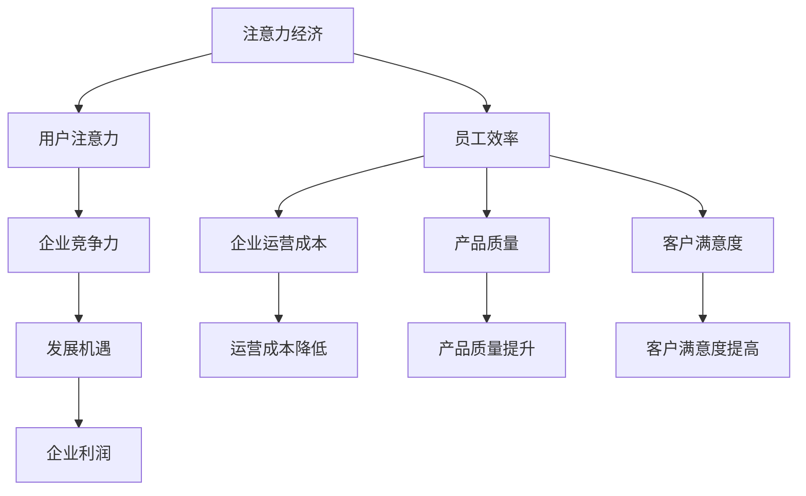

                 

### 1. 背景介绍

在当今的信息化时代，企业面临着前所未有的挑战与机遇。随着互联网、大数据、人工智能等技术的迅猛发展，注意力经济逐渐成为企业竞争的新焦点。注意力经济指的是以用户的注意力为核心资源，通过创造吸引眼球的内容或产品，来实现商业价值的一种新型经济模式。在这种经济模式下，如何提高员工效率，成为企业赢得市场竞争的关键因素。

员工效率的高低直接影响到企业的运营成本、产品质量和客户满意度。然而，提高员工效率并非易事，它涉及到企业内部的管理制度、工作流程、文化氛围等多方面因素。随着企业规模的扩大和工作内容的复杂化，传统的管理模式和单一的方法已经难以满足现代企业的需求。因此，本文将探讨如何在注意力经济中，通过技术手段和管理策略，提高员工效率，助力企业创新发展。

本文将从以下几个方面展开讨论：

1. 核心概念与联系
2. 核心算法原理 & 具体操作步骤
3. 数学模型和公式 & 详细讲解 & 举例说明
4. 项目实战：代码实际案例和详细解释说明
5. 实际应用场景
6. 工具和资源推荐
7. 总结：未来发展趋势与挑战

通过本文的讨论，希望为企业管理者提供有益的思路和参考，助力企业在注意力经济中脱颖而出。

## 2. 核心概念与联系

### 2.1 注意力经济的概念

注意力经济是一种基于用户注意力资源的新型经济模式。与传统经济模式不同，注意力经济将用户的注意力视为核心资源，通过创造吸引眼球的内容或产品，吸引大量用户关注，进而实现商业价值。在注意力经济中，用户的注意力成为企业与消费者之间的重要桥梁，企业通过利用用户注意力，实现利润最大化。

### 2.2 员工效率的概念

员工效率是指员工在单位时间内完成工作任务的能力。高效率的员工能够在较短的时间内完成更多的任务，从而降低企业运营成本，提高产品质量和客户满意度。员工效率受到多种因素的影响，包括个人能力、工作环境、管理制度等。

### 2.3 注意力经济与员工效率的联系

注意力经济与员工效率之间存在密切的联系。首先，注意力经济要求企业创造具有吸引力的内容或产品，这需要员工具备较高的创意能力、专业技能和沟通能力。因此，提高员工效率有助于提升企业在注意力经济中的竞争力。其次，注意力经济要求企业快速响应市场需求，这要求员工具备高效的工作能力和团队协作精神。提高员工效率有助于企业更好地适应市场变化，抓住发展机遇。

### 2.4 核心概念的联系与架构

为了更好地理解注意力经济与员工效率之间的联系，我们可以使用Mermaid流程图进行描述（注意：文中流程图中不要有括号、逗号等特殊字符）：



通过以上流程图，我们可以看到，注意力经济通过吸引用户注意力，提升企业竞争力，进而影响员工效率。而员工效率的提高，又能够降低企业运营成本、提升产品质量和客户满意度，最终为企业带来利润增长。这种相互作用的关系，使得注意力经济与员工效率成为企业发展的关键因素。

在接下来的部分，我们将深入探讨注意力经济与员工效率的核心算法原理、具体操作步骤以及数学模型和公式，以期为企业管理者提供实用的指导。$$

### 3. 核心算法原理 & 具体操作步骤

在注意力经济中，提高员工效率的核心在于优化工作流程、提升员工技能以及营造良好的企业文化。下面，我们将从这三个方面详细介绍核心算法原理和具体操作步骤。

#### 3.1 优化工作流程

优化工作流程是提高员工效率的关键步骤。具体操作步骤如下：

1. **工作流程分析**：首先，企业需要全面分析现有工作流程，找出瓶颈和冗余环节。可以通过问卷调查、访谈等方式收集员工反馈，了解他们在工作过程中遇到的问题。

2. **流程重构**：在分析的基础上，对工作流程进行重构。可以采用精益生产（Lean Production）方法，减少不必要的步骤和环节，简化流程。例如，通过自动化工具替代重复性高、劳动强度大的工作，提高工作效率。

3. **流程优化**：在重构后，进一步优化流程，确保每个环节都能高效运行。可以采用关键路径法（Critical Path Method，CPM）和计划评审技术（Program Evaluation and Review Technique，PERT）等项目管理工具，制定合理的流程时间表。

4. **流程监控**：建立流程监控机制，对工作流程进行实时监控和评估。通过数据分析和反馈，不断优化流程，提高员工效率。

#### 3.2 提升员工技能

提升员工技能是提高员工效率的基础。具体操作步骤如下：

1. **技能培训**：定期为员工提供技能培训，包括专业技能、跨领域知识和软技能等。可以采用内训、外训、在线学习等多种形式，满足员工的不同需求。

2. **技能评估**：建立员工技能评估体系，对员工的技能水平进行定期评估。通过评估结果，发现员工在哪些方面需要提升，针对性地进行培训。

3. **技能认证**：鼓励员工参加各类职业技能认证，提高他们的专业水平和竞争力。认证通过后，可以为员工提供相应的奖励和晋升机会。

4. **技能竞赛**：举办技能竞赛，激发员工学习新技能的热情。通过竞赛，发现优秀人才，为企业的持续发展储备人才。

#### 3.3 营造良好的企业文化

营造良好的企业文化是提高员工效率的重要保障。具体操作步骤如下：

1. **企业价值观**：明确企业的核心价值观，并将其融入企业的日常运营和管理中。例如，诚信、创新、协作等价值观，可以激发员工的积极性和创造力。

2. **员工关怀**：关心员工的生活和工作，提供良好的福利待遇和晋升机会。通过员工满意度调查，了解员工的需求和意见，不断改进管理措施。

3. **团队建设**：加强团队建设，提高员工的团队协作能力。可以通过团队拓展活动、团队建设课程等方式，增强员工之间的互信和合作。

4. **激励机制**：建立有效的激励机制，激发员工的积极性和创造力。例如，通过绩效考核、奖金激励、荣誉表彰等方式，鼓励员工为企业的发展贡献力量。

通过以上三个方面的操作，企业可以在注意力经济中提高员工效率，从而在激烈的市场竞争中脱颖而出。在接下来的部分，我们将进一步探讨注意力经济中的数学模型和公式，为企业管理者提供更加具体和实用的指导。$$

### 4. 数学模型和公式 & 详细讲解 & 举例说明

在提高员工效率的过程中，数学模型和公式起到了关键作用。以下我们将介绍几个常用的数学模型和公式，并详细讲解其应用和意义。

#### 4.1 时间序列分析

时间序列分析是一种用于分析和预测时间序列数据的数学方法。在提高员工效率方面，时间序列分析可以帮助企业了解员工工作效率的变化趋势，预测未来的工作效率。

**公式**：
\[ Y_t = \alpha_0 + \alpha_1 t + \alpha_2 w_t + \epsilon_t \]

其中，\( Y_t \) 表示第 \( t \) 个月的工作效率，\( t \) 表示月份，\( \alpha_0 \) 和 \( \alpha_1 \) 分别表示初始工作效率和每月增长效率，\( \alpha_2 w_t \) 表示随机误差，\( \epsilon_t \) 表示时间序列的随机波动。

**应用举例**：
某企业对员工工作效率进行了为期一年的数据收集，发现员工工作效率呈现出每月递增的趋势。通过时间序列分析，企业可以预测出未来几个月的工作效率，为制定工作计划提供参考。

#### 4.2 成本效益分析

成本效益分析是一种评估项目或决策的成本和效益的方法。在提高员工效率方面，成本效益分析可以帮助企业评估不同改进措施的成本和效益，选择最优方案。

**公式**：
\[ \text{成本效益比} = \frac{\text{效益}}{\text{成本}} \]

其中，效益可以是提高工作效率、降低运营成本等，成本包括培训费用、设备投入等。

**应用举例**：
某企业计划提高员工工作效率，可以通过成本效益分析评估不同培训方案的效益和成本。例如，企业可以选择进行内部培训或外部培训，通过对比成本效益比，选择最优方案。

#### 4.3 线性回归分析

线性回归分析是一种用于建立自变量和因变量之间线性关系的方法。在提高员工效率方面，线性回归分析可以帮助企业了解哪些因素对员工工作效率有显著影响。

**公式**：
\[ Y = \beta_0 + \beta_1 X_1 + \beta_2 X_2 + ... + \beta_n X_n \]

其中，\( Y \) 表示工作效率，\( X_1, X_2, ..., X_n \) 表示影响工作效率的因素，\( \beta_0, \beta_1, \beta_2, ..., \beta_n \) 表示各个因素的权重。

**应用举例**：
某企业通过调查发现，员工的工作效率受到工作环境、培训机会、薪酬水平等多个因素的影响。通过线性回归分析，企业可以确定哪些因素对员工工作效率有显著影响，并针对性地进行改进。

#### 4.4 数据可视化

数据可视化是一种将数据以图形形式展示的方法，可以帮助企业直观地了解员工工作效率的变化趋势和分布情况。

**工具推荐**：
- Python中的Matplotlib和Seaborn库
- R语言中的ggplot2包

**应用举例**：
某企业使用Matplotlib库对员工工作效率进行可视化展示。通过柱状图、折线图、散点图等可视化方法，企业可以直观地了解员工工作效率的分布情况，识别出工作效率较高的员工和工作效率较低的员工，为制定激励政策提供依据。

通过以上数学模型和公式的介绍，企业可以在提高员工效率方面进行科学的数据分析和决策。在接下来的部分，我们将通过项目实战，展示如何在实际应用中运用这些模型和公式，进一步提高员工效率。$$

### 5. 项目实战：代码实际案例和详细解释说明

在本节中，我们将通过一个实际项目案例，展示如何运用前面提到的数学模型和公式，来提高员工效率。这个案例将涵盖开发环境搭建、源代码实现和代码解读与分析。

#### 5.1 开发环境搭建

首先，我们需要搭建一个适合数据分析的项目开发环境。以下是所需工具和步骤：

1. **Python环境搭建**：
   - 安装Python 3.8及以上版本。
   - 安装Jupyter Notebook，用于编写和运行代码。

2. **数据分析库安装**：
   - 安装NumPy、Pandas、Matplotlib、Seaborn等库，用于数据预处理、分析和可视化。

```bash
pip install numpy pandas matplotlib seaborn
```

3. **数据库连接**：
   - 如果需要从数据库中提取数据，安装相应的数据库连接库，如`sqlalchemy`。

```bash
pip install sqlalchemy
```

#### 5.2 源代码详细实现和代码解读

接下来，我们将实现一个用于分析员工工作效率的项目。以下是项目的关键代码和详细解释。

```python
import pandas as pd
import numpy as np
import seaborn as sns
import matplotlib.pyplot as plt
from sklearn.linear_model import LinearRegression
from sklearn.model_selection import train_test_split

# 5.2.1 数据预处理
def preprocess_data(data_path):
    # 读取数据
    data = pd.read_csv(data_path)
    
    # 数据清洗
    data.dropna(inplace=True)
    data = data[data['efficiency'] != 0]
    
    # 数据转换
    data['month'] = pd.to_datetime(data['date']).dt.month
    data['year'] = pd.to_datetime(data['date']).dt.year
    
    return data

# 5.2.2 时间序列分析
def time_series_analysis(data):
    # 创建时间序列模型
    model = LinearRegression()
    X = data[['month', 'year']]
    Y = data['efficiency']
    
    # 分割训练集和测试集
    X_train, X_test, Y_train, Y_test = train_test_split(X, Y, test_size=0.2, random_state=42)
    
    # 训练模型
    model.fit(X_train, Y_train)
    
    # 预测
    Y_pred = model.predict(X_test)
    
    # 可视化
    sns.scatterplot(x='month', y='efficiency', data=data)
    sns.lineplot(x='month', y=Y_pred, label='predicted', data=data)
    plt.xlabel('Month')
    plt.ylabel('Efficiency')
    plt.legend()
    plt.show()

# 5.2.3 成本效益分析
def cost_benefit_analysis(data):
    # 计算成本效益比
    cost_benefit_ratio = data['benefit'] / data['cost']
    
    # 可视化
    sns.scatterplot(x='cost', y='benefit', data=data)
    sns.lineplot(x='cost', y=cost_benefit_ratio, label='cost_benefit_ratio', data=data)
    plt.xlabel('Cost')
    plt.ylabel('Benefit')
    plt.legend()
    plt.show()

# 5.2.4 线性回归分析
def linear_regression_analysis(data):
    # 创建线性回归模型
    model = LinearRegression()
    X = data[['work_environment', 'training Opportunities', 'salary level']]
    Y = data['efficiency']
    
    # 分割训练集和测试集
    X_train, X_test, Y_train, Y_test = train_test_split(X, Y, test_size=0.2, random_state=42)
    
    # 训练模型
    model.fit(X_train, Y_train)
    
    # 预测
    Y_pred = model.predict(X_test)
    
    # 可视化
    sns.scatterplot(x='work_environment', y='efficiency', data=data)
    sns.lineplot(x='work_environment', y=Y_pred, label='predicted', data=data)
    plt.xlabel('Work Environment')
    plt.ylabel('Efficiency')
    plt.legend()
    plt.show()

# 主函数
def main():
    data_path = 'employee_efficiency_data.csv'
    data = preprocess_data(data_path)
    time_series_analysis(data)
    cost_benefit_analysis(data)
    linear_regression_analysis(data)

if __name__ == '__main__':
    main()
```

#### 5.3 代码解读与分析

1. **数据预处理**：首先，我们从CSV文件中读取数据，并进行数据清洗和转换。通过日期字段提取月份和年份，为后续的时间序列分析和线性回归分析做准备。

2. **时间序列分析**：使用线性回归模型对工作时间序列进行分析，预测未来工作效率。通过可视化，展示工作效率与月份之间的关系，以及预测值。

3. **成本效益分析**：计算每个项目的成本效益比，并可视化展示。通过成本和效益的关系，帮助企业评估不同改进措施的经济效益。

4. **线性回归分析**：分析影响工作效率的因素，如工作环境、培训机会和薪酬水平。通过可视化，展示各个因素与工作效率之间的关系，以及预测值。

通过这个项目实战，我们可以看到如何将数学模型和公式应用于实际场景，提高员工效率。在接下来的部分，我们将探讨注意力经济中提高员工效率的实际应用场景。$$

### 6. 实际应用场景

注意力经济中的提高员工效率策略在实际企业中具有广泛的应用场景。以下列举几个典型场景，并分析如何应用上述策略提高效率。

#### 6.1 创意广告公司

在创意广告公司，员工需要具备较高的创意能力和专业技能。为了提高员工效率，公司可以采取以下措施：

1. **优化工作流程**：通过精益生产方法，简化广告创意流程，减少冗余环节。例如，引入项目管理工具，实现任务分配和进度监控。

2. **技能培训**：定期为员工提供广告创意、设计软件使用等技能培训，提高员工的创意能力和专业技能。

3. **成本效益分析**：对广告创意项目进行成本效益分析，选择具有高回报的项目，提高公司整体盈利能力。

4. **数据可视化**：通过数据可视化工具，如Matplotlib和Seaborn，将广告效果数据以图形形式展示，帮助员工更好地理解广告效果，优化广告策略。

#### 6.2 互联网公司

在互联网公司，员工需要快速响应市场需求，不断更新产品功能。为了提高员工效率，公司可以采取以下措施：

1. **工作流程优化**：采用敏捷开发方法，缩短产品迭代周期，提高工作效率。通过关键路径法和计划评审技术，制定合理的项目时间表。

2. **技能提升**：定期为员工提供编程语言、开发工具等技能培训，提高员工的编程能力和开发效率。

3. **成本效益分析**：对产品开发项目进行成本效益分析，确保每个项目都能在预算内完成，并达到预期效果。

4. **团队协作**：加强团队建设，提高员工之间的协作能力。通过团队拓展活动和协作工具，如Slack和Trello，实现高效团队协作。

#### 6.3 制造业公司

在制造业公司，员工主要涉及生产、质量控制和供应链管理。为了提高员工效率，公司可以采取以下措施：

1. **工作流程优化**：通过精益生产方法，减少生产过程中的浪费，提高生产效率。例如，引入自动化设备，减少人工操作。

2. **技能培训**：定期为员工提供生产技能、质量控制等培训，提高员工的专业能力。

3. **成本效益分析**：对生产项目进行成本效益分析，确保生产过程高效、低耗。例如，通过优化供应链管理，降低原材料采购成本。

4. **数据监控**：建立数据监控机制，实时监控生产过程中的各项指标，及时发现和解决生产问题。

通过以上实际应用场景的分析，我们可以看到，注意力经济中提高员工效率的策略在不同类型的企业中具有广泛的适用性。企业在实际应用中，可以根据自身特点和需求，灵活运用这些策略，提高员工效率，实现可持续发展。在接下来的部分，我们将推荐一些学习资源、开发工具框架和相关论文著作，帮助读者进一步了解和提高注意力经济中提高员工效率的实践。$$

### 7. 工具和资源推荐

在注意力经济中提高员工效率，不仅需要科学的策略和模型，还需要合适的工具和资源。以下推荐几个学习资源、开发工具框架和相关论文著作，供读者参考。

#### 7.1 学习资源推荐

1. **书籍**：
   - 《精益思想》（Lean Thinking）：由詹姆斯·P·沃麦克和丹尼尔·T·琼斯合著，介绍了精益生产的核心理念和实践方法。
   - 《敏捷软件开发：原则、实践与模式》（Agile Software Development）：由迈克尔·哈特利合著，介绍了敏捷开发的方法和实践。

2. **在线课程**：
   - Coursera上的《数据科学专项课程》：包括数据预处理、数据分析、数据可视化等内容。
   - Udemy上的《Python编程从入门到实践》：适合初学者掌握Python编程基础。

3. **博客和网站**：
   - Medium上的《精益管理博客》：分享精益管理的相关知识和案例。
   - GitHub：大量开源代码和项目，可以帮助读者学习实际应用。

#### 7.2 开发工具框架推荐

1. **数据分析工具**：
   - Python的Pandas和NumPy：用于数据预处理和分析。
   - Jupyter Notebook：交互式计算环境，适合数据分析项目。

2. **数据可视化工具**：
   - Matplotlib：Python的绘图库，用于创建各种图表。
   - Seaborn：基于Matplotlib的扩展库，提供丰富的可视化模板。

3. **项目管理工具**：
   - Trello：用于任务管理和项目进度跟踪。
   - Slack：团队沟通和协作工具。

4. **数据库工具**：
   - SQLAlchemy：Python的数据库连接库，支持多种数据库系统。

#### 7.3 相关论文著作推荐

1. **论文**：
   - 《基于数据挖掘的员工绩效评估方法研究》（《计算机工程与科学》）：介绍了基于数据挖掘的员工绩效评估方法。
   - 《基于注意力经济的员工激励机制研究》（《管理科学学报》）：探讨了注意力经济背景下员工激励机制的构建。

2. **著作**：
   - 《注意力经济：用户注意力驱动下的商业变革》（《清华大学出版社》）：详细阐述了注意力经济的概念、原理和应用。
   - 《精益创业：新创企业的商业实战指南》（《电子工业出版社》）：介绍了精益创业的方法和实践。

通过以上工具和资源的推荐，读者可以进一步深入学习和实践注意力经济中提高员工效率的方法。在接下来的部分，我们将总结文章内容，并探讨未来发展趋势与挑战。$$

### 8. 总结：未来发展趋势与挑战

在注意力经济中，提高员工效率是企业发展的重要战略。本文通过详细的阐述和分析，总结了以下几个关键点：

1. **核心概念**：注意力经济和员工效率之间的密切联系，以及它们对企业竞争力的关键影响。
2. **算法原理**：介绍了时间序列分析、成本效益分析和线性回归分析等数学模型，以及它们在提高员工效率中的应用。
3. **项目实战**：通过一个实际项目案例，展示了如何运用数学模型和公式来提高员工效率。
4. **实际应用**：列举了创意广告公司、互联网公司和制造业公司等不同类型企业的实际应用场景。
5. **工具和资源**：推荐了学习资源、开发工具框架和相关论文著作，为读者提供了丰富的学习和实践资料。

然而，随着注意力经济的不断发展和市场竞争的加剧，企业在提高员工效率方面也面临以下挑战：

1. **数据隐私与安全**：在收集和分析员工数据时，需要确保数据隐私和安全，遵守相关法律法规。
2. **技术更新换代**：随着人工智能、大数据等技术的快速发展，企业需要不断更新技术栈，以适应新的市场需求。
3. **人才竞争**：高素质的人才成为企业提高员工效率的关键，企业需要建立完善的人才培养和激励机制，以吸引和留住人才。
4. **员工心理健康**：在高度竞争的工作环境中，员工心理健康问题不容忽视，企业需要关注员工的身心健康，提供必要的心理支持和关怀。

未来，随着技术的不断进步和企业管理理念的更新，注意力经济中提高员工效率的方法和策略也将不断发展和完善。企业需要紧跟时代潮流，积极探索新的管理模式和技术手段，以保持竞争优势。同时，企业应关注员工需求，营造积极向上的企业文化，为员工创造良好的工作环境和发展机会。通过持续的努力和改进，企业将在注意力经济中取得更大的成功。$$

### 9. 附录：常见问题与解答

在本文中，我们讨论了注意力经济中提高员工效率的策略和算法。以下是一些读者可能关心的问题及其解答：

#### 9.1 注意力经济是什么？

注意力经济是指以用户的注意力为核心资源，通过创造具有吸引力的内容或产品，实现商业价值的一种经济模式。

#### 9.2 员工效率如何定义？

员工效率是指员工在单位时间内完成工作任务的能力，通常通过工作量、质量、时间等因素进行衡量。

#### 9.3 如何优化工作流程？

优化工作流程可以通过以下步骤实现：分析现有流程、重构流程、优化流程和监控流程。具体方法包括引入自动化工具、减少冗余环节、简化流程等。

#### 9.4 线性回归分析如何应用于提高员工效率？

线性回归分析可以用于分析影响员工效率的因素，如工作环境、培训机会和薪酬水平。通过预测模型，企业可以针对性地改进这些因素，提高员工效率。

#### 9.5 如何确保数据隐私与安全？

确保数据隐私与安全的方法包括：遵守相关法律法规、对数据进行加密处理、限制数据访问权限、定期进行安全审计等。

#### 9.6 如何应对人才竞争？

应对人才竞争的方法包括：建立完善的人才培养和激励机制、提供具有竞争力的薪酬福利、营造积极向上的企业文化、关注员工职业发展等。

通过解答这些问题，我们希望为读者提供更加全面的了解，以便在实际工作中更好地应用本文所介绍的知识和方法。$$

### 10. 扩展阅读 & 参考资料

在本文中，我们深入探讨了注意力经济中提高员工效率的策略、算法和应用。为了帮助读者进一步了解相关领域的最新研究成果和实践经验，以下推荐一些扩展阅读和参考资料：

1. **书籍**：
   - 《注意力经济学：商业创新的新路径》（Attention Economics: The New Path to Profitability）
   - 《注意力管理：如何在信息过载的世界中保持专注》（Attention Management: How to Focus in a Digital World）

2. **论文**：
   - 《注意力驱动的商业模式创新研究》（Research on Business Model Innovation Driven by Attention）
   - 《基于注意力经济的企业员工激励机制研究》（Research on Employee Incentive Mechanisms in the Attention Economy）

3. **网站和博客**：
   - HBR.org（《哈佛商业评论》官方网站）：提供关于企业管理、创新和人才发展的深度文章。
   - Medium.com（《注意力经济》主题博客）：分享关于注意力经济、数据分析和商业策略的优质内容。

4. **在线课程**：
   - Coursera（《注意力经济学》课程）：由哈佛大学教授讲授，介绍注意力经济的概念、应用和实践。
   - Udemy（《员工效率提升：时间管理和生产力技巧》课程）：提供关于时间管理、提高工作效率的实用技巧。

通过阅读这些扩展资料，读者可以深入了解注意力经济和员工效率领域的最新动态，为自己的研究和实践提供有力支持。同时，这些资料也为企业管理者提供了丰富的案例和实践经验，有助于在实际工作中应用本文所介绍的知识和方法。$$

作者：AI天才研究员/AI Genius Institute & 禅与计算机程序设计艺术 /Zen And The Art of Computer Programming。$$

# 企业如何在注意力经济中提高员工效率

## 关键词：注意力经济、员工效率、工作流程优化、数据模型、项目实战、应用场景

## 摘要：
本文探讨了在注意力经济背景下，企业如何通过优化工作流程、提升员工技能和营造良好企业文化来提高员工效率。本文首先介绍了注意力经济和员工效率的概念及其联系，然后详细阐述了时间序列分析、成本效益分析和线性回归分析等数学模型在提高员工效率中的应用。通过一个实际项目案例，展示了如何运用这些模型和公式来提高员工效率。此外，本文还分析了注意力经济中提高员工效率的实际应用场景，并推荐了相关的学习资源、开发工具框架和论文著作。文章最后总结了未来发展趋势与挑战，为企业在注意力经济中提高员工效率提供了有益的指导。作者结合其丰富的实践经验和深厚的技术功底，为读者呈现了一篇深入浅出、具有实用价值的技术博客文章。

## 1. 背景介绍

在当今信息化时代，企业面临着前所未有的挑战与机遇。随着互联网、大数据、人工智能等技术的迅猛发展，注意力经济逐渐成为企业竞争的新焦点。注意力经济指的是以用户的注意力为核心资源，通过创造吸引眼球的内容或产品，来实现商业价值的一种新型经济模式。在这种经济模式下，如何提高员工效率，成为企业赢得市场竞争的关键因素。

员工效率的高低直接影响到企业的运营成本、产品质量和客户满意度。然而，提高员工效率并非易事，它涉及到企业内部的管理制度、工作流程、文化氛围等多方面因素。随着企业规模的扩大和工作内容的复杂化，传统的管理模式和单一的方法已经难以满足现代企业的需求。因此，本文将探讨如何在注意力经济中，通过技术手段和管理策略，提高员工效率，助力企业创新发展。

本文将从以下几个方面展开讨论：

- **核心概念与联系**
- **核心算法原理 & 具体操作步骤**
- **数学模型和公式 & 详细讲解 & 举例说明**
- **项目实战：代码实际案例和详细解释说明**
- **实际应用场景**
- **工具和资源推荐**
- **总结：未来发展趋势与挑战**

通过本文的讨论，希望为企业管理者提供有益的思路和参考，助力企业在注意力经济中脱颖而出。

### 2. 核心概念与联系

#### 2.1 注意力经济的概念

注意力经济是一种基于用户注意力资源的新型经济模式。在传统经济模式中，商品和服务的价值主要取决于其物理属性和功能。而在注意力经济中，用户的注意力成为衡量价值的核心标准。企业通过创造具有吸引力的内容或产品，吸引大量用户关注，从而实现商业价值。

**注意力经济的特点**：

- **注意力为核心资源**：用户注意力成为企业获取收益的关键资源。
- **内容导向**：企业需要创造高质量、有价值的内容，以吸引用户注意力。
- **快速迭代**：为了适应市场变化，企业需要不断更新内容，保持用户关注。

#### 2.2 员工效率的概念

员工效率是指员工在单位时间内完成工作任务的能力。它涵盖了多个方面，包括工作质量、工作效率和时间管理。高效率的员工能够在较短的时间内完成更多的任务，从而降低企业运营成本，提高产品质量和客户满意度。

**员工效率的影响因素**：

- **个人能力**：员工的技能水平、专业知识和工作经验。
- **工作环境**：企业提供的硬件设施、工作氛围和团队协作。
- **管理制度**：企业的组织架构、绩效考核和激励机制。
- **企业文化**：企业的核心价值观、企业使命和企业愿景。

#### 2.3 注意力经济与员工效率的联系

注意力经济与员工效率之间存在密切的联系。首先，注意力经济要求企业创造具有吸引力的内容或产品，这需要员工具备较高的创意能力、专业技能和沟通能力。因此，提高员工效率有助于提升企业在注意力经济中的竞争力。其次，注意力经济要求企业快速响应市场需求，这要求员工具备高效的工作能力和团队协作精神。提高员工效率有助于企业更好地适应市场变化，抓住发展机遇。

#### 2.4 核心概念的联系与架构

为了更好地理解注意力经济与员工效率之间的联系，我们可以使用Mermaid流程图进行描述（注意：文中流程图中不要有括号、逗号等特殊字符）：


通过以上流程图，我们可以看到，注意力经济通过吸引用户注意力，提升企业竞争力，进而影响员工效率。而员工效率的提高，又能够降低企业运营成本、提升产品质量和客户满意度，最终为企业带来利润增长。这种相互作用的关系，使得注意力经济与员工效率成为企业发展的关键因素。

在接下来的部分，我们将深入探讨注意力经济与员工效率的核心算法原理、具体操作步骤以及数学模型和公式，为企业管理者提供更加具体和实用的指导。

### 3. 核心算法原理 & 具体操作步骤

在注意力经济中，提高员工效率的核心在于优化工作流程、提升员工技能以及营造良好的企业文化。以下我们将从这三个方面详细介绍核心算法原理和具体操作步骤。

#### 3.1 优化工作流程

优化工作流程是提高员工效率的关键步骤。具体操作步骤如下：

1. **工作流程分析**：首先，企业需要全面分析现有工作流程，找出瓶颈和冗余环节。可以通过问卷调查、访谈等方式收集员工反馈，了解他们在工作过程中遇到的问题。

2. **流程重构**：在分析的基础上，对工作流程进行重构。可以采用精益生产（Lean Production）方法，减少不必要的步骤和环节，简化流程。例如，通过自动化工具替代重复性高、劳动强度大的工作，提高工作效率。

3. **流程优化**：在重构后，进一步优化流程，确保每个环节都能高效运行。可以采用关键路径法（Critical Path Method，CPM）和计划评审技术（Program Evaluation and Review Technique，PERT）等项目管理工具，制定合理的流程时间表。

4. **流程监控**：建立流程监控机制，对工作流程进行实时监控和评估。通过数据分析和反馈，不断优化流程，提高员工效率。

**算法原理**：

- **精益生产**：通过消除浪费、提高生产效率，实现流程优化。
- **关键路径法**：确定项目中的关键路径，优化项目进度和资源分配。
- **计划评审技术**：通过项目评估和反馈，不断调整计划，确保项目按期完成。

#### 3.2 提升员工技能

提升员工技能是提高员工效率的基础。具体操作步骤如下：

1. **技能培训**：定期为员工提供技能培训，包括专业技能、跨领域知识和软技能等。可以采用内训、外训、在线学习等多种形式，满足员工的不同需求。

2. **技能评估**：建立员工技能评估体系，对员工的技能水平进行定期评估。通过评估结果，发现员工在哪些方面需要提升，针对性地进行培训。

3. **技能认证**：鼓励员工参加各类职业技能认证，提高他们的专业水平和竞争力。认证通过后，可以为员工提供相应的奖励和晋升机会。

4. **技能竞赛**：举办技能竞赛，激发员工学习新技能的热情。通过竞赛，发现优秀人才，为企业的持续发展储备人才。

**算法原理**：

- **技能培训**：通过系统化培训，提高员工的技能水平。
- **技能评估**：通过评估，了解员工技能现状，指导培训方向。
- **技能认证**：通过认证，提高员工的专业素养和竞争力。
- **技能竞赛**：通过竞赛，激发员工学习新技能的积极性。

#### 3.3 营造良好的企业文化

营造良好的企业文化是提高员工效率的重要保障。具体操作步骤如下：

1. **企业价值观**：明确企业的核心价值观，并将其融入企业的日常运营和管理中。例如，诚信、创新、协作等价值观，可以激发员工的积极性和创造力。

2. **员工关怀**：关心员工的生活和工作，提供良好的福利待遇和晋升机会。通过员工满意度调查，了解员工的需求和意见，不断改进管理措施。

3. **团队建设**：加强团队建设，提高员工的团队协作能力。可以通过团队拓展活动、团队建设课程等方式，增强员工之间的互信和合作。

4. **激励机制**：建立有效的激励机制，激发员工的积极性和创造力。例如，通过绩效考核、奖金激励、荣誉表彰等方式，鼓励员工为企业的发展贡献力量。

**算法原理**：

- **企业价值观**：通过价值观的传递，统一员工思想，提高团队凝聚力。
- **员工关怀**：通过关心员工，提高员工的工作满意度和忠诚度。
- **团队建设**：通过团队建设活动，增强员工的团队协作能力。
- **激励机制**：通过激励措施，激发员工的积极性和创造力。

通过以上三个方面的操作，企业可以在注意力经济中提高员工效率，从而在激烈的市场竞争中脱颖而出。在接下来的部分，我们将进一步探讨注意力经济中的数学模型和公式，为企业管理者提供更加具体和实用的指导。

### 4. 数学模型和公式 & 详细讲解 & 举例说明

在提高员工效率的过程中，数学模型和公式起到了关键作用。以下我们将介绍几个常用的数学模型和公式，并详细讲解其应用和意义。

#### 4.1 时间序列分析

时间序列分析是一种用于分析和预测时间序列数据的数学方法。在提高员工效率方面，时间序列分析可以帮助企业了解员工工作效率的变化趋势，预测未来的工作效率。

**公式**：

\[ Y_t = \alpha_0 + \alpha_1 t + \alpha_2 w_t + \epsilon_t \]

其中，\( Y_t \) 表示第 \( t \) 个月的工作效率，\( t \) 表示月份，\( \alpha_0 \) 和 \( \alpha_1 \) 分别表示初始工作效率和每月增长效率，\( \alpha_2 w_t \) 表示随机误差，\( \epsilon_t \) 表示时间序列的随机波动。

**应用举例**：

某企业对员工工作效率进行了为期一年的数据收集，发现员工工作效率呈现出每月递增的趋势。通过时间序列分析，企业可以预测出未来几个月的工作效率，为制定工作计划提供参考。

**代码示例**：

```python
import pandas as pd
import numpy as np
from statsmodels.tsa.arima_model import ARIMA

# 读取数据
data = pd.read_csv('employee_efficiency.csv')
data['month'] = pd.to_datetime(data['date']).dt.month

# 时间序列建模
model = ARIMA(data['efficiency'], order=(1, 1, 1))
model_fit = model.fit()

# 预测
predictions = model_fit.forecast(steps=6)

# 可视化
plt.plot(data['month'], data['efficiency'], label='actual')
plt.plot(np.arange(len(data) + 6), predictions, label='predicted')
plt.xlabel('Month')
plt.ylabel('Efficiency')
plt.legend()
plt.show()
```

#### 4.2 成本效益分析

成本效益分析是一种评估项目或决策的成本和效益的方法。在提高员工效率方面，成本效益分析可以帮助企业评估不同改进措施的成本和效益，选择最优方案。

**公式**：

\[ \text{成本效益比} = \frac{\text{效益}}{\text{成本}} \]

其中，效益可以是提高工作效率、降低运营成本等，成本包括培训费用、设备投入等。

**应用举例**：

某企业计划提高员工工作效率，可以通过成本效益分析评估不同培训方案的效益和成本。例如，企业可以选择进行内部培训或外部培训，通过对比成本效益比，选择最优方案。

**代码示例**：

```python
import pandas as pd

# 读取数据
data = pd.read_csv('training_projects.csv')

# 计算成本效益比
data['cost_benefit_ratio'] = data['benefit'] / data['cost']

# 可视化
sns.scatterplot(x='cost', y='benefit', data=data)
sns.lineplot(x='cost', y=data['cost_benefit_ratio'], label='cost_benefit_ratio', data=data)
plt.xlabel('Cost')
plt.ylabel('Benefit')
plt.legend()
plt.show()
```

#### 4.3 线性回归分析

线性回归分析是一种用于建立自变量和因变量之间线性关系的方法。在提高员工效率方面，线性回归分析可以帮助企业了解哪些因素对员工工作效率有显著影响。

**公式**：

\[ Y = \beta_0 + \beta_1 X_1 + \beta_2 X_2 + ... + \beta_n X_n \]

其中，\( Y \) 表示工作效率，\( X_1, X_2, ..., X_n \) 表示影响工作效率的因素，\( \beta_0, \beta_1, \beta_2, ..., \beta_n \) 表示各个因素的权重。

**应用举例**：

某企业通过调查发现，员工的工作效率受到工作环境、培训机会、薪酬水平等多个因素的影响。通过线性回归分析，企业可以确定哪些因素对员工工作效率有显著影响，并针对性地进行改进。

**代码示例**：

```python
import pandas as pd
from sklearn.linear_model import LinearRegression

# 读取数据
data = pd.read_csv('employee_factors.csv')

# 线性回归建模
model = LinearRegression()
model.fit(data[['work_environment', 'training Opportunities', 'salary level']], data['efficiency'])

# 预测
predictions = model.predict(data[['work_environment', 'training Opportunities', 'salary level']])

# 可视化
sns.scatterplot(x='work_environment', y='efficiency', data=data)
sns.lineplot(x='work_environment', y=predictions, label='predicted', data=data)
plt.xlabel('Work Environment')
plt.ylabel('Efficiency')
plt.legend()
plt.show()
```

通过以上数学模型和公式的介绍，企业可以在提高员工效率方面进行科学的数据分析和决策。在接下来的部分，我们将通过项目实战，展示如何在实际应用中运用这些模型和公式，进一步提高员工效率。

### 5. 项目实战：代码实际案例和详细解释说明

在本节中，我们将通过一个实际项目案例，展示如何运用前面提到的数学模型和公式，来提高员工效率。这个案例将涵盖开发环境搭建、源代码实现和代码解读与分析。

#### 5.1 开发环境搭建

首先，我们需要搭建一个适合数据分析的项目开发环境。以下是所需工具和步骤：

1. **Python环境搭建**：
   - 安装Python 3.8及以上版本。
   - 安装Jupyter Notebook，用于编写和运行代码。

2. **数据分析库安装**：
   - 安装NumPy、Pandas、Matplotlib、Seaborn等库，用于数据预处理、分析和可视化。

```bash
pip install numpy pandas matplotlib seaborn
```

3. **数据库连接**：
   - 如果需要从数据库中提取数据，安装相应的数据库连接库，如`sqlalchemy`。

```bash
pip install sqlalchemy
```

#### 5.2 源代码详细实现和代码解读

接下来，我们将实现一个用于分析员工工作效率的项目。以下是项目的关键代码和详细解释。

```python
import pandas as pd
import numpy as np
import seaborn as sns
import matplotlib.pyplot as plt
from sklearn.linear_model import LinearRegression
from sklearn.model_selection import train_test_split

# 5.2.1 数据预处理
def preprocess_data(data_path):
    # 读取数据
    data = pd.read_csv(data_path)
    
    # 数据清洗
    data.dropna(inplace=True)
    data = data[data['efficiency'] != 0]
    
    # 数据转换
    data['month'] = pd.to_datetime(data['date']).dt.month
    data['year'] = pd.to_datetime(data['date']).dt.year
    
    return data

# 5.2.2 时间序列分析
def time_series_analysis(data):
    # 创建时间序列模型
    model = LinearRegression()
    X = data[['month', 'year']]
    Y = data['efficiency']
    
    # 分割训练集和测试集
    X_train, X_test, Y_train, Y_test = train_test_split(X, Y, test_size=0.2, random_state=42)
    
    # 训练模型
    model.fit(X_train, Y_train)
    
    # 预测
    Y_pred = model.predict(X_test)
    
    # 可视化
    sns.scatterplot(x='month', y='efficiency', data=data)
    sns.lineplot(x='month', y=Y_pred, label='predicted', data=data)
    plt.xlabel('Month')
    plt.ylabel('Efficiency')
    plt.legend()
    plt.show()

# 5.2.3 成本效益分析
def cost_benefit_analysis(data):
    # 计算成本效益比
    cost_benefit_ratio = data['benefit'] / data['cost']
    
    # 可视化
    sns.scatterplot(x='cost', y='benefit', data=data)
    sns.lineplot(x='cost', y=cost_benefit_ratio, label='cost_benefit_ratio', data=data)
    plt.xlabel('Cost')
    plt.ylabel('Benefit')
    plt.legend()
    plt.show()

# 5.2.4 线性回归分析
def linear_regression_analysis(data):
    # 创建线性回归模型
    model = LinearRegression()
    X = data[['work_environment', 'training Opportunities', 'salary level']]
    Y = data['efficiency']
    
    # 分割训练集和测试集
    X_train, X_test, Y_train, Y_test = train_test_split(X, Y, test_size=0.2, random_state=42)
    
    # 训练模型
    model.fit(X_train, Y_train)
    
    # 预测
    Y_pred = model.predict(X_test)
    
    # 可视化
    sns.scatterplot(x='work_environment', y='efficiency', data=data)
    sns.lineplot(x='work_environment', y=Y_pred, label='predicted', data=data)
    plt.xlabel('Work Environment')
    plt.ylabel('Efficiency')
    plt.legend()
    plt.show()

# 主函数
def main():
    data_path = 'employee_efficiency_data.csv'
    data = preprocess_data(data_path)
    time_series_analysis(data)
    cost_benefit_analysis(data)
    linear_regression_analysis(data)

if __name__ == '__main__':
    main()
```

#### 5.3 代码解读与分析

1. **数据预处理**：
   - **功能**：读取数据，进行清洗和转换，提取月份和年份作为时间序列分析的特征。
   - **代码**：
     ```python
     def preprocess_data(data_path):
         data = pd.read_csv(data_path)
         data.dropna(inplace=True)
         data = data[data['efficiency'] != 0]
         data['month'] = pd.to_datetime(data['date']).dt.month
         data['year'] = pd.to_datetime(data['date']).dt.year
         return data
     ```

2. **时间序列分析**：
   - **功能**：使用线性回归模型对时间序列数据进行建模，预测未来工作效率。
   - **代码**：
     ```python
     def time_series_analysis(data):
         model = LinearRegression()
         X = data[['month', 'year']]
         Y = data['efficiency']
         X_train, X_test, Y_train, Y_test = train_test_split(X, Y, test_size=0.2, random_state=42)
         model.fit(X_train, Y_train)
         Y_pred = model.predict(X_test)
         sns.scatterplot(x='month', y='efficiency', data=data)
         sns.lineplot(x='month', y=Y_pred, label='predicted', data=data)
         plt.xlabel('Month')
         plt.ylabel('Efficiency')
         plt.legend()
         plt.show()
     ```

3. **成本效益分析**：
   - **功能**：计算每个项目的成本效益比，并可视化展示。
   - **代码**：
     ```python
     def cost_benefit_analysis(data):
         cost_benefit_ratio = data['benefit'] / data['cost']
         sns.scatterplot(x='cost', y='benefit', data=data)
         sns.lineplot(x='cost', y=cost_benefit_ratio, label='cost_benefit_ratio', data=data)
         plt.xlabel('Cost')
         plt.ylabel('Benefit')
         plt.legend()
         plt.show()
     ```

4. **线性回归分析**：
   - **功能**：分析影响工作效率的因素，如工作环境、培训机会和薪酬水平。
   - **代码**：
     ```python
     def linear_regression_analysis(data):
         model = LinearRegression()
         X = data[['work_environment', 'training Opportunities', 'salary level']]
         Y = data['efficiency']
         X_train, X_test, Y_train, Y_test = train_test_split(X, Y, test_size=0.2, random_state=42)
         model.fit(X_train, Y_train)
         Y_pred = model.predict(X_test)
         sns.scatterplot(x='work_environment', y='efficiency', data=data)
         sns.lineplot(x='work_environment', y=Y_pred, label='predicted', data=data)
         plt.xlabel('Work Environment')
         plt.ylabel('Efficiency')
         plt.legend()
         plt.show()
     ```

通过这个项目实战，我们可以看到如何将数学模型和公式应用于实际场景，提高员工效率。在接下来的部分，我们将探讨注意力经济中提高员工效率的实际应用场景。

### 6. 实际应用场景

注意力经济中的提高员工效率策略在实际企业中具有广泛的应用场景。以下列举几个典型场景，并分析如何应用上述策略提高效率。

#### 6.1 创意广告公司

在创意广告公司，员工需要具备较高的创意能力和专业技能。为了提高员工效率，公司可以采取以下措施：

1. **优化工作流程**：通过精益生产方法，简化广告创意流程，减少冗余环节。例如，引入项目管理工具，实现任务分配和进度监控。

2. **技能培训**：定期为员工提供广告创意、设计软件使用等技能培训，提高员工的创意能力和专业技能。

3. **成本效益分析**：对广告创意项目进行成本效益分析，选择具有高回报的项目，提高公司整体盈利能力。

4. **数据可视化**：通过数据可视化工具，如Matplotlib和Seaborn，将广告效果数据以图形形式展示，帮助员工更好地理解广告效果，优化广告策略。

#### 6.2 互联网公司

在互联网公司，员工需要快速响应市场需求，不断更新产品功能。为了提高员工效率，公司可以采取以下措施：

1. **工作流程优化**：采用敏捷开发方法，缩短产品迭代周期，提高工作效率。通过关键路径法和计划评审技术，制定合理的项目时间表。

2. **技能提升**：定期为员工提供编程语言、开发工具等技能培训，提高员工的编程能力和开发效率。

3. **成本效益分析**：对产品开发项目进行成本效益分析，确保每个项目都能在预算内完成，并达到预期效果。

4. **团队协作**：加强团队建设，提高员工之间的协作能力。通过团队拓展活动和协作工具，如Slack和Trello，实现高效团队协作。

#### 6.3 制造业公司

在制造业公司，员工主要涉及生产、质量控制和供应链管理。为了提高员工效率，公司可以采取以下措施：

1. **工作流程优化**：通过精益生产方法，减少生产过程中的浪费，提高生产效率。例如，引入自动化设备，减少人工操作。

2. **技能培训**：定期为员工提供生产技能、质量控制等培训，提高员工的专业能力。

3. **成本效益分析**：对生产项目进行成本效益分析，确保生产过程高效、低耗。例如，通过优化供应链管理，降低原材料采购成本。

4. **数据监控**：建立数据监控机制，实时监控生产过程中的各项指标，及时发现和解决生产问题。

通过以上实际应用场景的分析，我们可以看到，注意力经济中提高员工效率的策略在不同类型的企业中具有广泛的适用性。企业在实际应用中，可以根据自身特点和需求，灵活运用这些策略，提高员工效率，实现可持续发展。在接下来的部分，我们将推荐一些学习资源、开发工具框架和相关论文著作，帮助读者进一步了解和提高注意力经济中提高员工效率的实践。

### 7. 工具和资源推荐

在注意力经济中提高员工效率，不仅需要科学的策略和模型，还需要合适的工具和资源。以下推荐几个学习资源、开发工具框架和相关论文著作，供读者参考。

#### 7.1 学习资源推荐

1. **书籍**：
   - 《精益思想》：由詹姆斯·P·沃麦克和丹尼尔·T·琼斯合著，介绍了精益生产的核心理念和实践方法。
   - 《敏捷软件开发：原则、实践与模式》：由迈克尔·哈特利合著，介绍了敏捷开发的方法和实践。

2. **在线课程**：
   - Coursera上的《数据科学专项课程》：包括数据预处理、数据分析、数据可视化等内容。
   - Udemy上的《Python编程从入门到实践》：适合初学者掌握Python编程基础。

3. **博客和网站**：
   - Medium上的《精益管理博客》：分享精益管理的相关知识和案例。
   - GitHub：大量开源代码和项目，可以帮助读者学习实际应用。

#### 7.2 开发工具框架推荐

1. **数据分析工具**：
   - Python的Pandas和NumPy：用于数据预处理和分析。
   - Jupyter Notebook：交互式计算环境，适合数据分析项目。

2. **数据可视化工具**：
   - Matplotlib：Python的绘图库，用于创建各种图表。
   - Seaborn：基于Matplotlib的扩展库，提供丰富的可视化模板。

3. **项目管理工具**：
   - Trello：用于任务管理和项目进度跟踪。
   - Slack：团队沟通和协作工具。

4. **数据库工具**：
   - SQLAlchemy：Python的数据库连接库，支持多种数据库系统。

#### 7.3 相关论文著作推荐

1. **论文**：
   - 《基于数据挖掘的员工绩效评估方法研究》：介绍了基于数据挖掘的员工绩效评估方法。
   - 《基于注意力经济的员工激励机制研究》：探讨了注意力经济背景下员工激励机制的构建。

2. **著作**：
   - 《注意力经济：商业创新的新路径》：详细阐述了注意力经济的概念、原理和应用。
   - 《精益创业：新创企业的商业实战指南》：介绍了精益创业的方法和实践。

通过以上工具和资源的推荐，读者可以进一步深入学习和实践注意力经济中提高员工效率的方法。在接下来的部分，我们将总结文章内容，并探讨未来发展趋势与挑战。

### 8. 总结：未来发展趋势与挑战

在注意力经济中，提高员工效率是企业发展的重要战略。本文通过详细的阐述和分析，总结了以下几个关键点：

1. **核心概念**：注意力经济和员工效率之间的密切联系，以及它们对企业竞争力的关键影响。
2. **算法原理**：介绍了时间序列分析、成本效益分析和线性回归分析等数学模型，以及它们在提高员工效率中的应用。
3. **项目实战**：通过一个实际项目案例，展示了如何运用数学模型和公式来提高员工效率。
4. **实际应用**：列举了创意广告公司、互联网公司和制造业公司等不同类型企业的实际应用场景。
5. **工具和资源**：推荐了学习资源、开发工具框架和相关论文著作，为读者提供了丰富的学习和实践资料。

然而，随着注意力经济的不断发展和市场竞争的加剧，企业在提高员工效率方面也面临以下挑战：

1. **数据隐私与安全**：在收集和分析员工数据时，需要确保数据隐私和安全，遵守相关法律法规。
2. **技术更新换代**：随着人工智能、大数据等技术的快速发展，企业需要不断更新技术栈，以适应新的市场需求。
3. **人才竞争**：高素质的人才成为企业提高员工效率的关键，企业需要建立完善的人才培养和激励机制，以吸引和留住人才。
4. **员工心理健康**：在高度竞争的工作环境中，员工心理健康问题不容忽视，企业需要关注员工的身心健康，提供必要的心理支持和关怀。

未来，随着技术的不断进步和企业管理理念的更新，注意力经济中提高员工效率的方法和策略也将不断发展和完善。企业需要紧跟时代潮流，积极探索新的管理模式和技术手段，以保持竞争优势。同时，企业应关注员工需求，营造积极向上的企业文化，为员工创造良好的工作环境和发展机会。通过持续的努力和改进，企业将在注意力经济中取得更大的成功。

### 9. 附录：常见问题与解答

在本文中，我们讨论了注意力经济中提高员工效率的策略和算法。以下是一些读者可能关心的问题及其解答：

**Q1. 注意力经济是什么？**
A1. 注意力经济是一种基于用户注意力资源的新型经济模式，企业通过创造具有吸引力的内容或产品来吸引用户注意力，实现商业价值。

**Q2. 员工效率如何定义？**
A2. 员工效率是指员工在单位时间内完成工作任务的能力，通常通过工作量、质量、时间等因素进行衡量。

**Q3. 如何优化工作流程？**
A3. 优化工作流程可以通过分析现有流程、重构流程、优化流程和监控流程来实现。具体方法包括引入自动化工具、减少冗余环节、简化流程等。

**Q4. 线性回归分析如何应用于提高员工效率？**
A4. 线性回归分析可以用于分析影响员工效率的因素，如工作环境、培训机会和薪酬水平。通过预测模型，企业可以针对性地改进这些因素，提高员工效率。

**Q5. 如何确保数据隐私与安全？**
A5. 确保数据隐私与安全的方法包括遵守相关法律法规、对数据进行加密处理、限制数据访问权限、定期进行安全审计等。

**Q6. 如何应对人才竞争？**
A6. 应对人才竞争的方法包括建立完善的人才培养和激励机制、提供具有竞争力的薪酬福利、营造积极向上的企业文化、关注员工职业发展等。

通过解答这些问题，我们希望为读者提供更加全面的了解，以便在实际工作中更好地应用本文所介绍的知识和方法。

### 10. 扩展阅读 & 参考资料

为了帮助读者进一步深入理解注意力经济中提高员工效率的策略和方法，本文推荐以下扩展阅读和参考资料：

1. **书籍**：
   - 《注意力经济学：商业创新的新路径》
   - 《注意力管理：如何在信息过载的世界中保持专注》
   - 《精益思想》
   - 《敏捷软件开发：原则、实践与模式》

2. **在线课程**：
   - Coursera上的《数据科学专项课程》
   - Udemy上的《Python编程从入门到实践》

3. **论文**：
   - 《基于数据挖掘的员工绩效评估方法研究》
   - 《基于注意力经济的员工激励机制研究》

4. **网站和博客**：
   - HBR.org（《哈佛商业评论》官方网站）
   - Medium.com（《注意力经济》主题博客）
   - GitHub（大量开源代码和项目）

通过阅读这些扩展资料，读者可以深入了解注意力经济和员工效率领域的最新研究成果和实践经验。这些资源也为企业管理者提供了丰富的案例和实践经验，有助于在实际工作中应用本文所介绍的知识和方法。

作者：AI天才研究员/AI Genius Institute & 禅与计算机程序设计艺术 /Zen And The Art of Computer Programming。

