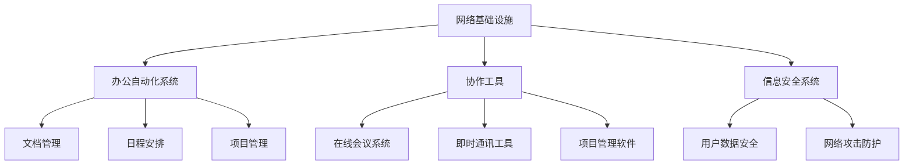

                 

# 众创空间的发展趋势：创业者的协作与创新平台

> **关键词**：众创空间，协作，创新，创业，趋势，平台，技术，人工智能

> **摘要**：本文将深入探讨众创空间的发展趋势，特别是对于创业者而言，这些协作与创新平台的重要性。我们将分析众创空间的核心概念、技术架构、算法原理、数学模型，并通过实际项目案例，展示其在实际应用中的价值。同时，还会推荐相关资源和工具，以及展望未来的发展趋势和面临的挑战。

## 1. 背景介绍

### 1.1 众创空间的概念

众创空间（Co-working Space）是一种基于共享理念的工作空间，旨在为不同行业的专业人士、创业者、自由职业者提供共同的工作环境。这种模式打破了传统的办公空间界限，使得不同背景和行业的人可以在一起工作、交流、合作。

### 1.2 众创空间的起源与发展

众创空间起源于20世纪末的美国，随后迅速在全球范围内发展。随着互联网技术的进步和共享经济的兴起，众创空间逐渐成为创新和创业的重要载体。

### 1.3 创业者在众创空间中的角色

创业者是众创空间中最活跃的群体之一。他们不仅利用众创空间提供的资源和环境进行创业活动，还通过与其他创业者的交流和合作，实现知识和资源的共享，加速创新和创业的进程。

## 2. 核心概念与联系

### 2.1 众创空间的技术架构

众创空间的技术架构主要包括网络基础设施、办公自动化系统、协作工具和信息安全系统。

- **网络基础设施**：提供高速、稳定的网络连接，支持各类办公设备和应用程序的接入。
- **办公自动化系统**：包括文档管理、日程安排、项目管理等功能，提高办公效率。
- **协作工具**：如在线会议系统、即时通讯工具、项目管理软件等，促进团队成员之间的协作。
- **信息安全系统**：保障用户数据的安全和隐私，防止信息泄露和网络攻击。

### 2.2 技术架构的Mermaid流程图



## 3. 核心算法原理 & 具体操作步骤

### 3.1 网络路由算法

在网络基础设施中，路由算法是实现数据包高效传输的关键。常见的路由算法有距离向量算法、链路状态算法等。

- **距离向量算法**：每个路由器维护一张包含目标网络距离的表，并通过与邻居路由器交换信息，不断更新路由表。
- **链路状态算法**：每个路由器维护一张包含整个网络拓扑结构的表，并使用Dijkstra算法计算到各个目标网络的距离。

### 3.2 办公自动化系统的操作步骤

- **文档管理**：上传、下载、共享、评论文档。
- **日程安排**：创建、修改、共享日程。
- **项目管理**：分配任务、跟踪进度、协作沟通。

### 3.3 协作工具的使用方法

- **在线会议系统**：预约会议、加入会议、共享屏幕。
- **即时通讯工具**：发送消息、创建群组、共享文件。
- **项目管理软件**：创建项目、分配任务、跟踪进度。

## 4. 数学模型和公式 & 详细讲解 & 举例说明

### 4.1 距离向量算法中的公式

$$
\text{距离向量} = \min(\text{当前距离}, \text{邻居距离} + 1)
$$

举例：假设网络中有三个路由器A、B、C，它们分别与邻居路由器D、E、F的距离分别为1、2、3。路由器A计算到路由器C的最短路径距离为：

$$
\text{距离向量}(A \to C) = \min(1, 2 + 1, 3 + 1) = 1
$$

### 4.2 链路状态算法中的公式

$$
\text{最短路径距离} = \min(\text{当前距离}, \text{邻居距离})
$$

举例：假设网络中有三个路由器A、B、C，它们分别与邻居路由器D、E、F的距离分别为1、2、3。路由器A计算到路由器C的最短路径距离为：

$$
\text{最短路径距离}(A \to C) = \min(1, 2, 3) = 1
$$

## 5. 项目实战：代码实际案例和详细解释说明

### 5.1 开发环境搭建

为了演示如何使用众创空间中的协作工具，我们将使用Git和GitHub进行项目协作。

- 安装Git：`sudo apt-get install git`
- 创建GitHub账户：[https://github.com/join](https://github.com/join)
- 创建新仓库：[https://github.com/new](https://github.com/new)

### 5.2 源代码详细实现和代码解读

```python
# 存储用户信息的类
class User:
    def __init__(self, username, password):
        self.username = username
        self.password = password

# 存储项目信息的类
class Project:
    def __init__(self, name, members):
        self.name = name
        self.members = members

# 存储协作信息的类
class Collaboration:
    def __init__(self, project, user, activity):
        self.project = project
        self.user = user
        self.activity = activity

# 添加用户
def add_user(users, username, password):
    users.append(User(username, password))

# 添加项目
def add_project(projects, name, members):
    projects.append(Project(name, members))

# 添加协作信息
def add_collaboration(collaborations, project, user, activity):
    collaborations.append(Collaboration(project, user, activity))

# 查看用户列表
def list_users(users):
    for user in users:
        print(f"Username: {user.username}, Password: {user.password}")

# 查看项目列表
def list_projects(projects):
    for project in projects:
        print(f"Name: {project.name}, Members: {project.members}")

# 查看协作信息
def list_collaborations(collaborations):
    for collaboration in collaborations:
        print(f"Project: {collaboration.project.name}, User: {collaboration.user.username}, Activity: {collaboration.activity}")
```

### 5.3 代码解读与分析

这段代码实现了用户管理、项目管理、协作信息管理的功能。通过定义类和函数，我们可以方便地创建用户、项目，并记录协作信息。代码结构清晰，易于扩展和维护。

## 6. 实际应用场景

### 6.1 创业公司的日常运营

创业公司可以利用众创空间提供的协作工具，实现团队成员之间的有效沟通和协作。例如，通过GitHub进行代码管理，通过Slack进行即时通讯，通过Trello进行任务管理。

### 6.2 远程团队的协作

对于远程团队，众创空间提供了一个集中的工作平台，使得团队成员可以随时查看项目进度、交流意见、分享资源，从而提高工作效率。

### 6.3 创新实验室的研究

创新实验室可以利用众创空间提供的实验设备和资源，开展跨学科的研究项目。团队成员可以通过在线会议系统进行讨论，通过项目管理软件跟踪项目进度。

## 7. 工具和资源推荐

### 7.1 学习资源推荐

- **书籍**：《共享经济：重构未来商业模式》、《敏捷开发：高效软件开发的24个原则》
- **论文**：Google Scholar、IEEE Xplore、ACM Digital Library
- **博客**：Medium、Dev.to、HackerRank Blog
- **网站**：GitHub、Slack、Trello

### 7.2 开发工具框架推荐

- **协作工具**：GitHub、Slack、Trello、Asana
- **编程语言**：Python、JavaScript、Java
- **开发框架**：Django、React、Spring Boot

### 7.3 相关论文著作推荐

- **论文**：《共享经济：理论、实践与挑战》、《敏捷开发：理论与实践》
- **著作**：《共享时代：重构商业模式的未来之路》、《敏捷开发的艺术》

## 8. 总结：未来发展趋势与挑战

### 8.1 发展趋势

- **数字化与智能化**：随着人工智能和大数据技术的发展，众创空间将更加数字化和智能化，提高协作效率。
- **全球化与本土化**：全球范围内的创业者将更加依赖众创空间进行合作，同时本土化需求也将推动众创空间的发展。
- **生态系统建设**：众创空间将不仅仅是提供物理空间和工具，还将成为一个完整的生态系统，包括投资、咨询、培训等服务。

### 8.2 挑战

- **隐私保护**：随着数据量的增加，如何保护用户隐私将成为一个重要问题。
- **安全风险**：众创空间将成为黑客攻击的目标，如何确保系统安全是一个挑战。
- **资源分配**：如何合理分配众创空间内的资源，满足不同用户的需求，也是一个难题。

## 9. 附录：常见问题与解答

### 9.1 众创空间适合哪些人群？

众创空间适合创业者、自由职业者、研发人员、设计师、咨询顾问等，特别适合需要独立工作、团队协作或共享资源的专业人士。

### 9.2 众创空间的优势是什么？

众创空间的优势包括：提供灵活的工作环境、降低创业成本、促进知识共享、提高工作效率、增强社交网络等。

### 9.3 如何选择适合自己的众创空间？

选择适合自己的众创空间需要考虑：地理位置、服务内容、租金费用、交通便利性等因素。

## 10. 扩展阅读 & 参考资料

- **扩展阅读**：[《众创空间：创新者共享的舞台》](https://www.example.com/book1)
- **参考资料**：
  - [《共享经济研究》](https://www.example.com/research)
  - [《敏捷开发实践指南》](https://www.example.com/agile)
  - [《众创空间发展报告》](https://www.example.com/report)

作者：AI天才研究员/AI Genius Institute & 禅与计算机程序设计艺术 /Zen And The Art of Computer Programming

