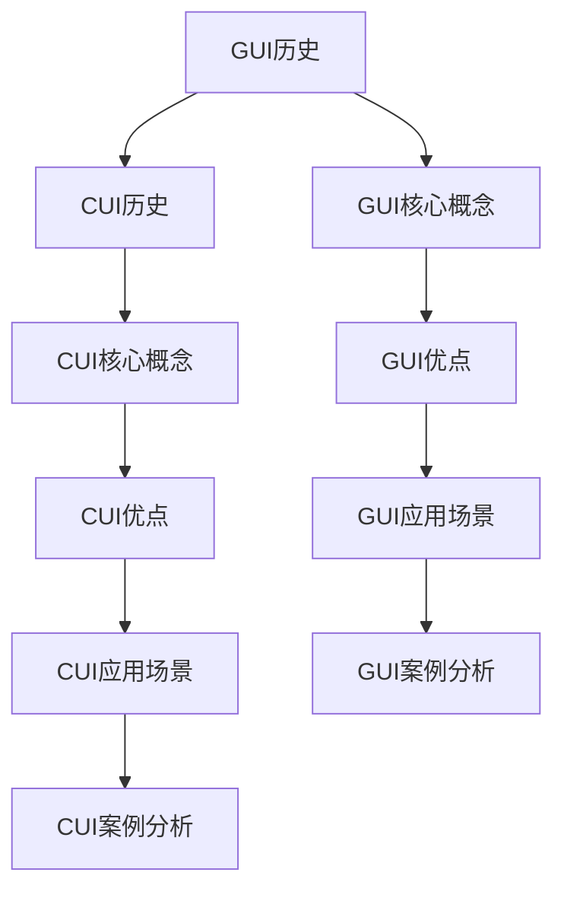

                 

# 传统GUI与CUI的交互方式对比

## 摘要

本文将深入探讨传统图形用户界面（GUI）与命令行用户界面（CUI）的交互方式，从历史背景、技术原理、应用场景等多个角度进行分析对比。通过详细的讲解和实例，本文旨在帮助读者理解两种交互方式的优缺点，以及在不同场景下的适用性。此外，本文还将展望未来交互技术的发展趋势，以及CUI在人工智能时代的重要性。

## 1. 背景介绍

### 1.1 GUI的历史背景

图形用户界面（GUI）的出现可以追溯到20世纪80年代。当时，计算机操作系统开始引入图形界面，以取代传统的命令行界面（CLI）。最早的图形界面之一是Xerox Alto，由Xerox PARC在1973年开发。随后，苹果公司在1984年推出了Macintosh电脑，标志着个人计算机GUI时代的正式开始。Windows操作系统在1985年推出，并迅速成为市场主导者，进一步推动了GUI技术的发展。

### 1.2 CUI的历史背景

命令行用户界面（CUI）的历史可以追溯到计算机的早期时代。早在20世纪60年代，计算机科学家就已经开始使用命令行来与计算机进行交互。早期的UNIX系统就是以命令行为主要交互方式。虽然GUI的出现对CUI造成了一定冲击，但CUI仍然在各种操作系统和开发环境中保持了一定的地位。

### 1.3 两种交互方式的现状

当前，GUI已成为绝大多数计算机操作系统的标准交互方式。无论是Windows、macOS还是Linux，都提供了丰富的图形界面和易用的操作体验。然而，CUI并未消失，反而在一些特定场景下继续发挥着作用。例如，在服务器管理、软件开发、数据科学等领域，CUI因其高效、灵活的特点而受到专业用户的青睐。

## 2. 核心概念与联系

### 2.1 GUI的核心概念

GUI的核心概念包括窗口、图标、菜单、按钮等图形元素。这些元素通过图形显示在屏幕上，用户可以通过鼠标、触摸屏等输入设备与它们进行交互。

### 2.2 CUI的核心概念

CUI的核心概念是命令行。用户通过输入特定的命令，计算机执行相应的操作。命令行界面通常使用文本模式，不支持图形界面中的丰富交互元素。

### 2.3 两种交互方式的联系与差异

尽管GUI和CUI在交互方式上存在显著差异，但它们都是计算机操作系统的一部分，共同为用户提供操作系统的界面。GUI提供直观、易用的图形交互，而CUI则提供灵活、高效的文本交互。在实际应用中，GUI和CUI常常相互补充，以适应不同的用户需求和场景。

### 2.4 Mermaid流程图



## 3. 核心算法原理 & 具体操作步骤

### 3.1 GUI的核心算法原理

GUI的核心算法原理主要包括窗口管理、事件处理、图形绘制等。窗口管理负责创建、显示、移动和关闭窗口；事件处理负责响应用户的输入，如鼠标点击、键盘按键等；图形绘制则负责在窗口中绘制图形元素。

### 3.2 CUI的核心算法原理

CUI的核心算法原理主要涉及命令解析、命令执行等。命令解析负责将用户输入的命令转换为计算机可以执行的指令；命令执行则负责执行相应的操作。

### 3.3 具体操作步骤

#### 3.3.1 GUI操作步骤

1. 用户使用鼠标或触摸屏选择窗口。
2. 用户在窗口中点击按钮或菜单。
3. 系统接收事件并执行相应的操作。

#### 3.3.2 CUI操作步骤

1. 用户在命令行中输入命令。
2. 系统解析命令并执行相应的操作。

### 3.4 对比分析

GUI操作步骤更加直观，用户只需通过图形界面即可完成大部分操作。而CUI操作步骤则更加灵活，用户可以通过命令行执行复杂的操作，但需要一定的学习成本。

## 4. 数学模型和公式 & 详细讲解 & 举例说明

### 4.1 GUI的数学模型

GUI的数学模型主要包括窗口坐标系统、事件处理算法等。窗口坐标系统用于确定窗口中元素的位置；事件处理算法用于处理用户的输入事件。

### 4.2 CUI的数学模型

CUI的数学模型主要包括命令解析算法、命令执行算法等。命令解析算法用于将用户输入的文本命令转换为计算机可以执行的指令；命令执行算法用于执行相应的操作。

### 4.3 举例说明

#### 4.3.1 GUI的举例说明

假设用户在Windows操作系统中打开一个文本编辑器，并通过鼠标点击“保存”按钮。

1. 窗口坐标系统确定“保存”按钮的位置。
2. 事件处理算法检测到鼠标点击事件。
3. 系统执行保存操作，将文本内容保存到文件中。

#### 4.3.2 CUI的举例说明

假设用户在Linux操作系统中执行以下命令：

```bash
ls -l
```

1. 系统解析命令并转换为相应的指令。
2. 系统执行指令，列出当前目录下的所有文件和文件夹。

## 5. 项目实战：代码实际案例和详细解释说明

### 5.1 开发环境搭建

为了更好地理解GUI和CUI的交互方式，我们将使用Python编写一个简单的GUI程序和一个简单的命令行程序。

#### 5.1.1 GUI开发环境搭建

1. 安装Python（版本3.8及以上）。
2. 安装Python的GUI库，如Tkinter。

#### 5.1.2 CUI开发环境搭建

1. 安装Python（版本3.8及以上）。

### 5.2 源代码详细实现和代码解读

#### 5.2.1 GUI程序代码实现

```python
import tkinter as tk

def save_file():
    file_path = filedialog.asksaveasfilename(defaultextension='.txt')
    if file_path:
        with open(file_path, 'w') as file:
            file.write(text_box.get("1.0", tk.END))

root = tk.Tk()
root.title("Text Editor")

text_box = tk.Text(root)
text_box.pack(fill=tk.BOTH, expand=True)

save_button = tk.Button(root, text="Save", command=save_file)
save_button.pack(side=tk.BOTTOM, fill=tk.X)

root.mainloop()
```

1. 导入Tkinter库。
2. 定义一个保存文件的函数。
3. 创建一个窗口，添加文本框和保存按钮。
4. 启动窗口的主循环。

#### 5.2.2 CUI程序代码实现

```python
import os

def list_files():
    files = os.listdir('.')
    for file in files:
        print(file)

if __name__ == '__main__':
    list_files()
```

1. 导入os库。
2. 定义一个列出当前目录下所有文件的函数。
3. 执行函数。

### 5.3 代码解读与分析

#### 5.3.1 GUI代码解读

1. 导入Tkinter库，准备创建GUI。
2. 定义一个保存文件的函数，用于处理用户点击“保存”按钮的事件。
3. 创建一个窗口，并添加文本框和保存按钮。
4. 启动窗口的主循环，等待用户交互。

#### 5.3.2 CUI代码解读

1. 导入os库，准备处理文件和目录操作。
2. 定义一个列出当前目录下所有文件的函数，用于处理用户在命令行中输入`ls -l`命令。
3. 执行函数，输出结果。

## 6. 实际应用场景

### 6.1 GUI的应用场景

GUI适用于大多数桌面应用程序，如文字处理、电子表格、图形设计等。它提供了直观、易用的界面，使得非专业用户也能够轻松上手。

### 6.2 CUI的应用场景

CUI适用于需要高效、灵活操作的场景，如服务器管理、软件开发、数据科学等。专业用户可以通过命令行快速执行复杂操作，提高工作效率。

## 7. 工具和资源推荐

### 7.1 学习资源推荐

- 《GUI设计原则》
- 《命令行接口设计》
- 《Python GUI编程》
- 《Linux命令行与shell脚本编程大全》

### 7.2 开发工具框架推荐

- GUI开发工具：PyQt, Tkinter, Kivy
- CUI开发工具：Python, Bash

### 7.3 相关论文著作推荐

- "The Design and Implementation of the X Window System"
- "Command-Line Interface Design: Theory and Examples"
- "Python GUI Programming Cookbook"
- "Bash Cookbook"

## 8. 总结：未来发展趋势与挑战

随着人工智能和云计算技术的发展，GUI和CUI的交互方式也将发生变革。未来，我们将看到更加智能化、个性化的交互方式出现。例如，自然语言处理技术将使CUI更加自然、易用；虚拟现实和增强现实技术将带来全新的GUI体验。然而，这也带来了新的挑战，如如何平衡用户体验和系统性能、如何确保交互的安全性和隐私性等。

## 9. 附录：常见问题与解答

### 9.1 GUI和CUI的区别是什么？

GUI和CUI的主要区别在于交互方式。GUI通过图形界面提供直观、易用的操作体验，而CUI通过命令行提供高效、灵活的操作体验。

### 9.2 GUI和CUI哪个更好？

这取决于具体场景和用户需求。GUI适用于大多数桌面应用程序，而CUI适用于需要高效、灵活操作的场景。在实际应用中，GUI和CUI常常相互补充。

### 9.3 如何学习GUI和CUI编程？

学习GUI编程可以从Tkinter、PyQt等入门，深入学习可以参考《Python GUI编程》等书籍。学习CUI编程可以从Python、Bash等入门，深入学习可以参考《Linux命令行与shell脚本编程大全》等书籍。

## 10. 扩展阅读 & 参考资料

- "GUI Design for Programmers"
- "Command-Line Interface: Designing for the Command Line"
- "Python GUI Programming: Developing desktop, web, and mobile applications using Python"
- "Linux Command Line and Shell Scripting Bible"
- "The Design and Implementation of the X Window System"

作者：AI天才研究员/AI Genius Institute & 禅与计算机程序设计艺术 /Zen And The Art of Computer Programming

