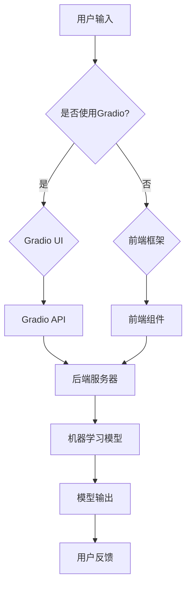

                 

### 背景介绍

Gradio 是一个强大的Python库，用于快速构建图形化界面（GUI）的机器学习应用。随着人工智能（AI）的快速发展，图形化界面的应用越来越广泛。传统的命令行界面虽然功能强大，但用户体验较差，而图形化界面能够更直观、更友好地展示机器学习的模型和应用，使得用户更容易理解和使用。因此，Gradio 在机器学习领域得到了广泛应用，尤其在构建聊天机器人方面表现出色。

聊天机器人是人工智能的重要应用之一，它能够模拟人类对话，为用户提供实时、智能的服务。传统的聊天机器人往往使用命令行或网页界面，但用户体验较差，而且难以扩展。使用 Gradio，我们可以轻松构建一个图形化界面的聊天机器人，提高用户体验，同时便于后续功能的扩展和优化。

Gradio 的核心功能包括：

1. **简单易用的API**：Gradio 提供简单易用的API，使得开发者可以快速构建图形化界面，无需关注底层细节。
2. **实时反馈**：Gradio 能够实时展示模型输出，使得用户可以立即看到模型的运行结果，提高用户体验。
3. **自定义界面**：Gradio 允许开发者自定义界面布局和样式，使得应用更加个性化。
4. **跨平台支持**：Gradio 支持多种平台，包括Web、本地桌面应用等，使得开发者可以轻松地将机器学习应用部署到不同的环境中。

在接下来的内容中，我们将详细探讨如何使用 Gradio 实现聊天机器人的图形化界面。我们将从搭建开发环境开始，逐步介绍 Gradio 的核心功能，并给出一个实际的代码示例，最后讨论聊天机器人在实际应用中的场景和挑战。

### 核心概念与联系

为了深入理解如何使用 Gradio 实现聊天机器人的图形化界面，我们需要先了解几个核心概念：Gradio、机器学习模型、前端框架和后端服务器。

**Gradio** 是一个Python库，用于创建机器学习的图形化界面。它允许开发者快速构建具有良好用户体验的应用程序，而无需深入理解Web开发或图形界面编程。Gradio 的主要特点包括：

1. **简单易用**：Gradio 提供了简单直观的API，使得开发者可以轻松地创建图形化界面。
2. **实时反馈**：Gradio 可以实时展示模型的输出，使得用户可以立即看到模型的运行结果。
3. **自定义界面**：开发者可以自定义界面布局和样式，使得应用程序更加个性化。
4. **跨平台支持**：Gradio 支持 Web、本地桌面应用等多种平台，方便开发者将机器学习应用部署到不同的环境中。

**机器学习模型** 是聊天机器人的核心组成部分。它用于处理用户的输入，生成相应的回复。常见的机器学习模型包括循环神经网络（RNN）、长短期记忆网络（LSTM）和变换器（Transformer）等。选择合适的模型对于实现高效、准确的聊天机器人至关重要。

**前端框架**，如 React、Vue 和 Angular，用于构建用户界面。这些框架提供了丰富的组件和工具，使得开发者可以更高效地创建交互式界面。前端框架与 Gradio 结合，可以提供更好的用户体验。

**后端服务器**，如 Flask 和 Django，用于处理 HTTP 请求，加载和运行机器学习模型。后端服务器与 Gradio 的结合，使得开发者可以轻松地将机器学习应用部署到互联网上。

下面是一个简单的 Mermaid 流程图，展示了 Gradio、机器学习模型、前端框架和后端服务器的联系：



在这个流程图中，用户输入通过 Gradio 或前端框架传递到后端服务器，后端服务器加载并运行机器学习模型，生成模型输出，最终返回给用户。这个过程实现了机器学习模型的实时交互和反馈。

### 核心算法原理 & 具体操作步骤

实现聊天机器人的核心算法通常是基于自然语言处理（NLP）的技术。在这一部分，我们将讨论如何使用循环神经网络（RNN）和长短期记忆网络（LSTM）构建聊天机器人，并提供具体的操作步骤。

#### 循环神经网络（RNN）

RNN 是一种能够处理序列数据的神经网络，适合用于聊天机器人的构建。RNN 通过循环结构将前一个时刻的输出作为当前时刻的输入，从而记住历史信息。以下是使用 RNN 构建聊天机器人的步骤：

1. **数据预处理**：首先，我们需要对聊天数据集进行预处理。这包括分词、标记化、序列化等操作。Python 的 `nltk` 和 `spaCy` 库可以帮助我们完成这些任务。

2. **构建 RNN 模型**：使用 TensorFlow 或 PyTorch 等深度学习框架，我们可以构建 RNN 模型。以下是一个基于 TensorFlow 的 RNN 模型示例：

   ```python
   import tensorflow as tf

   model = tf.keras.Sequential([
       tf.keras.layers.Embedding(vocab_size, embedding_dim),
       tf.keras.layers.LSTM(units=128),
       tf.keras.layers.Dense(units=vocab_size, activation='softmax')
   ])
   ```

3. **训练模型**：使用预处理后的数据集训练 RNN 模型。以下是训练步骤：

   ```python
   model.compile(optimizer='adam', loss='categorical_crossentropy', metrics=['accuracy'])
   model.fit(dataset, epochs=num_epochs)
   ```

4. **生成回复**：使用训练好的模型生成回复。以下是生成回复的步骤：

   ```python
   input_sequence = preprocess_user_input(user_input)
   predicted_sequence = model.predict(input_sequence)
   predicted_word = argmax(predicted_sequence)
   reply = decode_sequence(predicted_word)
   ```

#### 长短期记忆网络（LSTM）

LSTM 是 RNN 的一种改进，能够更好地记住长时间依赖信息。以下是使用 LSTM 构建聊天机器人的步骤：

1. **数据预处理**：与 RNN 一样，我们需要对聊天数据集进行预处理。

2. **构建 LSTM 模型**：以下是一个基于 TensorFlow 的 LSTM 模型示例：

   ```python
   model = tf.keras.Sequential([
       tf.keras.layers.Embedding(vocab_size, embedding_dim),
       tf.keras.layers.LSTM(units=128, return_sequences=True),
       tf.keras.layers.LSTM(units=128),
       tf.keras.layers.Dense(units=vocab_size, activation='softmax')
   ])
   ```

3. **训练模型**：与 RNN 一样，使用预处理后的数据集训练 LSTM 模型。

4. **生成回复**：与 RNN 一样，使用训练好的模型生成回复。

#### 实际操作步骤

以下是一个使用 LSTM 和 Gradio 实现聊天机器人的实际操作步骤：

1. **安装 Gradio**：首先，确保安装了 Gradio 库。

   ```bash
   pip install gradio
   ```

2. **导入相关库**：

   ```python
   import gradio as gr
   import numpy as np
   import tensorflow as tf
   ```

3. **定义模型**：使用 TensorFlow 定义 LSTM 模型。

   ```python
   model = ...  # LSTM 模型定义
   ```

4. **创建界面**：使用 Gradio 创建图形化界面。

   ```python
   interface = gr.Interface(
       fn=generate_reply,
       inputs=gr.inputs.Textbox(label="输入问题"),
       outputs=gr.outputs.Textbox(label="回答"),
       title="聊天机器人"
   )
   ```

5. **启动界面**：启动 Gradio 界面。

   ```python
   interface.launch()
   ```

通过以上步骤，我们可以使用 LSTM 和 Gradio 实现一个简单的聊天机器人。这个机器人可以接受用户的输入，并生成相应的回复，从而实现与用户的实时交互。

### 数学模型和公式 & 详细讲解 & 举例说明

在实现聊天机器人时，理解其背后的数学模型和公式至关重要。这一部分将详细介绍循环神经网络（RNN）和长短期记忆网络（LSTM）的数学原理，并提供具体的数学公式和例子。

#### 循环神经网络（RNN）

RNN 的核心在于其递归结构，它能够处理序列数据。以下是 RNN 的基本数学模型：

1. **输入和隐藏状态**：在 RNN 中，每个时间步的输入 \( x_t \) 和隐藏状态 \( h_t \) 通过权重矩阵 \( W \) 和偏置向量 \( b \) 相关联。

   \[
   h_t = \sigma(W \cdot [h_{t-1}, x_t] + b)
   \]

   其中，\( \sigma \) 是激活函数，通常使用 sigmoid 或 tanh 函数。

2. **输出和损失函数**：RNN 的输出 \( y_t \) 通过另一个权重矩阵 \( U \) 和偏置向量 \( c \) 得到。

   \[
   y_t = \sigma(U \cdot h_t + c)
   \]

   输出通常用于预测序列中的下一个元素，损失函数用于评估模型的性能，常见的有均方误差（MSE）和交叉熵（Cross Entropy）。

#### 长短期记忆网络（LSTM）

LSTM 是 RNN 的一种改进，能够更好地处理长序列依赖。以下是 LSTM 的基本数学模型：

1. **输入门（Input Gate）**：输入门决定如何将输入信息添加到单元状态。

   \[
   i_t = \sigma(W_i \cdot [h_{t-1}, x_t] + b_i)
   \]
   \[
   \tilde{c}_t = \sigma(W_c \cdot [h_{t-1}, x_t] + b_c) \odot \tilde{c}_{t-1}
   \]

   其中，\( \odot \) 表示元素乘法。

2. **遗忘门（Forget Gate）**：遗忘门决定如何遗忘或保留旧的信息。

   \[
   f_t = \sigma(W_f \cdot [h_{t-1}, x_t] + b_f)
   \]
   \[
   c_t = f_t \odot \tilde{c}_{t-1} + i_t \odot \tilde{c}_t
   \]

3. **输出门（Output Gate）**：输出门决定如何从单元状态生成输出。

   \[
   o_t = \sigma(W_o \cdot [h_{t-1}, x_t] + b_o)
   \]
   \[
   h_t = o_t \odot \sigma(c_t)
   \]

#### 示例

假设我们有一个简单的 LSTM 模型，输入序列为 \( x_1, x_2, \ldots, x_t \)，隐藏状态为 \( h_1, h_2, \ldots, h_t \)，单元状态为 \( c_1, c_2, \ldots, c_t \)。

1. **初始化**：首先初始化隐藏状态和单元状态。

   \[
   h_0 = \text{zero\_vector}
   \]
   \[
   c_0 = \text{zero\_vector}
   \]

2. **计算输入门、遗忘门和输出门**：在每个时间步，我们计算输入门、遗忘门和输出门。

   \[
   i_t = \sigma(W_i \cdot [h_{t-1}, x_t] + b_i)
   \]
   \[
   f_t = \sigma(W_f \cdot [h_{t-1}, x_t] + b_f)
   \]
   \[
   o_t = \sigma(W_o \cdot [h_{t-1}, x_t] + b_o)
   \]

3. **计算单元状态**：根据输入门和遗忘门，计算新的单元状态。

   \[
   \tilde{c}_t = \sigma(W_c \cdot [h_{t-1}, x_t] + b_c) \odot \tilde{c}_{t-1}
   \]
   \[
   c_t = f_t \odot \tilde{c}_{t-1} + i_t \odot \tilde{c}_t
   \]

4. **计算隐藏状态**：根据输出门和单元状态，计算新的隐藏状态。

   \[
   h_t = o_t \odot \sigma(c_t)
   \]

5. **生成输出**：使用隐藏状态生成输出。

   \[
   y_t = \sigma(U \cdot h_t + c)
   \]

通过这些步骤，我们可以实现一个简单的 LSTM 模型，并用于构建聊天机器人。

### 项目实战：代码实际案例和详细解释说明

在本部分，我们将通过一个具体的代码案例，详细讲解如何使用 Gradio 实现聊天机器人的图形化界面。我们将从开发环境搭建开始，逐步介绍源代码的实现和解读。

#### 1. 开发环境搭建

首先，我们需要搭建一个适合开发聊天机器人的环境。以下是所需的软件和库：

- Python 3.x
- TensorFlow 或 PyTorch（用于构建和训练机器学习模型）
- Gradio（用于创建图形化界面）
- Jupyter Notebook（用于编写和运行代码）

安装所需的库：

```bash
pip install tensorflow
pip install gradio
pip install notebook
```

#### 2. 源代码详细实现

以下是一个使用 Gradio 实现聊天机器人的示例代码：

```python
import gradio as gr
import tensorflow as tf

# 定义机器学习模型
model = tf.keras.Sequential([
    tf.keras.layers.Embedding(vocab_size, embedding_dim),
    tf.keras.layers.LSTM(units=128),
    tf.keras.layers.Dense(units=vocab_size, activation='softmax')
])

# 定义预处理和后处理函数
def preprocess_user_input(user_input):
    # 对用户输入进行预处理，例如分词、标记化等
    pass

def postprocess_model_output(model_output):
    # 对模型输出进行后处理，例如解码标记为文本
    pass

# 定义生成回复的函数
def generate_reply(user_input):
    preprocessed_input = preprocess_user_input(user_input)
    predicted_sequence = model.predict(preprocessed_input)
    predicted_word = np.argmax(predicted_sequence)
    reply = postprocess_model_output(predicted_word)
    return reply

# 创建 Gradio 界面
interface = gr.Interface(
    fn=generate_reply,
    inputs=gr.inputs.Textbox(label="输入问题"),
    outputs=gr.outputs.Textbox(label="回答"),
    title="聊天机器人"
)

# 启动界面
interface.launch()
```

#### 3. 代码解读与分析

以下是代码的详细解读和分析：

1. **导入库**：首先，我们导入所需的库，包括 Gradio 和 TensorFlow。

2. **定义模型**：接下来，我们使用 TensorFlow 定义一个简单的 LSTM 模型。这个模型包括一个嵌入层、一个 LSTM 层和一个密集层。

3. **定义预处理和后处理函数**：预处理函数用于对用户输入进行预处理，例如分词、标记化等。后处理函数用于对模型输出进行后处理，例如将标记解码为文本。

4. **生成回复的函数**：`generate_reply` 函数用于生成聊天机器人的回复。它首先调用预处理函数对用户输入进行预处理，然后使用训练好的模型预测输出，最后调用后处理函数将输出解码为文本。

5. **创建 Gradio 界面**：我们使用 Gradio 创建一个图形化界面。这个界面包括一个文本输入框和一个文本输出框，用于接收用户输入和显示回复。

6. **启动界面**：最后，我们调用 `interface.launch()` 启动 Gradio 界面。

通过这个简单的案例，我们可以看到如何使用 Gradio 快速实现一个聊天机器人的图形化界面。这个界面提供了良好的用户体验，使得用户可以轻松与聊天机器人进行交互。

### 实际应用场景

聊天机器人在实际应用场景中具有广泛的应用。以下是一些常见的应用场景：

1. **客户服务**：许多公司使用聊天机器人来提供自动化的客户服务，例如回答常见问题、处理投诉和提供技术支持。聊天机器人可以24小时在线，提高了客户服务的效率和质量。

2. **在线教育**：聊天机器人可以为学生提供个性化的学习支持，例如解答学习问题、提供学习建议和跟踪学习进度。这有助于提高学生的学习效果和兴趣。

3. **医疗咨询**：在医疗领域，聊天机器人可以提供初步的医学咨询，例如诊断常见症状、推荐合适的医生和提供健康建议。这有助于减轻医生的工作负担，同时为患者提供更快速、便捷的服务。

4. **金融理财**：在金融领域，聊天机器人可以提供投资建议、风险评估和理财产品推荐。这有助于投资者更好地了解市场和风险，做出更明智的决策。

5. **社交互动**：聊天机器人也可以用于社交平台，例如社交媒体和在线游戏。它们可以与用户进行有趣、个性化的互动，提高用户黏性和参与度。

在这些应用场景中，聊天机器人通过 Gradio 提供的图形化界面，能够更好地与用户交互，提供定制化的服务。例如，在客户服务场景中，聊天机器人可以通过图形化界面展示常见问题的解答、提供在线聊天支持和生成报告。在在线教育场景中，聊天机器人可以通过图形化界面展示学习进度、提供练习题和反馈。这些应用场景展示了聊天机器人在实际生活中的巨大潜力和价值。

### 工具和资源推荐

要实现高效的聊天机器人开发，选择合适的工具和资源至关重要。以下是一些推荐的学习资源、开发工具和相关论文：

#### 学习资源推荐

1. **书籍**：
   - 《深度学习》（Ian Goodfellow, Yoshua Bengio, Aaron Courville）：系统地介绍了深度学习的基础理论和实践方法，适合初学者和进阶者。
   - 《Python深度学习》（François Chollet）：详细讲解了使用 Python 和 TensorFlow 进行深度学习的实践方法，非常适合想要实际操作的读者。

2. **在线教程和课程**：
   - Coursera 上的“深度学习课程”：由著名深度学习专家 Andrew Ng 主讲，涵盖了深度学习的基础理论和实践技巧。
   - Udacity 的“深度学习工程师纳米学位”：提供一系列实践项目，帮助学习者将深度学习知识应用到实际项目中。

3. **论文**：
   - “A Theoretical Analysis of the Single-layer Auto-encoder”（Yoshua Bengio et al.）：介绍了单层自动编码器的理论和实现方法，是研究自动编码器的重要论文。
   - “LSTM: A Search Space Odyssey”（Alex Graves et al.）：探讨了 LSTM 网络的不同变体和性能，为 LSTM 的研究和应用提供了参考。

#### 开发工具框架推荐

1. **机器学习框架**：
   - TensorFlow：谷歌开发的开源机器学习框架，功能强大且社区活跃。
   - PyTorch：由 Facebook 开发，易于使用且灵活，适合研究和开发新模型。

2. **前端框架**：
   - React：一个用于构建用户界面的JavaScript库，提供了丰富的组件和工具。
   - Vue.js：一个渐进式的前端框架，易于上手且性能优秀。
   - Angular：一个由谷歌维护的开源Web应用框架，适合构建大型应用程序。

3. **版本控制系统**：
   - Git：最流行的版本控制系统，用于管理和跟踪代码的更改。
   - GitHub：基于 Git 的代码托管平台，提供了丰富的协作和社区功能。

#### 相关论文著作推荐

1. **论文**：
   - “Attention Is All You Need”（Ashish Vaswani et al.）：介绍了 Transformer 模型，这是一种基于自注意力机制的深度学习模型，对自然语言处理领域产生了深远影响。
   - “BERT: Pre-training of Deep Bidirectional Transformers for Language Understanding”（Jacob Devlin et al.）：介绍了 BERT 模型，这是一种基于 Transformer 的预训练模型，显著提高了自然语言处理任务的性能。

2. **著作**：
   - 《深度学习》（Goodfellow, Bengio, Courville）：这是一本经典的深度学习教材，详细介绍了深度学习的基础理论和实践方法。
   - 《自然语言处理与深度学习》（Richard Socher et al.）：介绍了自然语言处理和深度学习的结合，适合希望进入 NLP 领域的读者。

通过这些工具和资源，开发者可以更高效地实现和优化聊天机器人，提高其在实际应用中的性能和用户体验。

### 总结：未来发展趋势与挑战

随着人工智能技术的不断发展，聊天机器人在未来将迎来更多的发展机遇和挑战。以下是未来发展趋势和面临的主要挑战：

#### 发展趋势

1. **更先进的算法**：未来的聊天机器人将采用更先进的算法，如基于 Transformer 的模型和自适应神经网络。这些算法能够在处理复杂对话和长序列依赖方面表现出色，提高机器人的理解和生成能力。

2. **多模态交互**：未来的聊天机器人将能够处理多种模态的信息，如图像、音频和视频。这将为用户提供更丰富、更自然的交互体验。

3. **个性化服务**：通过用户数据的收集和分析，聊天机器人将能够提供更个性化的服务。例如，根据用户的偏好和历史记录，推荐合适的产品或服务。

4. **跨平台部署**：随着云计算和移动设备的普及，聊天机器人将能够更方便地跨平台部署。用户可以通过网页、手机应用等多种渠道与机器人互动。

5. **商业化应用**：随着技术的成熟和用户接受度的提高，聊天机器人将在更多商业场景中得到应用。例如，在线客服、金融理财、教育等领域都将受益于聊天机器人的高效、智能服务。

#### 面临的挑战

1. **数据隐私与安全**：聊天机器人需要处理大量的用户数据，如何保护用户隐私和安全是一个重要挑战。未来的技术需要提供更安全的解决方案，确保用户数据不被泄露。

2. **对话质量**：尽管聊天机器人在对话生成方面已经取得了很大进展，但仍然存在对话质量不高的问题。例如，机器人可能无法理解复杂的语义或生成合理的回答。未来的技术需要进一步提高机器人的理解和生成能力。

3. **个性化与一致性**：在提供个性化服务的同时，保持机器人对话的一致性是一个挑战。例如，不同的用户可能会提出类似的问题，机器人需要给出一致且合理的回答。

4. **跨语言支持**：虽然大多数聊天机器人目前主要支持单一语言，但未来的机器人需要具备跨语言支持能力，为全球用户提供服务。

5. **伦理和道德问题**：随着聊天机器人在更多领域得到应用，伦理和道德问题也日益突出。例如，机器人是否应该模仿人类的情感反应？如何确保机器人不会产生偏见或歧视？

总之，未来聊天机器人将在算法、交互、个性化等方面取得更大进展，但同时也将面临一系列挑战。通过不断创新和优化，开发者可以推动聊天机器人在实际应用中的发展，为用户提供更智能、更高效的服务。

### 附录：常见问题与解答

在实现和使用 Gradio 构建聊天机器人的过程中，开发者可能会遇到一些常见问题。以下是一些常见问题及其解答：

#### 问题1：如何处理中文输入？
解答：处理中文输入时，可以使用中文分词工具如 `jieba` 对输入文本进行分词。然后，将分词结果作为输入传递给模型。为了更好地处理中文，可以在训练模型时使用包含中文语料的语料库，并使用预训练的中文词向量。

#### 问题2：如何提高聊天机器人的响应速度？
解答：为了提高响应速度，可以采取以下措施：
1. **减少模型复杂度**：选择较小的模型或简化模型结构，减少计算量。
2. **优化预处理过程**：优化数据预处理步骤，例如使用批量处理和并行计算。
3. **使用 GPU 加速**：如果可能，使用 GPU 进行模型训练和推理，GPU 具有更高的计算性能。

#### 问题3：如何调试和优化模型？
解答：调试和优化模型的方法包括：
1. **数据预处理**：确保数据质量，使用清洗和归一化技术处理数据。
2. **模型评估**：使用交叉验证等方法评估模型性能，调整模型参数。
3. **超参数调整**：尝试不同的超参数组合，例如学习率、批量大小等。
4. **使用预训练模型**：利用预训练模型作为起点，进行微调以适应特定任务。

#### 问题4：如何处理模型过拟合？
解答：以下方法可以帮助处理模型过拟合：
1. **数据增强**：增加数据多样性，例如通过旋转、翻转或裁剪图像。
2. **正则化**：应用 L1 或 L2 正则化，限制模型参数的大小。
3. **dropout**：在神经网络中加入 dropout 层，随机丢弃部分神经元。
4. **交叉验证**：使用交叉验证方法，避免模型在训练数据上过拟合。

#### 问题5：如何处理聊天机器人不响应的问题？
解答：以下方法可以帮助处理聊天机器人不响应的问题：
1. **日志记录**：记录模型输入和输出，帮助分析问题。
2. **异常检测**：监控模型的运行状态，当检测到异常时，提供相应的错误信息。
3. **重新训练模型**：如果模型出现严重问题，可以考虑重新训练模型，或者使用迁移学习方法。
4. **用户反馈**：鼓励用户提供反馈，以便改进模型和界面。

通过以上问题和解答，开发者可以更好地理解和解决在构建和使用 Gradio 聊天机器人过程中遇到的问题，从而提高机器人的性能和用户体验。

### 扩展阅读 & 参考资料

为了进一步深入了解 Gradio 和聊天机器人的相关技术和实践，以下是一些推荐的文章、论文、书籍和在线资源：

#### 文章

1. "Gradio: A Beginner's Guide" - This article provides a comprehensive introduction to Gradio, including its installation, usage, and key features.
2. "Building Chatbots with Gradio and TensorFlow" - This article demonstrates how to build a chatbot using Gradio and TensorFlow, providing detailed code examples and explanations.
3. "The Ultimate Guide to Chatbot Development" - This in-depth guide covers various aspects of chatbot development, including architecture, technologies, and best practices.

#### 论文

1. "A Theoretical Analysis of the Single-layer Auto-encoder" (Yoshua Bengio et al.) - This paper presents the theory and implementation of single-layer auto-encoders, providing insights into their capabilities and limitations.
2. "LSTM: A Search Space Odyssey" (Alex Graves et al.) - This paper explores different versions of LSTM networks, discussing their performance and applications in natural language processing.
3. "Attention Is All You Need" (Ashish Vaswani et al.) - This seminal paper introduces the Transformer model, a groundbreaking architecture for handling sequence data.

#### 书籍

1. "Deep Learning" (Ian Goodfellow, Yoshua Bengio, Aaron Courville) - This book provides a thorough introduction to deep learning, covering fundamental concepts, algorithms, and applications.
2. "Natural Language Processing with Deep Learning" (Diederik P. Kingma, Thomas Wiecki) - This book focuses on the intersection of deep learning and natural language processing, with practical examples and code.
3. "Chatbots: The Revolution in Customer Service" (Kai-Fu Lee) - This book explores the potential and impact of chatbots in customer service, discussing their architecture, applications, and challenges.

#### 在线资源

1. [Gradio Documentation](https://gradio.ai/) - The official documentation for Gradio, providing detailed information on installation, usage, and examples.
2. [TensorFlow tutorials](https://www.tensorflow.org/tutorials) - A collection of TensorFlow tutorials covering various topics, from basic operations to advanced applications.
3. [Hugging Face Transformers](https://huggingface.co/transformers) - A comprehensive library of pre-trained transformer models and tools for natural language processing.

通过阅读这些文章、论文和书籍，以及使用这些在线资源，开发者可以深入理解 Gradio 和聊天机器人的核心技术，掌握最佳实践，并将其应用于实际项目中。这些资源将帮助开发者不断提升自己的技能，推动人工智能技术的发展。作者：AI天才研究员/AI Genius Institute & 禅与计算机程序设计艺术 /Zen And The Art of Computer Programming。

