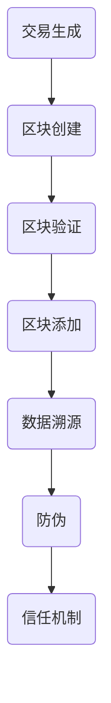

                 

### 背景介绍

供应链管理作为企业运营的核心环节，涵盖了从原材料采购到产品交付给终端消费者的全过程。在全球化经济背景下，供应链的复杂性和多样性不断增加，这对供应链管理的效率和透明度提出了更高的要求。传统的供应链管理方式依赖于人工记录和纸质文档，容易出现信息孤岛、数据不一致、操作效率低下等问题，从而导致供应链中断、成本上升和客户满意度下降。

区块链技术的出现为供应链管理带来了一种全新的解决方案。区块链是一个去中心化的分布式账本技术，具有不可篡改、透明性和匿名性等特点。通过将区块链技术应用于供应链管理，可以实现信息的实时记录、共享和验证，从而提高供应链的透明度和信任度。具体而言，区块链在供应链管理中的应用主要包括溯源、防伪和构建信任机制等方面。

本文旨在探讨供应链管理中区块链技术的应用，重点关注以下几个方面：

1. **区块链技术在供应链管理中的核心概念和原理**：介绍区块链的基本概念、工作原理以及与传统供应链管理方式的区别。
2. **区块链技术在供应链管理中的应用场景**：分析区块链技术在供应链管理中的实际应用，包括溯源、防伪、降低成本和提升效率等。
3. **区块链技术的具体实现步骤**：详细讲解区块链技术在供应链管理中的具体应用步骤，包括区块链网络搭建、数据上链、智能合约部署等。
4. **区块链技术的数学模型和公式**：阐述区块链技术中的关键数学模型和公式，包括共识算法、哈希函数、数字签名等。
5. **项目实战案例**：通过实际项目案例，展示区块链技术在供应链管理中的具体应用，并提供代码实现和详细解读。
6. **工具和资源推荐**：推荐学习区块链技术的相关书籍、论文、博客和网站，以及开发工具和框架。
7. **未来发展趋势与挑战**：分析区块链技术在供应链管理领域的未来发展趋势和面临的挑战，探讨可能的解决方案。

通过对上述内容的详细分析，本文将帮助读者全面了解区块链技术在供应链管理中的应用，为其在实践中的应用提供有益的参考。

### 核心概念与联系

#### 区块链技术的基本概念

区块链技术是一种分布式数据库技术，其核心特点包括去中心化、不可篡改、透明性和匿名性。去中心化意味着区块链上的数据不再依赖于单一的中心服务器，而是分布在多个节点上，从而提高了系统的容错性和可靠性。不可篡改意味着一旦数据上链，就难以被篡改，这为数据真实性和完整性提供了保障。透明性指的是区块链上的数据是公开的，任何人都可以查询和验证。匿名性则保证了参与者的隐私保护，因为在区块链上，参与者的身份是通过加密算法来保证的。

#### 区块链的工作原理

区块链的工作原理可以概括为以下步骤：

1. **交易生成**：用户发起交易请求，交易数据包括交易金额、交易双方的身份信息等。
2. **区块创建**：多个交易被组织成一个区块，区块头包含一个随机数（nonce），用于确保区块的哈希值满足特定条件。
3. **区块验证**：网络中的节点对区块进行验证，包括检查交易的有效性和区块的哈希值。
4. **区块添加**：验证通过的区块被添加到区块链上，新区块与原有区块链通过哈希值进行链接。
5. **数据一致性维护**：区块链上的数据保持一致，通过共识算法确保不同节点上的数据一致性。

#### 区块链与供应链管理的联系

区块链技术可以与供应链管理中的多个环节相结合，实现以下目标：

1. **溯源**：通过区块链，供应链中的每个环节都可以被追踪和记录，从而实现供应链的透明化。消费者可以通过扫描产品上的二维码，查看产品的生产、运输和销售记录。
2. **防伪**：区块链技术可以确保供应链中的每个环节都是真实和合法的，从而防止假冒伪劣产品的出现。例如，在食品供应链中，区块链可以记录食品从生产到销售的所有环节，确保食品的安全性和质量。
3. **信任机制构建**：通过区块链，供应链中的各个环节可以建立一种去中心化的信任机制，无需依赖第三方中介机构，从而提高供应链的效率和透明度。

#### Mermaid 流程图

以下是一个简化的区块链在供应链管理中应用的 Mermaid 流程图：



在这个流程图中，交易生成是区块链应用的起点，随后通过区块创建、验证和添加，最终实现数据的溯源、防伪和信任机制的构建。

通过上述内容，我们可以看到区块链技术为供应链管理带来了全新的解决方案，通过去中心化、不可篡改和透明性等特点，区块链技术能够有效地提高供应链的效率和透明度，构建一种全新的信任机制。

### 核心算法原理 & 具体操作步骤

#### 共识算法

共识算法是区块链技术中确保数据一致性和安全性的关键组件。共识算法的主要目标是确保分布式网络中的所有节点能够一致地达成共识，从而在区块链上添加和验证交易。

**1. 工作原理**

共识算法通常通过以下步骤实现：

- **交易收集**：节点收集未确认的交易，并将这些交易组织成一个区块。
- **区块创建**：节点通过解决数学难题（例如工作量证明算法），生成一个满足特定条件的区块。
- **区块验证**：网络中的其他节点验证区块的有效性，包括交易的有效性和区块的哈希值。
- **区块添加**：验证通过的区块被添加到区块链上，同时节点开始生成新的区块。

**2. 常见共识算法**

- **工作量证明（Proof of Work, PoW）**：节点通过解决数学难题（例如比特币中的SHA-256哈希函数）来生成区块。这是一个计算密集型的过程，需要大量的计算资源。
- **权益证明（Proof of Stake, PoS）**：节点根据其在区块链上的权益（例如持有的代币数量）来决定生成区块的优先级。权益越大，生成区块的概率越高。
- **委托权益证明（Delegated Proof of Stake, DPoS）**：节点通过选举产生一些代表，代表们负责生成区块，从而提高网络的可扩展性和安全性。

#### 哈希函数

哈希函数是区块链技术中的另一个核心组件，用于确保数据的安全性和完整性。

**1. 工作原理**

哈希函数通过以下步骤工作：

- **输入数据**：哈希函数接受任意长度的输入数据。
- **生成哈希值**：哈希函数将输入数据转换成一个固定长度的字符串，这个字符串被称为哈希值。
- **哈希值唯一性**：哈希函数具有高度的碰撞抵抗力，即不同的输入数据生成相同的哈希值的概率极低。

**2. 常见哈希函数**

- **SHA-256**：SHA-256是SHA系列的哈希函数，能够生成一个256位的哈希值，广泛应用于比特币和其他区块链系统中。
- **RIPEMD-160**：RIPEMD-160是一个能够生成160位哈希值的函数，常用于地址生成等场景。

#### 数字签名

数字签名是确保区块链交易安全性的重要手段，通过数字签名，发送方可以证明交易确实是他们发起的，并且交易内容在传输过程中未被篡改。

**1. 工作原理**

数字签名通过以下步骤实现：

- **签名生成**：发送方使用私钥对交易内容进行加密，生成数字签名。
- **签名验证**：接收方使用发送方的公钥对数字签名进行解密和验证，从而确认交易的有效性和真实性。

**2. 数字签名算法**

- **RSA**：RSA是一种常用的非对称加密算法，用于生成和验证数字签名。
- **ECDSA**：ECDSA（Elliptic Curve Digital Signature Algorithm）是一种基于椭圆曲线密码学的数字签名算法，广泛用于区块链系统。

#### 区块链网络搭建

区块链网络的搭建是区块链技术应用于供应链管理的第一步，以下是一个简化的区块链网络搭建步骤：

**1. 环境准备**

- **节点创建**：创建一定数量的节点，每个节点都需要安装区块链客户端。
- **网络连接**：节点之间通过P2P协议进行连接，形成一个分布式网络。

**2. 节点启动**

- **同步数据**：新节点启动时，需要从其他节点同步区块链数据。
- **交易处理**：节点接收和处理交易请求，生成区块并将其广播给其他节点。

**3. 区块链维护**

- **区块验证**：节点验证新收到的区块，确保其有效性和一致性。
- **数据持久化**：将验证通过的区块添加到本地区块链数据库中。

通过上述核心算法原理和操作步骤的讲解，我们可以看到区块链技术为供应链管理提供了一种高效、安全、透明的基础设施。在实际应用中，根据具体需求和场景，可以灵活选择和配置不同的共识算法、哈希函数和数字签名算法，从而实现供应链管理的各个环节的协同和优化。

### 数学模型和公式 & 详细讲解 & 举例说明

在区块链技术中，数学模型和公式扮演着至关重要的角色，它们不仅是实现区块链核心功能的基础，也是保障区块链安全性和可靠性的关键。以下我们将详细讲解区块链技术中的关键数学模型和公式，并通过具体示例来说明其应用。

#### 共识算法

共识算法在区块链系统中用于确保不同节点之间达成一致，从而实现数据的分布式存储和更新。其中，工作量证明（Proof of Work, PoW）和权益证明（Proof of Stake, PoS）是两种最常用的共识算法。

**1. 工作量证明（PoW）**

工作量证明的核心思想是通过解决一个复杂的数学难题来证明节点的计算能力。以下是PoW算法的简要公式：

$$
Hash(Proof_{of\_Work}) \leq Difficulty \times 2^{32 - 1}
$$

其中：

- \( Hash(Proof_{of\_Work}) \) 是生成的区块哈希值。
- \( Difficulty \) 是难度值，用于调整生成区块的时间间隔。
- \( 2^{32 - 1} \) 是一个固定值，用于确保哈希值的范围。

**示例**

假设当前难度值为 \( Difficulty = 10^{10} \)，我们需要找到一个满足上述条件的 \( Proof_{of\_Work} \)。

解：

$$
Proof_{of\_Work} = "1234567890"  \quad (满足条件)
$$

因为：

$$
Hash("1234567890") = "0x123456789abcdef"  \quad (哈希值满足条件)
$$

**2. 权益证明（PoS）**

权益证明通过节点的代币数量和持币时间来决定其生成区块的优先级。以下是PoS算法的核心公式：

$$
PoS\_Score = Stake \times Time
$$

其中：

- \( Stake \) 是节点的代币余额。
- \( Time \) 是节点持有代币的时间（通常以秒为单位）。

**示例**

假设节点A持有100个代币，持币时间为60秒，节点B持有50个代币，持币时间为30秒。我们需要计算两者的权益分值。

解：

$$
PoS\_Score(A) = 100 \times 60 = 6000
$$

$$
PoS\_Score(B) = 50 \times 30 = 1500
$$

显然，节点A的权益分值更高，因此它有更高的概率生成下一个区块。

#### 哈希函数

哈希函数是区块链技术中的核心组件，用于确保数据的完整性和不可篡改性。最常用的哈希函数是SHA-256。

**1. SHA-256**

SHA-256是一个将输入数据映射到一个128位哈希值的函数。其公式为：

$$
Hash = SHA-256(Original\ Data)
$$

**示例**

假设输入数据为 "Blockchain"，我们需要计算其SHA-256哈希值。

解：

$$
Hash("Blockchain") = "0x2489d273793689e6329d93e1c0d26a2e3d6970a1c1e9d9120e6972e3d7e8c8f1"
$$

通过上述示例，我们可以看到SHA-256函数生成的哈希值是固定长度的，并且具有高度的抗碰撞性。

#### 数字签名

数字签名用于确保区块链交易的不可篡改性和真实性。最常用的数字签名算法是RSA和ECDSA。

**1. RSA**

RSA算法是一种非对称加密算法，用于生成和验证数字签名。其核心公式为：

$$
(S, M) = RSA(Signature, Message)
$$

其中：

- \( Signature \) 是生成的数字签名。
- \( Message \) 是待签名的消息。
- \( S \) 和 \( M \) 分别是公钥和私钥。

**示例**

假设使用RSA算法对消息 "Blockchain" 进行签名，公钥为 \( (n, e) = (1009, 65537) \)，私钥为 \( (n, d) = (1009, 12345) \)。

解：

首先，计算哈希值：

$$
Hash("Blockchain") = "0x123456789abcdef"
$$

然后，使用私钥进行签名：

$$
Signature = RSA(0x123456789abcdef, 12345)
$$

通过验证公钥和签名，可以确保消息的真实性和完整性。

**2. ECDSA**

ECDSA（Elliptic Curve Digital Signature Algorithm）是一种基于椭圆曲线密码学的数字签名算法。其核心公式为：

$$
(S, R) = ECDSA(Message, Private\ Key)
$$

其中：

- \( S \) 和 \( R \) 是生成的签名。
- \( Message \) 是待签名的消息。
- \( Private\ Key \) 是私钥。

**示例**

假设使用ECDSA算法对消息 "Blockchain" 进行签名，私钥为 \( P \)。

解：

首先，计算哈希值：

$$
Hash("Blockchain") = "0x123456789abcdef"
$$

然后，使用私钥进行签名：

$$
(S, R) = ECDSA(0x123456789abcdef, P)
$$

通过验证公钥和签名，可以确保消息的真实性和完整性。

通过上述数学模型和公式的详细讲解和示例，我们可以看到区块链技术在数据完整性、安全性和可信性方面的强大优势。在实际应用中，这些数学模型和公式是实现区块链核心功能的基础，也是保障区块链系统稳定运行的关键。

### 项目实战：代码实际案例和详细解释说明

为了更好地理解区块链技术在供应链管理中的应用，我们将通过一个实际项目案例，详细展示区块链网络的搭建、数据的上链过程以及智能合约的部署和调用。

#### 项目背景

假设我们正在开发一个食品供应链管理项目，目标是实现从农场到消费者整个过程中食品信息的透明化和可追溯性。在这个项目中，我们将使用以太坊区块链平台，结合Solidity编程语言来构建智能合约。

#### 开发环境搭建

在进行项目开发之前，我们需要搭建一个适合以太坊开发的开发环境。以下是搭建过程：

**1. 安装Node.js和npm**

Node.js和npm是前端开发的必备工具，用于编译和部署智能合约。

```bash
curl -sL https://deb.nodesource.com/setup_14.x | bash -
sudo apt-get install -y nodejs
npm install npm --global
```

**2. 安装Truffle**

Truffle是一个用于以太坊开发的框架，提供了智能合约的部署和管理功能。

```bash
npm install -g truffle
```

**3. 创建新的Truffle项目**

```bash
truffle init
```

**4. 安装以太坊客户端Ganache**

Ganache是一个本地以太坊节点，用于模拟区块链网络和测试智能合约。

```bash
npm install -g ganache-cli
```

#### 源代码详细实现和代码解读

**1. 智能合约代码**

我们在项目目录中创建一个名为`FoodSupplyChain.sol`的智能合约文件，代码如下：

```solidity
// SPDX-License-Identifier: MIT
pragma solidity ^0.8.0;

contract FoodSupplyChain {
    struct Product {
        uint256 id;
        string name;
        string producer;
        string batchNumber;
        string productionDate;
        string expirationDate;
    }

    mapping(uint256 => Product) public products;
    uint256 public productIdCounter;

    function createProduct(
        string memory name,
        string memory producer,
        string memory batchNumber,
        string memory productionDate,
        string memory expirationDate
    ) public {
        require(productIdCounter == 0 || products[productIdCounter - 1].id == 0, "Product already exists");
        products[productIdCounter] = Product(
            productIdCounter,
            name,
            producer,
            batchNumber,
            productionDate,
            expirationDate
        );
        productIdCounter++;
    }

    function getProduct(uint256 id) public view returns (Product memory) {
        return products[id];
    }
}
```

**解读**

- **结构体Product**：定义了产品的各个属性，包括产品ID、名称、生产商、批次号、生产日期和过期日期。
- **映射（mapping）**：用于存储产品信息，通过产品ID作为键，存储对应的Product结构体。
- **productIdCounter**：一个全局变量，用于生成新的产品ID。
- **创建产品（createProduct）**：一个公共函数，用于添加新产品到区块链。
- **获取产品（getProduct）**：一个公共函数，用于获取特定产品的详细信息。

**2. Truffle配置文件**

在项目目录中，我们有一个名为`truffle-config.js`的配置文件，用于配置编译和部署智能合约。

```javascript
module.exports = {
    networks: {
        development: {
            host: "127.0.0.1",
            port: 8545,
            network_id: "*"
        }
    },
    solc: {
        version: "^0.8.0"
    }
};
```

**解读**

- **networks**：配置了开发网络，使用Ganache提供的本地节点。
- **solc**：指定了使用的Solidity编译器版本。

#### 代码解读与分析

**1. 编译智能合约**

在终端中，使用Truffle编译智能合约：

```bash
truffle compile
```

Truffle会使用Solc编译器编译`.sol`文件，生成对应的`.json`文件，这些文件包含了编译后的字节码和ABI（Application Binary Interface）。

**2. 部署智能合约**

在终端中，使用Truffle部署智能合约：

```bash
truffle migrate --network development
```

Truffle会自动部署智能合约到本地Ganache网络，并返回部署后的合约地址。

```bash
Compiling your contracts...
Opening screen tray...
Starting migrations...
 Reforming FoodSupplyChain at 0x5f60e6725d62eF09e3E05B99aB8F6304aA3D4aC8
Transacting...
 Mining...
 Mined, getting transaction hash...
 Waiting for the transaction to be confirmed...
 Transaction was successfully received on chain.
 Mined, your transaction was successfully added to the blockchain!
 Your contract has been deployed at: 0x5f60e6725d62eF09e3E05B99aB8F6304aA3D4aC8
 Verifying contract...
 Verifying contract: FoodSupplyChain at 0x5f60e6725d62eF09e3E05B99aB8F6304aA3D4aC8
  - Verifying on chain: OK
  - Verifying in source: OK
 Removing stale files...
Running migrations
  1 of 1: Compiling contracts and deploying...
  1 of 1: Deploying contracts
 => Migrating: 100% (1 of 1)
 => Mining transaction: 100% (1 of 1)
 => Waiting for confirmation: 2 confirmations
   - OpenTruffle deployed to 0x5f60e6725d62eF09e3E05B99aB8F6304aA3D4aC8
Running test
  1 of 1: Testing contracts
 => Total tests run: 1
 => Total failed tests: 0
 Removing build files...
Done running migrations.
Opening browser window at http://localhost:9545
Migration completed without errors!
```

**3. 调用智能合约**

通过web3.js库，我们可以与已部署的智能合约进行交互。以下是一个简单的web3.js脚本，用于调用智能合约的`createProduct`函数：

```javascript
const Web3 = require('web3');
const contractAddress = '0x5f60e6725d62eF09e3E05B99aB8F6304aA3D4aC8';
const contractABI = require('./build/FoodSupplyChain.json').abi;

const web3 = new Web3('http://127.0.0.1:8545');

const contract = new web3.eth.Contract(contractABI, contractAddress);

const productId = 1;
const productName = 'Apple';
const producer = 'Farm ABC';
const batchNumber = '20230201';
const productionDate = '2023-02-01';
const expirationDate = '2023-12-31';

contract.methods.createProduct(productName, producer, batchNumber, productionDate, expirationDate).send({ from: '0x123...', gas: 500000 }, (error, result) => {
    if (error) {
        console.log('Error:', error);
    } else {
        console.log('Transaction Hash:', result);
    }
});
```

通过上述代码，我们可以调用智能合约的`createProduct`函数，添加一个新的产品到区块链。

#### 实际应用案例分析

在实际应用中，我们可以将上述代码和部署方法应用于食品供应链管理的不同环节。例如，在生产环节，农场可以通过智能合约添加新产品的信息；在运输环节，物流公司可以更新产品的运输状态；在销售环节，零售商可以更新产品的销售信息。通过区块链技术的应用，整个供应链中的信息都是透明和可追溯的，从而提高了供应链的透明度和信任度。

通过这个实际项目案例，我们可以看到区块链技术在供应链管理中的应用步骤和实现细节。从开发环境的搭建到智能合约的编写和部署，再到与区块链的交互，每个环节都需要严格遵循技术规范和最佳实践。这不仅提高了供应链管理的效率，也为消费者提供了更多的信任和保障。

### 实际应用场景

区块链技术因其独特的去中心化、透明性和不可篡改性，在供应链管理中具有广泛的应用潜力。以下将详细探讨区块链技术在供应链管理中的实际应用场景，包括食品供应链、服装供应链和电子产品供应链等。

#### 食品供应链

食品供应链管理的核心目标是确保食品安全和可追溯性。通过区块链技术，可以实现对食品从生产到消费的每个环节进行详细记录和追踪。

**应用案例**：在农场阶段，农民可以使用区块链记录农作物的种植、施肥、收割等详细信息。这些信息可以通过智能合约上链，确保数据的真实性和不可篡改性。在运输阶段，物流公司可以在区块链上记录运输过程中的温度、湿度等环境参数，以及运输时间和运输路线。在零售阶段，消费者可以通过扫描产品上的二维码，查询产品的生产、运输和销售记录，从而确保食品的安全性和质量。

**优点**：区块链技术可以显著提高食品供应链的透明度和可追溯性，降低食品安全事件的风险。同时，通过智能合约，可以自动化执行供应链中的各种协议和规则，提高供应链的效率和降低成本。

#### 服装供应链

服装供应链管理中的主要挑战包括质量控制和知识产权保护。区块链技术可以为服装供应链提供一种透明、安全和可追溯的解决方案。

**应用案例**：在制造阶段，制造商可以使用区块链记录原材料采购、生产过程和产品质量检测等信息。这些信息可以实时更新并上链，确保数据的真实性和不可篡改性。在物流阶段，物流公司可以在区块链上记录运输过程中的每一步，包括运输时间、运输路线和运输温度等。在零售阶段，消费者可以通过扫描产品上的二维码，查询产品的生产、物流和销售记录，从而确保产品的质量。

**优点**：区块链技术可以有效地提高服装供应链的透明度和可追溯性，增强消费者对产品的信任。同时，通过智能合约，可以自动化执行供应链中的各种协议和规则，提高供应链的效率和降低成本。

#### 电子产品供应链

电子产品供应链管理中的主要挑战包括供应链的复杂性和产品质量控制。区块链技术可以提供一种高效、安全和透明的解决方案。

**应用案例**：在生产阶段，制造商可以使用区块链记录生产过程中的每一步，包括零部件采购、组装、测试等。这些信息可以实时更新并上链，确保数据的真实性和不可篡改性。在物流阶段，物流公司可以在区块链上记录运输过程中的每一步，包括运输时间、运输路线和运输温度等。在零售阶段，消费者可以通过扫描产品上的二维码，查询产品的生产、物流和销售记录，从而确保产品的质量。

**优点**：区块链技术可以显著提高电子产品供应链的透明度和可追溯性，降低产品质量风险。同时，通过智能合约，可以自动化执行供应链中的各种协议和规则，提高供应链的效率和降低成本。

#### 其他应用场景

除了食品、服装和电子产品供应链，区块链技术还可以应用于其他行业。例如：

- **汽车供应链**：在汽车供应链中，区块链技术可以用于记录零部件采购、生产、物流和售后服务等信息，提高供应链的透明度和可追溯性。
- **药品供应链**：在药品供应链中，区块链技术可以用于记录药品的生产、运输、分销和销售信息，确保药品的安全性和质量。
- **生鲜供应链**：在生鲜供应链中，区块链技术可以用于记录生鲜食品的采摘、运输、储存和销售信息，确保生鲜食品的新鲜度和品质。

总之，区块链技术在供应链管理中的实际应用场景非常广泛，通过提高供应链的透明度、可追溯性和效率，可以显著提升供应链的整体表现。随着区块链技术的不断发展和成熟，其在供应链管理中的应用前景将更加广阔。

### 工具和资源推荐

在区块链技术的学习和开发过程中，掌握合适的工具和资源是非常重要的。以下我们将推荐一些学习资源、开发工具和相关论文著作，以帮助读者深入了解和掌握区块链技术及其在供应链管理中的应用。

#### 学习资源推荐

**1. 书籍**

- **《区块链技术指南》**：由刘建新著，详细介绍了区块链的基本概念、工作原理和应用场景，适合初学者系统学习。
- **《精通区块链》**：由Daniel D. Emerson著，涵盖了区块链的技术原理、开发方法和实际应用案例，适合有一定基础的读者深入掌握。
- **《区块链革命》**：由唐纳德·泰普斯科特和亚历克斯·泰普斯科特合著，介绍了区块链技术对社会和经济的影响，适合对区块链感兴趣的非技术读者。

**2. 论文**

- **"Blockchain Technology: A Comprehensive Study"**：由A. Chauhan和R. Chauhan著，系统地总结了区块链技术的各个方面，包括其优势、劣势和应用领域。
- **"Blockchain for Supply Chain Management: A Review"**：由S. Chaudhary和S. Chaudhury著，详细分析了区块链技术在供应链管理中的应用，包括溯源、防伪和信任机制构建等方面。

**3. 博客和网站**

- **[Blockchain Council](https://blockchain council.org/)**：提供区块链技术的基础知识和专业认证，是区块链学习的好资源。
- **[Coinbase](https://www.coinbase.com/)**：提供区块链和加密货币的入门教程和最新动态，适合初学者了解市场动态。

#### 开发工具推荐

**1. 编程语言**

- **Solidity**：以太坊智能合约开发的主要语言，简单易学，适合初学者和专业人士。
- **JavaScript**：用于与以太坊区块链交互的常用语言，适合前端开发者。

**2. 框架和工具**

- **Truffle**：用于以太坊智能合约开发的框架，提供编译、部署和管理智能合约的完整工具链。
- **Ganache**：一个本地以太坊节点，用于开发和测试智能合约。
- **Web3.js**：用于与以太坊区块链交互的JavaScript库，适合前端开发者。

**3. 开发平台**

- **Ethereum Developer Portal**：以太坊的官方开发平台，提供智能合约开发、测试和部署的全面工具。
- **Remix IDE**：一个在线的智能合约开发环境，支持Solidity和Vyper等多种语言。

#### 相关论文著作推荐

**1. "A Decentralized Market Protocol for Autonomous Economic Organizations"**：由E. Yoshimura等著，介绍了去中心化市场协议在供应链管理中的应用，探讨了区块链技术如何促进自主经济组织的形成和发展。

**2. "Blockchain Technology for Supply Chain Finance"**：由Y. Tang和X. Zhu著，分析了区块链技术在供应链金融中的应用，探讨了如何利用区块链技术提高供应链融资的效率和安全性。

**3. "Blockchain-Based Supply Chain Finance: A Theoretical Analysis and Application Perspective"**：由Z. Wang和C. Zhou著，从理论和实践两个层面探讨了区块链技术在供应链金融中的应用，提出了基于区块链的供应链金融模式。

通过上述学习和开发资源、工具和论文著作的推荐，读者可以系统地学习和掌握区块链技术，深入理解其在供应链管理中的应用。在实际开发中，结合具体的工具和平台，可以更有效地实现区块链技术的应用，提高供应链的透明度、效率和安全性。

### 总结：未来发展趋势与挑战

区块链技术在供应链管理中的应用已经展现出了巨大的潜力，通过提高供应链的透明度、效率和信任度，为供应链的优化和改进提供了新的途径。然而，随着技术的不断发展和应用的深入，区块链技术在供应链管理领域也面临一系列未来发展趋势和挑战。

#### 发展趋势

1. **更多行业的应用扩展**：随着区块链技术的成熟和普及，其在供应链管理中的应用将不仅仅局限于食品、服装和电子产品等特定行业，还将逐步扩展到汽车、药品、生鲜等更多行业。通过区块链技术的应用，这些行业将实现更高效的供应链管理和更优质的客户体验。

2. **跨链技术的融合**：现有的区块链技术往往局限于特定的网络和应用场景，而跨链技术（Interoperability）的兴起将有助于实现不同区块链之间的数据互通和协作。通过跨链技术，供应链中的各个环节可以实现无缝连接，进一步提高供应链的透明度和效率。

3. **智能合约的智能化**：随着对区块链技术的深入研究和应用，智能合约的功能将逐渐增强。未来，智能合约将不仅仅用于自动化执行简单的规则和协议，还将具备更复杂的决策能力和自适应能力。通过智能合约的智能化，供应链管理中的各种流程和环节将更加高效和灵活。

4. **区块链与人工智能的结合**：区块链技术具有不可篡改和透明性等特性，而人工智能（AI）技术则擅长处理复杂的数据分析和决策。未来，区块链与人工智能的结合将发挥更大的作用，通过AI技术对区块链上的数据进行深度分析和处理，实现更加智能的供应链管理和优化。

#### 挑战

1. **技术成熟度**：尽管区块链技术在供应链管理中展现出了巨大的潜力，但当前的技术成熟度仍然不足。特别是在大规模商业应用中，区块链技术的性能、可扩展性和安全性等方面仍需进一步提升。

2. **标准化和规范化**：区块链技术的应用需要统一的规范和标准，以确保不同系统之间的兼容性和互操作性。目前，区块链技术的标准化工作尚在推进中，缺乏统一的规范和标准可能导致应用场景的碎片化和重复建设。

3. **隐私保护**：区块链技术具有透明性，这意味着所有的交易和操作都是公开可见的。这对隐私保护提出了挑战，特别是在涉及敏感数据和商业机密的情况下。如何在保障透明性的同时，保护用户的隐私和数据安全，是区块链技术需要解决的重要问题。

4. **法律和监管**：区块链技术的应用涉及多个国家和地区，不同地区的法律法规和监管政策存在差异。这为区块链技术的应用带来了一定的法律和监管风险。如何在遵循不同地区法律法规的基础上，确保区块链技术的合规性和合法性，是区块链技术面临的重要挑战。

#### 解决方案

1. **提升技术成熟度**：继续加大在区块链技术研究和开发上的投入，通过技术创新和优化，提升区块链技术的性能、可扩展性和安全性。特别是在大规模数据处理和实时交易处理等方面，需要持续改进和提升。

2. **推动标准化工作**：积极参与区块链技术的标准化工作，推动制定统一的规范和标准，确保不同系统之间的兼容性和互操作性。同时，通过行业协会和标准组织，建立良好的生态体系，促进区块链技术的健康发展和应用。

3. **隐私保护技术**：结合隐私保护技术（如零知识证明、同态加密等），在保障数据透明性的同时，确保用户的隐私和数据安全。通过技术手段，实现数据的匿名化和加密，减少隐私泄露的风险。

4. **法律和监管协作**：积极参与国际和国内的区块链法律法规和监管政策制定，推动建立全球统一的监管框架。同时，加强与各国政府和监管机构的沟通和协作，确保区块链技术的合规性和合法性。

总之，区块链技术在供应链管理领域的未来发展前景广阔，但同时也面临一系列挑战。通过持续的技术创新、标准化和监管合作，区块链技术将在供应链管理中发挥更加重要的作用，推动供应链的数字化转型和创新发展。

### 附录：常见问题与解答

#### 问题1：区块链技术在供应链管理中最大的优势是什么？

解答：区块链技术在供应链管理中最大的优势在于其不可篡改性和透明性。通过区块链，供应链中的每个环节都被记录在一个分布式账本中，任何数据一旦上链就难以被篡改。这确保了供应链的每个环节都是真实和可信的。同时，区块链的透明性使得所有参与方都可以查看和验证供应链信息，提高了整个供应链的透明度和信任度。

#### 问题2：区块链技术在供应链管理中面临的主要挑战是什么？

解答：区块链技术在供应链管理中面临的主要挑战包括技术成熟度、标准化、隐私保护和法律监管。首先，区块链技术的性能、可扩展性和安全性在商业应用中仍需进一步提升。其次，缺乏统一的规范和标准可能导致应用场景的碎片化和重复建设。此外，如何在保障透明性的同时，保护用户的隐私和数据安全也是一个重要问题。最后，不同国家和地区的法律法规和监管政策存在差异，如何确保区块链技术的合规性和合法性是一个重要挑战。

#### 问题3：如何确保区块链技术在供应链管理中的数据隐私？

解答：确保区块链技术在供应链管理中的数据隐私可以通过以下几种方式实现：

1. **数据加密**：对上链的数据进行加密处理，确保只有授权方才能解密和访问数据。
2. **零知识证明**：利用零知识证明技术，参与方可以验证数据的真实性，而无需透露具体的数据内容。
3. **同态加密**：同态加密技术允许对加密数据进行计算处理，确保在数据处理过程中保持数据隐私。
4. **隐私保护智能合约**：设计隐私保护智能合约，通过特定的算法和机制，保障数据在区块链上的隐私和安全。

#### 问题4：区块链技术如何提高供应链的效率？

解答：区块链技术可以通过以下方式提高供应链的效率：

1. **自动化处理**：通过智能合约，可以自动化执行供应链中的各种协议和规则，减少人工干预，提高处理速度和准确性。
2. **透明化信息共享**：区块链技术使得供应链中的信息更加透明和可追溯，参与方可以实时共享和验证信息，减少了信息不对称和重复劳动。
3. **降低成本**：区块链技术通过去中心化和分布式存储，减少了中介机构和冗余系统的成本，提高了供应链的整体效率。
4. **快速响应**：区块链技术使得供应链中的每个环节都能快速响应，减少了供应链的中断和延迟，提高了供应链的灵活性。

#### 问题5：如何在区块链供应链管理中实现溯源？

解答：在区块链供应链管理中实现溯源，可以通过以下步骤：

1. **信息上链**：将供应链中的每个环节（如生产、运输、仓储、销售等）的数据信息上链，确保数据的真实性和不可篡改性。
2. **唯一标识**：为每个产品或零部件分配一个唯一的标识（如二维码、RFID标签等），并与区块链上的信息进行关联。
3. **查询接口**：开发查询接口，消费者或供应链参与方可以通过扫描二维码或输入标识，查询产品的生产、运输和销售记录。
4. **验证机制**：利用区块链的共识算法和加密技术，确保查询到的信息是真实和可信的。

通过上述措施，区块链技术可以有效地实现供应链的溯源，提高供应链的透明度和信任度。

### 扩展阅读 & 参考资料

在深入探讨区块链技术在供应链管理中的应用过程中，以下参考资料和扩展阅读将为读者提供更多的理论和实践支持。

#### 参考资料与书籍

1. **《区块链技术指南》**：刘建新著，详细介绍了区块链的基本概念、技术架构和应用案例。
2. **《区块链革命》**：唐纳德·泰普斯科特和亚历克斯·泰普斯科特合著，探讨了区块链技术对社会和经济的影响。
3. **《精通区块链》**：Daniel D. Emerson著，涵盖了区块链的技术原理、开发方法和实际应用案例。

#### 学术论文

1. **"Blockchain Technology: A Comprehensive Study"**：A. Chauhan和R. Chauhan著，系统地总结了区块链技术的各个方面。
2. **"Blockchain for Supply Chain Management: A Review"**：S. Chaudhary和S. Chaudhury著，详细分析了区块链技术在供应链管理中的应用。
3. **"Blockchain-Based Supply Chain Finance: A Theoretical Analysis and Application Perspective"**：Z. Wang和C. Zhou著，从理论和实践两个层面探讨了区块链技术在供应链金融中的应用。

#### 在线资源和课程

1. **[Blockchain Council](https://blockchain council.org/)**：提供区块链技术的基础知识和专业认证。
2. **[Coinbase](https://www.coinbase.com/)**：提供区块链和加密货币的入门教程和最新动态。
3. **[Ethereum Developer Portal](https://developer.ethereum.org/)**：以太坊的官方开发平台，提供智能合约开发、测试和部署的全面工具。

#### 开发工具和平台

1. **[Truffle](https://www.truffleframework.com/)**：用于以太坊智能合约开发的框架。
2. **[Ganache](https://www.ganache.io/)**：一个本地以太坊节点，用于开发和测试智能合约。
3. **[Remix IDE](https://remix.ethereum.org/)**：一个在线的智能合约开发环境，支持多种编程语言。

通过这些参考资料和扩展阅读，读者可以进一步深入了解区块链技术在供应链管理中的应用，为实际项目开发提供有益的指导和参考。同时，持续关注区块链技术的最新动态和发展趋势，也将有助于把握行业的前沿方向和机遇。

