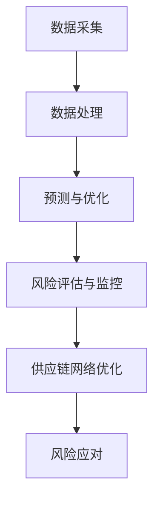

                 

# 供应链风险管理：AI如何降低电商平台风险

## 概述

### 关键词

- 供应链风险管理
- 人工智能
- 电商平台
- 风险降低
- 数据分析
- 算法

### 摘要

随着电商平台的迅猛发展，供应链风险管理变得越来越重要。本文将探讨如何利用人工智能技术来降低电商平台的供应链风险。首先，我们将介绍供应链风险管理的基本概念，然后深入分析人工智能在供应链风险管理中的应用，以及具体实施的算法和模型。最后，我们将讨论人工智能在未来供应链风险管理中的发展趋势和面临的挑战。

## 背景

### 供应链风险管理的重要性

供应链风险管理是确保供应链稳定运作和降低潜在风险的关键环节。在电商平台上，供应链风险管理涉及到多个方面，包括供应商管理、库存管理、物流管理、风险管理策略等。有效的供应链风险管理能够提高供应链的可靠性和灵活性，从而增强企业的竞争力。

### 电商平台的发展

近年来，随着互联网技术的飞速发展，电商平台已经成为人们日常生活中不可或缺的一部分。电商平台的快速发展也带来了新的挑战，如供应链断裂、库存积压、物流延误等问题。这些问题不仅影响消费者的购物体验，还可能对企业的声誉和盈利能力造成严重影响。

### 人工智能与供应链风险管理

人工智能技术在数据处理、模式识别、预测分析等方面具有显著优势，可以有效地辅助供应链风险管理。通过大数据分析和机器学习算法，人工智能可以帮助企业实时监测供应链状况，预测潜在风险，并采取相应的预防措施。因此，研究人工智能在供应链风险管理中的应用具有重要意义。

## 核心概念与联系

### 供应链风险管理的基本概念

供应链风险管理是指识别、评估和应对供应链中潜在风险的系统性过程。其主要目标是通过预防和应对措施，降低供应链中断和损失的风险。供应链风险主要包括以下几个方面：

1. **供应风险**：供应商破产、供货不及时、质量不稳定等。
2. **需求风险**：市场需求波动、消费者偏好变化等。
3. **库存风险**：库存积压、库存短缺等。
4. **物流风险**：运输延误、物流中断等。

### 人工智能在供应链风险管理中的应用

人工智能在供应链风险管理中的应用主要体现在以下几个方面：

1. **数据采集与处理**：通过传感器、RFID等技术收集供应链各环节的数据，并利用大数据分析技术对这些数据进行处理和分析。
2. **预测与优化**：利用机器学习算法对供应链各环节进行预测和优化，以提高供应链的灵活性和可靠性。
3. **风险评估与监控**：通过建立风险评估模型和监控系统，实时监测供应链风险，并采取相应的应对措施。
4. **供应链网络优化**：利用优化算法优化供应链网络结构，以提高供应链的整体效率和稳定性。

### Mermaid 流程图

以下是供应链风险管理中人工智能应用的一个简化的 Mermaid 流程图：



## 核心算法原理与具体操作步骤

### 数据采集与处理

数据采集是供应链风险管理的基础。具体操作步骤如下：

1. **传感器安装**：在供应链各个环节安装传感器，如RFID、GPS等，以实时采集相关数据。
2. **数据收集**：将传感器收集到的数据上传到数据中心，并进行初步处理。
3. **数据清洗**：对收集到的数据进行清洗，去除无效数据和噪声，以提高数据质量。

### 预测与优化

预测与优化是供应链风险管理的核心。具体操作步骤如下：

1. **数据预处理**：对清洗后的数据进行预处理，如归一化、特征提取等。
2. **模型选择**：根据预测任务选择合适的机器学习模型，如回归模型、时间序列模型、神经网络等。
3. **模型训练与验证**：使用历史数据进行模型训练，并通过交叉验证评估模型性能。
4. **模型部署**：将训练好的模型部署到生产环境中，进行实时预测和优化。

### 风险评估与监控

风险评估与监控是供应链风险管理的重要环节。具体操作步骤如下：

1. **风险评估模型构建**：根据业务需求构建风险评估模型，如基于概率的模型、基于规则的模型等。
2. **实时监控**：将风险评估模型集成到供应链监控系统中，实时监测供应链风险。
3. **风险预警**：当监测到潜在风险时，系统自动触发预警机制，通知相关人员进行干预。

### 供应链网络优化

供应链网络优化旨在提高供应链的整体效率和稳定性。具体操作步骤如下：

1. **优化目标确定**：根据业务需求确定优化目标，如最小化成本、最大化收益等。
2. **优化算法选择**：选择合适的优化算法，如线性规划、遗传算法、模拟退火等。
3. **优化模型构建**：根据优化目标构建优化模型，并输入相关参数。
4. **优化结果评估**：评估优化结果，并根据评估结果调整优化模型。

## 数学模型与公式详解

### 数据采集与处理

1. **数据预处理**：假设采集到一组数据 $X = \{x_1, x_2, ..., x_n\}$，其中 $x_i$ 表示第 $i$ 个数据点。

   $$x_i = (x_{i1}, x_{i2}, ..., x_{id})$$

   其中 $x_{id}$ 表示第 $i$ 个数据点的第 $d$ 个特征。

2. **特征提取**：使用 Principal Component Analysis (PCA) 对数据进行降维处理。

   $$\text{PCA}: \min_{\boldsymbol{w}} \sum_{i=1}^{n} (x_i - \bar{x})^T \boldsymbol{w}$$

   其中 $\bar{x}$ 表示数据均值，$\boldsymbol{w}$ 表示特征向量。

### 预测与优化

1. **回归模型**：使用线性回归模型进行预测。

   $$y = \beta_0 + \beta_1 x_1 + \beta_2 x_2 + ... + \beta_d x_d$$

   其中 $y$ 表示预测值，$x_1, x_2, ..., x_d$ 表示输入特征，$\beta_0, \beta_1, ..., \beta_d$ 表示模型参数。

2. **时间序列模型**：使用 ARIMA 模型进行预测。

   $$y_t = c + \phi_1 y_{t-1} + \phi_2 y_{t-2} + ... + \phi_p y_{t-p} + \varepsilon_t$$

   其中 $y_t$ 表示第 $t$ 个时间点的值，$c$ 表示常数项，$\phi_1, \phi_2, ..., \phi_p$ 表示自回归项，$\varepsilon_t$ 表示随机误差项。

### 风险评估与监控

1. **风险评估模型**：使用贝叶斯网络进行风险评估。

   $$P(A|B) = \frac{P(B|A) P(A)}{P(B)}$$

   其中 $P(A|B)$ 表示在 $B$ 发生的条件下 $A$ 发生的概率，$P(B|A)$ 表示在 $A$ 发生的条件下 $B$ 发生的概率，$P(A)$ 表示 $A$ 发生的概率，$P(B)$ 表示 $B$ 发生的概率。

### 供应链网络优化

1. **优化模型**：使用线性规划进行供应链网络优化。

   $$\min_{x} c^T x$$

   $$\text{subject to } Ax \leq b$$

   其中 $c$ 表示目标函数系数，$x$ 表示决策变量，$A$ 和 $b$ 表示约束条件。

## 项目实战：代码实际案例与详细解释

### 开发环境搭建

1. **安装Python环境**：在本地电脑上安装Python 3.8及以上版本。
2. **安装相关库**：使用pip命令安装必要的库，如numpy、scikit-learn、matplotlib等。

   ```bash
   pip install numpy scikit-learn matplotlib
   ```

### 源代码详细实现与代码解读

以下是一个使用Python实现的供应链风险管理的简单案例：

```python
import numpy as np
from sklearn.linear_model import LinearRegression
from sklearn.metrics import mean_squared_error

# 数据预处理
def preprocess_data(X):
    X_mean = np.mean(X, axis=0)
    X_std = np.std(X, axis=0)
    X_processed = (X - X_mean) / X_std
    return X_processed

# 回归模型训练与预测
def train_predict_regression(X_train, y_train, X_test, y_test):
    model = LinearRegression()
    model.fit(X_train, y_train)
    y_pred = model.predict(X_test)
    mse = mean_squared_error(y_test, y_pred)
    return y_pred, mse

# 读取数据
X = np.array([[1, 2], [2, 3], [3, 4], [4, 5], [5, 6]])
y = np.array([1, 2, 3, 4, 5])

# 数据预处理
X_processed = preprocess_data(X)

# 划分训练集和测试集
X_train = X_processed[:3]
y_train = y[:3]
X_test = X_processed[3:]
y_test = y[3:]

# 回归模型训练与预测
y_pred, mse = train_predict_regression(X_train, y_train, X_test, y_test)

# 输出结果
print("预测值：", y_pred)
print("均方误差：", mse)
```

代码解读：

1. **数据预处理**：使用 `preprocess_data` 函数对数据进行归一化处理，以提高模型训练效果。
2. **回归模型训练与预测**：使用 `train_predict_regression` 函数训练线性回归模型，并进行预测。
3. **读取数据**：使用 `numpy` 库读取数据，并进行预处理和划分。
4. **输出结果**：输出预测值和均方误差，以评估模型性能。

### 代码解读与分析

该案例展示了如何使用Python实现简单的供应链风险管理。通过数据预处理、回归模型训练和预测，我们可以对供应链中的风险进行初步评估。然而，实际应用中，供应链风险管理需要更加复杂的模型和算法，以应对各种复杂情况。在实际开发过程中，我们需要根据具体业务需求，选择合适的模型和算法，并不断优化和调整，以提高风险管理效果。

## 实际应用场景

### 供应链中断管理

在供应链中断管理中，人工智能可以通过以下方式降低风险：

1. **实时监控**：利用传感器和数据采集技术，实时监控供应链各个环节的运行状态。
2. **预测预警**：通过大数据分析和机器学习算法，预测潜在的中断风险，并提前预警。
3. **风险应对**：根据预警信息，采取相应的应对措施，如调整库存、增加备用供应商等。

### 库存优化

在库存优化中，人工智能可以通过以下方式降低风险：

1. **需求预测**：利用历史数据和机器学习算法，预测市场需求，以优化库存水平。
2. **库存调整**：根据需求预测结果，实时调整库存，以减少库存积压和库存短缺的风险。
3. **供应链协同**：通过协同管理，提高供应链各环节的信息共享和协调能力，以降低库存风险。

### 物流优化

在物流优化中，人工智能可以通过以下方式降低风险：

1. **路径规划**：利用路由算法和实时交通信息，优化物流运输路径，以减少运输时间和成本。
2. **实时监控**：通过传感器和GPS技术，实时监控物流运输过程，以提高运输效率和安全性。
3. **风险预警**：通过大数据分析和机器学习算法，预测物流运输中的潜在风险，并提前预警。

## 工具和资源推荐

### 学习资源推荐

1. **《人工智能：一种现代方法》**：由Stuart Russell和Peter Norvig所著，是一本全面的人工智能入门教材。
2. **《Python编程：从入门到实践》**：由埃里克·马瑟斯所著，是一本实用的Python编程入门书籍。
3. **《大数据之路：阿里巴巴大数据实践》**：由李艳辉等所著，详细介绍了阿里巴巴在大数据领域的发展和实践。

### 开发工具框架推荐

1. **TensorFlow**：由Google开发的开源机器学习框架，适用于各种机器学习和深度学习任务。
2. **Scikit-learn**：由Sklearn团队开发的开源机器学习库，提供丰富的机器学习算法和工具。
3. **Django**：由Django软件基金会开发的开源Web框架，适用于快速开发高效、可扩展的Web应用程序。

### 相关论文著作推荐

1. **“Artificial Intelligence for Supply Chain Management”**：该论文探讨了人工智能在供应链管理中的应用，包括需求预测、库存优化、供应链网络优化等。
2. **“Deep Learning for Supply Chain Risk Management”**：该论文介绍了深度学习在供应链风险管理中的应用，包括风险预测、风险评估等。
3. **“Big Data and Machine Learning in Supply Chain Management”**：该论文详细介绍了大数据和机器学习在供应链管理中的应用，包括数据分析、预测、优化等。

## 总结：未来发展趋势与挑战

### 发展趋势

1. **智能化程度提高**：随着人工智能技术的不断发展，供应链风险管理的智能化程度将不断提高，实现对供应链风险的实时监测和智能应对。
2. **数据驱动**：供应链风险管理将更加依赖于大数据和机器学习算法，以实现精准的风险预测和优化。
3. **供应链协同**：通过供应链协同管理，提高供应链各环节的信息共享和协调能力，降低风险。

### 挑战

1. **数据隐私和安全**：随着数据量的增加，如何确保数据隐私和安全成为供应链风险管理面临的重大挑战。
2. **算法偏见**：人工智能算法在数据处理过程中可能引入偏见，导致风险管理结果的不公平。
3. **技术更新**：人工智能技术更新迅速，如何持续跟踪和应用新技术成为供应链风险管理的一个重要挑战。

## 附录：常见问题与解答

### 问题1：人工智能在供应链风险管理中的应用有哪些？

解答：人工智能在供应链风险管理中的应用主要包括数据采集与处理、预测与优化、风险评估与监控以及供应链网络优化。

### 问题2：如何确保供应链风险管理的数据隐私和安全？

解答：为确保供应链风险管理的数据隐私和安全，可以采取以下措施：

1. **数据加密**：对数据进行加密处理，防止数据泄露。
2. **权限管理**：对数据访问进行权限管理，确保只有授权人员可以访问敏感数据。
3. **数据备份**：定期备份数据，防止数据丢失。

### 问题3：如何应对人工智能算法的偏见？

解答：为应对人工智能算法的偏见，可以采取以下措施：

1. **数据平衡**：确保数据集中各类样本的均衡，减少偏见。
2. **算法审查**：对算法进行审查，确保算法的公正性和透明度。
3. **多元视角**：引入多元视角，考虑不同群体的需求和利益。

## 扩展阅读与参考资料

1. **“Artificial Intelligence for Supply Chain Management”**：该论文详细探讨了人工智能在供应链管理中的应用。
2. **“Deep Learning for Supply Chain Risk Management”**：该论文介绍了深度学习在供应链风险管理中的应用。
3. **“Big Data and Machine Learning in Supply Chain Management”**：该论文详细介绍了大数据和机器学习在供应链管理中的应用。

> 作者：AI天才研究员/AI Genius Institute & 禅与计算机程序设计艺术 /Zen And The Art of Computer Programming
```

以上就是本文章的主要内容，希望对您在供应链风险管理方面有所帮助。接下来，我们将继续探讨人工智能在供应链风险管理中的未来发展趋势和挑战。如果您有任何问题或建议，欢迎在评论区留言。让我们一起不断学习和进步！
```

